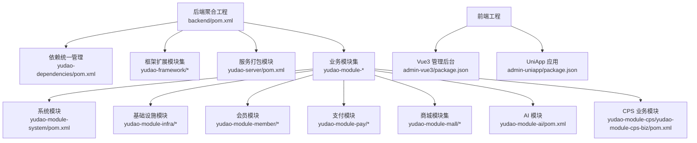
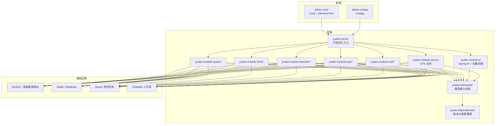
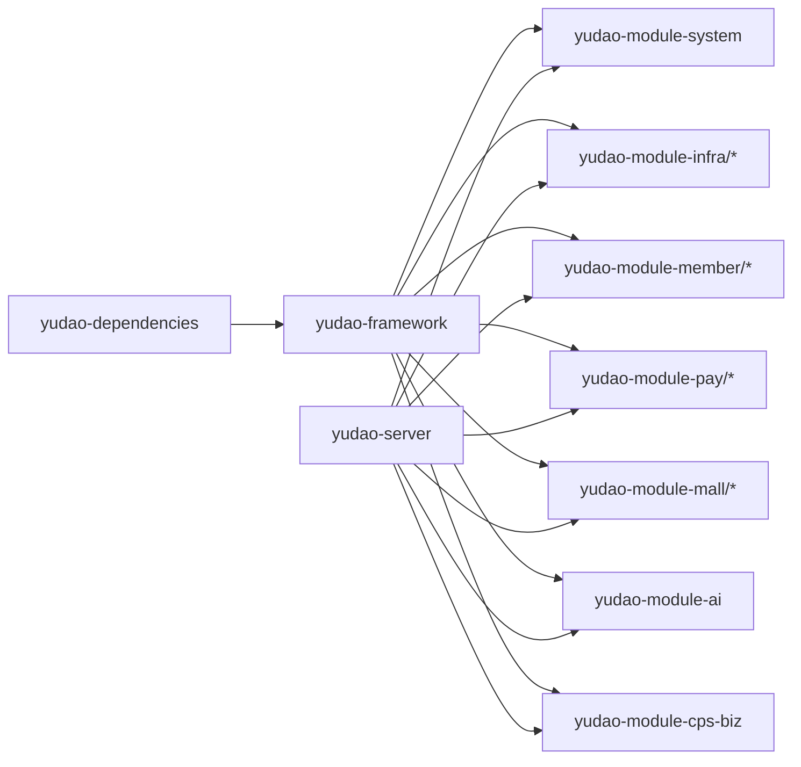

# 技术栈概览

<cite>
**本文引用的文件**
- [pom.xml](file://backend/pom.xml)
- [yudao-dependencies/pom.xml](file://backend/yudao-dependencies/pom.xml)
- [yudao-framework/yudao-spring-boot-starter-web/pom.xml](file://backend/yudao-framework/yudao-spring-boot-starter-web/pom.xml)
- [yudao-framework/yudao-spring-boot-starter-security/pom.xml](file://backend/yudao-framework/yudao-spring-boot-starter-security/pom.xml)
- [yudao-framework/yudao-spring-boot-starter-mybatis/pom.xml](file://backend/yudao-framework/yudao-spring-boot-starter-mybatis/pom.xml)
- [yudao-framework/yudao-spring-boot-starter-redis/pom.xml](file://backend/yudao-framework/yudao-spring-boot-starter-redis/pom.xml)
- [yudao-framework/yudao-spring-boot-starter-job/pom.xml](file://backend/yudao-framework/yudao-spring-boot-starter-job/pom.xml)
- [yudao-framework/yudao-spring-boot-starter-biz-tenant/pom.xml](file://backend/yudao-framework/yudao-spring-boot-starter-biz-tenant/pom.xml)
- [yudao-framework/yudao-spring-boot-starter-biz-data-permission/pom.xml](file://backend/yudao-framework/yudao-spring-boot-starter-biz-data-permission/pom.xml)
- [yudao-module-ai/pom.xml](file://backend/yudao-module-ai/pom.xml)
- [yudao-module-cps/yudao-module-cps-biz/pom.xml](file://backend/yudao-module-cps/yudao-module-cps-biz/pom.xml)
- [yudao-module-system/pom.xml](file://backend/yudao-module-system/pom.xml)
- [yudao-server/pom.xml](file://backend/yudao-server/pom.xml)
- [admin-vue3/package.json](file://frontend/admin-vue3/package.json)
- [admin-uniapp/package.json](file://frontend/admin-uniapp/package.json)
- [ruoyi-vue-pro.sql](file://backend/sql/mysql/ruoyi-vue-pro.sql)
</cite>

## 目录
1. [引言](#引言)
2. [项目结构](#项目结构)
3. [核心组件](#核心组件)
4. [架构总览](#架构总览)
5. [详细组件分析](#详细组件分析)
6. [依赖分析](#依赖分析)
7. [性能考虑](#性能考虑)
8. [故障排查指南](#故障排查指南)
9. [结论](#结论)
10. [附录](#附录)

## 引言
本文件面向 AgenticCPS 项目，提供技术栈概览与架构说明，重点覆盖后端技术栈（Spring Boot、Spring Security、Spring AI、MyBatis Plus、Redis、Flowable、Quartz 等）、前端技术栈（Vue 3 + Element Plus、UniApp）、数据库与多数据源支持、模块化设计（yudao-dependencies、yudao-framework、各业务模块）以及技术选型的考量与优势。目标是帮助开发者快速理解整体技术架构与各组件职责。

## 项目结构
AgenticCPS 采用前后端分离与多模块聚合的工程组织方式：
- 后端以 Maven 聚合工程为核心，包含依赖统一管理模块（yudao-dependencies）、框架扩展模块（yudao-framework）、业务模块（如 system、infra、member、pay、ai、cps 等）、以及打包运行的 server 模块（yudao-server）。
- 前端包含 Vue 3 管理后台（admin-vue3）与 UniApp 应用（admin-uniapp），分别服务于 PC 端与多端应用生态。

图表来源
- [pom.xml:10-25](file://backend/pom.xml#L10-L25)
- [yudao-server/pom.xml:23-99](file://backend/yudao-server/pom.xml#L23-L99)
- [yudao-module-system/pom.xml:20-122](file://backend/yudao-module-system/pom.xml#L20-L122)
- [yudao-module-ai/pom.xml:28-262](file://backend/yudao-module-ai/pom.xml#L28-L262)
- [yudao-module-cps/yudao-module-cps-biz/pom.xml:20-99](file://backend/yudao-module-cps/yudao-module-cps-biz/pom.xml#L20-L99)
- [admin-vue3/package.json:1-160](file://frontend/admin-vue3/package.json#L1-160)
- [admin-uniapp/package.json:1-194](file://frontend/admin-uniapp/package.json#L1-194)

章节来源
- [pom.xml:10-25](file://backend/pom.xml#L10-L25)
- [yudao-server/pom.xml:23-99](file://backend/yudao-server/pom.xml#L23-L99)

## 核心组件
- 后端核心框架
  - Spring Boot：统一版本由聚合工程与依赖管理模块控制，提供自动装配与运行时能力。
  - Spring Security：提供认证授权、操作日志等安全能力。
  - Spring AI：集成多模型厂商与向量存储，支撑 AI 工作流与 MCP 工具函数。
  - MyBatis Plus：提供 ORM、多数据源、联表查询、代码生成等能力。
  - Redis/Redisson：提供缓存、分布式锁等能力。
  - Quartz：提供定时任务能力。
  - Flowable：提供流程引擎能力（工作流）。
- 前端核心框架
  - Vue 3 + Element Plus：提供现代化前端交互与 UI 组件体系。
  - UniApp：提供跨平台应用开发能力，覆盖 APP/H5/小程序等多端。
- 数据库与多数据源
  - MySQL 为主库，同时支持 Oracle、PostgreSQL、SQLServer、达梦、人大金仓、华为 GaussDB、openGauss 等数据库驱动与适配。
- 模块化设计
  - yudao-dependencies：集中管理依赖版本与坐标。
  - yudao-framework：封装通用能力（Web、Security、MyBatis、Redis、Job、Tenant、Data Permission、MQ、Monitor、Excel 等）。
  - 业务模块：按领域拆分，如 system、member、pay、ai、cps 等，彼此通过依赖组合形成完整能力。

章节来源
- [yudao-dependencies/pom.xml:16-82](file://backend/yudao-dependencies/pom.xml#L16-L82)
- [yudao-framework/yudao-spring-boot-starter-web/pom.xml:18-79](file://backend/yudao-framework/yudao-spring-boot-starter-web/pom.xml#L18-L79)
- [yudao-framework/yudao-spring-boot-starter-security/pom.xml:21-62](file://backend/yudao-framework/yudao-spring-boot-starter-security/pom.xml#L21-L62)
- [yudao-framework/yudao-spring-boot-starter-mybatis/pom.xml:18-108](file://backend/yudao-framework/yudao-spring-boot-starter-mybatis/pom.xml#L18-L108)
- [yudao-framework/yudao-spring-boot-starter-redis/pom.xml:18-39](file://backend/yudao-framework/yudao-spring-boot-starter-redis/pom.xml#L18-L39)
- [yudao-framework/yudao-spring-boot-starter-job/pom.xml:21-39](file://backend/yudao-framework/yudao-spring-boot-starter-job/pom.xml#L21-L39)
- [yudao-module-ai/pom.xml:22-262](file://backend/yudao-module-ai/pom.xml#L22-L262)
- [yudao-module-cps/yudao-module-cps-biz/pom.xml:47-99](file://backend/yudao-module-cps/yudao-module-cps-biz/pom.xml#L47-L99)
- [yudao-module-system/pom.xml:27-122](file://backend/yudao-module-system/pom.xml#L27-L122)
- [admin-vue3/package.json:27-83](file://frontend/admin-vue3/package.json#L27-L83)
- [admin-uniapp/package.json:99-126](file://frontend/admin-uniapp/package.json#L99-L126)

## 架构总览
后端通过 yudao-server 聚合各业务模块，对外提供 REST API；前端通过 Vue 3 与 UniApp 分别对接管理后台与多端应用。数据层采用 MySQL 与 Redis，结合多数据源与缓存策略；AI 能力通过 Spring AI 与向量存储集成；工作流通过 Flowable；定时任务通过 Quartz。

图表来源
- [yudao-server/pom.xml:23-99](file://backend/yudao-server/pom.xml#L23-L99)
- [yudao-module-system/pom.xml:20-122](file://backend/yudao-module-system/pom.xml#L20-L122)
- [yudao-module-ai/pom.xml:28-262](file://backend/yudao-module-ai/pom.xml#L28-L262)
- [yudao-module-cps/yudao-module-cps-biz/pom.xml:20-99](file://backend/yudao-module-cps/yudao-module-cps-biz/pom.xml#L20-L99)
- [yudao-dependencies/pom.xml:84-686](file://backend/yudao-dependencies/pom.xml#L84-L686)

章节来源
- [yudao-server/pom.xml:23-99](file://backend/yudao-server/pom.xml#L23-L99)
- [yudao-dependencies/pom.xml:84-686](file://backend/yudao-dependencies/pom.xml#L84-L686)

## 详细组件分析

### 后端技术栈与版本
- Spring Boot 3.5.9：统一版本由聚合工程与依赖管理模块控制，确保各模块版本一致性。
- Spring Security：提供认证授权、操作日志等安全能力，作为 yudao-framework 的安全基石。
- Spring AI 1.1.2：集成多家大模型厂商与向量存储，支撑 AI 工作流与 MCP 工具函数。
- MyBatis Plus 3.5.15：ORM、多数据源、联表查询、代码生成等能力。
- Redis/Redisson：提供缓存与分布式锁能力。
- Quartz：提供定时任务能力。
- Flowable 7.2.0：提供流程引擎能力。

章节来源
- [pom.xml](file://backend/pom.xml#L42)
- [yudao-dependencies/pom.xml:20-49](file://backend/yudao-dependencies/pom.xml#L20-L49)
- [yudao-framework/yudao-spring-boot-starter-security/pom.xml](file://backend/yudao-framework/yudao-spring-boot-starter-security/pom.xml#L47)
- [yudao-framework/yudao-spring-boot-starter-mybatis/pom.xml:78-98](file://backend/yudao-framework/yudao-spring-boot-starter-mybatis/pom.xml#L78-L98)
- [yudao-framework/yudao-spring-boot-starter-redis/pom.xml:27-38](file://backend/yudao-framework/yudao-spring-boot-starter-redis/pom.xml#L27-L38)
- [yudao-framework/yudao-spring-boot-starter-job/pom.xml](file://backend/yudao-framework/yudao-spring-boot-starter-job/pom.xml#L30)
- [yudao-module-ai/pom.xml:22-26](file://backend/yudao-module-ai/pom.xml#L22-L26)

### 前端技术栈
- Vue 3 + Element Plus：提供现代化前端交互与 UI 组件体系，适合管理后台场景。
- UniApp：提供跨平台应用开发能力，覆盖 APP/H5/小程序等多端，满足移动端与多端统一开发需求。

章节来源
- [admin-vue3/package.json:27-83](file://frontend/admin-vue3/package.json#L27-L83)
- [admin-uniapp/package.json:99-126](file://frontend/admin-uniapp/package.json#L99-L126)

### 数据库与多数据源支持
- 主库：MySQL（8.2+），提供完善的表结构与日志表样例。
- 多数据库驱动：Oracle、PostgreSQL、SQLServer、达梦、人大金仓、openGauss 等，便于适配不同环境。
- 连接池与监控：Druid、Actuator、Admin 等能力由 yudao-dependencies 提供统一依赖管理。

章节来源
- [ruoyi-vue-pro.sql:1-200](file://backend/sql/mysql/ruoyi-vue-pro.sql#L1-L200)
- [yudao-dependencies/pom.xml:25-35](file://backend/yudao-dependencies/pom.xml#L25-L35)
- [yudao-framework/yudao-spring-boot-starter-mybatis/pom.xml:33-70](file://backend/yudao-framework/yudao-spring-boot-starter-mybatis/pom.xml#L33-L70)

### 模块化设计与职责划分
- yudao-dependencies：集中管理依赖版本与坐标，确保各模块版本一致性。
- yudao-framework：封装通用能力（Web、Security、MyBatis、Redis、Job、Tenant、Data Permission、MQ、Monitor、Excel 等），降低业务模块重复开发成本。
- 业务模块：
  - system：通用业务（用户、部门、权限、数据字典等）。
  - member/pay/mall/report/mp 等：围绕业务域的独立模块。
  - ai：AI 能力与 Spring AI 集成。
  - cps：CPS 联盟返利系统核心业务。
- yudao-server：聚合各业务模块，打包为可运行的服务。

章节来源
- [pom.xml:10-25](file://backend/pom.xml#L10-L25)
- [yudao-dependencies/pom.xml:84-686](file://backend/yudao-dependencies/pom.xml#L84-L686)
- [yudao-framework/yudao-spring-boot-starter-biz-tenant/pom.xml:18-81](file://backend/yudao-framework/yudao-spring-boot-starter-biz-tenant/pom.xml#L18-L81)
- [yudao-framework/yudao-spring-boot-starter-biz-data-permission/pom.xml:18-43](file://backend/yudao-framework/yudao-spring-boot-starter-biz-data-permission/pom.xml#L18-L43)
- [yudao-module-system/pom.xml:27-122](file://backend/yudao-module-system/pom.xml#L27-L122)
- [yudao-module-ai/pom.xml:28-262](file://backend/yudao-module-ai/pom.xml#L28-L262)
- [yudao-module-cps/yudao-module-cps-biz/pom.xml:20-99](file://backend/yudao-module-cps/yudao-module-cps-biz/pom.xml#L20-L99)
- [yudao-server/pom.xml:23-99](file://backend/yudao-server/pom.xml#L23-L99)

### 技术选型考量与优势
- Spring 生态统一：以 Spring Boot 3.5.9 为核心，配合 Spring Security、Spring AI、Quartz、Flowable 等，形成稳定的企业级开发基座。
- 多数据库与多数据源：通过 Druid、MyBatis Plus 与动态数据源支持，满足复杂环境下的数据访问需求。
- 前后端分离与多端覆盖：Vue 3 + Element Plus 适合管理后台，UniApp 覆盖多端，提升开发效率与用户体验。
- 模块化与可演进性：yudao-dependencies 与 yudao-framework 提供版本治理与通用能力复用，业务模块按需组合，便于持续演进。
- AI 能力集成：Spring AI 与向量存储、MCP 工具函数集成，为智能体与工作流提供强大支撑。

章节来源
- [pom.xml](file://backend/pom.xml#L42)
- [yudao-dependencies/pom.xml:84-686](file://backend/yudao-dependencies/pom.xml#L84-L686)
- [yudao-framework/yudao-spring-boot-starter-web/pom.xml:18-48](file://backend/yudao-framework/yudao-spring-boot-starter-web/pom.xml#L18-L48)
- [yudao-framework/yudao-spring-boot-starter-security/pom.xml:21-62](file://backend/yudao-framework/yudao-spring-boot-starter-security/pom.xml#L21-L62)
- [yudao-framework/yudao-spring-boot-starter-mybatis/pom.xml:18-108](file://backend/yudao-framework/yudao-spring-boot-starter-mybatis/pom.xml#L18-L108)
- [yudao-framework/yudao-spring-boot-starter-redis/pom.xml:18-39](file://backend/yudao-framework/yudao-spring-boot-starter-redis/pom.xml#L18-L39)
- [yudao-framework/yudao-spring-boot-starter-job/pom.xml:21-39](file://backend/yudao-framework/yudao-spring-boot-starter-job/pom.xml#L21-L39)
- [yudao-module-ai/pom.xml:22-262](file://backend/yudao-module-ai/pom.xml#L22-L262)
- [admin-vue3/package.json:27-83](file://frontend/admin-vue3/package.json#L27-L83)
- [admin-uniapp/package.json:99-126](file://frontend/admin-uniapp/package.json#L99-L126)

## 依赖分析
后端依赖关系以 yudao-dependencies 为中心，yudao-framework 对其进行能力封装，业务模块按需依赖 yudao-framework 与具体能力模块，yudao-server 聚合所有业务模块并打包运行。

图表来源
- [yudao-dependencies/pom.xml:84-686](file://backend/yudao-dependencies/pom.xml#L84-L686)
- [yudao-server/pom.xml:23-99](file://backend/yudao-server/pom.xml#L23-L99)
- [yudao-module-system/pom.xml:20-122](file://backend/yudao-module-system/pom.xml#L20-L122)
- [yudao-module-ai/pom.xml:28-262](file://backend/yudao-module-ai/pom.xml#L28-L262)
- [yudao-module-cps/yudao-module-cps-biz/pom.xml:20-99](file://backend/yudao-module-cps/yudao-module-cps-biz/pom.xml#L20-L99)

章节来源
- [yudao-dependencies/pom.xml:84-686](file://backend/yudao-dependencies/pom.xml#L84-L686)
- [yudao-server/pom.xml:23-99](file://backend/yudao-server/pom.xml#L23-L99)

## 性能考虑
- 数据库层
  - 使用 Druid 连接池与多数据源，结合 MyBatis Plus 的联表查询与代码生成，减少 SQL 开发成本与优化空间。
  - 多数据库驱动支持，便于在不同环境下选择最优数据库。
- 缓存层
  - Redis/Redisson 提供缓存与分布式锁，建议结合热点数据与并发场景合理设置过期策略与键命名规范。
- 定时任务与工作流
  - Quartz 与 Flowable 提供稳定的定时与流程能力，建议结合业务峰值与资源限制进行任务调度与流程实例并发控制。
- 前端性能
  - Vue 3 与 Element Plus 提供现代化组件与按需加载能力；UniApp 覆盖多端，注意资源体积与首屏加载优化。

章节来源
- [yudao-dependencies/pom.xml:25-35](file://backend/yudao-dependencies/pom.xml#L25-L35)
- [yudao-framework/yudao-spring-boot-starter-mybatis/pom.xml:74-98](file://backend/yudao-framework/yudao-spring-boot-starter-mybatis/pom.xml#L74-L98)
- [yudao-framework/yudao-spring-boot-starter-redis/pom.xml:27-38](file://backend/yudao-framework/yudao-spring-boot-starter-redis/pom.xml#L27-L38)
- [yudao-framework/yudao-spring-boot-starter-job/pom.xml](file://backend/yudao-framework/yudao-spring-boot-starter-job/pom.xml#L30)
- [admin-vue3/package.json:27-83](file://frontend/admin-vue3/package.json#L27-L83)
- [admin-uniapp/package.json:99-126](file://frontend/admin-uniapp/package.json#L99-L126)

## 故障排查指南
- 依赖版本冲突
  - 使用 yudao-dependencies 集中管理版本，避免 Spring Boot、MyBatis、Redisson、Quartz、Flowable 等版本不一致导致的兼容问题。
- 数据库连接与多数据源
  - 检查 Druid 连接池配置与目标数据库驱动是否正确引入；确认多数据源路由逻辑与事务传播行为。
- 缓存与分布式锁
  - 核对 Redis 地址、密码与序列化配置；检查分布式锁的超时与释放策略。
- 定时任务与工作流
  - 核对 Quartz 表结构与初始化脚本；检查 Flowable 的流程定义与引擎配置。
- 前端构建与运行
  - 确认 Node.js 与 pnpm 版本要求；检查包依赖安装与构建模式配置。

章节来源
- [yudao-dependencies/pom.xml:84-686](file://backend/yudao-dependencies/pom.xml#L84-L686)
- [yudao-framework/yudao-spring-boot-starter-mybatis/pom.xml:74-98](file://backend/yudao-framework/yudao-spring-boot-starter-mybatis/pom.xml#L74-L98)
- [yudao-framework/yudao-spring-boot-starter-redis/pom.xml:27-38](file://backend/yudao-framework/yudao-spring-boot-starter-redis/pom.xml#L27-L38)
- [yudao-framework/yudao-spring-boot-starter-job/pom.xml](file://backend/yudao-framework/yudao-spring-boot-starter-job/pom.xml#L30)
- [admin-vue3/package.json:155-158](file://frontend/admin-vue3/package.json#L155-L158)
- [admin-uniapp/package.json:25-28](file://frontend/admin-uniapp/package.json#L25-L28)

## 结论
AgenticCPS 采用成熟稳定的 Spring 生态与多数据库/多端技术栈，结合 yudao-dependencies 与 yudao-framework 的模块化封装，形成高内聚、低耦合的可演进架构。后端通过 yudao-server 聚合业务模块，前端通过 Vue 3 与 UniApp 覆盖管理后台与多端场景，AI 能力通过 Spring AI 与向量存储深度集成，为智能体与工作流提供强大支撑。该架构在保证开发效率的同时，兼顾性能与可维护性。

## 附录
- 数据库初始化样例：MySQL 示例脚本包含 API 访问日志、异常日志、代码生成表等结构，可用于本地开发与测试。
- 前端工程脚本：包含开发、构建、预览与质量检查脚本，便于团队协作与 CI/CD 集成。

章节来源
- [ruoyi-vue-pro.sql:21-200](file://backend/sql/mysql/ruoyi-vue-pro.sql#L21-L200)
- [admin-vue3/package.json:7-26](file://frontend/admin-vue3/package.json#L7-L26)
- [admin-uniapp/package.json:29-97](file://frontend/admin-uniapp/package.json#L29-L97)