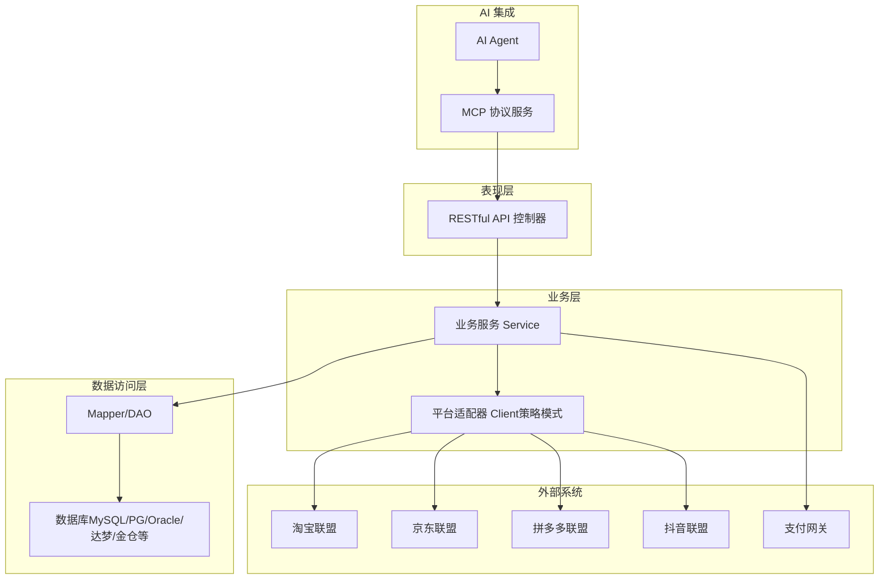
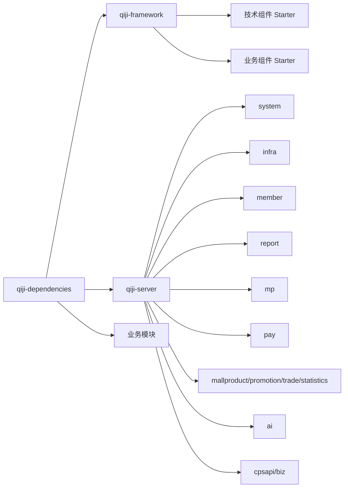
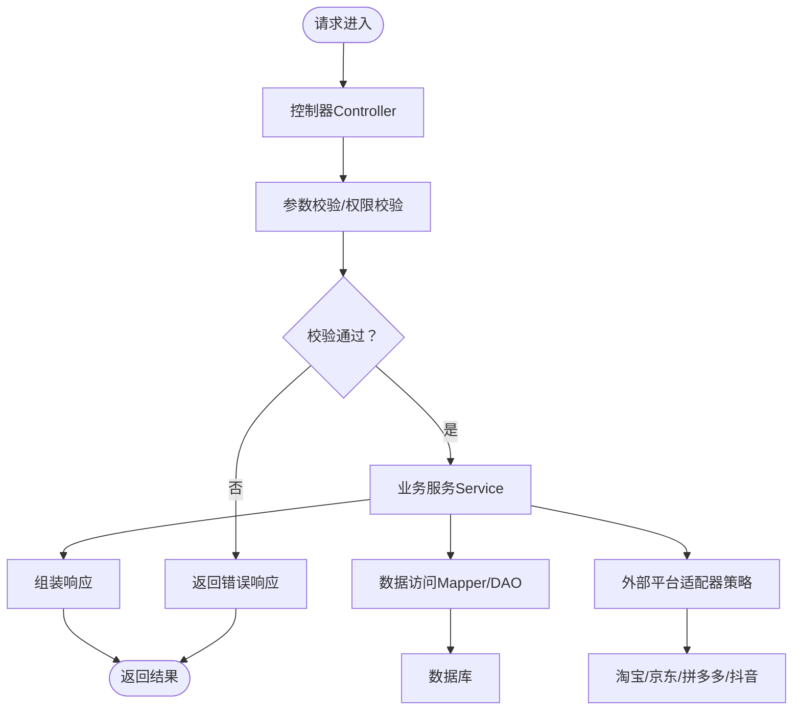
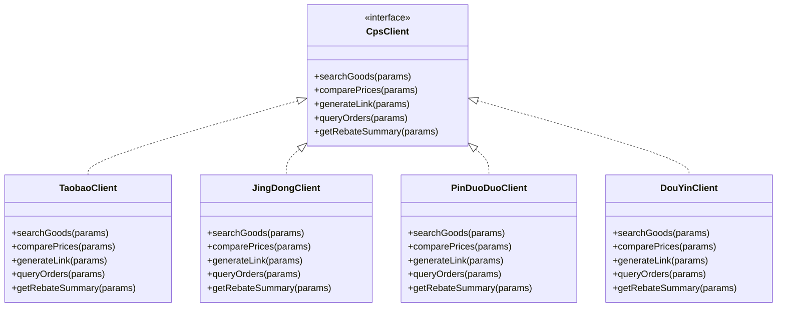
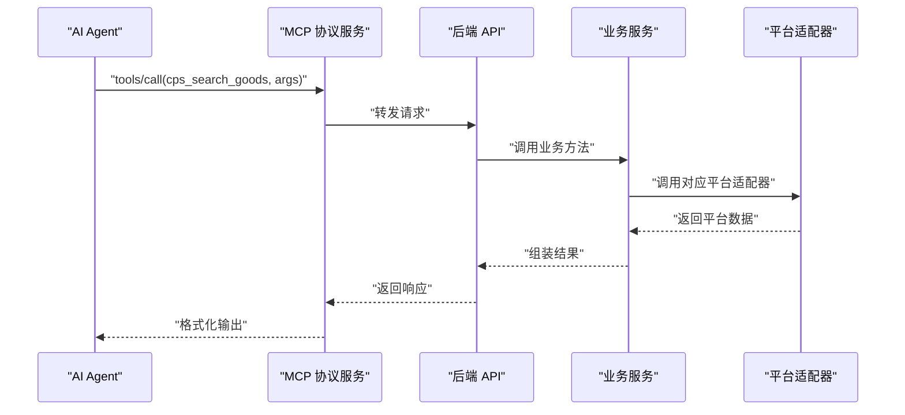
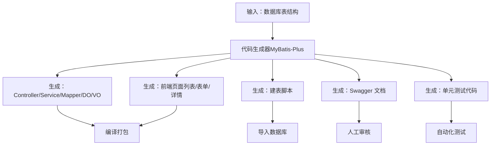
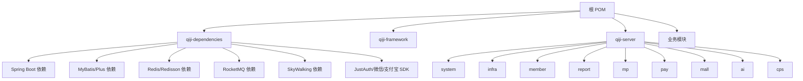

```mermaid
graph TB
Root["根 POM后端<br/>聚合模块与版本管理"] --> Deps["qiji-dependencies<br/>统一依赖版本"]
Root --> Fwk["qiji-framework<br/>技术组件聚合"]
Root --> Srv["qiji-server<br/>服务端聚合容器"]
Root --> Mods["业务模块集合<br/>system/infra/member/pay/mall/ai/mp/report/cps"]
Fwk --> FwkMyBatis["qiji-spring-boot-starter-mybatis"]
Fwk --> FwkRedis["qiji-spring-boot-starter-redis"]
Fwk --> FwkWeb["qiji-spring-boot-starter-web"]
Fwk --> FwkSec["qiji-spring-boot-starter-security"]
Fwk --> FwkWs["qiji-spring-boot-starter-websocket"]
Fwk --> FwkJob["qiji-spring-boot-starter-job"]
Fwk --> FwkMQ["qiji-spring-boot-starter-mq"]
Fwk --> FwkMon["qiji-spring-boot-starter-monitor"]
Fwk --> FwkProt["qiji-spring-boot-starter-protection"]
Fwk --> FwkBizTenant["qiji-spring-boot-starter-biz-tenant"]
Fwk --> FwkBizPerm["qiji-spring-boot-starter-biz-data-permission"]
Fwk --> FwkBizIP["qiji-spring-boot-starter-biz-ip"]
Fwk --> FwkExcel["qiji-spring-boot-starter-excel"]
Fwk --> FwkTest["qiji-spring-boot-starter-test"]
Srv --> SrvSys["qiji-module-system"]
Srv --> SrvInfra["qiji-module-infra"]
Srv --> SrvMember["qiji-module-member"]
Srv --> SrvReport["qiji-module-report"]
Srv --> SrvMP["qiji-module-mp"]
Srv --> SrvPay["qiji-module-pay"]
Srv --> SrvMall["qiji-module-mall含 product/promotion/trade/statistics"]
Srv --> SrvAI["qiji-module-ai"]
Srv --> SrvCPS["qiji-module-cps含 cps-api + cps-biz"]
```

# 架构总览

<cite>
**本文引用的文件**   
- [根 POM（后端）](file://backend/pom.xml)
- [依赖管理（qiji-dependencies）](file://backend/qiji-dependencies/pom.xml)
- [框架聚合（qiji-framework）](file://backend/qiji-framework/pom.xml)
- [服务端聚合（qiji-server）](file://backend/qiji-server/pom.xml)
- [项目总览（README）](file://README.md)
</cite>

## 目录
1. [简介](#简介)
2. [项目结构](#项目结构)
3. [核心组件](#核心组件)
4. [架构总览](#架构总览)
5. [详细组件分析](#详细组件分析)
6. [依赖分析](#依赖分析)
7. [性能考虑](#性能考虑)
8. [故障排查指南](#故障排查指南)
9. [结论](#结论)
10. [附录](#附录)

## 简介
AgenticCPS 是一个“一人公司”的智能返利赚钱平台，融合 Vibe Coding、低代码与 AI 自主编程，实现“自然语言描述 → AI 编码 → AI 测试 → AI 交付”。后端采用模块化与分层架构，以 Maven 多模块聚合管理，核心理念包括：
- 策略模式的平台适配器设计：统一抽象多平台（淘宝、京东、拼多多、抖音）接入，便于扩展新平台。
- MCP 协议的 AI 集成：通过 MCP 提供标准化 AI Tools，使任意 AI Agent 无需编码即可调用系统能力。
- 低代码生成器：基于 MyBatis-Plus 代码生成器，一键生成前后端代码与测试，覆盖 80% 的管理后台场景。

## 项目结构
后端采用 Maven 多模块聚合结构，顶层 POM 聚合四大层次：
- 依赖版本管理（qiji-dependencies）
- 框架扩展（qiji-framework）
- 业务模块（qiji-module-*）
- 服务端聚合（qiji-server）

**图表来源**
- [根 POM（后端）:10-25](file://backend/pom.xml#L10-L25)
- [依赖管理（qiji-dependencies）:84-687](file://backend/qiji-dependencies/pom.xml#L84-L687)
- [框架聚合（qiji-framework）:12-31](file://backend/qiji-framework/pom.xml#L12-L31)
- [服务端聚合（qiji-server）:23-114](file://backend/qiji-server/pom.xml#L23-L114)

**章节来源**
- [根 POM（后端）:10-25](file://backend/pom.xml#L10-L25)
- [依赖管理（qiji-dependencies）:16-82](file://backend/qiji-dependencies/pom.xml#L16-L82)
- [框架聚合（qiji-framework）:12-31](file://backend/qiji-framework/pom.xml#L12-L31)
- [服务端聚合（qiji-server）:23-114](file://backend/qiji-server/pom.xml#L23-L114)
- [项目总览（README）:267-285](file://README.md#L267-L285)

## 核心组件
- 依赖版本管理（qiji-dependencies）
  - 通过 dependencyManagement 统一管理 Spring Boot、MyBatis、Redis、RocketMQ、SkyWalking、JustAuth、微信/支付宝 SDK 等版本，确保全站一致性。
- 框架扩展（qiji-framework）
  - 技术组件与业务组件两类：技术组件（Web、Security、Redis、MyBatis、WebSocket、Job、MQ、Monitor、Protection、Excel、Test 等）；业务组件（多租户、数据权限、IP 校验等）。
- 服务端聚合（qiji-server）
  - 作为“容器”引入各业务模块，打包为可执行 JAR，提供 RESTful API。
- 业务模块
  - 系统管理、基础设施、会员中心、报表大屏、支付、商城（商品/促销/交易/统计）、AI、微信公众号、CPS 联盟返利等。

**章节来源**
- [依赖管理（qiji-dependencies）:84-687](file://backend/qiji-dependencies/pom.xml#L84-L687)
- [框架聚合（qiji-framework）:33-46](file://backend/qiji-framework/pom.xml#L33-L46)
- [服务端聚合（qiji-server）:23-114](file://backend/qiji-server/pom.xml#L23-L114)
- [项目总览（README）:267-285](file://README.md#L267-L285)

## 架构总览
AgenticCPS 采用模块化与分层架构：
- 模块化：以 Maven 多模块划分领域边界，降低耦合，提升可维护性与可扩展性。
- 分层架构：
  - 表现层：RESTful API（Spring MVC），提供统一入口。
  - 业务层：Service 层承载业务逻辑，协调 DAL 与外部平台适配器。
  - 数据访问层：MyBatis-Plus Mapper/DAO，配合多数据源与动态数据源支持。
- 核心设计理念：
  - 策略模式平台适配器：CPS 模块通过客户端适配器策略，屏蔽多平台差异，新增平台只需实现统一接口。
  - MCP 协议：对外暴露标准化 AI Tools，AI Agent 无需编码即可调用。
  - 低代码生成器：基于 MyBatis-Plus Generator 与前端模板，一键生成 CRUD 代码与页面。

**图表来源**
- [服务端聚合（qiji-server）:23-114](file://backend/qiji-server/pom.xml#L23-L114)
- [项目总览（README）:229-249](file://README.md#L229-L249)

## 详细组件分析

### 模块化设计与组织关系
- 依赖版本管理（qiji-dependencies）
  - 通过 dependencyManagement 集中管理版本，避免“版本漂移”，并提供 Starter 与第三方 SDK 的统一坐标。
- 框架扩展（qiji-framework）
  - 将常用技术能力封装为 Starter，降低重复配置成本，提升一致性与可维护性。
- 业务模块
  - 按领域拆分，如 mall（商品/促销/交易/统计）、member、pay、ai、mp、report、system、infra、cps 等，职责清晰、边界明确。
- 服务端聚合（qiji-server）
  - 仅负责装配模块，不包含业务逻辑，保持“容器”特性，便于按需启用模块。

**图表来源**
- [根 POM（后端）:10-25](file://backend/pom.xml#L10-L25)
- [依赖管理（qiji-dependencies）:84-687](file://backend/qiji-dependencies/pom.xml#L84-L687)
- [框架聚合（qiji-framework）:12-31](file://backend/qiji-framework/pom.xml#L12-L31)
- [服务端聚合（qiji-server）:23-114](file://backend/qiji-server/pom.xml#L23-L114)

**章节来源**
- [根 POM（后端）:10-25](file://backend/pom.xml#L10-L25)
- [依赖管理（qiji-dependencies）:84-687](file://backend/qiji-dependencies/pom.xml#L84-L687)
- [框架聚合（qiji-framework）:12-31](file://backend/qiji-framework/pom.xml#L12-L31)
- [服务端聚合（qiji-server）:23-114](file://backend/qiji-server/pom.xml#L23-L114)

### 分层架构与职责划分
- 表现层（API 控制器）
  - 负责接收请求、参数校验、鉴权与响应封装，调用业务层处理。
- 业务层（Service）
  - 聚合领域逻辑，协调数据访问与外部平台适配器，保证业务规则与事务控制。
- 数据访问层（Mapper/DAO）
  - 基于 MyBatis-Plus，提供通用 CRUD 与联表查询能力，支持多数据源与动态数据源。

**图表来源**
- [服务端聚合（qiji-server）:23-114](file://backend/qiji-server/pom.xml#L23-L114)
- [依赖管理（qiji-dependencies）:174-217](file://backend/qiji-dependencies/pom.xml#L174-L217)

**章节来源**
- [服务端聚合（qiji-server）:23-114](file://backend/qiji-server/pom.xml#L23-L114)
- [依赖管理（qiji-dependencies）:174-217](file://backend/qiji-dependencies/pom.xml#L174-L217)

### 核心设计理念详解

#### 策略模式的平台适配器设计
- 目标：统一多平台（淘宝/京东/拼多多/抖音）接入，屏蔽差异，便于扩展。
- 实现：CPS 模块提供统一 Client 接口与多种实现，运行时按配置选择具体适配器。
- 优势：新增平台只需实现统一接口并注册，无需改动上层业务。

**图表来源**
- [项目总览（README）:229-249](file://README.md#L229-L249)

**章节来源**
- [项目总览（README）:229-249](file://README.md#L229-L249)

#### MCP 协议的 AI 集成
- 目标：让 AI Agent 无需编码即可调用系统能力。
- 实现：通过 MCP 协议暴露 5 个 AI Tools（商品搜索、多平台比价、推广链接生成、订单查询、返利汇总）。
- 优势：降低 AI 集成门槛，快速扩展生态。

**图表来源**
- [项目总览（README）:185-209](file://README.md#L185-L209)

**章节来源**
- [项目总览（README）:185-209](file://README.md#L185-L209)

#### 低代码生成器的实现原理
- 目标：输入数据库表结构，一键生成前后端代码与测试。
- 实现：基于 MyBatis-Plus Generator 生成 Java 代码，结合前端模板生成页面与接口文档。
- 优势：覆盖 80% 的管理后台场景，显著提升开发效率。

**图表来源**
- [项目总览（README）:147-184](file://README.md#L147-L184)

**章节来源**
- [项目总览（README）:147-184](file://README.md#L147-L184)

## 依赖分析
- 依赖版本管理
  - 通过 qiji-dependencies 的 dependencyManagement 集中管理 Spring Boot、MyBatis、Redis、RocketMQ、SkyWalking、JustAuth、微信/支付宝 SDK 等，避免版本冲突。
- 模块间依赖
  - qiji-server 作为容器，按需引入业务模块；qiji-framework 为各模块提供技术组件（Starter）。
- 外部依赖
  - 支持多数据库（MySQL、Oracle、PostgreSQL、SQLServer、达梦、人大金仓、openGauss），通过动态数据源与 MyBatis-Plus Join 支持联表查询。

**图表来源**
- [根 POM（后端）:47-57](file://backend/pom.xml#L47-L57)
- [依赖管理（qiji-dependencies）:84-687](file://backend/qiji-dependencies/pom.xml#L84-L687)
- [服务端聚合（qiji-server）:23-114](file://backend/qiji-server/pom.xml#L23-L114)

**章节来源**
- [根 POM（后端）:47-57](file://backend/pom.xml#L47-L57)
- [依赖管理（qiji-dependencies）:84-687](file://backend/qiji-dependencies/pom.xml#L84-L687)
- [服务端聚合（qiji-server）:23-114](file://backend/qiji-server/pom.xml#L23-L114)

## 性能考虑
- 搜索与比价
  - 单平台搜索 P99 < 2 秒，多平台比价 P99 < 5 秒，确保用户体验。
- 转链与订单同步
  - 转链生成 < 1 秒；订单同步延迟 < 30 分钟；返利入账平台结算后 24 小时内。
- MCP Tool 调用
  - 搜索类 < 3 秒，查询类 < 1 秒。
- 技术手段
  - 使用 Redis 缓存热点数据，MyBatis-Plus 优化查询，SkyWalking 链路追踪定位瓶颈。

**章节来源**
- [项目总览（README）:369-379](file://README.md#L369-L379)

## 故障排查指南
- 依赖冲突
  - 使用 qiji-dependencies 的 dependencyManagement，避免版本漂移导致的冲突。
- 模块装配
  - qiji-server 默认注释部分模块依赖，按需取消注释以启用对应模块，减少编译时间。
- 数据库与多数据源
  - 通过 dynamic-datasource-spring-boot3-starter 与 mybatis-plus-join-boot-starter 配置多数据源与联表查询。
- 监控与追踪
  - 启用 SkyWalking 与 Spring Boot Admin，结合日志中心定位问题。

**章节来源**
- [依赖管理（qiji-dependencies）:181-217](file://backend/qiji-dependencies/pom.xml#L181-L217)
- [服务端聚合（qiji-server）:35-61](file://backend/qiji-server/pom.xml#L35-L61)

## 结论
AgenticCPS 通过模块化与分层架构，结合策略模式平台适配器、MCP 协议 AI 集成与低代码生成器，实现了高扩展、易维护、高性能的一人公司级 CPS 平台。依赖版本集中管理与 Starter 技术组件进一步降低了开发与运维成本，适合快速扩展与规模化部署。

## 附录
- 快速开始与端口映射
  - 后端 48080 → 48080，MySQL 3306 → 3306，Redis 6379 → 6379，前端 80 → 8080。
- Docker 一键部署
  - 使用 docker-compose 拉起 MySQL、Redis、后端服务与前端面板。

**章节来源**
- [项目总览（README）:335-351](file://README.md#L335-L351)