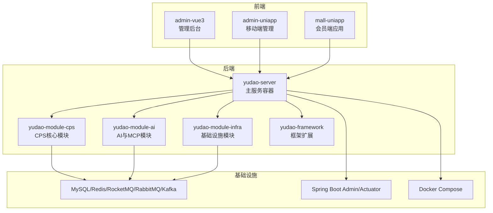
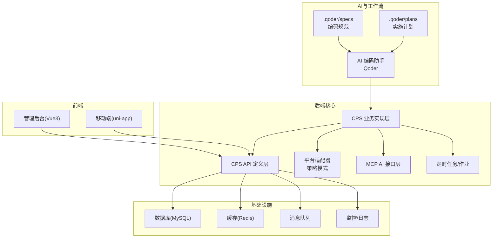
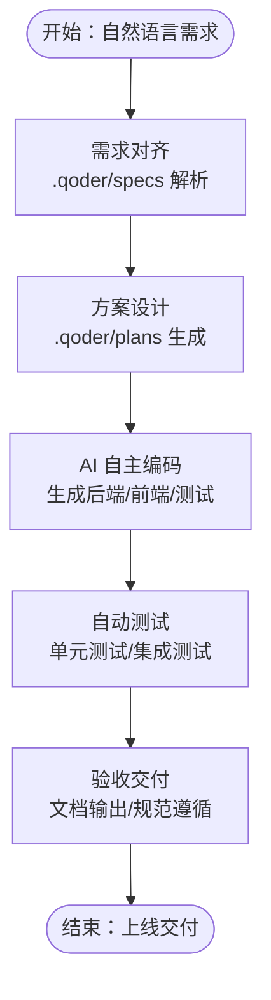
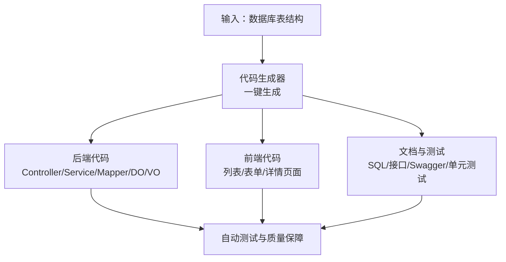
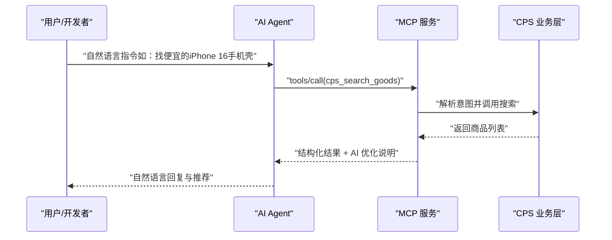
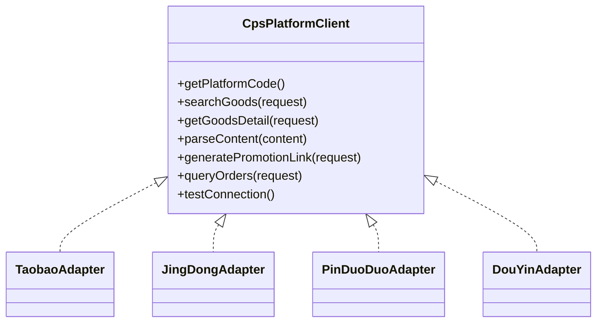
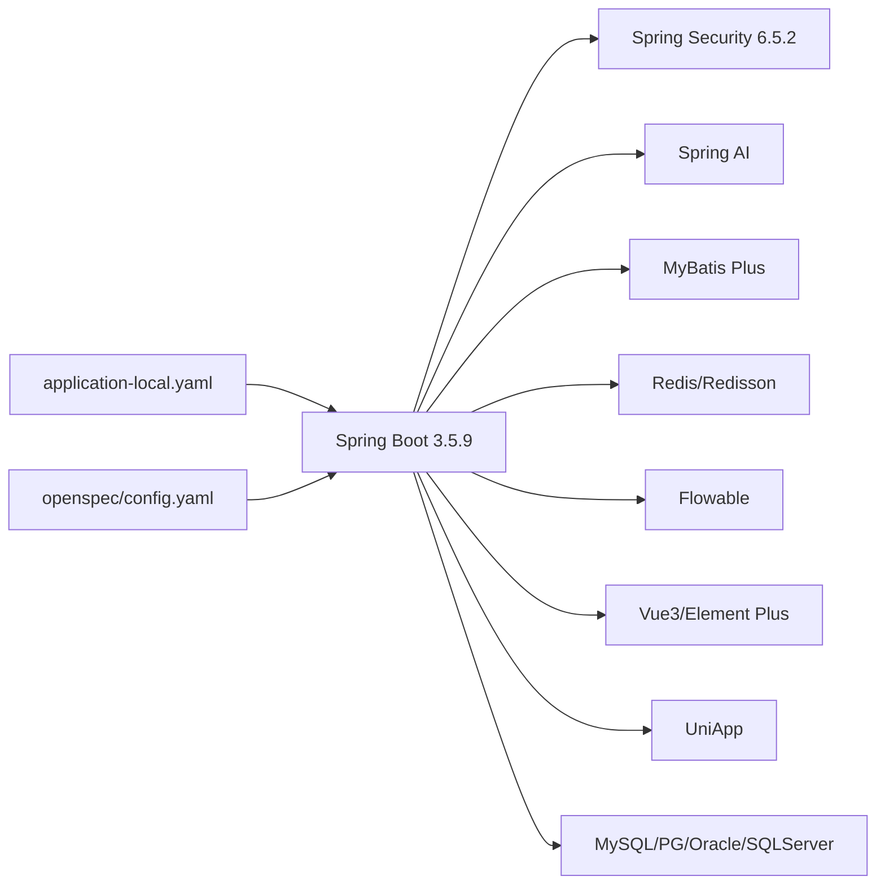

# 核心价值与优势

<cite>
**本文引用的文件**   
- [README.md](file://README.md)
- [AGENTS.md](file://AGENTS.md)
- [CPS系统PRD文档.md](file://docs/CPS系统PRD文档.md)
- [application-local.yaml](file://backend/yudao-server/src/main/resources/application-local.yaml)
- [config.yaml](file://openspec/config.yaml)
</cite>

## 目录
1. [简介](#简介)
2. [项目结构](#项目结构)
3. [核心组件](#核心组件)
4. [架构总览](#架构总览)
5. [详细组件分析](#详细组件分析)
6. [依赖关系分析](#依赖关系分析)
7. [性能考量](#性能考量)
8. [故障排查指南](#故障排查指南)
9. [结论](#结论)
10. [附录](#附录)

## 简介
AgenticCPS 是面向“一人公司（OPC）”创业场景的智能返利赚钱平台，融合 Vibe Coding（氛围编程）、低代码与 AI 自主编程，提供从自然语言到代码实现的完整自动化流程。其核心价值在于以极低团队规模、极短开发周期、极低技术门槛、极强平台对接能力与极低运维成本，支撑 CPS 联盟返利与导购业务的快速落地与持续演进。

## 项目结构
- 后端采用多模块 Maven 架构，核心模块为 yudao-module-cps，包含 API 定义层与业务实现层，后者进一步细分为控制器、服务、平台适配器、数据访问层、定时任务与 MCP AI 接口层。
- 前端包含 Vue3 管理后台、uni-app 移动端应用，覆盖管理端与会员端两大使用场景。
- 开发与运维侧提供 Docker 编排、CI/CD 流水线、监控与日志、AI MCP 协议对接等基础设施。

**图示来源**
- [AGENTS.md: 13-57:13-57](file://AGENTS.md#L13-L57)
- [README.md: 229-249:229-249](file://README.md#L229-L249)

**章节来源**
- [AGENTS.md: 13-57:13-57](file://AGENTS.md#L13-L57)
- [README.md: 229-249:229-249](file://README.md#L229-L249)

## 核心组件
- Vibe Coding 与规范化 AI 编程：通过 .qoder/specs 与 .qoder/plans 确保 AI 理解无偏差，实现“需求对齐 → 方案设计 → 自主编码 → 自动测试 → 验收交付”的闭环。
- 低代码能力：代码生成器一键生成 CRUD 前后端代码；可视化工作流与报表/大屏设计器；MCP 协议零代码接入 AI Agent。
- CPS 平台适配器：基于策略模式的可插拔扩展，内置淘宝/京东/拼多多/抖音适配器，新增平台只需实现统一接口并注册 Bean。
- MCP AI 接口层：提供商品搜索、多平台比价、推广链接生成、订单查询、返利汇总等 5 个开箱即用工具，JSON-RPC over Streamable HTTP。
- 运维与监控：定时任务自动同步订单、异常自动告警；Druid 监控、Spring Boot Admin、Actuator 指标暴露；Docker Compose 一键拉起。

**章节来源**
- [README.md: 84-144:84-144](file://README.md#L84-L144)
- [README.md: 147-210:147-210](file://README.md#L147-L210)
- [AGENTS.md: 141-185:141-185](file://AGENTS.md#L141-L185)

## 架构总览
AgenticCPS 的技术架构围绕“模块化后端 + 低代码前端 + AI MCP 协议 + 规范化工作流”展开，强调“开箱即用、AI 扩展、零代码接入”。

**图示来源**
- [README.md: 113-144:113-144](file://README.md#L113-L144)
- [AGENTS.md: 161-168:161-168](file://AGENTS.md#L161-L168)

## 详细组件分析

### 组件A：Vibe Coding 与规范化 AI 编程
- 工作流：需求对齐 → 方案设计 → AI 自主编码 → 自动测试 → 验收交付。
- 优势：需求精准对齐、方案先行、纯 AI 自主编程、质量可保障、持续自进化。
- 实例：CPS 核心模块 20,000+ 行代码由 AI 自主编程完成，覆盖数据库设计、API 接口、业务逻辑、单元测试、定时任务与 MCP 接口层。

**图示来源**
- [README.md: 113-144:113-144](file://README.md#L113-L144)

**章节来源**
- [README.md: 84-144:84-144](file://README.md#L84-L144)

### 组件B：低代码与代码生成器
- 能力：输入数据库表结构，一键生成 Java 控制器/服务/映射/实体/视图对象、Vue3 前端页面（列表/表单/详情）、SQL 建表脚本、Swagger 文档、单元测试代码。
- 支持：单表、树表、主子表三种模式，覆盖 80% 的管理后台开发场景。
- 价值：将“从零到一”的 CRUD 开发从数天缩短至“一键生成”，显著降低开发成本与交付风险。

**图示来源**
- [README.md: 151-163:151-163](file://README.md#L151-L163)

**章节来源**
- [README.md: 147-163:147-163](file://README.md#L147-L163)

### 组件C：MCP 协议 AI Agent 零代码接入
- 能力：通过 MCP（Model Context Protocol）协议，AI Agent 无需写一行代码即可直接调用系统工具与资源。
- 工具：cps_search_goods、cps_compare_prices、cps_generate_link、cps_query_orders、cps_get_rebate_summary。
- 价值：将 ChatGPT、Claude 等 AI 助手无缝接入 CPS 能力，实现“自然语言 → 商品搜索/比价/转链/查询/汇总”的端到端自动化。

**图示来源**
- [README.md: 185-210:185-210](file://README.md#L185-L210)
- [AGENTS.md: 161-168:161-168](file://AGENTS.md#L161-L168)

**章节来源**
- [README.md: 185-210:185-210](file://README.md#L185-L210)
- [AGENTS.md: 161-168:161-168](file://AGENTS.md#L161-L168)

### 组件D：CPS 平台适配器（策略模式）
- 能力：统一接口 CpsPlatformClient，内置淘宝/京东/拼多多/抖音适配器，新增平台只需实现接口并注册 Bean。
- 价值：平台对接从“每个平台单独开发”变为“按接口扩展”，显著降低集成成本与维护复杂度。

**图示来源**
- [AGENTS.md: 143-159:143-159](file://AGENTS.md#L143-L159)

**章节来源**
- [AGENTS.md: 143-159:143-159](file://AGENTS.md#L143-L159)

### 组件E：运营与数据看板
- 能力：订单/佣金/返利/利润实时统计；多平台占比、TOP 会员返利排行；提现审核、风控规则配置。
- 价值：一人公司也能掌握全局运营数据，实现“从运营到决策”的闭环。

**章节来源**
- [CPS系统PRD文档.md: 620-642:620-642](file://docs/CPS系统PRD文档.md#L620-L642)

## 依赖关系分析
- 技术栈与版本：Spring Boot 3.5.9、Spring Security 6.5.2、Spring AI、MyBatis Plus、Redis/Redisson、Flowable、Vue3 + Element Plus、UniApp、MySQL/PostgreSQL/Oracle/SQLServer 等多数据库支持。
- 配置与环境：本地开发通过 application-local.yaml 配置数据库、缓存、消息队列、监控与第三方平台密钥；支持 Docker Compose 一键部署。
- 规范与上下文：openspec/config.yaml 提供规范驱动的项目上下文与制品规则，确保 AI 生成产物的一致性与可维护性。

**图示来源**
- [README.md: 267-302:267-302](file://README.md#L267-L302)
- [application-local.yaml: 1-294:1-294](file://backend/yudao-server/src/main/resources/application-local.yaml#L1-L294)
- [config.yaml: 1-21:1-21](file://openspec/config.yaml#L1-L21)

**章节来源**
- [README.md: 267-302:267-302](file://README.md#L267-L302)
- [application-local.yaml: 1-294:1-294](file://backend/yudao-server/src/main/resources/application-local.yaml#L1-L294)
- [config.yaml: 1-21:1-21](file://openspec/config.yaml#L1-L21)

## 性能考量
- 搜索与比价：单平台搜索 P99 < 2 秒，多平台比价 P99 < 5 秒，转链生成 < 1 秒。
- 订单同步：每 5 分钟增量同步，订单同步延迟 < 30 分钟，平台结算后 24 小时内返利入账。
- MCP 工具：搜索类 < 3 秒，查询类 < 1 秒，保障 AI Agent 交互体验。

**章节来源**
- [README.md: 332-342:332-342](file://README.md#L332-L342)

## 故障排查指南
- 数据库与缓存：检查 application-local.yaml 中的数据库连接、Redis 配置与时区设置；确保 Asia/Shanghai 时区一致。
- 定时任务：确认 Quartz 配置与集群检查频率；避免本地开发环境自动启动 Job。
- 监控与日志：通过 Actuator 暴露端点与 Spring Boot Admin 查看服务健康与指标；关注慢 SQL 与错误日志。
- 平台密钥：核对 yudao.cps.* 下的平台 AppKey/AppSecret 与默认推广位配置。
- MCP 服务：确认 MCP 端点 /mcp/cps 与工具权限配置，检查 API Key 限流与访问日志。

**章节来源**
- [application-local.yaml: 1-294:1-294](file://backend/yudao-server/src/main/resources/application-local.yaml#L1-L294)
- [AGENTS.md: 161-168:161-168](file://AGENTS.md#L161-L168)

## 结论
AgenticCPS 以 Vibe Coding 与规范化 AI 编程为核心驱动力，结合低代码与 MCP 协议，实现了从自然语言到代码、从开发到运维的全链路自动化。对于一人公司（OPC）而言，项目将传统 CPS 系统开发的“5~10 人团队 + 3~6 个月周期 + 高成本”转变为“1 人即可 + 开箱即用 + 成本千元级”，并在平台对接、功能迭代、运维成本等方面形成显著优势。通过 MCP 协议，AI Agent 可零代码接入系统能力，进一步放大创业者的生产力与市场竞争力。

## 附录
- 量化指标与案例
  - 平台对接：传统开发对接抖音联盟约需 2 周，AgenticCPS 通过 AI 自动完成，用时约 30 分钟。
  - 开发周期：传统模式 3~6 个月，AgenticCPS 开箱即用，AI 扩展按天计。
  - 团队规模：传统模式 5~10 人，AgenticCPS 1 人即可。
  - 成本投入：传统模式人力 30~100 万/年，AgenticCPS 年成本千元级（服务器 + 域名）。
  - 运维成本：传统模式需专职运维，AgenticCPS 定时任务自动运行、异常自动告警。
  - 功能迭代：传统模式“排期 → 开发 → 测试 → 上线”，AgenticCPS 通过 Vibe Coding 实现“说一句话就上线”。

**章节来源**
- [README.md: 54-80:54-80](file://README.md#L54-L80)