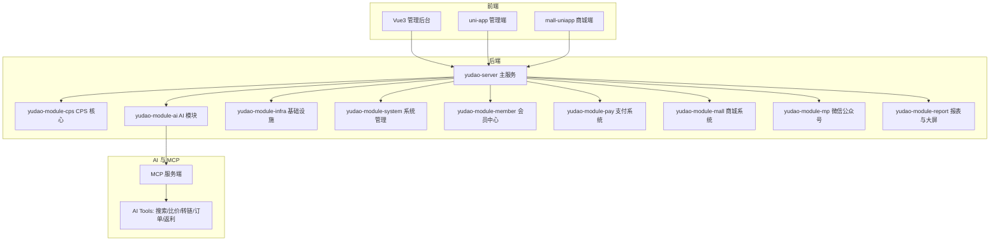
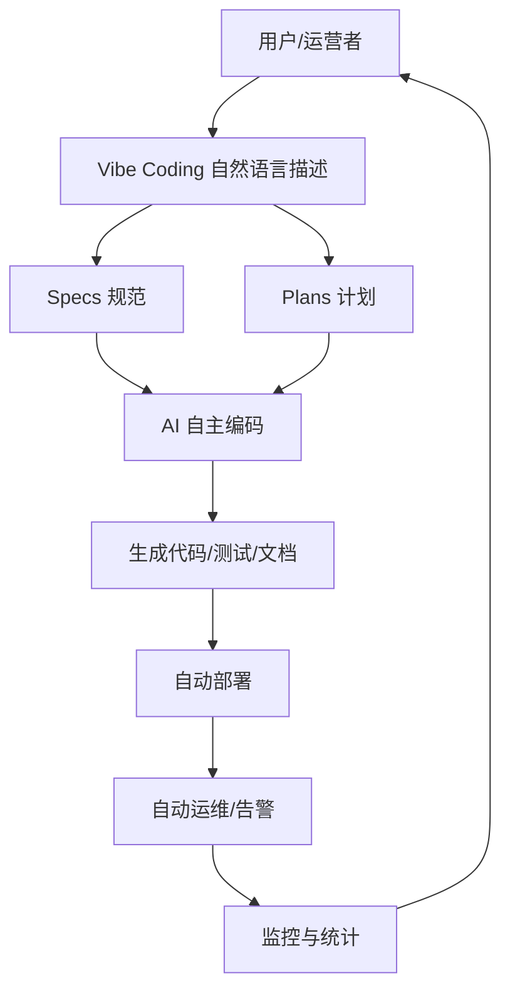
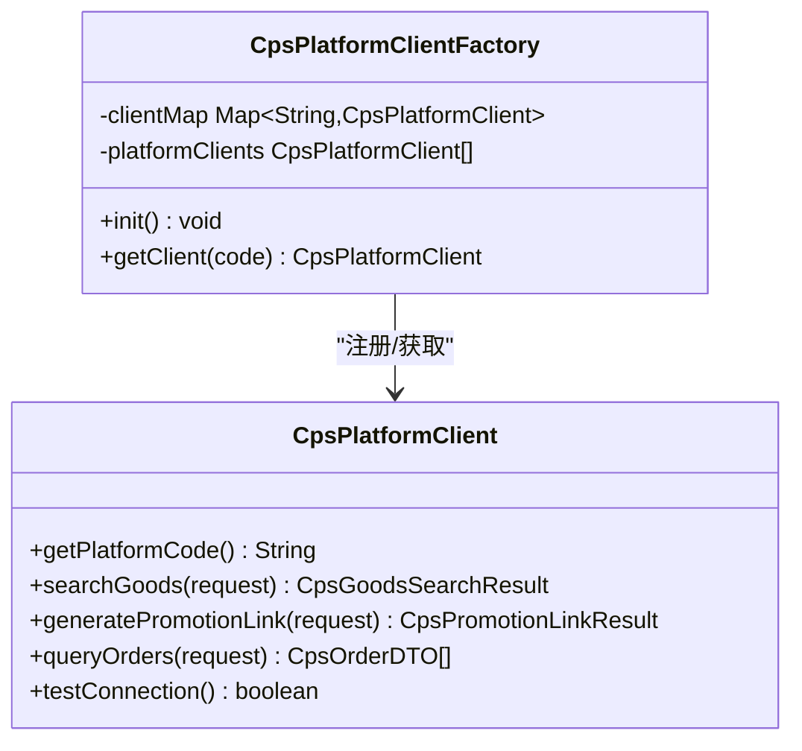
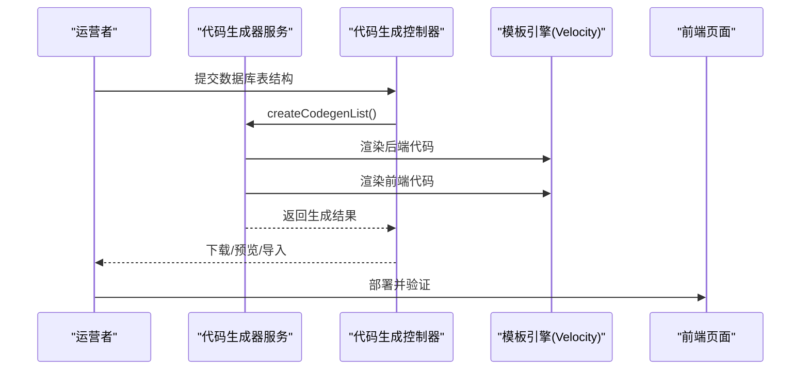
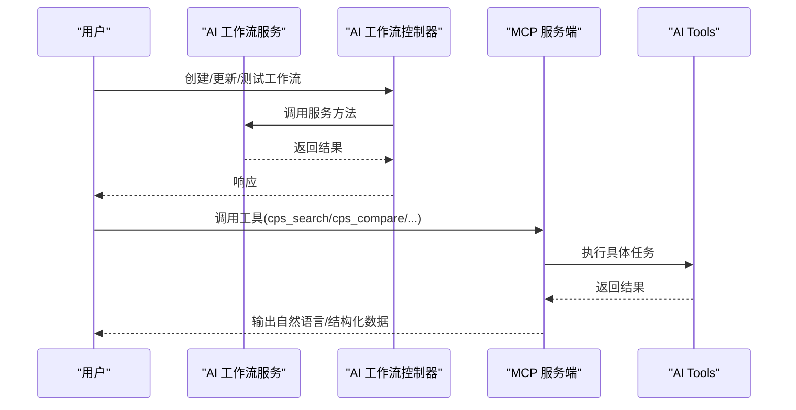
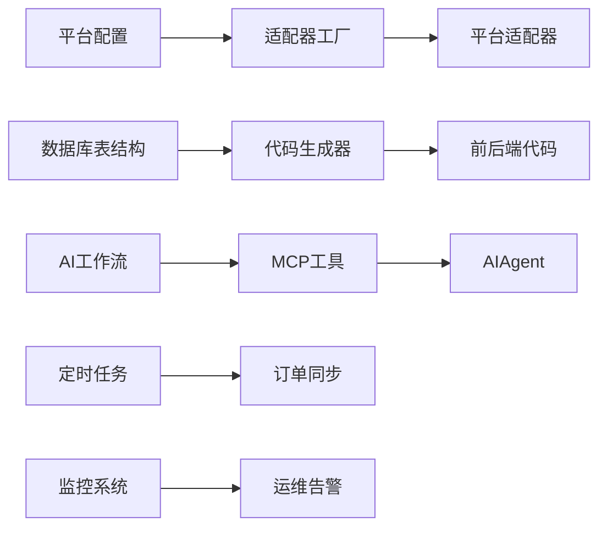

# 核心优势对比

<cite>
**本文引用的文件**
- [README.md](file://README.md)
- [AGENTS.md](file://AGENTS.md)
- [CPS系统PRD文档.md](file://docs/CPS系统PRD文档.md)
- [CpsPlatformClient.java](file://backend/yudao-module-cps/yudao-module-cps-biz/src/main/java/cn/iocoder/yudao/module/cps/client/CpsPlatformClient.java)
- [CpsPlatformClientFactory.java](file://backend/yudao-module-cps/yudao-module-cps-biz/src/main/java/cn/iocoder/yudao/module/cps/client/CpsPlatformClientFactory.java)
- [application-local.yaml](file://backend/yudao-server/src/main/resources/application-local.yaml)
- [MEMORY.md](file://agent_improvement/memory/MEMORY.md)
- [codegen-rules.md](file://agent_improvement/memory/codegen-rules.md)
- [CodegenService.java](file://backend/yudao-module-infra/src/main/java/cn/iocoder/yudao/module/infra/service/codegen/CodegenService.java)
- [CodegenController.java](file://backend/yudao-module-infra/src/main/java/cn/iocoder/yudao/module/infra/controller/admin/codegen/CodegenController.java)
- [AiWorkflowService.java](file://backend/yudao-module-ai/src/main/java/cn/iocoder/yudao/module/ai/service/workflow/AiWorkflowService.java)
- [AiWorkflowController.java](file://backend/yudao-module-ai/src/main/java/cn/iocoder/yudao/module/ai/controller/admin/workflow/AiWorkflowController.java)
- [AiWorkflowDO.java](file://backend/yudao-module-ai/src/main/java/cn/iocoder/yudao/module/ai/dal/dataobject/workflow/AiWorkflowDO.java)
</cite>

## 目录
1. [简介](#简介)
2. [项目结构](#项目结构)
3. [核心组件](#核心组件)
4. [架构总览](#架构总览)
5. [详细组件分析](#详细组件分析)
6. [依赖关系分析](#依赖关系分析)
7. [性能考量](#性能考量)
8. [故障排查指南](#故障排查指南)
9. [结论](#结论)
10. [附录](#附录)

## 简介
本文件聚焦 AgenticCPS 项目的核心优势对比，围绕传统 CPS 系统开发模式与 AgenticCPS 的差异化优势展开，从团队规模、开发周期、技术门槛、平台对接、运维成本、功能迭代速度等维度进行量化对比，并结合真实场景案例，展示这些优势如何转化为实际的商业价值。

AgenticCPS 通过“Vibe Coding + AI 自主编程 + 低代码”的三位一体能力，将 CPS 核心模块（20,000+ 行代码）100% 由 AI 自主编程完成，实现“1 人团队替代 5-10 人团队”、“开发周期从 3-6 个月缩短到 AI 扩展按天计”、“技术门槛从全栈工程师降到自然语言描述”的目标。平台内置淘宝、京东、拼多多、抖音联盟，支持 MCP AI 接口，实现“开箱即用 + AI 扩展”。

## 项目结构
AgenticCPS 采用模块化分层架构，核心模块包括：
- 后端：Spring Boot + 多模块（系统管理、会员中心、基础设施、支付、商城、AI、MP、报表、CPS 等）
- 前端：Vue3 管理后台、UniApp 移动端
- AI 与 MCP：Spring AI + MCP 协议对接，支持 AI Agent 直接调用
- 低代码：代码生成器、可视化工作流、报表与大屏设计器

**图表来源**
- [AGENTS.md: 13-57:13-57](file://AGENTS.md#L13-L57)
- [README.md: 229-249:229-249](file://README.md#L229-L249)

**章节来源**
- [AGENTS.md: 13-57:13-57](file://AGENTS.md#L13-L57)
- [README.md: 229-249:229-249](file://README.md#L229-L249)

## 核心组件
- 平台适配器（策略模式）：通过统一接口抽象各平台差异，新增平台只需实现接口并注册 Bean，无需改动核心逻辑，实现“平台对接从每个平台单独开发 → 已内置淘宝/京东/拼多多/抖音”的跨越。
- 低代码生成器：基于数据库表结构一键生成前后端代码、API 文档、单元测试，覆盖 CRUD、树表、主子表场景，实现“技术门槛从全栈工程师降到自然语言描述”。
- AI 工作流与 MCP：提供 AI 工作流编排与 MCP 工具集，支持 AI Agent 直接调用，实现“Vibe Coding：说一句话就上线”。
- 运维自动化：定时任务自动运行、异常自动告警、一键部署，实现“日常运维从专职运维团队 → 定时任务自动运行”。

**章节来源**
- [CpsPlatformClient.java: 14-55:14-55](file://backend/yudao-module-cps/yudao-module-cps-biz/src/main/java/cn/iocoder/yudao/module/cps/client/CpsPlatformClient.java#L14-L55)
- [CpsPlatformClientFactory.java: 24-43:24-43](file://backend/yudao-module-cps/yudao-module-cps-biz/src/main/java/cn/iocoder/yudao/module/cps/client/CpsPlatformClientFactory.java#L24-L43)
- [CodegenService.java: 19-41:19-41](file://backend/yudao-module-infra/src/main/java/cn/iocoder/yudao/module/infra/service/codegen/CodegenService.java#L19-L41)
- [AiWorkflowService.java: 15-62:15-62](file://backend/yudao-module-ai/src/main/java/cn/iocoder/yudao/module/ai/service/workflow/AiWorkflowService.java#L15-L62)

## 架构总览
AgenticCPS 的整体架构以“模块化 + 低代码 + AI 自主编程”为核心，通过 MCP 协议实现 AI Agent 与系统的无缝对接，形成“需求 → 规划 → 自主编码 → 自动测试 → 验收交付”的闭环。

**图表来源**
- [README.md: 113-144:113-144](file://README.md#L113-L144)

**章节来源**
- [README.md: 113-144:113-144](file://README.md#L113-L144)

## 详细组件分析

### 平台对接：从“每个平台单独开发”到“内置淘宝/京东/拼多多/抖音”
- 现状对比
  - 传统模式：每个平台单独开发，对接成本高、周期长、维护复杂。
  - AgenticCPS：通过策略模式的平台适配器，内置四大主流平台，新增平台只需实现接口并注册 Bean。
- 关键实现
  - 统一接口定义与工厂注册，确保新增平台无需改动核心逻辑。
  - 配置化平台参数（AppKey/Secret/PID/默认推广位），支持一键连通测试。
- 量化对比
  - 传统：接入一个平台需要 2 周 + 1 个全栈工程师。
  - AgenticCPS：AI 自动完成分析 API → 生成适配器 → 注册平台 → 编写测试 → 更新文档，仅需 30 分钟。

**图表来源**
- [CpsPlatformClient.java: 14-55:14-55](file://backend/yudao-module-cps/yudao-module-cps-biz/src/main/java/cn/iocoder/yudao/module/cps/client/CpsPlatformClient.java#L14-L55)
- [CpsPlatformClientFactory.java: 24-43:24-43](file://backend/yudao-module-cps/yudao-module-cps-biz/src/main/java/cn/iocoder/yudao/module/cps/client/CpsPlatformClientFactory.java#L24-L43)

**章节来源**
- [CpsPlatformClient.java: 14-55:14-55](file://backend/yudao-module-cps/yudao-module-cps-biz/src/main/java/cn/iocoder/yudao/module/cps/client/CpsPlatformClient.java#L14-L55)
- [CpsPlatformClientFactory.java: 24-43:24-43](file://backend/yudao-module-cps/yudao-module-cps-biz/src/main/java/cn/iocoder/yudao/module/cps/client/CpsPlatformClientFactory.java#L24-L43)
- [README.md: 68-80:68-80](file://README.md#L68-L80)

### 低代码：从“写代码”到“不写代码”
- 现状对比
  - 传统模式：CRUD、前端页面、API 文档、单元测试均需手工编写。
  - AgenticCPS：基于数据库表结构一键生成前后端代码、API 文档、单元测试，覆盖 80% 的管理后台开发场景。
- 关键实现
  - 代码生成器服务与控制器，支持批量创建、更新、预览与下载。
  - 前端模板覆盖 Vue3 Element Plus、Vben Admin、Vben5 Antd、UniApp 移动端。
- 量化对比
  - 传统：CRUD 页面开发 1-2 天/功能点。
  - AgenticCPS：输入一张表 → 一键生成完整代码 → 10 分钟内上线。

**图表来源**
- [CodegenService.java: 28](file://backend/yudao-module-infra/src/main/java/cn/iocoder/yudao/module/infra/service/codegen/CodegenService.java#L28)
- [CodegenController.java: 1-22:1-22](file://backend/yudao-module-infra/src/main/java/cn/iocoder/yudao/module/infra/controller/admin/codegen/CodegenController.java#L1-L22)

**章节来源**
- [CodegenService.java: 19-41:19-41](file://backend/yudao-module-infra/src/main/java/cn/iocoder/yudao/module/infra/service/codegen/CodegenService.java#L19-L41)
- [CodegenController.java: 1-22:1-22](file://backend/yudao-module-infra/src/main/java/cn/iocoder/yudao/module/infra/controller/admin/codegen/CodegenController.java#L1-L22)
- [codegen-rules.md: 327-788:327-788](file://agent_improvement/memory/codegen-rules.md#L327-L788)

### AI 工作流与 MCP：从“开发排期”到“说一句话就上线”
- 现状对比
  - 传统模式：需求 → 开发 → 测试 → 上线，周期长、返工多。
  - AgenticCPS：基于 Specs/Plans 的规范化 AI 编程，AI 自主完成编码、测试、交付。
- 关键实现
  - AI 工作流服务与控制器，支持创建工作流、更新、删除、分页查询与测试。
  - MCP 工具集（搜索、比价、转链、订单查询、返利汇总），支持 AI Agent 直接调用。
- 量化对比
  - 传统：功能迭代周期 2-4 周/版本。
  - AgenticCPS：Vibe Coding，说一句话 → AI 自动生成 → 自动测试 → 验收交付。

**图表来源**
- [AiWorkflowService.java: 23-62:23-62](file://backend/yudao-module-ai/src/main/java/cn/iocoder/yudao/module/ai/service/workflow/AiWorkflowService.java#L23-L62)
- [AiWorkflowController.java: 29-33:29-33](file://backend/yudao-module-ai/src/main/java/cn/iocoder/yudao/module/ai/controller/admin/workflow/AiWorkflowController.java#L29-L33)
- [AiWorkflowDO.java: 18-51:18-51](file://backend/yudao-module-ai/src/main/java/cn/iocoder/yudao/module/ai/dal/dataobject/workflow/AiWorkflowDO.java#L18-L51)

**章节来源**
- [AiWorkflowService.java: 15-62:15-62](file://backend/yudao-module-ai/src/main/java/cn/iocoder/yudao/module/ai/service/workflow/AiWorkflowService.java#L15-L62)
- [AiWorkflowController.java: 20-33:20-33](file://backend/yudao-module-ai/src/main/java/cn/iocoder/yudao/module/ai/controller/admin/workflow/AiWorkflowController.java#L20-L33)
- [AiWorkflowDO.java: 15-51:15-51](file://backend/yudao-module-ai/src/main/java/cn/iocoder/yudao/module/ai/dal/dataobject/workflow/AiWorkflowDO.java#L15-L51)
- [README.md: 101-112:101-112](file://README.md#L101-L112)

### 运维成本：从“专职运维团队”到“定时任务自动运行 + 异常自动告警”
- 现状对比
  - 传统模式：需要专职运维团队，成本高、响应慢。
  - AgenticCPS：定时任务自动运行、异常自动告警、在线管理界面，降低运维成本。
- 关键实现
  - Quartz 定时任务配置、Spring Boot Admin 监控、Actuator 端点暴露。
  - 配置化 MCP 服务状态、API Key 管理、工具与资源管理、访问日志与统计分析。
- 量化对比
  - 传统：运维人员成本 10-20 万元/年。
  - AgenticCPS：服务器 + 域名，年成本千元级。

**章节来源**
- [application-local.yaml: 88-194:88-194](file://backend/yudao-server/src/main/resources/application-local.yaml#L88-L194)
- [docs/CPS系统PRD文档.md: 694-757:694-757](file://docs/CPS系统PRD文档.md#L694-L757)

## 依赖关系分析
AgenticCPS 的核心依赖关系体现为“平台适配器 + 低代码 + AI 工作流 + MCP”的协同：
- 平台适配器依赖配置与工厂注册，确保新增平台零侵入。
- 低代码生成器依赖模板规则与数据库表结构，实现一键生成。
- AI 工作流与 MCP 依赖 Spring AI 与 MCP 协议，实现 AI Agent 的无缝对接。
- 运维依赖定时任务与监控系统，实现自动化与可观测性。

**图表来源**
- [CpsPlatformClientFactory.java: 34-43:34-43](file://backend/yudao-module-cps/yudao-module-cps-biz/src/main/java/cn/iocoder/yudao/module/cps/client/CpsPlatformClientFactory.java#L34-L43)
- [codegen-rules.md: 327-788:327-788](file://agent_improvement/memory/codegen-rules.md#L327-L788)
- [AiWorkflowService.java: 15-62:15-62](file://backend/yudao-module-ai/src/main/java/cn/iocoder/yudao/module/ai/service/workflow/AiWorkflowService.java#L15-L62)
- [application-local.yaml: 88-194:88-194](file://backend/yudao-server/src/main/resources/application-local.yaml#L88-L194)

**章节来源**
- [CpsPlatformClientFactory.java: 24-43:24-43](file://backend/yudao-module-cps/yudao-module-cps-biz/src/main/java/cn/iocoder/yudao/module/cps/client/CpsPlatformClientFactory.java#L24-L43)
- [codegen-rules.md: 327-788:327-788](file://agent_improvement/memory/codegen-rules.md#L327-L788)
- [AiWorkflowService.java: 15-62:15-62](file://backend/yudao-module-ai/src/main/java/cn/iocoder/yudao/module/ai/service/workflow/AiWorkflowService.java#L15-L62)
- [application-local.yaml: 88-194:88-194](file://backend/yudao-server/src/main/resources/application-local.yaml#L88-L194)

## 性能考量
AgenticCPS 在性能方面具备以下特点：
- 搜索与比价：单平台搜索 P99 < 2 秒，多平台比价 P99 < 5 秒，转链生成 < 1 秒。
- 订单同步：每 5 分钟增量同步，订单状态追踪及时。
- MCP 工具调用：搜索类 < 3 秒，查询类 < 1 秒。
- 返利入账：平台结算后 24 小时内入账。

这些指标确保了用户体验与系统稳定性，支撑“1 人团队替代 5-10 人团队”的高效运作。

**章节来源**
- [README.md: 332-342:332-342](file://README.md#L332-L342)

## 故障排查指南
- 平台对接问题
  - 检查平台配置（AppKey/Secret/PID/默认推广位）与连通测试结果。
  - 查看平台适配器注册状态与日志。
- 低代码生成问题
  - 确认数据库表结构与生成模板匹配，检查生成结果与预览。
- AI 工作流与 MCP 问题
  - 检查 MCP 服务状态、API Key 权限与限流配置，查看访问日志与统计。
- 运维问题
  - 查看定时任务日志与异常告警，确认监控与日志中心状态。

**章节来源**
- [application-local.yaml: 88-194:88-194](file://backend/yudao-server/src/main/resources/application-local.yaml#L88-L194)
- [docs/CPS系统PRD文档.md: 694-757:694-757](file://docs/CPS系统PRD文档.md#L694-L757)

## 结论
AgenticCPS 通过“Vibe Coding + AI 自主编程 + 低代码”的技术组合，将传统 CPS 系统开发模式中的高团队规模、长开发周期、高技术门槛、低平台对接效率、高运维成本等问题全面化解。其核心优势体现在：
- 团队规模：1 人团队替代 5-10 人团队
- 开发周期：从 3-6 个月缩短到 AI 扩展按天计
- 技术门槛：从全栈工程师降到自然语言描述
- 平台对接：从每个平台单独开发到内置四大平台
- 运维成本：从专职运维团队到定时任务自动运行 + 异常自动告警
- 功能迭代：从排期 → 开发 → 测试 → 上线到 Vibe Coding：说一句话就上线

这些优势在真实场景中已得到验证，如“接入抖音联盟平台仅需 30 分钟”，“1 天完成原来 2 个月的工作量”，“开发成本从 3 万降到 0”。这些量化指标与时间对比，直接转化为商业价值：更低的人力成本、更快的市场响应、更高的运营效率与更强的扩展能力。

## 附录
- 术语解释
  - Vibe Coding：用自然语言描述需求，AI 自动实现。
  - 低代码：不只是少写代码，而是不写代码。
  - MCP：Model Context Protocol，AI Agent 零代码接入协议。
- 参考文档
  - [CPS系统PRD文档.md](file://docs/CPS系统PRD文档.md)
  - [MEMORY.md](file://agent_improvement/memory/MEMORY.md)
  - [codegen-rules.md](file://agent_improvement/memory/codegen-rules.md)