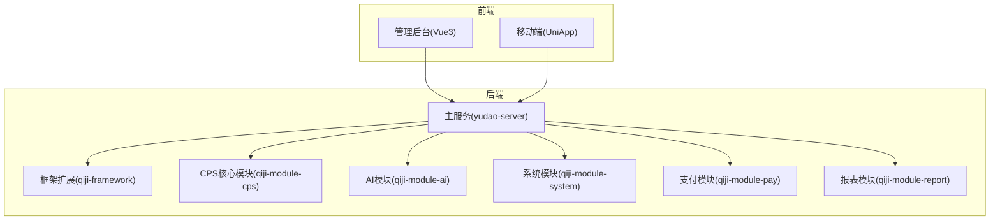
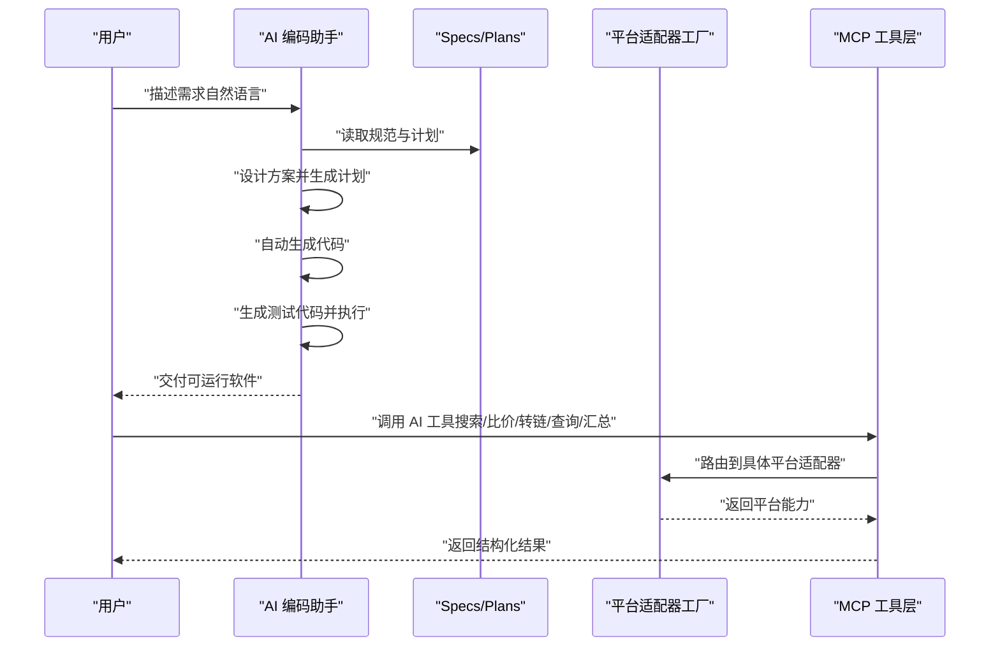
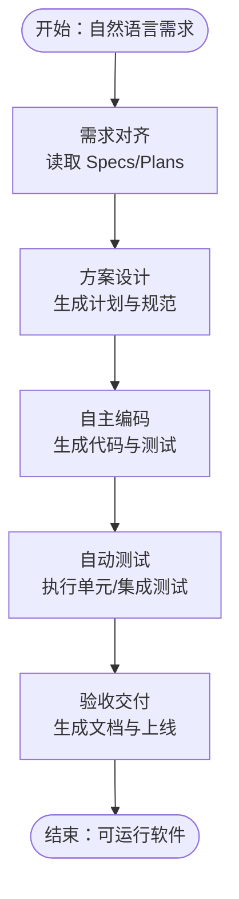
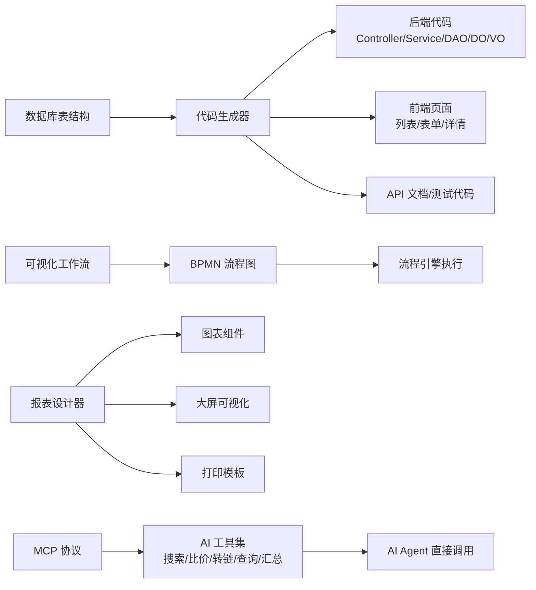
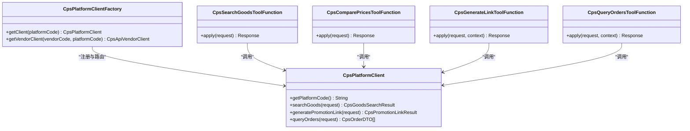
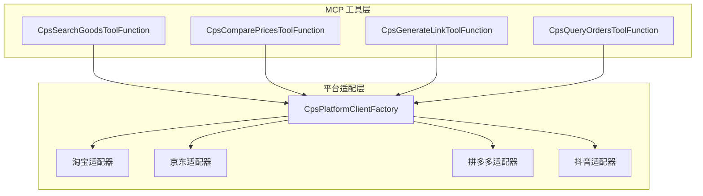

# 核心理念

<cite>
**本文引用的文件**
- [README.md](file://README.md)
- [AGENTS.md](file://AGENTS.md)
- [CPS系统PRD文档.md](file://docs/CPS系统PRD文档.md)
- [CpsPlatformClientFactory.java](file://backend/qiji-module-cps/qiji-module-cps-biz/src/main/java/com/qiji/cps/module/cps/client/CpsPlatformClientFactory.java)
- [CpsSearchGoodsToolFunction.java](file://backend/qiji-module-cps/qiji-module-cps-biz/src/main/java/com/qiji/cps/module/cps/mcp/tool/CpsSearchGoodsToolFunction.java)
- [CpsComparePricesToolFunction.java](file://backend/qiji-module-cps/qiji-module-cps-biz/src/main/java/com/qiji/cps/module/cps/mcp/tool/CpsComparePricesToolFunction.java)
- [CpsGenerateLinkToolFunction.java](file://backend/qiji-module-cps/qiji-module-cps-biz/src/main/java/com/qiji/cps/module/cps/mcp/tool/CpsGenerateLinkToolFunction.java)
- [CpsQueryOrdersToolFunction.java](file://backend/qiji-module-cps/qiji-module-cps-biz/src/main/java/com/qiji/cps/module/cps/mcp/tool/CpsQueryOrdersToolFunction.java)
- [codegen-rules.md](file://agent_improvement/memory/codegen-rules.md)
- [testing-specification.md](file://agent_improvement/memory/testing-specification.md)
</cite>

## 目录
1. [引言](#引言)
2. [项目结构](#项目结构)
3. [核心组件](#核心组件)
4. [架构总览](#架构总览)
5. [详细组件分析](#详细组件分析)
6. [依赖关系分析](#依赖关系分析)
7. [性能考量](#性能考量)
8. [故障排查指南](#故障排查指南)
9. [结论](#结论)
10. [附录](#附录)

## 引言
AgenticCPS 的核心理念是“氛围编程”（Vibe Coding）与“AI 自主编程”的深度融合，目标是以自然语言描述需求，由 AI 自动理解、设计、编码、测试并交付，从而让一个人拥有一支技术团队的战斗力。项目通过“规范化 AI 编程工作流”（Specs/Plans/Agents/Skills）确保 AI 的输出可控、可验证、可演进；通过“低代码”能力（代码生成器、可视化工作流、报表设计器、MCP 协议）实现“不写代码”的业务快速交付。

## 项目结构
AgenticCPS 采用前后端分离与模块化架构，后端基于 Spring Boot 3.5.9，前端包含 Vue3 管理后台与 UniApp 移动端应用。核心模块围绕 CPS 联盟返利展开，涵盖多平台适配、订单追踪、返利结算、MCP AI 接口、基础设施与报表系统等。

**图表来源**
- [AGENTS.md: 第13-62行:13-62](file://AGENTS.md#L13-L62)

**章节来源**
- [AGENTS.md: 第13-62行:13-62](file://AGENTS.md#L13-L62)

## 核心组件
- 规范化 AI 编程工作流：.qoder/specs（编码规范）、.qoder/plans（实施计划）、.qoder/agents（AI 代理）、.qoder/skills（可复用技能）
- 低代码能力：代码生成器、可视化工作流、报表与大屏设计器、MCP 协议
- AI 自主编程：CPS 核心模块（20,000+ 行代码）由 AI 完成，覆盖数据库设计、API 接口、业务逻辑、单元测试、定时任务与 MCP 接口层
- 多平台适配：基于策略模式的平台适配器工厂，支持淘宝、京东、拼多多、抖音等平台的无缝扩展

**章节来源**
- [README.md: 第84-144行:84-144](file://README.md#L84-L144)
- [AGENTS.md: 第150-227行:150-227](file://AGENTS.md#L150-L227)

## 架构总览
AgenticCPS 的整体架构以“需求对齐 → 方案设计 → 自主编码 → 自动测试 → 验收交付”为主线，结合 MCP 协议实现 AI Agent 的零代码接入，支撑从自然语言到可运行软件的完整闭环。

**图表来源**
- [README.md: 第119-135行:119-135](file://README.md#L119-L135)
- [AGENTS.md: 第170-190行:170-190](file://AGENTS.md#L170-L190)

**章节来源**
- [README.md: 第84-144行:84-144](file://README.md#L84-L144)
- [AGENTS.md: 第170-190行:170-190](file://AGENTS.md#L170-L190)

## 详细组件分析

### Vibe Coding 与 AI 自主编程
- 概念本质：用自然语言描述需求，AI 自动理解并实现，形成“描述意图 → AI 理解 → AI 编码 → AI 测试 → AI 交付”的闭环
- 工作流程：需求对齐 → 方案设计 → 自主编码 → 自动测试 → 验收交付，全程由 AI 主导，人类参与审核与验收
- 实践成果：CPS 核心模块（20,000+ 行代码）100% 由 AI 自主编程完成，覆盖数据库设计、API 接口、业务逻辑、单元测试、定时任务与 MCP 接口层

**图表来源**
- [README.md: 第119-135行:119-135](file://README.md#L119-L135)

**章节来源**
- [README.md: 第84-144行:84-144](file://README.md#L84-L144)

### 低代码：不只是少写代码，而是不写代码
- 代码生成器：输入数据库表结构，一键生成 Java 控制器/服务/映射/DO/VO、前端页面、SQL 脚本、Swagger 文档与单元测试代码
- 可视化工作流：基于 Flowable 引擎，拖拽设计审批流程（提现审核、返利结算、平台接入等）
- 报表与大屏：拖拽生成数据报表、图形报表、大屏可视化与打印模板
- MCP 协议：通过 MCP（Model Context Protocol）协议，AI Agent 无需写一行代码即可接入 CPS 系统，提供 5 个开箱即用的 AI 工具

**图表来源**
- [README.md: 第147-210行:147-210](file://README.md#L147-L210)
- [codegen-rules.md: 第1-788行:1-788](file://agent_improvement/memory/codegen-rules.md#L1-L788)

**章节来源**
- [README.md: 第147-210行:147-210](file://README.md#L147-L210)
- [codegen-rules.md: 第1-788行:1-788](file://agent_improvement/memory/codegen-rules.md#L1-L788)

### 多平台适配器与 MCP 工具层
- 平台适配器工厂：基于策略模式，自动注册与路由不同平台的适配器，支持按平台编码与供应商维度的双维度路由
- MCP 工具层：提供 5 个 AI 工具，AI Agent 可直接调用，无需任何开发
  - 商品搜索：跨平台搜索商品，支持关键词、平台筛选与价格区间
  - 多平台比价：自动比较各平台价格，输出最便宜/返利最高/综合最优方案
  - 生成推广链接：生成带返利追踪的购买链接（短链/长链/口令/移动端）
  - 订单查询：查看用户的返利订单列表与全链路状态
  - 返利汇总：查看余额、待结算、累计返利与最近记录

**图表来源**
- [AGENTS.md: 第150-227行:150-227](file://AGENTS.md#L150-L227)
- [CpsPlatformClientFactory.java: 第1-103行:1-103](file://backend/qiji-module-cps/qiji-module-cps-biz/src/main/java/com/qiji/cps/module/cps/client/CpsPlatformClientFactory.java#L1-L103)
- [CpsSearchGoodsToolFunction.java: 第1-177行:1-177](file://backend/qiji-module-cps/qiji-module-cps-biz/src/main/java/com/qiji/cps/module/cps/mcp/tool/CpsSearchGoodsToolFunction.java#L1-L177)
- [CpsComparePricesToolFunction.java: 第1-176行:1-176](file://backend/qiji-module-cps/qiji-module-cps-biz/src/main/java/com/qiji/cps/module/cps/mcp/tool/CpsComparePricesToolFunction.java#L1-L176)
- [CpsGenerateLinkToolFunction.java: 第1-142行:1-142](file://backend/qiji-module-cps/qiji-module-cps-biz/src/main/java/com/qiji/cps/module/cps/mcp/tool/CpsGenerateLinkToolFunction.java#L1-L142)
- [CpsQueryOrdersToolFunction.java: 第1-169行:1-169](file://backend/qiji-module-cps/qiji-module-cps-biz/src/main/java/com/qiji/cps/module/cps/mcp/tool/CpsQueryOrdersToolFunction.java#L1-L169)

**章节来源**
- [AGENTS.md: 第150-227行:150-227](file://AGENTS.md#L150-L227)
- [CpsPlatformClientFactory.java: 第1-103行:1-103](file://backend/qiji-module-cps/qiji-module-cps-biz/src/main/java/com/qiji/cps/module/cps/client/CpsPlatformClientFactory.java#L1-L103)
- [CpsSearchGoodsToolFunction.java: 第1-177行:1-177](file://backend/qiji-module-cps/qiji-module-cps-biz/src/main/java/com/qiji/cps/module/cps/mcp/tool/CpsSearchGoodsToolFunction.java#L1-L177)
- [CpsComparePricesToolFunction.java: 第1-176行:1-176](file://backend/qiji-module-cps/qiji-module-cps-biz/src/main/java/com/qiji/cps/module/cps/mcp/tool/CpsComparePricesToolFunction.java#L1-L176)
- [CpsGenerateLinkToolFunction.java: 第1-142行:1-142](file://backend/qiji-module-cps/qiji-module-cps-biz/src/main/java/com/qiji/cps/module/cps/mcp/tool/CpsGenerateLinkToolFunction.java#L1-L142)
- [CpsQueryOrdersToolFunction.java: 第1-169行:1-169](file://backend/qiji-module-cps/qiji-module-cps-biz/src/main/java/com/qiji/cps/module/cps/mcp/tool/CpsQueryOrdersToolFunction.java#L1-L169)

### 使用场景与对比案例
- 传统模式 vs AgenticCPS
  - 团队规模：传统 5~10 人技术团队 vs AgenticCPS 1 人即可
  - 开发周期：传统 3~6 个月 vs AgenticCPS 开箱即用，AI 扩展按天计
  - 技术门槛：传统需要全栈工程师 vs AgenticCPS 自然语言描述需求，AI 自动实现
  - 平台对接：传统每个平台单独开发 vs AgenticCPS 淘宝/京东/拼多多/抖音已内置
  - 日常运维：传统专职运维团队 vs AgenticCPS 定时任务自动运行，异常自动告警
  - 功能迭代：传统排期 → 开发 → 测试 → 上线 vs AgenticCPS Vibe Coding：说一句话就上线
  - 成本投入：传统人力 30~100 万/年 vs AgenticCPS 服务器 + 域名，年成本千元级

- 典型场景
  - 一人公司 CPS 创业：小张从 Excel 手动记录订单、手动计算返利、手动转账，到 AgenticCPS 自动同步订单、自动计算返利、用户自助提现，每天多出 4 小时做推广，月收入翻 3 倍
  - AI 导购助手：小李独立开发者，接入 AgenticCPS 的 MCP 接口，5 个 AI Tools 开箱即用，1 天完成原来 2 个月的工作量
  - Vibe Coding 快速扩展：小王运营者，接入唯品会联盟，对 AI 说“帮我接入唯品会联盟”，30 分钟搞定，开发成本从 3 万降到 0

**章节来源**
- [README.md: 第54-80行:54-80](file://README.md#L54-L80)
- [README.md: 第382-407行:382-407](file://README.md#L382-L407)

### 技术哲学与未来趋势
- 技术哲学：以“需求对齐”为起点，以“方案设计”为桥梁，以“自主编码”为手段，以“自动测试”为保障，以“验收交付”为目标，构建“人机协同、AI 主导”的新型研发范式
- 未来趋势：随着 AI 能力的不断提升，Vibe Coding 将进一步降低技术门槛，实现“自然语言 → 可运行软件”的端到端自动化；低代码将从“少写代码”演进为“不写代码”，成为业务创新的加速器；MCP 协议将推动 AI Agent 的标准化接入，形成开放的生态体系

**章节来源**
- [README.md: 第84-144行:84-144](file://README.md#L84-L144)

## 依赖关系分析
AgenticCPS 的核心依赖关系体现为“平台适配器工厂”对“多平台适配器”的注册与路由，以及“MCP 工具层”对“平台适配器”的调用。测试规范与代码生成规则为 AI 编码提供了质量保障与一致性约束。

**图表来源**
- [CpsPlatformClientFactory.java: 第1-103行:1-103](file://backend/qiji-module-cps/qiji-module-cps-biz/src/main/java/com/qiji/cps/module/cps/client/CpsPlatformClientFactory.java#L1-L103)
- [CpsSearchGoodsToolFunction.java: 第1-177行:1-177](file://backend/qiji-module-cps/qiji-module-cps-biz/src/main/java/com/qiji/cps/module/cps/mcp/tool/CpsSearchGoodsToolFunction.java#L1-L177)
- [CpsComparePricesToolFunction.java: 第1-176行:1-176](file://backend/qiji-module-cps/qiji-module-cps-biz/src/main/java/com/qiji/cps/module/cps/mcp/tool/CpsComparePricesToolFunction.java#L1-L176)
- [CpsGenerateLinkToolFunction.java: 第1-142行:1-142](file://backend/qiji-module-cps/qiji-module-cps-biz/src/main/java/com/qiji/cps/module/cps/mcp/tool/CpsGenerateLinkToolFunction.java#L1-L142)
- [CpsQueryOrdersToolFunction.java: 第1-169行:1-169](file://backend/qiji-module-cps/qiji-module-cps-biz/src/main/java/com/qiji/cps/module/cps/mcp/tool/CpsQueryOrdersToolFunction.java#L1-L169)

**章节来源**
- [CpsPlatformClientFactory.java: 第1-103行:1-103](file://backend/qiji-module-cps/qiji-module-cps-biz/src/main/java/com/qiji/cps/module/cps/client/CpsPlatformClientFactory.java#L1-L103)
- [CpsSearchGoodsToolFunction.java: 第1-177行:1-177](file://backend/qiji-module-cps/qiji-module-cps-biz/src/main/java/com/qiji/cps/module/cps/mcp/tool/CpsSearchGoodsToolFunction.java#L1-L177)
- [CpsComparePricesToolFunction.java: 第1-176行:1-176](file://backend/qiji-module-cps/qiji-module-cps-biz/src/main/java/com/qiji/cps/module/cps/mcp/tool/CpsComparePricesToolFunction.java#L1-L176)
- [CpsGenerateLinkToolFunction.java: 第1-142行:1-142](file://backend/qiji-module-cps/qiji-module-cps-biz/src/main/java/com/qiji/cps/module/cps/mcp/tool/CpsGenerateLinkToolFunction.java#L1-L142)
- [CpsQueryOrdersToolFunction.java: 第1-169行:1-169](file://backend/qiji-module-cps/qiji-module-cps-biz/src/main/java/com/qiji/cps/module/cps/mcp/tool/CpsQueryOrdersToolFunction.java#L1-L169)

## 性能考量
- 搜索与比价性能：单平台搜索 < 2 秒（P99），多平台比价 < 5 秒（P99）
- 链接生成性能：转链生成 < 1 秒
- 订单同步延迟：< 30 分钟
- 返利入账：平台结算后 24 小时内
- MCP 工具调用：搜索类 < 3 秒，查询类 < 1 秒

这些指标体现了系统在高并发场景下的稳定性与响应速度，为用户体验与业务连续性提供保障。

**章节来源**
- [README.md: 第369-379行:369-379](file://README.md#L369-L379)

## 故障排查指南
- 文件编码问题：Windows PowerShell 默认编码为 ANSI/GBK，可能导致 UTF-8 中文文件损坏。应使用 Python 进行文件读写与批量替换，并在修改后验证 UTF-8 编码完整性
- 测试基类选择：根据测试场景选择合适的测试基类（Mockito 单元测试、DB 单元测试、Redis 单元测试、DB+Redis 单元测试），确保测试环境与依赖隔离
- Mock 策略：合理使用 @MockitoBean 与 @Mock 注解，配合 @InjectMocks 注入被测对象；对静态方法 Mock 需使用 try-with-resources 确保 MockedStatic 正确关闭
- 金额字段测试：所有金额使用 Integer（分为单位），避免浮点误差；测试中同样使用分为单位进行断言

**章节来源**
- [AGENTS.md: 第266-344行:266-344](file://AGENTS.md#L266-L344)
- [testing-specification.md: 第1-784行:1-784](file://agent_improvement/memory/testing-specification.md#L1-L784)

## 结论
AgenticCPS 通过 Vibe Coding 与 AI 自主编程，将“自然语言 → 可运行软件”的研发过程标准化、自动化与可演进化。依托规范化工作流、低代码能力与 MCP 协议，系统实现了从需求到交付的高效闭环，使个人具备团队级的研发与运营能力。未来，随着 AI 技术的不断进步，AgenticCPS 将继续降低技术门槛，加速业务创新，推动软件工程向“自然语言驱动”的方向发展。

## 附录
- 产品需求文档（PRD）：涵盖用户角色、业务流程、功能清单与 MCP 工具设计，为系统设计与开发提供权威依据
- 代码生成规则：定义了前后端代码生成的模板与规范，确保生成代码的一致性与可维护性
- 测试规范：提供了测试基类、测试方法命名、断言与 Mock 策略等标准，保障 AI 编码的质量与稳定性

**章节来源**
- [CPS系统PRD文档.md: 第1-800行:1-800](file://docs/CPS系统PRD文档.md#L1-L800)
- [codegen-rules.md: 第1-788行:1-788](file://agent_improvement/memory/codegen-rules.md#L1-L788)
- [testing-specification.md: 第1-784行:1-784](file://agent_improvement/memory/testing-specification.md#L1-L784)