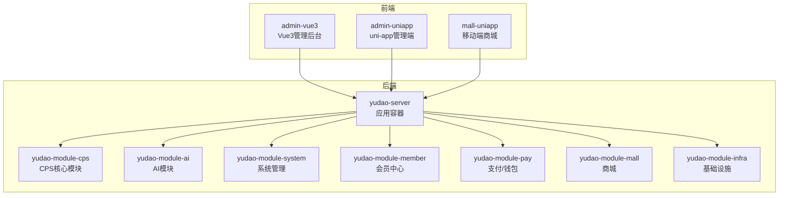
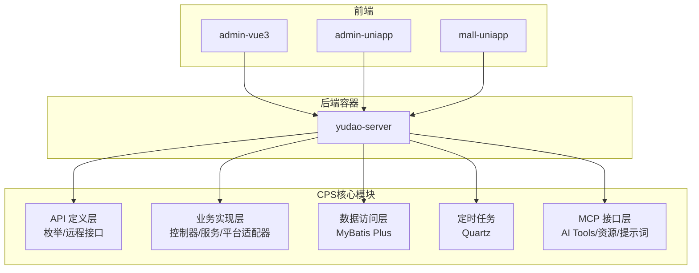
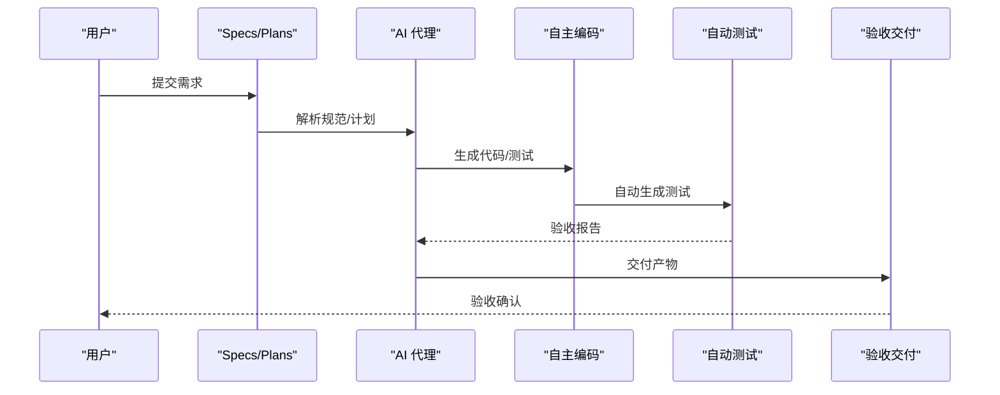
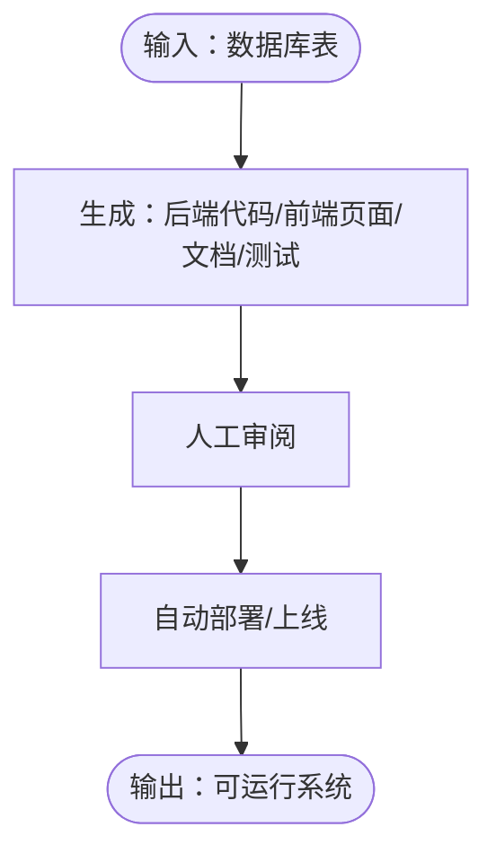
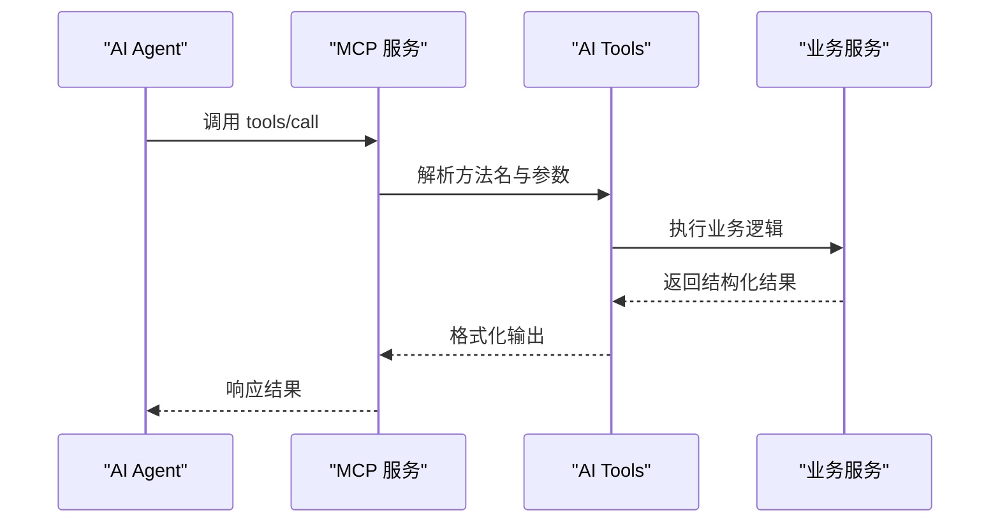
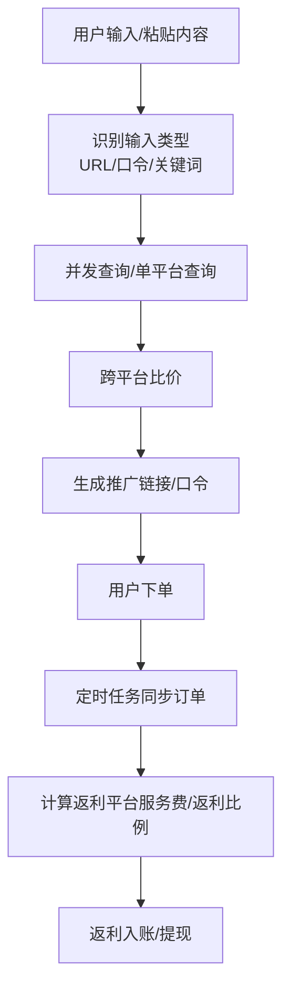
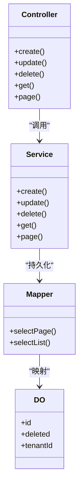
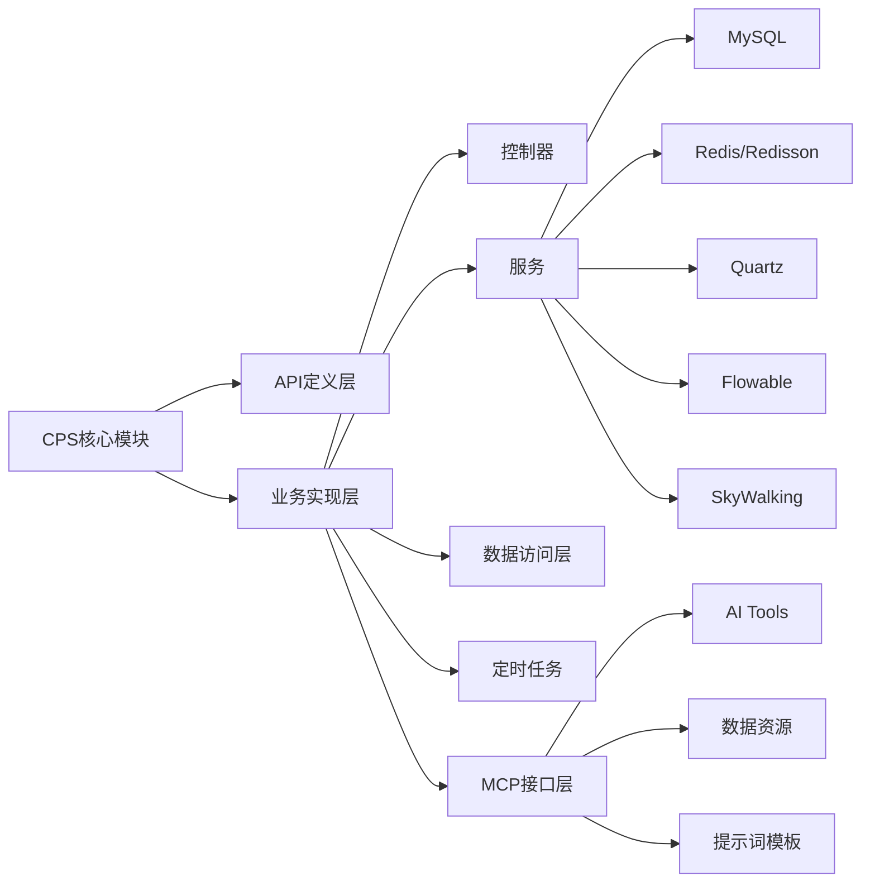

# 项目介绍与背景

<cite>
**本文引用的文件**
- [README.md](file://README.md)
- [AGENTS.md](file://AGENTS.md)
- [CPS系统PRD文档.md](file://docs/CPS系统PRD文档.md)
- [MEMORY.md](file://agent_improvement/memory/MEMORY.md)
- [codegen-rules.md](file://agent_improvement/memory/codegen-rules.md)
</cite>

## 目录
1. [引言](#引言)
2. [项目结构](#项目结构)
3. [核心组件](#核心组件)
4. [架构总览](#架构总览)
5. [详细组件分析](#详细组件分析)
6. [依赖关系分析](#依赖关系分析)
7. [性能考量](#性能考量)
8. [故障排查指南](#故障排查指南)
9. [结论](#结论)
10. [附录](#附录)

## 引言
AgenticCPS 是一款面向“一人公司（OPC）”与自由职业者的“智能返利赚钱机器”，以“Vibe Coding + 低代码 + AI 自主编程”为核心范式，提供“零代码启动、对话式开发、全自动运营”的 CPS（联盟返利）导购平台。项目通过 AI 自主编程完成核心模块（20,000+ 行代码），实现从数据库设计、API 接口、业务逻辑、单元测试到定时任务与 MCP AI 接口层的全流程自动化；同时提供“低代码”能力，覆盖 CRUD 一键生成、可视化工作流、报表与大屏、MCP 协议对接等，显著降低团队规模、缩短开发周期、降低技术门槛，并以“阶段化交付”推进项目进展，最终形成可开源、可社区协作、可持续演进的返利 SaaS 平台。

## 项目结构
AgenticCPS 采用模块化分层架构，后端基于 Spring Boot 3.x，前端包含 Vue3 管理后台与 uni-app 移动端，核心模块聚焦于 CPS 联盟返利系统，并配套 AI、基础设施、系统管理、支付、商城、报表等模块，形成完整的业务与技术底座。

图表来源
- [AGENTS.md:13-57](file://AGENTS.md#L13-L57)

章节来源
- [AGENTS.md:11-57](file://AGENTS.md#L11-L57)

## 核心组件
- Vibe Coding（氛围编程）：以“描述意图 → AI 理解 → AI 编码 → AI 测试 → AI 交付”的闭环工作流，实现需求到代码的全流程 AI 化，核心 CPS 模块由 AI 自主编程完成。
- 低代码平台：覆盖 CRUD 一键生成、可视化工作流、报表与大屏、MCP 协议对接，实现“不写代码也能建系统”。
- MCP（Model Context Protocol）：为 AI Agent 提供零代码接入能力，系统内置 5 个 AI Tools（商品搜索、多平台比价、推广链接生成、订单查询、返利汇总）。
- CPS 联盟返利系统：聚合淘宝、京东、拼多多、抖音等主流平台，提供搜索、比价、返利计算、订单追踪、提现管理、风控与运营看板等能力。
- 技术底座：Spring Boot 3.5.9、Spring Security、MyBatis Plus、Redis/Redisson、Flowable、Vue3/Element Plus、UniApp、MySQL、Quartz、SkyWalking 等。

章节来源
- [README.md:84-144](file://README.md#L84-L144)
- [README.md:147-210](file://README.md#L147-L210)
- [README.md:212-264](file://README.md#L212-L264)
- [README.md:267-302](file://README.md#L267-L302)

## 架构总览
AgenticCPS 的整体架构围绕“模块化 + 分层 + AI 驱动”的设计展开：后端以 yudao-server 为容器，按领域拆分为系统管理、会员中心、支付、商城、AI、基础设施等模块；CPS 核心模块进一步细分为 API 定义层、业务实现层（控制器、服务、平台适配器、数据访问层、定时任务、MCP 接口层）。前端提供 Vue3 管理后台与 uni-app 移动端，支撑运营与用户侧使用。

图表来源
- [AGENTS.md:17-31](file://AGENTS.md#L17-L31)

章节来源
- [AGENTS.md:11-57](file://AGENTS.md#L11-L57)

## 详细组件分析

### Vibe Coding：AI 自主编程范式
- 工作流：需求对齐 → 方案设计 → AI 自主编码 → 自动测试 → 验收交付，确保 AI 理解无偏差、方案先行、零返工。
- 规范化：通过 .qoder/specs（编码规范）、.qoder/plans（实施计划）、.qoder/agents（AI 代理）、.qoder/skills（可复用技能）形成标准化工作流。
- 成果：CPS 核心模块（20,000+ 行代码）100% 由 AI 自主编程完成，涵盖数据库设计、API、业务逻辑、单元测试、定时任务、MCP 接口层。

图表来源
- [README.md:113-144](file://README.md#L113-L144)

章节来源
- [README.md:84-144](file://README.md#L84-L144)

### 低代码：从 CRUD 到 AI 接入
- CRUD 一键生成：输入数据库表结构，自动生成 Java 控制器/服务/映射/DO/VO、前端页面（列表/表单/详情）、SQL 建表脚本、Swagger 文档、单元测试代码。
- 可视化工作流：基于 Flowable 引擎，拖拽设计审批流程（提现审核、返利结算、平台接入等）。
- 报表与大屏：拖拽生成数据报表、图形报表、大屏设计器、打印模板。
- MCP 协议：AI Agent 无需写代码即可调用系统工具（搜索、比价、生成链接、查询订单、返利汇总）。

图表来源
- [README.md:147-210](file://README.md#L147-L210)

章节来源
- [README.md:147-210](file://README.md#L147-L210)

### MCP：AI Agent 零代码接入
- 工具与资源：系统提供 5 个开箱即用的 AI Tools（商品搜索、多平台比价、推广链接生成、订单查询、返利汇总），以及只读资源（平台配置、返利规则、统计数据）。
- 协议与端点：基于 MCP（JSON-RPC 2.0 over Streamable HTTP）在 /mcp/cps 提供服务，支持权限控制、限流与日志审计。
- 管理后台：提供 MCP 服务状态、API Key 管理、Tools 配置、资源管理、提示词管理、访问日志与统计分析。

图表来源
- [README.md:179-210](file://README.md#L179-L210)
- [AGENTS.md:161-169](file://AGENTS.md#L161-L169)

章节来源
- [README.md:179-210](file://README.md#L179-L210)
- [AGENTS.md:161-169](file://AGENTS.md#L161-L169)

### CPS 联盟返利系统：从搜索到提现的闭环
- 多平台接入：淘宝/京东/拼多多/抖音联盟统一接入，支持商品搜索、链接解析、跨平台比价、返利计算、订单追踪、提现管理、风控与运营看板。
- 订单与结算：定时任务同步订单，按平台服务费率与返利规则计算返利，支持入账、扣回与异常处理。
- 会员与提现：会员等级与个人返利配置、钱包余额、提现规则与审核流程。
- 运营数据：订单/佣金/返利/利润实时统计，支持导出与大屏展示。

图表来源
- [CPS系统PRD文档.md:82-119](file://docs/CPS系统PRD文档.md#L82-L119)
- [CPS系统PRD文档.md:183-223](file://docs/CPS系统PRD文档.md#L183-L223)

章节来源
- [CPS系统PRD文档.md:82-119](file://docs/CPS系统PRD文档.md#L82-L119)
- [CPS系统PRD文档.md:183-223](file://docs/CPS系统PRD文档.md#L183-L223)

### 代码生成与规范：低代码的工程化支撑
- 后端模板：DO/Service/Controller/Mapper 分层结构，支持通用、树表、ERP 主表等模板类型，配套 VO 规范与权限注解。
- 前端模板：Vue3 Element Plus、Vben Admin、Vben5 Antd、UniApp 移动端模板，覆盖列表、表单、详情、搜索、分页、导出等常用场景。
- 命名约定与数据库约定：模块名、业务名、类名、变量名、HTTP 路径、时间与时区、软删除、多租户隔离等。

图表来源
- [codegen-rules.md:5-29](file://agent_improvement/memory/codegen-rules.md#L5-L29)
- [codegen-rules.md:204-261](file://agent_improvement/memory/codegen-rules.md#L204-L261)
- [codegen-rules.md:327-480](file://agent_improvement/memory/codegen-rules.md#L327-L480)

章节来源
- [codegen-rules.md:5-29](file://agent_improvement/memory/codegen-rules.md#L5-L29)
- [codegen-rules.md:204-261](file://agent_improvement/memory/codegen-rules.md#L204-L261)
- [codegen-rules.md:327-480](file://agent_improvement/memory/codegen-rules.md#L327-L480)

## 依赖关系分析
- 模块耦合：CPS 核心模块通过 API 定义层与业务实现层解耦，平台适配器采用策略模式，便于扩展新平台；MCP 接口层与业务层松耦合，便于 AI Agent 调用。
- 外部依赖：MySQL、Redis、Quartz、Flowable、SkyWalking、Spring AI 等，分别承担数据存储、缓存/分布式锁、任务调度、工作流、链路追踪与 AI 集成。
- 低代码与 AI：代码生成器模板与 AI 编码助手协同，形成“规范 + 生成 + AI”的闭环，减少重复劳动，提升一致性与质量。

图表来源
- [AGENTS.md:17-31](file://AGENTS.md#L17-L31)
- [README.md:267-302](file://README.md#L267-L302)

章节来源
- [AGENTS.md:17-31](file://AGENTS.md#L17-L31)
- [README.md:267-302](file://README.md#L267-L302)

## 性能考量
- 搜索与比价：单平台搜索 P99 < 2 秒，多平台比价 P99 < 5 秒，转链生成 < 1 秒。
- 订单同步：每 5 分钟增量同步，订单同步延迟 < 30 分钟。
- 返利入账：平台结算后 24 小时内入账。
- MCP 调用：搜索类 < 3 秒，查询类 < 1 秒。
- 运维可观测：基于 SkyWalking 的链路追踪与日志中心，结合定时任务与异常告警，保障系统稳定运行。

章节来源
- [README.md:332-342](file://README.md#L332-L342)

## 故障排查指南
- 常见问题定位
  - 订单未入账：检查定时任务是否正常运行、平台 API 连通性、服务费率与返利比例配置。
  - 返利计算异常：核对会员等级/平台配置、个人专属配置优先级、平台默认配置与全局默认配置。
  - MCP 工具调用失败：检查 API Key 权限级别与限流配置、工具状态、访问日志与响应耗时。
  - 提现异常：核对余额、最低提现金额、每日提现次数与单次上限、黑名单与风控规则。
- 诊断工具
  - SkyWalking 链路追踪与日志中心，定位慢查询与异常堆栈。
  - Quartz 任务日志与重试策略，确保订单同步与结算流程稳定。
  - MCP 访问日志与统计分析，监控调用量、成功率与热点功能。

章节来源
- [CPS系统PRD文档.md:183-223](file://docs/CPS系统PRD文档.md#L183-L223)
- [CPS系统PRD文档.md:694-757](file://docs/CPS系统PRD文档.md#L694-L757)

## 结论
AgenticCPS 以 Vibe Coding 为核心范式，融合低代码与 MCP 协议，构建了“一人公司”可独立运营的智能返利 SaaS 平台。通过 AI 自主编程与规范化工作流，显著降低团队规模、开发周期与技术门槛；通过低代码与 MCP，实现“不写代码也能建系统、AI Agent 零代码接入”。项目已按阶段化完成基础框架、核心功能、订单与结算、会员与提现、数据统计、MCP 接口与文档优化，形成可开源、可协作、可持续演进的生态体系，为个人开发者、自由职业者、OPC 创业者与小型工作室提供低成本、高效率的返利赚钱解决方案。

## 附录
- 项目进展（已完成）
  - 阶段 1：基础框架搭建
  - 阶段 2：核心功能开发
  - 阶段 3：订单与结算
  - 阶段 4：会员与提现
  - 阶段 5：数据统计
  - 阶段 6：MCP AI 接口
  - 阶段 7：文档与优化
- 社区与生态
  - 交流社区：知识星球、微信群、技术交流群，提供部署教程、实战案例与专属答疑。
  - 开源协议：AGPL-3.0，支持个人学习、内部企业使用与商业二次开发（需开源）。
  - 赞助与支持：服务器部署、AI Token 费用、持续开发与文档完善等用途。

章节来源
- [README.md:373-382](file://README.md#L373-L382)
- [README.md:413-443](file://README.md#L413-L443)