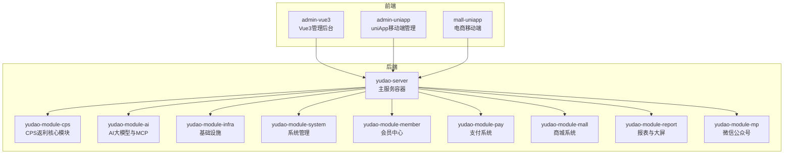
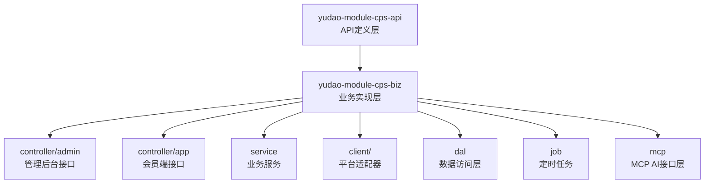
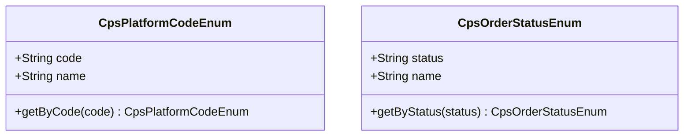
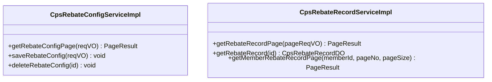
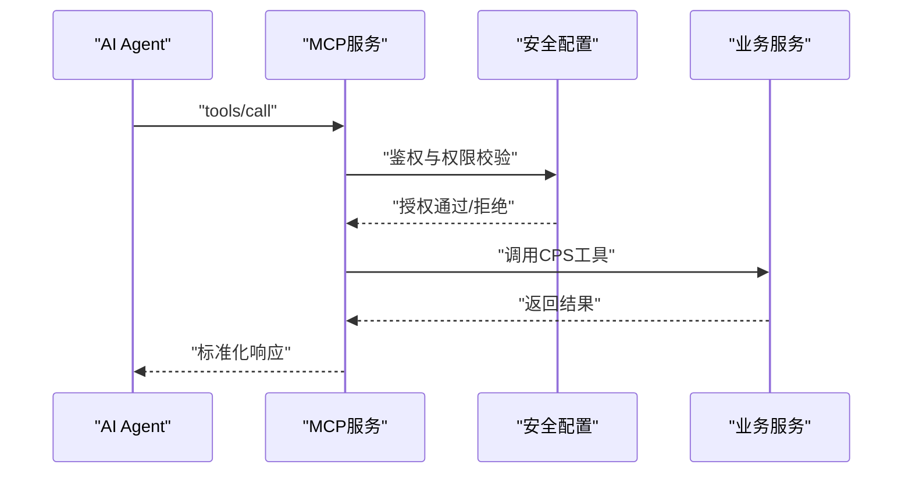
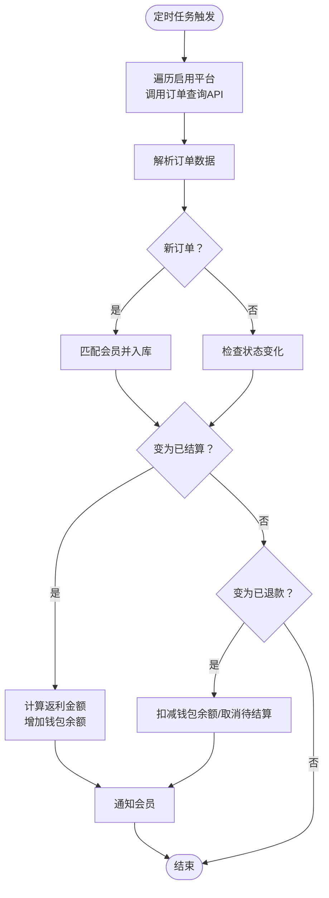
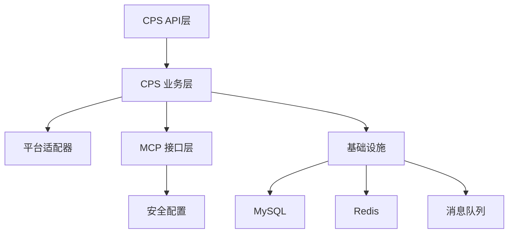

# 项目介绍与背景

<cite>
**本文引用的文件**
- [README.md](file://README.md)
- [CPS系统PRD文档.md](file://docs/CPS系统PRD文档.md)
- [AGENTS.md](file://AGENTS.md)
- [CpsPlatformCodeEnum.java](file://backend/yudao-module-cps/yudao-module-cps-api/src/main/java/cn/iocoder/yudao/module/cps/enums/CpsPlatformCodeEnum.java)
- [CpsOrderStatusEnum.java](file://backend/yudao-module-cps/yudao-module-cps-api/src/main/java/cn/iocoder/yudao/module/cps/enums/CpsOrderStatusEnum.java)
- [CpsRebateConfigServiceImpl.java](file://backend/yudao-module-cps/yudao-module-cps-biz/src/main/java/cn/iocoder/yudao/module/cps/service/rebate/CpsRebateConfigServiceImpl.java)
- [CpsRebateRecordServiceImpl.java](file://backend/yudao-module-cps/yudao-module-cps-biz/src/main/java/cn/iocoder/yudao/module/cps/service/rebate/CpsRebateRecordServiceImpl.java)
- [SecurityConfiguration.java](file://backend/yudao-module-ai/src/main/java/cn/iocoder/yudao/module/ai/framework/security/config/SecurityConfiguration.java)
</cite>

## 目录
1. [引言](#引言)
2. [项目结构](#项目结构)
3. [核心组件](#核心组件)
4. [架构总览](#架构总览)
5. [详细组件分析](#详细组件分析)
6. [依赖关系分析](#依赖关系分析)
7. [性能考量](#性能考量)
8. [故障排查指南](#故障排查指南)
9. [结论](#结论)
10. [附录](#附录)

## 引言
AgenticCPS 是一款基于 ruoyi-vue-pro 构建的智能 CPS（按销售付费）联盟返利系统，面向一人公司创业者、自由职业者、个人开发者与小型工作室，提供“零代码启动、对话式开发、全自动运营”的返利与导购平台。项目深度融合 Vibe Coding（氛围编程）、低代码与 AI 自主编程三大理念，旨在用自然语言描述需求，让 AI 自动完成从数据库设计、接口开发、测试到部署的全流程，从而大幅降低开发成本、缩短交付周期、降低技术门槛。

项目解决的核心痛点包括：
- 传统 CPS 系统开发需要全栈团队，周期长（3~6 个月），成本高（人力 30~100 万/年）
- 平台对接分散，每个平台单独开发，维护成本高
- 运维依赖专职团队，异常处理与告警自动化程度低
- 功能迭代排期繁琐，难以快速响应业务变化

通过三大核心理念，AgenticCPS 实现：
- Vibe Coding：用自然语言描述需求，AI 自动理解、编码、测试、交付
- 低代码：代码生成器、可视化工作流、报表大屏设计器、MCP 协议零代码接入
- AI 自主编程：CPS 核心模块（20,000+ 行代码）100% 由 AI 自主编写，覆盖定时任务、MCP 接口层、业务服务与单元测试

目标用户群体与典型挑战：
- 一人公司创业者：团队只有自己，需要低成本、高效率地搭建返利平台
- 自由职业者/数字游民：希望打造被动收入管道，减少重复劳动
- 个人开发者：快速搭建完整的返利 SaaS，降低技术门槛
- 小型工作室：3 人团队想干 30 人的活，需要自动化与智能化支撑

## 项目结构
AgenticCPS 采用前后端分离与模块化架构，后端基于 Spring Boot 3.5.9 + Java 17/21，前端包含 Vue3 管理后台与 UniApp 移动端，CPS 模块位于 yudao-module-cps，AI 模块位于 yudao-module-ai，基础设施模块位于 yudao-module-infra，系统管理、会员中心、支付系统、商城系统、报表与大屏、微信公众号等模块协同工作。

**图表来源**
- [AGENTS.md:13-57](file://AGENTS.md#L13-L57)

**章节来源**
- [AGENTS.md:13-57](file://AGENTS.md#L13-L57)
- [README.md:267-284](file://README.md#L267-L284)

## 核心组件
- CPS 联盟返利系统：聚合淘宝、京东、拼多多、抖音联盟，提供商品搜索、比价、推广链接生成、订单追踪、返利结算与提现管理
- 低代码能力：代码生成器（单表/树表/主子表）、可视化工作流（Flowable）、报表与大屏设计器、MCP 协议零代码接入
- AI 自主编程：CPS 核心模块 100% 由 AI 自主编写，包含定时任务、MCP 接口层、业务服务与单元测试
- 技术架构：Spring Boot 3.5.9、Spring Security、Spring AI、MyBatis Plus、Redis/Redisson、Flowable、Vue3/UniApp、MySQL、Quartz、SkyWalking

**章节来源**
- [README.md:212-264](file://README.md#L212-L264)
- [README.md:286-302](file://README.md#L286-L302)

## 架构总览
CPS 模块采用分层架构，API 定义层（yudao-module-cps-api）与业务实现层（yudao-module-cps-biz）分离，平台适配器通过策略模式实现可插拔扩展，MCP 接口层提供 AI Agent 零代码接入能力。

**图表来源**
- [README.md:223-243](file://README.md#L223-L243)

**章节来源**
- [README.md:223-243](file://README.md#L223-L243)

## 详细组件分析

### 平台编码与订单状态枚举
平台编码与订单状态通过枚举统一管理，确保系统一致性与可扩展性。

**图表来源**
- [CpsPlatformCodeEnum.java:14-44](file://backend/yudao-module-cps/yudao-module-cps-api/src/main/java/cn/iocoder/yudao/module/cps/enums/CpsPlatformCodeEnum.java#L14-L44)
- [CpsOrderStatusEnum.java:14-47](file://backend/yudao-module-cps/yudao-module-cps-api/src/main/java/cn/iocoder/yudao/module/cps/enums/CpsOrderStatusEnum.java#L14-L47)

**章节来源**
- [CpsPlatformCodeEnum.java:14-44](file://backend/yudao-module-cps/yudao-module-cps-api/src/main/java/cn/iocoder/yudao/module/cps/enums/CpsPlatformCodeEnum.java#L14-L44)
- [CpsOrderStatusEnum.java:14-47](file://backend/yudao-module-cps/yudao-module-cps-api/src/main/java/cn/iocoder/yudao/module/cps/enums/CpsOrderStatusEnum.java#L14-L47)

### 返利配置与返利记录服务
返利配置与返利记录服务负责返利规则的配置与查询，支持按会员、等级、平台等维度灵活配置返利比例。

**图表来源**
- [CpsRebateConfigServiceImpl.java:22-35](file://backend/yudao-module-cps/yudao-module-cps-biz/src/main/java/cn/iocoder/yudao/module/cps/service/rebate/CpsRebateConfigServiceImpl.java#L22-L35)
- [CpsRebateRecordServiceImpl.java:12-40](file://backend/yudao-module-cps/yudao-module-cps-biz/src/main/java/cn/iocoder/yudao/module/cps/service/rebate/CpsRebateRecordServiceImpl.java#L12-L40)

**章节来源**
- [CpsRebateConfigServiceImpl.java:22-35](file://backend/yudao-module-cps/yudao-module-cps-biz/src/main/java/cn/iocoder/yudao/module/cps/service/rebate/CpsRebateConfigServiceImpl.java#L22-L35)
- [CpsRebateRecordServiceImpl.java:12-40](file://backend/yudao-module-cps/yudao-module-cps-biz/src/main/java/cn/iocoder/yudao/module/cps/service/rebate/CpsRebateRecordServiceImpl.java#L12-L40)

### MCP 接口与安全配置
MCP（Model Context Protocol）提供 AI Agent 零代码接入能力，安全配置确保 MCP 服务的访问控制与权限管理。

**图表来源**
- [SecurityConfiguration.java:25-30](file://backend/yudao-module-ai/src/main/java/cn/iocoder/yudao/module/ai/framework/security/config/SecurityConfiguration.java#L25-L30)

**章节来源**
- [SecurityConfiguration.java:14-30](file://backend/yudao-module-ai/src/main/java/cn/iocoder/yudao/module/ai/framework/security/config/SecurityConfiguration.java#L14-L30)

### 订单全链路追踪流程
系统通过定时任务同步订单，按平台结算节奏进行返利结算与入账，支持退款扣回与异常处理。

**图表来源**
- [CPS系统PRD文档.md:183-223](file://docs/CPS系统PRD文档.md#L183-L223)

**章节来源**
- [CPS系统PRD文档.md:183-223](file://docs/CPS系统PRD文档.md#L183-L223)

## 依赖关系分析
- 模块耦合：CPS 模块通过 API 定义层与业务实现层解耦，平台适配器通过策略模式实现可插拔扩展，MCP 接口层与业务服务解耦，便于独立演进
- 外部依赖：MySQL、Redis、Flowable、Quartz、SkyWalking、Spring AI、Vue3/UniApp 等
- 安全与权限：Spring Security 配置 MCP 服务的访问控制，结合 API Key 与权限级别实现细粒度授权

**图表来源**
- [AGENTS.md:13-57](file://AGENTS.md#L13-L57)
- [SecurityConfiguration.java:14-30](file://backend/yudao-module-ai/src/main/java/cn/iocoder/yudao/module/ai/framework/security/config/SecurityConfiguration.java#L14-L30)

**章节来源**
- [AGENTS.md:13-57](file://AGENTS.md#L13-L57)
- [SecurityConfiguration.java:14-30](file://backend/yudao-module-ai/src/main/java/cn/iocoder/yudao/module/ai/framework/security/config/SecurityConfiguration.java#L14-L30)

## 性能考量
- 搜索与比价：单平台搜索 P99 < 2 秒，多平台比价 P99 < 5 秒
- 转链生成：P99 < 1 秒
- 订单同步：延迟 < 30 分钟
- 返利入账：平台结算后 24 小时内
- MCP 工具调用：搜索类 < 3 秒，查询类 < 1 秒

**章节来源**
- [README.md:326-341](file://README.md#L326-L341)

## 故障排查指南
- 环境要求：JDK 17/21、MySQL 5.7/8.0+、Redis 5.0+、Maven 3.8+、Node.js 16+
- 启动步骤：克隆 ruoyi-vue-pro → 初始化数据库 → 后端编译运行
- 常见问题：数据库连接错误、Redis 连接失败、MCP 服务未启动、API Key 权限不足
- 定位方法：查看定时任务日志、监控平台（SkyWalking）、MCP 访问日志，确认平台 API Key 与限额配置

**章节来源**
- [README.md:299-324](file://README.md#L299-L324)
- [CPS系统PRD文档.md:735-757](file://docs/CPS系统PRD文档.md#L735-L757)

## 结论
AgenticCPS 通过 Vibe Coding + 低代码 + AI 自主编程的深度融合，将传统 CPS 系统的开发成本、周期与技术门槛降至极低水平，为一人公司与个人开发者提供了“开箱即用、对话式开发、全自动运营”的智能返利平台。项目已进入成熟稳定阶段，具备完整的模块化架构、完善的 MCP 接口与安全配置、可靠的订单追踪与结算流程，适合快速复制与规模化运营。

## 附录
- 项目进展：已完成基础框架、核心功能、订单与结算、会员与提现、数据统计、MCP 接口、文档与优化
- 典型场景：一人公司创业、AI 导购助手、Vibe Coding 快速扩展
- 社区与支持：知识星球、微信群、功能悬赏计划、企业赞助回报

**章节来源**
- [README.md:367-375](file://README.md#L367-L375)
- [README.md:339-364](file://README.md#L339-L364)
- [README.md:423-482](file://README.md#L423-L482)