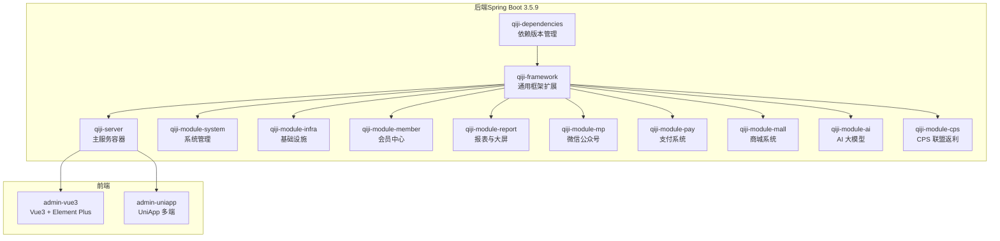
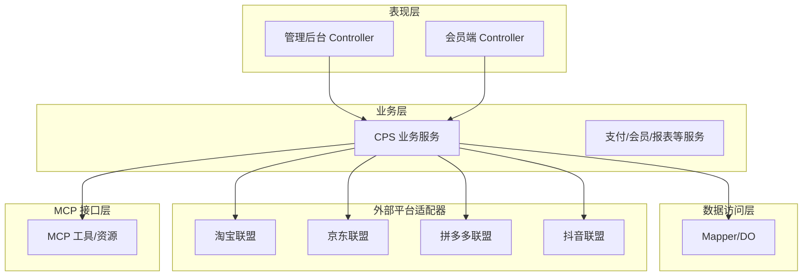
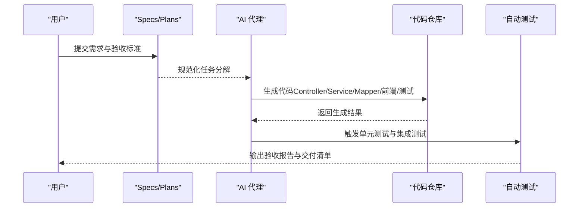
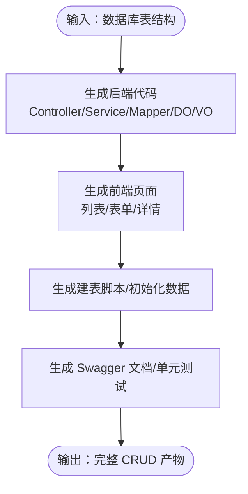
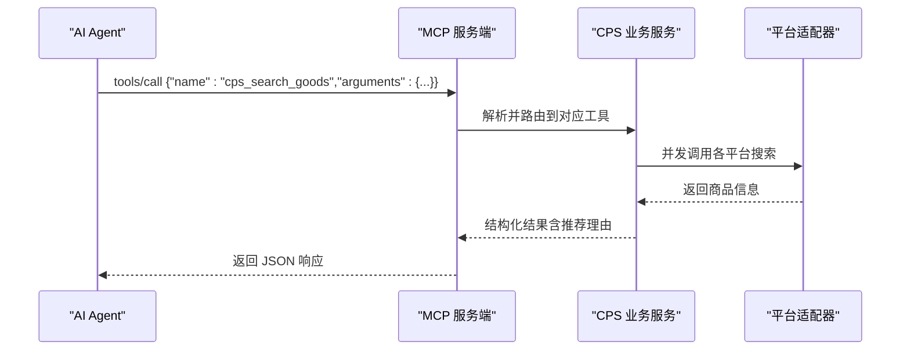
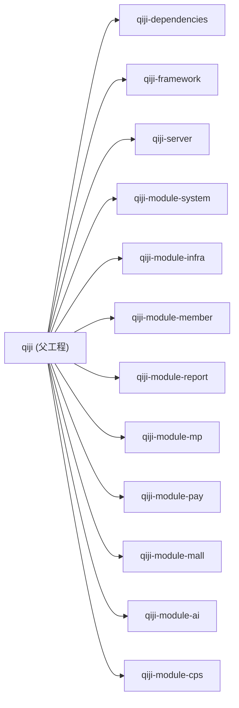

# 项目概述

<cite>
**本文引用的文件**
- [README.md](file://README.md)
- [pom.xml](file://backend/pom.xml)
- [application-local.yaml](file://backend/qiji-server/src/main/resources/application-local.yaml)
- [Dockerfile](file://backend/qiji-server/Dockerfile)
- [package.json（admin-vue3）](file://frontend/admin-vue3/package.json)
- [package.json（admin-uniapp）](file://frontend/admin-uniapp/package.json)
- [CpsPlatformCodeEnum.java](file://backend/qiji-module-cps/qiji-module-cps-api/src/main/java/com/qiji/cps/module/cps/enums/CpsPlatformCodeEnum.java)
- [MEMORY.md](file://agent_improvement/memory/MEMORY.md)
- [AGENTS.md](file://AGENTS.md)
- [CodegenController.java](file://backend/qiji-module-infra/src/main/java/com/qiji/cps/module/infra/controller/admin/codegen/CodegenController.java)
</cite>

## 目录
1. [简介](#简介)
2. [项目结构](#项目结构)
3. [核心组件](#核心组件)
4. [架构总览](#架构总览)
5. [详细组件分析](#详细组件分析)
6. [依赖关系分析](#依赖关系分析)
7. [性能考量](#性能考量)
8. [故障排查指南](#故障排查指南)
9. [结论](#结论)
10. [附录](#附录)

## 简介
AgenticCPS 是一款面向“CPS 联盟返利”的智能平台，其核心价值主张是“Vibe Coding + 低代码 + AI 自主编程”的融合理念。项目通过自然语言驱动的开发范式，使“一个人”具备一支技术团队的战斗力；在 CPS 领域实现“开箱即用”的多平台接入、AI 自主编程与低代码开发的完整闭环。

- 用自然语言描述需求，AI 自动完成从数据库设计、接口实现、定时任务、MCP 接口层到单元测试的全流程。
- 一人公司（OPC）也能像拥有 5–10 人团队一样高效交付，开发周期从数月缩短到“按天计”的 AI 扩展。
- 开箱即用的多平台接入（淘宝/京东/拼多多/抖音等），并提供 MCP 协议的 AI Agent 零代码接入能力。
- 低代码贯穿前后端：代码生成器、可视化工作流、报表/大屏设计器、MCP 工具集等。

**章节来源**
- [README.md:34-80](file://README.md#L34-L80)
- [README.md:84-144](file://README.md#L84-L144)
- [README.md:147-228](file://README.md#L147-L228)

## 项目结构
AgenticCPS 采用模块化的多模块 Maven 工程组织，后端以 Spring Boot 3.5.9 为核心，前端提供 Vue3 管理后台与 UniApp 移动端，配合 Spring AI 的 MCP 支持与丰富的基础设施模块。

**图表来源**
- [pom.xml:10-25](file://backend/pom.xml#L10-L25)
- [package.json（admin-vue3）:1-160](file://frontend/admin-vue3/package.json#L1-L160)
- [package.json（admin-uniapp）:1-194](file://frontend/admin-uniapp/package.json#L1-L194)

**章节来源**
- [pom.xml:10-25](file://backend/pom.xml#L10-L25)
- [README.md:267-302](file://README.md#L267-L302)

## 核心组件
- 后端核心：Spring Boot 3.5.9 + Spring Security + Spring AI（MCP 支持）+ MyBatis Plus + Redis/Redisson + Flowable + Quartz + SkyWalking
- 前端核心：Vue3 + Element Plus（admin-vue3）、UniApp（admin-uniapp）
- 数据库：MySQL（支持 Oracle/PG/SQLServer/达梦/人大金仓/GaussDB/openGauss）
- 运维：Docker 一键拉起（后端 48080 端口）

这些组件共同构成“Vibe Coding + 低代码 + AI 自主编程”的技术底座，支撑从自然语言到可运行系统的完整闭环。

**章节来源**
- [README.md:286-302](file://README.md#L286-L302)
- [Dockerfile:1-24](file://backend/qiji-server/Dockerfile#L1-L24)

## 架构总览
AgenticCPS 采用分层与模块化设计：
- 分层：表现层（Controller）→ 业务层（Service）→ 数据访问层（Mapper/DO）→ 外部平台适配器（策略模式）
- 模块：系统管理、会员中心、支付、商城、报表、微信公众号、基础设施、AI、CPS 联盟返利等
- CPS 模块包含 API 定义层、业务实现层、定时任务、MCP 接口层与平台适配器（淘宝/京东/拼多多/抖音等）

**图表来源**
- [README.md:229-249](file://README.md#L229-L249)

**章节来源**
- [README.md:229-249](file://README.md#L229-L249)

## 详细组件分析

### Vibe Coding 与 AI 自主编程
- 工作流：需求对齐 → 方案设计 → AI 自主编码 → 自动测试 → 验收交付
- 规范化：通过 Specs/Plans/Agents/Skills 的规范化工作流，确保 AI 编码质量与一致性
- 成果：CPS 核心模块（20,000+ 行）100% 由 AI 自主编程完成，覆盖数据库、接口、定时任务、MCP 接口层与单元测试

**图表来源**
- [README.md:113-144](file://README.md#L113-L144)

**章节来源**
- [README.md:84-144](file://README.md#L84-L144)
- [AGENTS.md:1-226](file://AGENTS.md#L1-L226)
- [MEMORY.md:1-21](file://agent_improvement/memory/MEMORY.md#L1-L21)

### 低代码能力
- 代码生成器：输入数据库表结构，一键生成后端（Controller/Service/Mapper/DO/VO）+ 前端（列表/表单/详情）+ SQL + Swagger + 单元测试
- 可视化工作流：基于 Flowable，在线拖拽设计审批流程（提现审核、返利结算、平台接入等）
- 报表/大屏：拖拽生成数据报表、图形报表、大屏与打印模板
- MCP 协议：AI Agent 零代码接入，直接调用 5 个开箱即用的 MCP 工具

**图表来源**
- [README.md:151-165](file://README.md#L151-L165)
- [CodegenController.java:1-23](file://backend/qiji-module-infra/src/main/java/com/qiji/cps/module/infra/controller/admin/codegen/CodegenController.java#L1-L23)

**章节来源**
- [README.md:147-228](file://README.md#L147-L228)
- [CodegenController.java:1-23](file://backend/qiji-module-infra/src/main/java/com/qiji/cps/module/infra/controller/admin/codegen/CodegenController.java#L1-L23)

### 多平台接入与 MCP 协议
- 平台接入：CpsPlatformCodeEnum 定义了淘宝/京东/拼多多/抖音等平台编码，支持策略扩展接入新平台
- MCP 接口：通过 Streamable HTTP（JSON-RPC 2.0）暴露工具与资源，支持 API Key 管理、访问日志与权限控制
- AI Agent：无需写代码，直接调用 cps_search_goods、cps_compare_prices、cps_generate_link、cps_query_orders、cps_get_rebate_summary 等工具

**图表来源**
- [AGENTS.md:182-188](file://AGENTS.md#L182-L188)
- [CpsPlatformCodeEnum.java:16-46](file://backend/qiji-module-cps/qiji-module-cps-api/src/main/java/com/qiji/cps/module/cps/enums/CpsPlatformCodeEnum.java#L16-L46)

**章节来源**
- [AGENTS.md:182-203](file://AGENTS.md#L182-L203)
- [CpsPlatformCodeEnum.java:16-46](file://backend/qiji-module-cps/qiji-module-cps-api/src/main/java/com/qiji/cps/module/cps/enums/CpsPlatformCodeEnum.java#L16-L46)

### 技术栈概览
- 后端：Spring Boot 3.5.9、Spring Security、Spring AI（MCP 支持）、MyBatis Plus、Redis/Redisson、Flowable、Quartz、SkyWalking
- 前端：Vue3 + Element Plus（admin-vue3）、UniApp（admin-uniapp）
- 数据库：MySQL（支持多厂商）
- 运维：Docker 一键部署（后端 48080 端口）

**章节来源**
- [README.md:286-302](file://README.md#L286-L302)
- [package.json（admin-vue3）:27-160](file://frontend/admin-vue3/package.json#L27-L160)
- [package.json（admin-uniapp）:99-194](file://frontend/admin-uniapp/package.json#L99-L194)
- [Dockerfile:1-24](file://backend/qiji-server/Dockerfile#L1-L24)

## 依赖关系分析
后端采用父子工程结构，父工程统一管理依赖与构建插件，子模块按领域拆分，形成高内聚、低耦合的模块化架构。

**图表来源**
- [pom.xml:10-25](file://backend/pom.xml#L10-L25)

**章节来源**
- [pom.xml:10-25](file://backend/pom.xml#L10-L25)

## 性能考量
- 搜索与比价：单平台搜索 P99 < 2 秒，多平台比价 P99 < 5 秒
- 转链生成：P99 < 1 秒
- 订单同步：延迟 < 30 分钟
- 返利入账：平台结算后 24 小时内
- MCP 工具调用：搜索类 < 3 秒，查询类 < 1 秒

这些指标体现了系统在高并发与多平台数据聚合下的性能保障能力。

**章节来源**
- [README.md:369-379](file://README.md#L369-L379)

## 故障排查指南
- 环境与端口：后端默认端口 48080，前端默认 8080；Docker 一键拉起后可通过日志定位问题
- 数据库连接：检查 application-local.yaml 中的数据库与 Redis 配置
- 定时任务：Quartz 默认本地不自动启动，可在配置中调整
- 监控与日志：Actuator 暴露全部端点，Spring Boot Admin 可查看服务状态
- 微信公众号/小程序：配置 app-id/secret 与 Redis 存储，确保跨节点共享

**章节来源**
- [application-local.yaml:1-294](file://backend/qiji-server/src/main/resources/application-local.yaml#L1-L294)
- [Dockerfile:19-24](file://backend/qiji-server/Dockerfile#L19-L24)

## 结论
AgenticCPS 将“Vibe Coding + 低代码 + AI 自主编程”落地为可运行的 CPS 联盟返利平台，通过自然语言驱动的开发范式与模块化架构，实现“一人公司也能拥有团队级战斗力”。其多平台接入、MCP 零代码接入、低代码生成与可视化能力，构成了从需求到上线的完整闭环，适合个人创业者、OPC 与小型团队快速搭建返利 SaaS。

[无需来源：本节为总结性内容]

## 附录
- 快速开始：克隆后端，初始化数据库，启动 qiji-server；前端分别进入 admin-vue3 与 admin-uniapp 执行安装与开发命令
- Docker：在 backend/script/docker 目录下使用 docker-compose 一键拉起 MySQL、Redis、后端与前端面板
- 性能指标与演示截图：详见 README 的“性能指标”与“演示图”章节

**章节来源**
- [README.md:305-368](file://README.md#L305-L368)