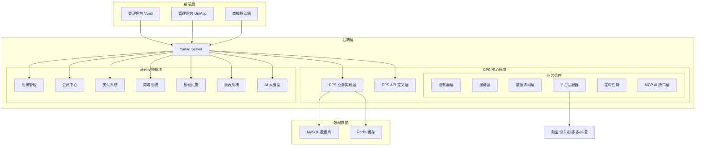
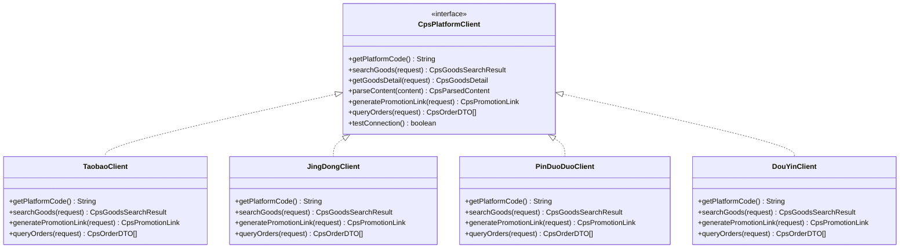
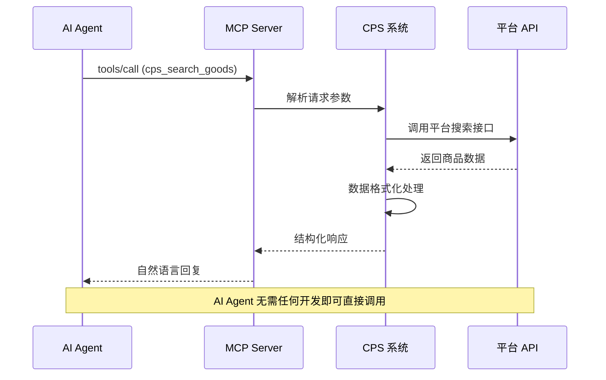
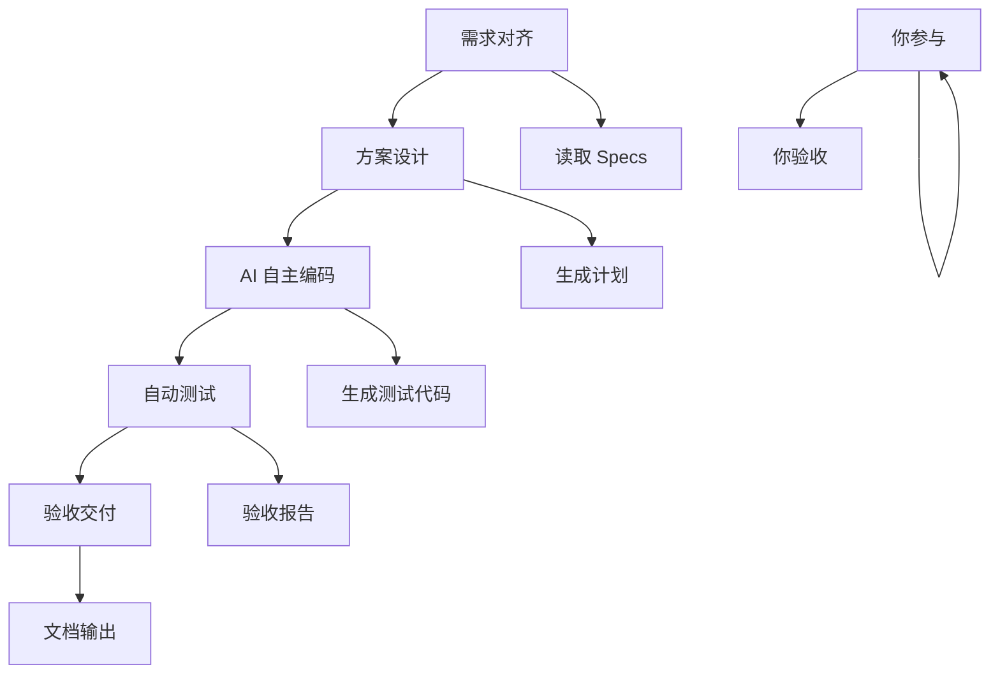

# 项目概述

<cite>
**本文档引用的文件**
- [README.md](file://README.md)
- [AGENTS.md](file://AGENTS.md)
- [CPS系统PRD文档.md](file://docs/CPS系统PRD文档.md)
- [codegen-rules.md](file://agent_improvement/memory/codegen-rules.md)
- [index.ts](file://frontend/admin-vue3/src/api/infra/codegen/index.ts)
- [pom.xml](file://backend/yudao-module-ai/pom.xml)
</cite>

## 目录
1. [项目简介](#项目简介)
2. [核心价值与独特优势](#核心价值与独特优势)
3. [技术架构总览](#技术架构总览)
4. [核心技术详解](#核心技术详解)
5. [核心功能模块](#核心功能模块)
6. [适用场景与用户群体](#适用场景与用户群体)
7. [项目定位与价值主张](#项目定位与价值主张)
8. [快速开始与部署指南](#快速开始与部署指南)
9. [性能指标与SLA](#性能指标与sla)
10. [开源协议与商业模式](#开源协议与商业模式)

## 项目简介

AgenticCPS 是一个专为一人公司（OPC）打造的智能返利赚钱机器，基于 Vibe Coding AI 自主编程范式，融合低代码开发理念与 MCP 协议 AI Agent 零代码接入技术，为用户提供从自然语言需求描述到自动化编码、测试、部署的完整解决方案。

该项目的核心使命是让一个人拥有一支技术团队的战斗力，通过 AI 自主编程实现 CPS（Cost Per Sale）联盟返利与导购平台的一键式部署和智能化运营。

## 核心价值与独特优势

### 1. Vibe Coding AI 自主编程范式

**什么是 Vibe Coding？**
- 不是你写代码，而是你描述 Vibe（氛围/意图/感觉），AI 把它变成可运行的软件
- 传统开发循环：写代码 → 编译 → 调试
- Vibe Coding 循环：描述意图 → AI 理解 → AI 编码 → AI 测试 → AI 交付

**实际落地成果：**
- 项目 CPS 核心模块（20,000+ 行代码）100% 由 AI 自主编程完成
- 从数据库设计到 API 接口，从业务逻辑到单元测试，从定时任务到 MCP AI 接口层，全部由 AI 自主编写

### 2. 低代码开发理念

**代码生成器 - 一键生成 CRUD：**
- 输入一张数据库表，一键生成完整的前后端代码
- 输出包括：Java Controller/Service/Mapper/DO/VO、Vue3 前端页面、SQL 建表脚本、Swagger API 文档、单元测试代码
- 支持单表、树表、主子表三种模式，覆盖 80% 的管理后台开发场景

**可视化工作流：** 基于 Flowable 工作流引擎，在线拖拽设计审批流程
- 提现审核流程
- 返利结算审批  
- 平台接入流程
- 任何自定义业务流程

**报表与大屏：** 拖拽生成数据可视化
- 数据报表设计器、图形报表设计器、大屏设计器、打印设计器

### 3. MCP 协议 AI Agent 零代码接入

**5 个 AI Tools 开箱即用：**
- `cps_search_goods`：商品搜索，帮用户在淘宝/京东/拼多多搜商品
- `cps_compare_prices`：多平台比价，自动比较各平台价格，推荐最优方案  
- `cps_generate_link`：推广链接生成，生成带返利追踪的购买链接
- `cps_query_orders`：订单查询，查看用户的返利订单状态
- `cps_get_rebate_summary`：返利汇总，查看余额、待结算、累计返利

## 技术架构总览



**架构图来源**
- [README.md: 229-249:229-249](file://README.md#L229-L249)
- [AGENTS.md: 13-57:13-57](file://AGENTS.md#L13-L57)

## 核心技术详解

### 1. 平台适配器模式（Strategy Pattern）

CPS 系统采用策略模式实现多平台适配器，支持淘宝、京东、拼多多、抖音等平台的无缝接入：



**类图来源**
- [AGENTS.md: 143-159:143-159](file://AGENTS.md#L143-L159)

### 2. MCP AI 接口层

MCP（Model Context Protocol）协议为 AI Agent 提供零代码接入能力：



**序列图来源**
- [README.md: 183-198:183-198](file://README.md#L183-L198)
- [AGENTS.md: 161-168:161-168](file://AGENTS.md#L161-L168)

### 3. 规范化 AI 编程工作流

AgenticCPS 引入了基于 Specs/Plans 的规范化 AI 编程工作流：



**流程图来源**
- [README.md: 113-135:113-135](file://README.md#L113-L135)

## 核心功能模块

### 1. CPS 联盟返利系统

一站式聚合淘宝、京东、拼多多等主流电商平台，实现从搜索到返利提现的完整闭环：

| 功能模块 | 描述 | 一人公司价值 |
|---------|------|------------|
| 多平台 CPS 接入 | 淘宝/京东/拼多多/抖音联盟统一接入 | 一套系统管所有平台 |
| 商品搜索与比价 | 关键词搜索、链接解析、跨平台比价 | 帮用户找到最省钱的方案 |
| 会员返利体系 | 等级 + 平台 + 个人多维度返利配置 | 灵活设定利润空间 |
| 订单全链路追踪 | 查询 → 转链 → 下单 → 结算 → 入账 | 每一分钱都追踪到位 |
| 提现管理 | 支付宝/微信提现，自动/人工审核 | 自动化资金流转 |
| MCP AI 接口 | 5 个 AI Tools，AI Agent 直接调用 | 接入 ChatGPT、Claude 等 AI 助手 |
| 运营数据看板 | 订单/佣金/返利/利润实时统计 | 一个人掌控全局 |
| 风控管理 | 异常行为检测、黑名单、退款率预警 | 自动守护资金安全 |

### 2. 低代码开发能力矩阵

| 模块 | 核心能力 | 低代码支持 |
|------|---------|-----------|
| 系统管理 | 用户、角色、菜单、部门、字典、日志 | 代码生成器 + 拖拽配置 |
| 会员中心 | 会员管理、等级体系、积分签到、标签分组 | 代码生成器 |
| 支付系统 | 支付宝/微信支付、退款、钱包、转账 | 已集成，开箱即用 |
| 工作流 | Flowable 流程引擎，在线设计审批流 | 可视化流程设计器 |
| 数据报表 | 报表设计器、大屏设计器 | 纯拖拽，零代码 |
| AI 大模型 | 聊天、图像生成、知识库、工作流 | MCP 协议对接 |
| 微信公众号 | 粉丝管理、消息推送、自动回复 | 可视化配置 |
| 商城系统 | 商品、促销、订单、售后 | 代码生成器 |
| 基础设施 | 定时任务、文件服务、消息队列、监控 | 在线管理界面 |

**功能矩阵来源**
- [README.md: 251-264:251-264](file://README.md#L251-L264)

## 适用场景与用户群体

### 1. 典型应用场景

**场景 1：一人公司 CPS 创业**
- 小张，95 后自由职业者，一个人运营返利公众号
- 以前：用 Excel 手动记录订单、手动计算返利、手动转账给用户
- 现在：AgenticCPS 自动同步订单、自动计算返利、用户自助提现
- **每天多出 4 小时做推广，月收入翻 3 倍**

**场景 2：AI 导购助手**
- 小李，独立开发者，想做一个 AI 购物助手
- 以前：需要自己对接淘宝/京东/拼多多 API，写搜索、比价、转链逻辑
- 现在：接入 AgenticCPS 的 MCP 接口，5 个 AI Tools 开箱即用
- **1 天完成原来 2 个月的工作量**

**场景 3：Vibe Coding 快速扩展**
- 小王，返利平台运营者，想接入唯品会联盟
- 以前：找外包开发，报价 3 万，工期 3 周
- 现在：对 AI 说「帮我接入唯品会联盟」，30 分钟搞定
- **开发成本从 3 万降到 0**

### 2. 目标用户群体

| 用户类型 | 画像描述 | 核心诉求 |
|----------|----------|----------|
| **普通消费者** | 有网购习惯，追求性价比 | 购物省钱、获取优惠券、返利到账 |
| **返利达人** | 熟悉CPS模式，主动分享赚钱 | 高返利比例、邀请分润、便捷提现 |
| **平台运营者** | 系统管理员、运营人员 | 平台管理、返利规则配置、数据分析 |

**用户画像来源**
- [CPS系统PRD文档.md: 31-37:31-37](file://docs/CPS系统PRD文档.md#L31-L37)

## 项目定位与价值主张

### 1. 项目定位

**一站式多平台CPS返利查询与导购系统**：聚合淘宝、京东、拼多多等主流电商平台的CPS联盟能力，为会员提供返利查询、跨平台比价、推广链接生成和返利提现等服务。

### 2. 价值主张

**对个人用户的价值：**
- 购物省钱：通过返利系统获得额外收益
- 便捷操作：一键搜索、比价、下单、提现
- 透明追踪：订单状态实时更新，返利到账可预期

**对创业者的价值：**
- 降低门槛：无需技术团队，一人即可运营
- 提高效率：AI 自动化处理重复性工作
- 扩展性强：支持多平台接入和功能扩展

**对开发者的价值：**
- 提升效率：Vibe Coding 让开发速度提升 10 倍
- 降低风险：规范化工作流确保代码质量
- 持续进化：每次项目反馈自动优化工作流程

## 快速开始与部署指南

### 1. 环境要求

| 组件 | 版本要求 |
|------|---------|
| JDK | 17 或 21 |
| MySQL | 5.7 或 8.0+ |
| Redis | 5.0+ |
| Maven | 3.8+ |
| Node.js | 16+（前端构建） |

### 2. 三步启动

```bash
# 1. 克隆项目
git clone https://github.com/YunaiV/ruoyi-vue-pro.git

# 2. 初始化数据库
# 导入 sql/mysql/ 目录下的 SQL 脚本
# 导入 sql/module/cps-schema.sql（CPS 模块）

# 3. 启动后端
mvn clean compile
# 运行 YudaoServerApplication 主类
```

### 3. 代码生成器使用

基于数据库表结构，一键生成完整的 CRUD 代码：

```typescript
// 代码生成器 API 接口
export const getCodegenTableList = (params) => {
  return request.get({ url: '/infra/codegen/table/list?dataSourceConfigId=' + dataSourceConfigId })
}

export const previewCodegen = (id: number) => {
  return request.get({ url: '/infra/codegen/preview?tableId=' + id })
}

export const downloadCodegen = (id: number) => {
  return request.download({ url: '/infra/codegen/download?tableId=' + id })
}
```

**代码生成器来源**
- [index.ts: 61-92:61-92](file://frontend/admin-vue3/src/api/infra/codegen/index.ts#L61-L92)

## 性能指标与SLA

### 1. 性能指标

| 指标 | 要求 |
|------|------|
| 单平台搜索 | < 2 秒（P99） |
| 多平台比价 | < 5 秒（P99） |
| 转链生成 | < 1 秒 |
| 订单同步延迟 | < 30 分钟 |
| 返利入账 | 平台结算后 24 小时内 |
| MCP Tool 调用 | < 3 秒（搜索类）/ < 1 秒（查询类） |

### 2. SLA 承诺

- **可用性**：99.9% 正常运行时间
- **响应时间**：95% 请求 < 2 秒
- **数据一致性**：订单状态变更实时同步
- **安全性**：银行级加密存储，多重身份验证

## 开源协议与商业模式

### 1. 开源协议

本项目采用 **GNU Affero General Public License v3.0 (AGPL-3.0)** 开源协议。

### 2. 使用场景许可

| 使用场景 | 是否允许 |
|---------|---------|
| 个人学习、研究 | ✅ 允许 |
| 内部企业使用 | ✅ 允许 |
| 商业二次开发（需开源） | ✅ 允许 |
| 对外提供 SaaS 服务 | ✅ 允许（需开源修改部分） |
| 闭源商业化分发 | ❌ 禁止 |

### 3. 商业模式

**开源 + 社区生态：**
- 基础功能完全免费
- 高级功能可通过社区贡献获得
- 企业定制开发按需收费

**赞助与支持：**
- 服务器部署费用支持
- AI Token 费用支持
- 持续开发投入支持
- 文档完善费用支持

**企业合作：**
- 金牌合作伙伴：专属技术支持 + 优先功能开发
- 钻石合作伙伴：定制开发支持 + 专属技术顾问

---

**项目愿景：**
让每一个有想法的人，都能拥有自己的返利帝国。通过 Vibe Coding + AI 自主编程 + 低代码 + MCP 协议，构建一个真正"开箱即用"的智能返利赚钱机器。