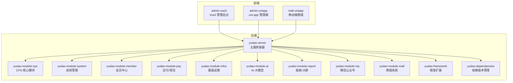
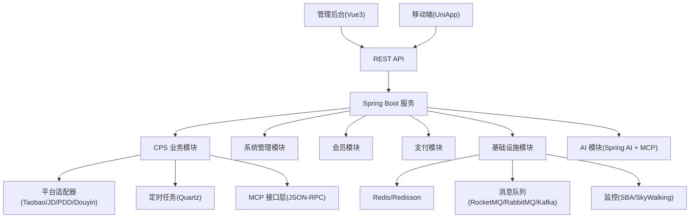
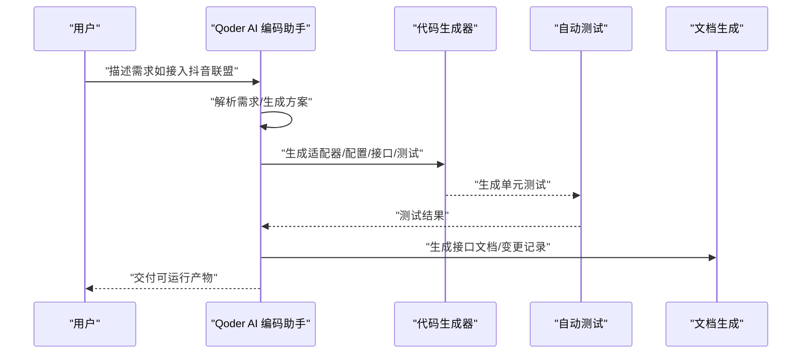
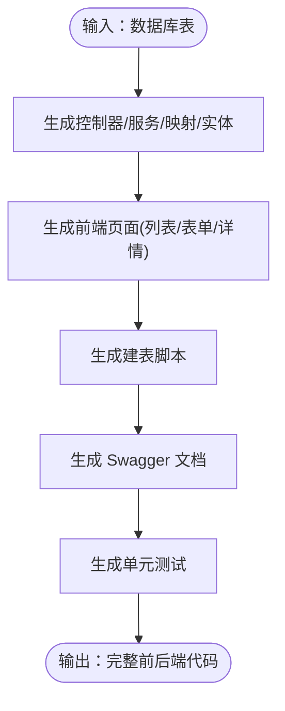
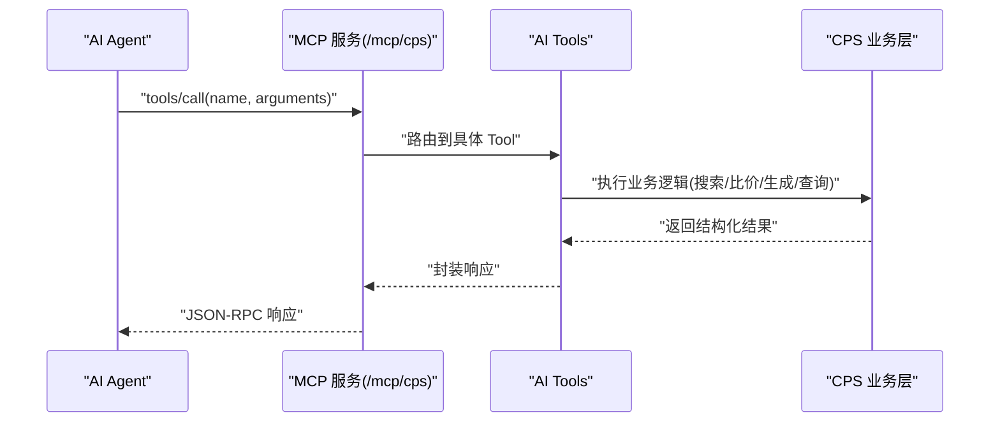
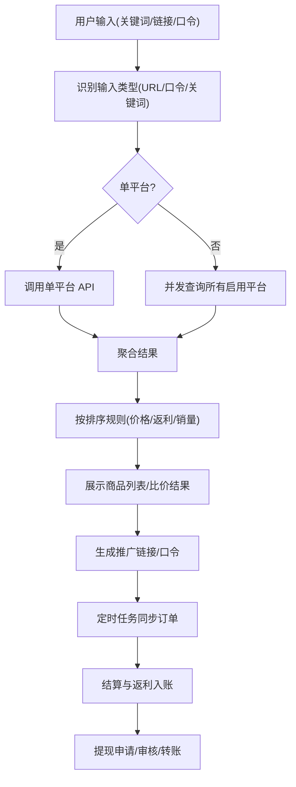
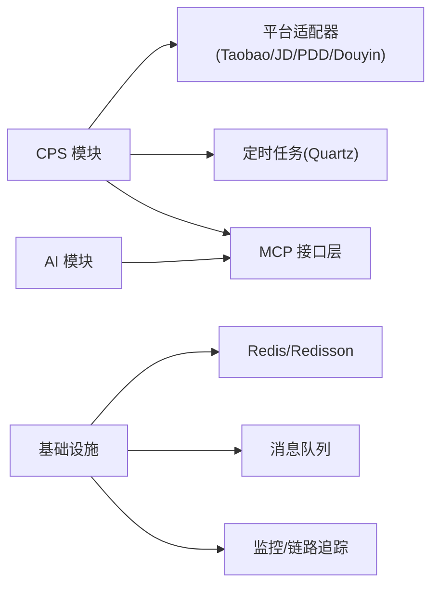

# 项目概述

<cite>
**本文引用的文件**
- [AgenticCPS 项目总览](file://README.md)
- [后端项目说明](file://backend/README.md)
- [CPS 系统 PRD](file://docs/CPS系统PRD文档.md)
- [CLAUDE 项目指引](file://AGENTS.md)
- [后端聚合工程 pom](file://backend/pom.xml)
- [本地开发配置](file://backend/yudao-server/src/main/resources/application-local.yaml)
</cite>

## 目录
1. [项目简介](#项目简介)
2. [项目结构](#项目结构)
3. [核心组件](#核心组件)
4. [架构总览](#架构总览)
5. [详细组件分析](#详细组件分析)
6. [依赖关系分析](#依赖关系分析)
7. [性能考量](#性能考量)
8. [故障排查指南](#故障排查指南)
9. [结论](#结论)
10. [附录](#附录)

## 项目简介
AgenticCPS 是基于 ruoyi-vue-pro 构建的智能 CPS 联盟返利系统，融合 Vibe Coding（氛围编程）+ 低代码 + AI 自主编程三大理念，实现“零代码启动、对话式开发、全自动运营”。系统以“自然语言驱动 AI 自主编程”为核心，将 CPS 核心模块（20,000+ 行代码）100% 由 AI 自动生成，覆盖数据库设计、接口、业务逻辑、定时任务到 MCP AI 接口层。

- 目标用户：一人公司（OPC）创业者、自由职业者、个人开发者、小型工作室
- 应用场景：电商返利副业、AI 导购助手、平台扩展与对接
- 核心价值：降低团队规模与开发周期、降低技术门槛、提升运维效率、加速功能迭代

**章节来源**
- [AgenticCPS 项目总览:34-82](file://README.md#L34-L82)
- [后端项目说明:28-76](file://backend/README.md#L28-L76)

## 项目结构
AgenticCPS 采用前后端分离与多模块聚合架构，后端基于 Spring Boot 3.5.9，前端包含 Vue3 管理后台与 UniApp 移动端。核心模块围绕 yudao-module-cps（CPS 联盟返利）展开，并配套系统管理、会员中心、支付、基础设施、AI、报表、微信公众号、商城等模块。

**图示来源**
- [后端聚合工程 pom:10-25](file://backend/pom.xml#L10-L25)
- [CLAUDE 项目指引:14-57](file://AGENTS.md#L14-L57)

**章节来源**
- [后端聚合工程 pom:10-25](file://backend/pom.xml#L10-L25)
- [CLAUDE 项目指引:14-57](file://AGENTS.md#L14-L57)

## 核心组件
- Vibe Coding + AI 自主编程：以自然语言描述需求，AI 完成理解、编码、测试、交付的全流程，CPS 模块 100% 由 AI 生成
- 低代码：提供代码生成器（单表/树表/主子表）、可视化工作流（Flowable）、报表/大屏设计器、MCP 协议零代码接入 AI Agent
- MCP 协议：通过 JSON-RPC over Streamable HTTP 的 /mcp/cps 端点，提供 5 个开箱即用的 AI Tools（商品搜索、多平台比价、推广链接生成、订单查询、返利汇总）

**章节来源**
- [AgenticCPS 项目总览:84-145](file://README.md#L84-L145)
- [后端项目说明:78-139](file://backend/README.md#L78-L139)
- [CPS 系统 PRD:643-737](file://docs/CPS系统PRD文档.md#L643-L737)
- [CLAUDE 项目指引:161-169](file://AGENTS.md#L161-L169)

## 架构总览
系统采用分层架构与模块化设计：
- 表现层：Vue3 管理后台、uni-app 移动端
- 应用层：Spring Boot 服务，模块化拆分
- 领域层：CPS 业务域（平台适配器、订单同步、返利计算、提现）
- 基础设施层：Redis、MySQL、消息队列、定时任务、链路追踪、监控
- AI 集成层：Spring AI + MCP，提供 AI Tools 与资源

**图示来源**
- [CLAUDE 项目指引:11-57](file://AGENTS.md#L11-L57)
- [后端聚合工程 pom:10-25](file://backend/pom.xml#L10-L25)

**章节来源**
- [CLAUDE 项目指引:11-57](file://AGENTS.md#L11-L57)
- [后端聚合工程 pom:10-25](file://backend/pom.xml#L10-L25)

## 详细组件分析

### Vibe Coding 与 AI 自主编程
- 开发范式：描述意图 → AI 理解 → AI 编码 → AI 测试 → AI 交付
- 工作流：Specs/Plans/Agents/Skills 规范化 AI 编程，确保理解无偏差、方案先行、纯 AI 自主编程、质量可保障、持续自进化
- 实践案例：接入抖音联盟平台，AI 自动完成分析 API 文档、生成适配器代码、创建配置表、注册 MCP Tool、编写测试与文档

**图示来源**
- [AgenticCPS 项目总览:84-145](file://README.md#L84-L145)
- [后端项目说明:78-139](file://backend/README.md#L78-L139)

**章节来源**
- [AgenticCPS 项目总览:84-145](file://README.md#L84-L145)
- [后端项目说明:78-139](file://backend/README.md#L78-L139)

### 低代码能力
- 代码生成器：输入数据库表结构，一键生成 Java 控制器/服务/映射/实体/视图、Vue3 前端页面、SQL 建表脚本、Swagger 文档、单元测试
- 可视化工作流：基于 Flowable，在线拖拽设计审批流程（提现审核、返利结算、平台接入等）
- 报表与大屏：拖拽生成数据报表、图形报表、大屏设计器、打印设计器
- MCP 协议：AI Agent 零代码接入，直接调用 5 个 AI Tools

**图示来源**
- [AgenticCPS 项目总览:147-166](file://README.md#L147-L166)
- [后端项目说明:141-179](file://backend/README.md#L141-L179)

**章节来源**
- [AgenticCPS 项目总览:147-210](file://README.md#L147-L210)
- [后端项目说明:141-204](file://backend/README.md#L141-L204)

### MCP 协议与 AI Agent 零代码接入
- 协议：JSON-RPC 2.0 over Streamable HTTP，端点 /mcp/cps
- AI Tools（5 个）：商品搜索、多平台比价、推广链接生成、订单查询、返利汇总
- 管理后台：MCP 服务管理、API Key 管理、Tools/Resouces 管理、Prompt 管理、访问日志与统计分析

**图示来源**
- [CPS 系统 PRD:643-737](file://docs/CPS系统PRD文档.md#L643-L737)
- [CLAUDE 项目指引:161-169](file://AGENTS.md#L161-L169)

**章节来源**
- [CPS 系统 PRD:643-737](file://docs/CPS系统PRD文档.md#L643-L737)
- [CLAUDE 项目指引:161-169](file://AGENTS.md#L161-L169)

### CPS 联盟返利系统核心流程
- 商品搜索与比价：关键词/链接/口令识别，单平台/多平台并发查询，聚合结果与预估返利
- 推广链接生成：注入用户归因参数，调用平台转链 API，返回推广链接/口令
- 订单同步与结算：定时任务增量查询订单，状态追踪与结算，返利入账与通知
- 提现管理：条件校验、审核流程（自动/人工）、转账与异常处理

**图示来源**
- [CPS 系统 PRD:121-261](file://docs/CPS系统PRD文档.md#L121-L261)

**章节来源**
- [CPS 系统 PRD:80-261](file://docs/CPS系统PRD文档.md#L80-L261)

## 依赖关系分析
- 技术栈：Spring Boot 3.5.9、Spring Security 6.5.2、MyBatis Plus、Redis/Redisson、Flowable、Vue3 + Element Plus、UniApp、MySQL、MapStruct、Quartz、SkyWalking
- 模块耦合：yudao-module-cps 通过 client 适配器模式对接多平台，服务层通过定时任务与消息队列解耦，AI 模块通过 MCP 与业务层松耦合
- 外部依赖：各电商平台 API（淘宝/京东/拼多多/抖音）、支付渠道、短信/邮件服务、第三方日志/监控

**图示来源**
- [CLAUDE 项目指引:11-57](file://AGENTS.md#L11-L57)
- [后端聚合工程 pom:10-25](file://backend/pom.xml#L10-L25)

**章节来源**
- [CLAUDE 项目指引:68-81](file://AGENTS.md#L68-L81)
- [后端聚合工程 pom:10-25](file://backend/pom.xml#L10-L25)

## 性能考量
- 搜索与比价：单平台搜索 < 2 秒（P99），多平台比价 < 5 秒（P99）
- 转链生成：< 1 秒
- 订单同步：延迟 < 30 分钟
- 返利入账：平台结算后 24 小时内
- MCP Tool 调用：搜索类 < 3 秒，查询类 < 1 秒

**章节来源**
- [AgenticCPS 项目总览:332-342](file://README.md#L332-L342)
- [后端项目说明:326-336](file://backend/README.md#L326-L336)

## 故障排查指南
- 数据库连接：确认 application-local.yaml 中的 MySQL/Redis 连接配置与端口
- 定时任务：本地开发环境 Quartz 默认关闭，可通过配置开启；检查线程池与集群配置
- 监控与日志：Spring Boot Admin、Actuator 端点开放；日志级别按模块配置
- 微信公众号/小程序：确认 app-id/secret、Redis 存储配置与 HTTP 客户端类型
- 支付回调：确认 yudao.pay.* 回调地址配置
- MCP 服务：检查 /mcp/cps 端点可用性、API Key 权限与限流配置

**章节来源**
- [本地开发配置:1-294](file://backend/yudao-server/src/main/resources/application-local.yaml#L1-L294)

## 结论
AgenticCPS 通过 Vibe Coding + 低代码 + AI 自主编程，将 CPS 联盟返利系统从“需要多人团队、数月开发”的传统模式，转变为“1 人即可、开箱即用、AI 扩展按天计”的全新范式。依托 MCP 协议与 AI Tools，系统实现了“零代码启动、对话式开发、全自动运营”，为一人公司、自由职业者与小型工作室提供了低成本、高效率、可持续的返利与导购解决方案。

## 附录
- 典型场景：一人公司创业、AI 导购助手、平台扩展与对接
- 开源协议：GNU AGPL v3.0
- 社区与支持：知识星球、微信群、赞助与功能悬赏

**章节来源**
- [AgenticCPS 项目总览:345-488](file://README.md#L345-L488)
- [后端项目说明:339-488](file://backend/README.md#L339-L488)