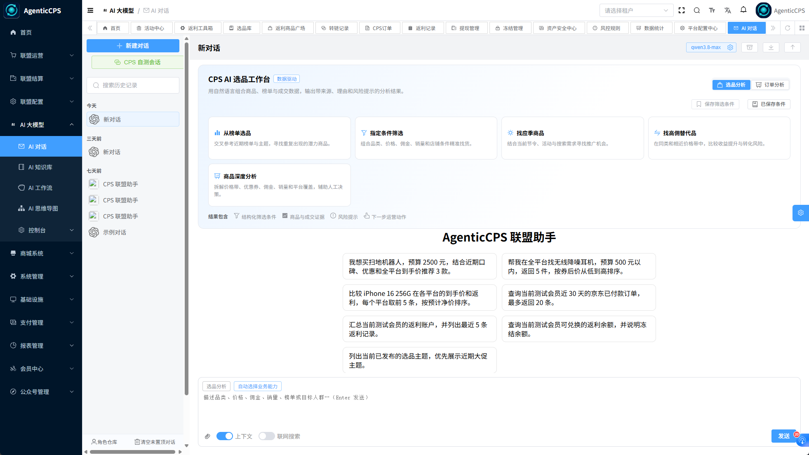
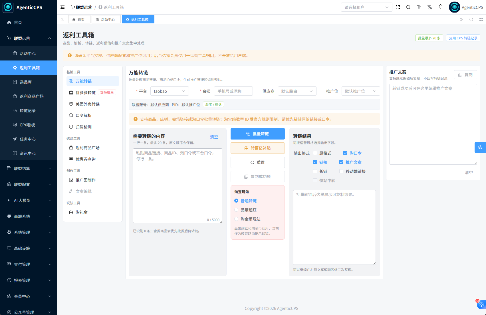
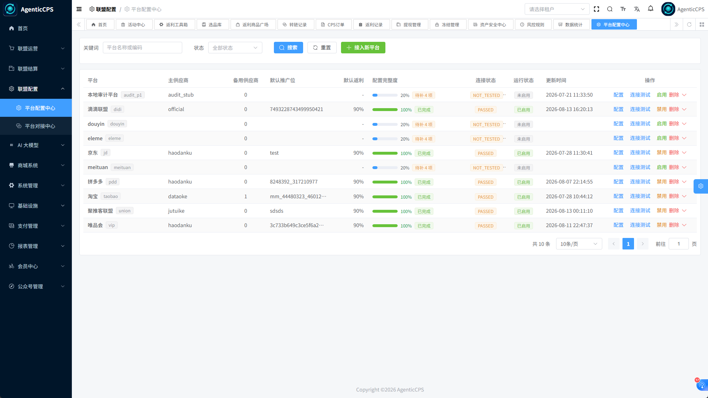
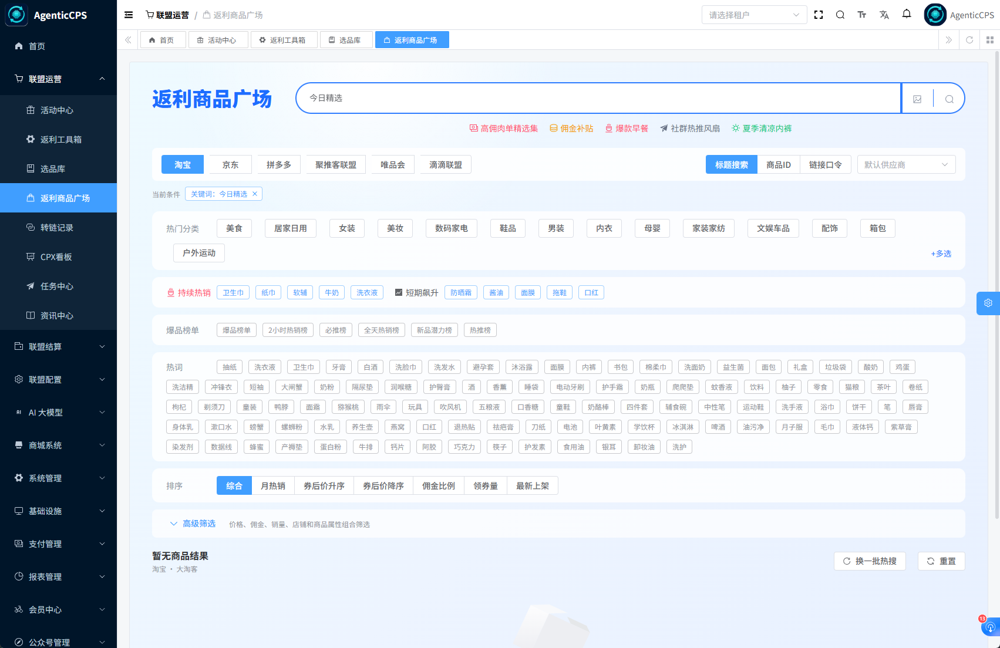
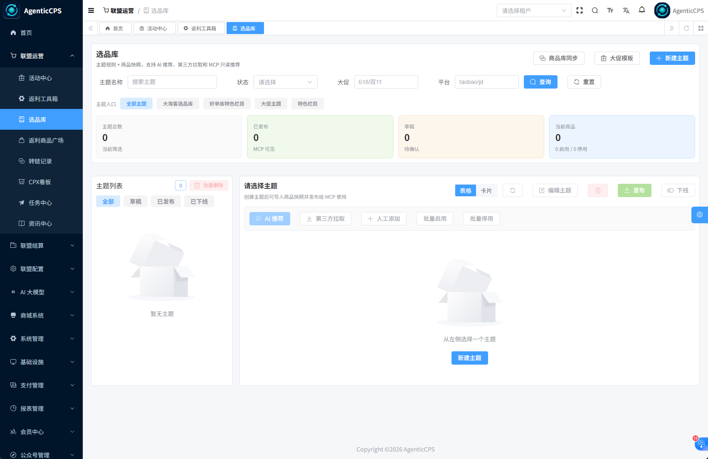
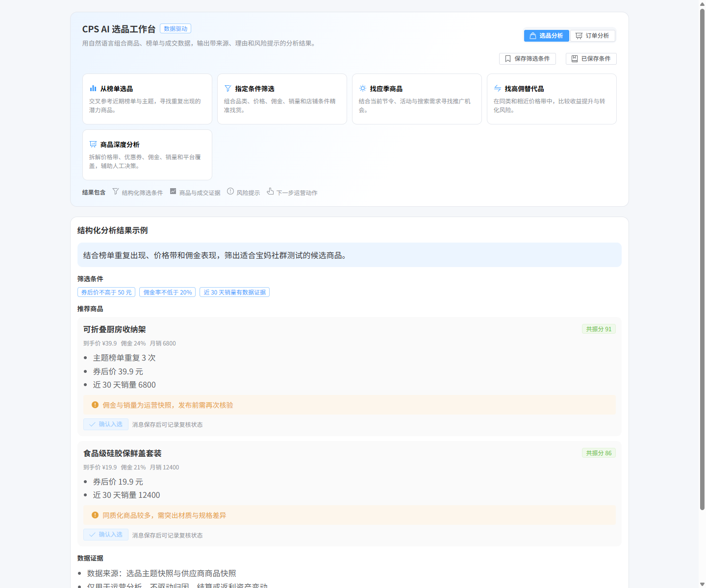

<p align="center">
  
  
  
  
  
</p>

<h1 align="center">AgenticCPS</h1>

<p align="center">
  面向一人公司和小团队的 CPS 联盟返利与智能导购平台<br/>
  聚合商品、优惠、推广、订单和返利资产，让运营与 AI Agent 共用一套能力底座
</p>

> 代码仓库：[Gitee](https://gitee.com/zhuangpengli/AgenticCPS) · [GitCode](https://gitcode.com/lizhuangpeng/AgenticCPS) · [GitHub](https://github.com/zhuangpengLI/AgenticCPS)

快速部署请先阅读 [快速开始](./docs/快速开始.md)；模块位置和接口入口见 [项目地图](./docs/project-map.md)。

## 项目定位

AgenticCPS 是 Agentic 生态中的 CPS 返利与商品推荐服务，覆盖“选品 → 搜索/比价 → 转链 → 下单 → 订单同步 → 返利结算 → 提现/Token 消费”的完整链路。它既可以作为独立的返利商城后端，也可以作为 AI 导购、活动运营和其他 Agent 场景的商品与返利服务。

项目与其他 Agentic 系统保持清晰边界：

| 系统 | 负责什么 | 不负责什么 |
| --- | --- | --- |
| **AgenticCPS** | CPS 平台适配、商品推荐、订单归因、返利结算、返利资产和 CPS MCP Tools | 大模型网关、Token 主账本、设备接入与 IoT 规则 |
| **AgenticTokenHub** | 模型网关、Token 钱包与计费、会员套餐、返利兑换 Token 的入账 | CPS 订单、商品推荐和返利结算 |
| **AgenticAIoT** | 设备、指标、告警、规则和 AI 运维，并触发场景化商品推荐 | CPS 返利账户和电商平台适配 |

当前已落地的生态闭环是：可用 CPS 返利经过冻结、扣减、幂等和审计后兑换为 AgenticTokenHub 的 AI Token；失败解冻，超时进入可补偿的处理中状态。详见 [返利兑换 Token 说明](./docs/agentic-ecosystem-p0-rebate-token-exchange.md)。

## 核心功能

### 多平台商品与推广

- 统一接入淘宝、京东、拼多多、抖音、美团、唯品会、淘宝闪购等平台，并提供大淘客、好单库、聚推客、喵有卷、实惠猪及官方 API 适配器。
- 支持商品搜索、热搜与联想、链接/口令解析、商品详情、优惠券查询、跨平台比价和统一字段返回。
- 支持长链、短链、口令、H5/小程序等推广形式；平台、供应商、推广位和返利规则可插拔扩展。
- 通过平台配置中心完成“平台信息 → 供应商 → 推广位 → 返利配置 → 检测发布”五步配置，检测通过后才切换运行配置。

### 运营选品与营销工具

- **活动中心**：配置 CPS/CPA 活动卡片，支持热门/最新、搜索和商品广场跳转。
- **返利工具箱**：万能转链、口令解析、归属检测、优惠券查询、批量转链、淘礼金计划和推广文案编辑。
- **选品库与 AI 选品工作台**：自定义主题、第三方同步、大促模板、商品快照、AI 筛选条件保存与复用。
- **榜单与专区**：爆款榜、主播销量榜、9.9 包邮、博主橱窗等可配置货架，可被前端和 MCP 查询。
- **营销数据层**：商品主档、来源映射、价格快照、券池、自有短链、点击事件和基础漏斗分析，服务展示、分发与运营分析，不替代结算事实。

### 订单、返利与资金安全

- 订单状态覆盖已下单、已付款、已收货、已结算、已入账及退款/失效分支，保留状态事件、同步 checkpoint 和失败补偿记录。
- 归因记录 `externalId`、`relationId/channelId`、`specialId`、专属 PID 等来源证据；未验证映射的订单只进入对账/人工申领，不自动修改会员资产。
- 支持会员订单查询、订单号申领与管理员审核；会员端只使用登录上下文，避免信任请求体中的 `memberId/userId`。
- 返利账户、冻结/解冻、确认扣减、退款欠款和 Token 兑换统一写入资产台账，具备幂等键、租户隔离、操作审计和可追踪资金流水。
- 支持返利提现、转账记录、风控规则、退款报表和订单资金追踪；金额按分存储，敏感凭证统一加密。

### CPX 任务与增长分析

- 提供 CPS 优先的 CPX 任务大厅、任务详情、Tracking Link、转化查询和资讯/教程内容。
- 管理端支持任务、素材、平台资料、转化事件、结算记录和漏斗看板；OpenAPI 支持曝光、点击、线索、动作/转化事件上报。
- 提供增长分析、渠道/活动漏斗、风险监控、实验分流和 Token 事件对账能力，便于持续运营和归因复盘。

### MCP / Agent 原生能力

内置 Spring AI MCP Server，将 CPS 能力以结构化工具开放给 AI Agent：

| 能力组 | 工具示例 |
| --- | --- |
| 商品与推广 | `cps_search_goods`、`cps_compare_prices`、`cps_generate_link` |
| 订单与返利 | `cps_query_orders`、`cps_get_rebate_summary`、`cps_explain_rebate` |
| 选品与决策 | `cps_recommend_by_scene`、`cps_list_selection_themes`、`cps_recommend_from_selection_theme`、`cps_purchase_decision` |
| 营销策略 | `cps_promotion_strategy_advice`、商品深度分析、成交画像与趋势分析工具 |
| 资产与生态 | `cps_get_rebate_balance`、`cps_create_token_exchange`、`cps_query_exchange_status` |
| CPX | `cpx_list_tasks`、`cpx_get_task_detail`、`cpx_generate_tracking_link`、`cpx_query_conversions`、`cpx_recommend_tasks_by_scene`、`cpx_search_articles` |

新增工具需要同步回调注册、风险清单、AI 工具种子 SQL 和结构化消息解析器。MCP 会员资产工具只接受可信的登录或 ToolContext 会员上下文，并记录访问审计。

## 谁在使用？典型场景

### 场景 1：一人公司经营返利业务

> **小张**是一名独立创业者，通过公众号、社群和移动端运营自己的返利业务。
>
> 以前：分别登录多个联盟后台找商品、生成链接，再用表格跟踪订单、核算返利和处理提现。
>
> 现在：使用 AgenticCPS 统一完成选品、搜索、比价、转链、订单同步、返利结算和会员提现，把日常精力集中在内容与用户运营上。

### 场景 2：搭建 AI 导购助手

> **小李**是一名独立开发者，希望为网站或聊天应用增加智能购物能力。
>
> 以前：需要逐个平台对接商品、优惠券、转链和订单 API，还要自行设计工具协议与会员归因链路。
>
> 现在：通过 AgenticCPS MCP Tools 直接获得商品搜索、跨平台比价、购买决策、推广链接、订单和返利查询能力，并使用可信上下文完成会员归因。

### 场景 3：运营团队做活动与选品

> **小王**负责社群、直播和内容渠道的选品与推广，需要持续更新活动和商品货架。
>
> 以前：选品记录散落在表格和聊天记录中，活动入口、优惠券与推广文案需要重复整理。
>
> 现在：通过活动中心、返利工具箱、选品库、榜单专区和 AI 选品工作台沉淀主题商品，批量生成推广内容，并用短链和漏斗数据复盘渠道效果。

### 场景 4：已有平台扩展联盟能力

> **某内容社区或垂直商城**已经拥有用户、内容和交易入口，希望增加 CPS 商品推荐与返利服务。
>
> 以前：需要在原系统中同时实现平台适配、订单同步、归因、返利账户和风控，容易与主业务深度耦合。
>
> 现在：通过 App API、OpenAPI 或 MCP 接入 AgenticCPS，复用多租户、订单状态、资产台账和审计能力，同时保持原系统的业务边界。

### 场景 5：Agentic 生态场景联动

> **AIoT 或其他 Agent 应用**根据设备告警、采购需求或用户对话产生商品推荐任务。
>
> 以前：场景分析、商品推荐和权益结算彼此割裂，难以形成可追踪的业务闭环。
>
> 现在：Agent 调用 CPS 场景推荐和转链工具，AgenticCPS 负责商品与返利链路，可用返利还可兑换为 AgenticTokenHub 的 AI Token，继续用于后续 AI 服务消费。

## 主要特点

- **一套接口，多平台复用**：平台与供应商采用策略/工厂模式，搜索、转链、订单同步和结算流程统一。
- **运营配置优先**：活动、主题、榜单、券池、短链和返利规则可在管理后台配置，减少重复开发。
- **资产安全可追溯**：订单归因、状态事件、资产台账、冻结扣减和 OpenAPI 签名形成可审计链路。
- **AI 原生**：MCP Tools、场景推荐和 AI 选品工作台可直接嵌入聊天、Agent 或 AIoT 流程。
- **多租户与可演进**：沿用系统权限、租户、缓存、任务和消息基础设施，新增平台或业务模块不需要改造成单体。
- **前后端一体**：提供 Vue3 管理后台、UniApp 管理端和商城移动端，覆盖运营、会员和部署场景。

## 能力边界与数据原则

商品价格、券、佣金、销量和选品快照属于营销/推荐数据，不是订单佣金、返利比例、冻结或资产入账事实。只有经过可信归因并进入订单结算流程的数据，才能产生会员返利；只有 `AVAILABLE` 返利才能兑换 Token。

服务间 OpenAPI 使用 `X-App-Id`、`X-Tenant-Id`、`X-Timestamp`、`X-Nonce`、`X-Signature`、`X-Idempotency-Key` 进行鉴权和幂等。平台凭证、accessKey 和签名不会写入响应或日志。

## 技术架构

```text
frontend/admin-vue3       管理后台（Vue 3 + Element Plus）
frontend/admin-uniapp     移动管理端（UniApp）
frontend/mall-uniapp      会员商城与返利端（UniApp）
        │
backend/qiji-server       Spring Boot 应用入口（48080）
        ├── qiji-module-cps-api
        ├── qiji-module-cps-biz   CPS Controller / Service / Mapper / Job / MCP
        └── qiji-module-cps-sdk-dunion  滴滴联盟 SDK
        │
MySQL + Redis + 定时任务 + 外部联盟/供应商 API
```

核心技术：Java 17/21、Spring Boot 3.5、Spring Security、Spring AI MCP、MyBatis Plus、MySQL、Redis/Redisson、Quartz、Vue 3、UniApp。

## 文档导航

- [快速开始：本地开发、数据库、前端与 Docker](./docs/快速开始.md)
- [项目地图：模块、入口、数据流和接口](./docs/project-map.md)
- [CPS MCP Server 使用指南](./docs/agentic-cps-mcp-server-guide.md)
- [平台配置与供应商接入](./docs/cps-vendor-onboarding-dataoke-haodanku-jutuike.md)
- [大淘客搜索与商品广场](./docs/dataoke-search-page-implementation.md)
- [大淘客高效转链与订单归因](./docs/dataoke-high-efficiency-link-attribution.md)
- [资金与归因安全基线](./docs/cps-funds-attribution-safety-baseline.md)
- [返利兑换 AgenticToken](./docs/agentic-ecosystem-p0-rebate-token-exchange.md)
- [Codex / TDD / E2E 开发流程](./docs/codex-agentic-development-workflow.md)
- [CPS 技术债与风险清单](./docs/cps-tech-debt-inventory.md)

## 截图

管理后台示例（数据为演示数据）：

<p align="center">
  
  
  
</p>
<p align="center">
  
  
  
</p>

## 交流社区

欢迎加入 AgenticCPS 交流社区，与志同道合的开发者、创业者一起探索 Vibe Coding 与 CPS 赚钱的无限可能！

| 渠道 |            二维码            |
|:---------:|:-------------------------:|
| 加入知识星球，获取深度教程、源码解析、运营经验分享|  |
| 添加群主，备注：进技术交流群 |      |
| 扫码加入微信群，获取最新动态、技术答疑、部署支持 |    |


> **微信群**：技术交流、Bug 反馈、功能建议，欢迎扫码加入。
>
> **知识星球**：付费精品社区，内含完整部署教程、Vibe Coding 实战案例、一人公司 CPS 创业经验分享，以及专属答疑服务。

---

## 开源协议

本项目采用 **GNU Affero General Public License v3.0 (AGPL-3.0)** 开源协议。

| 使用场景 | 是否允许 |
|---------|---------|
| 个人学习、研究 | ✅ 允许 |
| 内部企业使用 | ✅ 允许 |
| 商业二次开发（需开源） | ✅ 允许 |
| 对外提供 SaaS 服务 | ✅ 允许（需开源修改部分） |
| 闭源商业化分发 | ❌ 禁止 |

详见 [LICENSE](./LICENSE)

---

## 💝 赞助与支持

开源项目的发展离不开社区的支持。如果您觉得本项目对您有帮助，欢迎赞助支持持续开发！

### 为什么需要赞助？

| 用途 | 说明 |
|------|------|
| 🖥️ 服务器部署 | 测试环境、演示环境、CI/CD 服务器租赁费用 |
| 🤖 AI Token 费用 | 大模型 API 调用费用（通义千问、DeepSeek、OpenAI 等） |
| 🔧 持续开发 | 新平台对接开发、功能迭代、Bug 修复 |
| 📚 文档完善 | 技术文档、API 文档、视频教程制作 |

### 赞助方式
#### 微信支付 / 支付宝

<p align="center">
  
  
</p>

> 💡 请在备注中留下您的 GitHub ID 或联系方式，我们将列在赞助者名单中（如愿意公开）


### 企业赞助

欢迎企业用户进行商业赞助，我们将提供以下回报：

| 赞助等级 | 回报 |
|---------|------|
| 🥉 青铜赞助商 | README 中显示企业 Logo |
| 🥈 白银赞助商 | 优先 Issue 处理 + Logo 展示 |
| 🥇 黄金赞助商 | 专属技术支持 + 优先功能开发 + Logo 展示 |
| 💎 钻石赞助商 | 定制开发支持 + 专属技术顾问 + 首页显著展示 |

---

## 🎁 功能悬赏

为了加速项目功能开发，我们推出**功能悬赏计划**。您可以悬赏特定功能的开发，开发者完成后可获得赏金。

### 当前悬赏列表

| 功能 | 悬赏金额 | 状态 | 说明 |
|------|--------|------|------|
| 智能推送 | ¥1,000 | 🔴 待开发 | 基于用户行为的智能商品推送 |

### 悬赏规则

1. **认领任务**：在 Issue 中评论认领，确认后开始开发
2. **开发周期**：根据功能复杂度协商，一般 2-4 周
3. **代码审核**：提交 PR 后进行代码审核，通过后合并
4. **发放赏金**：合并后 3 个工作日内发放至指定账户

### 如何发起悬赏？

如果您需要特定功能但不在列表中，可以：

1. 在 [Issues](../../issues) 中创建功能请求，标注 `💰 悬赏` 标签
2. 说明功能需求和悬赏金额
3. 等待开发者认领或我们评估后添加到悬赏列表

---

### 🙏 感谢所有赞助者

感谢以下赞助者的慷慨支持（按时间排序）：

<!-- 赞助者名单将在此处更新 -->

> 成为第一个赞助者，让开源走得更远！

## 开源协议

本项目采用 [GNU Affero General Public License v3.0](./LICENSE)。欢迎提交 Issue、改进文档和 Pull Request。

<p align="center"><b>AgenticCPS —— 让商品、返利与 AI Agent 在一条可审计链路上协同工作。</b></p>

<p align="center">
  <b>AgenticCPS —— 让每一个有想法的人，都能拥有自己的返利帝国。</b><br/>
  <sub>一人公司 &bull; Vibe Coding &bull; AI 自主编程 &bull; 低代码 &bull; 开箱即用</sub>
</p>
