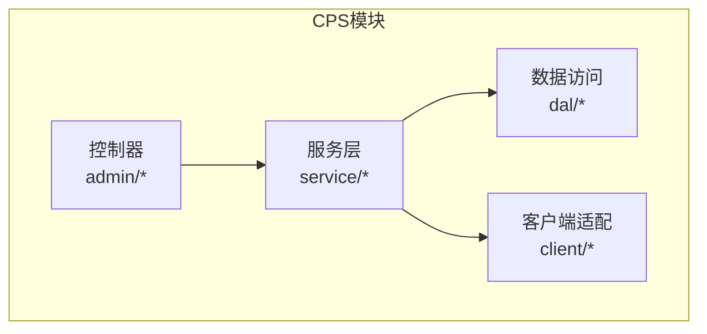
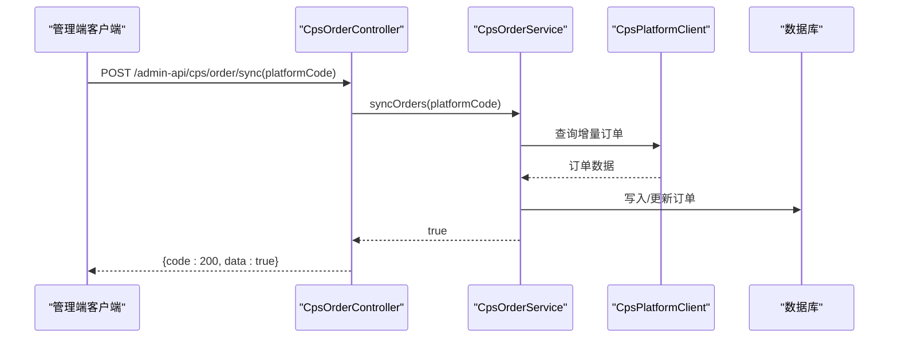
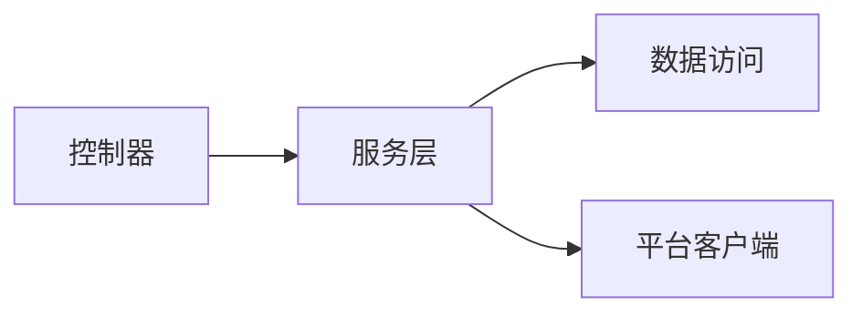

# API接口文档

<cite>
**本文引用的文件**
- [CPS系统PRD文档.md](file://docs/CPS系统PRD文档.md)
- [CpsPlatformController.java](file://qiji-module-cps/qiji-module-cps-biz/src/main/java/cn/zhijian/cps/controller/admin/CpsPlatformController.java)
- [CpsOrderController.java](file://qiji-module-cps/qiji-module-cps-biz/src/main/java/cn/zhijian/cps/controller/admin/CpsOrderController.java)
- [CpsWithdrawController.java](file://qiji-module-cps/qiji-module-cps-biz/src/main/java/cn/zhijian/cps/controller/admin/CpsWithdrawController.java)
- [CpsAdzoneController.java](file://qiji-module-cps/qiji-module-cps-biz/src/main/java/cn/zhijian/cps/controller/admin/CpsAdzoneController.java)
- [CpsRebateConfigController.java](file://qiji-module-cps/qiji-module-cps-biz/src/main/java/cn/zhijian/cps/controller/admin/CpsRebateConfigController.java)
</cite>

## 目录
1. [简介](#简介)
2. [项目结构](#项目结构)
3. [核心组件](#核心组件)
4. [架构总览](#架构总览)
5. [详细组件分析](#详细组件分析)
6. [依赖分析](#依赖分析)
7. [性能考虑](#性能考虑)
8. [故障排查指南](#故障排查指南)
9. [结论](#结论)
10. [附录](#附录)

## 简介
本文件为 AgenticCPS 系统的完整 API 接口文档，覆盖会员端与管理端两大类接口，并重点说明 CPS 模块的核心能力：商品搜索、多平台比价、推广链接生成、订单管理、返利查询、提现申请等；同时收录 MCP AI 接口规范（基于 MCP 协议的 Tools 与 Resources），并提供认证授权、权限控制、限流策略、版本管理与迁移指引、测试与调试方法等工程实践建议。

## 项目结构
- 系统采用模块化分层架构，CPS 模块位于 qiji-module-cps，包含业务实现、数据访问、枚举、配置与控制器等。
- 管理端接口集中在 qiji-module-cps/qiji-module-cps-biz/src/main/java/cn/zhijian/cps/controller/admin 下，使用统一前缀 /admin-api/cps/*。
- 会员端接口位于 qiji-module-cps/qiji-module-cps-biz/src/main/java/cn/zhijian/cps/controller/app 下（目录存在，具体文件未在本次检索中展开）。

**章节来源**
- [CPS系统PRD文档.md: 51-77:51-77](file://docs/CPS系统PRD文档.md#L51-L77)

## 核心组件
- 管理端控制器（Admin Controllers）
  - 平台配置管理：创建/更新/删除/查询/分页/连通性测试
  - 推广位管理：创建/更新/删除/查询/分页
  - 订单管理：查询/分页/手动同步
  - 提现审核：查询/分页/审核
  - 返利配置：创建/更新/删除/查询/分页
- 会员端控制器（App Controllers）
  - 商品搜索、多平台比价、推广链接生成、订单查询、返利明细、提现申请等（目录存在，具体接口定义未在本次检索中展开）

**章节来源**
- [CpsPlatformController.java: 22-81:22-81](file://qiji-module-cps/qiji-module-cps-biz/src/main/java/cn/zhijian/cps/controller/admin/CpsPlatformController.java#L22-L81)
- [CpsAdzoneController.java: 22-73:22-73](file://qiji-module-cps/qiji-module-cps-biz/src/main/java/cn/zhijian/cps/controller/admin/CpsAdzoneController.java#L22-L73)
- [CpsOrderController.java: 21-57:21-57](file://qiji-module-cps/qiji-module-cps-biz/src/main/java/cn/zhijian/cps/controller/admin/CpsOrderController.java#L21-L57)
- [CpsWithdrawController.java: 22-57:22-57](file://qiji-module-cps/qiji-module-cps-biz/src/main/java/cn/zhijian/cps/controller/admin/CpsWithdrawController.java#L22-L57)
- [CpsRebateConfigController.java: 22-73:22-73](file://qiji-module-cps/qiji-module-cps-biz/src/main/java/cn/zhijian/cps/controller/admin/CpsRebateConfigController.java#L22-L73)

## 架构总览
- 控制器层负责接收请求、鉴权与参数校验，调用服务层完成业务逻辑。
- 服务层协调数据访问与第三方平台客户端，实现订单同步、返利计算、推广链接生成等。
- 客户端适配层封装各平台（淘宝、京东、拼多多、抖音）API 的差异，统一抽象为平台客户端。

**图表来源**
- [CpsOrderController.java: 47-54:47-54](file://qiji-module-cps/qiji-module-cps-biz/src/main/java/cn/zhijian/cps/controller/admin/CpsOrderController.java#L47-L54)

## 详细组件分析

### 管理端接口规范（共15个）

- 平台配置管理（CpsPlatformController）
  - POST /admin-api/cps/platform/create
    - 权限：cps:platform:create
    - 请求体：平台保存参数对象
    - 响应：创建成功返回新增ID
  - PUT /admin-api/cps/platform/update
    - 权限：cps:platform:update
    - 请求体：平台保存参数对象
    - 响应：true
  - DELETE /admin-api/cps/platform/delete?id={id}
    - 权限：cps:platform:delete
    - 响应：true
  - GET /admin-api/cps/platform/get?id={id}
    - 权限：cps:platform:query
    - 响应：平台详情对象
  - GET /admin-api/cps/platform/page
    - 权限：cps:platform:query
    - 响应：平台分页结果
  - POST /admin-api/cps/platform/test-connection?id={id}
    - 权限：cps:platform:update
    - 响应：连通性测试结果（true/false）

- 推广位管理（CpsAdzoneController）
  - POST /admin-api/cps/adzone/create
    - 权限：cps:adzone:create
    - 响应：新增ID
  - PUT /admin-api/cps/adzone/update
    - 权限：cps:adzone:update
    - 响应：true
  - DELETE /admin-api/cps/adzone/delete?id={id}
    - 权限：cps:adzone:delete
    - 响应：true
  - GET /admin-api/cps/adzone/get?id={id}
    - 权限：cps:adzone:query
    - 响应：推广位详情
  - GET /admin-api/cps/adzone/page
    - 权限：cps:adzone:query
    - 响应：推广位分页结果

- 订单管理（CpsOrderController）
  - GET /admin-api/cps/order/get?id={id}
    - 权限：cps:order:query
    - 响应：订单详情
  - GET /admin-api/cps/order/page
    - 权限：cps:order:query
    - 响应：订单分页结果
  - POST /admin-api/cps/order/sync?platformCode={code}
    - 权限：cps:order:sync
    - 响应：true

- 提现审核（CpsWithdrawController）
  - GET /admin-api/cps/withdraw/get?id={id}
    - 权限：cps:withdraw:query
    - 响应：提现详情
  - GET /admin-api/cps/withdraw/page
    - 权限：cps:withdraw:query
    - 响应：提现分页结果
  - POST /admin-api/cps/withdraw/review
    - 权限：cps:withdraw:review
    - 请求体：审核参数对象
    - 响应：true

- 返利配置（CpsRebateConfigController）
  - POST /admin-api/cps/rebate-config/create
    - 权限：cps:rebate-config:create
    - 响应：新增ID
  - PUT /admin-api/cps/rebate-config/update
    - 权限：cps:rebate-config:update
    - 响应：true
  - DELETE /admin-api/cps/rebate-config/delete?id={id}
    - 权限：cps:rebate-config:delete
    - 响应：true
  - GET /admin-api/cps/rebate-config/get?id={id}
    - 权限：cps:rebate-config:query
    - 响应：返利配置详情
  - GET /admin-api/cps/rebate-config/page
    - 权限：cps:rebate-config:query
    - 响应：返利配置分页结果

- 会员端接口（约13个）
  - 商品搜索：关键词/链接/口令解析，支持并发多平台查询与聚合
  - 多平台比价：跨平台比价与排序
  - 推广链接生成：生成带归因参数的推广链接/口令/短链
  - 我的订单：订单列表与详情
  - 返利汇总/明细：余额、待结算、累计收入与明细
  - 提现申请/记录：申请提现与历史记录
  - 搜索历史/热门搜索/推荐/等级权益/返利到账通知等
  - 说明：以上为功能清单与流程描述，具体接口定义位于 app 控制器目录（目录存在，文件未在本次检索中展开）

- MCP AI 接口规范（基于 MCP 协议的 Tools 与 Resources）
  - Tools
    - cps_search：自然语言搜索商品，支持筛选条件
    - cps_compare：跨平台比价，返回最优购买方案
    - cps_generate_link：生成推广链接（会员级）
    - cps_get_order_status：查询订单状态（会员级）
  - Resources
    - cps_order_status：订单状态资源（用于 AI Agent 查询）
  - 权限与限流
    - API Key 管理：权限级别（public/member/admin）、限流配置、状态与备注
    - 访问日志：请求时间、API Key、Tool/Resource、输入参数（脱敏）、响应状态、耗时、用户ID、IP
  - 说明：以上为 PRD 中的功能与权限矩阵，具体工具与资源的参数与返回格式以 MCP 协议为准

**章节来源**
- [CpsPlatformController.java: 31-78:31-78](file://qiji-module-cps/qiji-module-cps-biz/src/main/java/cn/zhijian/cps/controller/admin/CpsPlatformController.java#L31-L78)
- [CpsAdzoneController.java: 31-70:31-70](file://qiji-module-cps/qiji-module-cps-biz/src/main/java/cn/zhijian/cps/controller/admin/CpsAdzoneController.java#L31-L70)
- [CpsOrderController.java: 30-54:30-54](file://qiji-module-cps/qiji-module-cps-biz/src/main/java/cn/zhijian/cps/controller/admin/CpsOrderController.java#L30-L54)
- [CpsWithdrawController.java: 31-54:31-54](file://qiji-module-cps/qiji-module-cps-biz/src/main/java/cn/zhijian/cps/controller/admin/CpsWithdrawController.java#L31-L54)
- [CpsRebateConfigController.java: 31-70:31-70](file://qiji-module-cps/qiji-module-cps-biz/src/main/java/cn/zhijian/cps/controller/admin/CpsRebateConfigController.java#L31-L70)
- [CPS系统PRD文档.md: 267-353:267-353](file://docs/CPS系统PRD文档.md#L267-L353)

### 接口调用示例（示意）
- curl 示例（以订单同步为例）
  - curl -X POST "http://HOST/admin-api/cps/order/sync?platformCode=taobao" -H "Authorization: Bearer YOUR_TOKEN"
- 代码示例（示意）
  - Java/HTTP 客户端发送 POST 请求至 /admin-api/cps/order/sync，携带平台编码参数
  - Python/Node.js 客户端发送 GET 请求至 /admin-api/cps/order/page，携带分页参数

**章节来源**
- [CpsOrderController.java: 47-54:47-54](file://qiji-module-cps/qiji-module-cps-biz/src/main/java/cn/zhijian/cps/controller/admin/CpsOrderController.java#L47-L54)

### 认证机制、权限控制与限流
- 认证机制
  - 基于 Spring Security 的权限注解与统一鉴权（@PreAuthorize）控制接口访问
- 权限控制
  - 管理端接口均标注所需权限字符串，如 cps:platform:create、cps:order:query 等
- 限流策略
  - MCP 管理中提供 API Key 级别的限流配置（每分钟/小时/天最大请求数）
  - 建议在网关或应用层对高频接口实施限流与熔断

**章节来源**
- [CpsPlatformController.java: 33-34:33-34](file://qiji-module-cps/qiji-module-cps-biz/src/main/java/cn/zhijian/cps/controller/admin/CpsPlatformController.java#L33-L34)
- [CPS系统PRD文档.md: 694-716:694-716](file://docs/CPS系统PRD文档.md#L694-L716)

### 接口版本管理、兼容性与迁移
- 版本管理
  - 接口前缀采用 /admin-api/cps/*，建议后续通过子路径或 Header 协议版本号进行演进
- 向后兼容
  - 新增字段采用可选策略，避免破坏现有客户端
- 废弃接口迁移
  - 对于不再维护的接口，保留过渡期并在响应头或文档中标注迁移指引与替代方案

**章节来源**
- [CPS系统PRD文档.md: 694-716:694-716](file://docs/CPS系统PRD文档.md#L694-L716)

### 接口测试与调试
- 接口测试
  - 使用 HTTP 客户端（如 curl、Postman）对各接口进行功能与边界测试
  - 对管理端接口，准备具备相应权限的 Token 或凭证
- 调试方法
  - 查看访问日志（MCP 访问日志）定位调用异常
  - 在服务层增加必要的日志埋点，记录关键参数与返回值
  - 对订单同步、返利结算等异步流程，结合数据库状态与日志进行交叉验证

**章节来源**
- [CPS系统PRD文档.md: 735-757:735-757](file://docs/CPS系统PRD文档.md#L735-L757)

## 依赖分析
- 控制器与服务层松耦合，通过接口契约传递 VO/DTO
- 服务层依赖平台客户端工厂与数据访问层，实现多平台适配与持久化
- 权限注解集中于控制器层，便于统一治理

**图表来源**
- [CpsOrderController.java: 21-57:21-57](file://qiji-module-cps/qiji-module-cps-biz/src/main/java/cn/zhijian/cps/controller/admin/CpsOrderController.java#L21-L57)

**章节来源**
- [CpsPlatformController.java: 22-81:22-81](file://qiji-module-cps/qiji-module-cps-biz/src/main/java/cn/zhijian/cps/controller/admin/CpsPlatformController.java#L22-L81)
- [CpsAdzoneController.java: 22-73:22-73](file://qiji-module-cps/qiji-module-cps-biz/src/main/java/cn/zhijian/cps/controller/admin/CpsAdzoneController.java#L22-L73)
- [CpsOrderController.java: 21-57:21-57](file://qiji-module-cps/qiji-module-cps-biz/src/main/java/cn/zhijian/cps/controller/admin/CpsOrderController.java#L21-L57)
- [CpsWithdrawController.java: 22-57:22-57](file://qiji-module-cps/qiji-module-cps-biz/src/main/java/cn/zhijian/cps/controller/admin/CpsWithdrawController.java#L22-L57)
- [CpsRebateConfigController.java: 22-73:22-73](file://qiji-module-cps/qiji-module-cps-biz/src/main/java/cn/zhijian/cps/controller/admin/CpsRebateConfigController.java#L22-L73)

## 性能考虑
- 并发查询多平台商品与订单时，建议引入超时控制与熔断保护
- 对高频接口（如商品搜索、比价）实施缓存策略，降低第三方平台压力
- 订单同步采用增量查询与分批处理，避免一次性拉取过多数据

[本节为通用建议，不直接分析具体文件]

## 故障排查指南
- 平台连通性
  - 使用“测试连通性”接口验证平台配置与凭据
- 订单同步异常
  - 检查平台返回状态、时间窗口与幂等处理
  - 核对订单状态变更与返利结算流程
- 提现审核
  - 校验余额、限额与风控规则，必要时人工复核
- MCP 调用异常
  - 查看访问日志中的响应状态与耗时，定位工具调用问题

**章节来源**
- [CpsPlatformController.java: 72-78:72-78](file://qiji-module-cps/qiji-module-cps-biz/src/main/java/cn/zhijian/cps/controller/admin/CpsPlatformController.java#L72-L78)
- [CpsOrderController.java: 47-54:47-54](file://qiji-module-cps/qiji-module-cps-biz/src/main/java/cn/zhijian/cps/controller/admin/CpsOrderController.java#L47-L54)
- [CpsWithdrawController.java: 48-54:48-54](file://qiji-module-cps/qiji-module-cps-biz/src/main/java/cn/zhijian/cps/controller/admin/CpsWithdrawController.java#L48-L54)
- [CPS系统PRD文档.md: 735-757:735-757](file://docs/CPS系统PRD文档.md#L735-L757)

## 结论
本文档梳理了 AgenticCPS 系统的管理端与会员端接口，明确了 CPS 核心能力与 MCP AI 接口规范，并提供了认证、权限、限流、版本管理与测试调试的工程实践建议。建议在生产环境中结合访问日志与监控体系持续优化接口性能与稳定性。

## 附录
- 接口响应统一结构
  - 成功：{ code: 200, msg: "success", data: ... }
  - 失败：{ code: 错误码, msg: "错误信息", data: null }
- 错误码说明（示例）
  - 400：参数校验失败
  - 401：未授权/Token无效
  - 403：权限不足
  - 500：服务器内部错误
- 常用参数
  - 分页：page（页码）、size（每页数量）
  - 排序：sort（字段名或表达式）

**章节来源**
- [CPS系统PRD文档.md: 51-77:51-77](file://docs/CPS系统PRD文档.md#L51-L77)