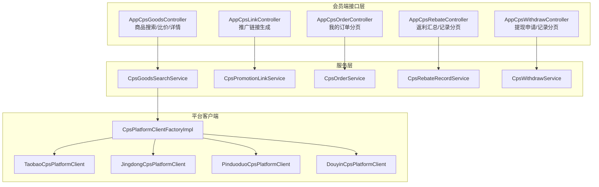
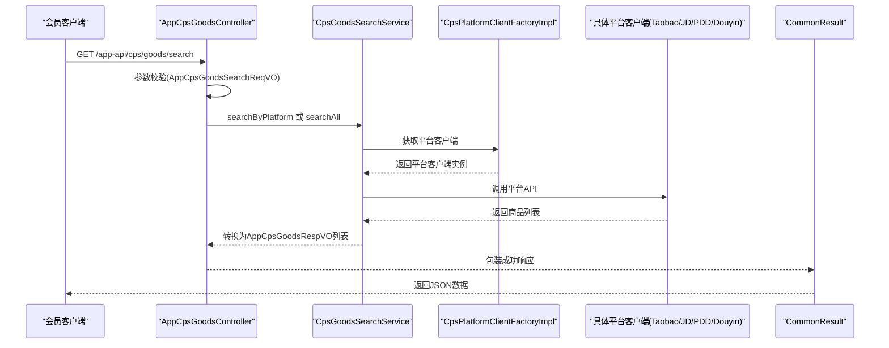
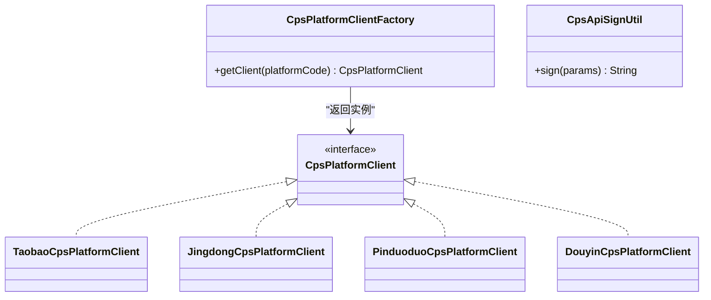
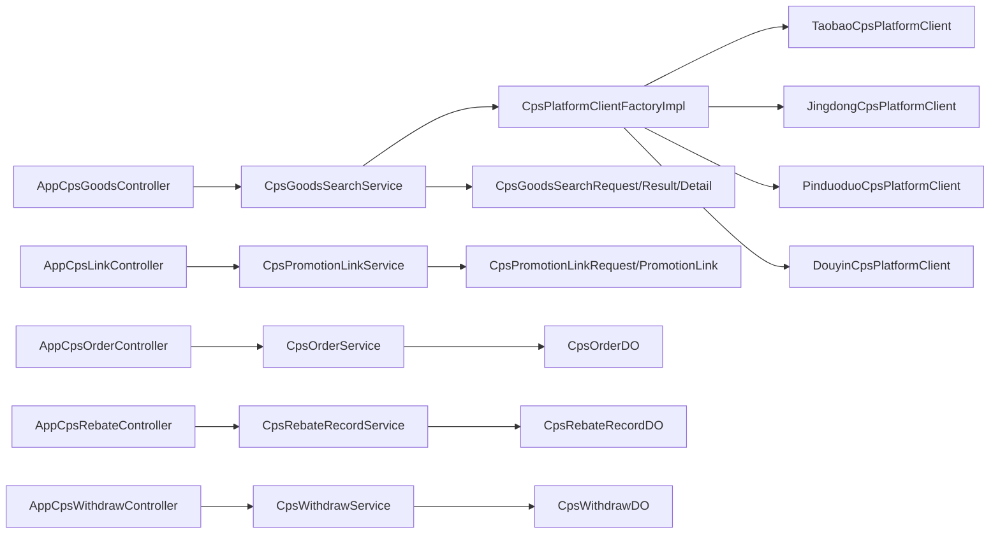

# CPS核心业务接口

<cite>
**本文引用的文件**
- [AppCpsGoodsController.java](file://qiji-module-cps/qiji-module-cps-biz/src/main/java/cn/zhijian/cps/controller/app/AppCpsGoodsController.java)
- [AppCpsLinkController.java](file://qiji-module-cps/qiji-module-cps-biz/src/main/java/cn/zhijian/cps/controller/app/AppCpsLinkController.java)
- [AppCpsOrderController.java](file://qiji-module-cps/qiji-module-cps-biz/src/main/java/cn/zhijian/cps/controller/app/AppCpsOrderController.java)
- [AppCpsRebateController.java](file://qiji-module-cps/qiji-module-cps-biz/src/main/java/cn/zhijian/cps/controller/app/AppCpsRebateController.java)
- [AppCpsWithdrawController.java](file://qiji-module-cps/qiji-module-cps-biz/src/main/java/cn/zhijian/cps/controller/app/AppCpsWithdrawController.java)
- [CpsGoodsSearchRequest.java](file://qiji-module-cps/qiji-module-cps-biz/src/main/java/cn/zhijian/cps/client/dto/CpsGoodsSearchRequest.java)
- [CpsGoodsSearchResult.java](file://qiji-module-cps/qiji-module-cps-biz/src/main/java/cn/zhijian/cps/client/dto/CpsGoodsSearchResult.java)
- [CpsGoodsDetail.java](file://qiji-module-cps/qiji-module-cps-biz/src/main/java/cn/zhijian/cps/client/dto/CpsGoodsDetail.java)
- [CpsGoodsDetailRequest.java](file://qiji-module-cps/qiji-module-cps-biz/src/main/java/cn/zhijian/cps/client/dto/CpsGoodsDetailRequest.java)
- [CpsPromotionLink.java](file://qiji-module-cps/qiji-module-cps-biz/src/main/java/cn/zhijian/cps/client/dto/CpsPromotionLink.java)
- [CpsPromotionLinkRequest.java](file://qiji-module-cps/qiji-module-cps-biz/src/main/java/cn/zhijian/cps/client/dto/CpsPromotionLinkRequest.java)
- [CpsParsedContent.java](file://qiji-module-cps/qiji-module-cps-biz/src/main/java/cn/zhijian/cps/client/dto/CpsParsedContent.java)
- [CpsApiSignUtil.java](file://qiji-module-cps/qiji-module-cps-biz/src/main/java/cn/zhijian/cps/client/util/CpsApiSignUtil.java)
- [CpsPlatformClient.java](file://qiji-module-cps/qiji-module-cps-biz/src/main/java/cn/zhijian/cps/client/CpsPlatformClient.java)
- [TaobaoCpsPlatformClient.java](file://qiji-module-cps/qiji-module-cps-biz/src/main/java/cn/zhijian/cps/client/TaobaoCpsPlatformClient.java)
- [JingdongCpsPlatformClient.java](file://qiji-module-cps/qiji-module-cps-biz/src/main/java/cn/zhijian/cps/client/JingdongCpsPlatformClient.java)
- [PinduoduoCpsPlatformClient.java](file://qiji-module-cps/qiji-module-cps-biz/src/main/java/cn/zhijian/cps/client/PinduoduoCpsPlatformClient.java)
- [DouyinCpsPlatformClient.java](file://qiji-module-cps/qiji-module-cps-biz/src/main/java/cn/zhijian/cps/client/DouyinCpsPlatformClient.java)
- [CpsPlatformClientFactory.java](file://qiji-module-cps/qiji-module-cps-biz/src/main/java/cn/zhijian/cps/service/platform/CpsPlatformClientFactory.java)
- [CpsPlatformClientFactoryImpl.java](file://qiji-module-cps/qiji-module-cps-biz/src/main/java/cn/zhijian/cps/service/platform/CpsPlatformClientFactoryImpl.java)
- [CpsGoodsSearchService.java](file://qiji-module-cps/qiji-module-cps-biz/src/main/java/cn/zhijian/cps/service/goods/CpsGoodsSearchService.java)
- [CpsPromotionLinkService.java](file://qiji-module-cps/qiji-module-cps-biz/src/main/java/cn/zhijian/cps/service/link/CpsPromotionLinkService.java)
- [CpsOrderService.java](file://qiji-module-cps/qiji-module-cps-biz/src/main/java/cn/zhijian/cps/service/CpsOrderService.java)
- [CpsRebateRecordService.java](file://qiji-module-cps/qiji-module-cps-biz/src/main/java/cn/zhijian/cps/service/CpsRebateRecordService.java)
- [CpsWithdrawService.java](file://qiji-module-cps/qiji-module-cps-biz/src/main/java/cn/zhijian/cps/service/CpsWithdrawService.java)
- [CpsOrderDO.java](file://qiji-module-cps/qiji-module-cps-biz/src/main/java/cn/zhijian/cps/dal/dataobject/CpsOrderDO.java)
- [CpsRebateRecordDO.java](file://qiji-module-cps/qiji-module-cps-biz/src/main/java/cn/zhijian/cps/dal/dataobject/CpsRebateRecordDO.java)
- [CpsWithdrawDO.java](file://qiji-module-cps/qiji-module-cps-biz/src/main/java/cn/zhijian/cps/dal/dataobject/CpsWithdrawDO.java)
- [ErrorCodeConstants.java](file://qiji-module-cps/qiji-module-cps-biz/src/main/java/cn/zhijian/cps/enums/ErrorCodeConstants.java)
- [CpsPlatformCodeEnum.java](file://qiji-module-cps/qiji-module-cps-biz/src/main/java/cn/zhijian/cps/enums/CpsPlatformCodeEnum.java)
- [CpsOrderStatusEnum.java](file://qiji-module-cps/qiji-module-cps-biz/src/main/java/cn/zhijian/cps/enums/CpsOrderStatusEnum.java)
- [CpsRebateStatusEnum.java](file://qiji-module-cps/qiji-module-cps-biz/src/main/java/cn/zhijian/cps/enums/CpsRebateStatusEnum.java)
- [CpsWithdrawStatusEnum.java](file://qiji-module-cps/qiji-module-cps-biz/src/main/java/cn/zhijian/cps/enums/CpsWithdrawStatusEnum.java)
- [CpsWithdrawTypeEnum.java](file://qiji-module-cps/qiji-module-cps-biz/src/main/java/cn/zhijian/cps/enums/CpsWithdrawTypeEnum.java)
- [CpsRebateTypeEnum.java](file://qiji-module-cps/qiji-module-cps-biz/src/main/java/cn/zhijian/cps/enums/CpsRebateTypeEnum.java)
- [CommonResult.java](file://qiji-framework/qiji-common/src/main/java/com.qiji.cps/framework/common/pojo/CommonResult.java)
- [SecurityFrameworkUtils.java](file://qiji-framework/qiji-spring-boot-starter-security/src/main/java/com.qiji.cps/framework/security/core/util/SecurityFrameworkUtils.java)
</cite>

## 目录
1. [简介](#简介)
2. [项目结构](#项目结构)
3. [核心组件](#核心组件)
4. [架构总览](#架构总览)
5. [详细组件分析](#详细组件分析)
6. [依赖关系分析](#依赖关系分析)
7. [性能考虑](#性能考虑)
8. [故障排查指南](#故障排查指南)
9. [结论](#结论)
10. [附录](#附录)

## 简介
本文件为CPS核心业务接口的详细API文档，覆盖会员端13个核心接口，包括：
- 商品搜索：/app-api/cps/goods/search
- 多平台比价：/app-api/cps/goods/compare
- 商品详情：/app-api/cps/goods/detail
- 推广链接生成：/app-api/cps/link/generate
- 我的订单分页：/app-api/cps/order/page
- 返利汇总：/app-api/cps/rebate/summary
- 返利记录分页：/app-api/cps/rebate/record/page
- 提现申请：/app-api/cps/withdraw/create
- 提现记录分页：/app-api/cps/withdraw/page

文档内容涵盖HTTP方法、请求参数、响应格式、错误码、认证机制、权限控制、参数验证规则、最佳实践与常见问题。

## 项目结构
CPS模块位于 qiji-module-cps/qiji-module-cps-biz，采用按功能域划分的包结构：
- controller/app：对外暴露的会员端REST接口
- service：业务服务层
- client：平台客户端封装（对接各联盟平台）
- enums：枚举类型定义
- dal/dataobject：数据对象
- client/dto：平台交互的数据传输对象
- config：配置类

图表来源
- [AppCpsGoodsController.java:24-117](file://qiji-module-cps/qiji-module-cps-biz/src/main/java/cn/zhijian/cps/controller/app/AppCpsGoodsController.java#L24-L117)
- [AppCpsLinkController.java:20-42](file://qiji-module-cps/qiji-module-cps-biz/src/main/java/cn/zhijian/cps/controller/app/AppCpsLinkController.java#L20-L42)
- [AppCpsOrderController.java:22-41](file://qiji-module-cps/qiji-module-cps-biz/src/main/java/cn/zhijian/cps/controller/app/AppCpsOrderController.java#L22-L41)
- [AppCpsRebateController.java:26-75](file://qiji-module-cps/qiji-module-cps-biz/src/main/java/cn/zhijian/cps/controller/app/AppCpsRebateController.java#L26-L75)
- [AppCpsWithdrawController.java:21-47](file://qiji-module-cps/qiji-module-cps-biz/src/main/java/cn/zhijian/cps/controller/app/AppCpsWithdrawController.java#L21-L47)
- [CpsPlatformClientFactoryImpl.java](file://qiji-module-cps/qiji-module-cps-biz/src/main/java/cn/zhijian/cps/service/platform/CpsPlatformClientFactoryImpl.java)
- [TaobaoCpsPlatformClient.java](file://qiji-module-cps/qiji-module-cps-biz/src/main/java/cn/zhijian/cps/client/TaobaoCpsPlatformClient.java)
- [JingdongCpsPlatformClient.java](file://qiji-module-cps/qiji-module-cps-biz/src/main/java/cn/zhijian/cps/client/JingdongCpsPlatformClient.java)
- [PinduoduoCpsPlatformClient.java](file://qiji-module-cps/qiji-module-cps-biz/src/main/java/cn/zhijian/cps/client/PinduoduoCpsPlatformClient.java)
- [DouyinCpsPlatformClient.java](file://qiji-module-cps/qiji-module-cps-biz/src/main/java/cn/zhijian/cps/client/DouyinCpsPlatformClient.java)

章节来源
- [AppCpsGoodsController.java:1-117](file://qiji-module-cps/qiji-module-cps-biz/src/main/java/cn/zhijian/cps/controller/app/AppCpsGoodsController.java#L1-L117)
- [AppCpsLinkController.java:1-42](file://qiji-module-cps/qiji-module-cps-biz/src/main/java/cn/zhijian/cps/controller/app/AppCpsLinkController.java#L1-L42)
- [AppCpsOrderController.java:1-41](file://qiji-module-cps/qiji-module-cps-biz/src/main/java/cn/zhijian/cps/controller/app/AppCpsOrderController.java#L1-L41)
- [AppCpsRebateController.java:1-75](file://qiji-module-cps/qiji-module-cps-biz/src/main/java/cn/zhijian/cps/controller/app/AppCpsRebateController.java#L1-L75)
- [AppCpsWithdrawController.java:1-47](file://qiji-module-cps/qiji-module-cps-biz/src/main/java/cn/zhijian/cps/controller/app/AppCpsWithdrawController.java#L1-L47)

## 核心组件
- 控制器层：负责接收HTTP请求、参数校验、调用服务层、返回统一响应格式。
- 服务层：封装业务逻辑，协调平台客户端与数据库操作。
- 平台客户端：对接各联盟平台（淘宝、京东、拼多多、抖音），负责解析内容、生成推广链接、拉取商品信息。
- DTO与数据对象：定义请求/响应结构与持久化实体。
- 枚举：定义平台编码、订单状态、返利状态、提现状态与类型等。

章节来源
- [CpsGoodsSearchService.java](file://qiji-module-cps/qiji-module-cps-biz/src/main/java/cn/zhijian/cps/service/goods/CpsGoodsSearchService.java)
- [CpsPromotionLinkService.java](file://qiji-module-cps/qiji-module-cps-biz/src/main/java/cn/zhijian/cps/service/link/CpsPromotionLinkService.java)
- [CpsPlatformClientFactoryImpl.java](file://qiji-module-cps/qiji-module-cps-biz/src/main/java/cn/zhijian/cps/service/platform/CpsPlatformClientFactoryImpl.java)
- [CpsGoodsDetail.java](file://qiji-module-cps/qiji-module-cps-biz/src/main/java/cn/zhijian/cps/client/dto/CpsGoodsDetail.java)
- [CpsPromotionLink.java](file://qiji-module-cps/qiji-module-cps-biz/src/main/java/cn/zhijian/cps/client/dto/CpsPromotionLink.java)
- [CpsOrderDO.java](file://qiji-module-cps/qiji-module-cps-biz/src/main/java/cn/zhijian/cps/dal/dataobject/CpsOrderDO.java)
- [CpsRebateRecordDO.java](file://qiji-module-cps/qiji-module-cps-biz/src/main/java/cn/zhijian/cps/dal/dataobject/CpsRebateRecordDO.java)
- [CpsWithdrawDO.java](file://qiji-module-cps/qiji-module-cps-biz/src/main/java/cn/zhijian/cps/dal/dataobject/CpsWithdrawDO.java)

## 架构总览
CPS接口遵循“控制器-服务-平台客户端”三层架构，统一通过CommonResult返回结果，使用SecurityFrameworkUtils获取当前登录会员ID实现权限隔离。

图表来源
- [AppCpsGoodsController.java:34-63](file://qiji-module-cps/qiji-module-cps-biz/src/main/java/cn/zhijian/cps/controller/app/AppCpsGoodsController.java#L34-L63)
- [CpsGoodsSearchService.java](file://qiji-module-cps/qiji-module-cps-biz/src/main/java/cn/zhijian/cps/service/goods/CpsGoodsSearchService.java)
- [CpsPlatformClientFactoryImpl.java](file://qiji-module-cps/qiji-module-cps-biz/src/main/java/cn/zhijian/cps/service/platform/CpsPlatformClientFactoryImpl.java)
- [TaobaoCpsPlatformClient.java](file://qiji-module-cps/qiji-module-cps-biz/src/main/java/cn/zhijian/cps/client/TaobaoCpsPlatformClient.java)
- [CommonResult.java](file://qiji-framework/qiji-common/src/main/java/com.qiji.cps/framework/common/pojo/CommonResult.java)

## 详细组件分析

### 商品搜索 /app-api/cps/goods/search
- 方法：GET
- 功能：支持单平台搜索与全平台并行搜索；支持关键词、分页、排序。
- 认证：需登录会员Token（通过SecurityFrameworkUtils获取）
- 请求参数
  - keyword：关键词（必填）
  - platformCode：平台编码（可选，为空则全平台搜索）
  - pageNo：页码（默认1）
  - pageSize：每页条数（默认20）
  - sortBy：排序字段（如销量、价格等，由平台支持决定）
- 响应：商品列表，包含平台编码、标题、图片、价格、券后价、预估返利、月销量、店铺名等
- 错误码：参考ErrorCodeConstants
- 示例
  - 请求：GET /app-api/cps/goods/search?keyword=手机&platformCode=taobao&pageNo=1&pageSize=20&sortBy=sales
  - 响应：包含多个AppCpsGoodsRespVO对象的数组

章节来源
- [AppCpsGoodsController.java:34-63](file://qiji-module-cps/qiji-module-cps-biz/src/main/java/cn/zhijian/cps/controller/app/AppCpsGoodsController.java#L34-L63)
- [CpsGoodsSearchRequest.java](file://qiji-module-cps/qiji-module-cps-biz/src/main/java/cn/zhijian/cps/client/dto/CpsGoodsSearchRequest.java)
- [CpsGoodsSearchResult.java](file://qiji-module-cps/qiji-module-cps-biz/src/main/java/cn/zhijian/cps/client/dto/CpsGoodsSearchResult.java)
- [CpsGoodsDetail.java](file://qiji-module-cps/qiji-module-cps-biz/src/main/java/cn/zhijian/cps/client/dto/CpsGoodsDetail.java)

### 多平台比价 /app-api/cps/goods/compare
- 方法：POST
- 功能：根据关键词在多平台进行比价，返回综合结果
- 认证：需登录会员Token
- 请求参数
  - keyword：关键词（表单参数）
- 响应：商品列表，包含各平台的价格对比信息
- 示例
  - 请求：POST /app-api/cps/goods/compare?keyword=手机
  - 响应：包含多个AppCpsGoodsRespVO对象的数组

章节来源
- [AppCpsGoodsController.java:65-73](file://qiji-module-cps/qiji-module-cps-biz/src/main/java/cn/zhijian/cps/controller/app/AppCpsGoodsController.java#L65-L73)

### 商品详情 /app-api/cps/goods/detail
- 方法：GET
- 功能：根据平台编码与商品ID获取商品详情
- 认证：需登录会员Token
- 请求参数
  - platformCode：平台编码（必填）
  - itemId：商品ID（必填）
- 响应：单个商品详情对象
- 示例
  - 请求：GET /app-api/cps/goods/detail?platformCode=taobao&itemId=123456
  - 响应：AppCpsGoodsRespVO对象

章节来源
- [AppCpsGoodsController.java:75-85](file://qiji-module-cps/qiji-module-cps-biz/src/main/java/cn/zhijian/cps/controller/app/AppCpsGoodsController.java#L75-L85)
- [CpsGoodsDetailRequest.java](file://qiji-module-cps/qiji-module-cps-biz/src/main/java/cn/zhijian/cps/client/dto/CpsGoodsDetailRequest.java)

### 推广链接生成 /app-api/cps/link/generate
- 方法：POST
- 功能：根据内容与平台编码生成推广链接
- 认证：需登录会员Token
- 请求体
  - content：内容（URL或商品ID等，由平台识别）
  - platformCode：平台编码（必填）
- 响应：推广链接生成结果对象
- 示例
  - 请求：POST /app-api/cps/link/generate
  - 响应：AppCpsLinkRespVO对象

章节来源
- [AppCpsLinkController.java:30-39](file://qiji-module-cps/qiji-module-cps-biz/src/main/java/cn/zhijian/cps/controller/app/AppCpsLinkController.java#L30-L39)
- [CpsPromotionLinkRequest.java](file://qiji-module-cps/qiji-module-cps-biz/src/main/java/cn/zhijian/cps/client/dto/CpsPromotionLinkRequest.java)
- [CpsPromotionLink.java](file://qiji-module-cps/qiji-module-cps-biz/src/main/java/cn/zhijian/cps/client/dto/CpsPromotionLink.java)

### 我的订单分页 /app-api/cps/order/page
- 方法：GET
- 功能：获取当前登录会员的CPS订单分页数据
- 认证：需登录会员Token
- 请求参数：分页相关参数（由CpsOrderPageReqVO定义）
- 响应：PageResult<AppCpsOrderRespVO>
- 示例
  - 请求：GET /app-api/cps/order/page?pageNo=1&pageSize=20
  - 响应：分页结果对象

章节来源
- [AppCpsOrderController.java:31-38](file://qiji-module-cps/qiji-module-cps-biz/src/main/java/cn/zhijian/cps/controller/app/AppCpsOrderController.java#L31-L38)
- [CpsOrderService.java](file://qiji-module-cps/qiji-module-cps-biz/src/main/java/cn/zhijian/cps/service/CpsOrderService.java)
- [CpsOrderDO.java](file://qiji-module-cps/qiji-module-cps-biz/src/main/java/cn/zhijian/cps/dal/dataobject/CpsOrderDO.java)

### 返利汇总 /app-api/cps/rebate/summary
- 方法：GET
- 功能：统计当前登录会员的返利汇总信息（总计、待入账、已入账、已提现、可用余额）
- 认证：需登录会员Token
- 请求参数：无
- 响应：AppCpsRebateSummaryRespVO
- 示例
  - 请求：GET /app-api/cps/rebate/summary
  - 响应：汇总对象

章节来源
- [AppCpsRebateController.java:35-62](file://qiji-module-cps/qiji-module-cps-biz/src/main/java/cn/zhijian/cps/controller/app/AppCpsRebateController.java#L35-L62)
- [CpsRebateRecordService.java](file://qiji-module-cps/qiji-module-cps-biz/src/main/java/cn/zhijian/cps/service/CpsRebateRecordService.java)
- [CpsRebateRecordDO.java](file://qiji-module-cps/qiji-module-cps-biz/src/main/java/cn/zhijian/cps/dal/dataobject/CpsRebateRecordDO.java)

### 返利记录分页 /app-api/cps/rebate/record/page
- 方法：GET
- 功能：获取当前登录会员的返利记录分页
- 认证：需登录会员Token
- 请求参数：分页相关参数（由CpsRebateRecordPageReqVO定义）
- 响应：PageResult<AppCpsRebateRecordRespVO>
- 示例
  - 请求：GET /app-api/cps/rebate/record/page?pageNo=1&pageSize=20
  - 响应：分页结果对象

章节来源
- [AppCpsRebateController.java:65-72](file://qiji-module-cps/qiji-module-cps-biz/src/main/java/cn/zhijian/cps/controller/app/AppCpsRebateController.java#L65-L72)

### 提现申请 /app-api/cps/withdraw/create
- 方法：POST
- 功能：提交提现申请
- 认证：需登录会员Token
- 请求体：AppCpsWithdrawCreateReqVO（包含提现金额等）
- 响应：新建提现记录ID
- 示例
  - 请求：POST /app-api/cps/withdraw/create
  - 响应：Long类型的提现ID

章节来源
- [AppCpsWithdrawController.java:30-35](file://qiji-module-cps/qiji-module-cps-biz/src/main/java/cn/zhijian/cps/controller/app/AppCpsWithdrawController.java#L30-L35)
- [CpsWithdrawService.java](file://qiji-module-cps/qiji-module-cps-biz/src/main/java/cn/zhijian/cps/service/CpsWithdrawService.java)
- [CpsWithdrawDO.java](file://qiji-module-cps/qiji-module-cps-biz/src/main/java/cn/zhijian/cps/dal/dataobject/CpsWithdrawDO.java)

### 提现记录分页 /app-api/cps/withdraw/page
- 方法：GET
- 功能：获取当前登录会员的提现记录分页
- 认证：需登录会员Token
- 请求参数：分页相关参数（由CpsWithdrawPageReqVO定义）
- 响应：PageResult<AppCpsWithdrawRespVO>
- 示例
  - 请求：GET /app-api/cps/withdraw/page?pageNo=1&pageSize=20
  - 响应：分页结果对象

章节来源
- [AppCpsWithdrawController.java:37-44](file://qiji-module-cps/qiji-module-cps-biz/src/main/java/cn/zhijian/cps/controller/app/AppCpsWithdrawController.java#L37-L44)

### 平台客户端与签名工具
- 平台客户端工厂：根据平台编码选择对应客户端（淘宝、京东、拼多多、抖音）
- 签名工具：用于对接平台API时的签名处理
- 平台客户端：封装各平台的API调用细节

图表来源
- [CpsPlatformClientFactory.java](file://qiji-module-cps/qiji-module-cps-biz/src/main/java/cn/zhijian/cps/service/platform/CpsPlatformClientFactory.java)
- [CpsPlatformClientFactoryImpl.java](file://qiji-module-cps/qiji-module-cps-biz/src/main/java/cn/zhijian/cps/service/platform/CpsPlatformClientFactoryImpl.java)
- [CpsPlatformClient.java](file://qiji-module-cps/qiji-module-cps-biz/src/main/java/cn/zhijian/cps/client/CpsPlatformClient.java)
- [TaobaoCpsPlatformClient.java](file://qiji-module-cps/qiji-module-cps-biz/src/main/java/cn/zhijian/cps/client/TaobaoCpsPlatformClient.java)
- [JingdongCpsPlatformClient.java](file://qiji-module-cps/qiji-module-cps-biz/src/main/java/cn/zhijian/cps/client/JingdongCpsPlatformClient.java)
- [PinduoduoCpsPlatformClient.java](file://qiji-module-cps/qiji-module-cps-biz/src/main/java/cn/zhijian/cps/client/PinduoduoCpsPlatformClient.java)
- [DouyinCpsPlatformClient.java](file://qiji-module-cps/qiji-module-cps-biz/src/main/java/cn/zhijian/cps/client/DouyinCpsPlatformClient.java)
- [CpsApiSignUtil.java](file://qiji-module-cps/qiji-module-cps-biz/src/main/java/cn/zhijian/cps/client/util/CpsApiSignUtil.java)

## 依赖关系分析
- 控制器依赖服务层，服务层依赖平台客户端工厂与具体平台客户端
- DTO与数据对象用于跨层传递
- 枚举用于状态与类型约束
- 统一响应包装与安全框架集成

图表来源
- [AppCpsGoodsController.java:29-32](file://qiji-module-cps/qiji-module-cps-biz/src/main/java/cn/zhijian/cps/controller/app/AppCpsGoodsController.java#L29-L32)
- [AppCpsLinkController.java:27-28](file://qiji-module-cps/qiji-module-cps-biz/src/main/java/cn/zhijian/cps/controller/app/AppCpsLinkController.java#L27-L28)
- [AppCpsOrderController.java:28-29](file://qiji-module-cps/qiji-module-cps-biz/src/main/java/cn/zhijian/cps/controller/app/AppCpsOrderController.java#L28-L29)
- [AppCpsRebateController.java:32-33](file://qiji-module-cps/qiji-module-cps-biz/src/main/java/cn/zhijian/cps/controller/app/AppCpsRebateController.java#L32-L33)
- [AppCpsWithdrawController.java:27-28](file://qiji-module-cps/qiji-module-cps-biz/src/main/java/cn/zhijian/cps/controller/app/AppCpsWithdrawController.java#L27-L28)
- [CpsPlatformClientFactoryImpl.java](file://qiji-module-cps/qiji-module-cps-biz/src/main/java/cn/zhijian/cps/service/platform/CpsPlatformClientFactoryImpl.java)
- [CpsGoodsSearchRequest.java](file://qiji-module-cps/qiji-module-cps-biz/src/main/java/cn/zhijian/cps/client/dto/CpsGoodsSearchRequest.java)
- [CpsGoodsSearchResult.java](file://qiji-module-cps/qiji-module-cps-biz/src/main/java/cn/zhijian/cps/client/dto/CpsGoodsSearchResult.java)
- [CpsGoodsDetail.java](file://qiji-module-cps/qiji-module-cps-biz/src/main/java/cn/zhijian/cps/client/dto/CpsGoodsDetail.java)
- [CpsPromotionLinkRequest.java](file://qiji-module-cps/qiji-module-cps-biz/src/main/java/cn/zhijian/cps/client/dto/CpsPromotionLinkRequest.java)
- [CpsPromotionLink.java](file://qiji-module-cps/qiji-module-cps-biz/src/main/java/cn/zhijian/cps/client/dto/CpsPromotionLink.java)
- [CpsOrderDO.java](file://qiji-module-cps/qiji-module-cps-biz/src/main/java/cn/zhijian/cps/dal/dataobject/CpsOrderDO.java)
- [CpsRebateRecordDO.java](file://qiji-module-cps/qiji-module-cps-biz/src/main/java/cn/zhijian/cps/dal/dataobject/CpsRebateRecordDO.java)
- [CpsWithdrawDO.java](file://qiji-module-cps/qiji-module-cps-biz/src/main/java/cn/zhijian/cps/dal/dataobject/CpsWithdrawDO.java)

## 性能考虑
- 全平台搜索建议限制并发数量，避免对下游平台造成过大压力
- 分页参数建议设置合理上限，防止超大分页导致性能问题
- 对高频接口可引入缓存策略（如商品详情、热门关键词比价结果）
- 平台客户端调用应设置合理的超时与重试策略

## 故障排查指南
- 认证失败：确认请求头中携带正确的会员Token，并确保Token未过期
- 参数校验失败：检查请求参数是否符合DTO定义（必填、长度、格式等）
- 平台接口异常：检查平台编码是否正确，以及平台客户端签名与鉴权配置
- 权限不足：确认当前登录会员ID与业务数据归属一致（控制器已自动注入当前用户ID）

章节来源
- [SecurityFrameworkUtils.java](file://qiji-framework/qiji-spring-boot-starter-security/src/main/java/com.qiji.cps/framework/security/core/util/SecurityFrameworkUtils.java)
- [CommonResult.java](file://qiji-framework/qiji-common/src/main/java/com.qiji.cps/framework/common/pojo/CommonResult.java)
- [ErrorCodeConstants.java](file://qiji-module-cps/qiji-module-cps-biz/src/main/java/cn/zhijian/cps/enums/ErrorCodeConstants.java)

## 结论
本文档系统性梳理了CPS核心业务接口的规范与实现要点，明确了认证与权限控制、参数验证、响应格式与错误码映射，并提供了调用流程图与最佳实践建议，便于前后端协作与上线部署。

## 附录

### 统一响应结构
- 成功响应：CommonResult<T>，包含code、msg、data
- 失败响应：CommonResult<T>，包含code、msg、data为null

章节来源
- [CommonResult.java](file://qiji-framework/qiji-common/src/main/java/com.qiji.cps/framework/common/pojo/CommonResult.java)

### 认证与权限
- 认证机制：基于会员Token，通过SecurityFrameworkUtils获取当前登录用户ID
- 权限控制：所有会员端接口均仅允许当前登录会员访问其自身数据

章节来源
- [SecurityFrameworkUtils.java](file://qiji-framework/qiji-spring-boot-starter-security/src/main/java/com.qiji.cps/framework/security/core/util/SecurityFrameworkUtils.java)
- [AppCpsOrderController.java:34-35](file://qiji-module-cps/qiji-module-cps-biz/src/main/java/cn/zhijian/cps/controller/app/AppCpsOrderController.java#L34-L35)
- [AppCpsRebateController.java:68-69](file://qiji-module-cps/qiji-module-cps-biz/src/main/java/cn/zhijian/cps/controller/app/AppCpsRebateController.java#L68-L69)
- [AppCpsWithdrawController.java:39-41](file://qiji-module-cps/qiji-module-cps-biz/src/main/java/cn/zhijian/cps/controller/app/AppCpsWithdrawController.java#L39-L41)

### 平台编码与状态枚举
- 平台编码：taobao、jingdong、pinduoduo、douyin
- 订单状态：参考CpsOrderStatusEnum
- 返利状态：参考CpsRebateStatusEnum
- 提现状态：参考CpsWithdrawStatusEnum
- 提现类型：参考CpsWithdrawTypeEnum
- 返利类型：参考CpsRebateTypeEnum

章节来源
- [CpsPlatformCodeEnum.java](file://qiji-module-cps/qiji-module-cps-biz/src/main/java/cn/zhijian/cps/enums/CpsPlatformCodeEnum.java)
- [CpsOrderStatusEnum.java](file://qiji-module-cps/qiji-module-cps-biz/src/main/java/cn/zhijian/cps/enums/CpsOrderStatusEnum.java)
- [CpsRebateStatusEnum.java](file://qiji-module-cps/qiji-module-cps-biz/src/main/java/cn/zhijian/cps/enums/CpsRebateStatusEnum.java)
- [CpsWithdrawStatusEnum.java](file://qiji-module-cps/qiji-module-cps-biz/src/main/java/cn/zhijian/cps/enums/CpsWithdrawStatusEnum.java)
- [CpsWithdrawTypeEnum.java](file://qiji-module-cps/qiji-module-cps-biz/src/main/java/cn/zhijian/cps/enums/CpsWithdrawTypeEnum.java)
- [CpsRebateTypeEnum.java](file://qiji-module-cps/qiji-module-cps-biz/src/main/java/cn/zhijian/cps/enums/CpsRebateTypeEnum.java)