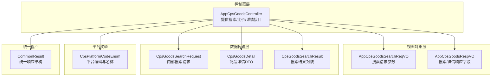
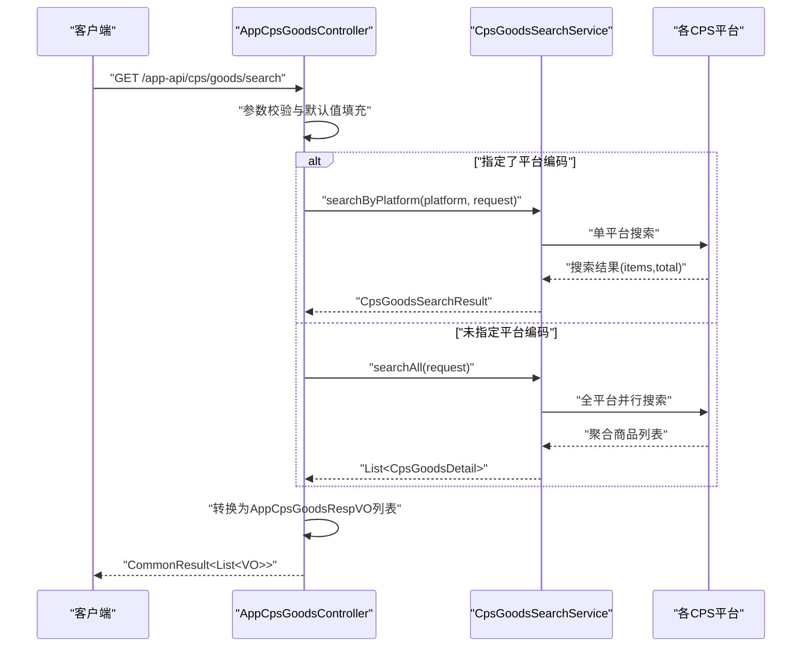
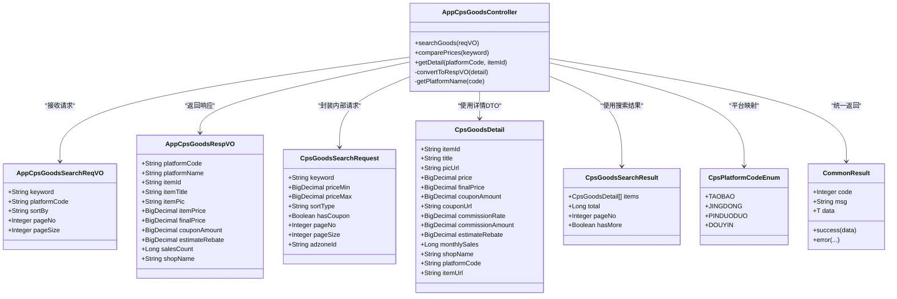

# 商品搜索与比价接口

<cite>
**本文引用的文件**
- [AppCpsGoodsController.java](file://yudao-module-cps/yudao-module-cps-biz/src/main/java/cn/zhijian/cps/controller/app/AppCpsGoodsController.java)
- [AppCpsGoodsSearchReqVO.java](file://yudao-module-cps/yudao-module-cps-biz/src/main/java/cn/zhijian/cps/controller/app/vo/AppCpsGoodsSearchReqVO.java)
- [AppCpsGoodsRespVO.java](file://yudao-module-cps/yudao-module-cps-biz/src/main/java/cn/zhijian/cps/controller/app/vo/AppCpsGoodsRespVO.java)
- [CpsGoodsSearchRequest.java](file://yudao-module-cps/yudao-module-cps-biz/src/main/java/cn/zhijian/cps/client/dto/CpsGoodsSearchRequest.java)
- [CpsGoodsDetail.java](file://yudao-module-cps/yudao-module-cps-biz/src/main/java/cn/zhijian/cps/client/dto/CpsGoodsDetail.java)
- [CpsGoodsSearchResult.java](file://yudao-module-cps/yudao-module-cps-biz/src/main/java/cn/zhijian/cps/client/dto/CpsGoodsSearchResult.java)
- [CpsPlatformCodeEnum.java](file://yudao-module-cps/yudao-module-cps-biz/src/main/java/cn/zhijian/cps/enums/CpsPlatformCodeEnum.java)
- [CommonResult.java](file://yudao-framework/yudao-common/src/main/java/cn/iocoder/yudao/framework/common/pojo/CommonResult.java)
</cite>

## 目录
1. [简介](#简介)
2. [项目结构](#项目结构)
3. [核心组件](#核心组件)
4. [架构总览](#架构总览)
5. [详细组件分析](#详细组件分析)
6. [依赖分析](#依赖分析)
7. [性能考虑](#性能考虑)
8. [故障排查指南](#故障排查指南)
9. [结论](#结论)
10. [附录](#附录)

## 简介
本文件面向“商品搜索与比价接口”的使用者与维护者，系统化说明以下三个接口：
- 商品搜索接口：GET /app-api/cps/goods/search（支持单平台与全平台并行搜索）
- 多平台比价接口：POST /app-api/cps/goods/compare（跨平台聚合比价）
- 商品详情接口：GET /app-api/cps/goods/detail（按平台编码与商品ID查询）

文档覆盖参数规范、调用流程、返回字段、请求/响应示例、排序与分页策略、平台名称映射规则，并对单平台搜索与全平台并行搜索的区别进行说明。

## 项目结构
围绕CPS商品搜索与比价的核心文件组织如下：
- 控制器层：AppCpsGoodsController 提供三个REST接口
- 视图对象层：AppCpsGoodsSearchReqVO（请求）、AppCpsGoodsRespVO（响应）
- 数据传输层：CpsGoodsSearchRequest（内部搜索请求）、CpsGoodsDetail（商品详情）、CpsGoodsSearchResult（搜索结果封装）
- 平台枚举：CpsPlatformCodeEnum 定义受支持平台编码与名称
- 统一返回：CommonResult 统一响应结构

图表来源
- [AppCpsGoodsController.java:24-117](file://yudao-module-cps/yudao-module-cps-biz/src/main/java/cn/zhijian/cps/controller/app/AppCpsGoodsController.java#L24-L117)
- [AppCpsGoodsSearchReqVO.java:1-28](file://yudao-module-cps/yudao-module-cps-biz/src/main/java/cn/zhijian/cps/controller/app/vo/AppCpsGoodsSearchReqVO.java#L1-L28)
- [AppCpsGoodsRespVO.java:1-46](file://yudao-module-cps/yudao-module-cps-biz/src/main/java/cn/zhijian/cps/controller/app/vo/AppCpsGoodsRespVO.java#L1-L46)
- [CpsGoodsSearchRequest.java:1-47](file://yudao-module-cps/yudao-module-cps-biz/src/main/java/cn/zhijian/cps/client/dto/CpsGoodsSearchRequest.java#L1-L47)
- [CpsGoodsDetail.java:1-71](file://yudao-module-cps/yudao-module-cps-biz/src/main/java/cn/zhijian/cps/client/dto/CpsGoodsDetail.java#L1-L71)
- [CpsGoodsSearchResult.java:1-31](file://yudao-module-cps/yudao-module-cps-biz/src/main/java/cn/zhijian/cps/client/dto/CpsGoodsSearchResult.java#L1-L31)
- [CpsPlatformCodeEnum.java:1-28](file://yudao-module-cps/yudao-module-cps-biz/src/main/java/cn/zhijian/cps/enums/CpsPlatformCodeEnum.java#L1-L28)
- [CommonResult.java:1-121](file://yudao-framework/yudao-common/src/main/java/cn/iocoder/yudao/framework/common/pojo/CommonResult.java#L1-L121)

章节来源
- [AppCpsGoodsController.java:24-117](file://yudao-module-cps/yudao-module-cps-biz/src/main/java/cn/zhijian/cps/controller/app/AppCpsGoodsController.java#L24-L117)
- [AppCpsGoodsSearchReqVO.java:1-28](file://yudao-module-cps/yudao-module-cps-biz/src/main/java/cn/zhijian/cps/controller/app/vo/AppCpsGoodsSearchReqVO.java#L1-L28)
- [AppCpsGoodsRespVO.java:1-46](file://yudao-module-cps/yudao-module-cps-biz/src/main/java/cn/zhijian/cps/controller/app/vo/AppCpsGoodsRespVO.java#L1-L46)
- [CpsGoodsSearchRequest.java:1-47](file://yudao-module-cps/yudao-module-cps-biz/src/main/java/cn/zhijian/cps/client/dto/CpsGoodsSearchRequest.java#L1-L47)
- [CpsGoodsDetail.java:1-71](file://yudao-module-cps/yudao-module-cps-biz/src/main/java/cn/zhijian/cps/client/dto/CpsGoodsDetail.java#L1-L71)
- [CpsGoodsSearchResult.java:1-31](file://yudao-module-cps/yudao-module-cps-biz/src/main/java/cn/zhijian/cps/client/dto/CpsGoodsSearchResult.java#L1-L31)
- [CpsPlatformCodeEnum.java:1-28](file://yudao-module-cps/yudao-module-cps-biz/src/main/java/cn/zhijian/cps/enums/CpsPlatformCodeEnum.java#L1-L28)
- [CommonResult.java:1-121](file://yudao-framework/yudao-common/src/main/java/cn/iocoder/yudao/framework/common/pojo/CommonResult.java#L1-L121)

## 核心组件
- 控制器：AppCpsGoodsController
  - GET /app-api/cps/goods/search：支持单平台与全平台搜索
  - POST /app-api/cps/goods/compare：跨平台比价
  - GET /app-api/cps/goods/detail：按平台编码与商品ID查询详情
- 请求/响应VO：AppCpsGoodsSearchReqVO、AppCpsGoodsRespVO
- 内部DTO：CpsGoodsSearchRequest、CpsGoodsDetail、CpsGoodsSearchResult
- 平台枚举：CpsPlatformCodeEnum
- 统一返回：CommonResult

章节来源
- [AppCpsGoodsController.java:24-117](file://yudao-module-cps/yudao-module-cps-biz/src/main/java/cn/zhijian/cps/controller/app/AppCpsGoodsController.java#L24-L117)
- [AppCpsGoodsSearchReqVO.java:1-28](file://yudao-module-cps/yudao-module-cps-biz/src/main/java/cn/zhijian/cps/controller/app/vo/AppCpsGoodsSearchReqVO.java#L1-L28)
- [AppCpsGoodsRespVO.java:1-46](file://yudao-module-cps/yudao-module-cps-biz/src/main/java/cn/zhijian/cps/controller/app/vo/AppCpsGoodsRespVO.java#L1-L46)
- [CpsGoodsSearchRequest.java:1-47](file://yudao-module-cps/yudao-module-cps-biz/src/main/java/cn/zhijian/cps/client/dto/CpsGoodsSearchRequest.java#L1-L47)
- [CpsGoodsDetail.java:1-71](file://yudao-module-cps/yudao-module-cps-biz/src/main/java/cn/zhijian/cps/client/dto/CpsGoodsDetail.java#L1-L71)
- [CpsGoodsSearchResult.java:1-31](file://yudao-module-cps/yudao-module-cps-biz/src/main/java/cn/zhijian/cps/client/dto/CpsGoodsSearchResult.java#L1-L31)
- [CpsPlatformCodeEnum.java:1-28](file://yudao-module-cps/yudao-module-cps-biz/src/main/java/cn/zhijian/cps/enums/CpsPlatformCodeEnum.java#L1-L28)
- [CommonResult.java:1-121](file://yudao-framework/yudao-common/src/main/java/cn/iocoder/yudao/framework/common/pojo/CommonResult.java#L1-L121)

## 架构总览
接口调用链路概览：
- 客户端请求到达控制器
- 控制器根据路径选择具体处理逻辑
- 控制器将请求参数封装为内部DTO并调用服务层
- 服务层执行单平台搜索、全平台并行搜索、跨平台比价或查询详情
- 控制器将DTO转换为对外VO并包装为统一返回结构

图表来源
- [AppCpsGoodsController.java:34-63](file://yudao-module-cps/yudao-module-cps-biz/src/main/java/cn/zhijian/cps/controller/app/AppCpsGoodsController.java#L34-L63)
- [CpsGoodsSearchRequest.java:11-46](file://yudao-module-cps/yudao-module-cps-biz/src/main/java/cn/zhijian/cps/client/dto/CpsGoodsSearchRequest.java#L11-L46)
- [CpsGoodsSearchResult.java:11-31](file://yudao-module-cps/yudao-module-cps-biz/src/main/java/cn/zhijian/cps/client/dto/CpsGoodsSearchResult.java#L11-L31)

## 详细组件分析

### 商品搜索接口：GET /app-api/cps/goods/search
- 功能说明
  - 支持关键词搜索
  - 可选平台筛选（platformCode）
  - 分页参数（pageNo、pageSize）
  - 排序方式（sortBy）
  - 单平台搜索与全平台并行搜索自动切换
- 请求参数
  - keyword：必填，搜索关键词
  - platformCode：可选，平台编码（如 taobao/jingdong/pinduoduo/douyin）
  - sortBy：可选，排序方式（price_asc/price_desc/commission_desc/sales_desc）
  - pageNo：可选，默认1
  - pageSize：可选，默认20
- 处理逻辑
  - 若传入platformCode且非空：调用单平台搜索
  - 否则：调用全平台并行搜索
  - 将内部DTO转换为对外VO
- 响应字段（AppCpsGoodsRespVO）
  - platformCode、platformName、itemId、itemTitle、itemPic
  - itemPrice、finalPrice、couponAmount、estimateRebate、salesCount、shopName
- 示例
  - 请求示例：GET /app-api/cps/goods/search?keyword=手机壳&platformCode=taobao&pageNo=1&pageSize=20&sortBy=price_asc
  - 响应示例：包含若干商品项，每项包含上述字段

章节来源
- [AppCpsGoodsController.java:34-63](file://yudao-module-cps/yudao-module-cps-biz/src/main/java/cn/zhijian/cps/controller/app/AppCpsGoodsController.java#L34-L63)
- [AppCpsGoodsSearchReqVO.java:9-27](file://yudao-module-cps/yudao-module-cps-biz/src/main/java/cn/zhijian/cps/controller/app/vo/AppCpsGoodsSearchReqVO.java#L9-L27)
- [AppCpsGoodsRespVO.java:10-45](file://yudao-module-cps/yudao-module-cps-biz/src/main/java/cn/zhijian/cps/controller/app/vo/AppCpsGoodsRespVO.java#L10-L45)

### 多平台比价接口：POST /app-api/cps/goods/compare
- 功能说明
  - 根据关键词在多个平台并行搜索，返回跨平台比价结果
  - 会员ID参数预留（当前示例中可为空）
- 请求参数
  - keyword：必填，搜索关键词
- 响应字段
  - 与商品搜索一致，使用AppCpsGoodsRespVO列表
- 示例
  - 请求示例：POST /app-api/cps/goods/compare?keyword=连衣裙
  - 响应示例：按平台聚合的商品列表，便于横向比较价格与返利

章节来源
- [AppCpsGoodsController.java:65-73](file://yudao-module-cps/yudao-module-cps-biz/src/main/java/cn/zhijian/cps/controller/app/AppCpsGoodsController.java#L65-L73)
- [AppCpsGoodsRespVO.java:10-45](file://yudao-module-cps/yudao-module-cps-biz/src/main/java/cn/zhijian/cps/controller/app/vo/AppCpsGoodsRespVO.java#L10-L45)

### 商品详情接口：GET /app-api/cps/goods/detail
- 功能说明
  - 根据平台编码与商品ID查询商品详情
- 请求参数
  - platformCode：必填，平台编码（taobao/jingdong/pinduoduo/douyin）
  - itemId：必填，商品ID
- 响应字段
  - 与AppCpsGoodsRespVO一致，但仅返回单个商品详情
- 示例
  - 请求示例：GET /app-api/cps/goods/detail?platformCode=taobao&itemId=123456
  - 响应示例：包含该商品的标题、图片、价格、券后价、预估返利、销量等

章节来源
- [AppCpsGoodsController.java:75-85](file://yudao-module-cps/yudao-module-cps-biz/src/main/java/cn/zhijian/cps/controller/app/AppCpsGoodsController.java#L75-L85)
- [AppCpsGoodsRespVO.java:10-45](file://yudao-module-cps/yudao-module-cps-biz/src/main/java/cn/zhijian/cps/controller/app/vo/AppCpsGoodsRespVO.java#L10-L45)

### 排序与分页策略
- 排序方式（sortBy）
  - 支持 price_asc（价格升序）、price_desc（价格降序）、commission_desc（佣金降序）、sales_desc（销量降序）
  - 控制器将sortBy映射到内部sortType
- 分页参数
  - pageNo默认1，pageSize默认20
  - 控制器在构建内部请求时进行默认值填充

章节来源
- [AppCpsGoodsSearchReqVO.java:18-25](file://yudao-module-cps/yudao-module-cps-biz/src/main/java/cn/zhijian/cps/controller/app/vo/AppCpsGoodsSearchReqVO.java#L18-L25)
- [AppCpsGoodsController.java:42-44](file://yudao-module-cps/yudao-module-cps-biz/src/main/java/cn/zhijian/cps/controller/app/AppCpsGoodsController.java#L42-L44)

### 单平台搜索与全平台并行搜索的区别
- 单平台搜索
  - 明确传入platformCode时触发
  - 调用searchByPlatform，仅返回指定平台的商品列表
- 全平台并行搜索
  - 未传入platformCode或为空时触发
  - 调用searchAll，聚合所有受支持平台的商品列表
- 平台名称映射
  - 控制器内部将平台编码映射为中文名称（如 taobao → 淘宝联盟），用于对外展示

章节来源
- [AppCpsGoodsController.java:48-60](file://yudao-module-cps/yudao-module-cps-biz/src/main/java/cn/zhijian/cps/controller/app/AppCpsGoodsController.java#L48-L60)
- [AppCpsGoodsController.java:105-114](file://yudao-module-cps/yudao-module-cps-biz/src/main/java/cn/zhijian/cps/controller/app/AppCpsGoodsController.java#L105-L114)
- [CpsPlatformCodeEnum.java:11-27](file://yudao-module-cps/yudao-module-cps-biz/src/main/java/cn/zhijian/cps/enums/CpsPlatformCodeEnum.java#L11-L27)

### 字段说明与示例
- 关键字段
  - 商品标题：itemTitle
  - 商品主图：itemPic
  - 商品原价：itemPrice
  - 券后价：finalPrice
  - 优惠券金额：couponAmount
  - 预估返利：estimateRebate
  - 销量：salesCount
  - 店铺名称：shopName
  - 平台编码：platformCode
  - 平台名称：platformName（由编码映射而来）
- 示例
  - 请求示例：GET /app-api/cps/goods/search?keyword=蓝牙耳机&platformCode=taobao&pageNo=1&pageSize=20&sortBy=price_asc
  - 响应示例：包含若干商品项，每项包含上述字段

章节来源
- [AppCpsGoodsRespVO.java:10-45](file://yudao-module-cps/yudao-module-cps-biz/src/main/java/cn/zhijian/cps/controller/app/vo/AppCpsGoodsRespVO.java#L10-L45)
- [AppCpsGoodsController.java:89-103](file://yudao-module-cps/yudao-module-cps-biz/src/main/java/cn/zhijian/cps/controller/app/AppCpsGoodsController.java#L89-L103)

## 依赖分析
- 控制器依赖
  - AppCpsGoodsController 依赖 CpsGoodsSearchService（接口）以执行搜索、比价与详情查询
  - 使用 AppCpsGoodsSearchReqVO 作为请求参数载体
  - 使用 AppCpsGoodsRespVO 作为对外响应载体
  - 使用 CpsGoodsSearchRequest、CpsGoodsDetail、CpsGoodsSearchResult 进行内部数据传递
  - 使用 CpsPlatformCodeEnum 进行平台编码与名称映射
  - 使用 CommonResult 统一返回结构
- 类关系图

图表来源
- [AppCpsGoodsController.java:24-117](file://yudao-module-cps/yudao-module-cps-biz/src/main/java/cn/zhijian/cps/controller/app/AppCpsGoodsController.java#L24-L117)
- [AppCpsGoodsSearchReqVO.java:1-28](file://yudao-module-cps/yudao-module-cps-biz/src/main/java/cn/zhijian/cps/controller/app/vo/AppCpsGoodsSearchReqVO.java#L1-L28)
- [AppCpsGoodsRespVO.java:1-46](file://yudao-module-cps/yudao-module-cps-biz/src/main/java/cn/zhijian/cps/controller/app/vo/AppCpsGoodsRespVO.java#L1-L46)
- [CpsGoodsSearchRequest.java:1-47](file://yudao-module-cps/yudao-module-cps-biz/src/main/java/cn/zhijian/cps/client/dto/CpsGoodsSearchRequest.java#L1-L47)
- [CpsGoodsDetail.java:1-71](file://yudao-module-cps/yudao-module-cps-biz/src/main/java/cn/zhijian/cps/client/dto/CpsGoodsDetail.java#L1-L71)
- [CpsGoodsSearchResult.java:1-31](file://yudao-module-cps/yudao-module-cps-biz/src/main/java/cn/zhijian/cps/client/dto/CpsGoodsSearchResult.java#L1-L31)
- [CpsPlatformCodeEnum.java:1-28](file://yudao-module-cps/yudao-module-cps-biz/src/main/java/cn/zhijian/cps/enums/CpsPlatformCodeEnum.java#L1-L28)
- [CommonResult.java:1-121](file://yudao-framework/yudao-common/src/main/java/cn/iocoder/yudao/framework/common/pojo/CommonResult.java#L1-L121)

## 性能考虑
- 全平台并行搜索
  - 在未指定平台编码时，接口会并行查询多个平台，可能带来更高的网络延迟与并发开销
  - 建议前端控制分页大小与排序策略，避免一次性请求过多数据
- 排序与过滤
  - sortBy与hasCoupon等参数会影响平台侧的检索成本，建议结合业务场景合理设置
- 缓存与去重
  - 对于高频关键词，可在网关或应用层引入缓存策略，减少重复请求
- 错误与超时
  - 平台侧超时或失败时，应快速失败并返回统一错误结构，避免阻塞整体响应

## 故障排查指南
- 常见问题
  - keyword为空：请求参数校验会失败，返回统一错误结构
  - platformCode非法：平台名称映射为原始编码，建议检查枚举支持范围
  - pageNo/pageSize越界：建议前端限制最大页码与最大页大小
- 统一返回结构
  - 成功：code=0，msg为空，data为实际结果
  - 失败：code非0，msg为错误描述，data为null或空集合
- 排查步骤
  - 检查请求参数是否符合VO定义
  - 查看控制器日志输出（包含请求参数）
  - 核对平台编码是否在CpsPlatformCodeEnum范围内

章节来源
- [AppCpsGoodsSearchReqVO.java:11-13](file://yudao-module-cps/yudao-module-cps-biz/src/main/java/cn/zhijian/cps/controller/app/vo/AppCpsGoodsSearchReqVO.java#L11-L13)
- [CommonResult.java:20-38](file://yudao-framework/yudao-common/src/main/java/cn/iocoder/yudao/framework/common/pojo/CommonResult.java#L20-L38)
- [AppCpsGoodsController.java:36-37](file://yudao-module-cps/yudao-module-cps-biz/src/main/java/cn/zhijian/cps/controller/app/AppCpsGoodsController.java#L36-L37)

## 结论
本文档系统化梳理了商品搜索与比价接口的参数规范、调用流程与返回格式，明确了单平台与全平台搜索的差异、平台名称映射规则，并提供了请求/响应示例与故障排查建议。建议在生产环境中结合业务场景合理设置分页与排序策略，并关注全平台并行搜索的性能影响。

## 附录
- 平台编码与名称映射
  - taobao → 淘宝联盟
  - jingdong → 京东联盟
  - pinduoduo → 拼多多联盟
  - douyin → 抖音联盟
- 统一返回结构
  - code：整型错误码（成功为0）
  - msg：字符串错误信息
  - data：实际返回数据

章节来源
- [CpsPlatformCodeEnum.java:11-27](file://yudao-module-cps/yudao-module-cps-biz/src/main/java/cn/zhijian/cps/enums/CpsPlatformCodeEnum.java#L11-L27)
- [CommonResult.java:20-38](file://yudao-framework/yudao-common/src/main/java/cn/iocoder/yudao/framework/common/pojo/CommonResult.java#L20-L38)