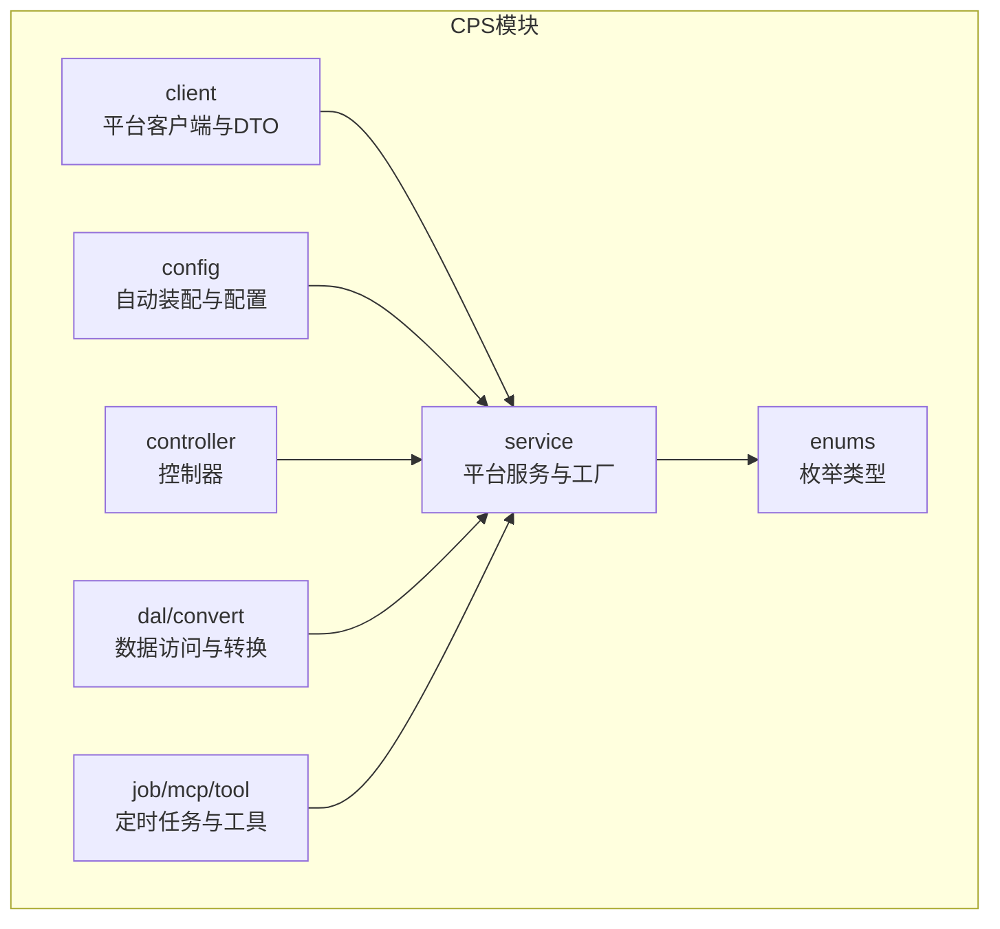
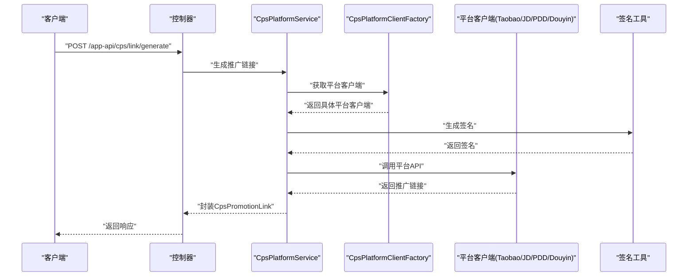
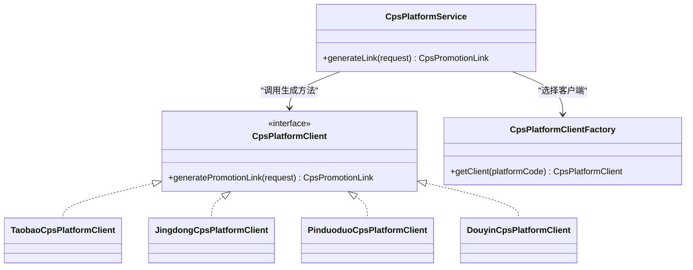
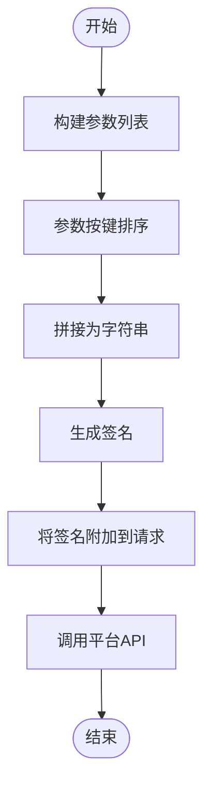
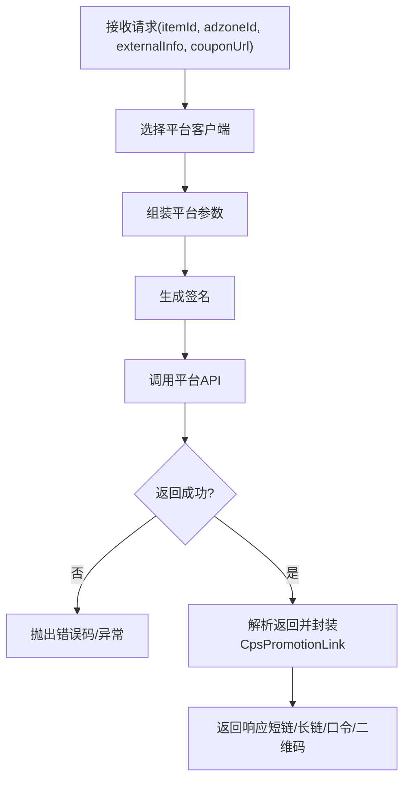
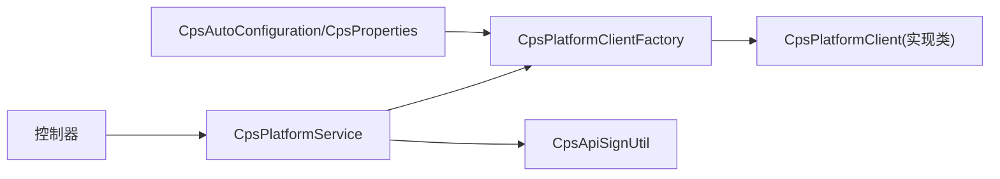

# 推广链接生成接口

<cite>
**本文引用的文件**
- [CpsPromotionLinkRequest.java](file://qiji-module-cps/qiji-module-cps-biz/src/main/java/cn/zhijian/cps/client/dto/CpsPromotionLinkRequest.java)
- [CpsPromotionLink.java](file://qiji-module-cps/qiji-module-cps-biz/src/main/java/cn/zhijian/cps/client/dto/CpsPromotionLink.java)
- [CpsPlatformClient.java](file://qiji-module-cps/qiji-module-cps-biz/src/main/java/cn/zhijian/cps/client/CpsPlatformClient.java)
- [TaobaoCpsPlatformClient.java](file://qiji-module-cps/qiji-module-cps-biz/src/main/java/cn/zhijian/cps/client/TaobaoCpsPlatformClient.java)
- [JingdongCpsPlatformClient.java](file://qiji-module-cps/qiji-module-cps-biz/src/main/java/cn/zhijian/cps/client/JingdongCpsPlatformClient.java)
- [PinduoduoCpsPlatformClient.java](file://qiji-module-cps/qiji-module-cps-biz/src/main/java/cn/zhijian/cps/client/PinduoduoCpsPlatformClient.java)
- [DouyinCpsPlatformClient.java](file://qiji-module-cps/qiji-module-cps-biz/src/main/java/cn/zhijian/cps/client/DouyinCpsPlatformClient.java)
- [CpsPlatformClientFactory.java](file://qiji-module-cps/qiji-module-cps-biz/src/main/java/cn/zhijian/cps/service/CpsPlatformClientFactory.java)
- [CpsPlatformClientFactoryImpl.java](file://qiji-module-cps/qiji-module-cps-biz/src/main/java/cn/zhijian/cps/service/CpsPlatformClientFactoryImpl.java)
- [CpsPlatformService.java](file://qiji-module-cps/qiji-module-cps-biz/src/main/java/cn/zhijian/cps/service/CpsPlatformService.java)
- [CpsPlatformServiceImpl.java](file://qiji-module-cps/qiji-module-cps-biz/src/main/java/cn/zhijian/cps/service/CpsPlatformServiceImpl.java)
- [CpsPlatformCodeEnum.java](file://qiji-module-cps/qiji-module-cps-biz/src/main/java/cn/zhijian/cps/enums/CpsPlatformCodeEnum.java)
- [CpsAdzoneTypeEnum.java](file://qiji-module-cps/qiji-module-cps-biz/src/main/java/cn/zhijian/cps/enums/CpsAdzoneTypeEnum.java)
- [CpsAutoConfiguration.java](file://qiji-module-cps/qiji-module-cps-biz/src/main/java/cn/zhijian/cps/config/CpsAutoConfiguration.java)
- [CpsProperties.java](file://qiji-module-cps/qiji-module-cps-biz/src/main/java/cn/zhijian/cps/config/CpsProperties.java)
- [CpsApiSignUtil.java](file://qiji-module-cps/qiji-module-cps-biz/src/main/java/cn/zhijian/cps/client/util/CpsApiSignUtil.java)
- [CpsAdzoneService.java](file://qiji-module-cps/qiji-module-cps-biz/src/main/java/cn/zhijian/cps/service/CpsAdzoneService.java)
- [CpsAdzoneServiceImpl.java](file://qiji-module-cps/qiji-module-cps-biz/src/main/java/cn/zhijian/cps/service/CpsAdzoneServiceImpl.java)
- [ErrorCodeConstants.java](file://qiji-module-cps/qiji-module-cps-biz/src/main/java/cn/zhijian/cps/enums/ErrorCodeConstants.java)
</cite>

## 目录
1. [简介](#简介)
2. [项目结构](#项目结构)
3. [核心组件](#核心组件)
4. [架构总览](#架构总览)
5. [详细组件分析](#详细组件分析)
6. [依赖关系分析](#依赖关系分析)
7. [性能考虑](#性能考虑)
8. [故障排查指南](#故障排查指南)
9. [结论](#结论)
10. [附录](#附录)

## 简介
本文件为推广链接生成接口（POST /app-api/cps/link/generate）的权威技术文档，面向后端与前端开发者，系统性阐述接口的请求参数、业务流程、平台适配、签名机制、返回结构及常见问题处理。文档同时覆盖短链、长链、小程序链等不同形态的生成策略，并对淘宝、京东、拼多多、抖音等主流平台在参数与规则上的差异进行说明。

## 项目结构
CPS模块位于 qiji-module-cps/qiji-module-cps-biz 下，采用按职责分层的组织方式：
- client：平台客户端与通用DTO定义
- service：平台服务与工厂类
- enums：枚举类型
- config：自动装配与配置
- controller：控制器（应用端与管理端）
- dal/convert：数据访问与转换
- job/mcp/tool：定时任务、提示词与工具

**章节来源**
- [CpsPlatformClient.java](file://qiji-module-cps/qiji-module-cps-biz/src/main/java/cn/zhijian/cps/client/CpsPlatformClient.java)
- [CpsPlatformClientFactory.java](file://qiji-module-cps/qiji-module-cps-biz/src/main/java/cn/zhijian/cps/service/CpsPlatformClientFactory.java)

## 核心组件
- 请求DTO：CpsPromotionLinkRequest，封装itemId、adzoneId、externalInfo、couponUrl等关键字段
- 返回DTO：CpsPromotionLink，封装promotionUrl、command、shortUrl、qrCodeUrl等
- 平台客户端：抽象接口与各平台实现（淘宝、京东、拼多多、抖音）
- 工厂与服务：CpsPlatformClientFactory、CpsPlatformServiceImpl、CpsPlatformService
- 枚举：CpsPlatformCodeEnum、CpsAdzoneTypeEnum
- 配置：CpsAutoConfiguration、CpsProperties
- 签名工具：CpsApiSignUtil
- 错误码：ErrorCodeConstants

**章节来源**
- [CpsPromotionLinkRequest.java](file://qiji-module-cps/qiji-module-cps-biz/src/main/java/cn/zhijian/cps/client/dto/CpsPromotionLinkRequest.java)
- [CpsPromotionLink.java](file://qiji-module-cps/qiji-module-cps-biz/src/main/java/cn/zhijian/cps/client/dto/CpsPromotionLink.java)
- [CpsPlatformClient.java](file://qiji-module-cps/qiji-module-cps-biz/src/main/java/cn/zhijian/cps/client/CpsPlatformClient.java)
- [CpsPlatformClientFactory.java](file://qiji-module-cps/qiji-module-cps-biz/src/main/java/cn/zhijian/cps/service/CpsPlatformClientFactory.java)
- [CpsPlatformService.java](file://qiji-module-cps/qiji-module-cps-biz/src/main/java/cn/zhijian/cps/service/CpsPlatformService.java)
- [CpsPlatformCodeEnum.java](file://qiji-module-cps/qiji-module-cps-biz/src/main/java/cn/zhijian/cps/enums/CpsPlatformCodeEnum.java)
- [CpsAdzoneTypeEnum.java](file://qiji-module-cps/qiji-module-cps-biz/src/main/java/cn/zhijian/cps/enums/CpsAdzoneTypeEnum.java)
- [CpsAutoConfiguration.java](file://qiji-module-cps/qiji-module-cps-biz/src/main/java/cn/zhijian/cps/config/CpsAutoConfiguration.java)
- [CpsProperties.java](file://qiji-module-cps/qiji-module-cps-biz/src/main/java/cn/zhijian/cps/config/CpsProperties.java)
- [CpsApiSignUtil.java](file://qiji-module-cps/qiji-module-cps-biz/src/main/java/cn/zhijian/cps/client/util/CpsApiSignUtil.java)
- [ErrorCodeConstants.java](file://qiji-module-cps/qiji-module-cps-biz/src/main/java/cn/zhijian/cps/enums/ErrorCodeConstants.java)

## 架构总览
推广链接生成的整体流程如下：
- 接收请求参数（itemId、adzoneId、externalInfo、couponUrl等）
- 通过平台编码选择对应平台客户端
- 组装平台特定参数并调用平台API
- 应用签名算法生成签名
- 解析平台返回，封装为统一的CpsPromotionLink
- 返回短链、长链、口令、二维码等结果

**图表来源**
- [CpsPlatformService.java](file://qiji-module-cps/qiji-module-cps-biz/src/main/java/cn/zhijian/cps/service/CpsPlatformService.java)
- [CpsPlatformClientFactory.java](file://qiji-module-cps/qiji-module-cps-biz/src/main/java/cn/zhijian/cps/service/CpsPlatformClientFactory.java)
- [CpsApiSignUtil.java](file://qiji-module-cps/qiji-module-cps-biz/src/main/java/cn/zhijian/cps/client/util/CpsApiSignUtil.java)
- [CpsPromotionLink.java](file://qiji-module-cps/qiji-module-cps-biz/src/main/java/cn/zhijian/cps/client/dto/CpsPromotionLink.java)

## 详细组件分析

### 接口定义与请求参数
- 接口路径：POST /app-api/cps/link/generate
- 请求体参数（来自CpsPromotionLinkRequest）：
  - itemId：商品ID（字符串）
  - adzoneId：广告位ID（字符串）
  - externalInfo：外部追踪参数（字符串，用于归因）
  - couponUrl：优惠券链接（字符串，可选）

- 响应体参数（来自CpsPromotionLink）：
  - promotionUrl：推广链接（长链）
  - command：口令（如淘口令）
  - shortUrl：短链接
  - qrCodeUrl：二维码链接

- 关键说明：
  - 平台编码由系统配置或上下文决定，通过工厂选择对应平台客户端
  - 签名算法由CpsApiSignUtil统一实现
  - 不同平台可能对参数名称与必填项存在差异，详见“平台差异说明”

**章节来源**
- [CpsPromotionLinkRequest.java](file://qiji-module-cps/qiji-module-cps-biz/src/main/java/cn/zhijian/cps/client/dto/CpsPromotionLinkRequest.java)
- [CpsPromotionLink.java](file://qiji-module-cps/qiji-module-cps-biz/src/main/java/cn/zhijian/cps/client/dto/CpsPromotionLink.java)

### 平台适配器与工厂
- 抽象接口：CpsPlatformClient
- 具体实现：
  - TaobaoCpsPlatformClient：淘宝平台
  - JingdongCpsPlatformClient：京东平台
  - PinduoduoCpsPlatformClient：拼多多平台
  - DouyinCpsPlatformClient：抖音平台
- 工厂：CpsPlatformClientFactory/CpsPlatformClientFactoryImpl
  - 负责根据平台编码选择具体客户端实例
- 服务：CpsPlatformService/CpsPlatformServiceImpl
  - 封装生成逻辑，协调工厂、签名与平台客户端

**图表来源**
- [CpsPlatformClient.java](file://qiji-module-cps/qiji-module-cps-biz/src/main/java/cn/zhijian/cps/client/CpsPlatformClient.java)
- [TaobaoCpsPlatformClient.java](file://qiji-module-cps/qiji-module-cps-biz/src/main/java/cn/zhijian/cps/client/TaobaoCpsPlatformClient.java)
- [JingdongCpsPlatformClient.java](file://qiji-module-cps/qiji-module-cps-biz/src/main/java/cn/zhijian/cps/client/JingdongCpsPlatformClient.java)
- [PinduoduoCpsPlatformClient.java](file://qiji-module-cps/qiji-module-cps-biz/src/main/java/cn/zhijian/cps/client/PinduoduoCpsPlatformClient.java)
- [DouyinCpsPlatformClient.java](file://qiji-module-cps/qiji-module-cps-biz/src/main/java/cn/zhijian/cps/client/DouyinCpsPlatformClient.java)
- [CpsPlatformClientFactory.java](file://qiji-module-cps/qiji-module-cps-biz/src/main/java/cn/zhijian/cps/service/CpsPlatformClientFactory.java)
- [CpsPlatformService.java](file://qiji-module-cps/qiji-module-cps-biz/src/main/java/cn/zhijian/cps/service/CpsPlatformService.java)

**章节来源**
- [CpsPlatformClient.java](file://qiji-module-cps/qiji-module-cps-biz/src/main/java/cn/zhijian/cps/client/CpsPlatformClient.java)
- [CpsPlatformClientFactory.java](file://qiji-module-cps/qiji-module-cps-biz/src/main/java/cn/zhijian/cps/service/CpsPlatformClientFactory.java)
- [CpsPlatformService.java](file://qiji-module-cps/qiji-module-cps-biz/src/main/java/cn/zhijian/cps/service/CpsPlatformService.java)

### 签名算法与风控
- 签名工具：CpsApiSignUtil
  - 负责对请求参数进行排序、拼接与签名生成
  - 确保与平台侧约定的签名规则一致
- 风控机制：
  - 平台侧通常对请求频率、参数合法性、IP白名单等进行限制
  - 建议在服务层增加重试、熔断与限流策略（由配置与工厂控制）

**图表来源**
- [CpsApiSignUtil.java](file://qiji-module-cps/qiji-module-cps-biz/src/main/java/cn/zhijian/cps/client/util/CpsApiSignUtil.java)

**章节来源**
- [CpsApiSignUtil.java](file://qiji-module-cps/qiji-module-cps-biz/src/main/java/cn/zhijian/cps/client/util/CpsApiSignUtil.java)

### 广告位与配置
- 广告位类型：CpsAdzoneTypeEnum
  - 用于区分广告位用途（如普通推广、活动推广等）
- 自动装配与配置：CpsAutoConfiguration、CpsProperties
  - 注入平台密钥、网关地址、超时时间等
- 广告位服务：CpsAdzoneService/CpsAdzoneServiceImpl
  - 提供广告位校验、可用性检查等功能

**章节来源**
- [CpsAdzoneTypeEnum.java](file://qiji-module-cps/qiji-module-cps-biz/src/main/java/cn/zhijian/cps/enums/CpsAdzoneTypeEnum.java)
- [CpsAutoConfiguration.java](file://qiji-module-cps/qiji-module-cps-biz/src/main/java/cn/zhijian/cps/config/CpsAutoConfiguration.java)
- [CpsProperties.java](file://qiji-module-cps/qiji-module-cps-biz/src/main/java/cn/zhijian/cps/config/CpsProperties.java)
- [CpsAdzoneService.java](file://qiji-module-cps/qiji-module-cps-biz/src/main/java/cn/zhijian/cps/service/CpsAdzoneService.java)

### 平台差异与注意事项
- 淘宝（Taobao）
  - 必填参数：itemId、adzoneId、pid（推广位PID）
  - 支持口令与短链；部分场景需传入unionId与subUnionId
- 京东（Jingdong）
  - 必填参数：goodsId（与itemId对应）、materialId、pid
  - 支持优惠券链接；需注意券时效与库存
- 拼多多（Pinduoduo）
  - 必填参数：goodsId、pid、adSlotId（与adzoneId对应）
  - 支持短链与小程序链；需关注佣金比例与结算周期
- 抖音（Douyin）
  - 必填参数：goodsId、advertiser_id、campId
  - 支持短视频/直播带货链接；需遵守平台内容规范

**章节来源**
- [TaobaoCpsPlatformClient.java](file://qiji-module-cps/qiji-module-cps-biz/src/main/java/cn/zhijian/cps/client/TaobaoCpsPlatformClient.java)
- [JingdongCpsPlatformClient.java](file://qiji-module-cps/qiji-module-cps-biz/src/main/java/cn/zhijian/cps/client/JingdongCpsPlatformClient.java)
- [PinduoduoCpsPlatformClient.java](file://qiji-module-cps/qiji-module-cps-biz/src/main/java/cn/zhijian/cps/client/PinduoduoCpsPlatformClient.java)
- [DouyinCpsPlatformClient.java](file://qiji-module-cps/qiji-module-cps-biz/src/main/java/cn/zhijian/cps/client/DouyinCpsPlatformClient.java)

### 业务流程图（含参数组装与签名）

**图表来源**
- [CpsPlatformService.java](file://qiji-module-cps/qiji-module-cps-biz/src/main/java/cn/zhijian/cps/service/CpsPlatformService.java)
- [CpsPromotionLink.java](file://qiji-module-cps/qiji-module-cps-biz/src/main/java/cn/zhijian/cps/client/dto/CpsPromotionLink.java)

## 依赖关系分析
- 控制器依赖服务层；服务层依赖工厂与平台客户端
- 工厂根据平台编码返回具体客户端
- 签名工具贯穿请求组装阶段
- 配置类提供平台密钥与网关信息

**图表来源**
- [CpsPlatformService.java](file://qiji-module-cps/qiji-module-cps-biz/src/main/java/cn/zhijian/cps/service/CpsPlatformService.java)
- [CpsPlatformClientFactory.java](file://qiji-module-cps/qiji-module-cps-biz/src/main/java/cn/zhijian/cps/service/CpsPlatformClientFactory.java)
- [CpsAutoConfiguration.java](file://qiji-module-cps/qiji-module-cps-biz/src/main/java/cn/zhijian/cps/config/CpsAutoConfiguration.java)
- [CpsProperties.java](file://qiji-module-cps/qiji-module-cps-biz/src/main/java/cn/zhijian/cps/config/CpsProperties.java)

**章节来源**
- [CpsPlatformService.java](file://qiji-module-cps/qiji-module-cps-biz/src/main/java/cn/zhijian/cps/service/CpsPlatformService.java)
- [CpsPlatformClientFactory.java](file://qiji-module-cps/qiji-module-cps-biz/src/main/java/cn/zhijian/cps/service/CpsPlatformClientFactory.java)
- [CpsAutoConfiguration.java](file://qiji-module-cps/qiji-module-cps-biz/src/main/java/cn/zhijian/cps/config/CpsAutoConfiguration.java)
- [CpsProperties.java](file://qiji-module-cps/qiji-module-cps-biz/src/main/java/cn/zhijian/cps/config/CpsProperties.java)

## 性能考虑
- 并发与限流：对平台API调用设置合理的超时与并发上限，避免雪崩
- 缓存：对热点商品的推广链接可做短期缓存，降低重复生成成本
- 异步：在不影响用户体验的前提下，将非关键路径异步化
- 日志与监控：记录请求耗时、成功率与错误码，便于定位瓶颈

## 故障排查指南
- 常见错误码参考：ErrorCodeConstants
- 参数校验失败：检查itemId/adzoneId格式与必填项是否齐全
- 签名失败：确认参数排序、拼接规则与密钥配置正确
- 平台无返回或超时：检查网络连通性、平台网关与限流阈值
- 广告位不可用：通过CpsAdzoneService校验adzoneId有效性

**章节来源**
- [ErrorCodeConstants.java](file://qiji-module-cps/qiji-module-cps-biz/src/main/java/cn/zhijian/cps/enums/ErrorCodeConstants.java)
- [CpsAdzoneService.java](file://qiji-module-cps/qiji-module-cps-biz/src/main/java/cn/zhijian/cps/service/CpsAdzoneService.java)

## 结论
推广链接生成接口通过统一的DTO与平台客户端抽象，实现了多平台的一致化接入。借助工厂模式与签名工具，系统在保证安全性的同时提升了扩展性。建议在生产环境中结合限流、缓存与监控，确保高并发下的稳定性与可观测性。

## 附录

### 请求与响应示例（示意）
- 请求示例
  - 方法：POST
  - 路径：/app-api/cps/link/generate
  - 请求体字段：itemId、adzoneId、externalInfo、couponUrl
- 响应示例
  - 字段：promotionUrl、command、shortUrl、qrCodeUrl

### 有效期与跳转规则
- 有效期：由平台决定，通常为数小时至数天不等
- 跳转规则：短链跳转至长链，长链再跳转至商品详情页或落地页
- 小程序链：在微信生态内跳转至小程序页面，需满足平台小程序合规要求

### 平台差异速查
- 淘宝：需pid；支持口令与短链
- 京东：需goodsId/materialId/pid；支持优惠券
- 拼多多：需goodsId/pid/adSlotId；支持短链与小程序链
- 抖音：需goodsId/advertiser_id/campId；支持短视频/直播