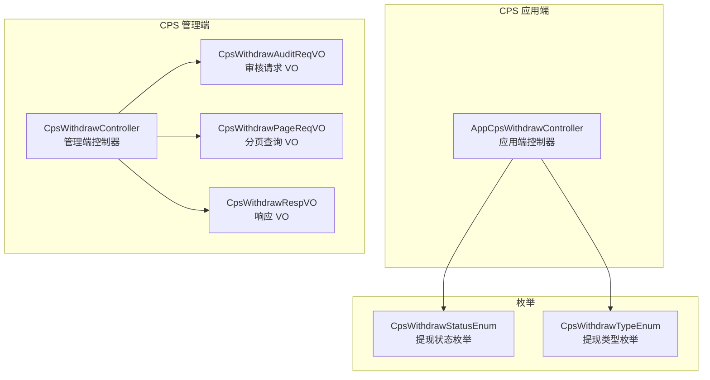
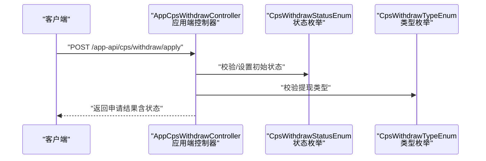
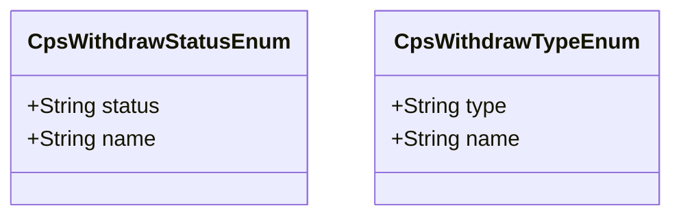
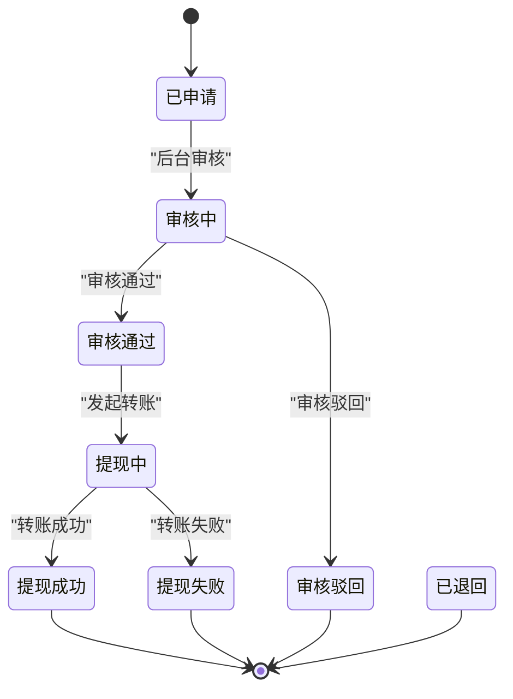
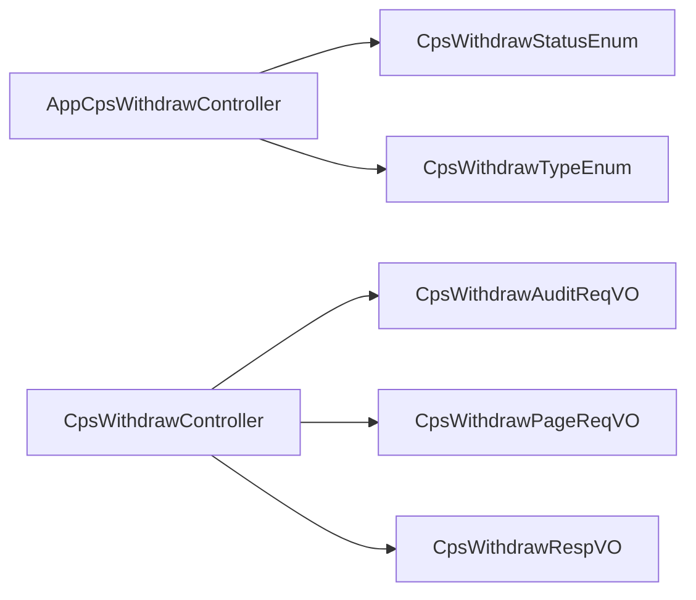

# 提现申请接口

<cite>
**本文引用的文件**
- [AppCpsWithdrawController.java](file://yudao-module-cps/yudao-module-cps-biz/src/main/java/cn/zhijian/cps/controller/app/AppCpsWithdrawController.java)
- [CpsWithdrawController.java](file://yudao-module-cps/yudao-module-cps-biz/src/main/java/cn/zhijian/cps/controller/admin/CpsWithdrawController.java)
- [CpsWithdrawStatusEnum.java](file://yudao-module-cps/yudao-module-cps-biz/src/main/java/cn/zhijian/cps/enums/CpsWithdrawStatusEnum.java)
- [CpsWithdrawTypeEnum.java](file://yudao-module-cps/yudao-module-cps-biz/src/main/java/cn/zhijian/cps/enums/CpsWithdrawTypeEnum.java)
- [CpsWithdrawAuditReqVO.java](file://yudao-module-cps/yudao-module-cps-biz/src/main/java/cn/zhijian/cps/controller/admin/vo/withdraw/CpsWithdrawAuditReqVO.java)
- [CpsWithdrawPageReqVO.java](file://yudao-module-cps/yudao-module-cps-biz/src/main/java/cn/zhijian/cps/controller/admin/vo/withdraw/CpsWithdrawPageReqVO.java)
- [CpsWithdrawRespVO.java](file://yudao-module-cps/yudao-module-cps-biz/src/main/java/cn/zhijian/cps/controller/admin/vo/withdraw/CpsWithdrawRespVO.java)
</cite>

## 目录
1. [简介](#简介)
2. [项目结构](#项目结构)
3. [核心组件](#核心组件)
4. [架构总览](#架构总览)
5. [详细组件分析](#详细组件分析)
6. [依赖关系分析](#依赖关系分析)
7. [性能考虑](#性能考虑)
8. [故障排查指南](#故障排查指南)
9. [结论](#结论)
10. [附录](#附录)

## 简介
本文件面向“提现申请接口”（POST /app-api/cps/withdraw/apply）提供完整、可操作的API文档，覆盖以下内容：
- 申请参数与必填字段（提现金额、收款方式、收款账户信息、收款人姓名等）
- 提现状态枚举与状态流转
- 提现规则（最低提现金额、手续费、到账时间等）
- 提现记录查询接口的使用说明
- 提现安全机制、风控策略与异常处理流程
- 请求与响应示例（字段含义说明）

注意：本文档严格依据仓库中现有代码与枚举进行说明；若业务规则在数据库或配置中有额外约束，请以实际实现为准。

## 项目结构
CPS 模块中与提现直接相关的文件组织如下：
- 控制器：应用端与管理端控制器分别负责对外接口与后台管理接口
- 枚举：提现状态与提现类型的定义
- VO：请求与响应的数据传输对象
- 分页查询：支持按会员、状态、时间范围查询

图表来源
- [AppCpsWithdrawController.java](file://yudao-module-cps/yudao-module-cps-biz/src/main/java/cn/zhijian/cps/controller/app/AppCpsWithdrawController.java)
- [CpsWithdrawController.java](file://yudao-module-cps/yudao-module-cps-biz/src/main/java/cn/zhijian/cps/controller/admin/CpsWithdrawController.java)
- [CpsWithdrawStatusEnum.java](file://yudao-module-cps/yudao-module-cps-biz/src/main/java/cn/zhijian/cps/enums/CpsWithdrawStatusEnum.java)
- [CpsWithdrawTypeEnum.java](file://yudao-module-cps/yudao-module-cps-biz/src/main/java/cn/zhijian/cps/enums/CpsWithdrawTypeEnum.java)
- [CpsWithdrawAuditReqVO.java](file://yudao-module-cps/yudao-module-cps-biz/src/main/java/cn/zhijian/cps/controller/admin/vo/withdraw/CpsWithdrawAuditReqVO.java)
- [CpsWithdrawPageReqVO.java](file://yudao-module-cps/yudao-module-cps-biz/src/main/java/cn/zhijian/cps/controller/admin/vo/withdraw/CpsWithdrawPageReqVO.java)
- [CpsWithdrawRespVO.java](file://yudao-module-cps/yudao-module-cps-biz/src/main/java/cn/zhijian/cps/controller/admin/vo/withdraw/CpsWithdrawRespVO.java)

章节来源
- [AppCpsWithdrawController.java](file://yudao-module-cps/yudao-module-cps-biz/src/main/java/cn/zhijian/cps/controller/app/AppCpsWithdrawController.java)
- [CpsWithdrawController.java](file://yudao-module-cps/yudao-module-cps-biz/src/main/java/cn/zhijian/cps/controller/admin/CpsWithdrawController.java)
- [CpsWithdrawStatusEnum.java](file://yudao-module-cps/yudao-module-cps-biz/src/main/java/cn/zhijian/cps/enums/CpsWithdrawStatusEnum.java)
- [CpsWithdrawTypeEnum.java](file://yudao-module-cps/yudao-module-cps-biz/src/main/java/cn/zhijian/cps/enums/CpsWithdrawTypeEnum.java)
- [CpsWithdrawAuditReqVO.java](file://yudao-module-cps/yudao-module-cps-biz/src/main/java/cn/zhijian/cps/controller/admin/vo/withdraw/CpsWithdrawAuditReqVO.java)
- [CpsWithdrawPageReqVO.java](file://yudao-module-cps/yudao-module-cps-biz/src/main/java/cn/zhijian/cps/controller/admin/vo/withdraw/CpsWithdrawPageReqVO.java)
- [CpsWithdrawRespVO.java](file://yudao-module-cps/yudao-module-cps-biz/src/main/java/cn/zhijian/cps/controller/admin/vo/withdraw/CpsWithdrawRespVO.java)

## 核心组件
- 提现状态枚举：定义了提现生命周期中的状态集合，用于接口返回与状态判断
- 提现类型枚举：定义了支持的提现渠道类型（如支付宝、微信、银行卡）
- 管理端审核请求 VO：用于后台审核操作的输入参数
- 管理端分页查询 VO：用于后台查询提现记录的分页与筛选条件
- 管理端响应 VO：用于后台返回提现记录的字段集合
- 应用端控制器：对外暴露应用端提现申请接口

章节来源
- [CpsWithdrawStatusEnum.java](file://yudao-module-cps/yudao-module-cps-biz/src/main/java/cn/zhijian/cps/enums/CpsWithdrawStatusEnum.java)
- [CpsWithdrawTypeEnum.java](file://yudao-module-cps/yudao-module-cps-biz/src/main/java/cn/zhijian/cps/enums/CpsWithdrawTypeEnum.java)
- [CpsWithdrawAuditReqVO.java](file://yudao-module-cps/yudao-module-cps-biz/src/main/java/cn/zhijian/cps/controller/admin/vo/withdraw/CpsWithdrawAuditReqVO.java)
- [CpsWithdrawPageReqVO.java](file://yudao-module-cps/yudao-module-cps-biz/src/main/java/cn/zhijian/cps/controller/admin/vo/withdraw/CpsWithdrawPageReqVO.java)
- [CpsWithdrawRespVO.java](file://yudao-module-cps/yudao-module-cps-biz/src/main/java/cn/zhijian/cps/controller/admin/vo/withdraw/CpsWithdrawRespVO.java)
- [AppCpsWithdrawController.java](file://yudao-module-cps/yudao-module-cps-biz/src/main/java/cn/zhijian/cps/controller/app/AppCpsWithdrawController.java)

## 架构总览
下图展示了应用端提现申请接口与管理端提现管理之间的交互关系，以及状态与类型枚举对业务的影响。

图表来源
- [AppCpsWithdrawController.java](file://yudao-module-cps/yudao-module-cps-biz/src/main/java/cn/zhijian/cps/controller/app/AppCpsWithdrawController.java)
- [CpsWithdrawStatusEnum.java](file://yudao-module-cps/yudao-module-cps-biz/src/main/java/cn/zhijian/cps/enums/CpsWithdrawStatusEnum.java)
- [CpsWithdrawTypeEnum.java](file://yudao-module-cps/yudao-module-cps-biz/src/main/java/cn/zhijian/cps/enums/CpsWithdrawTypeEnum.java)

## 详细组件分析

### 提现状态与类型枚举
- 提现状态枚举包含：已申请、审核中、审核通过、审核驳回、提现成功、提现失败、已退回
- 提现类型枚举包含：支付宝、微信、银行卡

图表来源
- [CpsWithdrawStatusEnum.java](file://yudao-module-cps/yudao-module-cps-biz/src/main/java/cn/zhijian/cps/enums/CpsWithdrawStatusEnum.java)
- [CpsWithdrawTypeEnum.java](file://yudao-module-cps/yudao-module-cps-biz/src/main/java/cn/zhijian/cps/enums/CpsWithdrawTypeEnum.java)

章节来源
- [CpsWithdrawStatusEnum.java](file://yudao-module-cps/yudao-module-cps-biz/src/main/java/cn/zhijian/cps/enums/CpsWithdrawStatusEnum.java)
- [CpsWithdrawTypeEnum.java](file://yudao-module-cps/yudao-module-cps-biz/src/main/java/cn/zhijian/cps/enums/CpsWithdrawTypeEnum.java)

### 应用端提现申请接口（POST /app-api/cps/withdraw/apply）
- 接口路径：/app-api/cps/withdraw/apply
- 方法：POST
- 功能：提交提现申请，返回申请结果与初始状态
- 关键字段（请求参数）：
  - 提现金额：BigDecimal 类型，表示申请提现的金额
  - 提现类型：字符串，取值来自提现类型枚举（alipay、wechat、bank）
  - 收款账户：字符串，对应提现类型的账户标识（如支付宝账号、银行卡号、微信号）
  - 收款人姓名：字符串，账户实名信息
- 关键字段（响应参数）：
  - 提现单号：字符串，唯一标识本次提现
  - 提现金额：BigDecimal
  - 手续费：BigDecimal
  - 实际到账金额：BigDecimal
  - 状态：字符串，初始状态为“已申请”
  - 创建时间：时间戳

说明：
- 该接口由应用端控制器提供，具体参数校验与业务逻辑由后端服务实现
- 初始状态为“已申请”，后续状态变更由管理端审核与转账流程驱动

章节来源
- [AppCpsWithdrawController.java](file://yudao-module-cps/yudao-module-cps-biz/src/main/java/cn/zhijian/cps/controller/app/AppCpsWithdrawController.java)

### 提现状态流转
- 初始状态：已申请
- 后续可能的状态变化：审核中 → 审核通过/审核驳回 → 提现中 → 提现成功/提现失败/已退回

图表来源
- [CpsWithdrawStatusEnum.java](file://yudao-module-cps/yudao-module-cps-biz/src/main/java/cn/zhijian/cps/enums/CpsWithdrawStatusEnum.java)

章节来源
- [CpsWithdrawStatusEnum.java](file://yudao-module-cps/yudao-module-cps-biz/src/main/java/cn/zhijian/cps/enums/CpsWithdrawStatusEnum.java)

### 提现记录查询接口
- 管理端分页查询接口：支持按会员ID、状态、创建时间范围查询
- 查询参数：
  - 会员ID：Long
  - 状态：字符串，取值来自状态枚举
  - 创建时间：时间范围数组
- 响应字段：
  - 主键ID、会员ID、提现单号、提现类型、提现账户、账户名称
  - 提现金额、手续费、实际到账金额
  - 状态、审核备注、转账单号、转账时间、创建时间

章节来源
- [CpsWithdrawPageReqVO.java](file://yudao-module-cps/yudao-module-cps-biz/src/main/java/cn/zhijian/cps/controller/admin/vo/withdraw/CpsWithdrawPageReqVO.java)
- [CpsWithdrawRespVO.java](file://yudao-module-cps/yudao-module-cps-biz/src/main/java/cn/zhijian/cps/controller/admin/vo/withdraw/CpsWithdrawRespVO.java)

### 提现规则与字段说明
- 最低提现金额：未在当前代码中显式定义，若存在业务限制请参考服务实现
- 手续费：请求参数不包含手续费字段，响应中提供手续费与实际到账金额字段
- 到账时间：未在当前代码中显式定义，若存在业务限制请参考服务实现
- 字段含义（响应关键字段）：
  - 提现金额：申请提现的总金额
  - 手续费：平台收取的手续费
  - 实际到账金额：提现金额减去手续费后的金额
  - 转账单号：外部转账流水号
  - 转账时间：外部转账完成时间

章节来源
- [CpsWithdrawRespVO.java](file://yudao-module-cps/yudao-module-cps-biz/src/main/java/cn/zhijian/cps/controller/admin/vo/withdraw/CpsWithdrawRespVO.java)

### 提现安全机制与风控策略
- 审核流程：管理端对提现申请进行审核，审核通过后进入转账流程
- 审核请求参数：
  - 提现ID：Long，必填
  - 审核结果：Boolean，必填（true/false）
  - 审核备注：字符串，选填
- 风控建议（基于现有接口能力）：
  - 通过状态枚举与审核接口实现人工复核
  - 通过分页查询与状态筛选实现审计与追踪

章节来源
- [CpsWithdrawAuditReqVO.java](file://yudao-module-cps/yudao-module-cps-biz/src/main/java/cn/zhijian/cps/controller/admin/vo/withdraw/CpsWithdrawAuditReqVO.java)
- [CpsWithdrawStatusEnum.java](file://yudao-module-cps/yudao-module-cps-biz/src/main/java/cn/zhijian/cps/enums/CpsWithdrawStatusEnum.java)

### 异常处理流程
- 参数校验：请求参数需满足非空与格式要求（例如审核结果必填）
- 状态一致性：接口返回的状态需与状态枚举保持一致
- 异常场景：当提现状态为“提现失败/已退回”时，需结合转账单号与转账时间进行核对

章节来源
- [CpsWithdrawAuditReqVO.java](file://yudao-module-cps/yudao-module-cps-biz/src/main/java/cn/zhijian/cps/controller/admin/vo/withdraw/CpsWithdrawAuditReqVO.java)
- [CpsWithdrawStatusEnum.java](file://yudao-module-cps/yudao-module-cps-biz/src/main/java/cn/zhijian/cps/enums/CpsWithdrawStatusEnum.java)

## 依赖关系分析
- 应用端控制器依赖状态与类型枚举，确保状态与类型的一致性
- 管理端控制器依赖审核请求 VO、分页查询 VO、响应 VO，形成完整的提现管理闭环

图表来源
- [AppCpsWithdrawController.java](file://yudao-module-cps/yudao-module-cps-biz/src/main/java/cn/zhijian/cps/controller/app/AppCpsWithdrawController.java)
- [CpsWithdrawController.java](file://yudao-module-cps/yudao-module-cps-biz/src/main/java/cn/zhijian/cps/controller/admin/CpsWithdrawController.java)
- [CpsWithdrawStatusEnum.java](file://yudao-module-cps/yudao-module-cps-biz/src/main/java/cn/zhijian/cps/enums/CpsWithdrawStatusEnum.java)
- [CpsWithdrawTypeEnum.java](file://yudao-module-cps/yudao-module-cps-biz/src/main/java/cn/zhijian/cps/enums/CpsWithdrawTypeEnum.java)
- [CpsWithdrawAuditReqVO.java](file://yudao-module-cps/yudao-module-cps-biz/src/main/java/cn/zhijian/cps/controller/admin/vo/withdraw/CpsWithdrawAuditReqVO.java)
- [CpsWithdrawPageReqVO.java](file://yudao-module-cps/yudao-module-cps-biz/src/main/java/cn/zhijian/cps/controller/admin/vo/withdraw/CpsWithdrawPageReqVO.java)
- [CpsWithdrawRespVO.java](file://yudao-module-cps/yudao-module-cps-biz/src/main/java/cn/zhijian/cps/controller/admin/vo/withdraw/CpsWithdrawRespVO.java)

章节来源
- [AppCpsWithdrawController.java](file://yudao-module-cps/yudao-module-cps-biz/src/main/java/cn/zhijian/cps/controller/app/AppCpsWithdrawController.java)
- [CpsWithdrawController.java](file://yudao-module-cps/yudao-module-cps-biz/src/main/java/cn/zhijian/cps/controller/admin/CpsWithdrawController.java)
- [CpsWithdrawStatusEnum.java](file://yudao-module-cps/yudao-module-cps-biz/src/main/java/cn/zhijian/cps/enums/CpsWithdrawStatusEnum.java)
- [CpsWithdrawTypeEnum.java](file://yudao-module-cps/yudao-module-cps-biz/src/main/java/cn/zhijian/cps/enums/CpsWithdrawTypeEnum.java)
- [CpsWithdrawAuditReqVO.java](file://yudao-module-cps/yudao-module-cps-biz/src/main/java/cn/zhijian/cps/controller/admin/vo/withdraw/CpsWithdrawAuditReqVO.java)
- [CpsWithdrawPageReqVO.java](file://yudao-module-cps/yudao-module-cps-biz/src/main/java/cn/zhijian/cps/controller/admin/vo/withdraw/CpsWithdrawPageReqVO.java)
- [CpsWithdrawRespVO.java](file://yudao-module-cps/yudao-module-cps-biz/src/main/java/cn/zhijian/cps/controller/admin/vo/withdraw/CpsWithdrawRespVO.java)

## 性能考虑
- 分页查询：建议在管理端查询时限定时间范围与状态，减少数据扫描量
- 状态筛选：优先使用状态字段过滤，避免全表扫描
- 并发控制：提现审核与转账流程需保证幂等与一致性

## 故障排查指南
- 审核失败：检查审核请求参数是否完整（提现ID、审核结果），并确认状态是否允许进入下一阶段
- 状态不一致：核对状态枚举与接口返回值，确保前端展示与后端逻辑一致
- 查询无结果：确认查询条件（会员ID、状态、时间范围）是否正确

章节来源
- [CpsWithdrawAuditReqVO.java](file://yudao-module-cps/yudao-module-cps-biz/src/main/java/cn/zhijian/cps/controller/admin/vo/withdraw/CpsWithdrawAuditReqVO.java)
- [CpsWithdrawPageReqVO.java](file://yudao-module-cps/yudao-module-cps-biz/src/main/java/cn/zhijian/cps/controller/admin/vo/withdraw/CpsWithdrawPageReqVO.java)
- [CpsWithdrawStatusEnum.java](file://yudao-module-cps/yudao-module-cps-biz/src/main/java/cn/zhijian/cps/enums/CpsWithdrawStatusEnum.java)

## 结论
本文档基于仓库中现有的CPS模块代码，对提现申请接口进行了全面梳理，明确了：
- 应用端申请接口的关键字段与初始状态
- 管理端审核与查询接口的参数与响应字段
- 提现状态与类型枚举及其流转关系
- 规则与风控的实现边界
- 异常处理与故障排查要点

## 附录
- 请求与响应示例（字段说明）
  - 申请请求（应用端）：包含提现金额、提现类型、收款账户、收款人姓名
  - 申请响应：包含提现单号、提现金额、手续费、实际到账金额、初始状态、创建时间
  - 审核请求（管理端）：包含提现ID、审核结果、审核备注
  - 分页查询（管理端）：支持按会员ID、状态、创建时间范围查询
  - 查询响应：包含提现单号、提现类型、提现账户、账户名称、提现金额、手续费、实际到账金额、状态、审核备注、转账单号、转账时间、创建时间

章节来源
- [AppCpsWithdrawController.java](file://yudao-module-cps/yudao-module-cps-biz/src/main/java/cn/zhijian/cps/controller/app/AppCpsWithdrawController.java)
- [CpsWithdrawAuditReqVO.java](file://yudao-module-cps/yudao-module-cps-biz/src/main/java/cn/zhijian/cps/controller/admin/vo/withdraw/CpsWithdrawAuditReqVO.java)
- [CpsWithdrawPageReqVO.java](file://yudao-module-cps/yudao-module-cps-biz/src/main/java/cn/zhijian/cps/controller/admin/vo/withdraw/CpsWithdrawPageReqVO.java)
- [CpsWithdrawRespVO.java](file://yudao-module-cps/yudao-module-cps-biz/src/main/java/cn/zhijian/cps/controller/admin/vo/withdraw/CpsWithdrawRespVO.java)