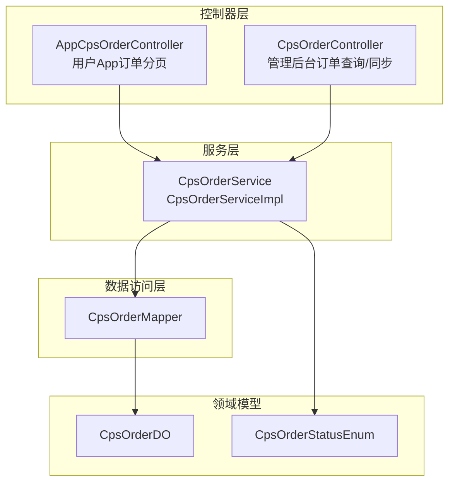
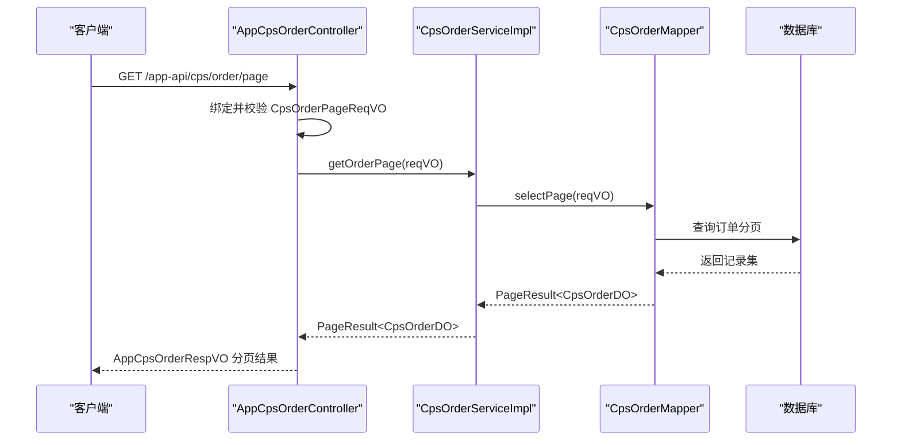
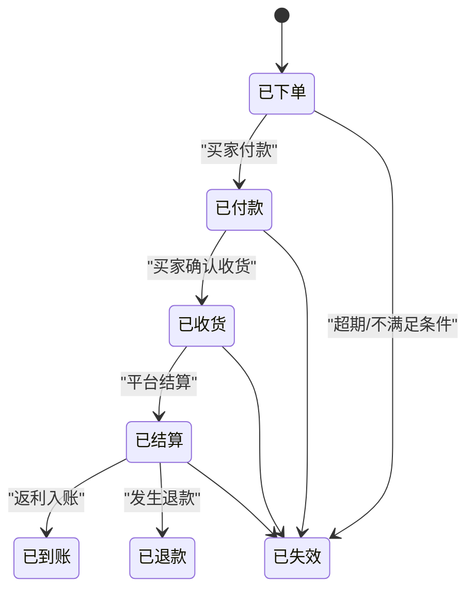
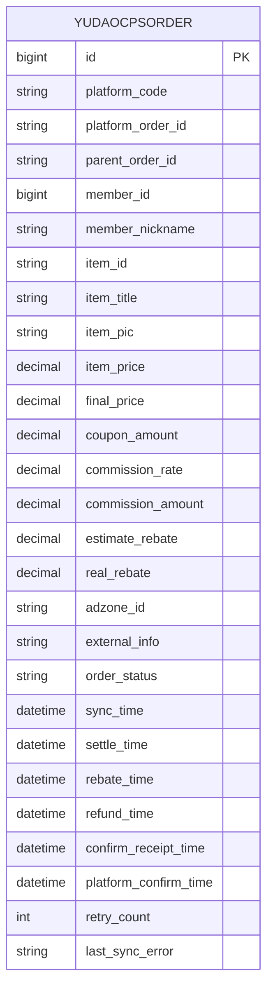
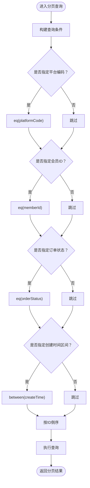
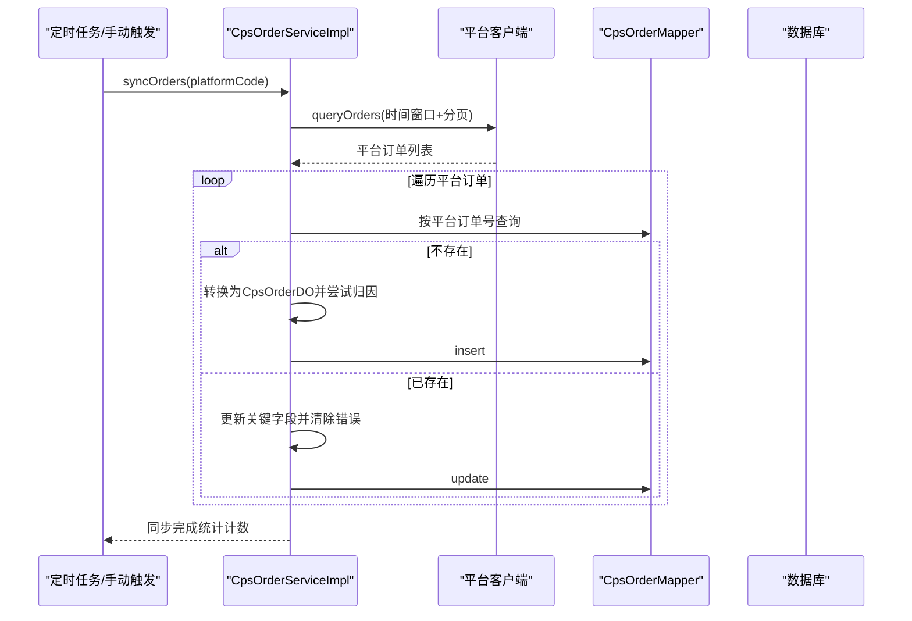
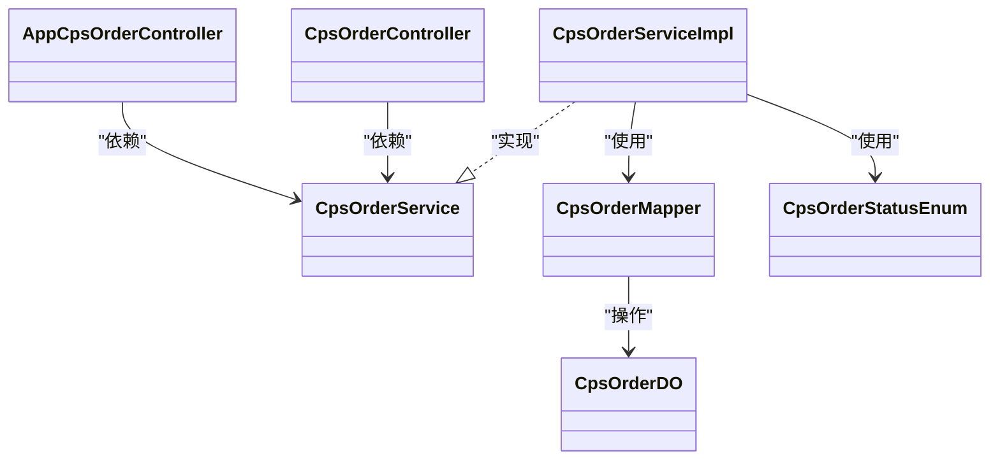

# 订单管理接口

<cite>
**本文引用的文件**
- [AppCpsOrderController.java](file://qiji-module-cps/qiji-module-cps-biz/src/main/java/cn/zhijian/cps/controller/app/AppCpsOrderController.java)
- [CpsOrderController.java](file://qiji-module-cps/qiji-module-cps-biz/src/main/java/cn/zhijian/cps/controller/admin/CpsOrderController.java)
- [CpsOrderService.java](file://qiji-module-cps/qiji-module-cps-biz/src/main/java/cn/zhijian/cps/service/CpsOrderService.java)
- [CpsOrderServiceImpl.java](file://qiji-module-cps/qiji-module-cps-biz/src/main/java/cn/zhijian/cps/service/CpsOrderServiceImpl.java)
- [CpsOrderPageReqVO.java](file://qiji-module-cps/qiji-module-cps-biz/src/main/java/cn/zhijian/cps/controller/admin/vo/order/CpsOrderPageReqVO.java)
- [CpsOrderMapper.java](file://qiji-module-cps/qiji-module-cps-biz/src/main/java/cn/zhijian/cps/dal/mysql/CpsOrderMapper.java)
- [CpsOrderDO.java](file://qiji-module-cps/qiji-module-cps-biz/src/main/java/cn/zhijian/cps/dal/dataobject/CpsOrderDO.java)
- [AppCpsOrderRespVO.java](file://qiji-module-cps/qiji-module-cps-biz/src/main/java/cn/zhijian/cps/controller/app/vo/AppCpsOrderRespVO.java)
- [CpsOrderStatusEnum.java](file://qiji-module-cps/qiji-module-cps-biz/src/main/java/cn/zhijian/cps/enums/CpsOrderStatusEnum.java)
</cite>

## 目录
1. [简介](#简介)
2. [项目结构](#项目结构)
3. [核心组件](#核心组件)
4. [架构概览](#架构概览)
5. [详细组件分析](#详细组件分析)
6. [依赖分析](#依赖分析)
7. [性能考虑](#性能考虑)
8. [故障排查指南](#故障排查指南)
9. [结论](#结论)
10. [附录](#附录)

## 简介
本文件为订单管理接口的详细API文档，聚焦于CPS订单的查询与管理能力，覆盖以下内容：
- 订单查询接口（GET /app-api/cps/order/page）的分页查询参数与筛选条件说明
- 订单状态枚举值与状态流转规则
- 订单详情查询与手动同步接口
- 订单数据来源、更新机制与一致性保障
- 订单号生成规则、平台订单号映射与佣金计算逻辑
- 关键字段含义与完整请求/响应示例路径

## 项目结构
围绕CPS订单管理的核心模块位于 qiji-module-cps-biz 中，主要由控制器、服务层、数据访问层与领域模型构成。

图表来源
- [AppCpsOrderController.java:1-41](file://qiji-module-cps/qiji-module-cps-biz/src/main/java/cn/zhijian/cps/controller/app/AppCpsOrderController.java#L1-L41)
- [CpsOrderController.java:1-57](file://qiji-module-cps/qiji-module-cps-biz/src/main/java/cn/zhijian/cps/controller/admin/CpsOrderController.java#L1-L57)
- [CpsOrderService.java:1-22](file://qiji-module-cps/qiji-module-cps-biz/src/main/java/cn/zhijian/cps/service/CpsOrderService.java#L1-L22)
- [CpsOrderServiceImpl.java:1-235](file://qiji-module-cps/qiji-module-cps-biz/src/main/java/cn/zhijian/cps/service/CpsOrderServiceImpl.java#L1-L235)
- [CpsOrderMapper.java:1-48](file://qiji-module-cps/qiji-module-cps-biz/src/main/java/cn/zhijian/cps/dal/mysql/CpsOrderMapper.java#L1-L48)
- [CpsOrderDO.java:1-80](file://qiji-module-cps/qiji-module-cps-biz/src/main/java/cn/zhijian/cps/dal/dataobject/CpsOrderDO.java#L1-L80)
- [CpsOrderStatusEnum.java:1-31](file://qiji-module-cps/qiji-module-cps-biz/src/main/java/cn/zhijian/cps/enums/CpsOrderStatusEnum.java#L1-L31)

章节来源
- [AppCpsOrderController.java:1-41](file://qiji-module-cps/qiji-module-cps-biz/src/main/java/cn/zhijian/cps/controller/app/AppCpsOrderController.java#L1-L41)
- [CpsOrderController.java:1-57](file://qiji-module-cps/qiji-module-cps-biz/src/main/java/cn/zhijian/cps/controller/admin/CpsOrderController.java#L1-L57)
- [CpsOrderService.java:1-22](file://qiji-module-cps/qiji-module-cps-biz/src/main/java/cn/zhijian/cps/service/CpsOrderService.java#L1-L22)
- [CpsOrderServiceImpl.java:1-235](file://qiji-module-cps/qiji-module-cps-biz/src/main/java/cn/zhijian/cps/service/CpsOrderServiceImpl.java#L1-L235)
- [CpsOrderMapper.java:1-48](file://qiji-module-cps/qiji-module-cps-biz/src/main/java/cn/zhijian/cps/dal/mysql/CpsOrderMapper.java#L1-L48)
- [CpsOrderDO.java:1-80](file://qiji-module-cps/qiji-module-cps-biz/src/main/java/cn/zhijian/cps/dal/dataobject/CpsOrderDO.java#L1-L80)
- [CpsOrderStatusEnum.java:1-31](file://qiji-module-cps/qiji-module-cps-biz/src/main/java/cn/zhijian/cps/enums/CpsOrderStatusEnum.java#L1-L31)

## 核心组件
- 用户App订单分页查询接口：GET /app-api/cps/order/page
- 管理后台订单详情与分页查询接口：GET /admin-api/cps/order/get、GET /admin-api/cps/order/page
- 手动同步接口：POST /admin-api/cps/order/sync
- 订单状态枚举：CpsOrderStatusEnum
- 订单数据对象：CpsOrderDO
- 订单查询参数：CpsOrderPageReqVO
- 订单持久层：CpsOrderMapper

章节来源
- [AppCpsOrderController.java:31-38](file://qiji-module-cps/qiji-module-cps-biz/src/main/java/cn/zhijian/cps/controller/app/AppCpsOrderController.java#L31-L38)
- [CpsOrderController.java:30-54](file://qiji-module-cps/qiji-module-cps-biz/src/main/java/cn/zhijian/cps/controller/admin/CpsOrderController.java#L30-L54)
- [CpsOrderService.java:10-22](file://qiji-module-cps/qiji-module-cps-biz/src/main/java/cn/zhijian/cps/service/CpsOrderService.java#L10-L22)
- [CpsOrderStatusEnum.java:11-19](file://qiji-module-cps/qiji-module-cps-biz/src/main/java/cn/zhijian/cps/enums/CpsOrderStatusEnum.java#L11-L19)
- [CpsOrderDO.java:22-78](file://qiji-module-cps/qiji-module-cps-biz/src/main/java/cn/zhijian/cps/dal/dataobject/CpsOrderDO.java#L22-L78)
- [CpsOrderPageReqVO.java:18-33](file://qiji-module-cps/qiji-module-cps-biz/src/main/java/cn/zhijian/cps/controller/admin/vo/order/CpsOrderPageReqVO.java#L18-L33)
- [CpsOrderMapper.java:16-23](file://qiji-module-cps/qiji-module-cps-biz/src/main/java/cn/zhijian/cps/dal/mysql/CpsOrderMapper.java#L16-L23)

## 架构概览
下图展示从App端到服务层再到数据库的调用链路与职责分工。

图表来源
- [AppCpsOrderController.java:31-38](file://qiji-module-cps/qiji-module-cps-biz/src/main/java/cn/zhijian/cps/controller/app/AppCpsOrderController.java#L31-L38)
- [CpsOrderServiceImpl.java:53-56](file://qiji-module-cps/qiji-module-cps-biz/src/main/java/cn/zhijian/cps/service/CpsOrderServiceImpl.java#L53-L56)
- [CpsOrderMapper.java:16-23](file://qiji-module-cps/qiji-module-cps-biz/src/main/java/cn/zhijian/cps/dal/mysql/CpsOrderMapper.java#L16-L23)

## 详细组件分析

### 订单查询接口（App端）
- 接口地址：GET /app-api/cps/order/page
- 功能：获取当前登录用户的CPS订单分页列表
- 请求参数：继承自分页基类 PageParam，并结合 CpsOrderPageReqVO 的筛选字段
  - 平台编码 platformCode（可选）
  - 订单状态 orderStatus（可选）
  - 创建时间区间 createTime（可选，数组格式：开始时间,结束时间）
  - 会员ID memberId（在App端自动绑定当前登录用户）
- 响应：分页结果，包含 AppCpsOrderRespVO 列表

请求示例（路径）
- [请求参数绑定与校验:31-38](file://qiji-module-cps/qiji-module-cps-biz/src/main/java/cn/zhijian/cps/controller/app/AppCpsOrderController.java#L31-L38)
- [分页参数定义:18-33](file://qiji-module-cps/qiji-module-cps-biz/src/main/java/cn/zhijian/cps/controller/admin/vo/order/CpsOrderPageReqVO.java#L18-L33)

响应示例（路径）
- [App端响应体定义:11-40](file://qiji-module-cps/qiji-module-cps-biz/src/main/java/cn/zhijian/cps/controller/app/vo/AppCpsOrderRespVO.java#L11-L40)

章节来源
- [AppCpsOrderController.java:31-38](file://qiji-module-cps/qiji-module-cps-biz/src/main/java/cn/zhijian/cps/controller/app/AppCpsOrderController.java#L31-L38)
- [CpsOrderPageReqVO.java:18-33](file://qiji-module-cps/qiji-module-cps-biz/src/main/java/cn/zhijian/cps/controller/admin/vo/order/CpsOrderPageReqVO.java#L18-L33)
- [AppCpsOrderRespVO.java:11-40](file://qiji-module-cps/qiji-module-cps-biz/src/main/java/cn/zhijian/cps/controller/app/vo/AppCpsOrderRespVO.java#L11-L40)

### 订单详情查询（管理后台）
- 接口地址：GET /admin-api/cps/order/get
- 请求参数：
  - id：订单编号（必填）
- 响应：CpsOrderRespVO（与 CpsOrderDO 字段映射）

请求示例（路径）
- [详情查询实现:30-37](file://qiji-module-cps/qiji-module-cps-biz/src/main/java/cn/zhijian/cps/controller/admin/CpsOrderController.java#L30-L37)

章节来源
- [CpsOrderController.java:30-37](file://qiji-module-cps/qiji-module-cps-biz/src/main/java/cn/zhijian/cps/controller/admin/CpsOrderController.java#L30-L37)

### 订单分页查询（管理后台）
- 接口地址：GET /admin-api/cps/order/page
- 请求参数：CpsOrderPageReqVO（含平台编码、会员ID、订单状态、创建时间区间）
- 响应：分页结果，包含 CpsOrderRespVO 列表

请求示例（路径）
- [分页查询实现:39-45](file://qiji-module-cps/qiji-module-cps-biz/src/main/java/cn/zhijian/cps/controller/admin/CpsOrderController.java#L39-L45)
- [分页查询参数定义:18-33](file://qiji-module-cps/qiji-module-cps-biz/src/main/java/cn/zhijian/cps/controller/admin/vo/order/CpsOrderPageReqVO.java#L18-L33)

章节来源
- [CpsOrderController.java:39-45](file://qiji-module-cps/qiji-module-cps-biz/src/main/java/cn/zhijian/cps/controller/admin/CpsOrderController.java#L39-L45)
- [CpsOrderPageReqVO.java:18-33](file://qiji-module-cps/qiji-module-cps-biz/src/main/java/cn/zhijian/cps/controller/admin/vo/order/CpsOrderPageReqVO.java#L18-L33)

### 手动同步订单
- 接口地址：POST /admin-api/cps/order/sync
- 请求参数：
  - platformCode：平台编码（必填）
- 响应：布尔值（成功/失败），内部触发同步流程

请求示例（路径）
- [手动同步实现:47-54](file://qiji-module-cps/qiji-module-cps-biz/src/main/java/cn/zhijian/cps/controller/admin/CpsOrderController.java#L47-L54)

章节来源
- [CpsOrderController.java:47-54](file://qiji-module-cps/qiji-module-cps-biz/src/main/java/cn/zhijian/cps/controller/admin/CpsOrderController.java#L47-L54)

### 订单状态枚举与状态流转
- 订单状态枚举（status -> name）：
  - created：已下单
  - paid：已付款
  - received：已收货
  - settled：已结算
  - rebate_received：已到账
  - refunded：已退款
  - invalid：已失效
- 状态流转规则（基于业务语义与字段含义推导）：
  - 订单创建后进入“已下单”（created）
  - 买家付款后进入“已付款”（paid）
  - 买家确认收货后进入“已收货”（received）
  - 平台结算完成后进入“已结算”（settled）
  - 返利入账后进入“已到账”（rebate_received）
  - 发生退款时进入“已退款”（refunded）
  - 当订单不再满足结算条件或超期失效时进入“已失效”（invalid）

状态流转示意（概念性）

图表来源
- [CpsOrderStatusEnum.java:11-19](file://qiji-module-cps/qiji-module-cps-biz/src/main/java/cn/zhijian/cps/enums/CpsOrderStatusEnum.java#L11-L19)

章节来源
- [CpsOrderStatusEnum.java:11-19](file://qiji-module-cps/qiji-module-cps-biz/src/main/java/cn/zhijian/cps/enums/CpsOrderStatusEnum.java#L11-L19)

### 订单数据模型与关键字段
- 订单主表：qiji_cps_order（对应 CpsOrderDO）
- 关键字段说明（节选）：
  - 平台编码 platformCode
  - 平台订单号 platformOrderId
  - 父订单号 parentOrderId
  - 会员ID memberId（归因后）
  - 商品信息：itemId、itemTitle、itemPic
  - 价格与金额：itemPrice、finalPrice、couponAmount、commissionRate、commissionAmount、estimateRebate、realRebate
  - 时间字段：createTime、syncTime、settleTime、rebateTime、refundTime、confirmReceiptTime、platformConfirmTime
  - 状态与重试：orderStatus、retryCount、lastSyncError

图表来源
- [CpsOrderDO.java:22-78](file://qiji-module-cps/qiji-module-cps-biz/src/main/java/cn/zhijian/cps/dal/dataobject/CpsOrderDO.java#L22-L78)

章节来源
- [CpsOrderDO.java:22-78](file://qiji-module-cps/qiji-module-cps-biz/src/main/java/cn/zhijian/cps/dal/dataobject/CpsOrderDO.java#L22-L78)

### 订单查询参数与筛选条件
- 平台编码 platformCode：按平台过滤
- 会员ID memberId：按用户过滤（App端自动注入当前登录用户）
- 订单状态 orderStatus：按状态过滤
- 创建时间 createTime：支持区间查询（开始时间,结束时间）

图表来源
- [CpsOrderMapper.java:16-23](file://qiji-module-cps/qiji-module-cps-biz/src/main/java/cn/zhijian/cps/dal/mysql/CpsOrderMapper.java#L16-L23)
- [CpsOrderPageReqVO.java:18-33](file://qiji-module-cps/qiji-module-cps-biz/src/main/java/cn/zhijian/cps/controller/admin/vo/order/CpsOrderPageReqVO.java#L18-L33)

章节来源
- [CpsOrderMapper.java:16-23](file://qiji-module-cps/qiji-module-cps-biz/src/main/java/cn/zhijian/cps/dal/mysql/CpsOrderMapper.java#L16-L23)
- [CpsOrderPageReqVO.java:18-33](file://qiji-module-cps/qiji-module-cps-biz/src/main/java/cn/zhijian/cps/controller/admin/vo/order/CpsOrderPageReqVO.java#L18-L33)

### 订单数据来源、更新机制与一致性
- 数据来源：对接各CPS平台（如淘宝、拼多多、京东、抖音等），通过平台客户端拉取增量订单
- 更新机制：
  - 定时/手动同步：根据配置的时间窗口与分页策略从平台拉取订单
  - 增量更新：以平台订单号为唯一键，若不存在则新增，存在则更新关键字段
  - 归因处理：对新订单尝试归属到会员；若未归属，仍入库但保持未归属状态
  - 单笔状态同步：按平台订单号单独拉取最新状态并更新
- 一致性保障：
  - 使用事务包裹批量插入/更新
  - 采用幂等键（平台订单号）避免重复
  - 记录同步时间与重试次数，便于后续补偿

图表来源
- [CpsOrderServiceImpl.java:58-147](file://qiji-module-cps/qiji-module-cps-biz/src/main/java/cn/zhijian/cps/service/CpsOrderServiceImpl.java#L58-L147)
- [CpsOrderMapper.java:25-27](file://qiji-module-cps/qiji-module-cps-biz/src/main/java/cn/zhijian/cps/dal/mysql/CpsOrderMapper.java#L25-L27)

章节来源
- [CpsOrderServiceImpl.java:58-147](file://qiji-module-cps/qiji-module-cps-biz/src/main/java/cn/zhijian/cps/service/CpsOrderServiceImpl.java#L58-L147)
- [CpsOrderMapper.java:25-27](file://qiji-module-cps/qiji-module-cps-biz/src/main/java/cn/zhijian/cps/dal/mysql/CpsOrderMapper.java#L25-L27)

### 订单号生成规则与平台订单号映射
- 平台订单号：由各CPS平台下发，作为唯一标识
- 本地订单号：系统自增主键（Long id）
- 映射关系：以平台订单号为幂等键，确保同一平台订单仅存一条本地记录
- 父子订单：parentOrderId 支持父子订单关联（如大促场景下的子订单）

章节来源
- [CpsOrderDO.java:24-31](file://qiji-module-cps/qiji-module-cps-biz/src/main/java/cn/zhijian/cps/dal/dataobject/CpsOrderDO.java#L24-L31)
- [CpsOrderMapper.java:25-27](file://qiji-module-cps/qiji-module-cps-biz/src/main/java/cn/zhijian/cps/dal/mysql/CpsOrderMapper.java#L25-L27)

### 佣金计算逻辑
- 佣金比例（commissionRate）：以万分比存储（例如 200 表示 2%）
- 预估佣金（commissionAmount）：平台返回的预估佣金
- 预估返利（estimateRebate）：初始化为 commissionAmount
- 实际返利（realRebate）：最终入账后的返利金额
- 金额单位：统一为数据库中的 decimal 类型，具体精度以数据库定义为准

章节来源
- [CpsOrderDO.java:48-55](file://qiji-module-cps/qiji-module-cps-biz/src/main/java/cn/zhijian/cps/dal/dataobject/CpsOrderDO.java#L48-L55)
- [CpsOrderServiceImpl.java:152-174](file://qiji-module-cps/qiji-module-cps-biz/src/main/java/cn/zhijian/cps/service/CpsOrderServiceImpl.java#L152-L174)

## 依赖分析
- 控制器依赖服务接口，服务实现依赖Mapper与平台客户端工厂
- Mapper负责条件组装与排序，DO承载所有字段
- 状态枚举用于状态常量定义与对外展示

图表来源
- [AppCpsOrderController.java:26-29](file://qiji-module-cps/qiji-module-cps-biz/src/main/java/cn/zhijian/cps/controller/app/AppCpsOrderController.java#L26-L29)
- [CpsOrderController.java:27-28](file://qiji-module-cps/qiji-module-cps-biz/src/main/java/cn/zhijian/cps/controller/admin/CpsOrderController.java#L27-L28)
- [CpsOrderService.java:10-22](file://qiji-module-cps/qiji-module-cps-biz/src/main/java/cn/zhijian/cps/service/CpsOrderService.java#L10-L22)
- [CpsOrderServiceImpl.java:29](file://qiji-module-cps/qiji-module-cps-biz/src/main/java/cn/zhijian/cps/service/CpsOrderServiceImpl.java#L29)
- [CpsOrderMapper.java:14](file://qiji-module-cps/qiji-module-cps-biz/src/main/java/cn/zhijian/cps/dal/mysql/CpsOrderMapper.java#L14)
- [CpsOrderDO.java:22](file://qiji-module-cps/qiji-module-cps-biz/src/main/java/cn/zhijian/cps/dal/dataobject/CpsOrderDO.java#L22)
- [CpsOrderStatusEnum.java:11](file://qiji-module-cps/qiji-module-cps-biz/src/main/java/cn/zhijian/cps/enums/CpsOrderStatusEnum.java#L11)

章节来源
- [AppCpsOrderController.java:26-29](file://qiji-module-cps/qiji-module-cps-biz/src/main/java/cn/zhijian/cps/controller/app/AppCpsOrderController.java#L26-L29)
- [CpsOrderController.java:27-28](file://qiji-module-cps/qiji-module-cps-biz/src/main/java/cn/zhijian/cps/controller/admin/CpsOrderController.java#L27-L28)
- [CpsOrderService.java:10-22](file://qiji-module-cps/qiji-module-cps-biz/src/main/java/cn/zhijian/cps/service/CpsOrderService.java#L10-L22)
- [CpsOrderServiceImpl.java:29](file://qiji-module-cps/qiji-module-cps-biz/src/main/java/cn/zhijian/cps/service/CpsOrderServiceImpl.java#L29)
- [CpsOrderMapper.java:14](file://qiji-module-cps/qiji-module-cps-biz/src/main/java/cn/zhijian/cps/dal/mysql/CpsOrderMapper.java#L14)
- [CpsOrderDO.java:22](file://qiji-module-cps/qiji-module-cps-biz/src/main/java/cn/zhijian/cps/dal/dataobject/CpsOrderDO.java#L22)
- [CpsOrderStatusEnum.java:11](file://qiji-module-cps/qiji-module-cps-biz/src/main/java/cn/zhijian/cps/enums/CpsOrderStatusEnum.java#L11)

## 性能考虑
- 分页查询：默认按ID倒序，建议在高频查询场景下对常用过滤字段建立索引（如 platformCode、memberId、orderStatus、createTime）
- 同步策略：按配置的最大分页大小与时间窗口分批拉取，避免一次性请求过多导致平台限流或内存压力
- 幂等与去重：以平台订单号为主键，减少重复写入带来的IO与锁竞争
- 事务边界：批量更新在单事务中提交，异常时回滚，确保一致性与可恢复性

## 故障排查指南
- 同步失败：检查平台客户端配置、网络连通性与限流策略；查看日志中“订单同步失败”的异常堆栈
- 订单未归因：确认推广位与外部追踪参数是否正确；检查归因服务是否正常
- 状态不同步：使用单笔状态同步接口，核对平台订单号是否正确
- 查询无结果：确认筛选条件（平台编码、会员ID、状态、时间区间）是否合理

章节来源
- [CpsOrderServiceImpl.java:143-146](file://qiji-module-cps/qiji-module-cps-biz/src/main/java/cn/zhijian/cps/service/CpsOrderServiceImpl.java#L143-L146)
- [CpsOrderServiceImpl.java:228-232](file://qiji-module-cps/qiji-module-cps-biz/src/main/java/cn/zhijian/cps/service/CpsOrderServiceImpl.java#L228-L232)

## 结论
本文档系统梳理了CPS订单管理接口的查询、详情、同步与状态规则，明确了数据模型、筛选条件与更新机制。建议在生产环境中配合索引优化、限流与重试策略，确保高并发下的稳定性与一致性。

## 附录
- 请求与响应示例路径（不含代码片段）
  - App端分页请求参数绑定与返回映射：[AppCpsOrderController.java:31-38](file://qiji-module-cps/qiji-module-cps-biz/src/main/java/cn/zhijian/cps/controller/app/AppCpsOrderController.java#L31-L38)
  - App端响应体字段定义：[AppCpsOrderRespVO.java:11-40](file://qiji-module-cps/qiji-module-cps-biz/src/main/java/cn/zhijian/cps/controller/app/vo/AppCpsOrderRespVO.java#L11-L40)
  - 管理后台详情查询：[CpsOrderController.java:30-37](file://qiji-module-cps/qiji-module-cps-biz/src/main/java/cn/zhijian/cps/controller/admin/CpsOrderController.java#L30-L37)
  - 管理后台分页查询：[CpsOrderController.java:39-45](file://qiji-module-cps/qiji-module-cps-biz/src/main/java/cn/zhijian/cps/controller/admin/CpsOrderController.java#L39-L45)
  - 手动同步接口：[CpsOrderController.java:47-54](file://qiji-module-cps/qiji-module-cps-biz/src/main/java/cn/zhijian/cps/controller/admin/CpsOrderController.java#L47-L54)
  - 分页查询参数定义：[CpsOrderPageReqVO.java:18-33](file://qiji-module-cps/qiji-module-cps-biz/src/main/java/cn/zhijian/cps/controller/admin/vo/order/CpsOrderPageReqVO.java#L18-L33)
  - 订单数据模型字段：[CpsOrderDO.java:22-78](file://qiji-module-cps/qiji-module-cps-biz/src/main/java/cn/zhijian/cps/dal/dataobject/CpsOrderDO.java#L22-L78)
  - 订单状态枚举：[CpsOrderStatusEnum.java:11-19](file://qiji-module-cps/qiji-module-cps-biz/src/main/java/cn/zhijian/cps/enums/CpsOrderStatusEnum.java#L11-L19)