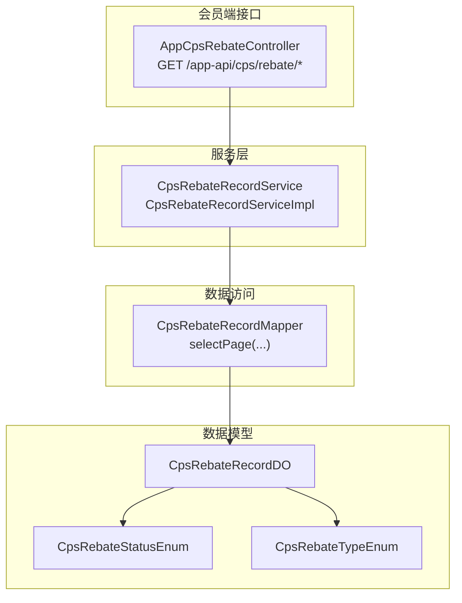
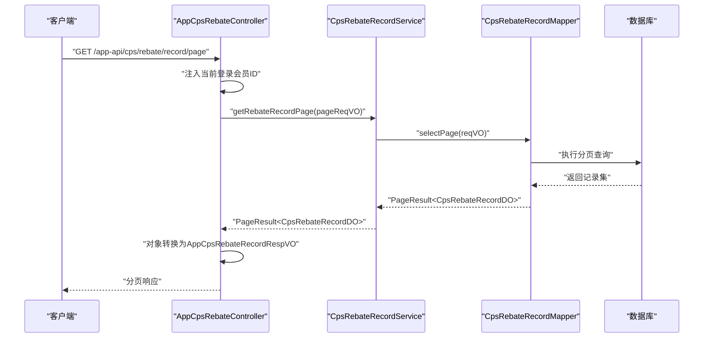
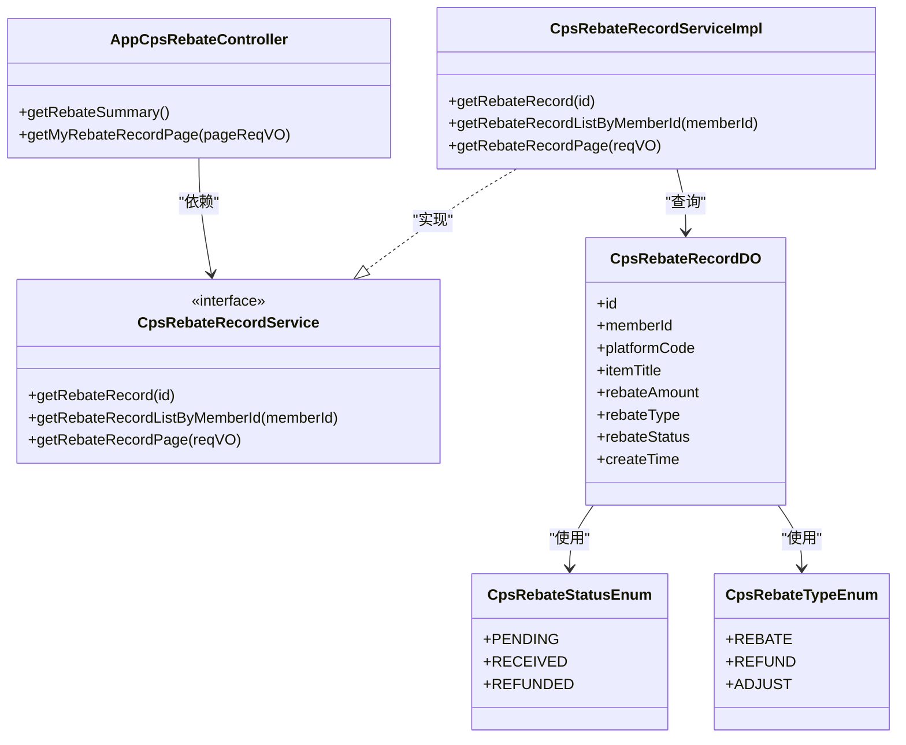

# 返利查询接口

<cite>
**本文档引用的文件**
- [AppCpsRebateController.java](file://qiji-module-cps/qiji-module-cps-biz/src/main/java/cn/zhijian/cps/controller/app/AppCpsRebateController.java)
- [CpsRebateRecordPageReqVO.java](file://qiji-module-cps/qiji-module-cps-biz/src/main/java/cn/zhijian/cps/controller/admin/vo/rebaterecord/CpsRebateRecordPageReqVO.java)
- [AppCpsRebateRecordRespVO.java](file://qiji-module-cps/qiji-module-cps-biz/src/main/java/cn/zhijian/cps/controller/app/vo/AppCpsRebateRecordRespVO.java)
- [AppCpsRebateSummaryRespVO.java](file://qiji-module-cps/qiji-module-cps-biz/src/main/java/cn/zhijian/cps/controller/app/vo/AppCpsRebateSummaryRespVO.java)
- [CpsRebateRecordDO.java](file://qiji-module-cps/qiji-module-cps-biz/src/main/java/cn/zhijian/cps/dal/dataobject/CpsRebateRecordDO.java)
- [CpsRebateStatusEnum.java](file://qiji-module-cps/qiji-module-cps-biz/src/main/java/cn/zhijian/cps/enums/CpsRebateStatusEnum.java)
- [CpsRebateTypeEnum.java](file://qiji-module-cps/qiji-module-cps-biz/src/main/java/cn/zhijian/cps/enums/CpsRebateTypeEnum.java)
- [CpsCommissionCalcServiceImpl.java](file://qiji-module-cps/qiji-module-cps-biz/src/main/java/cn/zhijian/cps/service/commission/CpsCommissionCalcServiceImpl.java)
- [CPS系统PRD文档.md](file://docs/CPS系统PRD文档.md)
- [README.md](file://README.md)
</cite>

## 目录
1. [简介](#简介)
2. [项目结构](#项目结构)
3. [核心组件](#核心组件)
4. [架构总览](#架构总览)
5. [详细组件分析](#详细组件分析)
6. [依赖关系分析](#依赖关系分析)
7. [性能考量](#性能考量)
8. [故障排查指南](#故障排查指南)
9. [结论](#结论)
10. [附录](#附录)

## 简介
本文件面向“返利查询接口”的使用者与维护者，系统化说明会员端返利查询能力，包括：
- 返利明细分页查询接口（GET /app-api/cps/rebate/record/page）的查询参数、分页与筛选逻辑
- 返利状态枚举与状态判断逻辑
- 返利计算规则、结算周期与到账时间等业务概念
- 返利统计接口（GET /app-api/cps/rebate/summary）的指标说明与使用方法
- 返利数据来源、更新频率与异常处理机制
- 字段含义与用途说明，并提供请求/响应示例路径

## 项目结构
围绕返利查询的相关模块与文件组织如下：
- 控制层：会员端控制器负责接收请求、鉴权与调用服务层
- 服务层：封装返利记录的查询与统计逻辑
- 数据对象：定义返利记录与统计的数据模型
- 枚举：定义返利类型与状态的取值
- PRD：提供返利计算规则、到账时间与风控等业务背景

图表来源
- [AppCpsRebateController.java:30-74](file://qiji-module-cps/qiji-module-cps-biz/src/main/java/cn/zhijian/cps/controller/app/AppCpsRebateController.java#L30-L74)
- [CpsRebateRecordServiceImpl.java:16-38](file://qiji-module-cps/qiji-module-cps-biz/src/main/java/cn/zhijian/cps/service/CpsRebateRecordServiceImpl.java#L16-L38)
- [CpsRebateRecordDO.java:14-55](file://qiji-module-cps/qiji-module-cps-biz/src/main/java/cn/zhijian/cps/dal/dataobject/CpsRebateRecordDO.java#L14-L55)
- [CpsRebateStatusEnum.java:11-20](file://qiji-module-cps/qiji-module-cps-biz/src/main/java/cn/zhijian/cps/enums/CpsRebateStatusEnum.java#L11-L20)
- [CpsRebateTypeEnum.java:11-20](file://qiji-module-cps/qiji-module-cps-biz/src/main/java/cn/zhijian/cps/enums/CpsRebateTypeEnum.java#L11-L20)

章节来源
- [AppCpsRebateController.java:1-74](file://qiji-module-cps/qiji-module-cps-biz/src/main/java/cn/zhijian/cps/controller/app/AppCpsRebateController.java#L1-L74)
- [CpsRebateRecordServiceImpl.java:1-38](file://qiji-module-cps/qiji-module-cps-biz/src/main/java/cn/zhijian/cps/service/CpsRebateRecordServiceImpl.java#L1-L38)

## 核心组件
- 会员端返利控制器：提供返利汇总与返利明细分页查询接口
- 分页请求参数对象：定义查询条件（会员ID、平台编码、返利类型、返利状态、创建时间范围）
- 返利记录响应对象：定义明细字段（平台编码、商品标题、返利金额、类型、状态、创建时间）
- 返利汇总响应对象：定义累计返利、待结算、已到账、已提现、可提现等指标
- 数据对象与枚举：定义返利记录的数据库模型及状态/类型枚举

章节来源
- [AppCpsRebateController.java:35-72](file://qiji-module-cps/qiji-module-cps-biz/src/main/java/cn/zhijian/cps/controller/app/AppCpsRebateController.java#L35-L72)
- [CpsRebateRecordPageReqVO.java:18-36](file://qiji-module-cps/qiji-module-cps-biz/src/main/java/cn/zhijian/cps/controller/admin/vo/rebaterecord/CpsRebateRecordPageReqVO.java#L18-L36)
- [AppCpsRebateRecordRespVO.java:11-34](file://qiji-module-cps/qiji-module-cps-biz/src/main/java/cn/zhijian/cps/controller/app/vo/AppCpsRebateRecordRespVO.java#L11-L34)
- [AppCpsRebateSummaryRespVO.java:10-27](file://qiji-module-cps/qiji-module-cps-biz/src/main/java/cn/zhijian/cps/controller/app/vo/AppCpsRebateSummaryRespVO.java#L10-L27)
- [CpsRebateRecordDO.java:21-55](file://qiji-module-cps/qiji-module-cps-biz/src/main/java/cn/zhijian/cps/dal/dataobject/CpsRebateRecordDO.java#L21-L55)
- [CpsRebateStatusEnum.java:11-20](file://qiji-module-cps/qiji-module-cps-biz/src/main/java/cn/zhijian/cps/enums/CpsRebateStatusEnum.java#L11-L20)
- [CpsRebateTypeEnum.java:11-20](file://qiji-module-cps/qiji-module-cps-biz/src/main/java/cn/zhijian/cps/enums/CpsRebateTypeEnum.java#L11-L20)

## 架构总览
会员端返利查询的典型调用链路如下：

图表来源
- [AppCpsRebateController.java:65-72](file://qiji-module-cps/qiji-module-cps-biz/src/main/java/cn/zhijian/cps/controller/app/AppCpsRebateController.java#L65-L72)
- [CpsRebateRecordServiceImpl.java:33-36](file://qiji-module-cps/qiji-module-cps-biz/src/main/java/cn/zhijian/cps/service/CpsRebateRecordServiceImpl.java#L33-L36)

## 详细组件分析

### 接口：返利明细分页查询（GET /app-api/cps/rebate/record/page）
- 功能：按条件分页查询当前登录会员的返利明细
- 鉴权：基于登录态注入会员ID，确保仅查询本人数据
- 查询参数（均来自请求参数对象）：
  - 会员ID：Long（由控制器注入当前登录用户ID）
  - 平台编码：String（如 taobao、jd、pdd）
  - 返利类型：String（rebate/refund/adjust）
  - 返利状态：String（pending/received/refunded）
  - 创建时间范围：LocalDateTime[]（开始、结束）
- 分页参数：继承通用分页参数（页码、每页大小），由框架解析
- 响应：PageResult<AppCpsRebateRecordRespVO>

字段说明（明细响应对象）：
- 记录ID：Long
- 平台编码：String
- 商品标题：String
- 返利金额：BigDecimal
- 返利类型：String
- 返利状态：String
- 创建时间：LocalDateTime

章节来源
- [AppCpsRebateController.java:65-72](file://qiji-module-cps/qiji-module-cps-biz/src/main/java/cn/zhijian/cps/controller/app/AppCpsRebateController.java#L65-L72)
- [CpsRebateRecordPageReqVO.java:18-36](file://qiji-module-cps/qiji-module-cps-biz/src/main/java/cn/zhijian/cps/controller/admin/vo/rebaterecord/CpsRebateRecordPageReqVO.java#L18-L36)
- [AppCpsRebateRecordRespVO.java:11-34](file://qiji-module-cps/qiji-module-cps-biz/src/main/java/cn/zhijian/cps/controller/app/vo/AppCpsRebateRecordRespVO.java#L11-L34)

### 接口：返利汇总（GET /app-api/cps/rebate/summary）
- 功能：统计当前登录会员的累计返利、待结算、已到账、已提现、可提现等指标
- 计算逻辑：
  - 累计返利 = 所有返利记录返利金额之和
  - 待结算 = 状态为“待结算”的返利金额之和
  - 已到账 = 状态为“已到账”的返利金额之和
  - 已提现 = 状态为“已扣回”（提现成功）的返利金额之和
  - 可提现 = 已到账 − 已提现
- 响应：AppCpsRebateSummaryRespVO

章节来源
- [AppCpsRebateController.java:35-63](file://qiji-module-cps/qiji-module-cps-biz/src/main/java/cn/zhijian/cps/controller/app/AppCpsRebateController.java#L35-L63)
- [AppCpsRebateSummaryRespVO.java:10-27](file://qiji-module-cps/qiji-module-cps-biz/src/main/java/cn/zhijian/cps/controller/app/vo/AppCpsRebateSummaryRespVO.java#L10-L27)

### 返利状态与类型枚举
- 状态枚举（status → name）：
  - pending → 待结算
  - received → 已到账
  - refunded → 已扣回
- 类型枚举（type → name）：
  - rebate → 返利入账
  - refund → 返利扣回
  - adjust → 系统调整

章节来源
- [CpsRebateStatusEnum.java:11-20](file://qiji-module-cps/qiji-module-cps-biz/src/main/java/cn/zhijian/cps/enums/CpsRebateStatusEnum.java#L11-L20)
- [CpsRebateTypeEnum.java:11-20](file://qiji-module-cps/qiji-module-cps-biz/src/main/java/cn/zhijian/cps/enums/CpsRebateTypeEnum.java#L11-L20)
- [CpsRebateRecordDO.java:45-48](file://qiji-module-cps/qiji-module-cps-biz/src/main/java/cn/zhijian/cps/dal/dataobject/CpsRebateRecordDO.java#L45-L48)

### 返利计算规则与到账时间
- 返利计算规则（参考PRD）：
  - 佣金 = 实付金额 × 佣金比例
  - 平台服务费 = 佣金 × 平台费率
  - 可分配佣金 = 佣金 − 平台服务费
  - 返利 = 可分配佣金 × 返利比例（受最大/最小返利限制）
- 返利到账时间（参考PRD）：
  - 下单到追踪：5~30分钟（系统定时同步）
  - 追踪到结算：平台决定（淘宝日结、京东月结、拼多多约15工作日）
  - 结算到入账：0~24小时（系统配置的入账延迟）
  - 入账到可提现：立即（入账即可提现）

章节来源
- [CPS系统PRD文档.md:760-800](file://docs/CPS系统PRD文档.md#L760-L800)
- [CpsCommissionCalcServiceImpl.java:126-167](file://qiji-module-cps/qiji-module-cps-biz/src/main/java/cn/zhijian/cps/service/commission/CpsCommissionCalcServiceImpl.java#L126-L167)

### 返利数据来源与更新频率
- 数据来源：平台订单同步后生成的返利记录
- 更新频率：订单同步周期（PRD中描述为“5分钟内同步新订单”）
- 异常处理：当返利计算异常时，采用兜底策略（使用平台佣金作为返利），并记录日志

章节来源
- [CPS系统PRD文档.md:1002-1003](file://docs/CPS系统PRD文档.md#L1002-L1003)
- [CpsCommissionCalcServiceImpl.java:64-79](file://qiji-module-cps/qiji-module-cps-biz/src/main/java/cn/zhijian/cps/service/commission/CpsCommissionCalcServiceImpl.java#L64-L79)

### 请求与响应示例（示例路径）
- 返利明细分页查询
  - 请求示例路径：[示例请求](file://README.md#L247)
  - 响应示例路径：[示例响应:11-34](file://qiji-module-cps/qiji-module-cps-biz/src/main/java/cn/zhijian/cps/controller/app/vo/AppCpsRebateRecordRespVO.java#L11-L34)
- 返利汇总
  - 请求示例路径：[示例请求](file://README.md#L246)
  - 响应示例路径：[示例响应:10-27](file://qiji-module-cps/qiji-module-cps-biz/src/main/java/cn/zhijian/cps/controller/app/vo/AppCpsRebateSummaryRespVO.java#L10-L27)

章节来源
- [README.md:246-247](file://README.md#L246-L247)
- [AppCpsRebateRecordRespVO.java:11-34](file://qiji-module-cps/qiji-module-cps-biz/src/main/java/cn/zhijian/cps/controller/app/vo/AppCpsRebateRecordRespVO.java#L11-L34)
- [AppCpsRebateSummaryRespVO.java:10-27](file://qiji-module-cps/qiji-module-cps-biz/src/main/java/cn/zhijian/cps/controller/app/vo/AppCpsRebateSummaryRespVO.java#L10-L27)

## 依赖关系分析
- 控制器依赖服务层接口，服务层依赖数据访问层，数据访问层依赖数据库
- 返利记录DO同时引用状态与类型枚举，保证状态/类型的取值一致性
- 返利汇总统计依赖服务层提供的记录集合，进行聚合计算

图表来源
- [AppCpsRebateController.java:30-74](file://qiji-module-cps/qiji-module-cps-biz/src/main/java/cn/zhijian/cps/controller/app/AppCpsRebateController.java#L30-L74)
- [CpsRebateRecordServiceImpl.java:16-38](file://qiji-module-cps/qiji-module-cps-biz/src/main/java/cn/zhijian/cps/service/CpsRebateRecordServiceImpl.java#L16-L38)
- [CpsRebateRecordDO.java:21-55](file://qiji-module-cps/qiji-module-cps-biz/src/main/java/cn/zhijian/cps/dal/dataobject/CpsRebateRecordDO.java#L21-L55)
- [CpsRebateStatusEnum.java:11-20](file://qiji-module-cps/qiji-module-cps-biz/src/main/java/cn/zhijian/cps/enums/CpsRebateStatusEnum.java#L11-L20)
- [CpsRebateTypeEnum.java:11-20](file://qiji-module-cps/qiji-module-cps-biz/src/main/java/cn/zhijian/cps/enums/CpsRebateTypeEnum.java#L11-L20)

## 性能考量
- 分页查询：建议合理设置每页大小，避免一次性返回过多数据
- 时间范围筛选：在高频查询场景下，尽量缩小时间范围以减少扫描
- 状态与类型筛选：利用状态/类型过滤减少无效数据传输
- 计算复杂度：汇总统计为O(n)，n为记录条数，建议在数据库侧做必要的索引优化（如按会员ID、状态、创建时间建立索引）

## 故障排查指南
- 返利计算异常
  - 现象：某笔订单返利金额异常或为零
  - 处理：系统会记录异常日志并采用兜底策略（使用平台佣金作为返利），建议检查对应订单的返利配置与平台返回数据
- 状态不一致
  - 现象：前端显示“已到账”，但汇总中未计入
  - 处理：确认状态枚举取值与数据库存储一致，检查是否存在状态更新延迟
- 查询不到数据
  - 现象：分页查询为空
  - 处理：确认当前登录会员ID是否正确注入；检查筛选条件（平台编码、类型、状态、时间范围）是否过于严格

章节来源
- [CpsCommissionCalcServiceImpl.java:64-79](file://qiji-module-cps/qiji-module-cps-biz/src/main/java/cn/zhijian/cps/service/commission/CpsCommissionCalcServiceImpl.java#L64-L79)
- [CpsRebateStatusEnum.java:11-20](file://qiji-module-cps/qiji-module-cps-biz/src/main/java/cn/zhijian/cps/enums/CpsRebateStatusEnum.java#L11-L20)

## 结论
本文档从接口定义、查询参数、状态与类型枚举、业务规则、数据来源与异常处理等方面，全面梳理了会员端返利查询能力。建议在生产环境中结合索引优化与合理的分页策略，确保查询性能与用户体验。

## 附录

### 字段含义与用途速查
- 平台编码：用于区分不同电商联盟平台（如 taobao、jd、pdd）
- 商品标题：用于展示商品信息
- 返利金额：该笔订单产生的返利金额
- 返利类型：入账、扣回、系统调整
- 返利状态：待结算、已到账、已扣回
- 创建时间：记录创建时间（用于筛选与排序）

章节来源
- [AppCpsRebateRecordRespVO.java:11-34](file://qiji-module-cps/qiji-module-cps-biz/src/main/java/cn/zhijian/cps/controller/app/vo/AppCpsRebateRecordRespVO.java#L11-L34)
- [CpsRebateRecordDO.java:29-52](file://qiji-module-cps/qiji-module-cps-biz/src/main/java/cn/zhijian/cps/dal/dataobject/CpsRebateRecordDO.java#L29-L52)
- [CpsRebateStatusEnum.java:11-20](file://qiji-module-cps/qiji-module-cps-biz/src/main/java/cn/zhijian/cps/enums/CpsRebateStatusEnum.java#L11-L20)
- [CpsRebateTypeEnum.java:11-20](file://qiji-module-cps/qiji-module-cps-biz/src/main/java/cn/zhijian/cps/enums/CpsRebateTypeEnum.java#L11-L20)