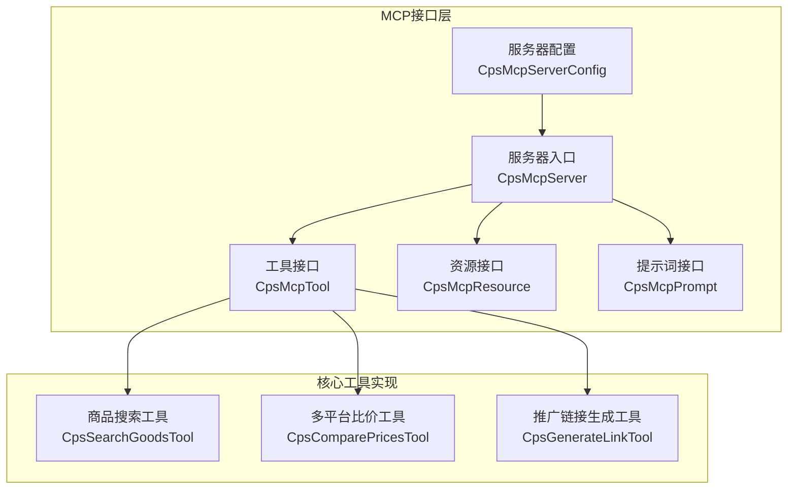
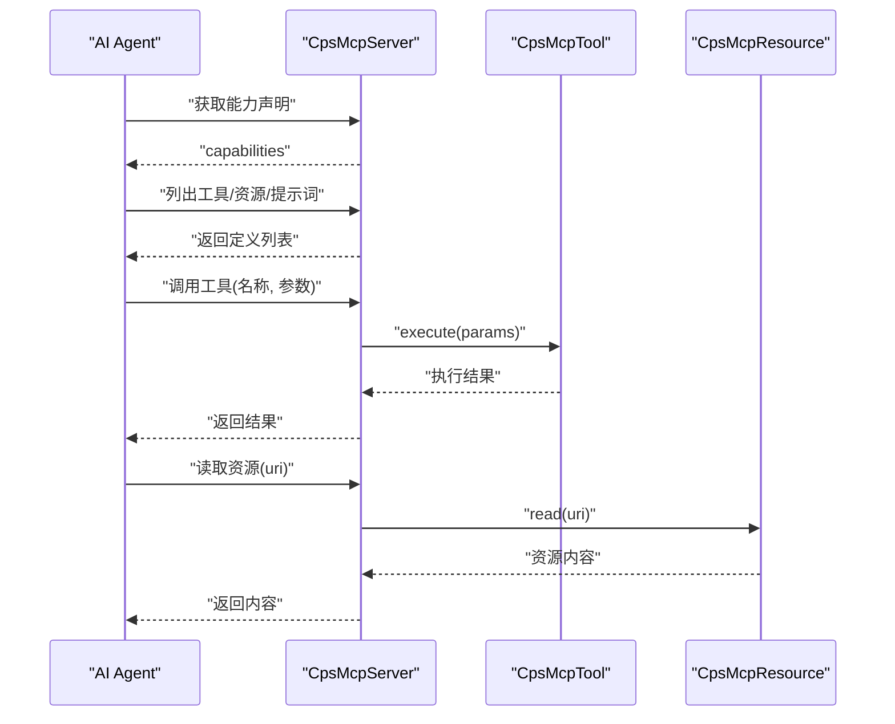
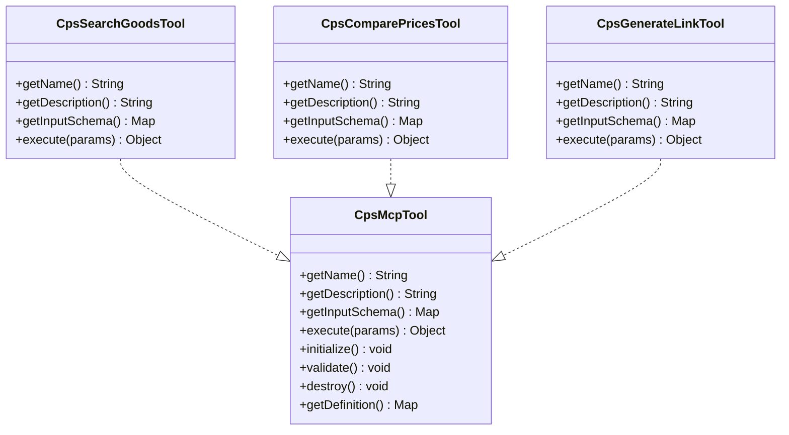
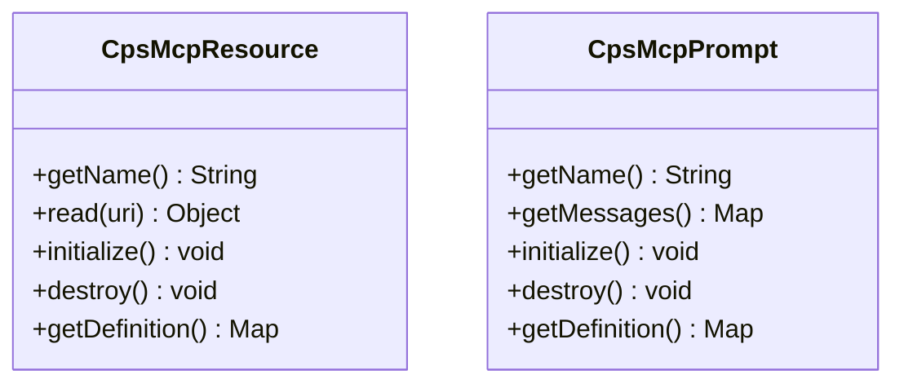
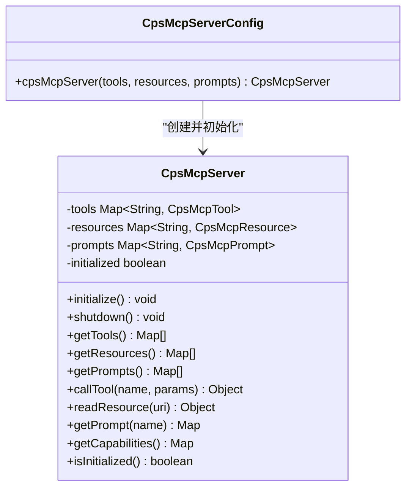
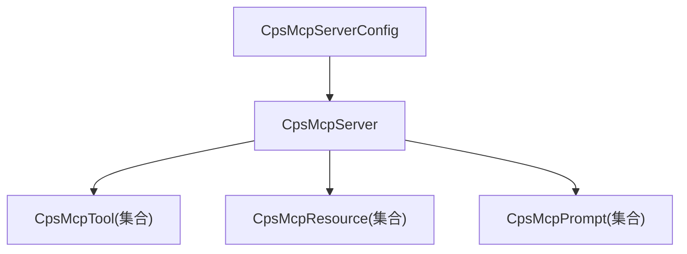
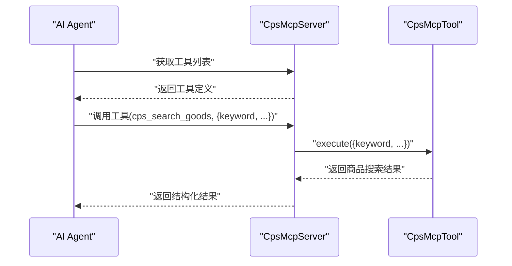

# MCP AI接口

<cite>
**本文引用的文件**
- [README.md](file://README.md)
- [CPS系统PRD文档.md](file://docs/CPS系统PRD文档.md)
- [CpsMcpTool.java](file://qiji-module-cps/qiji-module-cps-biz/src/main/java/cn/zhijian/cps/mcp/tool/CpsMcpTool.java)
- [CpsSearchGoodsTool.java](file://qiji-module-cps/qiji-module-cps-biz/src/main/java/cn/zhijian/cps/mcp/tool/CpsSearchGoodsTool.java)
- [CpsComparePricesTool.java](file://qiji-module-cps/qiji-module-cps-biz/src/main/java/cn/zhijian/cps/mcp/tool/CpsComparePricesTool.java)
- [CpsGenerateLinkTool.java](file://qiji-module-cps/qiji-module-cps-biz/src/main/java/cn/zhijian/cps/mcp/tool/CpsGenerateLinkTool.java)
- [CpsMcpResource.java](file://qiji-module-cps/qiji-module-cps-biz/src/main/java/cn/zhijian/cps/mcp/resource/CpsMcpResource.java)
- [CpsMcpPrompt.java](file://qiji-module-cps/qiji-module-cps-biz/src/main/java/cn/zhijian/cps/mcp/prompt/CpsMcpPrompt.java)
- [CpsMcpServer.java](file://qiji-module-cps/qiji-module-cps-biz/src/main/java/cn/zhijian/cps/mcp/server/CpsMcpServer.java)
- [CpsMcpServerConfig.java](file://qiji-module-cps/qiji-module-cps-biz/src/main/java/cn/zhijian/cps/mcp/server/CpsMcpServerConfig.java)
- [CpsMcpApiKeyDO.java](file://qiji-module-cps/qiji-module-cps-biz/src/main/java/cn/zhijian/cps/dal/dataobject/CpsMcpApiKeyDO.java)
- [CpsMcpApiKeySaveReqVO.java](file://qiji-module-cps/qiji-module-cps-biz/src/main/java/cn/zhijian/cps/controller/admin/vo/mcpapikey/CpsMcpApiKeySaveReqVO.java)
- [CpsMcpAccessLogPageReqVO.java](file://qiji-module-cps/qiji-module-cps-biz/src/main/java/cn/zhijian/cps/controller/admin/vo/mcpaccesslog/CpsMcpAccessLogPageReqVO.java)
- [CpsMcpAccessLogRespVO.java](file://qiji-module-cps/qiji-module-cps-biz/src/main/java/cn/zhijian/cps/controller/admin/vo/mcpaccesslog/CpsMcpAccessLogRespVO.java)
- [cps-schema.sql](file://sql/module/cps-schema.sql)
</cite>

## 目录
1. [简介](#简介)
2. [项目结构](#项目结构)
3. [核心组件](#核心组件)
4. [架构总览](#架构总览)
5. [详细组件分析](#详细组件分析)
6. [依赖分析](#依赖分析)
7. [性能考虑](#性能考虑)
8. [故障排查指南](#故障排查指南)
9. [结论](#结论)
10. [附录](#附录)

## 简介
本文件为基于MCP（Model Context Protocol）协议的AI Agent接口层规范文档，面向AgenticCPS系统的MCP服务端实现与集成方，提供以下内容：
- 5个核心Tools的完整定义与职责边界：商品搜索、多平台比价、推广链接生成、订单状态查询、返利汇总查询
- MCP协议的传输层支持：Streamable HTTP与STDIO
- 消息格式与认证机制
- MCP Server配置、API Key管理与限流策略
- AI Agent集成示例、工具调用示例、资源访问示例
- 性能要求、错误处理、调试方法与监控指标

## 项目结构
MCP相关代码集中在 qiji-module-cps 模块的 mcp 子包下，包含：
- tool：工具接口与具体实现
- resource：资源接口（只读数据源）
- prompt：预定义提示词模板
- server：MCP Server主入口与Spring配置

图表来源
- [CpsMcpTool.java:1-63](file://qiji-module-cps/qiji-module-cps-biz/src/main/java/cn/zhijian/cps/mcp/tool/CpsMcpTool.java#L1-L63)
- [CpsSearchGoodsTool.java:1-36](file://qiji-module-cps/qiji-module-cps-biz/src/main/java/cn/zhijian/cps/mcp/tool/CpsSearchGoodsTool.java#L1-L36)
- [CpsComparePricesTool.java:1-36](file://qiji-module-cps/qiji-module-cps-biz/src/main/java/cn/zhijian/cps/mcp/tool/CpsComparePricesTool.java#L1-L36)
- [CpsGenerateLinkTool.java:1-37](file://qiji-module-cps/qiji-module-cps-biz/src/main/java/cn/zhijian/cps/mcp/tool/CpsGenerateLinkTool.java#L1-L37)
- [CpsMcpResource.java:1-52](file://qiji-module-cps/qiji-module-cps-biz/src/main/java/cn/zhijian/cps/mcp/resource/CpsMcpResource.java#L1-L52)
- [CpsMcpPrompt.java:1-53](file://qiji-module-cps/qiji-module-cps-biz/src/main/java/cn/zhijian/cps/mcp/prompt/CpsMcpPrompt.java#L1-L53)
- [CpsMcpServer.java:1-184](file://qiji-module-cps/qiji-module-cps-biz/src/main/java/cn/zhijian/cps/mcp/server/CpsMcpServer.java#L1-L184)
- [CpsMcpServerConfig.java:1-31](file://qiji-module-cps/qiji-module-cps-biz/src/main/java/cn/zhijian/cps/mcp/server/CpsMcpServerConfig.java#L1-L31)

章节来源
- [CpsMcpTool.java:1-63](file://qiji-module-cps/qiji-module-cps-biz/src/main/java/cn/zhijian/cps/mcp/tool/CpsMcpTool.java#L1-L63)
- [CpsMcpServer.java:1-184](file://qiji-module-cps/qiji-module-cps-biz/src/main/java/cn/zhijian/cps/mcp/server/CpsMcpServer.java#L1-L184)

## 核心组件
- 工具接口（CpsMcpTool）：定义Tool的生命周期、名称、描述、输入Schema与执行方法
- 资源接口（CpsMcpResource）：定义只读资源的名称与读取方法
- 提示词接口（CpsMcpPrompt）：定义预设提示词的消息结构
- MCP Server（CpsMcpServer）：统一注册与管理工具、资源、提示词；提供能力声明、工具调用、资源读取、提示词获取
- 服务器配置（CpsMcpServerConfig）：通过Spring装配工具、资源、提示词并初始化Server

章节来源
- [CpsMcpTool.java:1-63](file://qiji-module-cps/qiji-module-cps-biz/src/main/java/cn/zhijian/cps/mcp/tool/CpsMcpTool.java#L1-L63)
- [CpsMcpResource.java:1-52](file://qiji-module-cps/qiji-module-cps-biz/src/main/java/cn/zhijian/cps/mcp/resource/CpsMcpResource.java#L1-L52)
- [CpsMcpPrompt.java:1-53](file://qiji-module-cps/qiji-module-cps-biz/src/main/java/cn/zhijian/cps/mcp/prompt/CpsMcpPrompt.java#L1-L53)
- [CpsMcpServer.java:1-184](file://qiji-module-cps/qiji-module-cps-biz/src/main/java/cn/zhijian/cps/mcp/server/CpsMcpServer.java#L1-L184)
- [CpsMcpServerConfig.java:1-31](file://qiji-module-cps/qiji-module-cps-biz/src/main/java/cn/zhijian/cps/mcp/server/CpsMcpServerConfig.java#L1-L31)

## 架构总览
MCP Server负责：
- 注册与管理工具、资源、提示词
- 提供能力声明（capabilities），声明对工具、资源、提示词的支持
- 接收外部Agent的请求，执行工具调用或读取资源

图表来源
- [CpsMcpServer.java:87-148](file://qiji-module-cps/qiji-module-cps-biz/src/main/java/cn/zhijian/cps/mcp/server/CpsMcpServer.java#L87-L148)

## 详细组件分析

### 工具接口与实现
- 接口职责：定义Tool的生命周期（initialize/validate/destroy）、名称、描述、输入Schema与执行方法
- 输入Schema：用于约束与描述工具参数，便于Agent正确构造请求
- 执行方法：接收参数Map并返回结果对象

图表来源
- [CpsMcpTool.java:1-63](file://qiji-module-cps/qiji-module-cps-biz/src/main/java/cn/zhijian/cps/mcp/tool/CpsMcpTool.java#L1-L63)
- [CpsSearchGoodsTool.java:1-36](file://qiji-module-cps/qiji-module-cps-biz/src/main/java/cn/zhijian/cps/mcp/tool/CpsSearchGoodsTool.java#L1-L36)
- [CpsComparePricesTool.java:1-36](file://qiji-module-cps/qiji-module-cps-biz/src/main/java/cn/zhijian/cps/mcp/tool/CpsComparePricesTool.java#L1-L36)
- [CpsGenerateLinkTool.java:1-37](file://qiji-module-cps/qiji-module-cps-biz/src/main/java/cn/zhijian/cps/mcp/tool/CpsGenerateLinkTool.java#L1-L37)

章节来源
- [CpsMcpTool.java:1-63](file://qiji-module-cps/qiji-module-cps-biz/src/main/java/cn/zhijian/cps/mcp/tool/CpsMcpTool.java#L1-L63)
- [CpsSearchGoodsTool.java:1-36](file://qiji-module-cps/qiji-module-cps-biz/src/main/java/cn/zhijian/cps/mcp/tool/CpsSearchGoodsTool.java#L1-L36)
- [CpsComparePricesTool.java:1-36](file://qiji-module-cps/qiji-module-cps-biz/src/main/java/cn/zhijian/cps/mcp/tool/CpsComparePricesTool.java#L1-L36)
- [CpsGenerateLinkTool.java:1-37](file://qiji-module-cps/qiji-module-cps-biz/src/main/java/cn/zhijian/cps/mcp/tool/CpsGenerateLinkTool.java#L1-L37)

### 资源接口与提示词接口
- 资源接口：定义资源名称与读取方法，用于AI Agent只读访问数据
- 提示词接口：定义提示词名称与消息结构，用于引导对话与推理

图表来源
- [CpsMcpResource.java:1-52](file://qiji-module-cps/qiji-module-cps-biz/src/main/java/cn/zhijian/cps/mcp/resource/CpsMcpResource.java#L1-L52)
- [CpsMcpPrompt.java:1-53](file://qiji-module-cps/qiji-module-cps-biz/src/main/java/cn/zhijian/cps/mcp/prompt/CpsMcpPrompt.java#L1-L53)

章节来源
- [CpsMcpResource.java:1-52](file://qiji-module-cps/qiji-module-cps-biz/src/main/java/cn/zhijian/cps/mcp/resource/CpsMcpResource.java#L1-L52)
- [CpsMcpPrompt.java:1-53](file://qiji-module-cps/qiji-module-cps-biz/src/main/java/cn/zhijian/cps/mcp/prompt/CpsMcpPrompt.java#L1-L53)

### MCP Server与配置
- 服务器入口：集中注册工具、资源、提示词；提供能力声明、工具调用、资源读取、提示词获取
- 生命周期：初始化时验证并初始化所有组件；关闭时释放资源
- Spring配置：通过容器装配集合，自动构建Server并初始化

图表来源
- [CpsMcpServer.java:1-184](file://qiji-module-cps/qiji-module-cps-biz/src/main/java/cn/zhijian/cps/mcp/server/CpsMcpServer.java#L1-L184)
- [CpsMcpServerConfig.java:1-31](file://qiji-module-cps/qiji-module-cps-biz/src/main/java/cn/zhijian/cps/mcp/server/CpsMcpServerConfig.java#L1-L31)

章节来源
- [CpsMcpServer.java:1-184](file://qiji-module-cps/qiji-module-cps-biz/src/main/java/cn/zhijian/cps/mcp/server/CpsMcpServer.java#L1-L184)
- [CpsMcpServerConfig.java:1-31](file://qiji-module-cps/qiji-module-cps-biz/src/main/java/cn/zhijian/cps/mcp/server/CpsMcpServerConfig.java#L1-L31)

### 核心Tools定义与参数约束
- 商品搜索工具（cps_search_goods）：根据关键词在指定或全部CPS平台搜索商品，支持价格区间、排序方式等筛选
- 多平台比价工具（cps_compare_prices）：自动跨平台比价，返回各平台价格、返利与实付价格，推荐最优购买方案
- 推广链接生成工具（cps_generate_link）：根据商品ID与平台生成推广链接/口令，自动注入用户归因参数

参数Schema与执行逻辑在各工具实现中定义，当前仓库中对应文件包含占位实现，实际参数约束与业务逻辑需在具体实现中完善。

章节来源
- [CpsSearchGoodsTool.java:1-36](file://qiji-module-cps/qiji-module-cps-biz/src/main/java/cn/zhijian/cps/mcp/tool/CpsSearchGoodsTool.java#L1-L36)
- [CpsComparePricesTool.java:1-36](file://qiji-module-cps/qiji-module-cps-biz/src/main/java/cn/zhijian/cps/mcp/tool/CpsComparePricesTool.java#L1-L36)
- [CpsGenerateLinkTool.java:1-37](file://qiji-module-cps/qiji-module-cps-biz/src/main/java/cn/zhijian/cps/mcp/tool/CpsGenerateLinkTool.java#L1-L37)

### 资源与提示词
- 资源（Resource）：用于AI Agent只读访问数据源，如平台配置、返利规则等
- 提示词（Prompt）：预定义的交互模板，辅助Agent进行推理与对话

章节来源
- [CpsMcpResource.java:1-52](file://qiji-module-cps/qiji-module-cps-biz/src/main/java/cn/zhijian/cps/mcp/resource/CpsMcpResource.java#L1-L52)
- [CpsMcpPrompt.java:1-53](file://qiji-module-cps/qiji-module-cps-biz/src/main/java/cn/zhijian/cps/mcp/prompt/CpsMcpPrompt.java#L1-L53)

## 依赖分析
- 组件耦合：Server通过接口聚合工具、资源、提示词，降低耦合度
- 外部依赖：Spring容器负责装配与生命周期管理
- 可扩展性：新增工具/资源/提示词只需实现对应接口并交由Spring管理

图表来源
- [CpsMcpServer.java:27-33](file://qiji-module-cps/qiji-module-cps-biz/src/main/java/cn/zhijian/cps/mcp/server/CpsMcpServer.java#L27-L33)
- [CpsMcpServerConfig.java:22-29](file://qiji-module-cps/qiji-module-cps-biz/src/main/java/cn/zhijian/cps/mcp/server/CpsMcpServerConfig.java#L22-L29)

章节来源
- [CpsMcpServer.java:1-184](file://qiji-module-cps/qiji-module-cps-biz/src/main/java/cn/zhijian/cps/mcp/server/CpsMcpServer.java#L1-L184)
- [CpsMcpServerConfig.java:1-31](file://qiji-module-cps/qiji-module-cps-biz/src/main/java/cn/zhijian/cps/mcp/server/CpsMcpServerConfig.java#L1-L31)

## 性能考虑
- 单平台搜索：P99 < 2秒
- 多平台比价：P99 < 5秒
- 转链生成：P99 < 1秒
- 订单同步延迟：< 30分钟
- 返利入账延迟：平台结算后24小时内

章节来源
- [README.md:306-314](file://README.md#L306-L314)

## 故障排查指南
- 服务器初始化失败：检查工具/资源/提示词是否正确注册与初始化
- 工具未找到：确认工具名称与注册名称一致
- 资源未找到：确认URI前缀匹配或资源名称存在
- 访问日志：通过管理后台查看API Key调用记录与错误信息

章节来源
- [CpsMcpServer.java:114-148](file://qiji-module-cps/qiji-module-cps-biz/src/main/java/cn/zhijian/cps/mcp/server/CpsMcpServer.java#L114-L148)
- [CpsMcpAccessLogPageReqVO.java:1-34](file://qiji-module-cps/qiji-module-cps-biz/src/main/java/cn/zhijian/cps/controller/admin/vo/mcpaccesslog/CpsMcpAccessLogPageReqVO.java#L1-L34)
- [CpsMcpAccessLogRespVO.java:1-48](file://qiji-module-cps/qiji-module-cps-biz/src/main/java/cn/zhijian/cps/controller/admin/vo/mcpaccesslog/CpsMcpAccessLogRespVO.java#L1-L48)

## 结论
本文档梳理了基于MCP协议的AI Agent接口层规范，明确了工具、资源、提示词的接口定义与Server的生命周期管理，并给出了API Key管理、限流策略、性能要求与监控指标的实践建议。实际集成时，请结合具体工具实现完善参数Schema与业务逻辑。

## 附录

### MCP协议与传输层支持
- Streamable HTTP：远程AI Agent接入，支持SSE流式响应，适合生产环境
- STDIO：本地开发调试，适合本地AI开发工具集成

章节来源
- [README.md:285-291](file://README.md#L285-L291)

### 认证机制与消息格式
- 认证：通过API Key进行鉴权，支持权限级别与限流控制
- 消息格式：工具调用与资源读取遵循MCP协议的消息结构，Server提供能力声明与定义列表

章节来源
- [CpsMcpServer.java:153-175](file://qiji-module-cps/qiji-module-cps-biz/src/main/java/cn/zhijian/cps/mcp/server/CpsMcpServer.java#L153-L175)

### MCP Server配置说明
- 通过Spring装配工具、资源、提示词集合，自动初始化Server
- 初始化完成后，Server对外提供能力声明与工具/资源/提示词列表

章节来源
- [CpsMcpServerConfig.java:22-29](file://qiji-module-cps/qiji-module-cps-biz/src/main/java/cn/zhijian/cps/mcp/server/CpsMcpServerConfig.java#L22-L29)

### API Key管理与限流策略
- API Key管理：支持创建、更新、删除、权限级别设置、限流配置与状态控制
- 限流策略：支持每分钟/每小时/每天最大请求数配置
- 访问日志：记录API Key、工具名称、资源URI、请求参数、响应状态、耗时与错误信息

章节来源
- [CpsMcpApiKeyDO.java:1-48](file://qiji-module-cps/qiji-module-cps-biz/src/main/java/cn/zhijian/cps/dal/dataobject/CpsMcpApiKeyDO.java#L1-L48)
- [CpsMcpApiKeySaveReqVO.java:1-40](file://qiji-module-cps/qiji-module-cps-biz/src/main/java/cn/zhijian/cps/controller/admin/vo/mcpapikey/CpsMcpApiKeySaveReqVO.java#L1-L40)
- [cps-schema.sql:211-264](file://sql/module/cps-schema.sql#L211-L264)

### AI Agent集成示例与工具调用示例
- 获取能力声明：Agent向Server请求能力声明以了解支持的工具、资源与提示词
- 列出工具/资源/提示词：Agent获取定义列表，用于动态展示与调用
- 调用工具：Agent传入工具名称与参数，Server转发至对应工具执行
- 读取资源：Agent传入资源URI，Server转发至对应资源读取

图表来源
- [CpsMcpServer.java:87-120](file://qiji-module-cps/qiji-module-cps-biz/src/main/java/cn/zhijian/cps/mcp/server/CpsMcpServer.java#L87-L120)

### 资源访问示例
- Agent通过Server读取资源URI，Server根据名称或URI前缀匹配资源并返回内容

章节来源
- [CpsMcpServer.java:124-137](file://qiji-module-cps/qiji-module-cps-biz/src/main/java/cn/zhijian/cps/mcp/server/CpsMcpServer.java#L124-L137)

### 错误处理与调试方法
- 工具/资源不存在：抛出参数异常，提示名称或URI不匹配
- 日志与监控：通过访问日志记录关键信息，结合管理后台进行审计与分析

章节来源
- [CpsMcpServer.java:114-148](file://qiji-module-cps/qiji-module-cps-biz/src/main/java/cn/zhijian/cps/mcp/server/CpsMcpServer.java#L114-L148)
- [CpsMcpAccessLogPageReqVO.java:1-34](file://qiji-module-cps/qiji-module-cps-biz/src/main/java/cn/zhijian/cps/controller/admin/vo/mcpaccesslog/CpsMcpAccessLogPageReqVO.java#L1-L34)