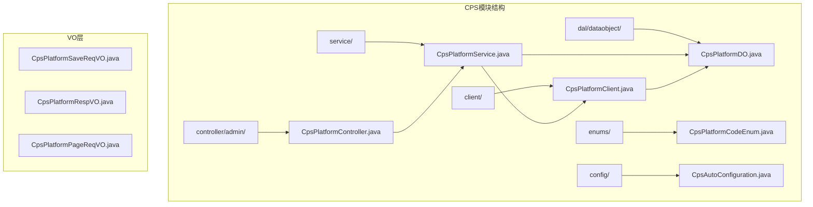
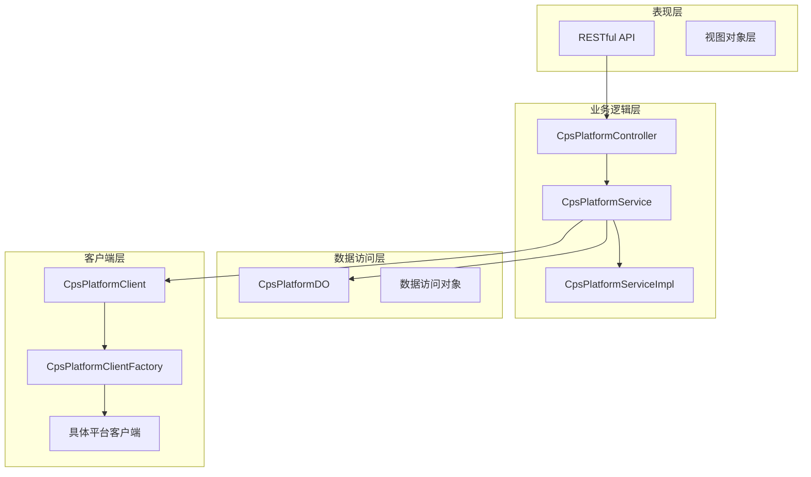
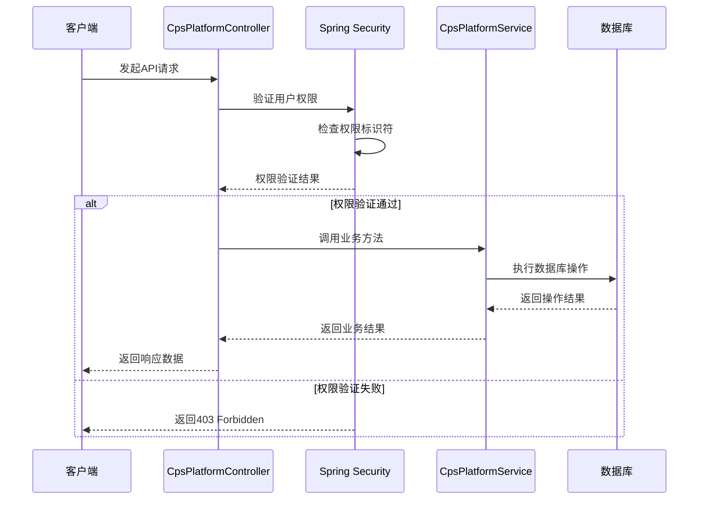
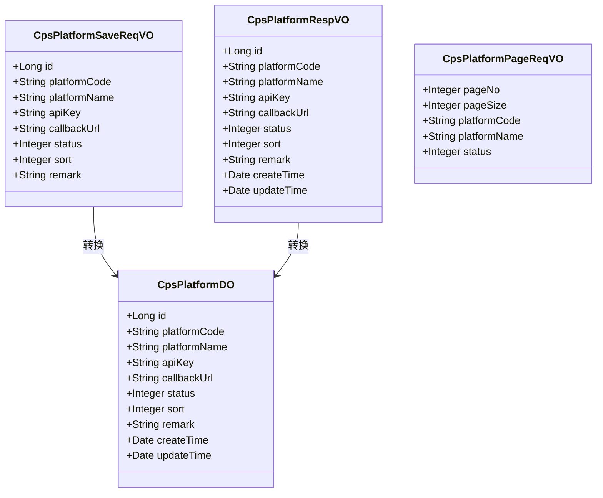
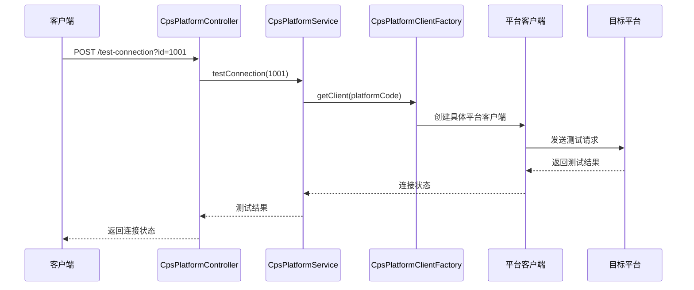
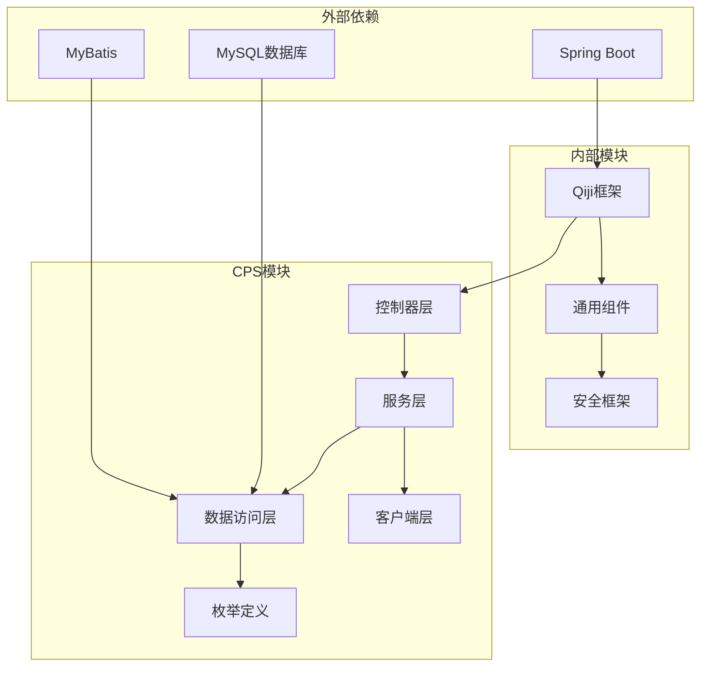

# 平台配置管理接口

<cite>
**本文档引用的文件**
- [CpsPlatformController.java](file://qiji-module-cps/qiji-module-cps-biz/src/main/java/cn/zhijian/cps/controller/admin/CpsPlatformController.java)
- [CpsPlatformService.java](file://qiji-module-cps/qiji-module-cps-biz/src/main/java/cn/zhijian/cps/service/CpsPlatformService.java)
- [CpsPlatformServiceImpl.java](file://qiji-module-cps/qiji-module-cps-biz/src/main/java/cn/zhijian/cps/service/CpsPlatformServiceImpl.java)
- [CpsPlatformDO.java](file://qiji-module-cps/qiji-module-cps-biz/src/main/java/cn/zhijian/cps/dal/dataobject/CpsPlatformDO.java)
- [CpsPlatformSaveReqVO.java](file://qiji-module-cps/qiji-module-cps-biz/src/main/java/cn/zhijian/cps/controller/admin/vo/platform/CpsPlatformSaveReqVO.java)
- [CpsPlatformRespVO.java](file://qiji-module-cps/qiji-module-cps-biz/src/main/java/cn/zhijian/cps/controller/admin/vo/platform/CpsPlatformRespVO.java)
- [CpsPlatformPageReqVO.java](file://qiji-module-cps/qiji-module-cps-biz/src/main/java/cn/zhijian/cps/controller/admin/vo/platform/CpsPlatformPageReqVO.java)
- [CpsPlatformClient.java](file://qiji-module-cps/qiji-module-cps-biz/src/main/java/cn/zhijian/cps/client/CpsPlatformClient.java)
- [AbstractCpsPlatformClient.java](file://qiji-module-cps/qiji-module-cps-biz/src/main/java/cn/zhijian/cps/client/AbstractCpsPlatformClient.java)
- [CpsPlatformClientFactory.java](file://qiji-module-cps/qiji-module-cps-biz/src/main/java/cn/zhijian/cps/service/CpsPlatformClientFactory.java)
- [CpsPlatformClientFactoryImpl.java](file://qiji-module-cps/qiji-module-cps-biz/src/main/java/cn/zhijian/cps/service/CpsPlatformClientFactoryImpl.java)
- [CpsPlatformCodeEnum.java](file://qiji-module-cps/qiji-module-cps-biz/src/main/java/cn/zhijian/cps/enums/CpsPlatformCodeEnum.java)
- [ErrorCodeConstants.java](file://qiji-module-cps/qiji-module-cps-biz/src/main/java/cn/zhijian/cps/enums/ErrorCodeConstants.java)
</cite>

## 目录
1. [简介](#简介)
2. [项目结构](#项目结构)
3. [核心组件](#核心组件)
4. [架构概览](#架构概览)
5. [详细组件分析](#详细组件分析)
6. [依赖关系分析](#依赖关系分析)
7. [性能考虑](#性能考虑)
8. [故障排除指南](#故障排除指南)
9. [结论](#结论)

## 简介

CPS平台配置管理接口是RuoYi-Vue-Pro企业级中台管理系统中的核心功能模块，专门用于管理CPS（Commission Paid Search）平台的配置信息。该模块提供了完整的平台配置生命周期管理能力，包括平台配置的创建、更新、删除、查询和分页展示，以及平台连通性测试功能。

本接口体系采用RESTful API设计规范，遵循Spring Boot微服务架构最佳实践，集成了权限控制、数据验证、异常处理等企业级特性。通过统一的接口标准，实现了对多个CPS平台（如淘宝、京东、拼多多、抖音等）的标准化管理。

## 项目结构

CPS平台配置管理模块位于`qiji-module-cps`目录下，采用典型的分层架构设计：



**图表来源**
- [CpsPlatformController.java:1-81](file://qiji-module-cps/qiji-module-cps-biz/src/main/java/cn/zhijian/cps/controller/admin/CpsPlatformController.java#L1-L81)
- [CpsPlatformService.java:1-200](file://qiji-module-cps/qiji-module-cps-biz/src/main/java/cn/zhijian/cps/service/CpsPlatformService.java#L1-L200)

**章节来源**
- [CpsPlatformController.java:1-81](file://qiji-module-cps/qiji-module-cps-biz/src/main/java/cn/zhijian/cps/controller/admin/CpsPlatformController.java#L1-L81)

## 核心组件

### 控制器层

CpsPlatformController作为RESTful API的入口点，提供了以下核心接口：

- **创建平台配置**：POST `/admin-api/cps/platform/create`
- **更新平台配置**：PUT `/admin-api/cps/platform/update`
- **删除平台配置**：DELETE `/admin-api/cps/platform/delete`
- **获取平台详情**：GET `/admin-api/cps/platform/get`
- **获取平台分页列表**：GET `/admin-api/cps/platform/page`
- **测试平台连通性**：POST `/admin-api/cps/platform/test-connection`

每个接口都集成了Spring Security权限控制，确保只有具备相应权限的用户才能执行操作。

**章节来源**
- [CpsPlatformController.java:31-78](file://qiji-module-cps/qiji-module-cps-biz/src/main/java/cn/zhijian/cps/controller/admin/CpsPlatformController.java#L31-L78)

### 服务层

CpsPlatformService定义了平台配置管理的核心业务逻辑，包括：
- 平台配置的CRUD操作
- 平台配置分页查询
- 平台连通性测试
- 平台配置验证和业务规则检查

服务层采用接口-实现分离的设计模式，便于扩展和测试。

**章节来源**
- [CpsPlatformService.java:1-200](file://qiji-module-cps/qiji-module-cps-biz/src/main/java/cn/zhijian/cps/service/CpsPlatformService.java#L1-L200)

### 数据访问层

CpsPlatformDO作为数据传输对象，封装了平台配置的所有属性，包括：
- 基础信息：平台编码、名称、描述
- 认证信息：API密钥、回调地址
- 状态信息：启用状态、排序
- 时间戳：创建时间、更新时间

**章节来源**
- [CpsPlatformDO.java:1-200](file://qiji-module-cps/qiji-module-cps-biz/src/main/java/cn/zhijian/cps/dal/dataobject/CpsPlatformDO.java#L1-L200)

## 架构概览

CPS平台配置管理采用分层架构设计，各层职责清晰，耦合度低：



**图表来源**
- [CpsPlatformController.java:25-81](file://qiji-module-cps/qiji-module-cps-biz/src/main/java/cn/zhijian/cps/controller/admin/CpsPlatformController.java#L25-L81)
- [CpsPlatformService.java:1-200](file://qiji-module-cps/qiji-module-cps-biz/src/main/java/cn/zhijian/cps/service/CpsPlatformService.java#L1-L200)

### 权限控制架构

系统采用基于角色的权限控制（RBAC），通过Spring Security注解实现细粒度的权限管理：



**图表来源**
- [CpsPlatformController.java:33-76](file://qiji-module-cps/qiji-module-cps-biz/src/main/java/cn/zhijian/cps/controller/admin/CpsPlatformController.java#L33-L76)

**章节来源**
- [CpsPlatformController.java:33-76](file://qiji-module-cps/qiji-module-cps-biz/src/main/java/cn/zhijian/cps/controller/admin/CpsPlatformController.java#L33-L76)

## 详细组件分析

### 平台配置数据模型

平台配置采用统一的数据模型设计，支持多种CPS平台的标准化管理：



**图表来源**
- [CpsPlatformDO.java:1-200](file://qiji-module-cps/qiji-module-cps-biz/src/main/java/cn/zhijian/cps/dal/dataobject/CpsPlatformDO.java#L1-L200)
- [CpsPlatformSaveReqVO.java:1-100](file://qiji-module-cps/qiji-module-cps-biz/src/main/java/cn/zhijian/cps/controller/admin/vo/platform/CpsPlatformSaveReqVO.java#L1-L100)
- [CpsPlatformRespVO.java:1-100](file://qiji-module-cps/qiji-module-cps-biz/src/main/java/cn/zhijian/cps/controller/admin/vo/platform/CpsPlatformRespVO.java#L1-L100)
- [CpsPlatformPageReqVO.java:1-80](file://qiji-module-cps/qiji-module-cps-biz/src/main/java/cn/zhijian/cps/controller/admin/vo/platform/CpsPlatformPageReqVO.java#L1-L80)

#### 字段详细说明

| 字段名 | 类型 | 必填 | 描述 | 示例值 |
|--------|------|------|------|--------|
| id | Long | 否 | 平台配置ID | 1001 |
| platformCode | String | 是 | 平台编码 | "taobao" |
| platformName | String | 是 | 平台名称 | "淘宝联盟" |
| apiKey | String | 是 | API密钥 | "xxxxxxxxxxxx" |
| callbackUrl | String | 是 | 回调地址 | "https://api.example.com/callback" |
| status | Integer | 是 | 状态 (0=停用, 1=启用) | 1 |
| sort | Integer | 否 | 排序 | 1 |
| remark | String | 否 | 备注 | "生产环境配置" |

**章节来源**
- [CpsPlatformDO.java:1-200](file://qiji-module-cps/qiji-module-cps-biz/src/main/java/cn/zhijian/cps/dal/dataobject/CpsPlatformDO.java#L1-L200)
- [CpsPlatformSaveReqVO.java:1-100](file://qiji-module-cps/qiji-module-cps-biz/src/main/java/cn/zhijian/cps/controller/admin/vo/platform/CpsPlatformSaveReqVO.java#L1-L100)

### API接口详细说明

#### 创建平台配置 (POST /admin-api/cps/platform/create)

**请求参数**
- Content-Type: application/json
- 请求体: CpsPlatformSaveReqVO

**响应数据**
```json
{
  "code": 0,
  "msg": "成功",
  "data": 1001
}
```

**权限要求**: `cps:platform:create`

**章节来源**
- [CpsPlatformController.java:31-36](file://qiji-module-cps/qiji-module-cps-biz/src/main/java/cn/zhijian/cps/controller/admin/CpsPlatformController.java#L31-L36)

#### 更新平台配置 (PUT /admin-api/cps/platform/update)

**请求参数**
- Content-Type: application/json
- 请求体: CpsPlatformSaveReqVO（必须包含id）

**响应数据**
```json
{
  "code": 0,
  "msg": "成功",
  "data": true
}
```

**权限要求**: `cps:platform:update`

**章节来源**
- [CpsPlatformController.java:38-44](file://qiji-module-cps/qiji-module-cps-biz/src/main/java/cn/zhijian/cps/controller/admin/CpsPlatformController.java#L38-L44)

#### 删除平台配置 (DELETE /admin-api/cps/platform/delete)

**请求参数**
- 查询参数: id (Long, 必填)

**响应数据**
```json
{
  "code": 0,
  "msg": "成功",
  "data": true
}
```

**权限要求**: `cps:platform:delete`

**章节来源**
- [CpsPlatformController.java:46-53](file://qiji-module-cps/qiji-module-cps-biz/src/main/java/cn/zhijian/cps/controller/admin/CpsPlatformController.java#L46-L53)

#### 获取平台详情 (GET /admin-api/cps/platform/get)

**请求参数**
- 查询参数: id (Long, 必填)

**响应数据**
```json
{
  "code": 0,
  "msg": "成功",
  "data": {
    "id": 1001,
    "platformCode": "taobao",
    "platformName": "淘宝联盟",
    "apiKey": "xxxxxxxxxxxx",
    "callbackUrl": "https://api.example.com/callback",
    "status": 1,
    "sort": 1,
    "remark": "生产环境配置",
    "createTime": "2024-01-01T00:00:00Z",
    "updateTime": "2024-01-01T00:00:00Z"
  }
}
```

**权限要求**: `cps:platform:query`

**章节来源**
- [CpsPlatformController.java:55-62](file://qiji-module-cps/qiji-module-cps-biz/src/main/java/cn/zhijian/cps/controller/admin/CpsPlatformController.java#L55-L62)

#### 获取平台分页列表 (GET /admin-api/cps/platform/page)

**请求参数**
- 查询参数: 
  - pageNo (Integer, 可选, 默认1)
  - pageSize (Integer, 可选, 默认10)
  - platformCode (String, 可选)
  - platformName (String, 可选)
  - status (Integer, 可选)

**响应数据**
```json
{
  "code": 0,
  "msg": "成功",
  "data": {
    "list": [...],
    "total": 100
  }
}
```

**权限要求**: `cps:platform:query`

**章节来源**
- [CpsPlatformController.java:64-70](file://qiji-module-cps/qiji-module-cps-biz/src/main/java/cn/zhijian/cps/controller/admin/CpsPlatformController.java#L64-L70)

#### 测试平台连通性 (POST /admin-api/cps/platform/test-connection)

**请求参数**
- 查询参数: id (Long, 必填)

**响应数据**
```json
{
  "code": 0,
  "msg": "成功",
  "data": true
}
```

**权限要求**: `cps:platform:update`

**章节来源**
- [CpsPlatformController.java:72-78](file://qiji-module-cps/qiji-module-cps-biz/src/main/java/cn/zhijian/cps/controller/admin/CpsPlatformController.java#L72-L78)

### 连接测试流程

平台连通性测试通过统一的客户端工厂模式实现，支持多种CPS平台的连接验证：



**图表来源**
- [CpsPlatformController.java:72-78](file://qiji-module-cps/qiji-module-cps-biz/src/main/java/cn/zhijian/cps/controller/admin/CpsPlatformController.java#L72-L78)
- [CpsPlatformClientFactory.java:1-150](file://qiji-module-cps/qiji-module-cps-biz/src/main/java/cn/zhijian/cps/service/CpsPlatformClientFactory.java#L1-L150)

**章节来源**
- [CpsPlatformClientFactoryImpl.java:1-200](file://qiji-module-cps/qiji-module-cps-biz/src/main/java/cn/zhijian/cps/service/CpsPlatformClientFactoryImpl.java#L1-L200)

## 依赖关系分析

CPS平台配置管理模块的依赖关系呈现清晰的层次化结构：



**图表来源**
- [CpsPlatformController.java:1-81](file://qiji-module-cps/qiji-module-cps-biz/src/main/java/cn/zhijian/cps/controller/admin/CpsPlatformController.java#L1-L81)
- [CpsPlatformService.java:1-200](file://qiji-module-cps/qiji-module-cps-biz/src/main/java/cn/zhijian/cps/service/CpsPlatformService.java#L1-L200)

### 核心依赖关系

1. **权限控制依赖**: 通过Spring Security实现基于注解的权限控制
2. **数据验证依赖**: 使用Bean Validation进行请求参数验证
3. **数据转换依赖**: 通过BeanUtils实现VO与DO之间的数据转换
4. **客户端抽象依赖**: 通过工厂模式实现多平台客户端的统一管理

**章节来源**
- [CpsPlatformController.java:14-18](file://qiji-module-cps/qiji-module-cps-biz/src/main/java/cn/zhijian/cps/controller/admin/CpsPlatformController.java#L14-L18)

## 性能考虑

### 缓存策略

建议在以下场景实施缓存策略以提升性能：
- 平台配置信息缓存（30分钟有效期）
- 平台客户端实例缓存
- 平台连通性状态缓存（5分钟有效期）

### 分页优化

对于大数据量的平台配置查询，建议：
- 设置合理的分页大小（默认20条记录）
- 实施索引优化（按平台编码、状态建立复合索引）
- 使用延迟加载减少不必要的数据传输

### 并发控制

- 使用乐观锁防止并发更新冲突
- 实施连接池管理避免资源耗尽
- 设置超时时间防止长时间阻塞

## 故障排除指南

### 常见错误类型

| 错误代码 | 错误类型 | 可能原因 | 解决方案 |
|----------|----------|----------|----------|
| 1001 | 参数验证失败 | 请求参数缺失或格式不正确 | 检查必填字段和数据类型 |
| 1002 | 权限不足 | 用户缺少相应权限 | 为用户分配`cps:platform:*`权限 |
| 1003 | 平台连接失败 | API密钥错误或网络问题 | 验证API密钥和网络连通性 |
| 1004 | 数据不存在 | 平台配置ID无效 | 确认平台配置是否存在 |
| 1005 | 业务逻辑错误 | 平台配置状态异常 | 检查平台配置状态和业务规则 |

### 连接测试诊断

当平台连通性测试失败时，建议按以下步骤排查：

1. **网络连通性检查**
   - 验证目标平台API地址可达性
   - 检查防火墙和代理设置
   - 确认DNS解析正常

2. **认证信息验证**
   - 核对API密钥是否正确
   - 验证签名算法和参数拼接
   - 检查时间戳和随机数参数

3. **平台配置检查**
   - 确认平台状态为启用
   - 验证回调地址格式正确
   - 检查平台编码与实际平台匹配

**章节来源**
- [ErrorCodeConstants.java:1-100](file://qiji-module-cps/qiji-module-cps-biz/src/main/java/cn/zhijian/cps/enums/ErrorCodeConstants.java#L1-L100)

### 最佳实践建议

1. **配置管理最佳实践**
   - 建议使用环境变量管理敏感信息
   - 实施配置变更审计日志
   - 建立配置备份和恢复机制

2. **安全性最佳实践**
   - 定期轮换API密钥
   - 实施最小权限原则
   - 启用HTTPS加密传输

3. **监控和告警**
   - 建立平台连通性监控
   - 设置异常告警阈值
   - 实施性能指标监控

## 结论

CPS平台配置管理接口通过标准化的RESTful API设计，为企业提供了完善的CPS平台管理解决方案。该接口体系具有以下特点：

- **完整的功能覆盖**：支持平台配置的全生命周期管理
- **严格的安全控制**：基于角色的权限管理和数据验证
- **良好的扩展性**：抽象化的客户端设计支持多平台接入
- **完善的错误处理**：统一的错误码和异常处理机制

通过遵循本文档提供的最佳实践和故障排除指南，可以确保CPS平台配置管理接口的稳定运行和高效维护。建议在生产环境中结合具体的业务需求，进一步完善监控、备份和安全策略，以确保系统的高可用性和数据安全。