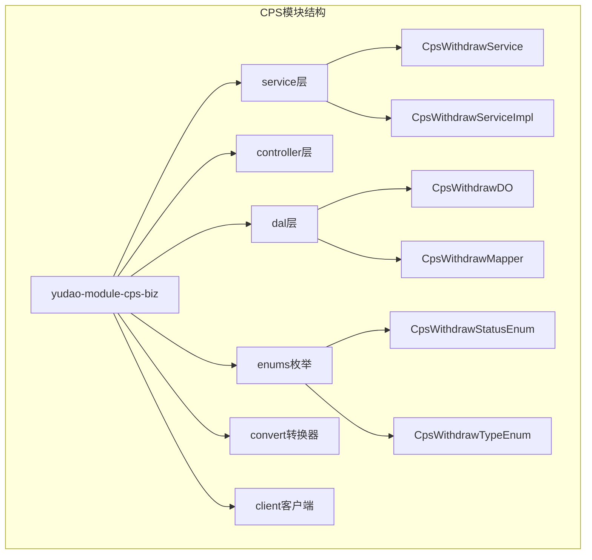
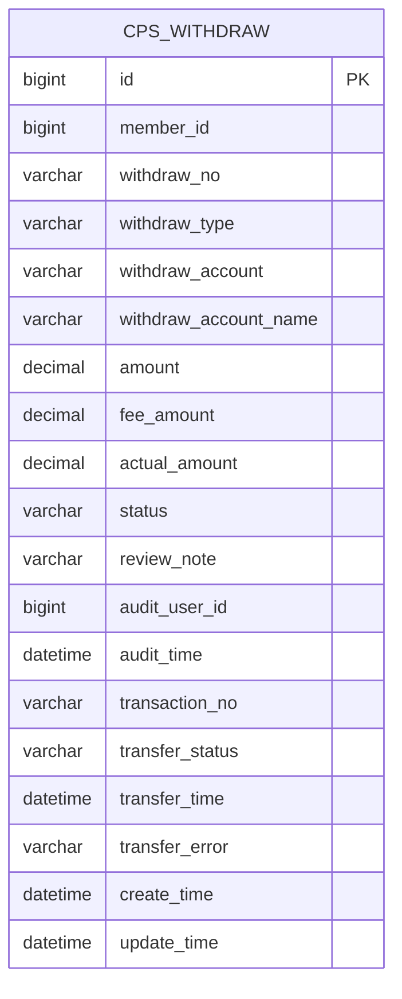
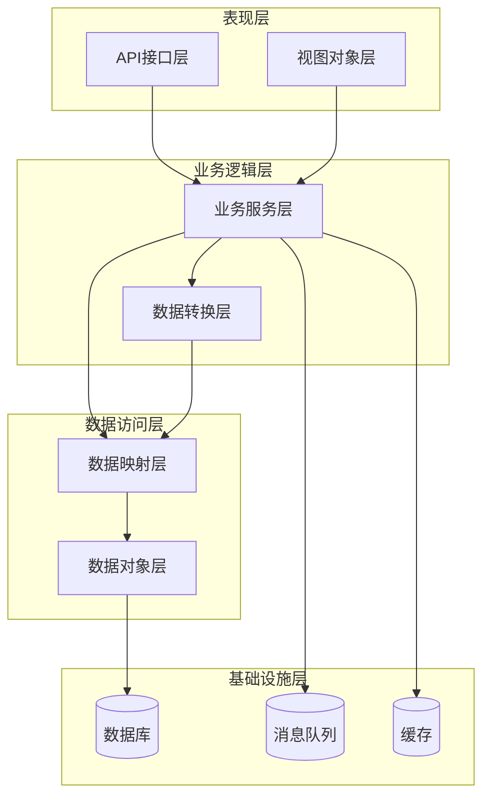
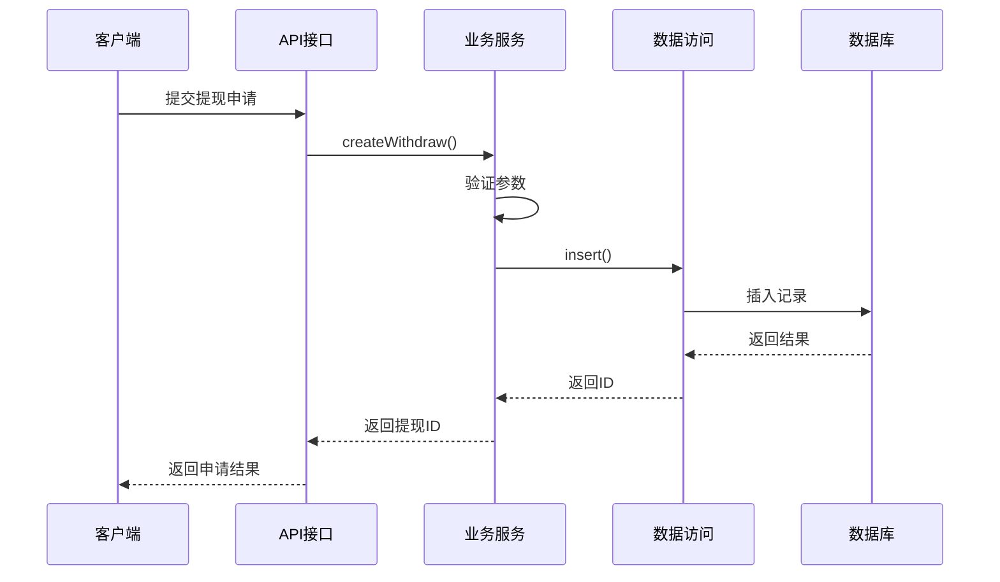
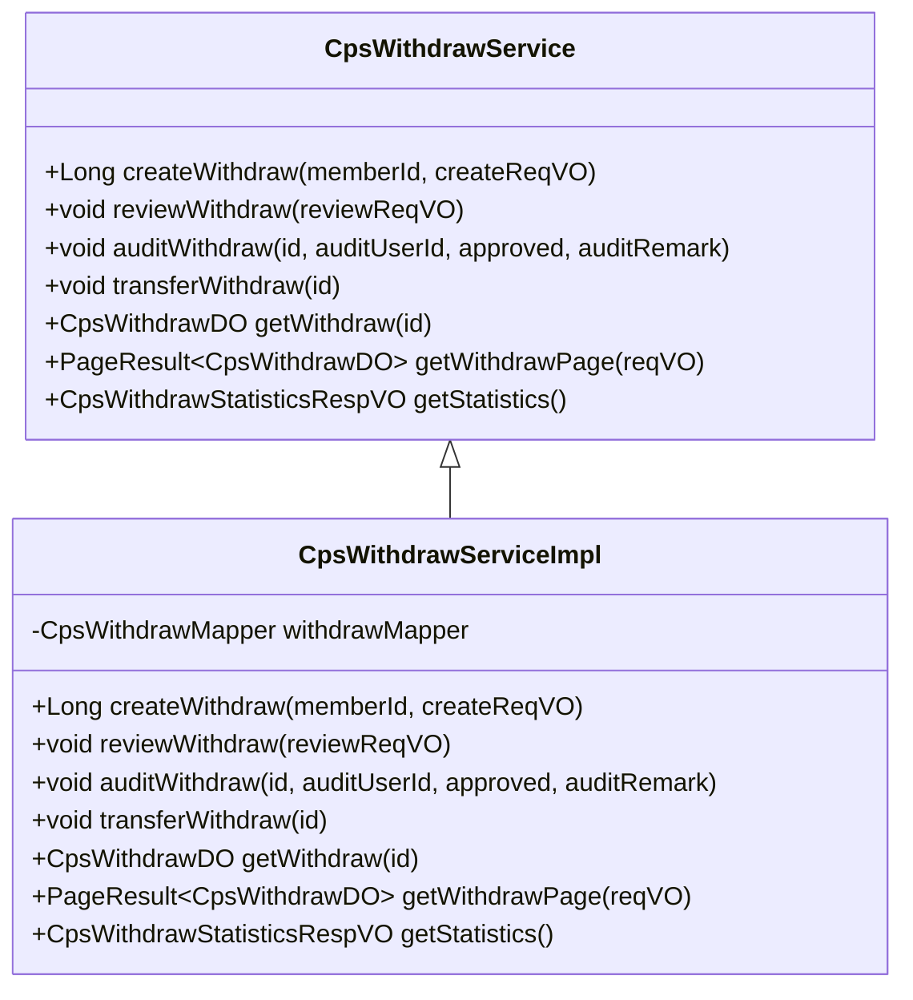
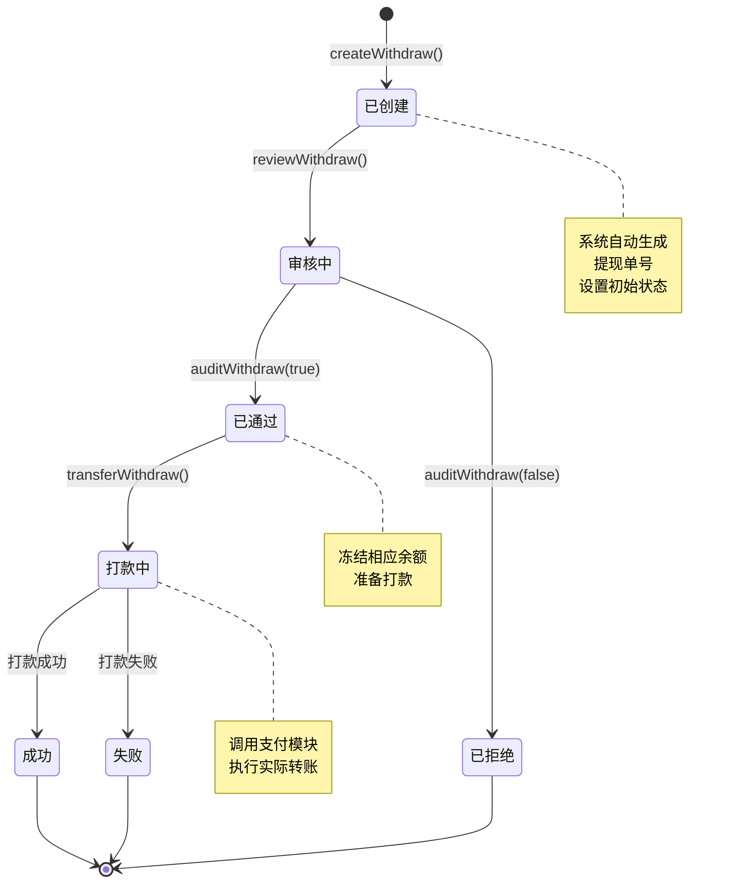
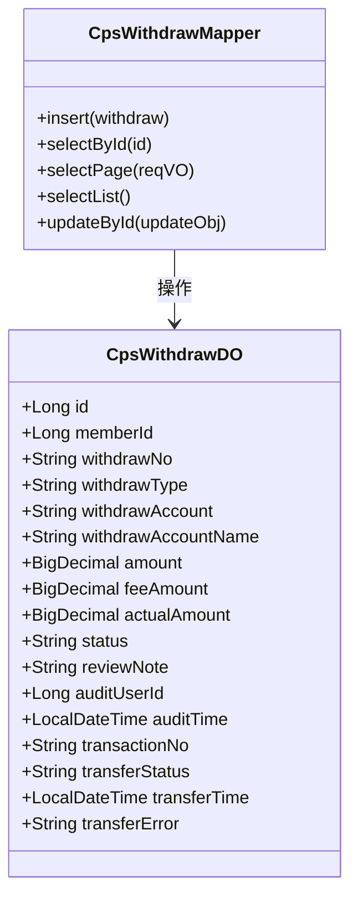
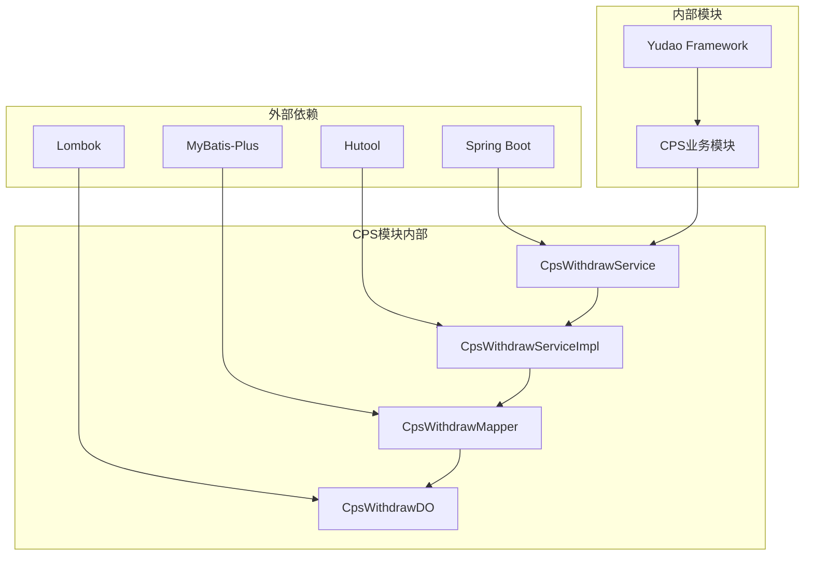
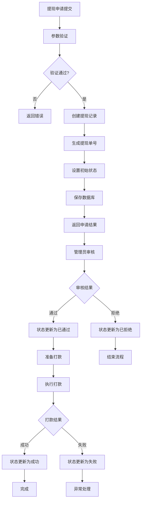

# 提现管理接口

<cite>
**本文档引用的文件**
- [CpsWithdrawService.java](file://yudao-module-cps/yudao-module-cps-biz/src/main/java/cn/zhijian/cps/service/CpsWithdrawService.java)
- [CpsWithdrawServiceImpl.java](file://yudao-module-cps/yudao-module-cps-biz/src/main/java/cn/zhijian/cps/service/CpsWithdrawServiceImpl.java)
- [CpsWithdrawDO.java](file://yudao-module-cps/yudao-module-cps-biz/src/main/java/cn/zhijian/cps/dal/dataobject/CpsWithdrawDO.java)
- [CpsWithdrawStatusEnum.java](file://yudao-module-cps/yudao-module-cps-biz/src/main/java/cn/zhijian/cps/enums/CpsWithdrawStatusEnum.java)
- [CpsWithdrawTypeEnum.java](file://yudao-module-cps/yudao-module-cps-biz/src/main/java/cn/zhijian/cps/enums/CpsWithdrawTypeEnum.java)
- [CpsWithdrawMapper.java](file://yudao-module-cps/yudao-module-cps-biz/src/main/java/cn/zhijian/cps/dal/mysql/CpsWithdrawMapper.java)
- [CpsWithdrawConvert.java](file://yudao-module-cps/yudao-module-cps-biz/src/main/java/cn/zhijian/cps/convert/CpsWithdrawConvert.java)
</cite>

## 目录
1. [简介](#简介)
2. [项目结构](#项目结构)
3. [核心组件](#核心组件)
4. [架构概览](#架构概览)
5. [详细组件分析](#详细组件分析)
6. [依赖关系分析](#依赖关系分析)
7. [性能考虑](#性能考虑)
8. [故障排除指南](#故障排除指南)
9. [结论](#结论)

## 简介

CPS提现管理系统是一个基于RuoYi微服务架构的企业级分销佣金提现管理平台。该系统提供了完整的提现生命周期管理功能，包括提现申请、审核、打款、对账等核心业务流程。

本系统采用模块化设计，将CPS业务逻辑与核心框架分离，通过清晰的分层架构实现了高内聚、低耦合的系统设计。系统支持多种提现方式（支付宝、微信、银行卡），具备完善的风险控制机制和审计跟踪功能。

## 项目结构

CPS提现管理模块位于`yudao-module-cps`目录下，采用标准的Maven多模块结构：

**图表来源**
- [CpsWithdrawService.java:1-44](file://yudao-module-cps/yudao-module-cps-biz/src/main/java/cn/zhijian/cps/service/CpsWithdrawService.java#L1-L44)
- [CpsWithdrawServiceImpl.java:1-152](file://yudao-module-cps/yudao-module-cps-biz/src/main/java/cn/zhijian/cps/service/CpsWithdrawServiceImpl.java#L1-L152)

**章节来源**
- [CpsWithdrawService.java:1-44](file://yudao-module-cps/yudao-module-cps-biz/src/main/java/cn/zhijian/cps/service/CpsWithdrawService.java#L1-L44)
- [CpsWithdrawServiceImpl.java:1-152](file://yudao-module-cps/yudao-module-cps-biz/src/main/java/cn/zhijian/cps/service/CpsWithdrawServiceImpl.java#L1-L152)

## 核心组件

### 数据模型设计

CPS提现系统的核心数据模型围绕`CpsWithdrawDO`展开，该实体类定义了完整的提现业务数据结构：

**图表来源**
- [CpsWithdrawDO.java:12-59](file://yudao-module-cps/yudao-module-cps-biz/src/main/java/cn/zhijian/cps/dal/dataobject/CpsWithdrawDO.java#L12-L59)

### 枚举类型体系

系统通过枚举类型确保业务状态的一致性和完整性：

| 枚举类型 | 描述 | 主要值 |
|---------|------|--------|
| CpsWithdrawStatusEnum | 提现状态枚举 | CREATED, REVIEWING, PASSED, REJECTED, FAILED, SUCCESS |
| CpsWithdrawTypeEnum | 提现类型枚举 | ALIPAY, WECHAT, BANK |

**章节来源**
- [CpsWithdrawDO.java:12-59](file://yudao-module-cps/yudao-module-cps-biz/src/main/java/cn/zhijian/cps/dal/dataobject/CpsWithdrawDO.java#L12-L59)
- [CpsWithdrawStatusEnum.java](file://yudao-module-cps/yudao-module-cps-biz/src/main/java/cn/zhijian/cps/enums/CpsWithdrawStatusEnum.java)
- [CpsWithdrawTypeEnum.java](file://yudao-module-cps/yudao-module-cps-biz/src/main/java/cn/zhijian/cps/enums/CpsWithdrawTypeEnum.java)

## 架构概览

CPS提现管理系统采用经典的三层架构模式，结合领域驱动设计原则：

**图表来源**
- [CpsWithdrawService.java:1-44](file://yudao-module-cps/yudao-module-cps-biz/src/main/java/cn/zhijian/cps/service/CpsWithdrawService.java#L1-L44)
- [CpsWithdrawServiceImpl.java:1-152](file://yudao-module-cps/yudao-module-cps-biz/src/main/java/cn/zhijian/cps/service/CpsWithdrawServiceImpl.java#L1-L152)

### 业务流程架构

系统通过职责链模式实现复杂的业务流程控制：

**图表来源**
- [CpsWithdrawServiceImpl.java:35-46](file://yudao-module-cps/yudao-module-cps-biz/src/main/java/cn/zhijian/cps/service/CpsWithdrawServiceImpl.java#L35-L46)

## 详细组件分析

### 提现服务接口

CpsWithdrawService定义了完整的提现管理接口规范：

**图表来源**
- [CpsWithdrawService.java:12-43](file://yudao-module-cps/yudao-module-cps-biz/src/main/java/cn/zhijian/cps/service/CpsWithdrawService.java#L12-L43)
- [CpsWithdrawServiceImpl.java:30-151](file://yudao-module-cps/yudao-module-cps-biz/src/main/java/cn/zhijian/cps/service/CpsWithdrawServiceImpl.java#L30-L151)

### 提现状态管理

系统通过状态机模式管理提现的完整生命周期：

**图表来源**
- [CpsWithdrawServiceImpl.java:63-86](file://yudao-module-cps/yudao-module-cps-biz/src/main/java/cn/zhijian/cps/service/CpsWithdrawServiceImpl.java#L63-L86)
- [CpsWithdrawServiceImpl.java:89-122](file://yudao-module-cps/yudao-module-cps-biz/src/main/java/cn/zhijian/cps/service/CpsWithdrawServiceImpl.java#L89-L122)

### 核心业务方法详解

#### 提现申请创建

`createWithdraw`方法负责处理用户提现申请的创建流程：

**方法签名**: `Long createWithdraw(Long memberId, AppCpsWithdrawCreateReqVO createReqVO)`

**处理流程**:
1. 参数验证和数据转换
2. 生成唯一提现单号（W+雪花算法ID）
3. 初始化状态为"created"
4. 设置默认手续费为0
5. 计算实际到账金额
6. 持久化到数据库

#### 提现审核流程

`auditWithdraw`方法实现管理员审核功能：

**方法签名**: `void auditWithdraw(Long id, Long auditUserId, Boolean approved, String auditRemark)`

**审核逻辑**:
- 审核通过：状态转为"passed"，准备打款
- 审核拒绝：状态转为"rejected"，释放冻结资金
- 记录审核人和审核时间
- 支持审核备注记录

#### 打款执行流程

`transferWithdraw`方法负责实际的资金转账操作：

**方法签名**: `void transferWithdraw(Long id)`

**打款流程**:
1. 验证提现状态必须为"passed"
2. 更新状态为"PROCESSING"
3. 调用支付模块执行转账
4. 处理打款结果并更新状态
5. 记录交易流水号和时间

**章节来源**
- [CpsWithdrawService.java:14-41](file://yudao-module-cps/yudao-module-cps-biz/src/main/java/cn/zhijian/cps/service/CpsWithdrawService.java#L14-L41)
- [CpsWithdrawServiceImpl.java:35-122](file://yudao-module-cps/yudao-module-cps-biz/src/main/java/cn/zhijian/cps/service/CpsWithdrawServiceImpl.java#L35-L122)

### 数据访问层设计

CpsWithdrawMapper提供完整的数据持久化操作：

**图表来源**
- [CpsWithdrawMapper.java](file://yudao-module-cps/yudao-module-cps-biz/src/main/java/cn/zhijian/cps/dal/mysql/CpsWithdrawMapper.java)
- [CpsWithdrawDO.java:22-59](file://yudao-module-cps/yudao-module-cps-biz/src/main/java/cn/zhijian/cps/dal/dataobject/CpsWithdrawDO.java#L22-L59)

**章节来源**
- [CpsWithdrawMapper.java](file://yudao-module-cps/yudao-module-cps-biz/src/main/java/cn/zhijian/cps/dal/mysql/CpsWithdrawMapper.java)
- [CpsWithdrawDO.java:12-59](file://yudao-module-cps/yudao-module-cps-biz/src/main/java/cn/zhijian/cps/dal/dataobject/CpsWithdrawDO.java#L12-L59)

## 依赖关系分析

### 组件间依赖关系

**图表来源**
- [CpsWithdrawServiceImpl.java:1-20](file://yudao-module-cps/yudao-module-cps-biz/src/main/java/cn/zhijian/cps/service/CpsWithdrawServiceImpl.java#L1-L20)
- [CpsWithdrawDO.java:1-10](file://yudao-module-cps/yudao-module-cps-biz/src/main/java/cn/zhijian/cps/dal/dataobject/CpsWithdrawDO.java#L1-L10)

### 数据流分析

系统采用事件驱动的数据流模式：

**图表来源**
- [CpsWithdrawServiceImpl.java:35-122](file://yudao-module-cps/yudao-module-cps-biz/src/main/java/cn/zhijian/cps/service/CpsWithdrawServiceImpl.java#L35-L122)

**章节来源**
- [CpsWithdrawServiceImpl.java:1-152](file://yudao-module-cps/yudao-module-cps-biz/src/main/java/cn/zhijian/cps/service/CpsWithdrawServiceImpl.java#L1-L152)

## 性能考虑

### 数据库优化策略

1. **索引设计**: 在关键查询字段上建立适当索引
2. **分页查询**: 使用MyBatis-Plus的分页插件优化大数据量查询
3. **批量操作**: 支持批量状态更新以提高效率

### 缓存策略

1. **热点数据缓存**: 对频繁查询的状态统计数据进行缓存
2. **分布式锁**: 使用Redis实现并发控制
3. **异步处理**: 通过消息队列实现非阻塞操作

### 并发控制

系统采用乐观锁机制防止并发更新冲突，确保数据一致性。

## 故障排除指南

### 常见问题及解决方案

| 问题类型 | 症状描述 | 可能原因 | 解决方案 |
|---------|----------|----------|----------|
| 提现状态异常 | 状态无法正常流转 | 业务逻辑错误或数据不一致 | 检查状态转换条件和数据完整性 |
| 打款失败 | 交易状态显示失败 | 支付接口异常或参数错误 | 查看transferError字段获取详细错误信息 |
| 并发冲突 | 数据更新失败 | 多用户同时操作同一记录 | 实施分布式锁或重试机制 |
| 查询超时 | 分页查询响应慢 | 缺少必要索引或查询条件不当 | 优化SQL查询和添加索引 |

### 错误码对照表

| 错误码 | 错误描述 | 业务含义 |
|--------|----------|----------|
| WITHDRAW_NOT_EXISTS | 提现记录不存在 | 操作的提现记录已被删除或ID错误 |
| WITHDRAW_STATUS_INVALID | 提现状态无效 | 当前状态不允许执行该操作 |
| WITHDRAW_AMOUNT_INVALID | 提现金额无效 | 提现金额小于等于0或超过限额 |

**章节来源**
- [CpsWithdrawServiceImpl.java:140-149](file://yudao-module-cps/yudao-module-cps-biz/src/main/java/cn/zhijian/cps/service/CpsWithdrawServiceImpl.java#L140-L149)

## 结论

CPS提现管理系统通过模块化的架构设计和完善的业务流程控制，为企业提供了可靠的分销佣金提现管理解决方案。系统具备以下优势：

1. **架构清晰**: 采用分层架构，职责明确，易于维护和扩展
2. **业务完整**: 覆盖提现管理的全生命周期，从申请到对账
3. **安全可靠**: 完善的风险控制和审计机制
4. **性能优秀**: 通过合理的数据库设计和缓存策略保证系统性能
5. **扩展性强**: 模块化设计便于功能扩展和业务变更

系统在实际部署中建议重点关注数据库性能优化、消息队列配置和监控告警系统的建设，以确保系统的稳定运行和良好的用户体验。