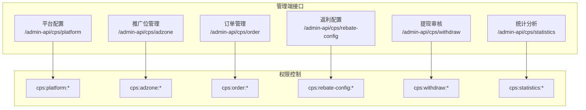
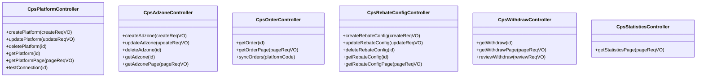
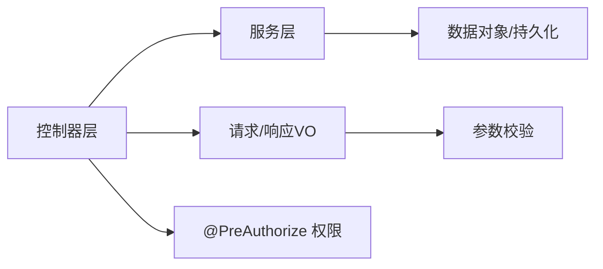

# 管理端管理接口

<cite>
**本文引用的文件**
- [CpsPlatformController.java](file://yudao-module-cps/yudao-module-cps-biz/src/main/java/cn/zhijian/cps/controller/admin/CpsPlatformController.java)
- [CpsAdzoneController.java](file://yudao-module-cps/yudao-module-cps-biz/src/main/java/cn/zhijian/cps/controller/admin/CpsAdzoneController.java)
- [CpsOrderController.java](file://yudao-module-cps/yudao-module-cps-biz/src/main/java/cn/zhijian/cps/controller/admin/CpsOrderController.java)
- [CpsRebateConfigController.java](file://yudao-module-cps/yudao-module-cps-biz/src/main/java/cn/zhijian/cps/controller/admin/CpsRebateConfigController.java)
- [CpsWithdrawController.java](file://yudao-module-cps/yudao-module-cps-biz/src/main/java/cn/zhijian/cps/controller/admin/CpsWithdrawController.java)
- [CpsStatisticsController.java](file://yudao-module-cps/yudao-module-cps-biz/src/main/java/cn/zhijian/cps/controller/admin/CpsStatisticsController.java)
- [CpsPlatformSaveReqVO.java](file://yudao-module-cps/yudao-module-cps-biz/src/main/java/cn/zhijian/cps/controller/admin/vo/platform/CpsPlatformSaveReqVO.java)
- [CpsAdzoneSaveReqVO.java](file://yudao-module-cps/yudao-module-cps-biz/src/main/java/cn/zhijian/cps/controller/admin/vo/adzone/CpsAdzoneSaveReqVO.java)
- [CpsOrderPageReqVO.java](file://yudao-module-cps/yudao-module-cps-biz/src/main/java/cn/zhijian/cps/controller/admin/vo/order/CpsOrderPageReqVO.java)
- [CpsRebateConfigSaveReqVO.java](file://yudao-module-cps/yudao-module-cps-biz/src/main/java/cn/zhijian/cps/controller/admin/vo/rebateconfig/CpsRebateConfigSaveReqVO.java)
- [CpsWithdrawReviewReqVO.java](file://yudao-module-cps/yudao-module-cps-biz/src/main/java/cn/zhijian/cps/controller/admin/vo/withdraw/CpsWithdrawReviewReqVO.java)
</cite>

## 目录
1. [简介](#简介)
2. [项目结构](#项目结构)
3. [核心组件](#核心组件)
4. [架构总览](#架构总览)
5. [详细组件分析](#详细组件分析)
6. [依赖关系分析](#依赖关系分析)
7. [性能考虑](#性能考虑)
8. [故障排查指南](#故障排查指南)
9. [结论](#结论)
10. [附录](#附录)

## 简介
本文件为管理端管理接口的完整API文档，覆盖平台配置管理、推广位管理、订单管理、返利配置、提现审核、统计分析六大模块，共计15个管理端接口。文档详细说明每个接口的CRUD操作、分页查询、权限控制、数据验证规则，并提供接口调用示例、批量操作建议、统计报表查询条件与返回格式说明，以及安全机制、权限分级与数据范围控制等特性。

## 项目结构
管理端接口位于CPS业务模块的admin控制器包中，采用按功能域划分的REST风格设计，统一前缀为/admin-api/cps/{resource}，并以权限注解进行访问控制。

**图表来源**
- [CpsPlatformController.java:22-80](file://yudao-module-cps/yudao-module-cps-biz/src/main/java/cn/zhijian/cps/controller/admin/CpsPlatformController.java#L22-L80)
- [CpsAdzoneController.java:22-72](file://yudao-module-cps/yudao-module-cps-biz/src/main/java/cn/zhijian/cps/controller/admin/CpsAdzoneController.java#L22-L72)
- [CpsOrderController.java:21-56](file://yudao-module-cps/yudao-module-cps-biz/src/main/java/cn/zhijian/cps/controller/admin/CpsOrderController.java#L21-L56)
- [CpsRebateConfigController.java:22-72](file://yudao-module-cps/yudao-module-cps-biz/src/main/java/cn/zhijian/cps/controller/admin/CpsRebateConfigController.java#L22-L72)
- [CpsWithdrawController.java:22-56](file://yudao-module-cps/yudao-module-cps-biz/src/main/java/cn/zhijian/cps/controller/admin/CpsWithdrawController.java#L22-L56)
- [CpsStatisticsController.java:22-39](file://yudao-module-cps/yudao-module-cps-biz/src/main/java/cn/zhijian/cps/controller/admin/CpsStatisticsController.java#L22-L39)

**章节来源**
- [CpsPlatformController.java:22-80](file://yudao-module-cps/yudao-module-cps-biz/src/main/java/cn/zhijian/cps/controller/admin/CpsPlatformController.java#L22-L80)
- [CpsAdzoneController.java:22-72](file://yudao-module-cps/yudao-module-cps-biz/src/main/java/cn/zhijian/cps/controller/admin/CpsAdzoneController.java#L22-L72)
- [CpsOrderController.java:21-56](file://yudao-module-cps/yudao-module-cps-biz/src/main/java/cn/zhijian/cps/controller/admin/CpsOrderController.java#L21-L56)
- [CpsRebateConfigController.java:22-72](file://yudao-module-cps/yudao-module-cps-biz/src/main/java/cn/zhijian/cps/controller/admin/CpsRebateConfigController.java#L22-L72)
- [CpsWithdrawController.java:22-56](file://yudao-module-cps/yudao-module-cps-biz/src/main/java/cn/zhijian/cps/controller/admin/CpsWithdrawController.java#L22-L56)
- [CpsStatisticsController.java:22-39](file://yudao-module-cps/yudao-module-cps-biz/src/main/java/cn/zhijian/cps/controller/admin/CpsStatisticsController.java#L22-L39)

## 核心组件
- 平台配置管理：支持创建、修改、删除、查询、分页查询、连通性测试。
- 推广位管理：支持创建、修改、删除、查询、分页查询。
- 订单管理：支持查询详情、分页查询、手动同步订单。
- 返利配置：支持创建、修改、删除、查询、分页查询。
- 提现审核：支持查询详情、分页查询、审核操作。
- 统计分析：支持分页查询统计数据。

以上接口均使用Spring Security的@PreAuthorize进行权限控制，请求参数使用VO类进行校验，响应统一使用CommonResult包装。

**章节来源**
- [CpsPlatformController.java:31-78](file://yudao-module-cps/yudao-module-cps-biz/src/main/java/cn/zhijian/cps/controller/admin/CpsPlatformController.java#L31-L78)
- [CpsAdzoneController.java:31-70](file://yudao-module-cps/yudao-module-cps-biz/src/main/java/cn/zhijian/cps/controller/admin/CpsAdzoneController.java#L31-L70)
- [CpsOrderController.java:30-54](file://yudao-module-cps/yudao-module-cps-biz/src/main/java/cn/zhijian/cps/controller/admin/CpsOrderController.java#L30-L54)
- [CpsRebateConfigController.java:31-70](file://yudao-module-cps/yudao-module-cps-biz/src/main/java/cn/zhijian/cps/controller/admin/CpsRebateConfigController.java#L31-L70)
- [CpsWithdrawController.java:31-54](file://yudao-module-cps/yudao-module-cps-biz/src/main/java/cn/zhijian/cps/controller/admin/CpsWithdrawController.java#L31-L54)
- [CpsStatisticsController.java:31-37](file://yudao-module-cps/yudao-module-cps-biz/src/main/java/cn/zhijian/cps/controller/admin/CpsStatisticsController.java#L31-L37)

## 架构总览
管理端接口遵循“控制器-服务-数据对象”的分层架构，控制器负责HTTP请求映射与权限校验，服务层处理业务逻辑，数据对象承载持久化字段。

**图表来源**
- [CpsPlatformController.java:22-80](file://yudao-module-cps/yudao-module-cps-biz/src/main/java/cn/zhijian/cps/controller/admin/CpsPlatformController.java#L22-L80)
- [CpsAdzoneController.java:22-72](file://yudao-module-cps/yudao-module-cps-biz/src/main/java/cn/zhijian/cps/controller/admin/CpsAdzoneController.java#L22-L72)
- [CpsOrderController.java:21-56](file://yudao-module-cps/yudao-module-cps-biz/src/main/java/cn/zhijian/cps/controller/admin/CpsOrderController.java#L21-L56)
- [CpsRebateConfigController.java:22-72](file://yudao-module-cps/yudao-module-cps-biz/src/main/java/cn/zhijian/cps/controller/admin/CpsRebateConfigController.java#L22-L72)
- [CpsWithdrawController.java:22-56](file://yudao-module-cps/yudao-module-cps-biz/src/main/java/cn/zhijian/cps/controller/admin/CpsWithdrawController.java#L22-L56)
- [CpsStatisticsController.java:22-39](file://yudao-module-cps/yudao-module-cps-biz/src/main/java/cn/zhijian/cps/controller/admin/CpsStatisticsController.java#L22-L39)

## 详细组件分析

### 平台配置管理（/admin-api/cps/platform）
- 创建平台配置
  - 方法：POST
  - 路径：/admin-api/cps/platform/create
  - 权限：cps:platform:create
  - 请求体：CpsPlatformSaveReqVO
  - 返回：Long（主键ID）
- 修改平台配置
  - 方法：PUT
  - 路径：/admin-api/cps/platform/update
  - 权限：cps:platform:update
  - 请求体：CpsPlatformSaveReqVO
  - 返回：Boolean（true）
- 删除平台配置
  - 方法：DELETE
  - 路径：/admin-api/cps/platform/delete?id={id}
  - 权限：cps:platform:delete
  - 查询参数：id（Long，必填）
  - 返回：Boolean（true）
- 获取平台配置
  - 方法：GET
  - 路径：/admin-api/cps/platform/get?id={id}
  - 权限：cps:platform:query
  - 查询参数：id（Long，必填）
  - 返回：CpsPlatformRespVO
- 分页查询平台配置
  - 方法：GET
  - 路径：/admin-api/cps/platform/page
  - 权限：cps:platform:query
  - 查询参数：分页参数与过滤条件（见VO定义）
  - 返回：PageResult<CpsPlatformRespVO>
- 测试平台连通性
  - 方法：POST
  - 路径：/admin-api/cps/platform/test-connection?id={id}
  - 权限：cps:platform:update
  - 查询参数：id（Long，必填）
  - 返回：Boolean（连通性结果）

请求参数校验要点（节选）：
- 平台编码、平台名称、AppKey、AppSecret、默认推广位ID、状态为必填
- 排序权重、平台服务费率可为空
- 扩展配置为JSON字符串，备注可为空

接口调用示例（示意）：
- 创建：POST /admin-api/cps/platform/create（Body：CpsPlatformSaveReqVO）
- 查询详情：GET /admin-api/cps/platform/get?id=1
- 分页：GET /admin-api/cps/platform/page?page=1&size=10&platformCode=taobao
- 测试连通性：POST /admin-api/cps/platform/test-connection?id=1

**章节来源**
- [CpsPlatformController.java:31-78](file://yudao-module-cps/yudao-module-cps-biz/src/main/java/cn/zhijian/cps/controller/admin/CpsPlatformController.java#L31-L78)
- [CpsPlatformSaveReqVO.java:10-62](file://yudao-module-cps/yudao-module-cps-biz/src/main/java/cn/zhijian/cps/controller/admin/vo/platform/CpsPlatformSaveReqVO.java#L10-L62)

### 推广位管理（/admin-api/cps/adzone）
- 创建推广位
  - 方法：POST
  - 路径：/admin-api/cps/adzone/create
  - 权限：cps:adzone:create
  - 请求体：CpsAdzoneSaveReqVO
  - 返回：Long（主键ID）
- 修改推广位
  - 方法：PUT
  - 路径：/admin-api/cps/adzone/update
  - 权限：cps:adzone:update
  - 请求体：CpsAdzoneSaveReqVO
  - 返回：Boolean（true）
- 删除推广位
  - 方法：DELETE
  - 路径：/admin-api/cps/adzone/delete?id={id}
  - 权限：cps:adzone:delete
  - 查询参数：id（Long，必填）
  - 返回：Boolean（true）
- 获取推广位
  - 方法：GET
  - 路径：/admin-api/cps/adzone/get?id={id}
  - 权限：cps:adzone:query
  - 查询参数：id（Long，必填）
  - 返回：CpsAdzoneRespVO
- 分页查询推广位
  - 方法：GET
  - 路径：/admin-api/cps/adzone/page
  - 权限：cps:adzone:query
  - 查询参数：分页参数与过滤条件（见VO定义）
  - 返回：PageResult<CpsAdzoneRespVO>

请求参数校验要点（节选）：
- 所属平台编码、推广位ID、状态为必填
- 推广位名称、类型、关联类型、关联ID、是否默认可为空
- 关联ID需为Long类型

接口调用示例（示意）：
- 创建：POST /admin-api/cps/adzone/create（Body：CpsAdzoneSaveReqVO）
- 查询详情：GET /admin-api/cps/adzone/get?id=1
- 分页：GET /admin-api/cps/adzone/page?page=1&size=10&platformCode=taobao

**章节来源**
- [CpsAdzoneController.java:31-70](file://yudao-module-cps/yudao-module-cps-biz/src/main/java/cn/zhijian/cps/controller/admin/CpsAdzoneController.java#L31-L70)
- [CpsAdzoneSaveReqVO.java:8-42](file://yudao-module-cps/yudao-module-cps-biz/src/main/java/cn/zhijian/cps/controller/admin/vo/adzone/CpsAdzoneSaveReqVO.java#L8-L42)

### 订单管理（/admin-api/cps/order）
- 获取订单详情
  - 方法：GET
  - 路径：/admin-api/cps/order/get?id={id}
  - 权限：cps:order:query
  - 查询参数：id（Long，必填）
  - 返回：CpsOrderRespVO
- 订单分页查询
  - 方法：GET
  - 路径：/admin-api/cps/order/page
  - 权限：cps:order:query
  - 查询参数：分页参数与过滤条件（见VO定义）
  - 返回：PageResult<CpsOrderRespVO>
- 手动同步订单
  - 方法：POST
  - 路径：/admin-api/cps/order/sync?platformCode={platformCode}
  - 权限：cps:order:sync
  - 查询参数：platformCode（String，必填）
  - 返回：Boolean（true）

请求参数校验要点（节选）：
- 分页参数继承自PageParam
- 过滤条件：平台编码、会员ID、订单状态、创建时间区间

接口调用示例（示意）：
- 查询详情：GET /admin-api/cps/order/get?id=1
- 分页：GET /admin-api/cps/order/page?page=1&size=10&platformCode=taobao&memberId=1001
- 同步：POST /admin-api/cps/order/sync?platformCode=taobao

**章节来源**
- [CpsOrderController.java:30-54](file://yudao-module-cps/yudao-module-cps-biz/src/main/java/cn/zhijian/cps/controller/admin/CpsOrderController.java#L30-L54)
- [CpsOrderPageReqVO.java:14-33](file://yudao-module-cps/yudao-module-cps-biz/src/main/java/cn/zhijian/cps/controller/admin/vo/order/CpsOrderPageReqVO.java#L14-L33)

### 返利配置（/admin-api/cps/rebate-config）
- 创建返利配置
  - 方法：POST
  - 路径：/admin-api/cps/rebate-config/create
  - 权限：cps:rebate-config:create
  - 请求体：CpsRebateConfigSaveReqVO
  - 返回：Long（主键ID）
- 修改返利配置
  - 方法：PUT
  - 路径：/admin-api/cps/rebate-config/update
  - 权限：cps:rebate-config:update
  - 请求体：CpsRebateConfigSaveReqVO
  - 返回：Boolean（true）
- 删除返利配置
  - 方法：DELETE
  - 路径：/admin-api/cps/rebate-config/delete?id={id}
  - 权限：cps:rebate-config:delete
  - 查询参数：id（Long，必填）
  - 返回：Boolean（true）
- 获取返利配置
  - 方法：GET
  - 路径：/admin-api/cps/rebate-config/get?id={id}
  - 权限：cps:rebate-config:query
  - 查询参数：id（Long，必填）
  - 返回：CpsRebateConfigRespVO
- 分页查询返利配置
  - 方法：GET
  - 路径：/admin-api/cps/rebate-config/page
  - 权限：cps:rebate-config:query
  - 查询参数：分页参数与过滤条件（见VO定义）
  - 返回：PageResult<CpsRebateConfigRespVO>

请求参数校验要点（节选）：
- 会员等级ID可为空（表示无等级限制）
- 平台编码可为空（表示全平台）
- 返利比例、状态为必填
- 最大/最小返利金额、优先级可为空

接口调用示例（示意）：
- 创建：POST /admin-api/cps/rebate-config/create（Body：CpsRebateConfigSaveReqVO）
- 查询详情：GET /admin-api/cps/rebate-config/get?id=1
- 分页：GET /admin-api/cps/rebate-config/page?page=1&size=10&platformCode=taobao

**章节来源**
- [CpsRebateConfigController.java:31-70](file://yudao-module-cps/yudao-module-cps-biz/src/main/java/cn/zhijian/cps/controller/admin/CpsRebateConfigController.java#L31-L70)
- [CpsRebateConfigSaveReqVO.java:9-39](file://yudao-module-cps/yudao-module-cps-biz/src/main/java/cn/zhijian/cps/controller/admin/vo/rebateconfig/CpsRebateConfigSaveReqVO.java#L9-L39)

### 提现审核（/admin-api/cps/withdraw）
- 获取提现详情
  - 方法：GET
  - 路径：/admin-api/cps/withdraw/get?id={id}
  - 权限：cps:withdraw:query
  - 查询参数：id（Long，必填）
  - 返回：CpsWithdrawRespVO
- 提现分页查询
  - 方法：GET
  - 路径：/admin-api/cps/withdraw/page
  - 权限：cps:withdraw:query
  - 查询参数：分页参数与过滤条件（见VO定义）
  - 返回：PageResult<CpsWithdrawRespVO>
- 审核提现申请
  - 方法：POST
  - 路径：/admin-api/cps/withdraw/review
  - 权限：cps:withdraw:review
  - 请求体：CpsWithdrawReviewReqVO
  - 返回：Boolean（true）

请求参数校验要点（节选）：
- 审核结果仅允许指定枚举值（如passed/rejected）
- 审核备注可为空

接口调用示例（示意）：
- 查询详情：GET /admin-api/cps/withdraw/get?id=1
- 分页：GET /admin-api/cps/withdraw/page?page=1&size=10&status=pending
- 审核：POST /admin-api/cps/withdraw/review（Body：CpsWithdrawReviewReqVO）

**章节来源**
- [CpsWithdrawController.java:31-54](file://yudao-module-cps/yudao-module-cps-biz/src/main/java/cn/zhijian/cps/controller/admin/CpsWithdrawController.java#L31-L54)
- [CpsWithdrawReviewReqVO.java:8-23](file://yudao-module-cps/yudao-module-cps-biz/src/main/java/cn/zhijian/cps/controller/admin/vo/withdraw/CpsWithdrawReviewReqVO.java#L8-L23)

### 统计分析（/admin-api/cps/statistics）
- 统计数据分页查询
  - 方法：GET
  - 路径：/admin-api/cps/statistics/page
  - 权限：cps:statistics:query
  - 查询参数：分页参数与过滤条件（见VO定义）
  - 返回：PageResult<CpsStatisticsRespVO>

请求参数校验要点（节选）：
- 统计维度由VO定义（如时间范围、平台编码、指标类型等），具体字段以VO为准。

接口调用示例（示意）：
- 分页：GET /admin-api/cps/statistics/page?page=1&size=10&beginTime=...&endTime=...

**章节来源**
- [CpsStatisticsController.java:31-37](file://yudao-module-cps/yudao-module-cps-biz/src/main/java/cn/zhijian/cps/controller/admin/CpsStatisticsController.java#L31-L37)

## 依赖关系分析
- 控制器依赖服务层接口，服务层依赖数据访问层与领域模型
- 权限注解统一在控制器层声明，确保细粒度权限控制
- VO类承担请求参数校验与数据传输职责，保证接口契约清晰

[此图为概念图，不直接对应具体源码文件，故无图表来源]

## 性能考虑
- 分页查询：建议使用PageParam进行分页，避免一次性加载大量数据
- 过滤条件：合理使用平台编码、时间范围等过滤条件，减少数据库扫描
- 批量操作：对于批量删除、批量更新等场景，建议在服务层实现批处理优化，避免循环逐条处理
- 缓存策略：对频繁查询的配置项（如平台配置）可引入缓存，降低数据库压力
- 日志与监控：结合操作审计日志，定位慢查询与异常操作

[本节为通用指导，无需章节来源]

## 故障排查指南
- 权限不足
  - 现象：返回403或无权限提示
  - 处理：确认当前管理员角色是否具备对应权限（cps:resource:operation）
- 参数校验失败
  - 现象：返回参数校验错误
  - 处理：检查请求体字段是否符合VO定义（必填、格式、范围）
- 资源不存在
  - 现象：查询单条记录返回空或报错
  - 处理：确认ID是否存在，或检查数据范围权限
- 平台连通性失败
  - 现象：测试连通性返回false
  - 处理：检查平台配置（AppKey/AppSecret/默认推广位ID）与网络连通性

**章节来源**
- [CpsPlatformController.java:72-78](file://yudao-module-cps/yudao-module-cps-biz/src/main/java/cn/zhijian/cps/controller/admin/CpsPlatformController.java#L72-L78)

## 结论
本文档系统梳理了管理端CPS相关15个接口的规范，明确了各模块的CRUD与分页能力、权限控制、参数校验与调用示例。建议在实际接入时严格遵循权限与参数校验要求，并结合分页与过滤条件提升查询性能；同时完善操作审计与异常处理，保障系统的稳定性与安全性。

[本节为总结性内容，无需章节来源]

## 附录
- 统一返回结构：所有接口返回CommonResult包装，成功时携带数据，失败时携带错误码与消息
- 时间格式：日期时间字段使用标准格式，前端传参时请遵循相应格式
- 扩展配置：平台与返利配置支持扩展字段（JSON格式），请确保格式正确

[本节为通用说明，无需章节来源]