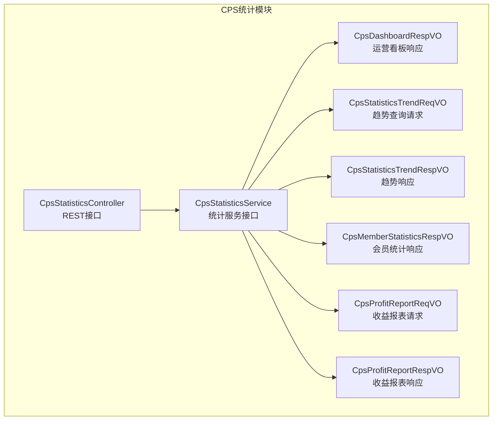
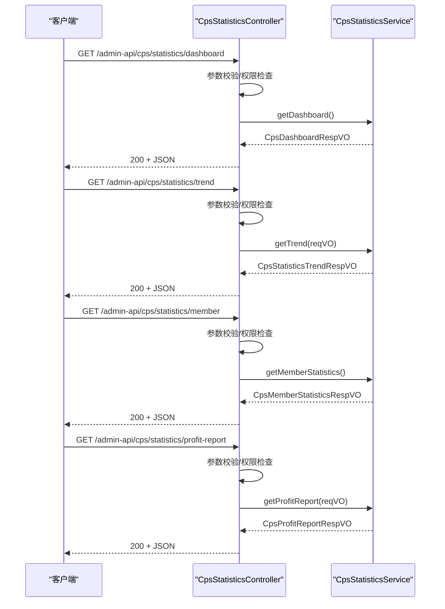
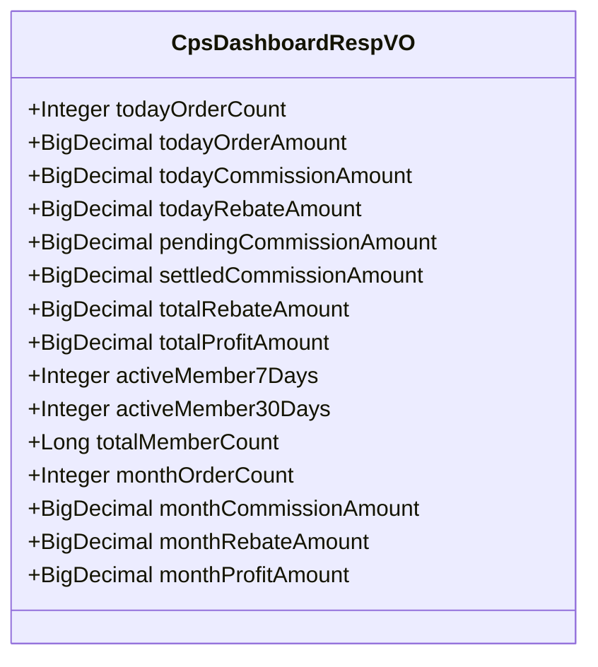
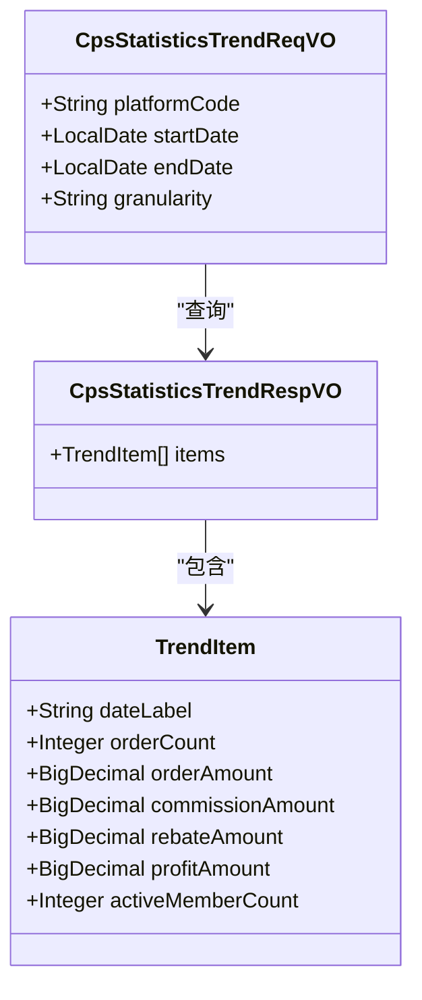
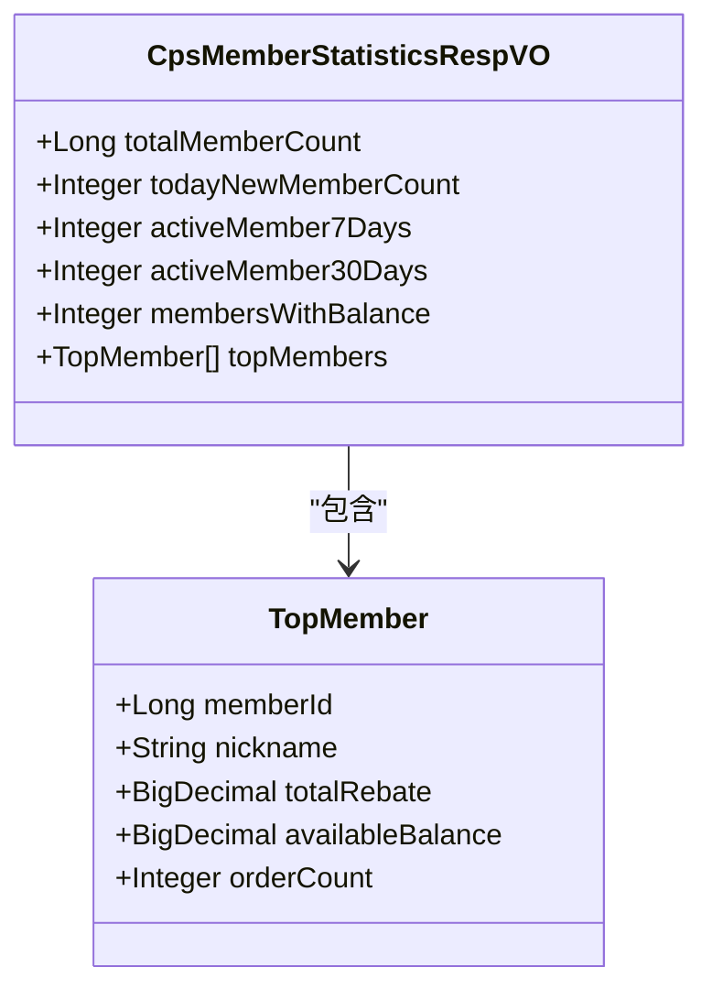
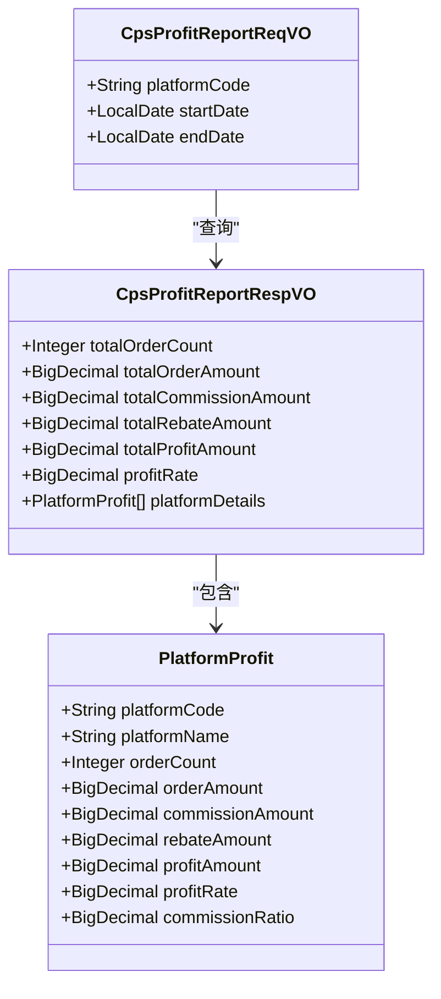
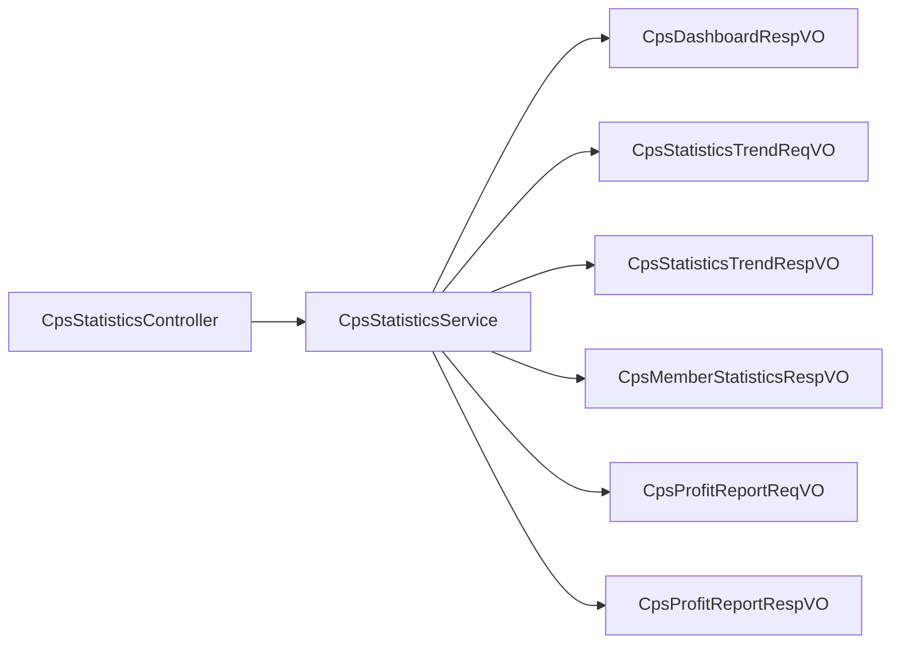

# 统计分析接口

<cite>
**本文引用的文件**
- [CpsStatisticsController.java](file://qiji-module-cps/qiji-module-cps-biz/src/main/java/cn/zhijian/cps/controller/admin/CpsStatisticsController.java)
- [CpsStatisticsService.java](file://qiji-module-cps/qiji-module-cps-biz/src/main/java/cn/zhijian/cps/service/CpsStatisticsService.java)
- [CpsDashboardRespVO.java](file://qiji-module-cps/qiji-module-cps-biz/src/main/java/cn/zhijian/cps/controller/admin/vo/statistics/CpsDashboardRespVO.java)
- [CpsStatisticsTrendReqVO.java](file://qiji-module-cps/qiji-module-cps-biz/src/main/java/cn/zhijian/cps/controller/admin/vo/statistics/CpsStatisticsTrendReqVO.java)
- [CpsStatisticsTrendRespVO.java](file://qiji-module-cps/qiji-module-cps-biz/src/main/java/cn/zhijian/cps/controller/admin/vo/statistics/CpsStatisticsTrendRespVO.java)
- [CpsMemberStatisticsRespVO.java](file://qiji-module-cps/qiji-module-cps-biz/src/main/java/cn/zhijian/cps/controller/admin/vo/statistics/CpsMemberStatisticsRespVO.java)
- [CpsProfitReportReqVO.java](file://qiji-module-cps/qiji-module-cps-biz/src/main/java/cn/zhijian/cps/controller/admin/vo/statistics/CpsProfitReportReqVO.java)
- [CpsProfitReportRespVO.java](file://qiji-module-cps/qiji-module-cps-biz/src/main/java/cn/zhijian/cps/controller/admin/vo/statistics/CpsProfitReportRespVO.java)
- [CPS系统PRD文档.md](file://docs/CPS系统PRD文档.md)
- [README.md](file://README.md)
</cite>

## 目录
1. [简介](#简介)
2. [项目结构](#项目结构)
3. [核心组件](#核心组件)
4. [架构概览](#架构概览)
5. [详细组件分析](#详细组件分析)
6. [依赖关系分析](#依赖关系分析)
7. [性能考虑](#性能考虑)
8. [故障排查指南](#故障排查指南)
9. [结论](#结论)
10. [附录](#附录)

## 简介
本文件面向管理后台的CPS统计分析接口，覆盖运营看板、趋势分析、会员统计与收益报表四大类统计能力。文档详细说明各接口的请求路径、查询条件、返回数据结构、图表数据格式、数据刷新机制与导出能力，并给出统计口径与计算规则，以及数据准确性保障措施。

## 项目结构
CPS统计分析位于后端模块 qiji-module-cps 的业务子模块 qiji-module-cps-biz 中，采用标准的控制层-服务层-视图对象分层设计：
- 控制器层：提供REST接口，定义访问路径与权限控制
- 服务层：封装统计聚合逻辑，负责数据查询与计算
- 视图对象层：定义请求参数与响应结构，确保前后端契约清晰

**图表来源**
- [CpsStatisticsController.java:21-74](file://qiji-module-cps/qiji-module-cps-biz/src/main/java/cn/zhijian/cps/controller/admin/CpsStatisticsController.java#L21-L74)
- [CpsStatisticsService.java:10-56](file://qiji-module-cps/qiji-module-cps-biz/src/main/java/cn/zhijian/cps/service/CpsStatisticsService.java#L10-L56)
- [CpsDashboardRespVO.java:8-69](file://qiji-module-cps/qiji-module-cps-biz/src/main/java/cn/zhijian/cps/controller/admin/vo/statistics/CpsDashboardRespVO.java#L8-L69)
- [CpsStatisticsTrendReqVO.java:9-31](file://qiji-module-cps/qiji-module-cps-biz/src/main/java/cn/zhijian/cps/controller/admin/vo/statistics/CpsStatisticsTrendReqVO.java#L9-L31)
- [CpsStatisticsTrendRespVO.java:12-55](file://qiji-module-cps/qiji-module-cps-biz/src/main/java/cn/zhijian/cps/controller/admin/vo/statistics/CpsStatisticsTrendRespVO.java#L12-L55)
- [CpsMemberStatisticsRespVO.java:12-64](file://qiji-module-cps/qiji-module-cps-biz/src/main/java/cn/zhijian/cps/controller/admin/vo/statistics/CpsMemberStatisticsRespVO.java#L12-L64)
- [CpsProfitReportReqVO.java:9-28](file://qiji-module-cps/qiji-module-cps-biz/src/main/java/cn/zhijian/cps/controller/admin/vo/statistics/CpsProfitReportReqVO.java#L9-L28)
- [CpsProfitReportRespVO.java:12-79](file://qiji-module-cps/qiji-module-cps-biz/src/main/java/cn/zhijian/cps/controller/admin/vo/statistics/CpsProfitReportRespVO.java#L12-L79)

**章节来源**
- [CpsStatisticsController.java:21-74](file://qiji-module-cps/qiji-module-cps-biz/src/main/java/cn/zhijian/cps/controller/admin/CpsStatisticsController.java#L21-L74)
- [CpsStatisticsService.java:10-56](file://qiji-module-cps/qiji-module-cps-biz/src/main/java/cn/zhijian/cps/service/CpsStatisticsService.java#L10-L56)

## 核心组件
- 控制器：提供四个统计接口，均受权限控制，返回统一的通用结果包装
- 服务接口：定义运营看板、趋势分析、会员统计、收益报表等方法签名
- 视图对象：定义请求参数与响应结构，涵盖数值类型、日期范围、粒度、分组明细等

关键职责与边界：
- 控制器仅负责路由、参数校验与权限拦截
- 服务层负责统计聚合、跨表联结与计算
- 视图对象确保前后端契约稳定，避免字段变更引发的兼容问题

**章节来源**
- [CpsStatisticsController.java:21-74](file://qiji-module-cps/qiji-module-cps-biz/src/main/java/cn/zhijian/cps/controller/admin/CpsStatisticsController.java#L21-L74)
- [CpsStatisticsService.java:10-56](file://qiji-module-cps/qiji-module-cps-biz/src/main/java/cn/zhijian/cps/service/CpsStatisticsService.java#L10-L56)

## 架构概览
下图展示了管理后台CPS统计接口的典型调用链：客户端发起HTTP请求，经控制器参数校验与权限校验后，调用服务层进行统计计算，最终返回结构化数据。

**图表来源**
- [CpsStatisticsController.java:42-72](file://qiji-module-cps/qiji-module-cps-biz/src/main/java/cn/zhijian/cps/controller/admin/CpsStatisticsController.java#L42-L72)
- [CpsStatisticsService.java:25-45](file://qiji-module-cps/qiji-module-cps-biz/src/main/java/cn/zhijian/cps/service/CpsStatisticsService.java#L25-L45)

## 详细组件分析

### 接口总览与权限
- 所有接口均位于路径前缀 /admin-api/cps/statistics 下
- 权限注解 @PreAuthorize 指定权限标识为 cps:statistics:query
- 返回统一包装：CommonResult<T>

**章节来源**
- [CpsStatisticsController.java:32-72](file://qiji-module-cps/qiji-module-cps-biz/src/main/java/cn/zhijian/cps/controller/admin/CpsStatisticsController.java#L32-L72)
- [README.md:262-264](file://README.md#L262-L264)

### 运营看板接口
- 路径：GET /admin-api/cps/statistics/dashboard
- 功能：返回今日实时指标、累计/存量指标、会员活跃指标、本月指标
- 关键指标说明：
  - 今日实时：订单数、订单总金额、预估佣金、预估返利
  - 累计/存量：待结算佣金、已结算佣金、总返利支出、平台总利润
  - 会员活跃：近7日活跃会员数、近30日活跃会员数、总会员数
  - 本月：订单数、佣金总额、返利总额、利润

**图表来源**
- [CpsDashboardRespVO.java:11-69](file://qiji-module-cps/qiji-module-cps-biz/src/main/java/cn/zhijian/cps/controller/admin/vo/statistics/CpsDashboardRespVO.java#L11-L69)

**章节来源**
- [CpsStatisticsController.java:42-48](file://qiji-module-cps/qiji-module-cps-biz/src/main/java/cn/zhijian/cps/controller/admin/CpsStatisticsController.java#L42-L48)
- [CpsDashboardRespVO.java:11-69](file://qiji-module-cps/qiji-module-cps-biz/src/main/java/cn/zhijian/cps/controller/admin/vo/statistics/CpsDashboardRespVO.java#L11-L69)

### 趋势分析接口
- 路径：GET /admin-api/cps/statistics/trend
- 查询条件：
  - startDate/endDate：必填，日期范围
  - platformCode：可选，平台编码；不传则全平台
  - granularity：可选，默认按日，支持 day/week/month
- 返回结构：趋势数据列表，每个数据点包含日期标签、订单数、订单金额、佣金、返利、利润、活跃会员数

**图表来源**
- [CpsStatisticsTrendReqVO.java:12-31](file://qiji-module-cps/qiji-module-cps-biz/src/main/java/cn/zhijian/cps/controller/admin/vo/statistics/CpsStatisticsTrendReqVO.java#L12-L31)
- [CpsStatisticsTrendRespVO.java:15-55](file://qiji-module-cps/qiji-module-cps-biz/src/main/java/cn/zhijian/cps/controller/admin/vo/statistics/CpsStatisticsTrendRespVO.java#L15-L55)

**章节来源**
- [CpsStatisticsController.java:50-56](file://qiji-module-cps/qiji-module-cps-biz/src/main/java/cn/zhijian/cps/controller/admin/CpsStatisticsController.java#L50-L56)
- [CpsStatisticsTrendReqVO.java:12-31](file://qiji-module-cps/qiji-module-cps-biz/src/main/java/cn/zhijian/cps/controller/admin/vo/statistics/CpsStatisticsTrendReqVO.java#L12-L31)
- [CpsStatisticsTrendRespVO.java:15-55](file://qiji-module-cps/qiji-module-cps-biz/src/main/java/cn/zhijian/cps/controller/admin/vo/statistics/CpsStatisticsTrendRespVO.java#L15-L55)

### 会员统计接口
- 路径：GET /admin-api/cps/statistics/member
- 返回内容：
  - 总会员数、今日新增有效会员数
  - 近7日/近30日活跃会员数
  - 有可用余额的会员数
  - TOP返利会员排行（成员含会员ID、昵称、累计返利、可用余额、累计订单数）

**图表来源**
- [CpsMemberStatisticsRespVO.java:14-64](file://qiji-module-cps/qiji-module-cps-biz/src/main/java/cn/zhijian/cps/controller/admin/vo/statistics/CpsMemberStatisticsRespVO.java#L14-L64)

**章节来源**
- [CpsStatisticsController.java:58-64](file://qiji-module-cps/qiji-module-cps-biz/src/main/java/cn/zhijian/cps/controller/admin/CpsStatisticsController.java#L58-L64)
- [CpsMemberStatisticsRespVO.java:14-64](file://qiji-module-cps/qiji-module-cps-biz/src/main/java/cn/zhijian/cps/controller/admin/vo/statistics/CpsMemberStatisticsRespVO.java#L14-L64)

### 收益报表接口
- 路径：GET /admin-api/cps/statistics/profit-report
- 查询条件：
  - startDate/endDate：必填，日期范围
  - platformCode：可选，平台编码；不传则全平台
- 返回内容：
  - 总订单数、总订单金额、总佣金收入、总返利支出、总利润、整体利润率
  - 按平台分组的明细：订单数、订单金额、佣金收入、返利支出、净利润、利润率、佣金占比

**图表来源**
- [CpsProfitReportReqVO.java:12-28](file://qiji-module-cps/qiji-module-cps-biz/src/main/java/cn/zhijian/cps/controller/admin/vo/statistics/CpsProfitReportReqVO.java#L12-L28)
- [CpsProfitReportRespVO.java:15-79](file://qiji-module-cps/qiji-module-cps-biz/src/main/java/cn/zhijian/cps/controller/admin/vo/statistics/CpsProfitReportRespVO.java#L15-L79)

**章节来源**
- [CpsStatisticsController.java:66-72](file://qiji-module-cps/qiji-module-cps-biz/src/main/java/cn/zhijian/cps/controller/admin/CpsStatisticsController.java#L66-L72)
- [CpsProfitReportReqVO.java:12-28](file://qiji-module-cps/qiji-module-cps-biz/src/main/java/cn/zhijian/cps/controller/admin/vo/statistics/CpsProfitReportReqVO.java#L12-L28)
- [CpsProfitReportRespVO.java:15-79](file://qiji-module-cps/qiji-module-cps-biz/src/main/java/cn/zhijian/cps/controller/admin/vo/statistics/CpsProfitReportRespVO.java#L15-L79)

### 图表数据格式与展示建议
- 趋势分析：items 数组中的每个元素对应一个时间粒度的数据点，前端可直接绘制折线图或柱状图
- 收益报表：平台分组明细适合用表格或分组柱状图展示；整体利润率与佣金占比适合用卡片或环形图展示
- 会员排行：适合用排行榜表格或条形图展示TOP会员的累计返利

**章节来源**
- [CpsStatisticsTrendRespVO.java:15-55](file://qiji-module-cps/qiji-module-cps-biz/src/main/java/cn/zhijian/cps/controller/admin/vo/statistics/CpsStatisticsTrendRespVO.java#L15-L55)
- [CpsProfitReportRespVO.java:15-79](file://qiji-module-cps/qiji-module-cps-biz/src/main/java/cn/zhijian/cps/controller/admin/vo/statistics/CpsProfitReportRespVO.java#L15-L79)
- [CpsMemberStatisticsRespVO.java:14-64](file://qiji-module-cps/qiji-module-cps-biz/src/main/java/cn/zhijian/cps/controller/admin/vo/statistics/CpsMemberStatisticsRespVO.java#L14-L64)

### 数据刷新机制与导出能力
- 刷新机制：服务层提供定时聚合方法，按日聚合统计数据并写入统计表，供接口查询使用
- 导出能力：接口返回JSON结构，前端可基于返回数据进行导出（如Excel），具体导出按钮与交互由前端实现

**章节来源**
- [CpsStatisticsService.java:47-53](file://qiji-module-cps/qiji-module-cps-biz/src/main/java/cn/zhijian/cps/service/CpsStatisticsService.java#L47-L53)

### 统计口径与计算规则
- 订单与GMV：以订单维度统计，GMV为订单金额汇总
- 佣金与返利：佣金来自平台结算，返利为分配给会员的金额
- 利润：利润 = 佣金 - 返利；整体利润率 = 净利润 / 佣金
- 活跃会员：在指定周期内有下单行为的会员
- 时间粒度：按日/周/月对趋势数据进行聚合

**章节来源**
- [CpsDashboardRespVO.java:15-69](file://qiji-module-cps/qiji-module-cps-biz/src/main/java/cn/zhijian/cps/controller/admin/vo/statistics/CpsDashboardRespVO.java#L15-L69)
- [CpsProfitReportRespVO.java:34-35](file://qiji-module-cps/qiji-module-cps-biz/src/main/java/cn/zhijian/cps/controller/admin/vo/statistics/CpsProfitReportRespVO.java#L34-L35)
- [CpsStatisticsTrendReqVO.java:27-28](file://qiji-module-cps/qiji-module-cps-biz/src/main/java/cn/zhijian/cps/controller/admin/vo/statistics/CpsStatisticsTrendReqVO.java#L27-L28)

### 数据准确性保障措施
- 订单同步延迟与返利入账延迟：系统明确订单同步延迟与返利入账时效要求，保障统计基础数据的及时性
- 平台密钥加密存储与敏感操作审计：降低数据泄露与篡改风险
- 多平台并发查询性能与缓存命中：提升查询性能与稳定性

**章节来源**
- [CPS系统PRD文档.md:972-988](file://docs/CPS系统PRD文档.md#L972-L988)
- [CPS系统PRD文档.md:1008-1016](file://docs/CPS系统PRD文档.md#L1008-L1016)

## 依赖关系分析
- 控制器依赖服务接口，遵循依赖倒置原则
- 视图对象作为DTO，避免直接暴露领域模型
- 服务接口定义了聚合与计算的契约，便于替换实现与扩展

**图表来源**
- [CpsStatisticsController.java:25-28](file://qiji-module-cps/qiji-module-cps-biz/src/main/java/cn/zhijian/cps/controller/admin/CpsStatisticsController.java#L25-L28)
- [CpsStatisticsService.java:13-45](file://qiji-module-cps/qiji-module-cps-biz/src/main/java/cn/zhijian/cps/service/CpsStatisticsService.java#L13-L45)

**章节来源**
- [CpsStatisticsController.java:25-28](file://qiji-module-cps/qiji-module-cps-biz/src/main/java/cn/zhijian/cps/controller/admin/CpsStatisticsController.java#L25-L28)
- [CpsStatisticsService.java:13-45](file://qiji-module-cps/qiji-module-cps-biz/src/main/java/cn/zhijian/cps/service/CpsStatisticsService.java#L13-L45)

## 性能考虑
- 查询性能：单平台搜索P99 < 2秒，多平台比价P99 < 5秒
- 并发能力：支持500并发查询不降级
- 缓存策略：重复搜索响应 < 200ms，建议结合Redis缓存热点数据
- 数据聚合：定时任务按日聚合，减少在线查询压力

**章节来源**
- [CPS系统PRD文档.md:972-981](file://docs/CPS系统PRD文档.md#L972-L981)
- [CPS系统PRD文档.md:1010-1016](file://docs/CPS系统PRD文档.md#L1010-L1016)

## 故障排查指南
- 权限不足：确认是否具备权限标识 cps:statistics:query
- 参数缺失：趋势与收益报表接口要求startDate、endDate必填
- 数据为空：检查定时聚合任务是否执行成功，确认统计表中是否存在目标日期数据
- 性能异常：关注缓存命中率与数据库索引，必要时优化查询条件与分页

**章节来源**
- [CpsStatisticsController.java:32-72](file://qiji-module-cps/qiji-module-cps-biz/src/main/java/cn/zhijian/cps/controller/admin/CpsStatisticsController.java#L32-L72)
- [CpsStatisticsTrendReqVO.java:19-25](file://qiji-module-cps/qiji-module-cps-biz/src/main/java/cn/zhijian/cps/controller/admin/vo/statistics/CpsStatisticsTrendReqVO.java#L19-L25)
- [CpsProfitReportReqVO.java:19-25](file://qiji-module-cps/qiji-module-cps-biz/src/main/java/cn/zhijian/cps/controller/admin/vo/statistics/CpsProfitReportReqVO.java#L19-L25)

## 结论
本文档系统梳理了CPS管理后台统计分析接口的路径、参数、返回结构与计算规则，并给出了性能与数据准确性保障建议。通过统一的视图对象与服务接口，实现了统计能力的清晰分层与稳定扩展。

## 附录
- 接口路径与用途对照
  - GET /admin-api/cps/statistics/dashboard：运营看板
  - GET /admin-api/cps/statistics/trend：趋势分析
  - GET /admin-api/cps/statistics/member：会员统计
  - GET /admin-api/cps/statistics/profit-report：收益报表

**章节来源**
- [README.md:262-264](file://README.md#L262-L264)
- [CPS系统PRD文档.md:955-957](file://docs/CPS系统PRD文档.md#L955-L957)