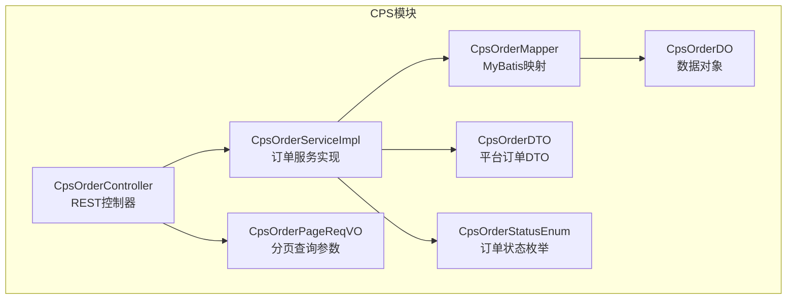
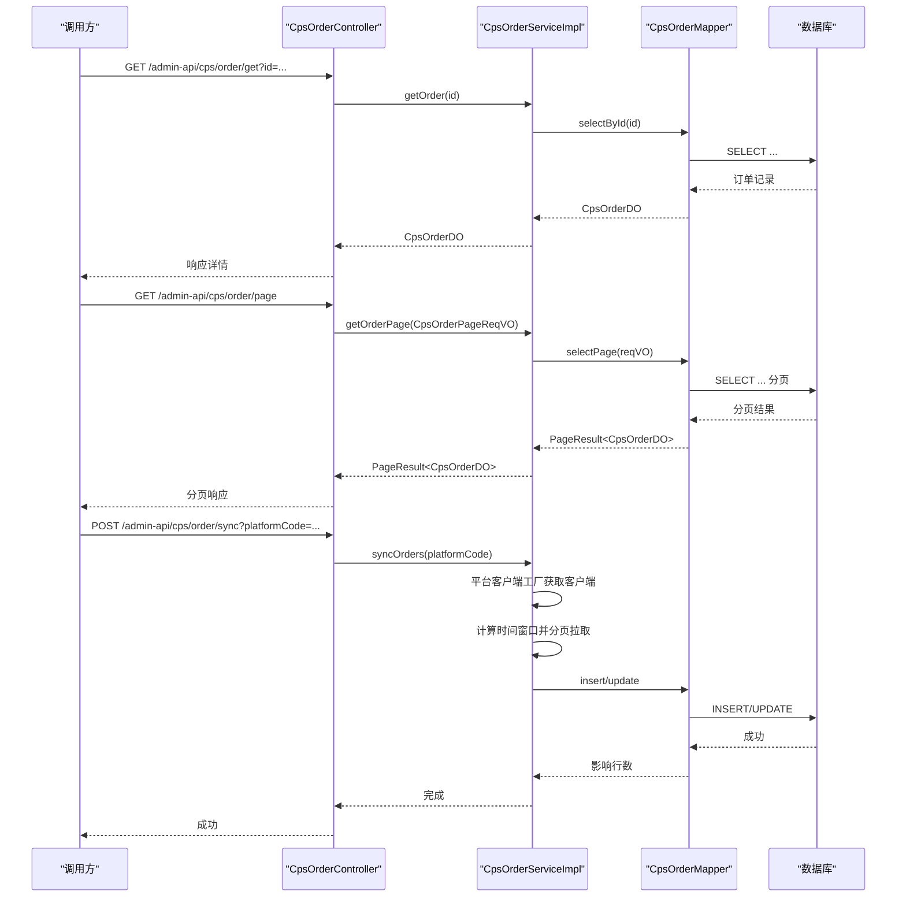
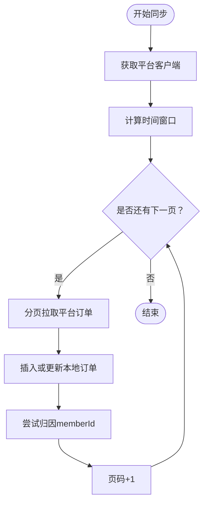
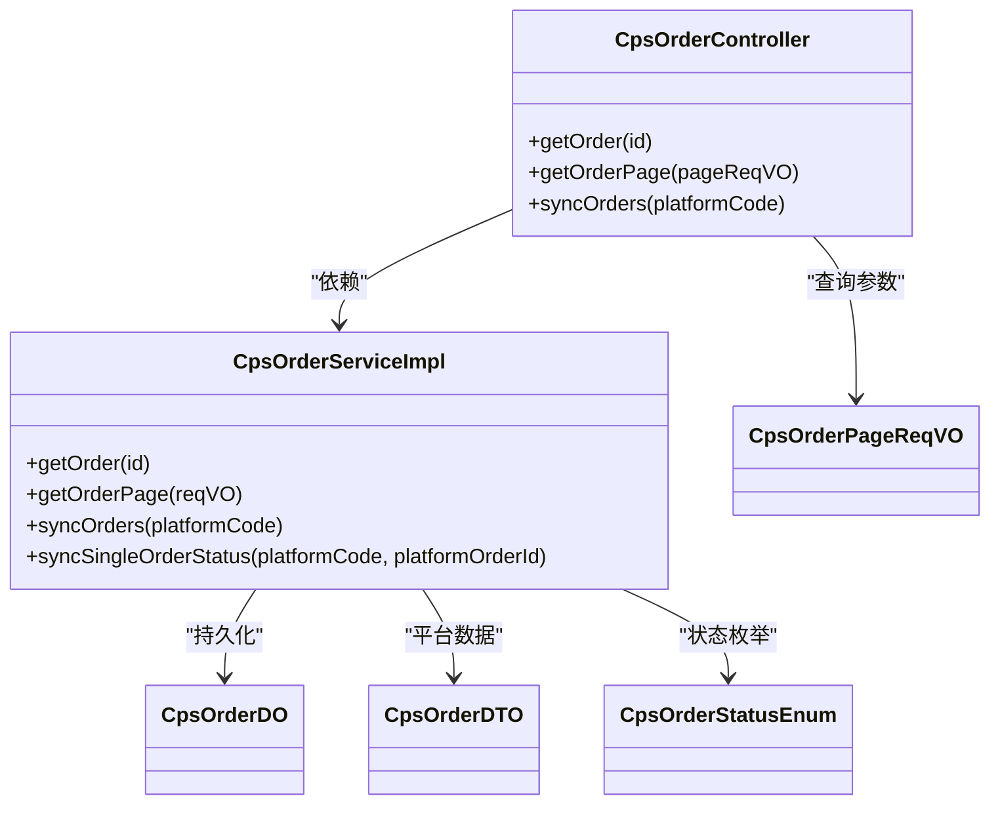

# 订单管理接口

<cite>
**本文引用的文件**
- [CpsOrderController.java](file://yudao-module-cps/yudao-module-cps-biz/src/main/java/cn/zhijian/cps/controller/admin/CpsOrderController.java)
- [CpsOrderServiceImpl.java](file://yudao-module-cps/yudao-module-cps-biz/src/main/java/cn/zhijian/cps/service/CpsOrderServiceImpl.java)
- [CpsOrderDO.java](file://yudao-module-cps/yudao-module-cps-biz/src/main/java/cn/zhijian/cps/dal/dataobject/CpsOrderDO.java)
- [CpsOrderDTO.java](file://yudao-module-cps/yudao-module-cps-biz/src/main/java/cn/zhijian/cps/client/dto/CpsOrderDTO.java)
- [CpsOrderPageReqVO.java](file://yudao-module-cps/yudao-module-cps-biz/src/main/java/cn/zhijian/cps/controller/admin/vo/order/CpsOrderPageReqVO.java)
- [CpsOrderStatusEnum.java](file://yudao-module-cps/yudao-module-cps-biz/src/main/java/cn/zhijian/cps/enums/CpsOrderStatusEnum.java)
</cite>

## 目录
1. [简介](#简介)
2. [项目结构](#项目结构)
3. [核心组件](#核心组件)
4. [架构概览](#架构概览)
5. [详细组件分析](#详细组件分析)
6. [依赖关系分析](#依赖关系分析)
7. [性能考虑](#性能考虑)
8. [故障排查指南](#故障排查指南)
9. [结论](#结论)
10. [附录](#附录)

## 简介
本文件为“CPS订单管理接口”的完整API文档，覆盖以下内容：
- 订单管理相关接口：获取订单分页列表、订单详情查询、手动同步订单
- 订单数据结构与字段说明：订单号、平台订单号、商品信息、佣金金额、结算状态、下单时间等
- 订单查询条件：按时间范围、平台、状态等筛选
- 订单状态流转规则与对账说明
- 权限控制与数据验证规则

注意：当前仓库中未发现“订单状态批量更新”接口的实现，将在“结论”部分说明。

## 项目结构
CPS订单管理位于 yudao-module-cps 子模块中，采用典型的分层架构：
- 控制器层：对外暴露HTTP接口
- 业务层：封装订单同步、查询、状态更新等核心逻辑
- 数据访问层：MyBatis映射数据库表 yudao_cps_order
- DTO/VO：传输对象与视图对象，用于接口参数与响应

图表来源
- [CpsOrderController.java:21-56](file://yudao-module-cps/yudao-module-cps-biz/src/main/java/cn/zhijian/cps/controller/admin/CpsOrderController.java#L21-L56)
- [CpsOrderServiceImpl.java:24-235](file://yudao-module-cps/yudao-module-cps-biz/src/main/java/cn/zhijian/cps/service/CpsOrderServiceImpl.java#L24-L235)
- [CpsOrderDO.java:12-79](file://yudao-module-cps/yudao-module-cps-biz/src/main/java/cn/zhijian/cps/dal/dataobject/CpsOrderDO.java#L12-L79)
- [CpsOrderDTO.java:8-79](file://yudao-module-cps/yudao-module-cps-biz/src/main/java/cn/zhijian/cps/client/dto/CpsOrderDTO.java#L8-L79)
- [CpsOrderPageReqVO.java:14-33](file://yudao-module-cps/yudao-module-cps-biz/src/main/java/cn/zhijian/cps/controller/admin/vo/order/CpsOrderPageReqVO.java#L14-L33)
- [CpsOrderStatusEnum.java:6-30](file://yudao-module-cps/yudao-module-cps-biz/src/main/java/cn/zhijian/cps/enums/CpsOrderStatusEnum.java#L6-L30)

章节来源
- [CpsOrderController.java:21-56](file://yudao-module-cps/yudao-module-cps-biz/src/main/java/cn/zhijian/cps/controller/admin/CpsOrderController.java#L21-L56)
- [CpsOrderServiceImpl.java:24-235](file://yudao-module-cps/yudao-module-cps-biz/src/main/java/cn/zhijian/cps/service/CpsOrderServiceImpl.java#L24-L235)
- [CpsOrderDO.java:12-79](file://yudao-module-cps/yudao-module-cps-biz/src/main/java/cn/zhijian/cps/dal/dataobject/CpsOrderDO.java#L12-L79)
- [CpsOrderDTO.java:8-79](file://yudao-module-cps/yudao-module-cps-biz/src/main/java/cn/zhijian/cps/client/dto/CpsOrderDTO.java#L8-L79)
- [CpsOrderPageReqVO.java:14-33](file://yudao-module-cps/yudao-module-cps-biz/src/main/java/cn/zhijian/cps/controller/admin/vo/order/CpsOrderPageReqVO.java#L14-L33)
- [CpsOrderStatusEnum.java:6-30](file://yudao-module-cps/yudao-module-cps-biz/src/main/java/cn/zhijian/cps/enums/CpsOrderStatusEnum.java#L6-L30)

## 核心组件
- 接口控制器：提供订单详情查询、分页查询、手动同步订单
- 订单服务实现：负责订单数据的持久化、平台同步、状态更新
- 数据对象：映射 yudao_cps_order 表，包含订单基础信息、佣金、返利、状态、时间戳等
- 平台订单DTO：从各平台拉取的原始订单数据结构
- 分页查询参数VO：定义查询条件（平台、会员、状态、时间范围）
- 订单状态枚举：标准化订单状态值与名称

章节来源
- [CpsOrderController.java:21-56](file://yudao-module-cps/yudao-module-cps-biz/src/main/java/cn/zhijian/cps/controller/admin/CpsOrderController.java#L21-L56)
- [CpsOrderServiceImpl.java:24-235](file://yudao-module-cps/yudao-module-cps-biz/src/main/java/cn/zhijian/cps/service/CpsOrderServiceImpl.java#L24-L235)
- [CpsOrderDO.java:12-79](file://yudao-module-cps/yudao-module-cps-biz/src/main/java/cn/zhijian/cps/dal/dataobject/CpsOrderDO.java#L12-L79)
- [CpsOrderDTO.java:8-79](file://yudao-module-cps/yudao-module-cps-biz/src/main/java/cn/zhijian/cps/client/dto/CpsOrderDTO.java#L8-L79)
- [CpsOrderPageReqVO.java:14-33](file://yudao-module-cps/yudao-module-cps-biz/src/main/java/cn/zhijian/cps/controller/admin/vo/order/CpsOrderPageReqVO.java#L14-L33)
- [CpsOrderStatusEnum.java:6-30](file://yudao-module-cps/yudao-module-cps-biz/src/main/java/cn/zhijian/cps/enums/CpsOrderStatusEnum.java#L6-L30)

## 架构概览
CPS订单管理采用“控制器-服务-数据访问-数据库”的分层设计，接口通过控制器暴露，服务层负责业务编排与平台对接，数据访问层负责持久化。

图表来源
- [CpsOrderController.java:30-54](file://yudao-module-cps/yudao-module-cps-biz/src/main/java/cn/zhijian/cps/controller/admin/CpsOrderController.java#L30-L54)
- [CpsOrderServiceImpl.java:43-147](file://yudao-module-cps/yudao-module-cps-biz/src/main/java/cn/zhijian/cps/service/CpsOrderServiceImpl.java#L43-L147)

## 详细组件分析

### 接口清单与说明
- 获取订单详情
  - 方法：GET
  - 路径：/admin-api/cps/order/get
  - 权限：cps:order:query
  - 参数：id（Long，路径参数）
  - 响应：CpsOrderRespVO（由CpsOrderDO转换）

- 获取订单分页列表
  - 方法：GET
  - 路径：/admin-api/cps/order/page
  - 权限：cps:order:query
  - 查询参数：platformCode、memberId、orderStatus、createTime[]
  - 响应：PageResult<CpsOrderRespVO>

- 手动同步订单
  - 方法：POST
  - 路径：/admin-api/cps/order/sync
  - 权限：cps:order:sync
  - 参数：platformCode（String）
  - 响应：Boolean（成功）

说明：
- 当前仓库未发现“订单状态批量更新”接口的实现，若需该能力，请在服务层扩展批量更新方法并在控制器新增对应接口。

章节来源
- [CpsOrderController.java:30-54](file://yudao-module-cps/yudao-module-cps-biz/src/main/java/cn/zhijian/cps/controller/admin/CpsOrderController.java#L30-L54)

### 订单数据模型
- 数据对象（CpsOrderDO）字段要点
  - 基础信息：id、platformCode、platformOrderId、parentOrderId、itemId、itemTitle、itemPic、itemPrice、finalPrice、couponAmount
  - 佣金与返利：commissionRate、commissionAmount、estimateRebate、realRebate
  - 关联信息：memberId、memberNickname、adzoneId、externalInfo
  - 状态与时间：orderStatus、syncTime、settleTime、rebateTime、refundTime、confirmReceiptTime、platformConfirmTime
  - 重试与错误：retryCount、lastSyncError

- 平台订单DTO（CpsOrderDTO）字段要点
  - 平台订单号、父订单号、商品信息、价格与优惠、佣金比例与金额、推广位、外部追踪参数
  - 订单状态、创建时间、结算时间、确认收货时间

章节来源
- [CpsOrderDO.java:12-79](file://yudao-module-cps/yudao-module-cps-biz/src/main/java/cn/zhijian/cps/dal/dataobject/CpsOrderDO.java#L12-L79)
- [CpsOrderDTO.java:8-79](file://yudao-module-cps/yudao-module-cps-biz/src/main/java/cn/zhijian/cps/client/dto/CpsOrderDTO.java#L8-L79)

### 查询条件与分页
- 支持的查询条件
  - platformCode：平台编码（如 taobao）
  - memberId：会员ID
  - orderStatus：订单状态（参考状态枚举）
  - createTime：时间范围数组（开始、结束）

- 分页参数
  - 继承自 PageParam（页码、大小），由 CpsOrderPageReqVO 承载查询条件

章节来源
- [CpsOrderPageReqVO.java:14-33](file://yudao-module-cps/yudao-module-cps-biz/src/main/java/cn/zhijian/cps/controller/admin/vo/order/CpsOrderPageReqVO.java#L14-L33)

### 订单状态与流转
- 状态枚举（CpsOrderStatusEnum）
  - 已下单（created）
  - 已付款（paid）
  - 已收货（received）
  - 已结算（settled）
  - 已到账（rebate_received）
  - 已退款（refunded）
  - 已失效（invalid）

- 状态流转说明
  - 一般流程：已下单 → 已付款 → 已收货 → 已结算 → 已到账
  - 异常流程：退款触发 → 已退款；平台或系统异常 → 已失效
  - 服务层会根据平台返回的最新状态更新本地订单状态

章节来源
- [CpsOrderStatusEnum.java:6-30](file://yudao-module-cps/yudao-module-cps-biz/src/main/java/cn/zhijian/cps/enums/CpsOrderStatusEnum.java#L6-L30)
- [CpsOrderServiceImpl.java:176-194](file://yudao-module-cps/yudao-module-cps-biz/src/main/java/cn/zhijian/cps/service/CpsOrderServiceImpl.java#L176-L194)

### 订单同步与对账
- 手动同步
  - 接口：POST /admin-api/cps/order/sync
  - 功能：按平台编码拉取订单，分页写入数据库，自动进行归因（memberId）
  - 同步窗口：基于配置计算起止时间
  - 平台限流：可配置请求间隔

- 自动同步
  - 服务层支持按平台同步订单，内部处理分页、插入/更新、归因失败兜底

- 对账说明
  - 服务层将平台佣金金额映射到本地预估返利字段，便于后续对账与统计
  - 若归因失败，仍会落库，但 memberId 置空，便于后续重试或人工处理

图表来源
- [CpsOrderServiceImpl.java:58-147](file://yudao-module-cps/yudao-module-cps-biz/src/main/java/cn/zhijian/cps/service/CpsOrderServiceImpl.java#L58-L147)

章节来源
- [CpsOrderController.java:47-54](file://yudao-module-cps/yudao-module-cps-biz/src/main/java/cn/zhijian/cps/controller/admin/CpsOrderController.java#L47-L54)
- [CpsOrderServiceImpl.java:58-147](file://yudao-module-cps/yudao-module-cps-biz/src/main/java/cn/zhijian/cps/service/CpsOrderServiceImpl.java#L58-L147)

### 权限控制与数据验证
- 权限控制
  - 订单详情查询：cps:order:query
  - 订单分页查询：cps:order:query
  - 手动同步订单：cps:order:sync

- 数据验证
  - 分页查询参数使用注解进行基本校验（如非空、格式）
  - 请求参数通过 Spring MVC 参数绑定与 Bean 校验

章节来源
- [CpsOrderController.java:30-54](file://yudao-module-cps/yudao-module-cps-biz/src/main/java/cn/zhijian/cps/controller/admin/CpsOrderController.java#L30-L54)
- [CpsOrderPageReqVO.java:14-33](file://yudao-module-cps/yudao-module-cps-biz/src/main/java/cn/zhijian/cps/controller/admin/vo/order/CpsOrderPageReqVO.java#L14-L33)

## 依赖关系分析
- 控制器依赖服务接口，服务实现依赖数据访问层与平台客户端工厂
- 数据对象映射数据库表 yudao_cps_order
- 订单状态枚举用于统一状态值与名称
- 平台订单DTO用于跨平台数据传输

图表来源
- [CpsOrderController.java:21-56](file://yudao-module-cps/yudao-module-cps-biz/src/main/java/cn/zhijian/cps/controller/admin/CpsOrderController.java#L21-L56)
- [CpsOrderServiceImpl.java:24-235](file://yudao-module-cps/yudao-module-cps-biz/src/main/java/cn/zhijian/cps/service/CpsOrderServiceImpl.java#L24-L235)
- [CpsOrderDO.java:12-79](file://yudao-module-cps/yudao-module-cps-biz/src/main/java/cn/zhijian/cps/dal/dataobject/CpsOrderDO.java#L12-L79)
- [CpsOrderDTO.java:8-79](file://yudao-module-cps/yudao-module-cps-biz/src/main/java/cn/zhijian/cps/client/dto/CpsOrderDTO.java#L8-L79)
- [CpsOrderPageReqVO.java:14-33](file://yudao-module-cps/yudao-module-cps-biz/src/main/java/cn/zhijian/cps/controller/admin/vo/order/CpsOrderPageReqVO.java#L14-L33)
- [CpsOrderStatusEnum.java:6-30](file://yudao-module-cps/yudao-module-cps-biz/src/main/java/cn/zhijian/cps/enums/CpsOrderStatusEnum.java#L6-L30)

## 性能考虑
- 分页拉取：服务层按配置的最大分页大小循环拉取，避免一次性加载过多数据
- 平台限流：可配置请求间隔，降低平台侧限流风险
- 归因策略：归因失败不阻断入库，减少同步失败率
- 状态更新：仅更新关键字段，保留归因信息，减少不必要的写入

## 故障排查指南
- 同步失败
  - 现象：日志出现同步异常，抛出运行时异常
  - 排查：检查平台客户端配置、网络连通性、平台接口可用性
  - 位置：服务层异常捕获与日志记录

- 订单状态不同步
  - 现象：本地状态未随平台变化更新
  - 排查：确认平台订单状态是否变更、是否触发了状态同步逻辑
  - 位置：单笔状态同步方法与平台客户端交互

- 归因失败
  - 现象：memberId 为空
  - 排查：检查外部追踪参数、推广位配置、归因规则
  - 位置：同步逻辑中归因尝试与兜底插入

章节来源
- [CpsOrderServiceImpl.java:143-146](file://yudao-module-cps/yudao-module-cps-biz/src/main/java/cn/zhijian/cps/service/CpsOrderServiceImpl.java#L143-L146)
- [CpsOrderServiceImpl.java:200-232](file://yudao-module-cps/yudao-module-cps-biz/src/main/java/cn/zhijian/cps/service/CpsOrderServiceImpl.java#L200-L232)

## 结论
- 已实现接口
  - 订单详情查询：GET /admin-api/cps/order/get
  - 订单分页查询：GET /admin-api/cps/order/page
  - 手动同步订单：POST /admin-api/cps/order/sync
- 未实现接口
  - 订单状态批量更新：当前仓库未发现对应实现，可在服务层扩展批量更新方法并在控制器新增接口
- 建议
  - 如需批量更新，建议在服务层新增批量状态更新方法，并在控制器新增对应接口，同时完善权限与参数校验
  - 对账功能可基于 estimateRebate 与 realRebate 字段进行差异对比与报表生成

## 附录
- 订单状态枚举值与含义
  - created：已下单
  - paid：已付款
  - received：已收货
  - settled：已结算
  - rebate_received：已到账
  - refunded：已退款
  - invalid：已失效

章节来源
- [CpsOrderStatusEnum.java:6-30](file://yudao-module-cps/yudao-module-cps-biz/src/main/java/cn/zhijian/cps/enums/CpsOrderStatusEnum.java#L6-L30)