# 返利配置管理接口

<cite>
**本文档引用的文件**
- [CpsRebateConfigController.java](file://qiji-module-cps/qiji-module-cps-biz/src/main/java/cn/zhijian/cps/controller/admin/CpsRebateConfigController.java)
- [CpsRebateConfigService.java](file://qiji-module-cps/qiji-module-cps-biz/src/main/java/cn/zhijian/cps/service/CpsRebateConfigService.java)
- [CpsRebateConfigServiceImpl.java](file://qiji-module-cps/qiji-module-cps-biz/src/main/java/cn/zhijian/cps/service/CpsRebateConfigServiceImpl.java)
- [CpsRebateConfigDO.java](file://qiji-module-cps/qiji-module-cps-biz/src/main/java/cn/zhijian/cps/dal/dataobject/CpsRebateConfigDO.java)
- [CpsRebateConfigSaveReqVO.java](file://qiji-module-cps/qiji-module-cps-biz/src/main/java/cn/zhijian/cps/controller/admin/vo/rebateconfig/CpsRebateConfigSaveReqVO.java)
- [CpsRebateConfigPageReqVO.java](file://qiji-module-cps/qiji-module-cps-biz/src/main/java/cn/zhijian/cps/controller/admin/vo/rebateconfig/CpsRebateConfigPageReqVO.java)
- [CpsRebateConfigRespVO.java](file://qiji-module-cps/qiji-module-cps-biz/src/main/java/cn/zhijian/cps/controller/admin/vo/rebateconfig/CpsRebateConfigRespVO.java)
</cite>

## 目录
1. [简介](#简介)
2. [项目结构](#项目结构)
3. [核心组件](#核心组件)
4. [架构概览](#架构概览)
5. [详细组件分析](#详细组件分析)
6. [API接口规范](#api接口规范)
7. [数据模型定义](#数据模型定义)
8. [返利计算规则](#返利计算规则)
9. [配置优先级设置](#配置优先级设置)
10. [权限控制与验证规则](#权限控制与验证规则)
11. [批量配置导入导出](#批量配置导入导出)
12. [性能考虑](#性能考虑)
13. [故障排除指南](#故障排除指南)
14. [结论](#结论)

## 简介

CPS返利配置管理接口是CPS（Commission Per Sales）系统中的核心功能模块，负责管理商品推广返利的各种配置参数。该接口提供了完整的CRUD操作能力，支持按条件查询、分页展示，并具备灵活的配置优先级机制。

本系统采用Spring Boot微服务架构，基于Qiji框架开发，实现了RESTful API设计原则，提供了完善的权限控制和数据验证机制。

## 项目结构

CPS返利配置管理模块采用标准的分层架构设计：

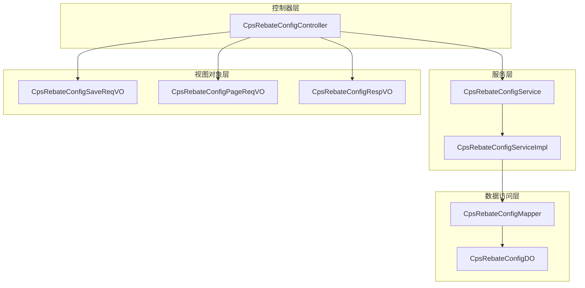

**图表来源**
- [CpsRebateConfigController.java:1-73](file://qiji-module-cps/qiji-module-cps-biz/src/main/java/cn/zhijian/cps/controller/admin/CpsRebateConfigController.java#L1-L73)
- [CpsRebateConfigServiceImpl.java:1-67](file://qiji-module-cps/qiji-module-cps-biz/src/main/java/cn/zhijian/cps/service/CpsRebateConfigServiceImpl.java#L1-L67)

**章节来源**
- [CpsRebateConfigController.java:1-73](file://qiji-module-cps/qiji-module-cps-biz/src/main/java/cn/zhijian/cps/controller/admin/CpsRebateConfigController.java#L1-L73)
- [CpsRebateConfigService.java:1-24](file://qiji-module-cps/qiji-module-cps-biz/src/main/java/cn/zhijian/cps/service/CpsRebateConfigService.java#L1-L24)

## 核心组件

### 控制器组件
CpsRebateConfigController作为RESTful API的入口点，提供了以下核心功能：
- 创建返利配置：POST /admin-api/cps/rebate-config/create
- 更新返利配置：PUT /admin-api/cps/rebate-config/update
- 删除返利配置：DELETE /admin-api/cps/rebate-config/delete
- 获取返利配置详情：GET /admin-api/cps/rebate-config/get
- 获取返利配置分页列表：GET /admin-api/cps/rebate-config/page

### 服务组件
CpsRebateConfigServiceImpl实现了完整的业务逻辑处理，包括数据验证、业务规则检查和持久化操作。

### 数据模型组件
CpsRebateConfigDO定义了返利配置的核心数据结构，包含了所有必要的业务字段和元数据信息。

**章节来源**
- [CpsRebateConfigController.java:23-72](file://qiji-module-cps/qiji-module-cps-biz/src/main/java/cn/zhijian/cps/controller/admin/CpsRebateConfigController.java#L23-L72)
- [CpsRebateConfigServiceImpl.java:16-66](file://qiji-module-cps/qiji-module-cps-biz/src/main/java/cn/zhijian/cps/service/CpsRebateConfigServiceImpl.java#L16-L66)

## 架构概览

系统采用经典的三层架构模式，各层职责清晰分离：

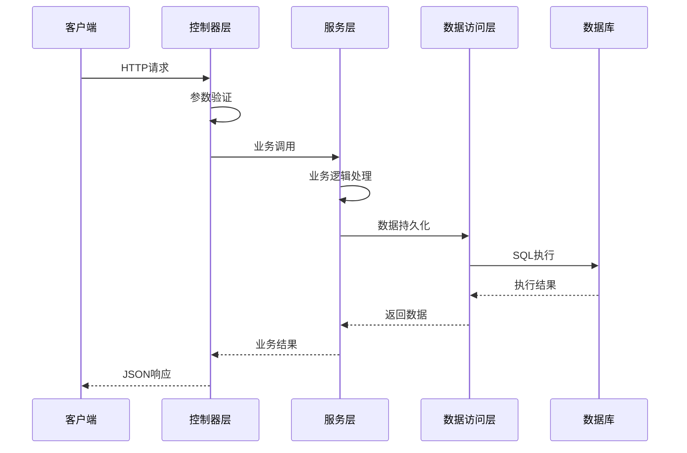

**图表来源**
- [CpsRebateConfigController.java:31-70](file://qiji-module-cps/qiji-module-cps-biz/src/main/java/cn/zhijian/cps/controller/admin/CpsRebateConfigController.java#L31-L70)
- [CpsRebateConfigServiceImpl.java:26-54](file://qiji-module-cps/qiji-module-cps-biz/src/main/java/cn/zhijian/cps/service/CpsRebateConfigServiceImpl.java#L26-L54)

## 详细组件分析

### 控制器层分析

#### 类关系图
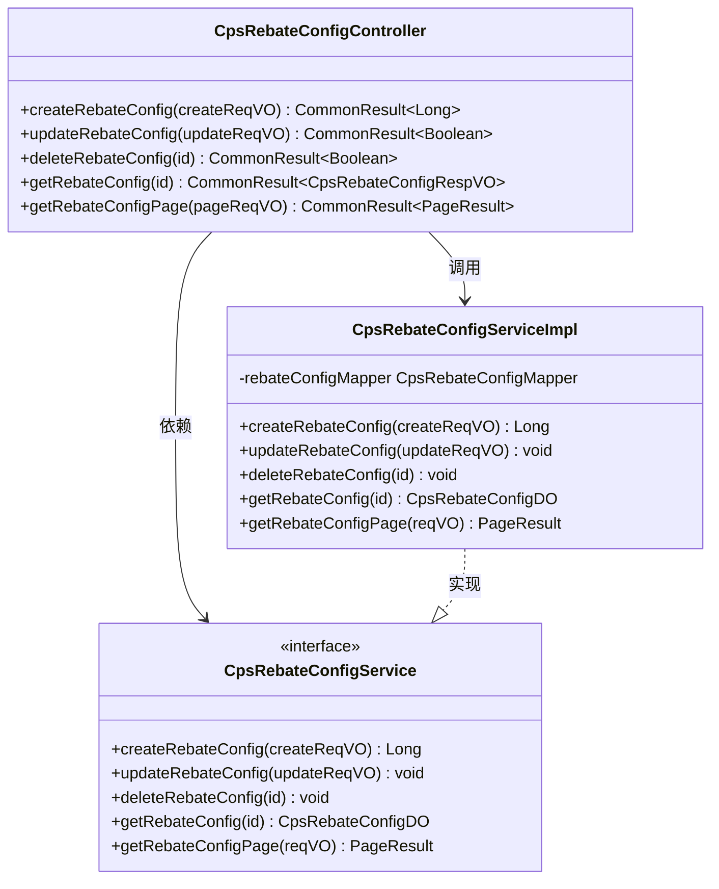

**图表来源**
- [CpsRebateConfigController.java:26-72](file://qiji-module-cps/qiji-module-cps-biz/src/main/java/cn/zhijian/cps/controller/admin/CpsRebateConfigController.java#L26-L72)
- [CpsRebateConfigService.java:11-23](file://qiji-module-cps/qiji-module-cps-biz/src/main/java/cn/zhijian/cps/service/CpsRebateConfigService.java#L11-L23)
- [CpsRebateConfigServiceImpl.java:21-66](file://qiji-module-cps/qiji-module-cps-biz/src/main/java/cn/zhijian/cps/service/CpsRebateConfigServiceImpl.java#L21-L66)

**章节来源**
- [CpsRebateConfigController.java:1-73](file://qiji-module-cps/qiji-module-cps-biz/src/main/java/cn/zhijian/cps/controller/admin/CpsRebateConfigController.java#L1-L73)

### 服务层分析

#### 业务流程图
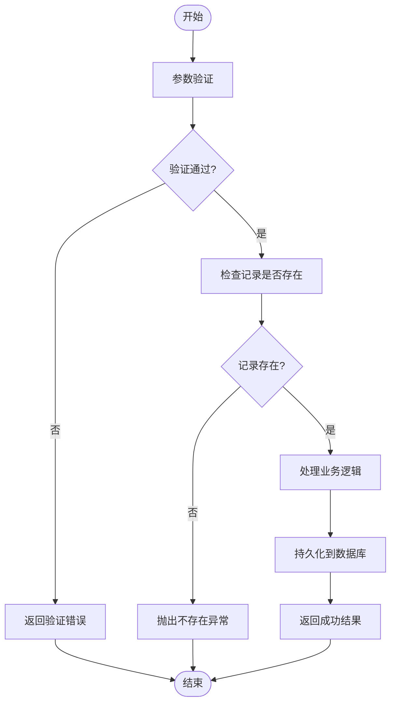

**图表来源**
- [CpsRebateConfigServiceImpl.java:56-64](file://qiji-module-cps/qiji-module-cps-biz/src/main/java/cn/zhijian/cps/service/CpsRebateConfigServiceImpl.java#L56-L64)

**章节来源**
- [CpsRebateConfigServiceImpl.java:16-66](file://qiji-module-cps/qiji-module-cps-biz/src/main/java/cn/zhijian/cps/service/CpsRebateConfigServiceImpl.java#L16-L66)

## API接口规范

### 创建返利配置

**请求URL**: `POST /admin-api/cps/rebate-config/create`

**请求头**:
- Content-Type: application/json
- Authorization: Bearer {token}

**请求参数**:
| 字段名 | 类型 | 必填 | 描述 | 示例 |
|--------|------|------|------|------|
| id | Long | 否 | 主键ID | 1 |
| memberLevelId | Long | 否 | 会员等级ID（NULL表示无等级限制） | 1 |
| platformCode | String | 否 | 平台编码（NULL表示全平台） | taobao |
| rebateRate | BigDecimal | 是 | 返利比例（百分比） | 50.00 |
| maxRebateAmount | BigDecimal | 否 | 单笔最大返利金额（0表示不限） | 100.00 |
| minRebateAmount | BigDecimal | 否 | 单笔最小返利金额（0表示不限） | 0.01 |
| status | Integer | 是 | 状态（0禁用 1启用） | 1 |
| priority | Integer | 否 | 优先级（数字越大优先级越高） | 0 |

**响应参数**:
```json
{
  "code": 0,
  "msg": "成功",
  "data": 1
}
```

### 更新返利配置

**请求URL**: `PUT /admin-api/cps/rebate-config/update`

**请求参数**:
- 同创建接口的请求参数（必须包含id）

**响应参数**:
```json
{
  "code": 0,
  "msg": "成功",
  "data": true
}
```

### 删除返利配置

**请求URL**: `DELETE /admin-api/cps/rebate-config/delete`

**查询参数**:
| 字段名 | 类型 | 必填 | 描述 | 示例 |
|--------|------|------|------|------|
| id | Long | 是 | 编号 | 1024 |

**响应参数**:
```json
{
  "code": 0,
  "msg": "成功",
  "data": true
}
```

### 获取返利配置详情

**请求URL**: `GET /admin-api/cps/rebate-config/get`

**查询参数**:
| 字段名 | 类型 | 必填 | 描述 | 示例 |
|--------|------|------|------|------|
| id | Long | 是 | 编号 | 1024 |

**响应参数**:
```json
{
  "code": 0,
  "msg": "成功",
  "data": {
    "id": 1,
    "memberLevelId": 1,
    "platformCode": "taobao",
    "rebateRate": 50.00,
    "maxRebateAmount": 100.00,
    "minRebateAmount": 0.01,
    "status": 1,
    "priority": 0,
    "createTime": "2024-01-01 12:00:00"
  }
}
```

### 获取返利配置分页列表

**请求URL**: `GET /admin-api/cps/rebate-config/page`

**查询参数**:
| 字段名 | 类型 | 必填 | 描述 | 示例 |
|--------|------|------|------|------|
| memberLevelId | Long | 否 | 会员等级ID | 1 |
| platformCode | String | 否 | 平台编码 | taobao |
| status | Integer | 否 | 状态（0禁用 1启用） | 1 |
| page | Integer | 是 | 页码 | 1 |
| size | Integer | 是 | 页面大小 | 10 |

**响应参数**:
```json
{
  "code": 0,
  "msg": "成功",
  "data": {
    "list": [...],
    "total": 100
  }
}
```

**章节来源**
- [CpsRebateConfigController.java:31-70](file://qiji-module-cps/qiji-module-cps-biz/src/main/java/cn/zhijian/cps/controller/admin/CpsRebateConfigController.java#L31-L70)

## 数据模型定义

### 返利配置数据模型

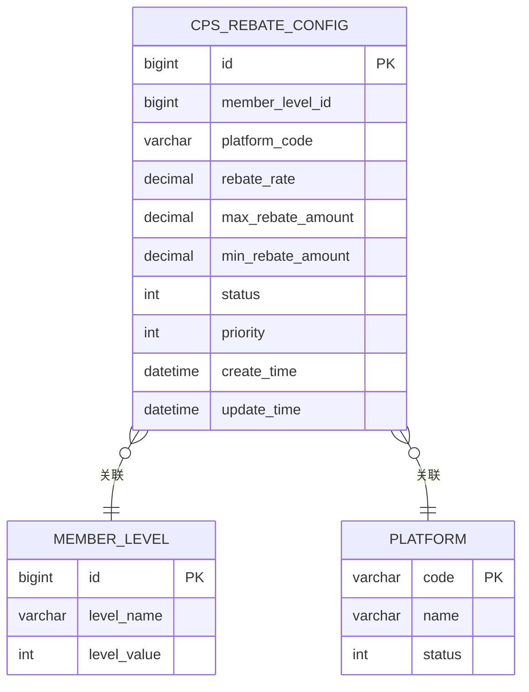

**图表来源**
- [CpsRebateConfigDO.java:21-40](file://qiji-module-cps/qiji-module-cps-biz/src/main/java/cn/zhijian/cps/dal/dataobject/CpsRebateConfigDO.java#L21-L40)

### 字段详细说明

| 字段名 | 类型 | 是否必填 | 默认值 | 描述 | 业务含义 |
|--------|------|----------|--------|------|----------|
| id | Long | 是 | 自增 | 主键ID | 返利配置唯一标识 |
| memberLevelId | Long | 否 | NULL | 会员等级ID | NULL表示无等级限制 |
| platformCode | String | 否 | NULL | 平台编码 | NULL表示全平台适用 |
| rebateRate | BigDecimal | 是 | 0 | 返利比例（百分比） | 百分比形式，如50.00表示50% |
| maxRebateAmount | BigDecimal | 否 | 0 | 单笔最大返利金额 | 0表示不限制 |
| minRebateAmount | BigDecimal | 否 | 0 | 单笔最小返利金额 | 0表示不限制 |
| status | Integer | 是 | 0 | 状态（0禁用 1启用） | 控制配置是否生效 |
| priority | Integer | 否 | 0 | 优先级 | 数字越大优先级越高 |
| createTime | LocalDateTime | 是 | 当前时间 | 创建时间 | 系统自动记录 |
| updateTime | LocalDateTime | 是 | 当前时间 | 更新时间 | 系统自动记录 |

**章节来源**
- [CpsRebateConfigDO.java:21-40](file://qiji-module-cps/qiji-module-cps-biz/src/main/java/cn/zhijian/cps/dal/dataobject/CpsRebateConfigDO.java#L21-L40)
- [CpsRebateConfigRespVO.java:11-40](file://qiji-module-cps/qiji-module-cps-biz/src/main/java/cn/zhijian/cps/controller/admin/vo/rebateconfig/CpsRebateConfigRespVO.java#L11-L40)

## 返利计算规则

### 计算公式

返利金额计算遵循以下规则：

```
实际返利金额 = MIN(订单金额 × 返利比例 / 100, 最大返利金额)
```

其中：
- 如果最大返利金额为0，则不设上限
- 如果最小返利金额为0，则不设下限
- 返利比例以百分比形式存储，计算时需除以100

### 优先级匹配算法

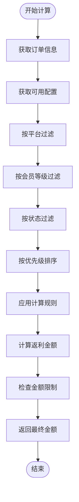

**图表来源**
- [CpsRebateConfigServiceImpl.java:26-54](file://qiji-module-cps/qiji-module-cps-biz/src/main/java/cn/zhijian/cps/service/CpsRebateConfigServiceImpl.java#L26-L54)

### 配置优先级策略

1. **平台优先级**：精确匹配 > 全平台匹配
2. **会员等级优先级**：指定等级 > 无等级限制
3. **优先级数值**：数值越大优先级越高
4. **状态优先级**：仅启用状态的配置参与计算

**章节来源**
- [CpsRebateConfigSaveReqVO.java:36-37](file://qiji-module-cps/qiji-module-cps-biz/src/main/java/cn/zhijian/cps/controller/admin/vo/rebateconfig/CpsRebateConfigSaveReqVO.java#L36-L37)

## 配置优先级设置

### 优先级计算流程

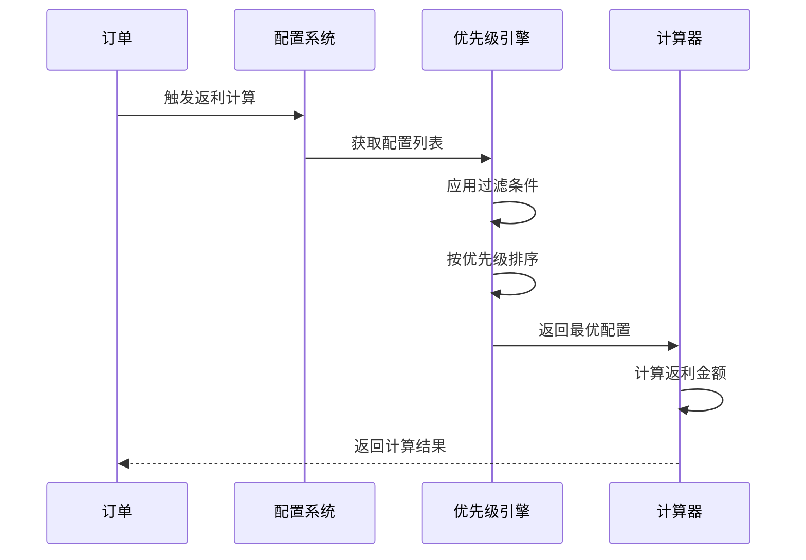

**图表来源**
- [CpsRebateConfigController.java:64-70](file://qiji-module-cps/qiji-module-cps-biz/src/main/java/cn/zhijian/cps/controller/admin/CpsRebateConfigController.java#L64-L70)

### 优先级配置建议

1. **基础配置**：设置全平台、无等级限制的基础返利比例
2. **特殊配置**：针对特定平台或会员等级设置更高优先级
3. **活动配置**：临时性活动可设置临时优先级
4. **默认回退**：确保至少有一个基础配置作为回退方案

## 权限控制与验证规则

### 权限控制

系统采用基于角色的权限控制（RBAC），每个API操作都需要相应的权限：

| 操作 | 权限标识 | 描述 |
|------|----------|------|
| 创建返利配置 | cps:rebate-config:create | 创建返利配置权限 |
| 更新返利配置 | cps:rebate-config:update | 更新返利配置权限 |
| 删除返利配置 | cps:rebate-config:delete | 删除返利配置权限 |
| 查询返利配置 | cps:rebate-config:query | 查询返利配置权限 |

### 参数验证规则

#### 必填字段验证
- `rebateRate`：不能为空，必须为正数
- `status`：不能为空，必须为0或1
- `id`：更新和删除操作必须提供

#### 业务规则验证
- 返利比例范围：0-100之间的数值
- 金额字段：必须为非负数
- 优先级：非负整数
- 平台编码：必须在有效平台范围内

#### 数据一致性验证
- 检查配置是否存在
- 验证会员等级有效性
- 确保平台编码正确性

**章节来源**
- [CpsRebateConfigController.java:33-59](file://qiji-module-cps/qiji-module-cps-biz/src/main/java/cn/zhijian/cps/controller/admin/CpsRebateConfigController.java#L33-L59)
- [CpsRebateConfigSaveReqVO.java:22-34](file://qiji-module-cps/qiji-module-cps-biz/src/main/java/cn/zhijian/cps/controller/admin/vo/rebateconfig/CpsRebateConfigSaveReqVO.java#L22-L34)

## 批量配置导入导出

### 导入功能设计

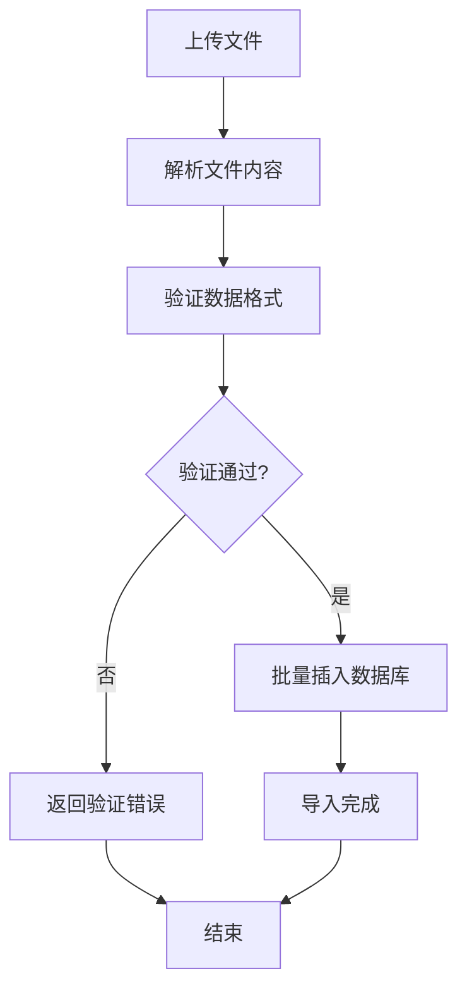

### 导出功能设计

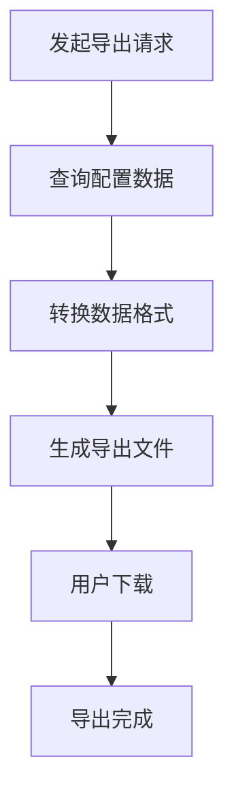

### 支持的文件格式

- **导入格式**：CSV、Excel (.xlsx)
- **导出格式**：CSV、Excel (.xlsx)
- **文件大小限制**：单个文件不超过10MB
- **并发限制**：同时最多允许5个导入任务

### 数据格式规范

| CSV列名 | 字段名 | 类型 | 必填 | 描述 |
|---------|--------|------|------|------|
| 会员等级ID | memberLevelId | Long | 否 | 为空表示全平台 |
| 平台编码 | platformCode | String | 否 | 为空表示全平台 |
| 返利比例 | rebateRate | BigDecimal | 是 | 百分比形式 |
| 最大返利金额 | maxRebateAmount | BigDecimal | 否 | 0表示不限制 |
| 最小返利金额 | minRebateAmount | BigDecimal | 否 | 0表示不限制 |
| 状态 | status | Integer | 是 | 0禁用 1启用 |
| 优先级 | priority | Integer | 否 | 数字越大优先级越高 |

## 性能考虑

### 数据库优化

1. **索引设计**
   - 在memberLevelId字段上建立索引
   - 在platformCode字段上建立索引
   - 在status字段上建立复合索引
   - 在priority字段上建立索引

2. **查询优化**
   - 使用分页查询避免全表扫描
   - 缓存常用配置数据
   - 实施查询结果缓存机制

### 缓存策略

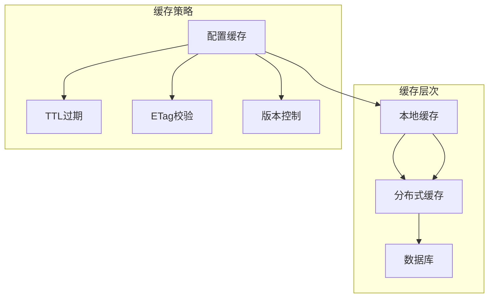

### 并发控制

1. **乐观锁机制**：使用版本号防止并发更新冲突
2. **分布式锁**：对关键操作实施分布式锁保护
3. **限流策略**：对高频操作实施限流保护

## 故障排除指南

### 常见错误及解决方案

#### 参数验证错误
**错误类型**：参数格式不正确
**可能原因**：
- 返利比例超出范围（0-100）
- 金额字段为负数
- 缺少必填字段

**解决方法**：
1. 检查输入数据格式
2. 确认字段值在有效范围内
3. 补充缺失的必填字段

#### 数据不存在错误
**错误类型**：更新或删除时找不到记录
**可能原因**：
- ID不存在
- 记录已被删除
- 权限不足

**解决方法**：
1. 验证ID的有效性
2. 检查记录状态
3. 确认操作权限

#### 数据库约束错误
**错误类型**：违反数据库约束
**可能原因**：
- 重复的平台+等级组合
- 外键约束冲突
- 数据类型不匹配

**解决方法**：
1. 检查唯一性约束
2. 验证外键关系
3. 确认数据类型

### 日志监控

系统提供完整的日志记录机制：

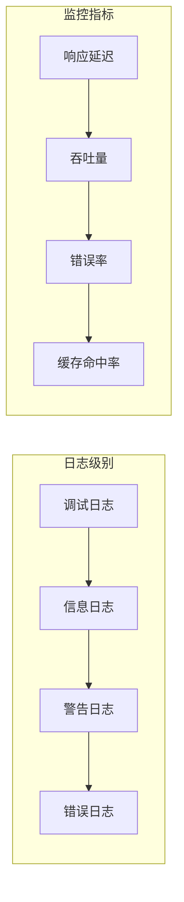

### 性能监控

1. **响应时间监控**：跟踪API响应时间
2. **数据库性能监控**：监控SQL执行时间
3. **缓存性能监控**：监控缓存命中率
4. **错误率监控**：跟踪系统错误率

**章节来源**
- [CpsRebateConfigServiceImpl.java:56-64](file://qiji-module-cps/qiji-module-cps-biz/src/main/java/cn/zhijian/cps/service/CpsRebateConfigServiceImpl.java#L56-L64)

## 结论

CPS返利配置管理接口提供了完整、灵活且高性能的返利配置管理能力。系统采用现代化的微服务架构，具备良好的扩展性和维护性。

### 主要优势

1. **完整的功能覆盖**：支持CRUD操作和高级查询功能
2. **灵活的配置机制**：支持多维度配置和优先级设置
3. **完善的权限控制**：基于RBAC的细粒度权限管理
4. **强大的数据验证**：多层次的数据验证确保数据质量
5. **优秀的性能表现**：优化的数据库设计和缓存策略

### 技术特点

1. **RESTful API设计**：符合现代Web API设计标准
2. **分层架构**：清晰的职责分离便于维护
3. **异常处理**：完善的异常处理和错误反馈机制
4. **日志监控**：全面的日志记录和性能监控
5. **安全防护**：多层次的安全防护措施

该系统为CPS业务提供了坚实的技术基础，能够满足各种复杂的返利配置需求，并为未来的功能扩展预留了充足的空间。