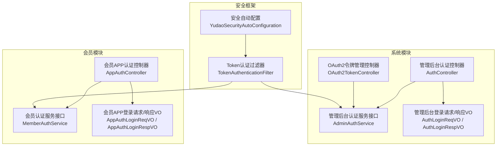
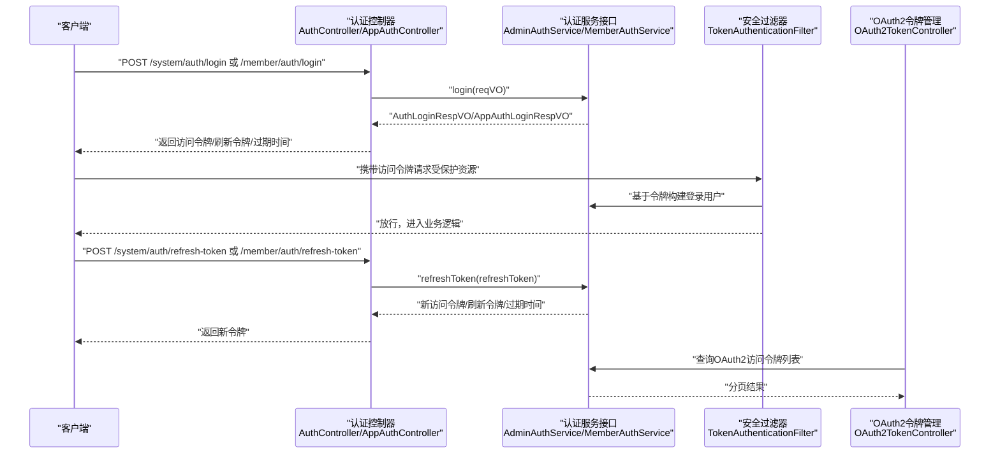
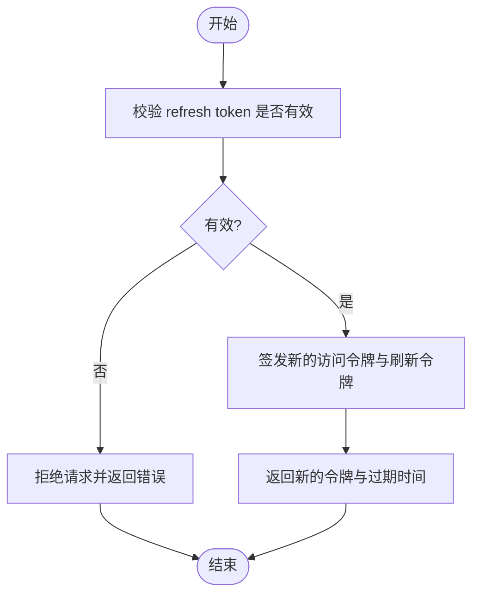
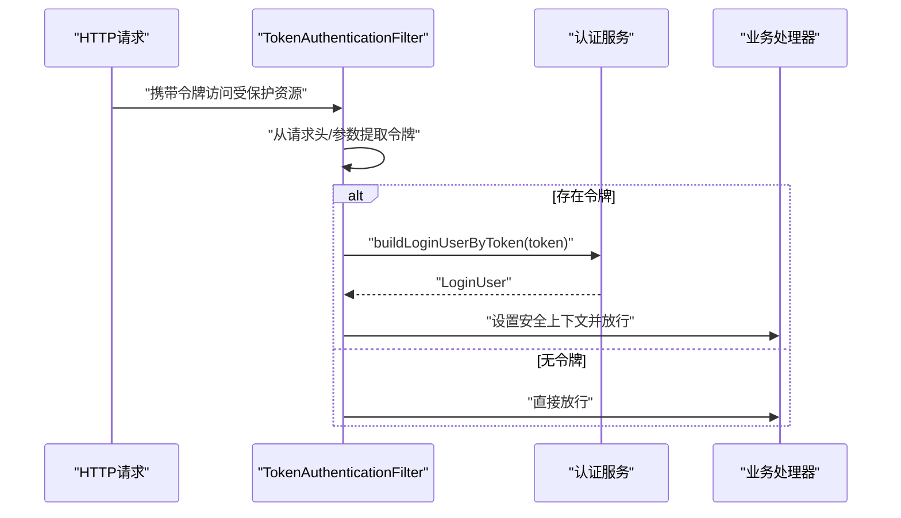
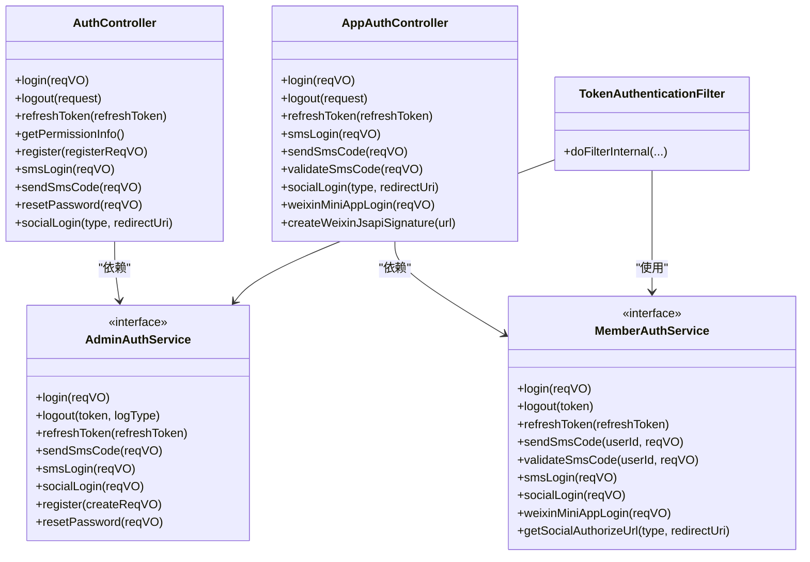

# 认证与授权接口

<cite>
**本文引用的文件**
- [AuthController.java](file://yudao-module-system/src/main/java/cn/iocoder/yudao/module/system/controller/admin/auth/AuthController.java)
- [AuthLoginReqVO.java](file://yudao-module-system/src/main/java/cn/iocoder/yudao/module/system/controller/admin/auth/vo/AuthLoginReqVO.java)
- [AuthLoginRespVO.java](file://yudao-module-system/src/main/java/cn/iocoder/yudao/module/system/controller/admin/auth/vo/AuthLoginRespVO.java)
- [AppAuthController.java](file://yudao-module-member/src/main/java/cn/iocoder/yudao/module/member/controller/app/auth/AppAuthController.java)
- [AppAuthLoginReqVO.java](file://yudao-module-member/src/main/java/cn/iocoder/yudao/module/member/controller/app/auth/vo/AppAuthLoginReqVO.java)
- [AppAuthLoginRespVO.java](file://yudao-module-member/src/main/java/cn/iocoder/yudao/module/member/controller/app/auth/vo/AppAuthLoginRespVO.java)
- [AdminAuthService.java](file://yudao-module-system/src/main/java/cn/iocoder/yudao/module/system/service/auth/AdminAuthService.java)
- [MemberAuthService.java](file://yudao-module-member/src/main/java/cn/iocoder/yudao/module/member/service/auth/MemberAuthService.java)
- [TokenAuthenticationFilter.java](file://yudao-framework/yudao-spring-boot-starter-security/src/main/java/cn/iocoder/yudao/framework/security/core/filter/TokenAuthenticationFilter.java)
- [YudaoSecurityAutoConfiguration.java](file://yudao-framework/yudao-spring-boot-starter-security/src/main/java/cn/iocoder/yudao/framework/security/config/YudaoSecurityAutoConfiguration.java)
- [OAuth2TokenController.java](file://yudao-module-system/src/main/java/cn/iocoder/yudao/module/system/controller/admin/oauth2/OAuth2TokenController.java)
</cite>

## 目录
1. [简介](#简介)
2. [项目结构](#项目结构)
3. [核心组件](#核心组件)
4. [架构总览](#架构总览)
5. [详细组件分析](#详细组件分析)
6. [依赖关系分析](#依赖关系分析)
7. [性能考量](#性能考量)
8. [故障排查指南](#故障排查指南)
9. [结论](#结论)
10. [附录](#附录)

## 简介
本文件面向CPS系统中的认证与授权接口，覆盖管理后台与会员APP两大用户域的登录、登出、令牌刷新、社交登录、短信验证码登录、OAuth2集成等能力。文档从接口定义、请求/响应模型、鉴权流程、权限控制、异常处理到安全最佳实践进行系统化说明，帮助开发者与测试人员快速理解并正确使用认证接口。

## 项目结构
认证相关代码主要分布在以下模块与包中：
- 管理后台认证：系统模块的admin认证控制器与服务接口
- 会员APP认证：会员模块的app认证控制器与服务接口
- 安全框架：统一的安全过滤器、自动配置与安全属性
- OAuth2：系统模块的令牌管理接口

图表来源
- [AuthController.java:43-177](file://yudao-module-system/src/main/java/cn/iocoder/yudao/module/system/controller/admin/auth/AuthController.java#L43-L177)
- [AppAuthController.java:29-136](file://yudao-module-member/src/main/java/cn/iocoder/yudao/module/member/controller/app/auth/AppAuthController.java#L29-L136)
- [AdminAuthService.java:15-89](file://yudao-module-system/src/main/java/cn/iocoder/yudao/module/system/service/auth/AdminAuthService.java#L15-L89)
- [MemberAuthService.java:14-89](file://yudao-module-member/src/main/java/cn/iocoder/yudao/module/member/service/auth/MemberAuthService.java#L14-L89)
- [TokenAuthenticationFilter.java:31-57](file://yudao-framework/yudao-spring-boot-starter-security/src/main/java/cn/iocoder/yudao/framework/security/core/filter/TokenAuthenticationFilter.java#L31-L57)
- [YudaoSecurityAutoConfiguration.java:53-85](file://yudao-framework/yudao-spring-boot-starter-security/src/main/java/cn/iocoder/yudao/framework/security/config/YudaoSecurityAutoConfiguration.java#L53-L85)
- [OAuth2TokenController.java:24-31](file://yudao-module-system/src/main/java/cn/iocoder/yudao/module/system/controller/admin/oauth2/OAuth2TokenController.java#L24-L31)

章节来源
- [AuthController.java:43-177](file://yudao-module-system/src/main/java/cn/iocoder/yudao/module/system/controller/admin/auth/AuthController.java#L43-L177)
- [AppAuthController.java:29-136](file://yudao-module-member/src/main/java/cn/iocoder/yudao/module/member/controller/app/auth/AppAuthController.java#L29-L136)
- [TokenAuthenticationFilter.java:31-57](file://yudao-framework/yudao-spring-boot-starter-security/src/main/java/cn/iocoder/yudao/framework/security/core/filter/TokenAuthenticationFilter.java#L31-L57)
- [YudaoSecurityAutoConfiguration.java:53-85](file://yudao-framework/yudao-spring-boot-starter-security/src/main/java/cn/iocoder/yudao/framework/security/config/YudaoSecurityAutoConfiguration.java#L53-L85)
- [OAuth2TokenController.java:24-31](file://yudao-module-system/src/main/java/cn/iocoder/yudao/module/system/controller/admin/oauth2/OAuth2TokenController.java#L24-L31)

## 核心组件
- 管理后台认证控制器：提供账号密码登录、短信验证码登录、登出、刷新令牌、获取权限信息、注册、社交登录等接口。
- 会员APP认证控制器：提供手机+密码登录、短信验证码登录、登出、刷新令牌、社交登录、微信小程序一键登录、微信JS-SDK签名生成等接口。
- 认证服务接口：AdminAuthService、MemberAuthService，定义登录、登出、刷新令牌、短信验证码发送与校验、社交登录等抽象。
- 安全过滤器：TokenAuthenticationFilter负责从请求中提取令牌、构建登录用户、设置Spring Security上下文。
- 安全自动配置：提供BCrypt密码编码器、Token认证过滤器Bean、安全框架服务等。
- OAuth2令牌管理：系统模块提供OAuth2访问令牌分页查询等管理接口。

章节来源
- [AuthController.java:66-177](file://yudao-module-system/src/main/java/cn/iocoder/yudao/module/system/controller/admin/auth/AuthController.java#L66-L177)
- [AppAuthController.java:45-136](file://yudao-module-member/src/main/java/cn/iocoder/yudao/module/member/controller/app/auth/AppAuthController.java#L45-L136)
- [AdminAuthService.java:15-89](file://yudao-module-system/src/main/java/cn/iocoder/yudao/module/system/service/auth/AdminAuthService.java#L15-L89)
- [MemberAuthService.java:14-89](file://yudao-module-member/src/main/java/cn/iocoder/yudao/module/member/service/auth/MemberAuthService.java#L14-L89)
- [TokenAuthenticationFilter.java:31-57](file://yudao-framework/yudao-spring-boot-starter-security/src/main/java/cn/iocoder/yudao/framework/security/core/filter/TokenAuthenticationFilter.java#L31-L57)
- [YudaoSecurityAutoConfiguration.java:53-85](file://yudao-framework/yudao-spring-boot-starter-security/src/main/java/cn/iocoder/yudao/framework/security/config/YudaoSecurityAutoConfiguration.java#L53-L85)
- [OAuth2TokenController.java:24-31](file://yudao-module-system/src/main/java/cn/iocoder/yudao/module/system/controller/admin/oauth2/OAuth2TokenController.java#L24-L31)

## 架构总览
认证与授权的整体流程如下：
- 客户端调用登录接口（账号密码/短信验证码/社交/微信小程序），服务端完成身份验证后发放访问令牌与刷新令牌。
- 后续请求携带访问令牌，由安全过滤器解析令牌、构建登录用户并注入到安全上下文。
- 访问令牌过期后，使用刷新令牌换取新的访问令牌。
- 管理后台可查询OAuth2访问令牌列表用于运维与审计。

图表来源
- [AuthController.java:66-91](file://yudao-module-system/src/main/java/cn/iocoder/yudao/module/system/controller/admin/auth/AuthController.java#L66-L91)
- [AppAuthController.java:45-70](file://yudao-module-member/src/main/java/cn/iocoder/yudao/module/member/controller/app/auth/AppAuthController.java#L45-L70)
- [AdminAuthService.java:32-71](file://yudao-module-system/src/main/java/cn/iocoder/yudao/module/system/service/auth/AdminAuthService.java#L32-L71)
- [MemberAuthService.java:22-86](file://yudao-module-member/src/main/java/cn/iocoder/yudao/module/member/service/auth/MemberAuthService.java#L22-L86)
- [TokenAuthenticationFilter.java:42-57](file://yudao-framework/yudao-spring-boot-starter-security/src/main/java/cn/iocoder/yudao/framework/security/core/filter/TokenAuthenticationFilter.java#L42-L57)
- [OAuth2TokenController.java:24-31](file://yudao-module-system/src/main/java/cn/iocoder/yudao/module/system/controller/admin/oauth2/OAuth2TokenController.java#L24-L31)

## 详细组件分析

### 管理后台认证接口
- 登录（账号密码）
  - 请求路径：POST /system/auth/login
  - 请求体：AuthLoginReqVO（包含用户名、密码、可选社交参数）
  - 响应体：AuthLoginRespVO（包含userId、accessToken、refreshToken、expiresTime）
  - 行为：完成账号密码校验，创建登录日志，返回令牌与过期时间
- 登录（短信验证码）
  - 请求路径：POST /system/auth/sms-login
  - 请求体：AuthSmsLoginReqVO（手机号、验证码）
  - 响应体：AuthLoginRespVO
  - 行为：校验验证码并发放令牌
- 发送短信验证码
  - 请求路径：POST /system/auth/send-sms-code
  - 请求体：AuthSmsSendReqVO（手机号、场景）
  - 响应体：Boolean
- 刷新令牌
  - 请求路径：POST /system/auth/refresh-token
  - 查询参数：refreshToken
  - 响应体：AuthLoginRespVO
- 获取权限信息
  - 请求路径：GET /system/auth/get-permission-info
  - 响应体：AuthPermissionInfoRespVO（用户、角色、菜单）
- 注册
  - 请求路径：POST /system/auth/register
  - 请求体：AuthRegisterReqVO
  - 响应体：AuthLoginRespVO
- 登出
  - 请求路径：POST /system/auth/logout
  - 行为：从请求头或参数中提取令牌并执行登出
- 社交登录
  - 获取授权URL：GET /system/auth/social-auth-redirect
  - 社交快捷登录：POST /system/auth/social-login

章节来源
- [AuthController.java:66-177](file://yudao-module-system/src/main/java/cn/iocoder/yudao/module/system/controller/admin/auth/AuthController.java#L66-L177)
- [AuthLoginReqVO.java:17-57](file://yudao-module-system/src/main/java/cn/iocoder/yudao/module/system/controller/admin/auth/vo/AuthLoginReqVO.java#L17-L57)
- [AuthLoginRespVO.java:11-31](file://yudao-module-system/src/main/java/cn/iocoder/yudao/module/system/controller/admin/auth/vo/AuthLoginRespVO.java#L11-L31)

### 会员APP认证接口
- 登录（手机+密码）
  - 请求路径：POST /member/auth/login
  - 请求体：AppAuthLoginReqVO（手机号、密码、可选社交参数）
  - 响应体：AppAuthLoginRespVO（包含openid字段在社交登录时返回）
- 登录（短信验证码）
  - 请求路径：POST /member/auth/sms-login
  - 请求体：AppAuthSmsLoginReqVO（手机号、验证码）
  - 响应体：AppAuthLoginRespVO
- 发送/校验短信验证码
  - 请求路径：POST /member/auth/send-sms-code
  - 请求体：AppAuthSmsSendReqVO
  - 响应体：Boolean
  - 请求路径：POST /member/auth/validate-sms-code
  - 请求体：AppAuthSmsValidateReqVO
  - 响应体：Boolean
- 刷新令牌
  - 请求路径：POST /member/auth/refresh-token
  - 查询参数：refreshToken
  - 响应体：AppAuthLoginRespVO
- 登出
  - 请求路径：POST /member/auth/logout
- 社交登录
  - 获取授权URL：GET /member/auth/social-auth-redirect
  - 社交快捷登录：POST /member/auth/social-login
- 微信小程序一键登录
  - 请求路径：POST /member/auth/weixin-mini-app-login
  - 请求体：AppAuthWeixinMiniAppLoginReqVO
  - 响应体：AppAuthLoginRespVO
- 微信JS-SDK签名
  - 请求路径：POST /member/auth/create-weixin-jsapi-signature
  - 查询参数：url
  - 响应体：SocialWxJsapiSignatureRespDTO

章节来源
- [AppAuthController.java:45-136](file://yudao-module-member/src/main/java/cn/iocoder/yudao/module/member/controller/app/auth/AppAuthController.java#L45-L136)
- [AppAuthLoginReqVO.java:17-56](file://yudao-module-member/src/main/java/cn/iocoder/yudao/module/member/controller/app/auth/vo/AppAuthLoginReqVO.java#L17-L56)
- [AppAuthLoginRespVO.java:11-39](file://yudao-module-member/src/main/java/cn/iocoder/yudao/module/member/controller/app/auth/vo/AppAuthLoginRespVO.java#L11-L39)

### JWT 令牌管理与刷新机制
- 令牌结构：登录成功返回访问令牌与刷新令牌，以及过期时间。
- 刷新流程：使用refreshToken调用对应刷新接口，服务端校验后发放新的访问令牌与刷新令牌。
- 过期策略：过期时间在响应体中返回；刷新令牌用于在访问令牌过期后换取新令牌。

图表来源
- [AuthController.java:85-91](file://yudao-module-system/src/main/java/cn/iocoder/yudao/module/system/controller/admin/auth/AuthController.java#L85-L91)
- [AppAuthController.java:64-70](file://yudao-module-member/src/main/java/cn/iocoder/yudao/module/member/controller/app/auth/AppAuthController.java#L64-L70)
- [AuthLoginRespVO.java:11-31](file://yudao-module-system/src/main/java/cn/iocoder/yudao/module/system/controller/admin/auth/vo/AuthLoginRespVO.java#L11-L31)
- [AppAuthLoginRespVO.java:11-39](file://yudao-module-member/src/main/java/cn/iocoder/yudao/module/member/controller/app/auth/vo/AppAuthLoginRespVO.java#L11-L39)

### OAuth2 集成
- 管理后台提供OAuth2访问令牌的分页查询接口，便于审计与运维。
- 社交登录支持通过授权码换取用户信息并完成登录或绑定。

章节来源
- [OAuth2TokenController.java:24-31](file://yudao-module-system/src/main/java/cn/iocoder/yudao/module/system/controller/admin/oauth2/OAuth2TokenController.java#L24-L31)
- [AuthController.java:156-174](file://yudao-module-system/src/main/java/cn/iocoder/yudao/module/system/controller/admin/auth/AuthController.java#L156-L174)
- [AppAuthController.java:99-116](file://yudao-module-member/src/main/java/cn/iocoder/yudao/module/member/controller/app/auth/AppAuthController.java#L99-L116)

### 权限控制机制
- 基于角色的权限控制（RBAC）：登录后可通过“获取权限信息”接口返回用户的角色与菜单集合，前端据此渲染界面与控制按钮。
- 接口权限控制：控制器方法上标注的注解（如@PermitAll、@PreAuthorize）配合安全框架实现接口级访问控制。
- 数据权限控制：部分接口通过注解关闭数据权限过滤，确保能正确查询用户权限信息。

章节来源
- [AuthController.java:93-118](file://yudao-module-system/src/main/java/cn/iocoder/yudao/module/system/controller/admin/auth/AuthController.java#L93-L118)
- [YudaoSecurityAutoConfiguration.java:53-85](file://yudao-framework/yudao-spring-boot-starter-security/src/main/java/cn/iocoder/yudao/framework/security/config/YudaoSecurityAutoConfiguration.java#L53-L85)

### 鉴权方式与验证流程
- 鉴权方式：基于请求头或请求参数提取令牌，随后由安全过滤器解析令牌并构建登录用户。
- 验证流程：过滤器尝试从请求中获取令牌，若存在则调用认证服务构建登录用户并设置到安全上下文；若不存在则放行至后续拦截器或业务逻辑。

图表来源
- [TokenAuthenticationFilter.java:42-57](file://yudao-framework/yudao-spring-boot-starter-security/src/main/java/cn/iocoder/yudao/framework/security/core/filter/TokenAuthenticationFilter.java#L42-L57)
- [YudaoSecurityAutoConfiguration.java:70-74](file://yudao-framework/yudao-spring-boot-starter-security/src/main/java/cn/iocoder/yudao/framework/security/config/YudaoSecurityAutoConfiguration.java#L70-L74)

### 异常处理机制
- 全局异常处理：安全框架提供全局异常处理器，统一捕获并返回错误信息。
- 登录失败与令牌无效：通常返回明确的错误码与提示，便于前端引导用户重新登录或刷新令牌。

章节来源
- [TokenAuthenticationFilter.java:36-38](file://yudao-framework/yudao-spring-boot-starter-security/src/main/java/cn/iocoder/yudao/framework/security/core/filter/TokenAuthenticationFilter.java#L36-L38)

### 调用示例（接口路径与要点）
- 管理后台
  - 账号密码登录：POST /system/auth/login（请求体：用户名、密码）
  - 短信验证码登录：POST /system/auth/sms-login（请求体：手机号、验证码）
  - 刷新令牌：POST /system/auth/refresh-token?refreshToken=xxx
  - 获取权限信息：GET /system/auth/get-permission-info
  - 社交登录：GET /system/auth/social-auth-redirect?type=...&redirectUri=...；POST /system/auth/social-login
- 会员APP
  - 手机+密码登录：POST /member/auth/login（请求体：手机号、密码）
  - 短信验证码登录：POST /member/auth/sms-login（请求体：手机号、验证码）
  - 刷新令牌：POST /member/auth/refresh-token?refreshToken=xxx
  - 微信小程序一键登录：POST /member/auth/weixin-mini-app-login
  - 社交登录：GET /member/auth/social-auth-redirect?type=...&redirectUri=...；POST /member/auth/social-login

章节来源
- [AuthController.java:66-177](file://yudao-module-system/src/main/java/cn/iocoder/yudao/module/system/controller/admin/auth/AuthController.java#L66-L177)
- [AppAuthController.java:45-136](file://yudao-module-member/src/main/java/cn/iocoder/yudao/module/member/controller/app/auth/AppAuthController.java#L45-L136)

## 依赖关系分析
- 控制器依赖服务接口：AuthController与AppAuthController分别依赖AdminAuthService与MemberAuthService。
- 安全过滤器依赖安全属性与全局异常处理：TokenAuthenticationFilter依赖SecurityProperties与GlobalExceptionHandler。
- 自动配置提供Bean：YudaoSecurityAutoConfiguration提供BCrypt密码编码器、TokenAuthenticationFilter、SecurityFrameworkService等。

图表来源
- [AuthController.java:48-177](file://yudao-module-system/src/main/java/cn/iocoder/yudao/module/system/controller/admin/auth/AuthController.java#L48-L177)
- [AppAuthController.java:34-136](file://yudao-module-member/src/main/java/cn/iocoder/yudao/module/member/controller/app/auth/AppAuthController.java#L34-L136)
- [AdminAuthService.java:15-89](file://yudao-module-system/src/main/java/cn/iocoder/yudao/module/system/service/auth/AdminAuthService.java#L15-L89)
- [MemberAuthService.java:14-89](file://yudao-module-member/src/main/java/cn/iocoder/yudao/module/member/service/auth/MemberAuthService.java#L14-L89)
- [TokenAuthenticationFilter.java:31-57](file://yudao-framework/yudao-spring-boot-starter-security/src/main/java/cn/iocoder/yudao/framework/security/core/filter/TokenAuthenticationFilter.java#L31-L57)

章节来源
- [AuthController.java:48-177](file://yudao-module-system/src/main/java/cn/iocoder/yudao/module/system/controller/admin/auth/AuthController.java#L48-L177)
- [AppAuthController.java:34-136](file://yudao-module-member/src/main/java/cn/iocoder/yudao/module/member/controller/app/auth/AppAuthController.java#L34-L136)
- [AdminAuthService.java:15-89](file://yudao-module-system/src/main/java/cn/iocoder/yudao/module/system/service/auth/AdminAuthService.java#L15-L89)
- [MemberAuthService.java:14-89](file://yudao-module-member/src/main/java/cn/iocoder/yudao/module/member/service/auth/MemberAuthService.java#L14-L89)
- [TokenAuthenticationFilter.java:31-57](file://yudao-framework/yudao-spring-boot-starter-security/src/main/java/cn/iocoder/yudao/framework/security/core/filter/TokenAuthenticationFilter.java#L31-L57)

## 性能考量
- 令牌刷新：建议在访问令牌即将过期时再触发刷新，减少不必要的刷新请求。
- 短信验证码：登录场景建议开启限流策略以降低短信压力与风控风险。
- 权限信息：获取权限信息接口应避免频繁调用，前端可做本地缓存。

## 故障排查指南
- 令牌无效或过期
  - 确认请求头或参数中携带正确的访问令牌；若已过期，使用refreshToken刷新。
- 登录失败
  - 检查用户名/密码或短信验证码是否正确；查看全局异常返回的具体错误信息。
- 社交登录
  - 确认授权回调地址与平台配置一致；检查授权码与state参数是否完整。
- 权限信息为空
  - 确认用户已分配角色且角色状态为启用；检查数据权限过滤是否影响了查询。

章节来源
- [TokenAuthenticationFilter.java:36-38](file://yudao-framework/yudao-spring-boot-starter-security/src/main/java/cn/iocoder/yudao/framework/security/core/filter/TokenAuthenticationFilter.java#L36-L38)
- [AuthController.java:93-118](file://yudao-module-system/src/main/java/cn/iocoder/yudao/module/system/controller/admin/auth/AuthController.java#L93-L118)

## 结论
CPS系统的认证与授权接口围绕管理后台与会员APP两大域展开，提供完善的登录、登出、令牌刷新、短信验证码、社交登录与OAuth2集成能力。通过统一的安全过滤器与自动配置，系统实现了基于令牌的鉴权与RBAC权限控制。建议在生产环境中结合限流、令牌安全存储与权限缓存策略，进一步提升安全性与用户体验。

## 附录
- 安全最佳实践
  - 令牌安全存储：建议将访问令牌存储在HttpOnly的私有作用域Cookie中，或在移动端安全存储（如Keychain/Keystore）。
  - 刷新令牌：仅在服务端安全存储，避免泄露；建议设置较短有效期并支持撤销。
  - 权限缓存：前端对权限信息做本地缓存，减少重复请求；后端对权限计算结果做缓存以提升性能。
  - 日志审计：登录与登出行为应记录日志，便于追踪与审计。