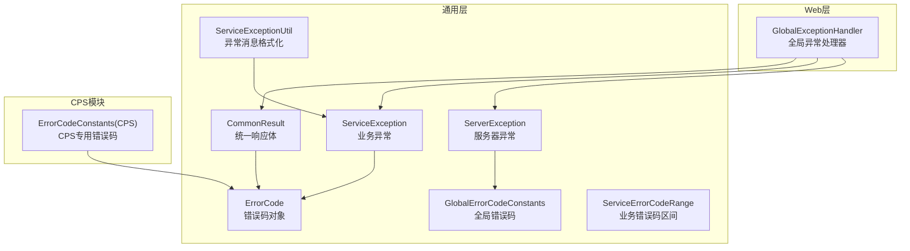
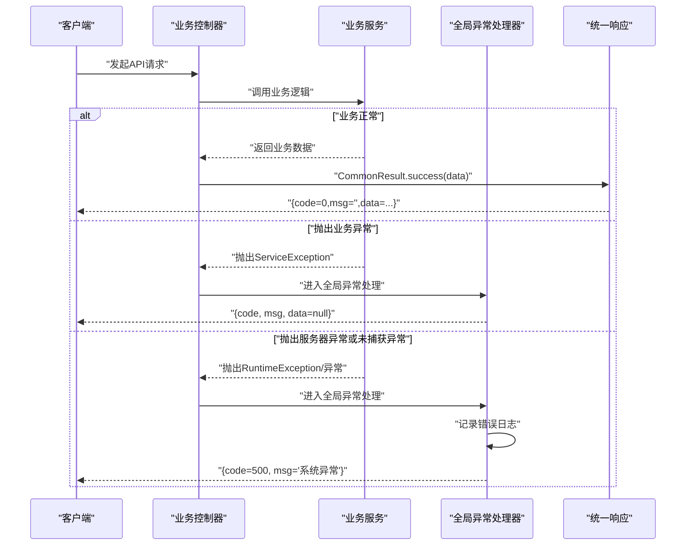
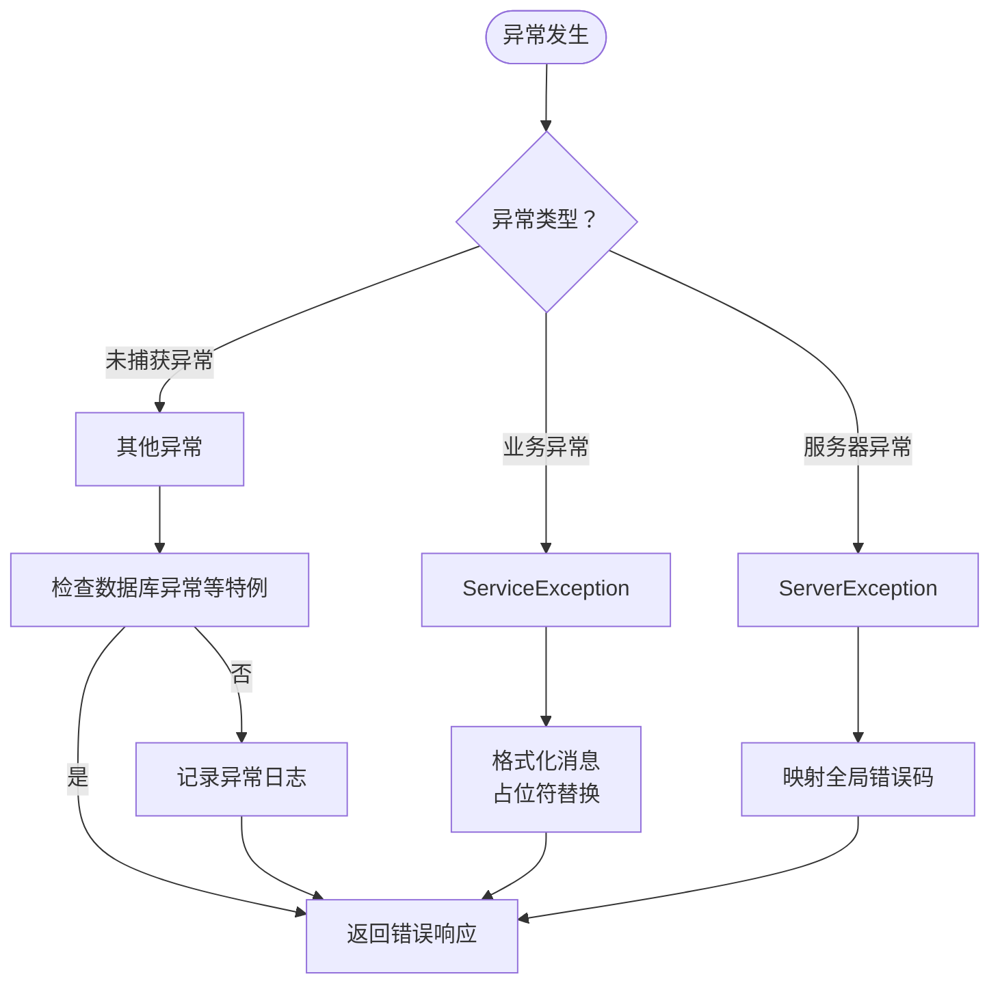
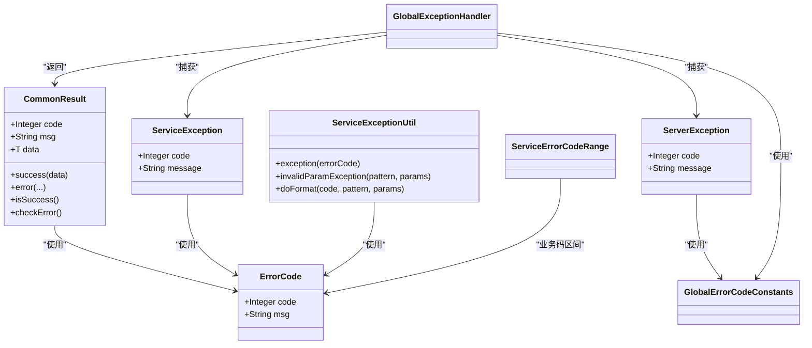

# 错误码与响应规范

<cite>
**本文引用的文件**   
- [CommonResult.java](file://yudao-framework/yudao-common/src/main/java/cn/iocoder/yudao/framework/common/pojo/CommonResult.java)
- [ErrorCode.java](file://yudao-framework/yudao-common/src/main/java/cn/iocoder/yudao/framework/common/exception/ErrorCode.java)
- [GlobalErrorCodeConstants.java](file://yudao-framework/yudao-common/src/main/java/cn/iocoder/yudao/framework/common/exception/enums/GlobalErrorCodeConstants.java)
- [ServiceErrorCodeRange.java](file://yudao-framework/yudao-common/src/main/java/cn/iocoder/yudao/framework/common/exception/enums/ServiceErrorCodeRange.java)
- [ServiceException.java](file://yudao-framework/yudao-common/src/main/java/cn/iocoder/yudao/framework/common/exception/ServiceException.java)
- [ServerException.java](file://yudao-framework/yudao-common/src/main/java/cn/iocoder/yudao/framework/common/exception/ServerException.java)
- [ServiceExceptionUtil.java](file://yudao-framework/yudao-common/src/main/java/cn/iocoder/yudao/framework/common/exception/util/ServiceExceptionUtil.java)
- [GlobalExceptionHandler.java](file://yudao-framework/yudao-spring-boot-starter-web/src/main/java/cn/iocoder/yudao/framework/web/core/handler/GlobalExceptionHandler.java)
- [ErrorCodeConstants.java（CPS模块）](file://yudao-module-cps/yudao-module-cps-biz/src/main/java/cn/zhijian/cps/enums/ErrorCodeConstants.java)
</cite>

## 目录
1. [简介](#简介)
2. [项目结构](#项目结构)
3. [核心组件](#核心组件)
4. [架构总览](#架构总览)
5. [详细组件分析](#详细组件分析)
6. [依赖关系分析](#依赖关系分析)
7. [性能考量](#性能考量)
8. [故障排查指南](#故障排查指南)
9. [结论](#结论)
10. [附录](#附录)

## 简介
本规范旨在为CPS系统API提供统一的错误码与响应格式，确保前后端交互的一致性与可维护性。内容涵盖：
- 统一响应格式（成功/错误结构）
- 全局错误码常量（GlobalErrorCodeConstants）
- CPS模块专用错误码（ErrorCodeConstants）
- 错误码分类与区间划分
- 国际化支持策略
- 错误日志记录规范
- 常见错误场景与处理方案
- 最佳实践与客户端处理指南

## 项目结构
围绕错误码与响应规范的核心代码位于以下模块与文件：
- 通用响应与异常模型：CommonResult、ErrorCode、ServiceException、ServerException
- 全局错误码：GlobalErrorCodeConstants
- 业务错误码区间：ServiceErrorCodeRange
- 异常格式化工具：ServiceExceptionUtil
- 全局异常处理器：GlobalExceptionHandler
- CPS模块错误码：ErrorCodeConstants（CPS专属）

**图表来源**
- [CommonResult.java:1-122](file://yudao-framework/yudao-common/src/main/java/cn/iocoder/yudao/framework/common/pojo/CommonResult.java#L1-L122)
- [ErrorCode.java:1-33](file://yudao-framework/yudao-common/src/main/java/cn/iocoder/yudao/framework/common/exception/ErrorCode.java#L1-L33)
- [GlobalErrorCodeConstants.java:1-42](file://yudao-framework/yudao-common/src/main/java/cn/iocoder/yudao/framework/common/exception/enums/GlobalErrorCodeConstants.java#L1-L42)
- [ServiceErrorCodeRange.java:1-49](file://yudao-framework/yudao-common/src/main/java/cn/iocoder/yudao/framework/common/exception/enums/ServiceErrorCodeRange.java#L1-L49)
- [ServiceException.java:1-61](file://yudao-framework/yudao-common/src/main/java/cn/iocoder/yudao/framework/common/exception/ServiceException.java#L1-L61)
- [ServerException.java:1-61](file://yudao-framework/yudao-common/src/main/java/cn/iocoder/yudao/framework/common/exception/ServerException.java#L1-L61)
- [ServiceExceptionUtil.java:1-78](file://yudao-framework/yudao-common/src/main/java/cn/iocoder/yudao/framework/common/exception/util/ServiceExceptionUtil.java#L1-L78)
- [GlobalExceptionHandler.java:46-368](file://yudao-framework/yudao-spring-boot-starter-web/src/main/java/cn/iocoder/yudao/framework/web/core/handler/GlobalExceptionHandler.java#L46-L368)
- [ErrorCodeConstants.java（CPS模块）:1-63](file://yudao-module-cps/yudao-module-cps-biz/src/main/java/cn/zhijian/cps/enums/ErrorCodeConstants.java#L1-L63)

**章节来源**
- [CommonResult.java:1-122](file://yudao-framework/yudao-common/src/main/java/cn/iocoder/yudao/framework/common/pojo/CommonResult.java#L1-L122)
- [GlobalErrorCodeConstants.java:1-42](file://yudao-framework/yudao-common/src/main/java/cn/iocoder/yudao/framework/common/exception/enums/GlobalErrorCodeConstants.java#L1-L42)
- [ServiceErrorCodeRange.java:1-49](file://yudao-framework/yudao-common/src/main/java/cn/iocoder/yudao/framework/common/exception/enums/ServiceErrorCodeRange.java#L1-L49)
- [ServiceException.java:1-61](file://yudao-framework/yudao-common/src/main/java/cn/iocoder/yudao/framework/common/exception/ServiceException.java#L1-L61)
- [ServerException.java:1-61](file://yudao-framework/yudao-common/src/main/java/cn/iocoder/yudao/framework/common/exception/ServerException.java#L1-L61)
- [ServiceExceptionUtil.java:1-78](file://yudao-framework/yudao-common/src/main/java/cn/iocoder/yudao/framework/common/exception/util/ServiceExceptionUtil.java#L1-L78)
- [GlobalExceptionHandler.java:46-368](file://yudao-framework/yudao-spring-boot-starter-web/src/main/java/cn/iocoder/yudao/framework/web/core/handler/GlobalExceptionHandler.java#L46-L368)
- [ErrorCodeConstants.java（CPS模块）:1-63](file://yudao-module-cps/yudao-module-cps-biz/src/main/java/cn/zhijian/cps/enums/ErrorCodeConstants.java#L1-L63)

## 核心组件
- 统一响应体：CommonResult，包含code、msg、data三要素；提供success/error静态工厂方法与异常检查能力
- 错误码对象：ErrorCode，封装code与msg，支持国际化占位符
- 全局错误码：GlobalErrorCodeConstants，覆盖客户端错误（400/401/403/404/405/423/429）、服务端错误（500/501/502）与自定义错误（900/901/999）
- 业务错误码区间：ServiceErrorCodeRange，定义业务异常的10位编码段位划分，CPS模块使用1-006段
- 业务异常：ServiceException，携带业务错误码与消息
- 服务器异常：ServerException，携带全局错误码与消息
- 异常格式化：ServiceExceptionUtil，提供占位符格式化与参数数量校验
- 全局异常处理器：GlobalExceptionHandler，将各类异常映射为CommonResult并记录错误日志

**章节来源**
- [CommonResult.java:14-122](file://yudao-framework/yudao-common/src/main/java/cn/iocoder/yudao/framework/common/pojo/CommonResult.java#L14-L122)
- [ErrorCode.java:7-33](file://yudao-framework/yudao-common/src/main/java/cn/iocoder/yudao/framework/common/exception/ErrorCode.java#L7-L33)
- [GlobalErrorCodeConstants.java:5-42](file://yudao-framework/yudao-common/src/main/java/cn/iocoder/yudao/framework/common/exception/enums/GlobalErrorCodeConstants.java#L5-L42)
- [ServiceErrorCodeRange.java:28-49](file://yudao-framework/yudao-common/src/main/java/cn/iocoder/yudao/framework/common/exception/enums/ServiceErrorCodeRange.java#L28-L49)
- [ServiceException.java:7-61](file://yudao-framework/yudao-common/src/main/java/cn/iocoder/yudao/framework/common/exception/ServiceException.java#L7-L61)
- [ServerException.java:7-61](file://yudao-framework/yudao-common/src/main/java/cn/iocoder/yudao/framework/common/exception/ServerException.java#L7-L61)
- [ServiceExceptionUtil.java:9-78](file://yudao-framework/yudao-common/src/main/java/cn/iocoder/yudao/framework/common/exception/util/ServiceExceptionUtil.java#L9-L78)
- [GlobalExceptionHandler.java:50-368](file://yudao-framework/yudao-spring-boot-starter-web/src/main/java/cn/iocoder/yudao/framework/web/core/handler/GlobalExceptionHandler.java#L50-L368)

## 架构总览
统一响应与异常处理的整体流程如下：

**图表来源**
- [GlobalExceptionHandler.java:78-368](file://yudao-framework/yudao-spring-boot-starter-web/src/main/java/cn/iocoder/yudao/framework/web/core/handler/GlobalExceptionHandler.java#L78-L368)
- [CommonResult.java:72-122](file://yudao-framework/yudao-common/src/main/java/cn/iocoder/yudao/framework/common/pojo/CommonResult.java#L72-L122)
- [ServiceException.java:10-61](file://yudao-framework/yudao-common/src/main/java/cn/iocoder/yudao/framework/common/exception/ServiceException.java#L10-L61)
- [ServerException.java:10-61](file://yudao-framework/yudao-common/src/main/java/cn/iocoder/yudao/framework/common/exception/ServerException.java#L10-L61)

## 详细组件分析

### 统一响应体（CommonResult）
- 结构字段
  - code：整数型错误码
  - msg：字符串错误信息（用户可读）
  - data：泛型业务数据
- 关键方法
  - success(data)：构造成功响应（code=0）
  - error(...)：构造错误响应（多种重载）
  - isSuccess/isError：判断响应状态
  - checkError/getCheckedData：将响应转为异常或安全获取data
- 设计要点
  - 与异常体系集成，支持从ServiceException转换
  - 提供泛型转换方法，便于接口间结果类型转换

**章节来源**
- [CommonResult.java:14-122](file://yudao-framework/yudao-common/src/main/java/cn/iocoder/yudao/framework/common/pojo/CommonResult.java#L14-L122)

### 错误码对象（ErrorCode）与全局错误码（GlobalErrorCodeConstants）
- ErrorCode
  - 封装code与msg，支持国际化占位符“{}”
  - 为未来i18n做准备
- GlobalErrorCodeConstants
  - 成功：0
  - 客户端错误：400/401/403/404/405/423/429
  - 服务端错误：500/501/502
  - 自定义错误：900/901/999
- 使用方式
  - 控制器/服务层通过CommonResult.error(...)或ServiceExceptionUtil.exception(...)传递错误

**章节来源**
- [ErrorCode.java:7-33](file://yudao-framework/yudao-common/src/main/java/cn/iocoder/yudao/framework/common/exception/ErrorCode.java#L7-L33)
- [GlobalErrorCodeConstants.java:5-42](file://yudao-framework/yudao-common/src/main/java/cn/iocoder/yudao/framework/common/exception/enums/GlobalErrorCodeConstants.java#L5-L42)

### 业务错误码区间（ServiceErrorCodeRange）与CPS模块错误码（ErrorCodeConstants）
- 区间划分（10位编码）
  - 第一段：1（业务级）
  - 第二段：006（系统类型：CPS）
  - 第三段：XXX（模块）
  - 第四段：XXX（错误码）
- CPS模块错误码范围示例
  - 平台配置：1-006-001-xxx
  - 推广位管理：1-006-002-xxx
  - 订单管理：1-006-003-xxx
  - 返利配置/记录：1-006-004-xxx / 1-006-005-xxx
  - 提现管理：1-006-006-xxx
  - 统计数据：1-006-007-xxx
  - MCP管理：1-006-008-xxx
  - 平台API：1-006-001-004/005
  - 商品搜索：1-006-009-xxx
  - 推广链接：1-006-010-xxx
- 使用建议
  - 同一模块内按功能子域自增分配第四段
  - 消息模板中使用“{}”占位符，配合ServiceExceptionUtil格式化

**章节来源**
- [ServiceErrorCodeRange.java:28-49](file://yudao-framework/yudao-common/src/main/java/cn/iocoder/yudao/framework/common/exception/enums/ServiceErrorCodeRange.java#L28-L49)
- [ErrorCodeConstants.java（CPS模块）:5-63](file://yudao-module-cps/yudao-module-cps-biz/src/main/java/cn/zhijian/cps/enums/ErrorCodeConstants.java#L5-L63)

### 异常处理与格式化（ServiceException、ServerException、ServiceExceptionUtil、GlobalExceptionHandler）
- ServiceException
  - 业务异常运行时异常，携带业务错误码
- ServerException
  - 服务器异常运行时异常，携带全局错误码
- ServiceExceptionUtil
  - 提供exception(...)与invalidParamException(...)等便捷方法
  - doFormat(...)实现“{}”占位符格式化，避免参数不匹配导致异常
- GlobalExceptionHandler
  - 统一捕获异常，输出CommonResult
  - 记录异常日志（ApiErrorLog）
  - 对常见异常（如参数缺失、权限不足、请求不存在等）映射到相应错误码

**图表来源**
- [ServiceException.java:10-61](file://yudao-framework/yudao-common/src/main/java/cn/iocoder/yudao/framework/common/exception/ServiceException.java#L10-L61)
- [ServerException.java:10-61](file://yudao-framework/yudao-common/src/main/java/cn/iocoder/yudao/framework/common/exception/ServerException.java#L10-L61)
- [ServiceExceptionUtil.java:29-75](file://yudao-framework/yudao-common/src/main/java/cn/iocoder/yudao/framework/common/exception/util/ServiceExceptionUtil.java#L29-L75)
- [GlobalExceptionHandler.java:292-368](file://yudao-framework/yudao-spring-boot-starter-web/src/main/java/cn/iocoder/yudao/framework/web/core/handler/GlobalExceptionHandler.java#L292-L368)

**章节来源**
- [ServiceException.java:10-61](file://yudao-framework/yudao-common/src/main/java/cn/iocoder/yudao/framework/common/exception/ServiceException.java#L10-L61)
- [ServerException.java:10-61](file://yudao-framework/yudao-common/src/main/java/cn/iocoder/yudao/framework/common/exception/ServerException.java#L10-L61)
- [ServiceExceptionUtil.java:29-75](file://yudao-framework/yudao-common/src/main/java/cn/iocoder/yudao/framework/common/exception/util/ServiceExceptionUtil.java#L29-L75)
- [GlobalExceptionHandler.java:292-368](file://yudao-framework/yudao-spring-boot-starter-web/src/main/java/cn/iocoder/yudao/framework/web/core/handler/GlobalExceptionHandler.java#L292-L368)

## 依赖关系分析
- CommonResult依赖ErrorCode与全局错误码常量
- ServiceException/ServerException依赖ErrorCode
- ServiceExceptionUtil依赖ErrorCode与全局错误码常量，用于格式化与快速构建异常
- GlobalExceptionHandler依赖CommonResult、ServiceException、ServerException与全局错误码常量，负责异常到响应的映射与日志记录
- CPS模块错误码依赖ErrorCode

**图表来源**
- [CommonResult.java:14-122](file://yudao-framework/yudao-common/src/main/java/cn/iocoder/yudao/framework/common/pojo/CommonResult.java#L14-L122)
- [ErrorCode.java:7-33](file://yudao-framework/yudao-common/src/main/java/cn/iocoder/yudao/framework/common/exception/ErrorCode.java#L7-L33)
- [ServiceException.java:10-61](file://yudao-framework/yudao-common/src/main/java/cn/iocoder/yudao/framework/common/exception/ServiceException.java#L10-L61)
- [ServerException.java:10-61](file://yudao-framework/yudao-common/src/main/java/cn/iocoder/yudao/framework/common/exception/ServerException.java#L10-L61)
- [ServiceExceptionUtil.java:16-78](file://yudao-framework/yudao-common/src/main/java/cn/iocoder/yudao/framework/common/exception/util/ServiceExceptionUtil.java#L16-L78)
- [GlobalErrorCodeConstants.java:5-42](file://yudao-framework/yudao-common/src/main/java/cn/iocoder/yudao/framework/common/exception/enums/GlobalErrorCodeConstants.java#L5-L42)
- [ServiceErrorCodeRange.java:28-49](file://yudao-framework/yudao-common/src/main/java/cn/iocoder/yudao/framework/common/exception/enums/ServiceErrorCodeRange.java#L28-L49)
- [GlobalExceptionHandler.java:50-368](file://yudao-framework/yudao-spring-boot-starter-web/src/main/java/cn/iocoder/yudao/framework/web/core/handler/GlobalExceptionHandler.java#L50-L368)

**章节来源**
- [CommonResult.java:14-122](file://yudao-framework/yudao-common/src/main/java/cn/iocoder/yudao/framework/common/pojo/CommonResult.java#L14-L122)
- [ErrorCode.java:7-33](file://yudao-framework/yudao-common/src/main/java/cn/iocoder/yudao/framework/common/exception/ErrorCode.java#L7-L33)
- [ServiceException.java:10-61](file://yudao-framework/yudao-common/src/main/java/cn/iocoder/yudao/framework/common/exception/ServiceException.java#L10-L61)
- [ServerException.java:10-61](file://yudao-framework/yudao-common/src/main/java/cn/iocoder/yudao/framework/common/exception/ServerException.java#L10-L61)
- [ServiceExceptionUtil.java:16-78](file://yudao-framework/yudao-common/src/main/java/cn/iocoder/yudao/framework/common/exception/util/ServiceExceptionUtil.java#L16-L78)
- [GlobalErrorCodeConstants.java:5-42](file://yudao-framework/yudao-common/src/main/java/cn/iocoder/yudao/framework/common/exception/enums/GlobalErrorCodeConstants.java#L5-L42)
- [ServiceErrorCodeRange.java:28-49](file://yudao-framework/yudao-common/src/main/java/cn/iocoder/yudao/framework/common/exception/enums/ServiceErrorCodeRange.java#L28-L49)
- [GlobalExceptionHandler.java:50-368](file://yudao-framework/yudao-spring-boot-starter-web/src/main/java/cn/iocoder/yudao/framework/web/core/handler/GlobalExceptionHandler.java#L50-L368)

## 性能考量
- 响应体序列化：CommonResult对isSuccess/isError标注JsonIgnore，避免多余字段参与序列化
- 异常格式化：doFormat采用StringBuilder与索引扫描，避免String.format的额外开销
- 全局异常处理：优先映射常见异常，减少分支判断与日志噪声
- 日志异步：异常日志通过异步接口写入，降低阻塞风险

[本节为通用指导，无需特定文件引用]

## 故障排查指南
- 参数验证错误
  - 触发条件：参数缺失、类型不匹配、校验失败
  - 响应：code=400，msg为具体提示
  - 解决建议：检查请求参数命名、类型与必填项；使用invalidParamException统一构造
- 权限不足
  - 触发条件：鉴权失败（@PreAuthorize）
  - 响应：code=403
  - 解决建议：确认用户角色与资源权限；检查登录态
- 业务逻辑错误
  - 触发条件：业务前置条件不满足（如订单不存在、余额不足、状态非法）
  - 响应：业务错误码（CPS模块：1-006-xxx）
  - 解决建议：根据错误码定位模块与场景，完善前端提示与重试策略
- 系统异常
  - 触发条件：未捕获异常、数据库异常等
  - 响应：code=500，msg=“系统异常”
  - 解决建议：查看异常日志，定位根因并修复

**章节来源**
- [GlobalExceptionHandler.java:78-368](file://yudao-framework/yudao-spring-boot-starter-web/src/main/java/cn/iocoder/yudao/framework/web/core/handler/GlobalExceptionHandler.java#L78-L368)
- [ServiceExceptionUtil.java:34-36](file://yudao-framework/yudao-common/src/main/java/cn/iocoder/yudao/framework/common/exception/util/ServiceExceptionUtil.java#L34-L36)
- [ErrorCodeConstants.java（CPS模块）:12-61](file://yudao-module-cps/yudao-module-cps-biz/src/main/java/cn/zhijian/cps/enums/ErrorCodeConstants.java#L12-L61)

## 结论
通过统一的响应体、明确的错误码区间与全局异常处理机制，CPS系统API实现了清晰、一致且可扩展的错误处理规范。建议在后续迭代中：
- 逐步引入国际化消息模板，提升多语言支持
- 对高频错误码建立监控与告警
- 完善客户端错误处理流程，增强用户体验

[本节为总结性内容，无需特定文件引用]

## 附录

### 统一响应格式
- 成功响应
  - code=0
  - msg为空字符串
  - data为业务数据
- 错误响应
  - code为错误码
  - msg为错误信息（支持占位符格式化）
  - data为null

**章节来源**
- [CommonResult.java:72-92](file://yudao-framework/yudao-common/src/main/java/cn/iocoder/yudao/framework/common/pojo/CommonResult.java#L72-L92)

### 全局错误码对照表（节选）
- 成功：0
- 客户端错误：400（请求参数不正确）、401（账号未登录）、403（没有该操作权限）、404（请求未找到）、405（请求方法不正确）、423（请求失败，请稍后重试）、429（请求过于频繁，请稍后重试）
- 服务端错误：500（系统异常）、501（功能未实现/未开启）、502（错误的配置项）
- 自定义错误：900（重复请求，请稍后重试）、901（演示模式，禁止写操作）、999（未知错误）

**章节来源**
- [GlobalErrorCodeConstants.java:17-39](file://yudao-framework/yudao-common/src/main/java/cn/iocoder/yudao/framework/common/exception/enums/GlobalErrorCodeConstants.java#L17-L39)

### CPS模块错误码对照表（节选）
- 平台配置：1-006-001-000（平台不存在）、1-006-001-001（平台编码已存在）、1-006-001-002（平台已被禁用）、1-006-001-003（平台连接测试失败）、1-006-001-004（平台API调用失败）、1-006-001-005（平台API签名失败）
- 推广位管理：1-006-002-000（推广位不存在）、1-006-002-001（推广位ID已存在）
- 订单管理：1-006-003-000（订单不存在）、1-006-003-001（订单同步失败）、1-006-003-002（订单状态不合法）
- 返利配置/记录：1-006-004-000（返利配置不存在）、1-006-004-001（返利配置已存在）、1-006-005-000（返利记录不存在）
- 提现管理：1-006-006-000（提现申请不存在）、1-006-006-001（可提现余额不足）、1-006-006-002（提现金额不能低于最低限额）、1-006-006-003（提现状态不合法）
- 统计数据：1-006-007-000（统计数据不存在）
- MCP管理：1-006-008-000（API Key不存在）、1-006-008-001（API Key已存在）、1-006-008-002（API Key被禁用）、1-006-008-003（请求频率超过限制）
- 商品搜索：1-006-009-000（商品搜索失败）、1-006-009-001（链接/口令解析失败）、1-006-009-002（商品比价失败）、1-006-009-003（商品详情查询失败）
- 推广链接：1-006-010-000（推广链接生成失败）

**章节来源**
- [ErrorCodeConstants.java（CPS模块）:12-61](file://yudao-module-cps/yudao-module-cps-biz/src/main/java/cn/zhijian/cps/enums/ErrorCodeConstants.java#L12-L61)

### 错误码分类说明
- 全局错误码（0-999）：系统级错误，与HTTP状态语义结合
- 业务错误码（≥10^9）：模块化业务错误，CPS模块使用1-006段
- 分类建议：
  - 参数类：400、占位符格式化
  - 权限类：401/403
  - 资源类：404
  - 限流/并发：423/429
  - 系统异常：500/501/502
  - 自定义：900/901/999

**章节来源**
- [GlobalErrorCodeConstants.java:17-39](file://yudao-framework/yudao-common/src/main/java/cn/iocoder/yudao/framework/common/exception/enums/GlobalErrorCodeConstants.java#L17-L39)
- [ServiceErrorCodeRange.java:30-49](file://yudao-framework/yudao-common/src/main/java/cn/iocoder/yudao/framework/common/exception/enums/ServiceErrorCodeRange.java#L30-L49)

### 国际化支持
- 当前实现：ErrorCode对象支持消息模板“{}”，ServiceExceptionUtil提供doFormat进行占位符替换
- 建议：未来可基于消息键与Locale动态解析msg，保持code不变

**章节来源**
- [ErrorCode.java:13-13](file://yudao-framework/yudao-common/src/main/java/cn/iocoder/yudao/framework/common/exception/ErrorCode.java#L13-L13)
- [ServiceExceptionUtil.java:48-75](file://yudao-framework/yudao-common/src/main/java/cn/iocoder/yudao/framework/common/exception/util/ServiceExceptionUtil.java#L48-L75)

### 错误日志记录规范
- 记录内容：异常类名、消息、堆栈、根因、用户信息、请求URL等
- 记录方式：全局异常处理器异步写入错误日志
- 建议：对敏感信息脱敏，控制日志体积与存储成本

**章节来源**
- [GlobalExceptionHandler.java:342-368](file://yudao-framework/yudao-spring-boot-starter-web/src/main/java/cn/iocoder/yudao/framework/web/core/handler/GlobalExceptionHandler.java#L342-L368)

### 客户端错误处理最佳实践
- 成功判断：仅当code=0视为成功
- 参数错误：提示用户修正输入；必要时展示具体字段错误
- 权限错误：引导重新登录或申请权限
- 业务错误：根据业务错误码给出友好提示与可行的操作建议
- 系统异常：提示稍后重试并记录错误日志
- 重试策略：对幂等操作可建议自动重试，非幂等需明确提示

[本节为通用指导，无需特定文件引用]