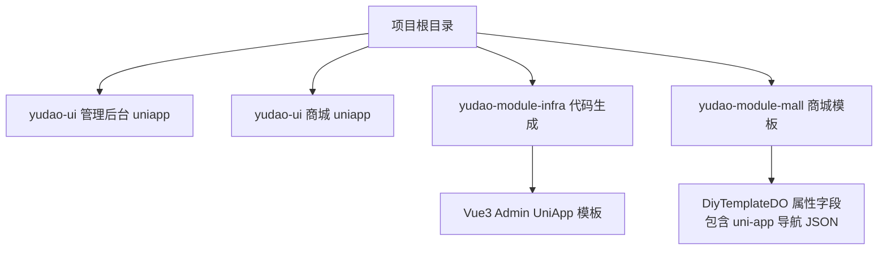
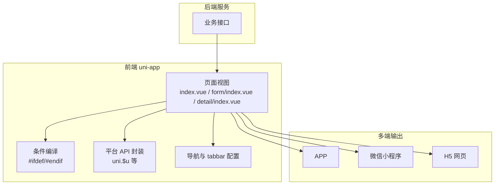
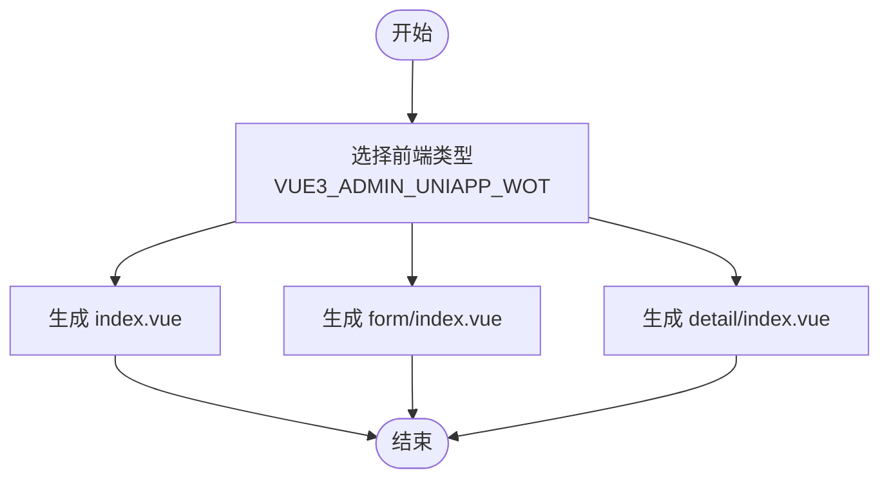
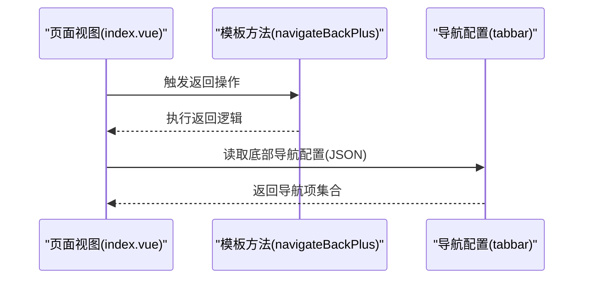
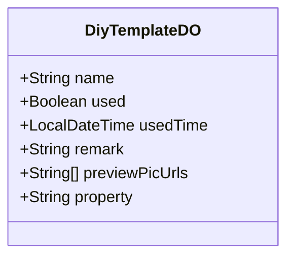
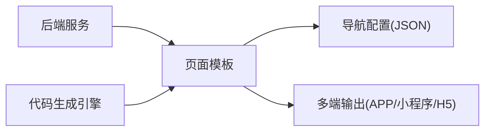

# UniApp多端适配

<cite>
**本文引用的文件**
- [README.md](file://README.md)
- [yudao-ui-admin-uniapp/README.md](file://yudao-ui/yudao-ui-admin-uniapp/README.md)
- [yudao-ui-mall-uniapp/README.md](file://yudao-ui/yudao-ui-mall-uniapp/README.md)
- [CodegenEngine.java](file://yudao-module-infra/src/main/java/cn/iocoder/yudao/module/infra/service/codegen/inner/CodegenEngine.java)
- [DiyTemplateDO.java](file://yudao-module-mall/yudao-module-promotion/src/main/java/cn/iocoder/yudao/module/promotion/dal/dataobject/diy/DiyTemplateDO.java)
- [index.vue.vm](file://yudao-module-infra/src/main/resources/codegen/vue3_admin_uniapp/views/index.vue.vm)
- [index.vue.vm](file://yudao-module-infra/src/main/resources/codegen/vue3_admin_uniapp/views/detail/index.vue.vm)
- [index.vue.vm](file://yudao-module-infra/src/main/resources/codegen/vue3_admin_uniapp/views/form/index.vue.vm)
</cite>

## 目录
1. [引言](#引言)
2. [项目结构](#项目结构)
3. [核心组件](#核心组件)
4. [架构总览](#架构总览)
5. [详细组件分析](#详细组件分析)
6. [依赖关系分析](#依赖关系分析)
7. [性能考虑](#性能考虑)
8. [故障排查指南](#故障排查指南)
9. [结论](#结论)
10. [附录](#附录)

## 引言
本技术文档围绕 AgenticCPS 系统中基于 UniApp 的多端适配架构展开，目标是帮助开发者理解并高效落地“一套代码、多端部署”的方案，覆盖 APP、微信小程序、H5 等平台。文档重点阐述：
- 编译时多端适配与运行时差异化处理
- 条件编译、平台 API 适配、页面与组件的兼容性策略
- 在 AgenticCPS 项目中的实际应用，包括页面布局适配、导航与 tabbar 配置、原生能力集成等
- 不同平台的特殊要求与限制
- 多端开发最佳实践与调试技巧

## 项目结构
在当前仓库中，与 UniApp 相关的关键位置如下：
- 顶层说明：项目 README 明确了移动端采用 uni-app 方案，支持 APP、小程序、H5 多端统一部署
- UI 子模块：存在 yudao-ui-admin-uniapp 与 yudao-ui-mall-uniapp 两个前端工程入口说明
- 代码生成：infra 模块内包含针对 uni-app 的 Vue3 代码生成模板，用于自动生成页面、表单、详情等视图文件
- 商城模板：promotion 模块中存在与 uni-app 导航属性相关的数据模型字段

**图表来源**
- [README.md:1-50](file://README.md#L1-L50)
- [yudao-ui-admin-uniapp/README.md:1-5](file://yudao-ui/yudao-ui-admin-uniapp/README.md#L1-L5)
- [yudao-ui-mall-uniapp/README.md:1-9](file://yudao-ui/yudao-ui-mall-uniapp/README.md#L1-L9)
- [CodegenEngine.java:143-150](file://yudao-module-infra/src/main/java/cn/iocoder/yudao/module/infra/service/codegen/inner/CodegenEngine.java#L143-L150)
- [DiyTemplateDO.java:54-62](file://yudao-module-mall/yudao-module-promotion/src/main/java/cn/iocoder/yudao/module/promotion/dal/dataobject/diy/DiyTemplateDO.java#L54-L62)

**章节来源**
- [README.md:1-50](file://README.md#L1-L50)
- [yudao-ui-admin-uniapp/README.md:1-5](file://yudao-ui/yudao-ui-admin-uniapp/README.md#L1-L5)
- [yudao-ui-mall-uniapp/README.md:1-9](file://yudao-ui/yudao-ui-mall-uniapp/README.md#L1-L9)

## 核心组件
- 代码生成引擎：负责根据模板生成 uni-app 页面文件，确保页面、表单、详情等视图的一致性与可维护性
- 页面与组件模板：提供 index.vue、form/index.vue、detail/index.vue 等标准页面结构，便于快速扩展
- 商城模板数据模型：包含 uni-app 导航属性字段，支撑底部导航等配置
- 平台适配层：通过条件编译与平台 API 封装，屏蔽平台差异

**章节来源**
- [CodegenEngine.java:143-150](file://yudao-module-infra/src/main/java/cn/iocoder/yudao/module/infra/service/codegen/inner/CodegenEngine.java#L143-L150)
- [DiyTemplateDO.java:54-62](file://yudao-module-mall/yudao-module-promotion/src/main/java/cn/iocoder/yudao/module/promotion/dal/dataobject/diy/DiyTemplateDO.java#L54-L62)

## 架构总览
下图展示了从后端到前端的多端适配整体流程：后端服务提供接口，前端通过 uni-app 统一渲染，利用条件编译与平台 API 适配实现多端一致体验。

[此图为概念性架构示意，无需图表来源]

## 详细组件分析

### 代码生成引擎（CodegenEngine）
- 职责：按类型生成 uni-app 页面文件，统一页面结构与交互规范
- 关键行为：
  - 生成页面视图：pages-模块名/业务名/index.vue
  - 生成表单视图：pages-模块名/业务名/form/index.vue
  - 生成详情视图：pages-模块名/业务名/detail/index.vue
- 影响范围：提升开发效率，减少重复劳动，保证多端一致性

**图表来源**
- [CodegenEngine.java:143-150](file://yudao-module-infra/src/main/java/cn/iocoder/yudao/module/infra/service/codegen/inner/CodegenEngine.java#L143-L150)

**章节来源**
- [CodegenEngine.java:143-150](file://yudao-module-infra/src/main/java/cn/iocoder/yudao/module/infra/service/codegen/inner/CodegenEngine.java#L143-L150)

### 页面模板与导航配置
- 页面模板：index.vue.vm、form/index.vue.vm、detail/index.vue.vm 提供标准页面骨架，包含跳转、返回等通用逻辑
- 导航与 tabbar：通过 uni-app 的页面配置项进行设置，结合商城模板的导航属性字段，实现底部导航等 UI 适配
- 页面间跳转：模板中包含 navigateBackPlus、url 跳转等方法，确保在不同平台上的兼容性

**图表来源**
- [index.vue.vm:187-194](file://yudao-module-infra/src/main/resources/codegen/vue3_admin_uniapp/views/index.vue.vm#L187-L194)
- [index.vue.vm:94-113](file://yudao-module-infra/src/main/resources/codegen/vue3_admin_uniapp/views/detail/index.vue.vm#L94-L113)
- [index.vue.vm:211-211](file://yudao-module-infra/src/main/resources/codegen/vue3_admin_uniapp/views/form/index.vue.vm#L211-L211)

**章节来源**
- [index.vue.vm:187-194](file://yudao-module-infra/src/main/resources/codegen/vue3_admin_uniapp/views/index.vue.vm#L187-L194)
- [index.vue.vm:94-113](file://yudao-module-infra/src/main/resources/codegen/vue3_admin_uniapp/views/detail/index.vue.vm#L94-L113)
- [index.vue.vm:211-211](file://yudao-module-infra/src/main/resources/codegen/vue3_admin_uniapp/views/form/index.vue.vm#L211-L211)

### 商城模板数据模型（DiyTemplateDO）
- 字段：包含 uni-app 底部导航属性（JSON 格式），用于描述页面的 tabbar 配置
- 作用：通过后端存储导航配置，前端动态渲染，实现灵活的多端导航布局

**图表来源**
- [DiyTemplateDO.java:54-62](file://yudao-module-mall/yudao-module-promotion/src/main/java/cn/iocoder/yudao/module/promotion/dal/dataobject/diy/DiyTemplateDO.java#L54-L62)

**章节来源**
- [DiyTemplateDO.java:54-62](file://yudao-module-mall/yudao-module-promotion/src/main/java/cn/iocoder/yudao/module/promotion/dal/dataobject/diy/DiyTemplateDO.java#L54-L62)

## 依赖关系分析
- 后端服务 → 前端模板：后端接口为前端提供数据，前端通过模板渲染页面
- 代码生成引擎 → 模板：引擎根据模板生成页面文件，形成稳定的页面结构
- 页面模板 → 导航配置：页面读取后端下发的导航 JSON，动态渲染 tabbar
- 平台 API 封装 → 多端输出：通过封装平台 API，实现 APP、小程序、H5 的统一调用

[此图为概念性依赖示意，无需图表来源]

**章节来源**
- [CodegenEngine.java:143-150](file://yudao-module-infra/src/main/java/cn/iocoder/yudao/module/infra/service/codegen/inner/CodegenEngine.java#L143-L150)
- [DiyTemplateDO.java:54-62](file://yudao-module-mall/yudao-module-promotion/src/main/java/cn/iocoder/yudao/module/promotion/dal/dataobject/diy/DiyTemplateDO.java#L54-L62)

## 性能考虑
- 减少条件编译层级：尽量将平台差异收敛在统一的 API 封装层，避免在页面中分散判断
- 图片与资源：按需加载、懒加载、压缩与 CDN 加速，降低首屏时间
- 页面体积：拆分路由级组件、按需引入第三方库，避免一次性加载过多资源
- 运行时优化：合理使用虚拟列表、节流防抖、缓存策略，提升滚动与交互流畅度
- 平台差异：针对小程序的渲染性能与内存限制，避免深层嵌套与复杂计算在渲染阶段执行

[本节为通用建议，无需章节来源]

## 故障排查指南
- 页面跳转异常
  - 检查模板中的跳转路径是否正确，确认 navigateBackPlus 的调用时机
  - 参考路径：[index.vue.vm:187-194](file://yudao-module-infra/src/main/resources/codegen/vue3_admin_uniapp/views/index.vue.vm#L187-L194)，[detail/index.vue.vm:94-113](file://yudao-module-infra/src/main/resources/codegen/vue3_admin_uniapp/views/detail/index.vue.vm#L94-L113)
- 导航与 tabbar 不显示
  - 确认后端下发的导航 JSON 结构是否符合 uni-app 配置规范
  - 检查页面配置项是否正确读取 property 字段
  - 参考模型：[DiyTemplateDO.java:54-62](file://yudao-module-mall/yudao-module-promotion/src/main/java/cn/iocoder/yudao/module/promotion/dal/dataobject/diy/DiyTemplateDO.java#L54-L62)
- 条件编译导致的功能缺失
  - 统一在 API 封装层处理平台差异，避免在页面中散落条件编译
  - 使用统一的环境变量或配置中心集中管理平台特性开关
- 调试技巧
  - 使用各平台自带的开发者工具进行断点与网络请求分析
  - 在关键节点打印日志，区分 APP/小程序/H5 的行为差异
  - 利用模拟器与真机联调，验证性能与交互一致性

**章节来源**
- [index.vue.vm:187-194](file://yudao-module-infra/src/main/resources/codegen/vue3_admin_uniapp/views/index.vue.vm#L187-L194)
- [index.vue.vm:94-113](file://yudao-module-infra/src/main/resources/codegen/vue3_admin_uniapp/views/detail/index.vue.vm#L94-L113)
- [DiyTemplateDO.java:54-62](file://yudao-module-mall/yudao-module-promotion/src/main/java/cn/iocoder/yudao/module/promotion/dal/dataobject/diy/DiyTemplateDO.java#L54-L62)

## 结论
通过代码生成与模板化页面结构，AgenticCPS 在 UniApp 上实现了“一套代码、多端部署”。配合条件编译与平台 API 封装，能够有效屏蔽平台差异；结合后端下发的导航配置，前端可灵活适配不同平台的 UI 与交互。建议在后续迭代中持续完善 API 封装、优化资源加载与运行时性能，并建立完善的多端调试与回归流程，以保障用户体验与开发效率。

[本节为总结性内容，无需章节来源]

## 附录
- 项目 README 中明确指出移动端采用 uni-app，支持 APP、小程序、H5 多端统一部署
- 管理后台与商城 uniapp 工程入口说明，便于定位前端工程位置
- 代码生成模板覆盖页面、表单、详情等常用场景，建议在此基础上扩展业务页面

**章节来源**
- [README.md:1-50](file://README.md#L1-L50)
- [yudao-ui-admin-uniapp/README.md:1-5](file://yudao-ui/yudao-ui-admin-uniapp/README.md#L1-L5)
- [yudao-ui-mall-uniapp/README.md:1-9](file://yudao-ui/yudao-ui-mall-uniapp/README.md#L1-L9)