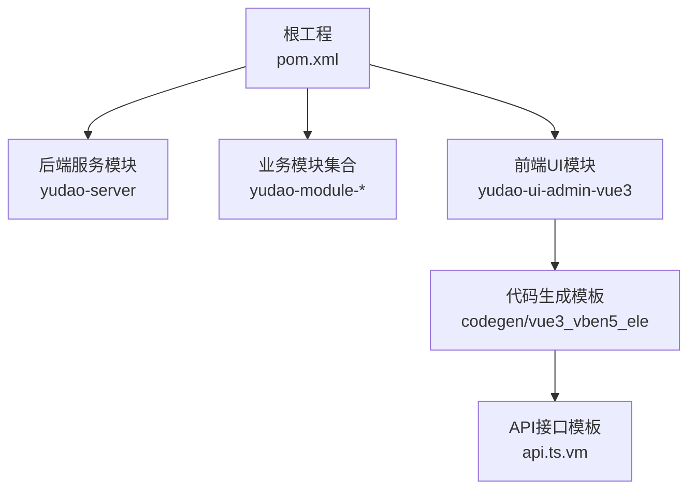
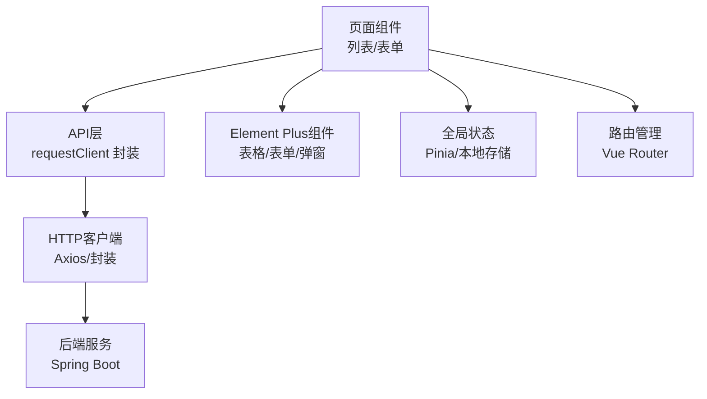
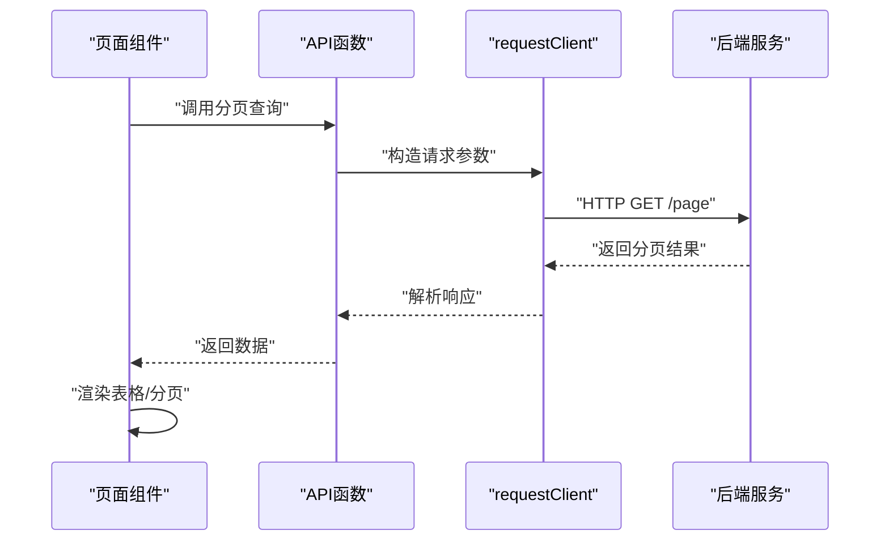
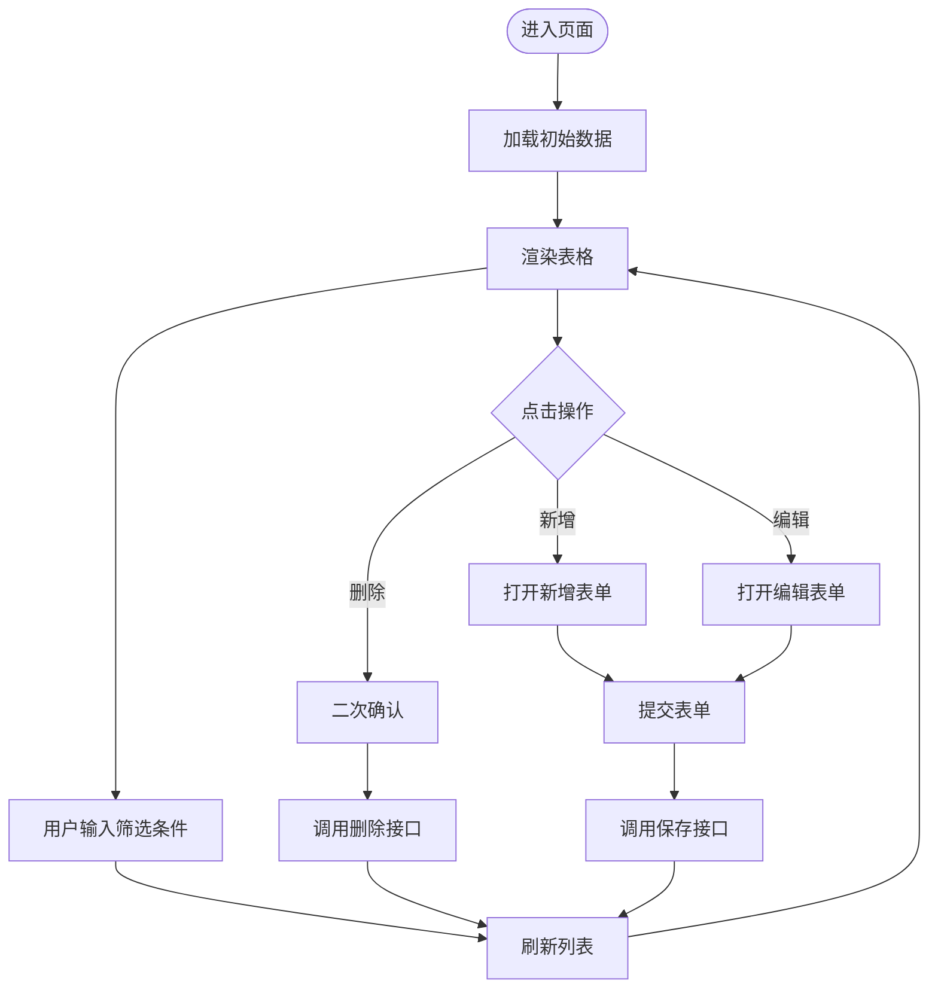
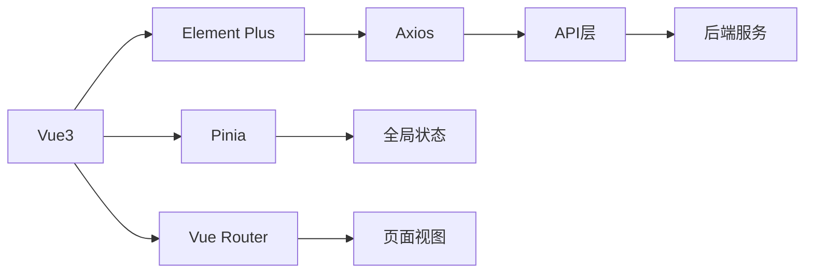

# Vue3前端技术栈

<cite>
**本文引用的文件**
- [README.md](file://yudao-ui/yudao-ui-admin-vue3/README.md)
- [pom.xml](file://pom.xml)
- [api.ts.vm](file://yudao-module-infra/src/main/resources/codegen/vue3_vben5_ele/schema/api/api.ts.vm)
</cite>

## 目录
1. [引言](#引言)
2. [项目结构](#项目结构)
3. [核心组件](#核心组件)
4. [架构总览](#架构总览)
5. [详细组件分析](#详细组件分析)
6. [依赖分析](#依赖分析)
7. [性能考虑](#性能考虑)
8. [故障排查指南](#故障排查指南)
9. [结论](#结论)
10. [附录](#附录)

## 引言
本文件面向AgenticCPS系统中的Vue3前端技术栈，聚焦于基于Vue3与Element Plus的管理后台实现。通过对现有工程结构与代码生成模板的分析，梳理Composition API、响应式系统、Teleport与Suspense等特性在项目中的落地方式，并结合Element Plus组件库的集成实践，总结组件设计模式、生命周期管理、状态管理最佳实践以及TypeScript支持与性能优化策略。同时，提供常见业务场景（组件通信、路由管理、API调用）的实现思路与参考路径。

## 项目结构
- 项目采用前后端分离的多模块架构，前端Vue3管理后台位于独立UI模块中，便于复用与扩展。
- 工程根目录的构建配置表明后端以Spring Boot为主，前端通过代码生成器模板快速产出页面与API层代码，形成“模板驱动”的开发范式。

图示来源
- [pom.xml](file://pom.xml)
- [README.md](file://yudao-ui/yudao-ui-admin-vue3/README.md)
- [api.ts.vm](file://yudao-module-infra/src/main/resources/codegen/vue3_vben5_ele/schema/api/api.ts.vm)

章节来源
- [pom.xml](file://pom.xml)
- [README.md](file://yudao-ui/yudao-ui-admin-vue3/README.md)

## 核心组件
- 组件设计模式
  - 基于模板的页面生成：通过代码生成器模板批量产出页面、表格、表单与API层代码，降低重复劳动并统一风格。
  - 页面级组件：通常由“列表/表单 + 表格 + 操作按钮”构成，配合Element Plus组件库实现交互。
  - 业务组件：围绕领域模型抽象通用组件（如字典选择器、文件上传、富文本编辑等），提升复用性。
- 生命周期管理
  - 在页面组件中合理使用onMounted/onUnmounted进行资源初始化与清理；对异步请求与定时任务进行统一管理。
  - 列表组件常在onMounted中触发首次加载，在路由切换或查询条件变更时通过watch或方法调用刷新数据。
- 状态管理最佳实践
  - 局部状态：使用Composition API的ref/reactive管理组件内部状态。
  - 全局状态：结合项目约定的全局状态容器（如pinia）集中管理用户信息、权限菜单、主题设置等。
  - 表单状态：使用表单校验库与受控组件模式，确保输入一致性与可恢复性。
- Element Plus集成
  - 基础组件：表格、表单、弹窗、分页、下拉选择、日期时间选择等。
  - 业务组件：结合项目封装的二次组件（如导入导出、批量操作、树形选择等）。
  - 主题与样式：遵循Element Plus的设计规范，按需引入组件与样式，避免全局污染。
- TypeScript支持
  - 接口定义：通过模板生成的API类型定义，确保请求/响应的数据结构清晰且可维护。
  - 类型推断：利用泛型与联合类型约束参数与返回值，减少运行时错误。
- 性能优化策略
  - 组件懒加载：路由级懒加载与动态导入，减少首屏体积。
  - 列表虚拟滚动：大数据量表格启用虚拟滚动，降低DOM压力。
  - 请求缓存：对高频查询结果进行缓存，避免重复请求。
  - 图片与静态资源：压缩与CDN加速，合理使用SVG图标。
- 开发工具链配置
  - 构建工具：基于Vite的现代打包流程，支持热更新与快速冷启动。
  - 代码规范：ESLint + Prettier + Commitlint，保证代码质量与提交规范。
  - 测试：单元测试与端到端测试覆盖关键流程，保障稳定性。

章节来源
- [api.ts.vm](file://yudao-module-infra/src/main/resources/codegen/vue3_vben5_ele/schema/api/api.ts.vm)

## 架构总览
下图展示Vue3前端在AgenticCPS中的典型交互关系：页面组件通过API层发起HTTP请求，后端返回数据后渲染至Element Plus组件，全局状态与路由共同驱动页面流转。

图示来源
- [api.ts.vm](file://yudao-module-infra/src/main/resources/codegen/vue3_vben5_ele/schema/api/api.ts.vm)

## 详细组件分析

### API调用与类型安全
- 生成规则
  - 模板根据数据库表结构生成对应的API命名空间与接口类型，统一管理请求参数与响应结构。
  - 支持分页查询、详情获取、新增/修改、删除、批量删除与导出等标准操作。
- 调用流程
  - 页面组件在onMounted中调用分页查询，将结果绑定到表格组件。
  - 表单组件在提交时调用新增/修改接口，成功后刷新列表并关闭弹窗。
  - 删除操作前进行二次确认，调用删除接口后刷新列表。
- 类型约束
  - 通过模板生成的接口类型定义，确保请求参数与响应数据结构一致，减少类型错误。

图示来源
- [api.ts.vm](file://yudao-module-infra/src/main/resources/codegen/vue3_vben5_ele/schema/api/api.ts.vm)

章节来源
- [api.ts.vm](file://yudao-module-infra/src/main/resources/codegen/vue3_vben5_ele/schema/api/api.ts.vm)

### 组件通信与状态管理
- Props/Emits
  - 子传父：通过emits声明事件，父组件监听并更新状态。
  - 爷传孙：通过provide/inject跨层级传递共享状态。
- 全局状态
  - 用户信息、权限菜单、主题设置等通过全局状态容器集中管理，组件内仅消费与派发动作。
- 表单联动
  - 使用watch监听字段变化，动态计算其他字段或触发远程校验。
- 列表筛选
  - 查询表单与表格联动，清空条件时重置分页与排序。

图示来源
- [api.ts.vm](file://yudao-module-infra/src/main/resources/codegen/vue3_vben5_ele/schema/api/api.ts.vm)

章节来源
- [api.ts.vm](file://yudao-module-infra/src/main/resources/codegen/vue3_vben5_ele/schema/api/api.ts.vm)

### Element Plus组件封装与自定义
- 常用封装
  - 富文本编辑器：基于第三方库封装，支持图片上传与内容校验。
  - 文件上传：支持多文件、拖拽上传与进度反馈。
  - 字典选择：统一从后端拉取字典项，支持远程搜索与缓存。
  - 树形选择：支持多选与半选状态，适用于部门/角色等层级数据。
- 自定义组件
  - 按钮组：组合多个操作按钮，统一禁用态与loading态。
  - 卡片布局：用于详情页与表单容器，提升信息密度。
  - 动态表单：根据配置动态生成表单项，减少重复代码。

章节来源
- [README.md](file://yudao-ui/yudao-ui-admin-vue3/README.md)

## 依赖分析
- 技术栈依赖
  - Vue3：核心框架，提供响应式与组合式API。
  - Element Plus：UI组件库，提供丰富的业务组件。
  - Vue Router：前端路由，支持嵌套路由与懒加载。
  - Pinia：状态管理，替代Vuex，更契合Composition API。
  - Axios：HTTP客户端，统一拦截器与错误处理。
  - Vite：构建工具，提供快速开发体验。
- 模块间耦合
  - 页面组件依赖API层与Element Plus组件，API层依赖HTTP客户端。
  - 全局状态与路由解耦页面组件，通过store与router实例注入。
- 循环依赖风险
  - 避免页面组件直接依赖全局状态容器，通过组合式函数封装状态逻辑。
  - API层不依赖页面组件，保持纯函数式设计。

图示来源
- [pom.xml](file://pom.xml)
- [api.ts.vm](file://yudao-module-infra/src/main/resources/codegen/vue3_vben5_ele/schema/api/api.ts.vm)

章节来源
- [pom.xml](file://pom.xml)
- [api.ts.vm](file://yudao-module-infra/src/main/resources/codegen/vue3_vben5_ele/schema/api/api.ts.vm)

## 性能考虑
- 代码分割
  - 路由级懒加载与动态导入，减少首屏包体。
- 渲染优化
  - 大列表启用虚拟滚动，控制每行渲染的DOM数量。
  - 表单组件使用受控模式，避免不必要的重渲染。
- 请求优化
  - 对高频查询结果进行缓存，设置合理的过期时间。
  - 合并多次请求，减少网络往返。
- 资源优化
  - 图标与图片资源压缩，使用SVG与WebP格式。
  - 静态资源CDN部署，提升加载速度。

## 故障排查指南
- 常见问题
  - 请求失败：检查接口路径、鉴权头与跨域配置；查看网络面板与后端日志。
  - 表单校验异常：确认校验规则与字段类型匹配，关注必填与格式要求。
  - 权限不足：核对用户角色与菜单权限，确认路由守卫与按钮显隐逻辑。
  - 组件渲染错位：检查CSS作用域与Element Plus主题变量，避免全局污染。
- 调试建议
  - 使用浏览器开发者工具定位网络与渲染问题。
  - 在全局状态容器中打印关键状态变化，辅助定位逻辑错误。
  - 对API层增加统一错误提示与重试机制，提升用户体验。

## 结论
AgenticCPS系统基于Vue3与Element Plus构建了高复用、易维护的管理后台。通过模板驱动的代码生成与标准化的API层，实现了前后端协作的高效闭环。结合Composition API与TypeScript，提升了开发效率与代码质量；借助Element Plus组件库与全局状态管理，增强了交互体验与可扩展性。未来可在虚拟滚动、缓存策略与自动化测试方面持续优化，进一步提升性能与稳定性。

## 附录
- 参考路径
  - 页面与API生成模板：[api.ts.vm](file://yudao-module-infra/src/main/resources/codegen/vue3_vben5_ele/schema/api/api.ts.vm)
  - 项目说明：[README.md](file://yudao-ui/yudao-ui-admin-vue3/README.md)
  - 根工程配置：[pom.xml](file://pom.xml)