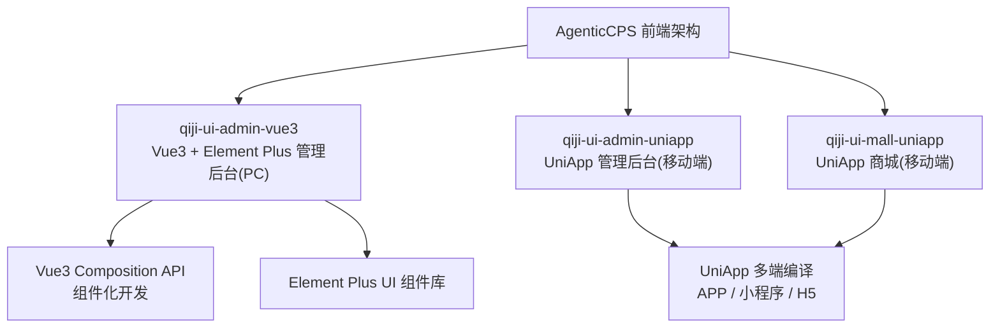
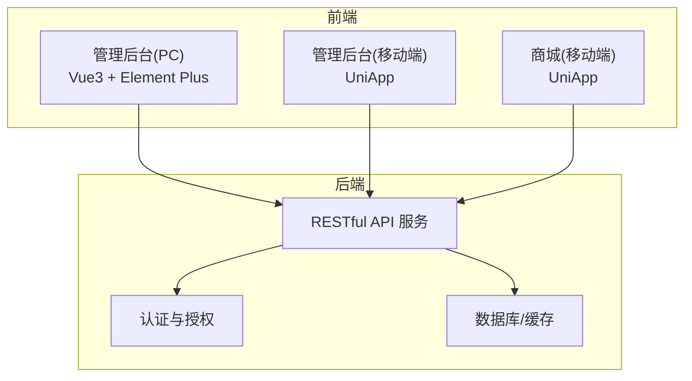
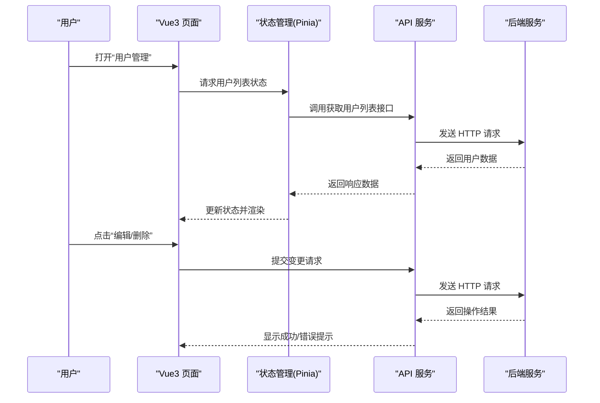
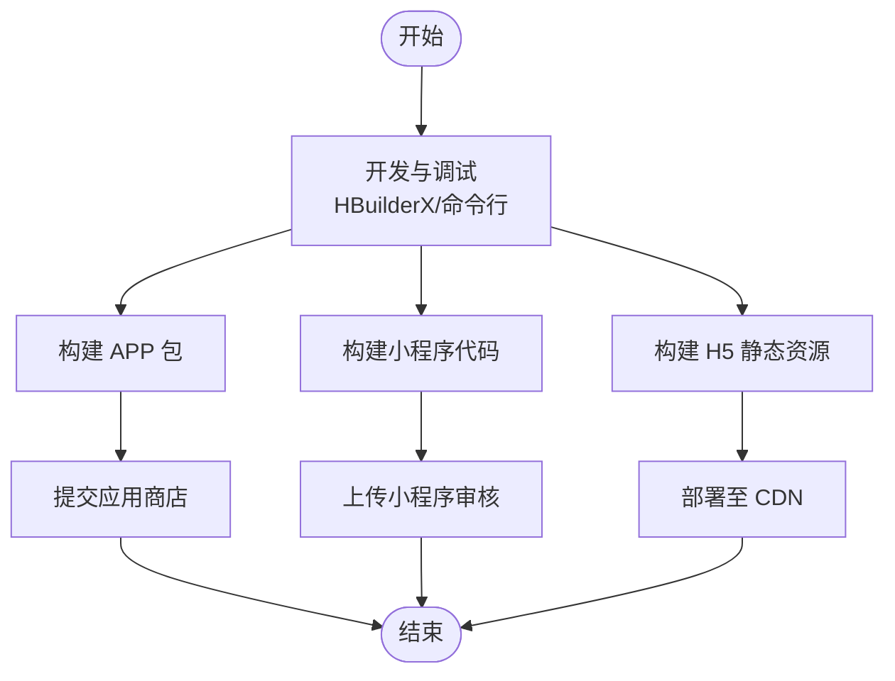
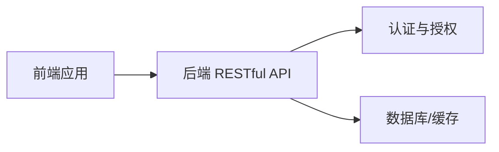

# 前端架构设计

<cite>
**本文引用的文件**
- [README.md](file://README.md)
- [qiji-ui-admin-vue3/README.md](file://qiji-ui-admin-vue3/README.md)
- [qiji-ui-admin-uniapp/README.md](file://qiji-ui-admin-uniapp/README.md)
- [qiji-ui-mall-uniapp/README.md](file://qiji-ui-mall-uniapp/README.md)
</cite>

## 目录
1. [引言](#引言)
2. [项目结构](#项目结构)
3. [核心组件](#核心组件)
4. [架构总览](#架构总览)
5. [详细组件分析](#详细组件分析)
6. [依赖分析](#依赖分析)
7. [性能考虑](#性能考虑)
8. [故障排查指南](#故障排查指南)
9. [结论](#结论)
10. [附录](#附录)

## 引言
本设计文档面向 AgenticCPS 系统的前端架构，围绕 Vue3 + Element Plus 的管理后台前端与 UniApp 多端适配方案展开，系统性阐述 Composition API、响应式系统与组件化开发优势；说明如何通过一份代码实现 APP、小程序、H5 的多端部署；梳理前端目录结构、组件设计模式、路由与状态管理、样式规范；并介绍前端与后端的交互方式（API 调用、认证机制、错误处理）、构建与部署流程（开发环境、生产打包、CDN 部署），最后给出前端开发最佳实践与常见问题解决方案。

## 项目结构
根据仓库信息，前端相关模块以“qiji-ui”命名空间组织，包含：
- qiji-ui-admin-vue3：基于 Vue3 + Element Plus 的管理后台 PC 端前端
- qiji-ui-admin-uniapp：基于 UniApp 的管理后台移动端（APP/小程序/H5）
- qiji-ui-mall-uniapp：基于 UniApp 的商城移动端（APP/小程序/H5）

上述模块均提供独立的 README 作为使用说明与运行指引。

**章节来源**
- [README.md: 第17-19行:17-19](file://README.md#L17-L19)
- [qiji-ui-admin-vue3/README.md](file://qiji-ui-admin-vue3/README.md)
- [qiji-ui-admin-uniapp/README.md](file://qiji-ui-admin-uniapp/README.md)
- [qiji-ui-mall-uniapp/README.md](file://qiji-ui-mall-uniapp/README.md)

## 核心组件
- Vue3 Composition API：提供更灵活的逻辑复用、更强的类型推断与更好的性能，适合大型复杂前端工程的状态与逻辑组织。
- 响应式系统：基于 Proxy 的响应式数据管理，配合组合式函数（Composables）实现跨组件共享状态与逻辑。
- 组件化开发：以功能域驱动的组件拆分，结合单文件组件（.vue）实现视图、逻辑与样式的统一管理。
- Element Plus：提供丰富的桌面端 UI 组件，覆盖表单、表格、弹窗、导航等管理后台高频场景。
- UniApp：通过 nvue/wx/plus 等多端适配层，实现一套代码多端运行，降低移动端开发成本。

**章节来源**
- [README.md: 第17-19行:17-19](file://README.md#L17-L19)

## 架构总览
前端整体采用“多端同源”的架构策略：
- 管理后台 PC 端：Vue3 + Element Plus，聚焦复杂交互与数据可视化。
- 管理后台移动端：UniApp，统一适配 APP、小程序、H5，减少重复开发。
- 商城移动端：UniApp，面向 C 端用户，强调流畅体验与多端一致性。

## 详细组件分析

### Vue3 + Element Plus 管理后台（PC 端）
- 技术要点
  - Composition API：使用 <script setup> 与组合式函数组织页面逻辑，便于状态抽取与复用。
  - 响应式系统：通过 ref/reactive 管理页面状态，结合 computed/watch 实现派生状态与副作用。
  - 组件化：按功能域拆分页面组件、业务组件与通用组件，统一通过路由懒加载与按需引入优化首屏。
  - UI 组件：大量使用 Element Plus 的 Form/Table/Dialog/Tree 等组件，提升开发效率与一致性。
- 目录建议（基于通用实践）
  - views：页面级组件（按模块划分）
  - components：通用业务组件（如搜索表单、数据卡片、操作按钮）
  - hooks：组合式函数（如 useTable、useForm、useAuth）
  - router：路由配置与权限守卫
  - store：状态管理（Pinia），按模块划分状态域
  - api：接口封装（axios 封装、拦截器、错误处理）
  - styles：样式规范（变量、混入、主题）
  - utils：工具函数（日期、格式化、校验）
- 交互流程（以“用户管理”为例）
  - 页面进入 -> 路由守卫校验 -> 获取列表数据 -> 渲染表格 -> 操作（编辑/删除/重置密码）-> 提交请求 -> 成功提示 -> 刷新列表

**章节来源**
- [README.md: 第17-19行:17-19](file://README.md#L17-L19)
- [qiji-ui-admin-vue3/README.md](file://qiji-ui-admin-vue3/README.md)

### UniApp 多端适配（管理后台与商城移动端）
- 技术要点
  - 一套代码：通过条件编译与平台差异处理，实现 APP、小程序、H5 的统一维护。
  - 平台差异：利用 plus、wx、__VUE_NATIVE_GLOBAL__ 等平台 API，按需封装能力。
  - UI 适配：优先使用跨平台友好的组件与样式，必要时针对小程序/APP 做差异化处理。
  - 路由与页面：使用 uni-app 的路由体系，结合分包策略优化首屏加载。
  - 状态管理：可沿用 Vue3 + Pinia，或按需选择 uni-app 的本地存储方案。
- 目录建议（基于通用实践）
  - pages：页面目录（按模块划分）
  - components：通用组件（跨端兼容）
  - utils：平台差异工具（网络、存储、设备信息）
  - api：接口封装（统一拦截器、平台适配）
  - static：静态资源（图片、字体）
  - styles：样式规范（变量、主题）
  - manifest.json：多端配置（APP/小程序/H5）
- 多端编译流程
  - 开发阶段：使用 HBuilderX 或命令行进行多端预览
  - 构建阶段：分别输出 APP 包、小程序代码与 H5 静态资源
  - 部署阶段：APP 提交应用商店；小程序上传审核；H5 部署至 CDN

**章节来源**
- [README.md: 第17-19行:17-19](file://README.md#L17-L19)
- [qiji-ui-admin-uniapp/README.md](file://qiji-ui-admin-uniapp/README.md)
- [qiji-ui-mall-uniapp/README.md](file://qiji-ui-mall-uniapp/README.md)

### 组件设计模式
- 页面组件（Views）：负责页面布局与生命周期，调用业务组件与状态管理。
- 业务组件（Business Components）：封装具体业务能力（如搜索、筛选、分页、导入导出）。
- 通用组件（Common Components）：跨页面复用的 UI 组件（按钮、弹窗、表单控件）。
- 组合式函数（Composables）：抽离可复用的逻辑（如 useTable、useForm、useAuth）。
- 设计原则：单一职责、可测试、可维护、可扩展。

**章节来源**
- [README.md: 第17-19行:17-19](file://README.md#L17-L19)

### 路由配置与权限
- 路由：按模块划分路由表，支持嵌套路由与动态路由。
- 权限：结合后端返回的菜单与按钮权限，前端动态渲染菜单与控制按钮显隐。
- 导航：侧边栏/面包屑/标签页，确保多页面切换的连续性与可追溯性。

**章节来源**
- [README.md: 第17-19行:17-19](file://README.md#L17-L19)

### 状态管理（Pinia）
- 状态域划分：按模块（用户、权限、应用设置、表格状态）拆分 Store。
- 数据持久化：结合本地存储与后端拉取，保证刷新后状态一致。
- 异步处理：统一在 Action 中处理异步逻辑，集中错误处理与加载状态。

**章节来源**
- [README.md: 第17-19行:17-19](file://README.md#L17-L19)

### 样式规范
- 变量与主题：统一颜色、字号、间距、圆角等变量，支持明暗主题切换。
- 命名规范：BEM 或基于组件的命名约定，避免样式冲突。
- 响应式：移动端优先，结合媒体查询与弹性布局。

**章节来源**
- [README.md: 第17-19行:17-19](file://README.md#L17-L19)

## 依赖分析
- 前端技术栈
  - Vue3：核心框架，Composition API 提供更强的逻辑组织能力
  - Element Plus：桌面端 UI 组件库
  - UniApp：多端适配框架
  - Axios：HTTP 客户端
  - Pinia：状态管理
  - Vue Router/Pinia Router：路由与状态联动
- 后端接口
  - RESTful API：统一前缀（如 /admin-api、/app-api），按模块划分
  - 认证：Token（JWT/自定义），支持多终端与 SSO
  - 错误码：统一错误码与提示，前端按错误码做分支处理

**章节来源**
- [README.md: 第17-19行:17-19](file://README.md#L17-L19)

## 性能考虑
- 代码分割与懒加载：路由级懒加载与组件按需引入，降低首屏体积。
- 图片与静态资源：压缩与 CDN 加速，使用 WebP/AVIF 等现代格式。
- 缓存策略：合理使用浏览器缓存与服务端缓存，减少重复请求。
- 事件节流与防抖：高频交互（搜索、滚动）使用节流/防抖优化。
- 组件渲染优化：避免不必要的重渲染，合理使用 v-memo/v-memo-keyed。
- 多端性能：UniApp 场景下注意原生组件与 JS 桥接的性能影响，尽量减少频繁跨层调用。

## 故障排查指南
- 登录与鉴权
  - 现象：登录后跳转异常或页面空白
  - 排查：检查 Token 是否过期、后端是否返回正确权限、路由守卫逻辑
- 接口请求
  - 现象：请求超时/401/500
  - 排查：查看拦截器日志、统一错误处理、核对后端接口路径与权限
- 多端差异
  - 现象：小程序/APP 行为不一致
  - 排查：确认平台 API 封装、条件编译与平台差异处理
- 样式问题
  - 现象：样式错乱/主题不生效
  - 排查：检查变量覆盖、命名空间、媒体查询与平台样式差异

**章节来源**
- [README.md: 第17-19行:17-19](file://README.md#L17-L19)

## 结论
AgenticCPS 前端采用“Vue3 + Element Plus + UniApp”的多端同源架构，既满足管理后台 PC 端的复杂交互需求，又通过 UniApp 实现 APP、小程序、H5 的高效复用。通过合理的目录结构、组件设计模式、路由与状态管理、统一的 API 与认证机制，以及完善的性能与故障排查策略，能够支撑系统的长期演进与高质量交付。

## 附录
- 开发与构建
  - 开发环境：安装 Node.js、HBuilderX（UniApp）、IDE（VSCode）
  - 依赖安装：yarn/npm 安装依赖
  - 启动：分别启动各前端模块的开发服务器
  - 生产构建：按模块执行构建命令，产出对应产物
  - 部署：APP 提交商店；小程序上传审核；H5 部署 CDN
- 最佳实践
  - 代码规范：统一 ESLint/Prettier，组件命名与目录规范
  - 组件复用：优先组合式函数与高阶组件，减少重复逻辑
  - 性能优化：按需加载、缓存策略、渲染优化
  - 调试工具：Vue Devtools、HBuilderX 调试、浏览器 Network/Console

**章节来源**
- [README.md: 第17-19行:17-19](file://README.md#L17-L19)
- [qiji-ui-admin-vue3/README.md](file://qiji-ui-admin-vue3/README.md)
- [qiji-ui-admin-uniapp/README.md](file://qiji-ui-admin-uniapp/README.md)
- [qiji-ui-mall-uniapp/README.md](file://qiji-ui-mall-uniapp/README.md)