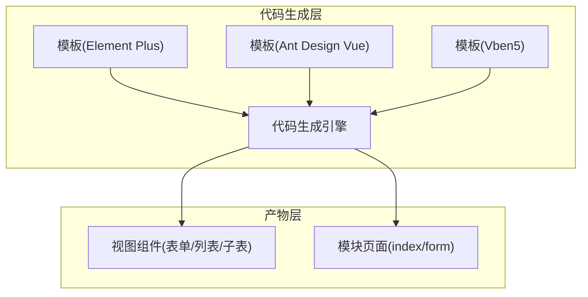
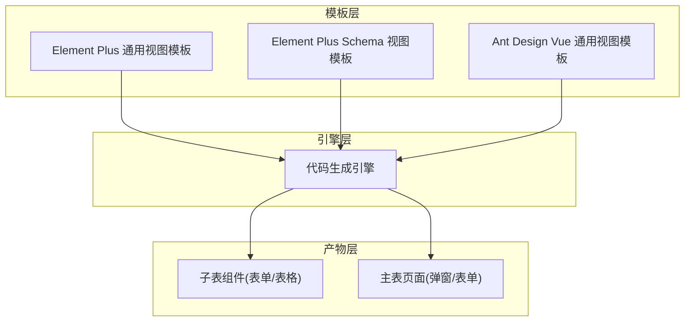
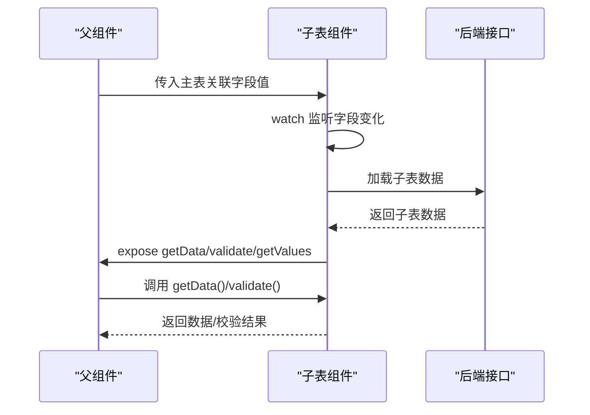
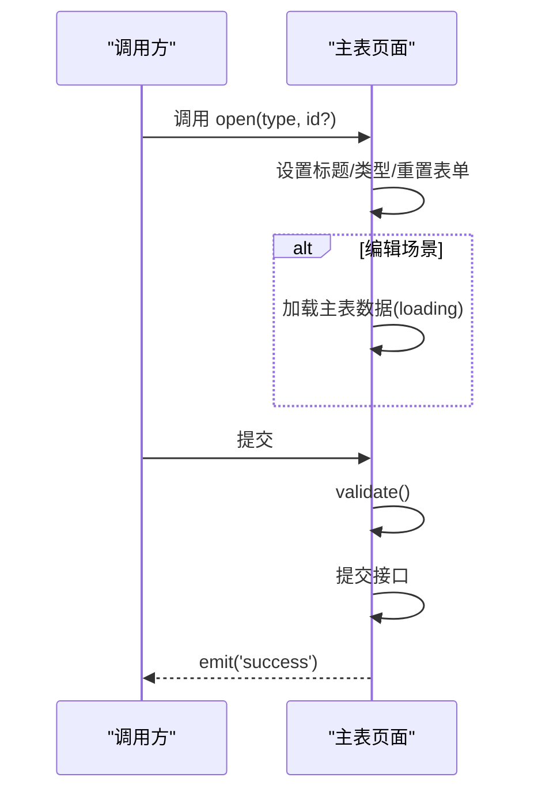
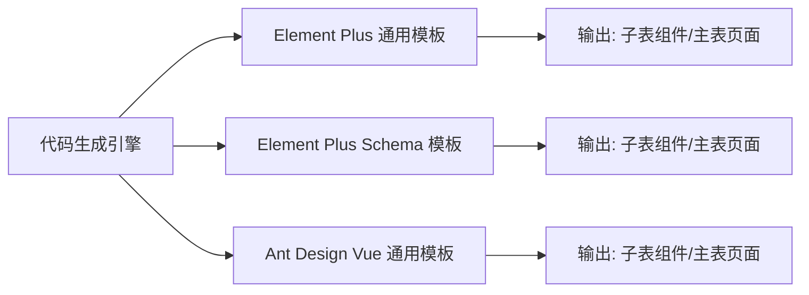

# 组件设计与复用

<cite>
**本文引用的文件**
- [form_sub_normal.vue.vm（Vben5 + Element Plus + 通用视图）](file://yudao-module-infra/src/main/resources/codegen/vue3_vben5_ele/general/views/modules/form_sub_normal.vue.vm)
- [form_sub_normal.vue.vm（Vben5 + Element Plus + Schema 视图）](file://yudao-module-infra/src/main/resources/codegen/vue3_vben5_ele/schema/views/modules/form_sub_normal.vue.vm)
- [form_sub_normal.vue.vm（Ant Design Vue + Vben5）](file://yudao-module-infra/src/main/resources/codegen/vue3_vben5_antd/general/views/modules/form_sub_normal.vue.vm)
- [form.vue.vm（Vben5 + Element Plus + 通用视图）](file://yudao-module-infra/src/main/resources/codegen/vue3_vben5_ele/general/views/form.vue.vm)
- [form.vue.vm（Vben5 + Element Plus + Schema 视图）](file://yudao-module-infra/src/main/resources/codegen/vue3_vben5_ele/schema/views/form.vue.vm)
- [form.vue.vm（Vben + Ant Design Vue）](file://yudao-module-infra/src/main/resources/codegen/vue3_vben5_antd/general/views/form.vue.vm)
- [CodegenEngine.java（代码生成映射与规则）](file://yudao-module-infra/src/main/java/cn/iocoder/yudao/module/infra/service/codegen/inner/CodegenEngine.java)
- [README.md（项目说明）](file://README.md)
</cite>

## 目录
1. [引言](#引言)
2. [项目结构](#项目结构)
3. [核心组件](#核心组件)
4. [架构总览](#架构总览)
5. [组件详细分析](#组件详细分析)
6. [依赖分析](#依赖分析)
7. [性能考虑](#性能考虑)
8. [故障排查指南](#故障排查指南)
9. [结论](#结论)
10. [附录](#附录)

## 引言
本文件面向 AgenticCPS 系统前端组件设计，聚焦于组件化开发的设计原则与实践，涵盖职责分离、接口设计、状态管理、组件分类与复用策略、生命周期与性能优化、错误边界处理以及最佳实践。文档以代码生成模板与引擎为线索，结合 Vue3 + Vben5 + Element Plus/Ant Design 的工程化实践，给出可落地的组件设计与复用方案。

## 项目结构
AgenticCPS 前端采用多模板代码生成体系，围绕“主子表”“表单/列表”“通用/Schema 视图”等场景，输出可直接使用的组件与页面。关键结构如下：
- 代码生成模板位于模块化资源目录，按框架（Element Plus / Ant Design Vue）、UI 框架版本（Vben5）、视图风格（通用/Schema）进行分层组织。
- 代码生成引擎负责将模板与数据库元数据绑定，输出最终的 Vue3 组件与页面文件。
- 生成的组件遵循统一的 Props/Expose/事件/插槽约定，便于跨页面复用与维护。

**章节来源**
- [README.md: 项目说明:444-455](file://README.md#L444-L455)

## 核心组件
AgenticCPS 前端的核心组件围绕“主子表”场景展开，主要分为两类：
- 子表组件：支持一对多表格与表单两种形态，具备增删改查、数据联动、校验暴露、数据导出等能力。
- 主表页面：封装弹窗/抽屉、表单校验、提交流程、成功回调等。

这些组件通过统一的 Props（如主表关联字段）、Expose（getData/validate/getValues/open）与事件（success）实现父子通信与复用。

**章节来源**
- [form_sub_normal.vue.vm（Vben5 + Element Plus + 通用视图）:29-110](file://yudao-module-infra/src/main/resources/codegen/vue3_vben5_ele/general/views/modules/form_sub_normal.vue.vm#L29-L110)
- [form_sub_normal.vue.vm（Vben5 + Element Plus + Schema 视图）:29-135](file://yudao-module-infra/src/main/resources/codegen/vue3_vben5_ele/schema/views/modules/form_sub_normal.vue.vm#L29-L135)
- [form.vue.vm（Vben5 + Element Plus + 通用视图）:179-223](file://yudao-module-infra/src/main/resources/codegen/vue3_vben5_ele/general/views/form.vue.vm#L179-L223)

## 架构总览
AgenticCPS 前端组件架构由“模板 + 引擎 + 产物”三层构成，模板覆盖 Element Plus 与 Ant Design Vue 两大生态，视图风格包含通用与 Schema 两类；引擎根据业务表元数据与模板映射，生成可直接运行的组件与页面。

**图表来源**
- [CodegenEngine.java（模板映射与生成规则）:113-134](file://yudao-module-infra/src/main/java/cn/iocoder/yudao/module/infra/service/codegen/inner/CodegenEngine.java#L113-L134)

**章节来源**
- [CodegenEngine.java（模板映射与生成规则）:113-134](file://yudao-module-infra/src/main/java/cn/iocoder/yudao/module/infra/service/codegen/inner/CodegenEngine.java#L113-L134)

## 组件详细分析

### 子表组件（一对多：表格/表单）
子表组件承担“主子表”联动职责，通过监听主表关联字段变化，动态加载子表数据，并提供统一的外部接口供父组件调用。

- 设计要点
  - Props：接收主表关联字段值，驱动数据加载。
  - 状态：表格形态使用 ref + 表格实例；表单形态使用响应式对象与校验规则。
  - 生命周期：mounted/watch 触发数据加载；nextTick 确保 DOM 就绪。
  - Expose：暴露 getData/validate/getValues 等方法，便于父组件收集与校验。
  - 插槽/作用域插槽：表格列通过作用域插槽渲染不同输入控件（输入框、下拉、日期、富文本、图片/文件上传等）。

**图表来源**
- [form_sub_normal.vue.vm（Vben5 + Element Plus + 通用视图）:60-110](file://yudao-module-infra/src/main/resources/codegen/vue3_vben5_ele/general/views/modules/form_sub_normal.vue.vm#L60-L110)
- [form_sub_normal.vue.vm（Vben5 + Element Plus + Schema 视图）:88-135](file://yudao-module-infra/src/main/resources/codegen/vue3_vben5_ele/schema/views/modules/form_sub_normal.vue.vm#L88-L135)

**章节来源**
- [form_sub_normal.vue.vm（Vben5 + Element Plus + 通用视图）:29-110](file://yudao-module-infra/src/main/resources/codegen/vue3_vben5_ele/general/views/modules/form_sub_normal.vue.vm#L29-L110)
- [form_sub_normal.vue.vm（Vben5 + Element Plus + Schema 视图）:29-135](file://yudao-module-infra/src/main/resources/codegen/vue3_vben5_ele/schema/views/modules/form_sub_normal.vue.vm#L29-L135)

### 主表页面（弹窗/表单）
主表页面负责打开弹窗、加载数据、执行表单校验、提交并回调成功事件。页面通过 defineExpose 暴露 open 方法，供外部触发。

- 设计要点
  - 弹窗控制：dialogVisible/dialogTitle/formType 控制弹窗状态与标题。
  - 数据加载：open(id) 时异步加载主表数据，期间显示加载态。
  - 表单校验：handleSubmit 中统一 validate 并提交，成功后关闭弹窗并触发 success 事件。
  - 事件通信：emit('success') 通知父组件刷新列表或执行后续逻辑。

**图表来源**
- [form.vue.vm（Vben5 + Element Plus + 通用视图）:179-223](file://yudao-module-infra/src/main/resources/codegen/vue3_vben5_ele/general/views/form.vue.vm#L179-L223)

**章节来源**
- [form.vue.vm（Vben5 + Element Plus + 通用视图）:179-223](file://yudao-module-infra/src/main/resources/codegen/vue3_vben5_ele/general/views/form.vue.vm#L179-L223)

### 组件分类与设计模式
- 业务组件：围绕“主子表”场景的子表组件与主表页面，承担数据联动与交互闭环。
- 通用组件：上传组件（图片/文件）、富文本、字典选项等，通过模板注入复用。
- 布局组件：弹窗/抽屉、表格、表单容器等，统一风格与行为。
- 设计模式：模板方法（不同框架/风格模板）、适配器（VxeTable 适配）、暴露接口（Expose）与事件（success）。

**章节来源**
- [form_sub_normal.vue.vm（Vben5 + Element Plus + 通用视图）:15-27](file://yudao-module-infra/src/main/resources/codegen/vue3_vben5_ele/general/views/modules/form_sub_normal.vue.vm#L15-L27)
- [form.vue.vm（Vben5 + Element Plus + 通用视图）:200-223](file://yudao-module-infra/src/main/resources/codegen/vue3_vben5_ele/general/views/form.vue.vm#L200-L223)

### 组件复用策略
- Props 传递：主表关联字段作为唯一输入，确保子表组件无状态化与高复用性。
- 事件通信：子表组件通过 Expose 暴露 getData/validate/getValues；主表页面通过 success 事件与父组件解耦。
- 插槽与作用域插槽：表格列通过作用域插槽渲染不同输入控件，满足复杂字段类型。
- 代码生成：同一模板可生成 Element Plus 与 Ant Design Vue 两套实现，保持接口一致，便于切换与迁移。

**章节来源**
- [form_sub_normal.vue.vm（Vben5 + Element Plus + 通用视图）:113-238](file://yudao-module-infra/src/main/resources/codegen/vue3_vben5_ele/general/views/modules/form_sub_normal.vue.vm#L113-L238)
- [form_sub_normal.vue.vm（Vben5 + Element Plus + Schema 视图）:138-204](file://yudao-module-infra/src/main/resources/codegen/vue3_vben5_ele/schema/views/modules/form_sub_normal.vue.vm#L138-L204)

### 生命周期管理
- mounted/onMounted：初始化依赖（如表格实例、表单引用）。
- watch：监听主表关联字段变化，触发数据加载。
- nextTick：确保 DOM 更新后再读取/设置数据，避免竞态。
- defineExpose：在组件内部暴露方法，供父组件安全调用。

**章节来源**
- [form_sub_normal.vue.vm（Vben5 + Element Plus + 通用视图）:60-110](file://yudao-module-infra/src/main/resources/codegen/vue3_vben5_ele/general/views/modules/form_sub_normal.vue.vm#L60-L110)
- [form_sub_normal.vue.vm（Vben5 + Element Plus + Schema 视图）:88-135](file://yudao-module-infra/src/main/resources/codegen/vue3_vben5_ele/schema/views/modules/form_sub_normal.vue.vm#L88-L135)

### 性能优化
- 代码生成规范化：引擎对生成代码进行格式化与清理，减少前端格式校验报错与冗余逗号。
- 按需引入：仅在需要时引入对应 UI 组件与适配器，降低包体体积。
- 渲染优化：表格列通过作用域插槽按需渲染，避免不必要的全局更新。

**章节来源**
- [CodegenEngine.java（代码生成规范化与清理）:391-411](file://yudao-module-infra/src/main/java/cn/iocoder/yudao/module/infra/service/codegen/inner/CodegenEngine.java#L391-L411)

### 错误边界处理
- 表单校验：通过 validate 明确校验入口，失败时阻止提交。
- 加载态：弹窗打开与提交过程中设置 loading，避免重复提交。
- 事件回调：成功后统一 emit('success')，由父组件决定刷新策略。

**章节来源**
- [form.vue.vm（Vben5 + Element Plus + 通用视图）:37-52](file://yudao-module-infra/src/main/resources/codegen/vue3_vben5_ele/general/views/form.vue.vm#L37-L52)

## 依赖分析
模板与产物之间的依赖关系由引擎映射决定，不同前端类型（Vue2/Vue3）、UI 框架（Element Plus/Ant Design Vue）、视图风格（通用/Schema）分别对应不同的模板路径与输出路径。

**图表来源**
- [CodegenEngine.java（模板映射与生成规则）:113-134](file://yudao-module-infra/src/main/java/cn/iocoder/yudao/module/infra/service/codegen/inner/CodegenEngine.java#L113-L134)

**章节来源**
- [CodegenEngine.java（模板映射与生成规则）:113-134](file://yudao-module-infra/src/main/java/cn/iocoder/yudao/module/infra/service/codegen/inner/CodegenEngine.java#L113-L134)

## 性能考虑
- 生成代码的格式化与清理：引擎统一处理逗号与多余 dateFormatter，减少前端格式校验报错。
- 模板复用：同一模板可生成多套实现，减少重复劳动与维护成本。
- 按需渲染：通过作用域插槽与条件渲染，避免一次性渲染大量复杂控件。

**章节来源**
- [CodegenEngine.java（代码生成规范化与清理）:391-411](file://yudao-module-infra/src/main/java/cn/iocoder/yudao/module/infra/service/codegen/inner/CodegenEngine.java#L391-L411)

## 故障排查指南
- 生成代码格式问题：若出现前端格式校验报错，检查生成代码中是否存在多余逗号或未闭合对象，引擎已内置清理逻辑。
- 数据未加载：确认主表关联字段是否正确传入，watch 是否生效，nextTick 是否等待 DOM 更新。
- 校验失败：检查 validate 调用与表单规则，确保必填字段与类型匹配。
- 事件未触发：确认主表页面是否正确 emit('success')，父组件是否监听该事件。

**章节来源**
- [CodegenEngine.java（代码生成规范化与清理）:391-411](file://yudao-module-infra/src/main/java/cn/iocoder/yudao/module/infra/service/codegen/inner/CodegenEngine.java#L391-L411)
- [form.vue.vm（Vben5 + Element Plus + 通用视图）:220-223](file://yudao-module-infra/src/main/resources/codegen/vue3_vben5_ele/general/views/form.vue.vm#L220-L223)

## 结论
AgenticCPS 前端通过“模板 + 引擎 + 产物”的代码生成体系，实现了组件化与复用的工程化落地。子表组件与主表页面遵循统一的 Props/Expose/事件约定，配合作用域插槽与适配器，既能满足复杂业务场景，又能保证跨框架迁移与维护效率。建议在后续迭代中持续完善模板覆盖度与错误处理机制，进一步提升开发体验与稳定性。

## 附录
- 组件实现案例路径
  - 子表组件（通用视图）：[form_sub_normal.vue.vm（Vben5 + Element Plus + 通用视图）:1-342](file://yudao-module-infra/src/main/resources/codegen/vue3_vben5_ele/general/views/modules/form_sub_normal.vue.vm#L1-L342)
  - 子表组件（Schema 视图）：[form_sub_normal.vue.vm（Vben5 + Element Plus + Schema 视图）:1-205](file://yudao-module-infra/src/main/resources/codegen/vue3_vben5_ele/schema/views/modules/form_sub_normal.vue.vm#L1-L205)
  - 主表页面（通用视图）：[form.vue.vm（Vben5 + Element Plus + 通用视图）:1-223](file://yudao-module-infra/src/main/resources/codegen/vue3_vben5_ele/general/views/form.vue.vm#L1-L223)
  - 主表页面（Schema 视图）：[form.vue.vm（Vben5 + Element Plus + Schema 视图）:1-223](file://yudao-module-infra/src/main/resources/codegen/vue3_vben5_ele/schema/views/form.vue.vm#L1-L223)
  - 主表页面（Ant Design Vue）：[form.vue.vm（Vben + Ant Design Vue）:1-223](file://yudao-module-infra/src/main/resources/codegen/vue3_vben5_antd/general/views/form.vue.vm#L1-L223)
- 最佳实践
  - 命名规范：组件名与模块名保持一致，Props 使用语义化命名，Expose 方法语义明确。
  - 代码组织：模板按框架/风格分层，产物按模块/功能归类。
  - 文档编写：模板内补充注释与示例，便于二次开发与维护。