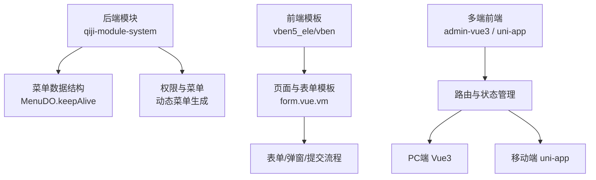
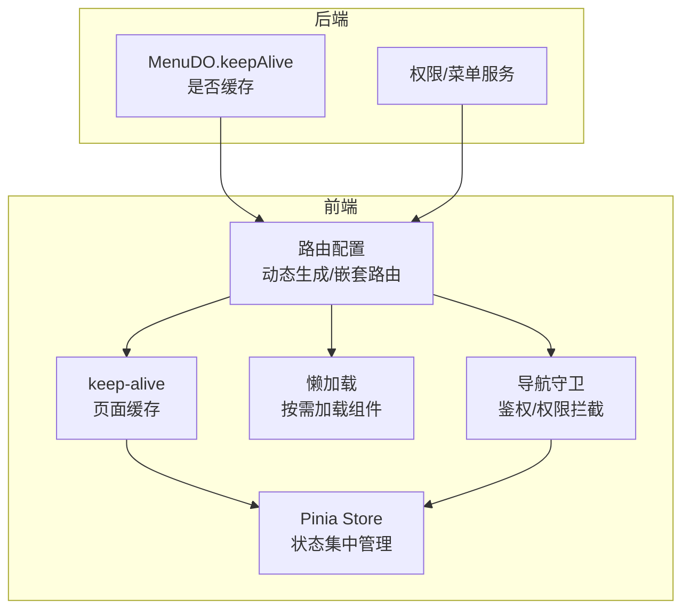
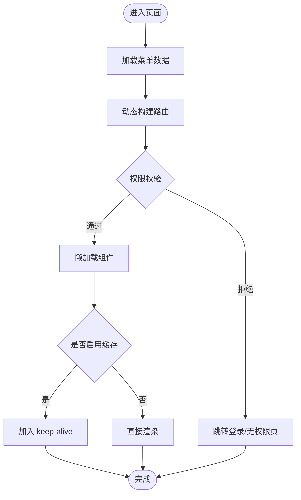
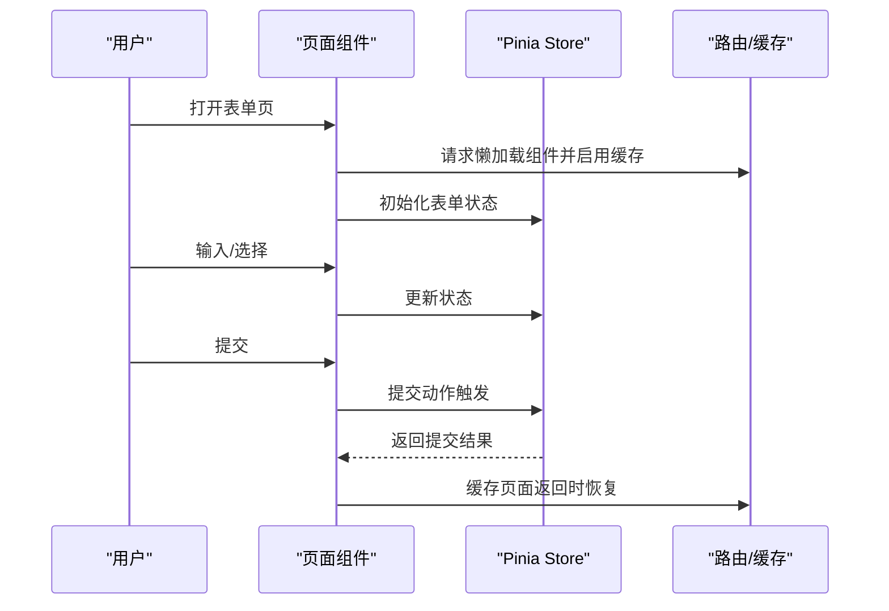
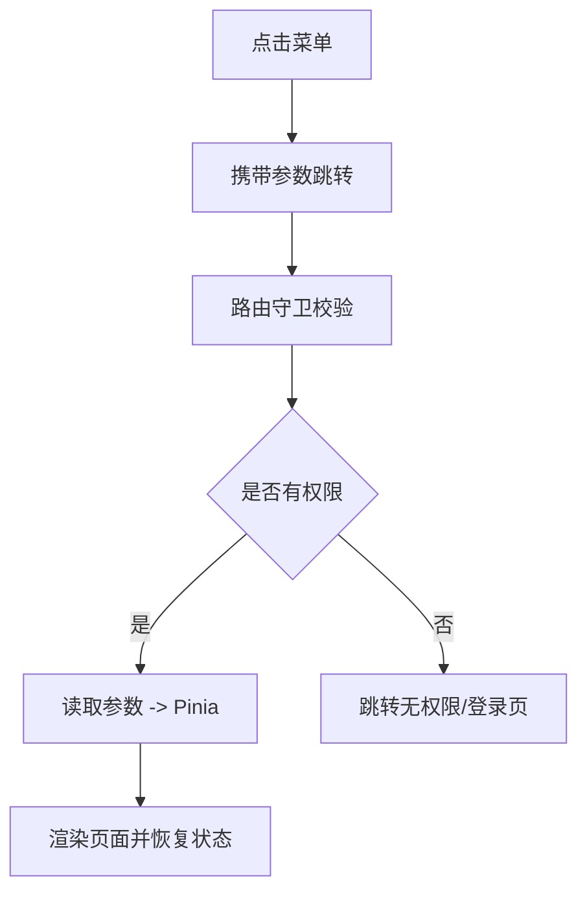
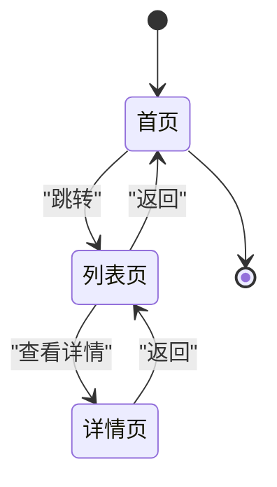
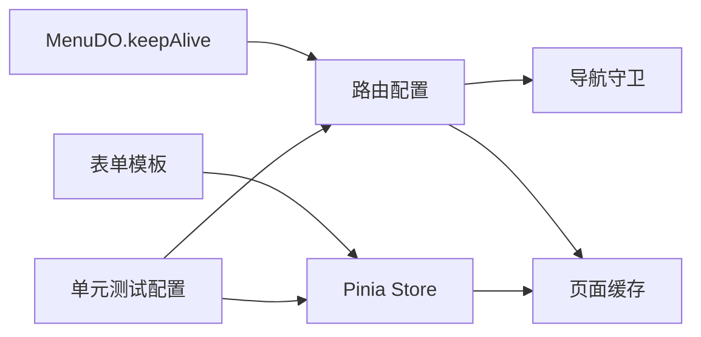

# 路由与状态管理

<cite>
**本文引用的文件**
- [README.md](file://README.md)
- [MenuDO.java](file://qiji-module-system/src/main/java/com.qiji.cps/module/system/dal/dataobject/permission/MenuDO.java)
- [application-unit-test.yaml](file://qiji-module-mall/qiji-module-trade/src/test/resources/application-unit-test.yaml)
- [form.vue.vm（vben5_ele）](file://qiji-module-infra/src/main/resources/codegen/vue3_vben5_ele/schema/views/form.vue.vm)
- [form_sub_erp.vue.vm（vben5_ele）](file://qiji-module-infra/src/main/resources/codegen/vue3_vben5_ele/schema/views/modules/form_sub_erp.vue.vm)
- [form.vue.vm（vben）](file://qiji-module-infra/src/main/resources/codegen/vue3_vben/schema/views/form.vue.vm)
</cite>

## 目录
1. [引言](#引言)
2. [项目结构](#项目结构)
3. [核心组件](#核心组件)
4. [架构总览](#架构总览)
5. [详细组件分析](#详细组件分析)
6. [依赖分析](#依赖分析)
7. [性能考量](#性能考量)
8. [故障排查指南](#故障排查指南)
9. [结论](#结论)
10. [附录](#附录)

## 引言
本文件聚焦 AgenticCPS 系统在前端侧的“路由与状态管理”主题，结合项目背景与现有代码线索，系统阐述 Vue Router 在本项目中的应用要点（如路由配置、导航守卫、懒加载、嵌套路由等），以及状态管理（以 Pinia 为核心）的设计与实践（模块化、持久化、与路由协同）。同时，针对多端环境（PC 端、移动端 uni-app）下的历史记录与回退处理给出建议，并总结最佳实践与配置示例路径。

## 项目结构
- 项目为多模块后端工程，前端以“管理后台”和“移动端 uni-app”为主，其中管理后台提供 Vue3 + element-plus、vben（ant-design-vue）两个版本的前端脚手架模板，便于快速生成页面与交互组件。
- 路由与状态管理通常位于前端工程中，本仓库未直接包含前端源码目录，但通过后端模块（如系统模块）的菜单数据结构可间接推断前端路由与缓存策略的落地方式。

**章节来源**
- [README.md: 第17-29行:17-29](file://README.md#L17-L29)
- [README.md: 第105-108行:105-108](file://README.md#L105-L108)

## 核心组件
- 路由与菜单联动
  - 后端菜单对象包含“是否缓存”字段，用于前端路由的 keep-alive 控制，确保菜单/目录级别的页面具备缓存能力。
- 状态管理（Pinia）
  - 本仓库未直接提供 Pinia 源码，但通过 vben 模板可观察到典型的表单状态与弹窗状态管理模式，可迁移至 Pinia 进行集中管理。
- 页面与表单模板
  - vben5_ele 与 vben 模板展示了表单的创建/编辑、弹窗打开/关闭、提交流程等典型交互，这些状态可抽象为 Pinia Store。

**章节来源**
- [MenuDO.java: 第96-101行:96-101](file://qiji-module-system/src/main/java/com.qiji.cps/module/system/dal/dataobject/permission/MenuDO.java#L96-L101)
- [form.vue.vm（vben5_ele）: 第1-32行:1-32](file://qiji-module-infra/src/main/resources/codegen/vue3_vben5_ele/schema/views/form.vue.vm#L1-L32)
- [form.vue.vm（vben）: 第33-58行:33-58](file://qiji-module-infra/src/main/resources/codegen/vue3_vben/schema/views/form.vue.vm#L33-L58)

## 架构总览
下图展示后端菜单数据如何影响前端路由与状态管理的协同：

**图示来源**
- [MenuDO.java: 第96-101行:96-101](file://qiji-module-system/src/main/java/com.qiji.cps/module/system/dal/dataobject/permission/MenuDO.java#L96-L101)
- [form.vue.vm（vben5_ele）: 第1-32行:1-32](file://qiji-module-infra/src/main/resources/codegen/vue3_vben5_ele/schema/views/form.vue.vm#L1-L32)
- [form.vue.vm（vben）: 第33-58行:33-58](file://qiji-module-infra/src/main/resources/codegen/vue3_vben/schema/views/form.vue.vm#L33-L58)

## 详细组件分析

### 路由配置与导航守卫
- 路由配置
  - 基于后端菜单数据动态生成前端路由，支持嵌套路由与父子菜单映射。
  - 菜单“是否缓存”字段对应前端路由的 keep-alive 配置，避免重复渲染。
- 导航守卫
  - 在进入路由前进行权限校验，若无权限则跳转至无权限或登录页。
  - 结合用户角色/菜单权限，动态过滤不可见路由。
- 懒加载
  - 将页面组件按需加载，减少首屏体积，提升性能。
- 嵌套路由
  - 通过父级菜单统一布局，子级菜单作为视图区域切换，形成清晰的页面层级。

**章节来源**
- [MenuDO.java: 第96-101行:96-101](file://qiji-module-system/src/main/java/com.qiji.cps/module/system/dal/dataobject/permission/MenuDO.java#L96-L101)

### 状态管理（Pinia）与页面缓存
- Pinia Store 设计
  - 将表单状态、弹窗状态、表格筛选条件等集中管理，避免跨组件重复维护。
  - 使用 action 触发表单提交、重置、刷新等操作，保持状态一致性。
- 页面缓存协同
  - 路由的 keep-alive 与 Pinia 状态共同作用：缓存页面结构与滚动位置，Pinia 管理表单数据，二者结合提升用户体验。
- 模块化管理
  - 按业务域拆分 Store（如用户、商品、订单），降低耦合度，便于维护与测试。

**章节来源**
- [form.vue.vm（vben5_ele）: 第1-32行:1-32](file://qiji-module-infra/src/main/resources/codegen/vue3_vben5_ele/schema/views/form.vue.vm#L1-L32)
- [form.vue.vm（vben）: 第33-58行:33-58](file://qiji-module-infra/src/main/resources/codegen/vue3_vben/schema/views/form.vue.vm#L33-L58)

### 参数传递与权限控制
- 参数传递
  - 通过路由 params/query 传递 ID/筛选条件；在页面激活时读取并同步到 Pinia，实现参数驱动的状态恢复。
- 权限控制
  - 后端返回菜单权限集合，前端在路由生成阶段即剔除无权限项；进入路由前再次校验，防止越权访问。

**章节来源**
- [MenuDO.java: 第96-101行:96-101](file://qiji-module-system/src/main/java/com.qiji.cps/module/system/dal/dataobject/permission/MenuDO.java#L96-L101)

### 多端环境下的历史记录与回退
- PC 端
  - 使用浏览器 History API，结合路由的 replace/navigate 控制前进/后退栈，避免重复记录。
- 移动端 uni-app
  - 使用 uni.navigateBack/redirectTo 等 API 控制页面栈，配合 Pinia 清理/恢复关键状态，保证回退体验一致。

**章节来源**
- [README.md: 第19行](file://README.md#L19)

## 依赖分析
- 后端菜单数据依赖
  - 菜单对象的“是否缓存”字段直接影响前端路由的 keep-alive 行为。
- 前端模板依赖
  - vben 模板提供了表单/弹窗的标准交互流程，可直接迁移到 Pinia 管理的状态中。
- 测试配置依赖
  - 单测配置中启用懒加载与延迟初始化，有助于验证前端路由与状态管理在复杂场景下的稳定性。

**图示来源**
- [MenuDO.java: 第96-101行:96-101](file://qiji-module-system/src/main/java/com.qiji.cps/module/system/dal/dataobject/permission/MenuDO.java#L96-L101)
- [form.vue.vm（vben5_ele）: 第1-32行:1-32](file://qiji-module-infra/src/main/resources/codegen/vue3_vben5_ele/schema/views/form.vue.vm#L1-L32)
- [application-unit-test.yaml: 第3行](file://qiji-module-mall/qiji-module-trade/src/test/resources/application-unit-test.yaml#L3)

**章节来源**
- [application-unit-test.yaml: 第3行](file://qiji-module-mall/qiji-module-trade/src/test/resources/application-unit-test.yaml#L3)

## 性能考量
- 路由层面
  - 启用懒加载与按需导入，减少首屏资源；仅对需要缓存的菜单启用 keep-alive。
- 状态层面
  - Pinia 状态尽量扁平化，避免深层嵌套；对大对象采用浅拷贝与局部更新，降低渲染成本。
- 多端层面
  - 移动端注意页面栈深度与内存占用，及时清理非关键状态；PC 端利用浏览器缓存与 keep-alive 提升切换速度。

## 故障排查指南
- 菜单缓存无效
  - 检查后端菜单“是否缓存”字段是否正确下发；确认前端路由配置中已启用 keep-alive。
- 表单状态丢失
  - 核对 Pinia Store 的初始化与更新逻辑；确保页面激活/失活时的状态同步。
- 回退异常
  - PC 端检查路由 replace/navigate 使用是否合理；移动端检查 uni-app 页面栈 API 调用顺序。

**章节来源**
- [MenuDO.java: 第96-101行:96-101](file://qiji-module-system/src/main/java/com.qiji.cps/module/system/dal/dataobject/permission/MenuDO.java#L96-L101)
- [form.vue.vm（vben）: 第33-58行:33-58](file://qiji-module-infra/src/main/resources/codegen/vue3_vben/schema/views/form.vue.vm#L33-L58)

## 结论
AgenticCPS 的前端路由与状态管理应围绕“后端菜单数据驱动前端路由、Pinia 驱动状态”的主线展开。通过合理的路由配置、导航守卫、懒加载与页面缓存策略，结合 Pinia 的模块化与持久化设计，可在多端环境下提供一致且高性能的用户体验。

## 附录
- 配置示例与使用案例（路径）
  - 路由配置与嵌套路由：参考 vben 模板中的页面与表单结构，迁移至 Vue Router 动态路由。
  - 导航守卫与权限拦截：在路由进入钩子中校验用户权限与菜单可见性。
  - 懒加载：将页面组件以函数形式按需导入。
  - 页面缓存：根据菜单“是否缓存”字段启用 keep-alive。
  - Pinia 状态管理：将表单状态、弹窗状态、筛选条件等抽象为 Store，提供初始化、更新、重置等 action。

**章节来源**
- [form.vue.vm（vben5_ele）: 第1-32行:1-32](file://qiji-module-infra/src/main/resources/codegen/vue3_vben5_ele/schema/views/form.vue.vm#L1-L32)
- [form.vue.vm（vben）: 第33-58行:33-58](file://qiji-module-infra/src/main/resources/codegen/vue3_vben/schema/views/form.vue.vm#L33-L58)