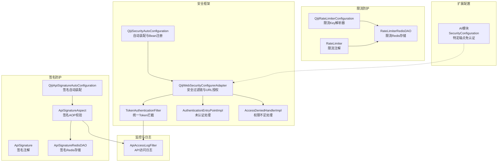
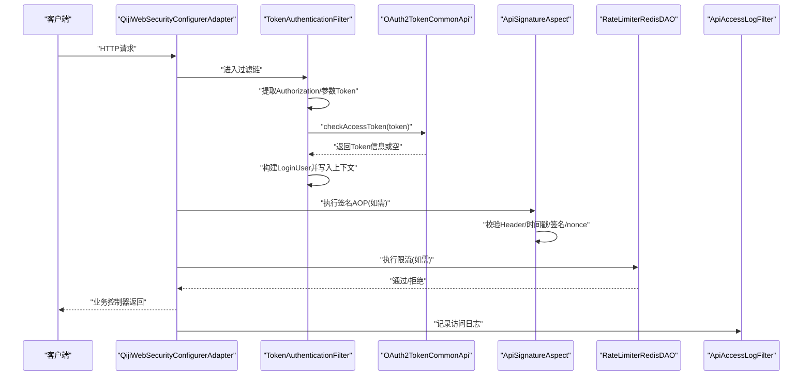
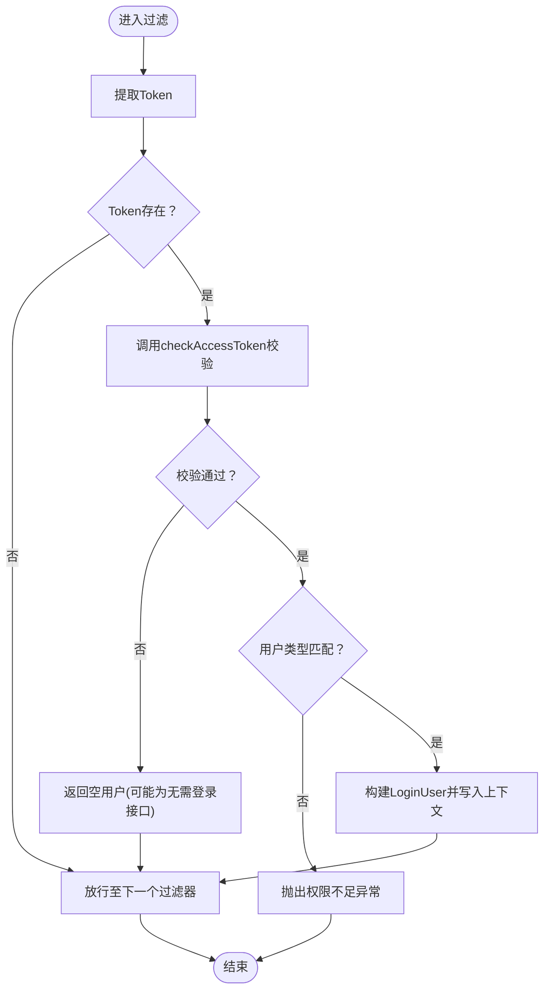
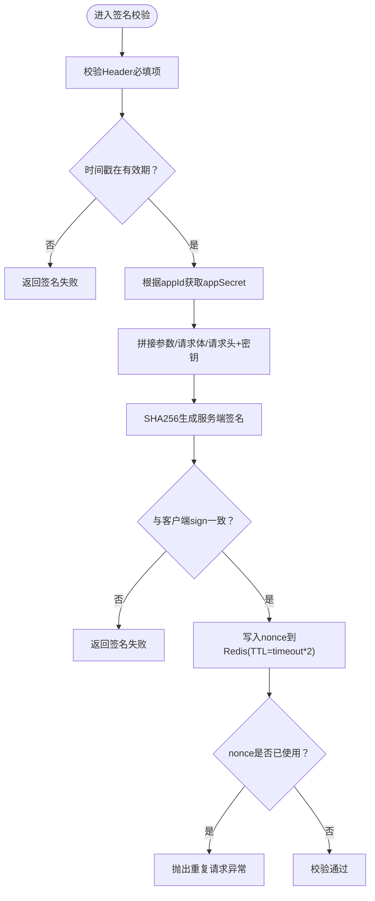
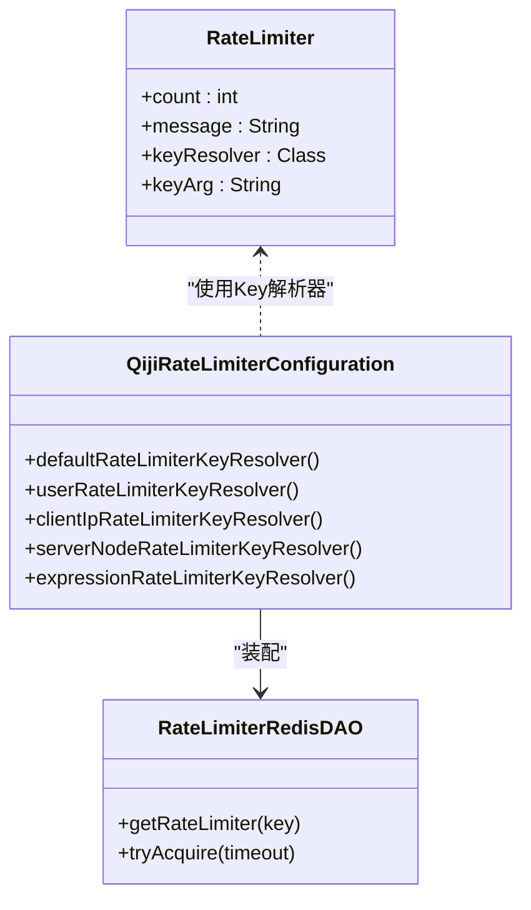
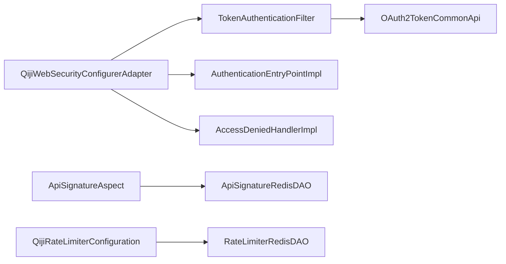

# API安全防护

<cite>
**本文引用的文件**
- [TokenAuthenticationFilter.java](file://qiji-framework/qiji-spring-boot-starter-security/src/main/java/com.qiji.cps/framework/security/core/filter/TokenAuthenticationFilter.java)
- [QijiWebSecurityConfigurerAdapter.java](file://qiji-framework/qiji-spring-boot-starter-security/src/main/java/com.qiji.cps/framework/security/config/QijiWebSecurityConfigurerAdapter.java)
- [QijiSecurityAutoConfiguration.java](file://qiji-framework/qiji-spring-boot-starter-security/src/main/java/com.qiji.cps/framework/security/config/QijiSecurityAutoConfiguration.java)
- [AccessDeniedHandlerImpl.java](file://qiji-framework/qiji-spring-boot-starter-security/src/main/java/com.qiji.cps/framework/security/core/handler/AccessDeniedHandlerImpl.java)
- [AuthenticationEntryPointImpl.java](file://qiji-framework/qiji-spring-boot-starter-security/src/main/java/com.qiji.cps/framework/security/core/handler/AuthenticationEntryPointImpl.java)
- [ApiSignatureAspect.java](file://qiji-framework/qiji-spring-boot-starter-protection/src/main/java/com.qiji.cps/framework/signature/core/aop/ApiSignatureAspect.java)
- [ApiSignature.java](file://qiji-framework/qiji-spring-boot-starter-protection/src/main/java/com.qiji.cps/framework/signature/core/annotation/ApiSignature.java)
- [ApiSignatureRedisDAO.java](file://qiji-framework/qiji-spring-boot-starter-protection/src/main/java/com.qiji.cps/framework/signature/core/redis/ApiSignatureRedisDAO.java)
- [QijiApiSignatureAutoConfiguration.java](file://qiji-framework/qiji-spring-boot-starter-protection/src/main/java/com.qiji.cps/framework/signature/config/QijiApiSignatureAutoConfiguration.java)
- [RateLimiterRedisDAO.java](file://qiji-framework/qiji-spring-boot-starter-protection/src/main/java/com.qiji.cps/framework/ratelimiter/core/redis/RateLimiterRedisDAO.java)
- [RateLimiter.java](file://qiji-framework/qiji-spring-boot-starter-protection/src/main/java/com.qiji.cps/framework/ratelimiter/core/annotation/RateLimiter.java)
- [QijiRateLimiterConfiguration.java](file://qiji-framework/qiji-spring-boot-starter-protection/src/main/java/com.qiji.cps/framework/ratelimiter/config/QijiRateLimiterConfiguration.java)
- [SecurityConfiguration.java](file://qiji-module-ai/src/main/java/com.qiji.cps/module/ai/framework/security/config/SecurityConfiguration.java)
- [ApiAccessLogFilter.java](file://qiji-framework/qiji-spring-boot-starter-web/src/main/java/com.qiji.cps/framework/apilog/core/filter/ApiAccessLogFilter.java)
</cite>

## 目录
1. [引言](#引言)
2. [项目结构](#项目结构)
3. [核心组件](#核心组件)
4. [架构总览](#架构总览)
5. [详细组件分析](#详细组件分析)
6. [依赖分析](#依赖分析)
7. [性能考量](#性能考量)
8. [故障排查指南](#故障排查指南)
9. [结论](#结论)
10. [附录](#附录)

## 引言
本文件面向AgenticCPS系统的API安全防护，系统性梳理并说明以下能力与机制：
- 请求认证：基于TokenAuthenticationFilter的统一拦截与OAuth2令牌校验
- 权限验证：AccessDeniedHandlerImpl对权限不足请求的处理
- 接口签名验证：ApiSignatureAspect的签名算法、参数排序、时间戳与防重放
- 请求频率限制：RateLimiter注解与RateLimiterRedisDAO的限流策略
- IP白名单/黑名单：通过Spring Security的IP地址匹配能力实现
- 安全配置最佳实践：HTTPS强制、CORS、安全响应头
- 安全监控与异常处理：统一异常处理、访问日志与告警联动

## 项目结构
围绕API安全防护，涉及的关键模块与文件如下：
- 安全框架与过滤链：security模块中的自动装配、Web安全适配器、Token过滤器、认证/权限处理器
- 签名防护：protection模块中的签名注解、AOP切面、Redis存储
- 限流防护：protection模块中的限流注解、Redis DAO与配置
- 安全配置扩展：AI模块对特定端点的免认证配置
- 访问日志：web模块中的API访问日志过滤器

**图表来源**
- [QijiSecurityAutoConfiguration.java:32-95](file://qiji-framework/qiji-spring-boot-starter-security/src/main/java/com.qiji.cps/framework/security/config/QijiSecurityAutoConfiguration.java#L32-L95)
- [QijiWebSecurityConfigurerAdapter.java:46-222](file://qiji-framework/qiji-spring-boot-starter-security/src/main/java/com.qiji.cps/framework/security/config/QijiWebSecurityConfigurerAdapter.java#L46-L222)
- [TokenAuthenticationFilter.java:1-120](file://qiji-framework/qiji-spring-boot-starter-security/src/main/java/com.qiji.cps/framework/security/core/filter/TokenAuthenticationFilter.java#L1-L120)
- [AuthenticationEntryPointImpl.java:1-35](file://qiji-framework/qiji-spring-boot-starter-security/src/main/java/com.qiji.cps/framework/security/core/handler/AuthenticationEntryPointImpl.java#L1-L35)
- [AccessDeniedHandlerImpl.java:1-41](file://qiji-framework/qiji-spring-boot-starter-security/src/main/java/com.qiji.cps/framework/security/core/handler/AccessDeniedHandlerImpl.java#L1-L41)
- [QijiApiSignatureAutoConfiguration.java:1-29](file://qiji-framework/qiji-spring-boot-starter-protection/src/main/java/com.qiji.cps/framework/signature/config/QijiApiSignatureAutoConfiguration.java#L1-L29)
- [ApiSignatureAspect.java:1-174](file://qiji-framework/qiji-spring-boot-starter-protection/src/main/java/com.qiji.cps/framework/signature/core/aop/ApiSignatureAspect.java#L1-L174)
- [ApiSignatureRedisDAO.java:1-58](file://qiji-framework/qiji-spring-boot-starter-protection/src/main/java/com.qiji.cps/framework/signature/core/redis/ApiSignatureRedisDAO.java#L1-L58)
- [QijiRateLimiterConfiguration.java:31-55](file://qiji-framework/qiji-spring-boot-starter-protection/src/main/java/com.qiji.cps/framework/ratelimiter/config/QijiRateLimiterConfiguration.java#L31-L55)
- [RateLimiterRedisDAO.java:43-66](file://qiji-framework/qiji-spring-boot-starter-protection/src/main/java/com.qiji.cps/framework/ratelimiter/core/redis/RateLimiterRedisDAO.java#L43-L66)
- [SecurityConfiguration.java:1-42](file://qiji-module-ai/src/main/java/com.qiji.cps/module/ai/framework/security/config/SecurityConfiguration.java#L1-L42)
- [ApiAccessLogFilter.java:1-120](file://qiji-framework/qiji-spring-boot-starter-web/src/main/java/com.qiji.cps/framework/apilog/core/filter/ApiAccessLogFilter.java#L1-L120)

**章节来源**
- [QijiSecurityAutoConfiguration.java:32-95](file://qiji-framework/qiji-spring-boot-starter-security/src/main/java/com.qiji.cps/framework/security/config/QijiSecurityAutoConfiguration.java#L32-L95)
- [QijiWebSecurityConfigurerAdapter.java:46-222](file://qiji-framework/qiji-spring-boot-starter-security/src/main/java/com.qiji.cps/framework/security/config/QijiWebSecurityConfigurerAdapter.java#L46-L222)
- [TokenAuthenticationFilter.java:1-120](file://qiji-framework/qiji-spring-boot-starter-security/src/main/java/com.qiji.cps/framework/security/core/filter/TokenAuthenticationFilter.java#L1-L120)
- [ApiSignatureAspect.java:1-174](file://qiji-framework/qiji-spring-boot-starter-protection/src/main/java/com.qiji.cps/framework/signature/core/aop/ApiSignatureAspect.java#L1-L174)
- [ApiSignatureRedisDAO.java:1-58](file://qiji-framework/qiji-spring-boot-starter-protection/src/main/java/com.qiji.cps/framework/signature/core/redis/ApiSignatureRedisDAO.java#L1-L58)
- [RateLimiterRedisDAO.java:43-66](file://qiji-framework/qiji-spring-boot-starter-protection/src/main/java/com.qiji.cps/framework/ratelimiter/core/redis/RateLimiterRedisDAO.java#L43-L66)
- [QijiRateLimiterConfiguration.java:31-55](file://qiji-framework/qiji-spring-boot-starter-protection/src/main/java/com.qiji.cps/framework/ratelimiter/config/QijiRateLimiterConfiguration.java#L31-L55)
- [SecurityConfiguration.java:1-42](file://qiji-module-ai/src/main/java/com.qiji.cps/module/ai/framework/security/config/SecurityConfiguration.java#L1-L42)
- [ApiAccessLogFilter.java:1-120](file://qiji-framework/qiji-spring-boot-starter-web/src/main/java/com.qiji.cps/framework/apilog/core/filter/ApiAccessLogFilter.java#L1-L120)

## 核心组件
- TokenAuthenticationFilter：统一拦截API请求，提取并校验Token，构建登录用户上下文
- QijiWebSecurityConfigurerAdapter：配置过滤链、URL授权规则、异常处理、CORS/CSRF/Session策略
- AccessDeniedHandlerImpl：权限不足返回403
- AuthenticationEntryPointImpl：未认证返回401
- ApiSignatureAspect：基于注解的签名验证，含时间戳校验与防重放
- RateLimiter：基于注解的限流控制，支持多种Key解析器
- ApiAccessLogFilter：记录API访问日志，脱敏敏感字段

**章节来源**
- [TokenAuthenticationFilter.java:1-120](file://qiji-framework/qiji-spring-boot-starter-security/src/main/java/com.qiji.cps/framework/security/core/filter/TokenAuthenticationFilter.java#L1-L120)
- [QijiWebSecurityConfigurerAdapter.java:92-153](file://qiji-framework/qiji-spring-boot-starter-security/src/main/java/com.qiji.cps/framework/security/config/QijiWebSecurityConfigurerAdapter.java#L92-L153)
- [AccessDeniedHandlerImpl.java:1-41](file://qiji-framework/qiji-spring-boot-starter-security/src/main/java/com.qiji.cps/framework/security/core/handler/AccessDeniedHandlerImpl.java#L1-L41)
- [AuthenticationEntryPointImpl.java:1-35](file://qiji-framework/qiji-spring-boot-starter-security/src/main/java/com.qiji.cps/framework/security/core/handler/AuthenticationEntryPointImpl.java#L1-L35)
- [ApiSignatureAspect.java:1-174](file://qiji-framework/qiji-spring-boot-starter-protection/src/main/java/com.qiji.cps/framework/signature/core/aop/ApiSignatureAspect.java#L1-L174)
- [RateLimiter.java:34-62](file://qiji-framework/qiji-spring-boot-starter-protection/src/main/java/com.qiji.cps/framework/ratelimiter/core/annotation/RateLimiter.java#L34-L62)
- [ApiAccessLogFilter.java:1-120](file://qiji-framework/qiji-spring-boot-starter-web/src/main/java/com.qiji.cps/framework/apilog/core/filter/ApiAccessLogFilter.java#L1-L120)

## 架构总览
下图展示API请求从进入网关到业务处理的完整安全链路，包括认证、鉴权、签名、限流与日志。

**图表来源**
- [QijiWebSecurityConfigurerAdapter.java:110-153](file://qiji-framework/qiji-spring-boot-starter-security/src/main/java/com.qiji.cps/framework/security/config/QijiWebSecurityConfigurerAdapter.java#L110-L153)
- [TokenAuthenticationFilter.java:40-93](file://qiji-framework/qiji-spring-boot-starter-security/src/main/java/com.qiji.cps/framework/security/core/filter/TokenAuthenticationFilter.java#L40-L93)
- [ApiSignatureAspect.java:40-80](file://qiji-framework/qiji-spring-boot-starter-protection/src/main/java/com.qiji.cps/framework/signature/core/aop/ApiSignatureAspect.java#L40-L80)
- [RateLimiterRedisDAO.java:43-66](file://qiji-framework/qiji-spring-boot-starter-protection/src/main/java/com.qiji.cps/framework/ratelimiter/core/redis/RateLimiterRedisDAO.java#L43-L66)
- [ApiAccessLogFilter.java:50-62](file://qiji-framework/qiji-spring-boot-starter-web/src/main/java/com.qiji.cps/framework/apilog/core/filter/ApiAccessLogFilter.java#L50-L62)

## 详细组件分析

### TokenAuthenticationFilter：统一拦截与认证
- 拦截时机：在UsernamePasswordAuthenticationFilter之前加入过滤链
- 认证流程：
  - 从请求头或参数提取Token
  - 调用OAuth2TokenCommonApi校验Token有效性
  - 若用户类型不匹配则抛出权限不足异常
  - 构建LoginUser并写入上下文，供后续鉴权与业务使用
  - 支持“模拟登录”用于开发调试（生产需关闭）

**图表来源**
- [TokenAuthenticationFilter.java:40-93](file://qiji-framework/qiji-spring-boot-starter-security/src/main/java/com.qiji.cps/framework/security/core/filter/TokenAuthenticationFilter.java#L40-L93)

**章节来源**
- [TokenAuthenticationFilter.java:1-120](file://qiji-framework/qiji-spring-boot-starter-security/src/main/java/com.qiji.cps/framework/security/core/filter/TokenAuthenticationFilter.java#L1-L120)
- [QijiWebSecurityConfigurerAdapter.java:150-151](file://qiji-framework/qiji-spring-boot-starter-security/src/main/java/com.qiji.cps/framework/security/config/QijiWebSecurityConfigurerAdapter.java#L150-L151)

### AccessDeniedHandlerImpl：权限不足处理
- 当已认证但无权限访问资源时触发
- 返回统一错误码与JSON响应，便于前端处理

**章节来源**
- [AccessDeniedHandlerImpl.java:1-41](file://qiji-framework/qiji-spring-boot-starter-security/src/main/java/com.qiji.cps/framework/security/core/handler/AccessDeniedHandlerImpl.java#L1-L41)

### API签名验证机制
- 注解与AOP：
  - ApiSignature注解声明签名参数与有效期
  - ApiSignatureAspect在方法执行前进行签名校验
- 校验步骤：
  - Header参数校验：appId/timestamp/nonce/sign非空与长度
  - 时间戳校验：与当前时间差不超过timeout
  - 签名计算：按参数、请求体、请求头与密钥拼接后SHA256
  - 防重放：nonce写入Redis，带宽有效期；重复请求直接拒绝
- Redis存储：
  - nonce键：按appId+nonce维度，TTL为timeout*2
  - appSecret：Hash结构，按appId存储

**图表来源**
- [ApiSignatureAspect.java:54-80](file://qiji-framework/qiji-spring-boot-starter-protection/src/main/java/com.qiji.cps/framework/signature/core/aop/ApiSignatureAspect.java#L54-L80)
- [ApiSignatureRedisDAO.java:18-57](file://qiji-framework/qiji-spring-boot-starter-protection/src/main/java/com.qiji.cps/framework/signature/core/redis/ApiSignatureRedisDAO.java#L18-L57)

**章节来源**
- [ApiSignature.java:1-59](file://qiji-framework/qiji-spring-boot-starter-protection/src/main/java/com.qiji.cps/framework/signature/core/annotation/ApiSignature.java#L1-L59)
- [ApiSignatureAspect.java:1-174](file://qiji-framework/qiji-spring-boot-starter-protection/src/main/java/com.qiji.cps/framework/signature/core/aop/ApiSignatureAspect.java#L1-L174)
- [ApiSignatureRedisDAO.java:1-58](file://qiji-framework/qiji-spring-boot-starter-protection/src/main/java/com.qiji.cps/framework/signature/core/redis/ApiSignatureRedisDAO.java#L1-L58)
- [QijiApiSignatureAutoConfiguration.java:1-29](file://qiji-framework/qiji-spring-boot-starter-protection/src/main/java/com.qiji.cps/framework/signature/config/QijiApiSignatureAutoConfiguration.java#L1-L29)

### 请求频率限制
- 注解驱动：RateLimiter声明限流次数、Key解析器与提示信息
- Key解析器：
  - 默认/全局、用户ID、客户端IP、服务器节点、表达式
- 存储策略：RateLimiterRedisDAO基于Resilience4j RateLimiter，按配置动态设置速率与过期
- 阈值与算法：支持按时间窗口设置整体速率，Redis保证分布式一致性

**图表来源**
- [RateLimiter.java:34-62](file://qiji-framework/qiji-spring-boot-starter-protection/src/main/java/com.qiji.cps/framework/ratelimiter/core/annotation/RateLimiter.java#L34-L62)
- [QijiRateLimiterConfiguration.java:31-55](file://qiji-framework/qiji-spring-boot-starter-protection/src/main/java/com.qiji.cps/framework/ratelimiter/config/QijiRateLimiterConfiguration.java#L31-L55)
- [RateLimiterRedisDAO.java:43-66](file://qiji-framework/qiji-spring-boot-starter-protection/src/main/java/com.qiji.cps/framework/ratelimiter/core/redis/RateLimiterRedisDAO.java#L43-L66)

**章节来源**
- [RateLimiter.java:34-62](file://qiji-framework/qiji-spring-boot-starter-protection/src/main/java/com.qiji.cps/framework/ratelimiter/core/annotation/RateLimiter.java#L34-L62)
- [QijiRateLimiterConfiguration.java:31-55](file://qiji-framework/qiji-spring-boot-starter-protection/src/main/java/com.qiji.cps/framework/ratelimiter/config/QijiRateLimiterConfiguration.java#L31-L55)
- [RateLimiterRedisDAO.java:43-66](file://qiji-framework/qiji-spring-boot-starter-protection/src/main/java/com.qiji.cps/framework/ratelimiter/core/redis/RateLimiterRedisDAO.java#L43-L66)

### IP白名单与黑名单
- 通过Spring Security的hasIpAddress规则实现
- 在URL授权配置中，可针对特定路径设置允许的IP段
- 建议结合网关或反向代理层做入口级黑白名单

**章节来源**
- [QijiWebSecurityConfigurerAdapter.java:103-104](file://qiji-framework/qiji-spring-boot-starter-security/src/main/java/com.qiji.cps/framework/security/config/QijiWebSecurityConfigurerAdapter.java#L103-L104)

### 安全配置最佳实践
- HTTPS强制：生产环境必须启用TLS，禁止明文传输
- CORS配置：通过Web安全适配器开启跨域，严格限定Origin/Methods/Headers
- CSRF禁用：基于Token机制，禁用CSRF
- Session策略：无状态，禁用Session
- 安全响应头：建议设置X-Content-Type-Options、X-Frame-Options、Strict-Transport-Security等（可在网关/反向代理层统一注入）

**章节来源**
- [QijiWebSecurityConfigurerAdapter.java:113-119](file://qiji-framework/qiji-spring-boot-starter-security/src/main/java/com.qiji.cps/framework/security/config/QijiWebSecurityConfigurerAdapter.java#L113-L119)

### 安全监控与异常处理
- 统一异常处理：Token过滤器捕获异常并返回JSON
- 访问日志：记录请求路径、参数、耗时、脱敏敏感字段
- 建议：接入链路追踪与审计日志，对401/403高频事件进行告警

**章节来源**
- [TokenAuthenticationFilter.java:60-64](file://qiji-framework/qiji-spring-boot-starter-security/src/main/java/com.qiji.cps/framework/security/core/filter/TokenAuthenticationFilter.java#L60-L64)
- [ApiAccessLogFilter.java:50-62](file://qiji-framework/qiji-spring-boot-starter-web/src/main/java/com.qiji.cps/framework/apilog/core/filter/ApiAccessLogFilter.java#L50-L62)

## 依赖分析
- 安全框架依赖：
  - TokenAuthenticationFilter依赖OAuth2TokenCommonApi进行Token校验
  - Web安全适配器依赖认证/权限处理器与Token过滤器
- 签名防护依赖：
  - ApiSignatureAspect依赖ApiSignatureRedisDAO进行nonce与appSecret存取
- 限流防护依赖：
  - RateLimiterRedisDAO封装Resilience4j RateLimiter的Redis操作

**图表来源**
- [TokenAuthenticationFilter.java:34-38](file://qiji-framework/qiji-spring-boot-starter-security/src/main/java/com.qiji.cps/framework/security/core/filter/TokenAuthenticationFilter.java#L34-L38)
- [QijiWebSecurityConfigurerAdapter.java:56-70](file://qiji-framework/qiji-spring-boot-starter-security/src/main/java/com.qiji.cps/framework/security/config/QijiWebSecurityConfigurerAdapter.java#L56-L70)
- [ApiSignatureAspect.java:38-38](file://qiji-framework/qiji-spring-boot-starter-protection/src/main/java/com.qiji.cps/framework/signature/core/aop/ApiSignatureAspect.java#L38-L38)
- [ApiSignatureRedisDAO.java:13-16](file://qiji-framework/qiji-spring-boot-starter-protection/src/main/java/com.qiji.cps/framework/signature/core/redis/ApiSignatureRedisDAO.java#L13-L16)
- [QijiRateLimiterConfiguration.java:31-55](file://qiji-framework/qiji-spring-boot-starter-protection/src/main/java/com.qiji.cps/framework/ratelimiter/config/QijiRateLimiterConfiguration.java#L31-L55)
- [RateLimiterRedisDAO.java:43-66](file://qiji-framework/qiji-spring-boot-starter-protection/src/main/java/com.qiji.cps/framework/ratelimiter/core/redis/RateLimiterRedisDAO.java#L43-L66)

**章节来源**
- [TokenAuthenticationFilter.java:1-120](file://qiji-framework/qiji-spring-boot-starter-security/src/main/java/com.qiji.cps/framework/security/core/filter/TokenAuthenticationFilter.java#L1-L120)
- [QijiWebSecurityConfigurerAdapter.java:46-222](file://qiji-framework/qiji-spring-boot-starter-security/src/main/java/com.qiji.cps/framework/security/config/QijiWebSecurityConfigurerAdapter.java#L46-L222)
- [ApiSignatureAspect.java:1-174](file://qiji-framework/qiji-spring-boot-starter-protection/src/main/java/com.qiji.cps/framework/signature/core/aop/ApiSignatureAspect.java#L1-L174)
- [ApiSignatureRedisDAO.java:1-58](file://qiji-framework/qiji-spring-boot-starter-protection/src/main/java/com.qiji.cps/framework/signature/core/redis/ApiSignatureRedisDAO.java#L1-L58)
- [QijiRateLimiterConfiguration.java:31-55](file://qiji-framework/qiji-spring-boot-starter-protection/src/main/java/com.qiji.cps/framework/ratelimiter/config/QijiRateLimiterConfiguration.java#L31-L55)
- [RateLimiterRedisDAO.java:43-66](file://qiji-framework/qiji-spring-boot-starter-protection/src/main/java/com.qiji.cps/framework/ratelimiter/core/redis/RateLimiterRedisDAO.java#L43-L66)

## 性能考量
- Token校验：建议在网关层或前置缓存层复用Token校验结果，减少重复调用
- 签名校验：SHA256计算与Redis交互为轻量操作，注意nonce TTL与appSecret缓存
- 限流策略：合理设置时间窗口与阈值，避免热点接口成为瓶颈
- 日志落库：异步化访问日志写入，避免阻塞主业务链路

## 故障排查指南
- 401未认证：
  - 检查请求是否携带正确的Token头或参数
  - 确认Token未过期且用户类型匹配
- 403权限不足：
  - 检查用户权限与资源授权规则
  - 关注AccessDeniedHandlerImpl日志
- 签名失败：
  - 核对appId/appSecret是否正确
  - 检查timestamp是否在有效期，nonce是否满足长度要求
  - 确认请求参数、请求体、请求头顺序与拼接逻辑一致
- 重复请求：
  - nonce已在Redis中，检查TTL是否过短或客户端重试策略
- 限流触发：
  - 调整RateLimiter注解的count与keyResolver
  - 检查Redis连接与限流配置

**章节来源**
- [TokenAuthenticationFilter.java:60-64](file://qiji-framework/qiji-spring-boot-starter-security/src/main/java/com.qiji.cps/framework/security/core/filter/TokenAuthenticationFilter.java#L60-L64)
- [AccessDeniedHandlerImpl.java:32-39](file://qiji-framework/qiji-spring-boot-starter-security/src/main/java/com.qiji.cps/framework/security/core/handler/AccessDeniedHandlerImpl.java#L32-L39)
- [ApiSignatureAspect.java:94-123](file://qiji-framework/qiji-spring-boot-starter-protection/src/main/java/com.qiji.cps/framework/signature/core/aop/ApiSignatureAspect.java#L94-L123)
- [RateLimiterRedisDAO.java:43-66](file://qiji-framework/qiji-spring-boot-starter-protection/src/main/java/com.qiji.cps/framework/ratelimiter/core/redis/RateLimiterRedisDAO.java#L43-L66)

## 结论
AgenticCPS通过“认证+鉴权+签名+限流+日志”的多层防护体系，实现了API接口的全链路安全。TokenAuthenticationFilter负责统一认证，AccessDeniedHandlerImpl与Web安全适配器共同完成权限控制；ApiSignatureAspect提供强健的签名与防重放能力；RateLimiter为高并发场景提供弹性限流；配合完善的日志与异常处理，形成闭环的安全运营能力。

## 附录
- 特定端点免认证：AI模块通过自定义AuthorizeRequestsCustomizer对SSE/Streamable HTTP端点开放
- 最佳实践清单：
  - 生产环境强制HTTPS
  - 严格CORS配置与安全响应头
  - 定期轮换appSecret与密钥
  - 对高频接口启用限流与熔断
  - 建立401/403与重复请求的监控告警

**章节来源**
- [SecurityConfiguration.java:25-40](file://qiji-module-ai/src/main/java/com.qiji.cps/module/ai/framework/security/config/SecurityConfiguration.java#L25-L40)