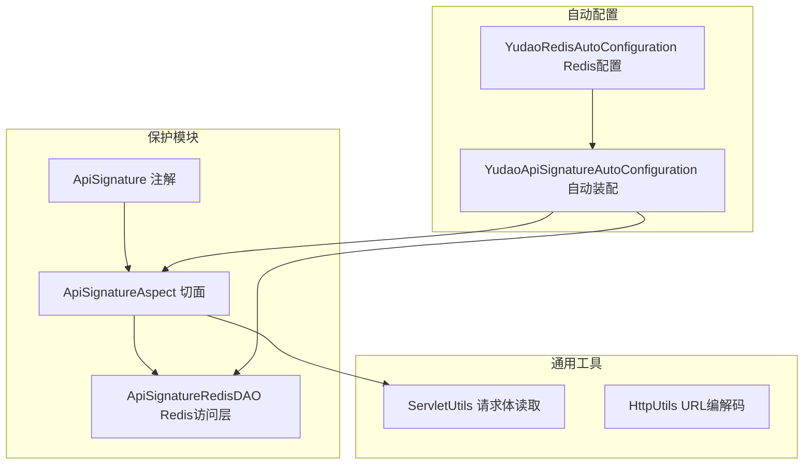
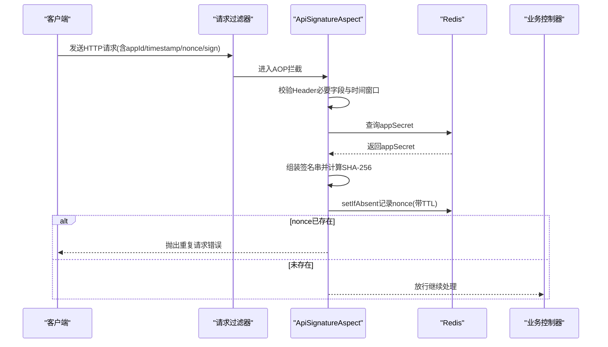
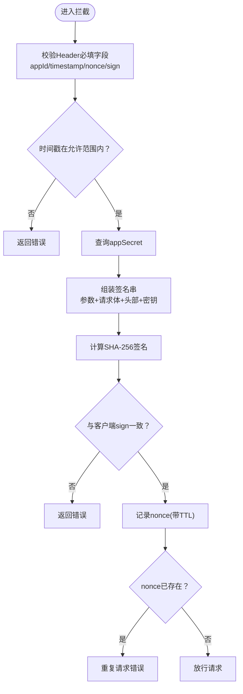
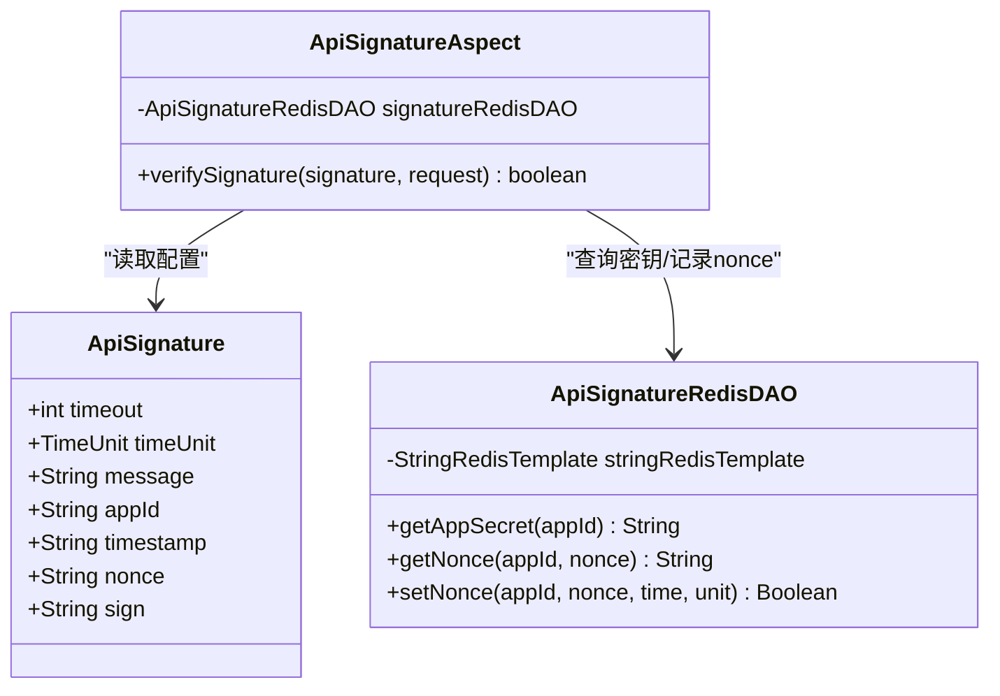
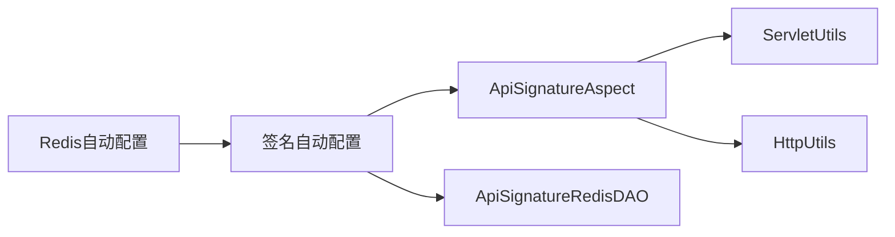

# API签名验证

<cite>
**本文引用的文件**   
- [ApiSignature.java](file://yudao-framework/yudao-spring-boot-starter-protection/src/main/java/cn/iocoder/yudao/framework/signature/core/annotation/ApiSignature.java)
- [ApiSignatureAspect.java](file://yudao-framework/yudao-spring-boot-starter-protection/src/main/java/cn/iocoder/yudao/framework/signature/core/aop/ApiSignatureAspect.java)
- [ApiSignatureRedisDAO.java](file://yudao-framework/yudao-spring-boot-starter-protection/src/main/java/cn/iocoder/yudao/framework/signature/core/redis/ApiSignatureRedisDAO.java)
- [YudaoApiSignatureAutoConfiguration.java](file://yudao-framework/yudao-spring-boot-starter-protection/src/main/java/cn/iocoder/yudao/framework/signature/config/YudaoApiSignatureAutoConfiguration.java)
- [ApiSignatureTest.java](file://yudao-framework/yudao-spring-boot-starter-protection/src/test/java/cn/iocoder/yudao/framework/signature/core/ApiSignatureTest.java)
- [ServletUtils.java](file://yudao-framework/yudao-common/src/main/java/cn/iocoder/yudao/framework/common/util/servlet/ServletUtils.java)
- [HttpUtils.java](file://yudao-framework/yudao-common/src/main/java/cn/iocoder/yudao/framework/common/util/http/HttpUtils.java)
- [YudaoRedisAutoConfiguration.java](file://yudao-framework/yudao-spring-boot-starter-redis/src/main/java/cn/iocoder/yudao/framework/redis/config/YudaoRedisAutoConfiguration.java)
</cite>

## 目录
1. [简介](#简介)
2. [项目结构](#项目结构)
3. [核心组件](#核心组件)
4. [架构总览](#架构总览)
5. [组件详解](#组件详解)
6. [依赖关系分析](#依赖关系分析)
7. [性能考量](#性能考量)
8. [故障排查指南](#故障排查指南)
9. [结论](#结论)
10. [附录](#附录)

## 简介
本文件面向AgenticCPS系统的API签名验证机制，系统性阐述签名算法、参数排序规则、密钥管理策略、防重放攻击实现、配置参数与最佳实践，并提供时序图与安全威胁分析，帮助开发者快速理解并正确集成。

## 项目结构
AgenticCPS采用模块化设计，API签名能力位于保护模块中，通过Spring AOP拦截标注了签名注解的接口，结合Redis完成密钥与随机数的存储与校验。

图表来源
- [ApiSignature.java:1-60](file://yudao-framework/yudao-spring-boot-starter-protection/src/main/java/cn/iocoder/yudao/framework/signature/core/annotation/ApiSignature.java#L1-L60)
- [ApiSignatureAspect.java:1-174](file://yudao-framework/yudao-spring-boot-starter-protection/src/main/java/cn/iocoder/yudao/framework/signature/core/aop/ApiSignatureAspect.java#L1-L174)
- [ApiSignatureRedisDAO.java:1-58](file://yudao-framework/yudao-spring-boot-starter-protection/src/main/java/cn/iocoder/yudao/framework/signature/core/redis/ApiSignatureRedisDAO.java#L1-L58)
- [YudaoApiSignatureAutoConfiguration.java:1-29](file://yudao-framework/yudao-spring-boot-starter-protection/src/main/java/cn/iocoder/yudao/framework/signature/config/YudaoApiSignatureAutoConfiguration.java#L1-L29)
- [YudaoRedisAutoConfiguration.java:1-45](file://yudao-framework/yudao-spring-boot-starter-redis/src/main/java/cn/iocoder/yudao/framework/redis/config/YudaoRedisAutoConfiguration.java#L1-L45)

章节来源
- [YudaoApiSignatureAutoConfiguration.java:1-29](file://yudao-framework/yudao-spring-boot-starter-protection/src/main/java/cn/iocoder/yudao/framework/signature/config/YudaoApiSignatureAutoConfiguration.java#L1-L29)
- [YudaoRedisAutoConfiguration.java:1-45](file://yudao-framework/yudao-spring-boot-starter-redis/src/main/java/cn/iocoder/yudao/framework/redis/config/YudaoRedisAutoConfiguration.java#L1-L45)

## 核心组件
- ApiSignature 注解：定义签名所需字段名、超时时间与时间单位、错误提示等。
- ApiSignatureAspect 切面：拦截带注解的接口，执行参数校验、签名计算与比对、随机数去重。
- ApiSignatureRedisDAO：封装Redis访问，提供密钥查询与随机数去重存储。
- 自动配置：注册切面与DAO Bean，确保Redis配置先行。

章节来源
- [ApiSignature.java:1-60](file://yudao-framework/yudao-spring-boot-starter-protection/src/main/java/cn/iocoder/yudao/framework/signature/core/annotation/ApiSignature.java#L1-L60)
- [ApiSignatureAspect.java:1-174](file://yudao-framework/yudao-spring-boot-starter-protection/src/main/java/cn/iocoder/yudao/framework/signature/core/aop/ApiSignatureAspect.java#L1-L174)
- [ApiSignatureRedisDAO.java:1-58](file://yudao-framework/yudao-spring-boot-starter-protection/src/main/java/cn/iocoder/yudao/framework/signature/core/redis/ApiSignatureRedisDAO.java#L1-L58)
- [YudaoApiSignatureAutoConfiguration.java:1-29](file://yudao-framework/yudao-spring-boot-starter-protection/src/main/java/cn/iocoder/yudao/framework/signature/config/YudaoApiSignatureAutoConfiguration.java#L1-L29)

## 架构总览
签名验证在请求进入控制器前由AOP切面统一拦截，按既定规则提取参数、拼接签名串、计算哈希并与客户端签名比对；同时基于Redis对随机数进行去重，配合时间窗口限制抵御重放攻击。

图表来源
- [ApiSignatureAspect.java:54-80](file://yudao-framework/yudao-spring-boot-starter-protection/src/main/java/cn/iocoder/yudao/framework/signature/core/aop/ApiSignatureAspect.java#L54-L80)
- [ApiSignatureAspect.java:94-123](file://yudao-framework/yudao-spring-boot-starter-protection/src/main/java/cn/iocoder/yudao/framework/signature/core/aop/ApiSignatureAspect.java#L94-L123)
- [ApiSignatureAspect.java:135-143](file://yudao-framework/yudao-spring-boot-starter-protection/src/main/java/cn/iocoder/yudao/framework/signature/core/aop/ApiSignatureAspect.java#L135-L143)
- [ApiSignatureRedisDAO.java:39-45](file://yudao-framework/yudao-spring-boot-starter-protection/src/main/java/cn/iocoder/yudao/framework/signature/core/redis/ApiSignatureRedisDAO.java#L39-L45)

## 组件详解

### 签名注解与配置
- 字段映射：appId、timestamp、nonce、sign均可自定义头部键名。
- 超时控制：timeout与timeUnit共同决定允许的时间偏差范围。
- 错误消息：message可覆盖默认错误提示。

章节来源
- [ApiSignature.java:18-59](file://yudao-framework/yudao-spring-boot-starter-protection/src/main/java/cn/iocoder/yudao/framework/signature/core/annotation/ApiSignature.java#L18-L59)

### 签名工具与参数提取
- 参数来源：
  - 请求参数：按名称排序后拼接。
  - 请求头：仅包含签名相关字段（appId、timestamp、nonce）。
  - 请求体：仅在JSON请求时参与签名。
- URL编码：工具类提供UTF-8编码/解码与路径解码，便于在自定义签名串中处理特殊字符。
- 时间戳与随机数：时间窗口通过绝对值差判断；随机数长度至少10位。

章节来源
- [ApiSignatureAspect.java:135-143](file://yudao-framework/yudao-spring-boot-starter-protection/src/main/java/cn/iocoder/yudao/framework/signature/core/aop/ApiSignatureAspect.java#L135-L143)
- [ApiSignatureAspect.java:166-172](file://yudao-framework/yudao-spring-boot-starter-protection/src/main/java/cn/iocoder/yudao/framework/signature/core/aop/ApiSignatureAspect.java#L166-L172)
- [ServletUtils.java:78-83](file://yudao-framework/yudao-common/src/main/java/cn/iocoder/yudao/framework/common/util/servlet/ServletUtils.java#L78-L83)
- [HttpUtils.java:35-49](file://yudao-framework/yudao-common/src/main/java/cn/iocoder/yudao/framework/common/util/http/HttpUtils.java#L35-L49)

### 签名算法与密钥管理
- 算法：使用SHA-256对拼接后的签名串进行摘要。
- 密钥来源：通过Redis Hash存储appSecret，按appId查询。
- 密钥生命周期：预加载至Redis，永不过期，需在运维侧保证密钥安全与更新策略。

章节来源
- [ApiSignatureAspect.java:64-70](file://yudao-framework/yudao-spring-boot-starter-protection/src/main/java/cn/iocoder/yudao/framework/signature/core/aop/ApiSignatureAspect.java#L64-L70)
- [ApiSignatureAspect.java:59-62](file://yudao-framework/yudao-spring-boot-starter-protection/src/main/java/cn/iocoder/yudao/framework/signature/core/aop/ApiSignatureAspect.java#L59-L62)
- [ApiSignatureRedisDAO.java:53-55](file://yudao-framework/yudao-spring-boot-starter-protection/src/main/java/cn/iocoder/yudao/framework/signature/core/redis/ApiSignatureRedisDAO.java#L53-L55)

### 防重放攻击机制
- 时间窗口：以毫秒为单位，客户端timestamp与服务器时间差不得超过timeout×timeUnit。
- 随机数去重：nonce使用Redis的setIfAbsent进行幂等插入，TTL设为timeout×2，确保跨时间窗口的重复请求被拦截。
- 请求ID管理：系统未内置请求ID字段，建议在业务侧扩展或复用nonce作为请求唯一标识。

章节来源
- [ApiSignatureAspect.java:113-119](file://yudao-framework/yudao-spring-boot-starter-protection/src/main/java/cn/iocoder/yudao/framework/signature/core/aop/ApiSignatureAspect.java#L113-L119)
- [ApiSignatureAspect.java:72-78](file://yudao-framework/yudao-spring-boot-starter-protection/src/main/java/cn/iocoder/yudao/framework/signature/core/aop/ApiSignatureAspect.java#L72-L78)
- [ApiSignatureAspect.java:121-122](file://yudao-framework/yudao-spring-boot-starter-protection/src/main/java/cn/iocoder/yudao/framework/signature/core/aop/ApiSignatureAspect.java#L121-L122)
- [ApiSignatureRedisDAO.java:43-44](file://yudao-framework/yudao-spring-boot-starter-protection/src/main/java/cn/iocoder/yudao/framework/signature/core/redis/ApiSignatureRedisDAO.java#L43-L44)

### 完整验证流程

图表来源
- [ApiSignatureAspect.java:54-80](file://yudao-framework/yudao-spring-boot-starter-protection/src/main/java/cn/iocoder/yudao/framework/signature/core/aop/ApiSignatureAspect.java#L54-L80)
- [ApiSignatureAspect.java:94-123](file://yudao-framework/yudao-spring-boot-starter-protection/src/main/java/cn/iocoder/yudao/framework/signature/core/aop/ApiSignatureAspect.java#L94-L123)
- [ApiSignatureAspect.java:135-143](file://yudao-framework/yudao-spring-boot-starter-protection/src/main/java/cn/iocoder/yudao/framework/signature/core/aop/ApiSignatureAspect.java#L135-L143)
- [ApiSignatureRedisDAO.java:39-45](file://yudao-framework/yudao-spring-boot-starter-protection/src/main/java/cn/iocoder/yudao/framework/signature/core/redis/ApiSignatureRedisDAO.java#L39-L45)

### 类关系与依赖

图表来源
- [ApiSignature.java:18-59](file://yudao-framework/yudao-spring-boot-starter-protection/src/main/java/cn/iocoder/yudao/framework/signature/core/annotation/ApiSignature.java#L18-L59)
- [ApiSignatureAspect.java:36-38](file://yudao-framework/yudao-spring-boot-starter-protection/src/main/java/cn/iocoder/yudao/framework/signature/core/aop/ApiSignatureAspect.java#L36-L38)
- [ApiSignatureRedisDAO.java:14-16](file://yudao-framework/yudao-spring-boot-starter-protection/src/main/java/cn/iocoder/yudao/framework/signature/core/redis/ApiSignatureRedisDAO.java#L14-L16)

## 依赖关系分析
- 自动装配顺序：Redis配置先于签名模块装配，确保Redis可用。
- 切面依赖：ApiSignatureAspect依赖ApiSignatureRedisDAO完成密钥与nonce操作。
- 工具依赖：ServletUtils负责JSON请求体读取；HttpUtils提供URL编解码辅助。

图表来源
- [YudaoRedisAutoConfiguration.java:16-17](file://yudao-framework/yudao-spring-boot-starter-redis/src/main/java/cn/iocoder/yudao/framework/redis/config/YudaoRedisAutoConfiguration.java#L16-L17)
- [YudaoApiSignatureAutoConfiguration.java:15-16](file://yudao-framework/yudao-spring-boot-starter-protection/src/main/java/cn/iocoder/yudao/framework/signature/config/YudaoApiSignatureAutoConfiguration.java#L15-L16)

章节来源
- [YudaoApiSignatureAutoConfiguration.java:15-28](file://yudao-framework/yudao-spring-boot-starter-protection/src/main/java/cn/iocoder/yudao/framework/signature/config/YudaoApiSignatureAutoConfiguration.java#L15-L28)
- [YudaoRedisAutoConfiguration.java:16-45](file://yudao-framework/yudao-spring-boot-starter-redis/src/main/java/cn/iocoder/yudao/framework/redis/config/YudaoRedisAutoConfiguration.java#L16-L45)

## 性能考量
- Redis热点：nonce与appSecret访问频率高，建议使用高性能Redis实例与合理TTL。
- 签名串拼接：TreeMap保证参数有序，避免重复计算开销；仅在JSON请求时读取请求体，减少I/O。
- TTL设置：nonce TTL设为timeout×2，平衡防重放与内存占用。
- 并发场景：setIfAbsent天然具备原子性，适合高并发场景。

## 故障排查指南
- 常见错误
  - 参数缺失：appId/timestamp/nonce/sign任一为空或格式不符。
  - 时间偏差过大：客户端与服务器时间差异超过timeout。
  - 签名不匹配：参数、请求体或头部顺序不一致导致摘要不同。
  - 重复请求：nonce已存在，触发重复请求错误。
- 排查步骤
  - 核对注解配置与请求头字段名一致。
  - 校验时间戳格式与单位，确认服务器时间同步。
  - 确认请求体为JSON且可读取，非JSON请求体不参与签名。
  - 检查Redis中appSecret是否存在，nonce是否过期。
- 单元测试参考
  - 测试用例展示了参数构造、签名计算与Redis交互的预期行为。

章节来源
- [ApiSignatureTest.java:37-72](file://yudao-framework/yudao-spring-boot-starter-protection/src/test/java/cn/iocoder/yudao/framework/signature/core/ApiSignatureTest.java#L37-L72)
- [ApiSignatureAspect.java:94-123](file://yudao-framework/yudao-spring-boot-starter-protection/src/main/java/cn/iocoder/yudao/framework/signature/core/aop/ApiSignatureAspect.java#L94-L123)
- [ApiSignatureAspect.java:64-70](file://yudao-framework/yudao-spring-boot-starter-protection/src/main/java/cn/iocoder/yudao/framework/signature/core/aop/ApiSignatureAspect.java#L64-L70)

## 结论
AgenticCPS的API签名验证通过注解驱动、AOP拦截与Redis去重，实现了强健的防篡改与防重放能力。遵循本文的参数排序、时间窗口与随机数策略，可确保在高并发场景下的稳定性与安全性。

## 附录

### 签名配置参数一览
- timeout：请求有效时间（默认60）
- timeUnit：时间单位（默认秒）
- appId/nonce/timestamp/sign：请求头字段名（默认值可自定义）
- message：错误提示（默认“签名不正确”）

章节来源
- [ApiSignature.java:20-59](file://yudao-framework/yudao-spring-boot-starter-protection/src/main/java/cn/iocoder/yudao/framework/signature/core/annotation/ApiSignature.java#L20-L59)

### 前端集成与最佳实践
- 建议在SDK中统一封装签名逻辑，确保参数排序与编码一致。
- 随机数长度≥10，推荐UUID或足够随机的字符串。
- 时间戳使用毫秒级，确保与服务器时间差在timeout范围内。
- 错误处理：捕获重复请求错误并提示用户稍后重试或检查网络。

### 安全威胁与缓解
- 重放攻击：通过nonce去重与时间窗口双重防护。
- 中间人篡改：签名串包含参数、请求体与头部，任何改动都会导致摘要不一致。
- 随机数碰撞：Redis setIfAbsent保证幂等，降低碰撞概率。
- 密钥泄露：建议定期轮换appSecret并限制其传播范围。