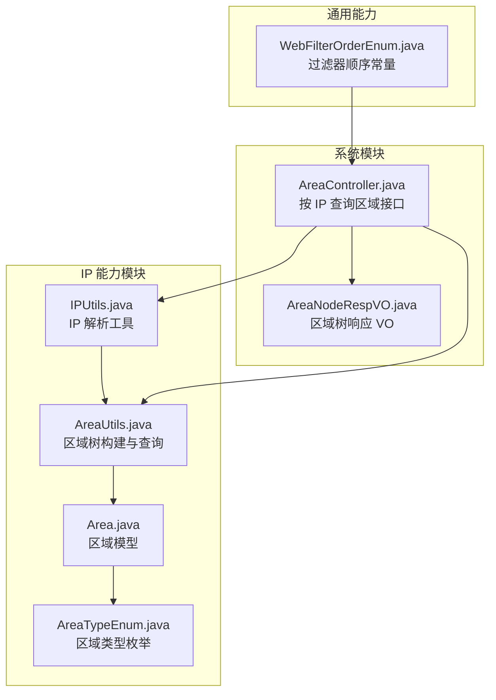
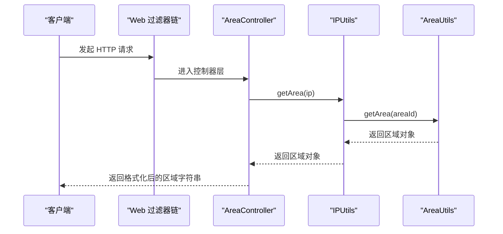
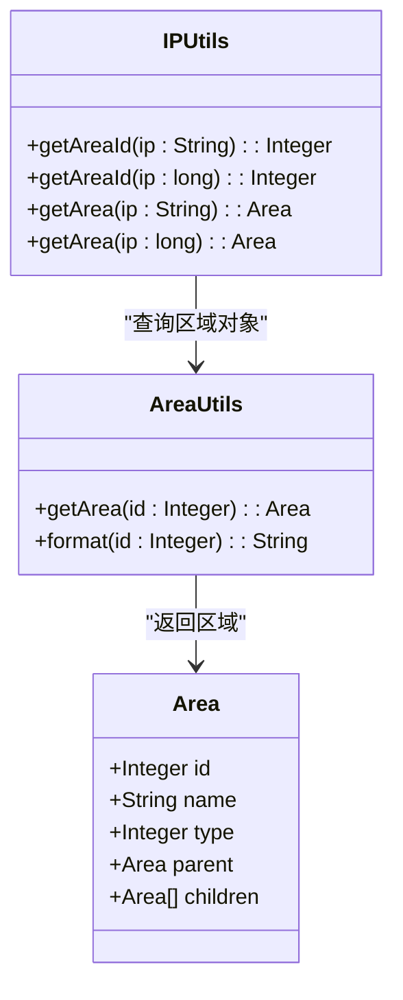
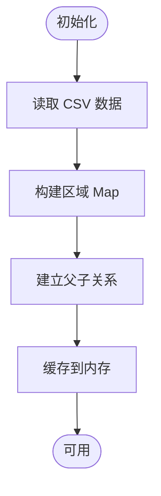
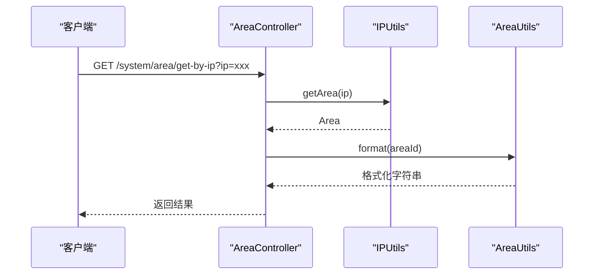
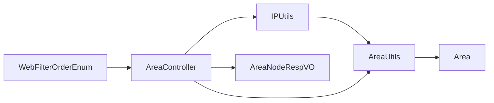

# IP白名单与黑名单

<cite>
**本文引用的文件**
- [IPUtils.java](file://qiji-framework/qiji-spring-boot-starter-biz-ip/src/main/java/com.qiji.cps/framework/ip/core/utils/IPUtils.java)
- [AreaUtils.java](file://qiji-framework/qiji-spring-boot-starter-biz-ip/src/main/java/com.qiji.cps/framework/ip/core/utils/AreaUtils.java)
- [Area.java](file://qiji-framework/qiji-spring-boot-starter-biz-ip/src/main/java/com.qiji.cps/framework/ip/core/Area.java)
- [AreaTypeEnum.java](file://qiji-framework/qiji-spring-boot-starter-biz-ip/src/main/java/com.qiji.cps/framework/ip/core/enums/AreaTypeEnum.java)
- [AreaController.java](file://qiji-module-system/src/main/java/com.qiji.cps/module/system/controller/admin/ip/AreaController.java)
- [AreaNodeRespVO.java](file://qiji-module-system/src/main/java/com.qiji.cps/module/system/controller/admin/ip/vo/AreaNodeRespVO.java)
- [WebFilterOrderEnum.java](file://qiji-framework/qiji-common/src/main/java/com.qiji.cps/framework/common/enums/WebFilterOrderEnum.java)
- [IPUtilsTest.java](file://qiji-framework/qiji-spring-boot-starter-biz-ip/src/test/java/com.qiji.cps/framework/ip/core/utils/IPUtilsTest.java)
- [AreaUtilsTest.java](file://qiji-framework/qiji-spring-boot-starter-biz-ip/src/test/java/com.qiji.cps/framework/ip/core/utils/AreaUtilsTest.java)
</cite>

## 目录
1. [简介](#简介)
2. [项目结构](#项目结构)
3. [核心组件](#核心组件)
4. [架构总览](#架构总览)
5. [详细组件分析](#详细组件分析)
6. [依赖分析](#依赖分析)
7. [性能考虑](#性能考虑)
8. [故障排查指南](#故障排查指南)
9. [结论](#结论)
10. [附录](#附录)

## 简介
本文件围绕 AgenticCPS 系统中的 IP 白名单与黑名单机制展开，结合现有仓库中的 IP 解析与区域工具能力，给出可落地的实现思路与最佳实践。当前仓库提供了基于 ip2region 的 IP 地址解析能力以及区域树构建与格式化能力，可用于支撑“按来源区域/网段”的访问控制策略。本文将从以下维度展开：
- IP 地址解析与 CIDR 支持现状
- 白名单/黑名单的配置与执行流程
- 与现有 Web 过滤器链的集成位置
- 应用场景与优先级/冲突处理建议
- 最佳实践与常见问题

## 项目结构
与 IP 白名单/黑名单直接相关的核心模块与文件如下：
- IP 工具与区域工具：提供 IP 到区域编号的映射、区域树构建与格式化
- 控制器：提供按 IP 查询区域的接口
- Web 过滤器顺序：定义过滤器链的执行顺序，为后续接入访问控制提供落点

**图表来源**
- [IPUtils.java:1-86](file://qiji-framework/qiji-spring-boot-starter-biz-ip/src/main/java/com.qiji.cps/framework/ip/core/utils/IPUtils.java#L1-L86)
- [AreaUtils.java:1-218](file://qiji-framework/qiji-spring-boot-starter-biz-ip/src/main/java/com.qiji.cps/framework/ip/core/utils/AreaUtils.java#L1-L218)
- [Area.java:1-61](file://qiji-framework/qiji-spring-boot-starter-biz-ip/src/main/java/com.qiji.cps/framework/ip/core/Area.java#L1-L61)
- [AreaTypeEnum.java:1-39](file://qiji-framework/qiji-spring-boot-starter-biz-ip/src/main/java/com.qiji.cps/framework/ip/core/enums/AreaTypeEnum.java#L1-L39)
- [AreaController.java:1-51](file://qiji-module-system/src/main/java/com.qiji.cps/module/system/controller/admin/ip/AreaController.java#L1-L51)
- [AreaNodeRespVO.java:1-23](file://qiji-module-system/src/main/java/com.qiji.cps/module/system/controller/admin/ip/vo/AreaNodeRespVO.java#L1-L23)
- [WebFilterOrderEnum.java:1-37](file://qiji-framework/qiji-common/src/main/java/com.qiji.cps/framework/common/enums/WebFilterOrderEnum.java#L1-L37)

**章节来源**
- [IPUtils.java:1-86](file://qiji-framework/qiji-spring-boot-starter-biz-ip/src/main/java/com.qiji.cps/framework/ip/core/utils/IPUtils.java#L1-L86)
- [AreaUtils.java:1-218](file://qiji-framework/qiji-spring-boot-starter-biz-ip/src/main/java/com.qiji.cps/framework/ip/core/utils/AreaUtils.java#L1-L218)
- [Area.java:1-61](file://qiji-framework/qiji-spring-boot-starter-biz-ip/src/main/java/com.qiji.cps/framework/ip/core/Area.java#L1-L61)
- [AreaTypeEnum.java:1-39](file://qiji-framework/qiji-spring-boot-starter-biz-ip/src/main/java/com.qiji.cps/framework/ip/core/enums/AreaTypeEnum.java#L1-L39)
- [AreaController.java:1-51](file://qiji-module-system/src/main/java/com.qiji.cps/module/system/controller/admin/ip/AreaController.java#L1-L51)
- [AreaNodeRespVO.java:1-23](file://qiji-module-system/src/main/java/com.qiji.cps/module/system/controller/admin/ip/vo/AreaNodeRespVO.java#L1-L23)
- [WebFilterOrderEnum.java:1-37](file://qiji-framework/qiji-common/src/main/java/com.qiji.cps/framework/common/enums/WebFilterOrderEnum.java#L1-L37)

## 核心组件
- IPUtils：提供 IP 到区域编号的查询能力，内部加载 ip2region.xdb 并初始化 Searcher；支持字符串与长整型两种输入格式。
- AreaUtils：从 CSV 加载区域数据，构建区域树并提供格式化、按类型筛选、路径解析等能力。
- Area：区域模型，包含编号、名称、类型、父子关系。
- AreaTypeEnum：区域类型枚举（国家、省、市、区）。
- AreaController：对外提供按 IP 查询区域的接口，以及区域树查询接口。

上述组件共同构成“IP 解析 → 区域定位 → 格式化输出”的能力闭环，为后续接入白名单/黑名单策略提供基础。

**章节来源**
- [IPUtils.java:1-86](file://qiji-framework/qiji-spring-boot-starter-biz-ip/src/main/java/com.qiji.cps/framework/ip/core/utils/IPUtils.java#L1-L86)
- [AreaUtils.java:1-218](file://qiji-framework/qiji-spring-boot-starter-biz-ip/src/main/java/com.qiji.cps/framework/ip/core/utils/AreaUtils.java#L1-L218)
- [Area.java:1-61](file://qiji-framework/qiji-spring-boot-starter-biz-ip/src/main/java/com.qiji.cps/framework/ip/core/Area.java#L1-L61)
- [AreaTypeEnum.java:1-39](file://qiji-framework/qiji-spring-boot-starter-biz-ip/src/main/java/com.qiji.cps/framework/ip/core/enums/AreaTypeEnum.java#L1-L39)
- [AreaController.java:1-51](file://qiji-module-system/src/main/java/com.qiji.cps/module/system/controller/admin/ip/AreaController.java#L1-L51)

## 架构总览
下图展示了从请求进入系统到完成 IP 解析与区域查询的整体流程，以及与现有过滤器链的关系位置。

**图表来源**
- [AreaController.java:37-48](file://qiji-module-system/src/main/java/com.qiji.cps/module/system/controller/admin/ip/AreaController.java#L37-L48)
- [IPUtils.java:50-84](file://qiji-framework/qiji-spring-boot-starter-biz-ip/src/main/java/com.qiji.cps/framework/ip/core/utils/IPUtils.java#L50-L84)
- [AreaUtils.java:77-79](file://qiji-framework/qiji-spring-boot-starter-biz-ip/src/main/java/com.qiji.cps/framework/ip/core/utils/AreaUtils.java#L77-L79)

## 详细组件分析

### 组件 A：IP 解析与区域查询（IPUtils）
- 职责：加载 ip2region.xdb，提供字符串与长整型两种输入格式的 IP 到区域编号查询；再通过 AreaUtils 将区域编号转为区域对象。
- 关键点：
  - 静态初始化加载 Searcher，启动时完成。
  - 支持字符串与长整型两种输入，分别调用底层 Searcher 的 search 方法。
  - 返回区域对象，便于上层进一步格式化或策略判断。

**图表来源**
- [IPUtils.java:1-86](file://qiji-framework/qiji-spring-boot-starter-biz-ip/src/main/java/com.qiji.cps/framework/ip/core/utils/IPUtils.java#L1-L86)
- [AreaUtils.java:1-218](file://qiji-framework/qiji-spring-boot-starter-biz-ip/src/main/java/com.qiji.cps/framework/ip/core/utils/AreaUtils.java#L1-L218)
- [Area.java:1-61](file://qiji-framework/qiji-spring-boot-starter-biz-ip/src/main/java/com.qiji.cps/framework/ip/core/Area.java#L1-L61)

**章节来源**
- [IPUtils.java:1-86](file://qiji-framework/qiji-spring-boot-starter-biz-ip/src/main/java/com.qiji.cps/framework/ip/core/utils/IPUtils.java#L1-L86)
- [IPUtilsTest.java:1-47](file://qiji-framework/qiji-spring-boot-starter-biz-ip/src/test/java/com.qiji.cps/framework/ip/core/utils/IPUtilsTest.java#L1-L47)

### 组件 B：区域树构建与格式化（AreaUtils）
- 职责：从 CSV 加载区域数据，构建区域树（父子关系），提供按类型筛选、路径解析、格式化等能力。
- 关键点：
  - 启动时一次性加载并缓存区域树，查询效率高。
  - format 支持多层级拼接，且针对中国场景做特殊处理（避免重复显示“中国”）。
  - 提供按类型获取区域列表的能力，便于策略扩展。

**图表来源**
- [AreaUtils.java:44-69](file://qiji-framework/qiji-spring-boot-starter-biz-ip/src/main/java/com.qiji.cps/framework/ip/core/utils/AreaUtils.java#L44-L69)

**章节来源**
- [AreaUtils.java:1-218](file://qiji-framework/qiji-spring-boot-starter-biz-ip/src/main/java/com.qiji.cps/framework/ip/core/utils/AreaUtils.java#L1-L218)
- [AreaUtilsTest.java:1-36](file://qiji-framework/qiji-spring-boot-starter-biz-ip/src/test/java/com.qiji.cps/framework/ip/core/utils/AreaUtilsTest.java#L1-L36)

### 组件 C：控制器（AreaController）
- 职责：对外暴露按 IP 查询区域的接口，以及区域树查询接口。
- 关键点：
  - /system/area/get-by-ip：根据 IP 返回格式化后的区域字符串。
  - /system/area/tree：返回区域树（以中国为根）。

**图表来源**
- [AreaController.java:37-48](file://qiji-module-system/src/main/java/com.qiji.cps/module/system/controller/admin/ip/AreaController.java#L37-L48)
- [IPUtils.java:72-84](file://qiji-framework/qiji-spring-boot-starter-biz-ip/src/main/java/com.qiji.cps/framework/ip/core/utils/IPUtils.java#L72-L84)
- [AreaUtils.java:138-176](file://qiji-framework/qiji-spring-boot-starter-biz-ip/src/main/java/com.qiji.cps/framework/ip/core/utils/AreaUtils.java#L138-L176)

**章节来源**
- [AreaController.java:1-51](file://qiji-module-system/src/main/java/com.qiji.cps/module/system/controller/admin/ip/AreaController.java#L1-L51)
- [AreaNodeRespVO.java:1-23](file://qiji-module-system/src/main/java/com.qiji.cps/module/system/controller/admin/ip/vo/AreaNodeRespVO.java#L1-L23)

## 依赖分析
- IPUtils 依赖 AreaUtils 与 Area 模型，形成“IP 解析 → 区域对象”的依赖链。
- AreaController 依赖 IPUtils 与 AreaUtils，作为对外服务入口。
- WebFilterOrderEnum 为过滤器链顺序提供统一常量，便于在后续接入访问控制时选择合适的执行时机。

**图表来源**
- [IPUtils.java:1-86](file://qiji-framework/qiji-spring-boot-starter-biz-ip/src/main/java/com.qiji.cps/framework/ip/core/utils/IPUtils.java#L1-L86)
- [AreaUtils.java:1-218](file://qiji-framework/qiji-spring-boot-starter-biz-ip/src/main/java/com.qiji.cps/framework/ip/core/utils/AreaUtils.java#L1-L218)
- [Area.java:1-61](file://qiji-framework/qiji-spring-boot-starter-biz-ip/src/main/java/com.qiji.cps/framework/ip/core/Area.java#L1-L61)
- [AreaController.java:1-51](file://qiji-module-system/src/main/java/com.qiji.cps/module/system/controller/admin/ip/AreaController.java#L1-L51)
- [AreaNodeRespVO.java:1-23](file://qiji-module-system/src/main/java/com.qiji.cps/module/system/controller/admin/ip/vo/AreaNodeRespVO.java#L1-L23)
- [WebFilterOrderEnum.java:1-37](file://qiji-framework/qiji-common/src/main/java/com.qiji.cps/framework/common/enums/WebFilterOrderEnum.java#L1-L37)

**章节来源**
- [WebFilterOrderEnum.java:1-37](file://qiji-framework/qiji-common/src/main/java/com.qiji.cps/framework/common/enums/WebFilterOrderEnum.java#L1-L37)

## 性能考虑
- 启动时一次性加载 ip2region.xdb 与区域 CSV，避免运行时 IO 开销。
- AreaUtils 在启动时构建区域树并缓存，查询为 O(1) Map 查找。
- IPUtils 的静态 Searcher 初始化一次，后续查询直接命中内存。
- 建议：若未来引入大规模网段匹配（如 CIDR/正则），可在 IPUtils 之上增加缓存与索引优化，避免重复计算。

[本节为通用性能讨论，不直接分析具体文件]

## 故障排查指南
- IP 解析失败或返回空：
  - 检查 ip2region.xdb 是否正确打包与加载。
  - 确认输入 IP 格式合法。
- 区域格式化异常：
  - 检查区域编号是否存在于缓存中。
  - 确认区域树构建逻辑未出现父子节点自环。
- 单元测试参考：
  - IPUtilsTest：验证字符串与长整型两种输入格式的区域编号查询。
  - AreaUtilsTest：验证区域对象获取与格式化输出。

**章节来源**
- [IPUtilsTest.java:1-47](file://qiji-framework/qiji-spring-boot-starter-biz-ip/src/test/java/com.qiji.cps/framework/ip/core/utils/IPUtilsTest.java#L1-L47)
- [AreaUtilsTest.java:1-36](file://qiji-framework/qiji-spring-boot-starter-biz-ip/src/test/java/com.qiji.cps/framework/ip/core/utils/AreaUtilsTest.java#L1-L36)

## 结论
当前仓库已具备完善的 IP 地址解析与区域查询能力，可作为白名单/黑名单策略的前置条件。通过在 Web 过滤器链合适位置接入访问控制逻辑，即可实现“按来源区域/网段”的访问控制。后续可根据业务需求扩展 CIDR 与正则匹配能力，并完善规则的动态更新与持久化存储方案。

[本节为总结性内容，不直接分析具体文件]

## 附录

### IP 白名单/黑名单机制设计与实现要点
- IP 地址解析与 CIDR 支持
  - 现状：IPUtils 支持字符串与长整型输入，底层基于 ip2region.xdb。
  - 建议：在 IPUtils 之上封装“网段匹配器”，支持 CIDR 与正则表达式；对频繁匹配的网段建立缓存。
- 规则配置与动态更新
  - 静态配置：在应用启动时加载规则集合。
  - 动态更新：提供规则热加载接口，结合缓存失效策略。
  - 数据库存储：将规则持久化至数据库，定时同步到内存。
- 执行流程
  - 请求到达 → 提取客户端 IP → 解析为区域/网段 → 规则匹配（白名单优先）→ 访问控制决策。
- 优先级与冲突处理
  - 建议：白名单优先于黑名单；精确规则优先于通配规则；冲突时采用“拒绝放行”原则。
- 应用场景
  - API 访问控制：限制特定区域或网段的访问。
  - 运营维护：仅允许运维网段访问管理接口。
  - 安全审计：记录被拒绝的访问并上报。

[本节为概念性内容，不直接分析具体文件]

### 配置示例（路径指引）
- IP 解析与区域查询接口
  - GET /system/area/get-by-ip?ip={IP}
  - GET /system/area/tree
- 过滤器顺序参考
  - WebFilterOrderEnum 中定义了各类过滤器的执行顺序，可据此选择接入访问控制的时机。

**章节来源**
- [AreaController.java:29-48](file://qiji-module-system/src/main/java/com.qiji.cps/module/system/controller/admin/ip/AreaController.java#L29-L48)
- [WebFilterOrderEnum.java:10-36](file://qiji-framework/qiji-common/src/main/java/com.qiji.cps/framework/common/enums/WebFilterOrderEnum.java#L10-L36)