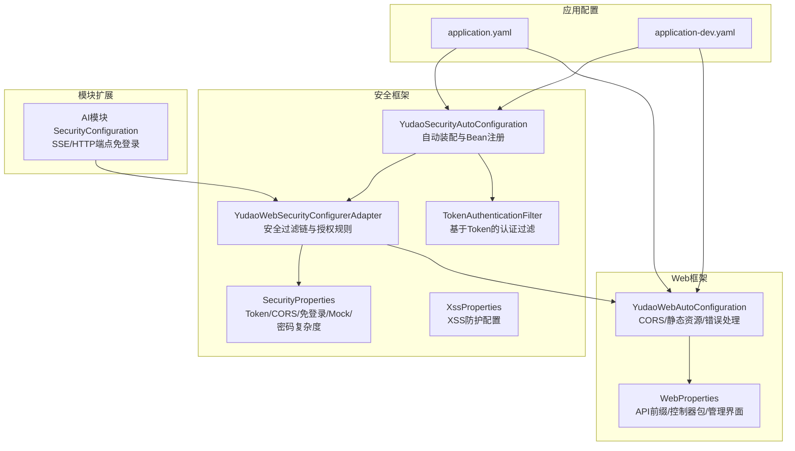
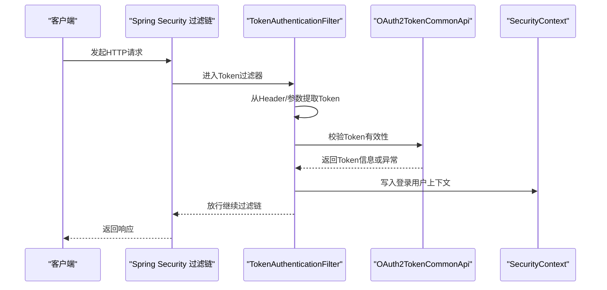
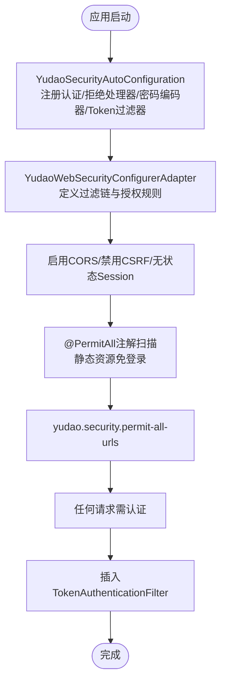
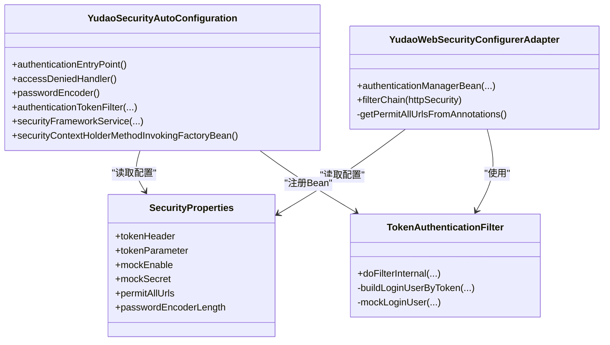

# 安全配置管理

<cite>
**本文引用的文件**
- [YudaoSecurityAutoConfiguration.java](file://yudao-framework/yudao-spring-boot-starter-security/src/main/java/cn/iocoder/yudao/framework/security/config/YudaoSecurityAutoConfiguration.java)
- [YudaoWebSecurityConfigurerAdapter.java](file://yudao-framework/yudao-spring-boot-starter-security/src/main/java/cn/iocoder/yudao/framework/security/config/YudaoWebSecurityConfigurerAdapter.java)
- [SecurityProperties.java](file://yudao-framework/yudao-spring-boot-starter-security/src/main/java/cn/iocoder/yudao/framework/security/config/SecurityProperties.java)
- [TokenAuthenticationFilter.java](file://yudao-framework/yudao-spring-boot-starter-security/src/main/java/cn/iocoder/yudao/framework/security/core/filter/TokenAuthenticationFilter.java)
- [WebProperties.java](file://yudao-framework/yudao-spring-boot-starter-web/src/main/java/cn/iocoder/yudao/framework/web/config/WebProperties.java)
- [YudaoWebAutoConfiguration.java](file://yudao-framework/yudao-spring-boot-starter-web/src/main/java/cn/iocoder/yudao/framework/web/config/YudaoWebAutoConfiguration.java)
- [XssProperties.java](file://yudao-framework/yudao-spring-boot-starter-web/src/main/java/cn/iocoder/yudao/framework/xss/config/XssProperties.java)
- [SecurityConfiguration.java（AI模块）](file://yudao-module-ai/src/main/java/cn/iocoder/yudao/module/ai/framework/security/config/SecurityConfiguration.java)
- [application-dev.yaml](file://yudao-server/src/main/resources/application-dev.yaml)
- [application.yaml](file://yudao-server/src/main/resources/application.yaml)
</cite>

## 目录
1. [简介](#简介)
2. [项目结构](#项目结构)
3. [核心组件](#核心组件)
4. [架构总览](#架构总览)
5. [详细组件分析](#详细组件分析)
6. [依赖分析](#依赖分析)
7. [性能考量](#性能考量)
8. [故障排查指南](#故障排查指南)
9. [结论](#结论)
10. [附录](#附录)

## 简介
本文件面向AgenticCPS系统的安全配置管理，系统性梳理并解释以下主题：
- 安全配置核心参数：Token配置、CORS配置、HTTPS与安全头、XSS防护等
- 自动配置机制：YudaoSecurityAutoConfiguration的过滤器与策略装配、YudaoWebSecurityConfigurerAdapter的拦截规则与加载顺序
- WebProperties中的Web安全配置：跨域、静态资源访问、错误页面等
- 配置加载顺序与优先级规则
- 不同环境下的安全配置差异（开发/测试/生产）
- 最佳实践：默认值说明、性能优化、安全加固
- 配置示例与常见错误排查

## 项目结构
围绕安全配置的关键模块与文件如下：
- 安全自动装配与适配器：YudaoSecurityAutoConfiguration、YudaoWebSecurityConfigurerAdapter
- 安全属性：SecurityProperties（Token、免登录URL、Mock模式、密码编码复杂度）
- Web安全与跨域：WebProperties、YudaoWebAutoConfiguration（CORS、静态资源、错误处理）
- XSS防护：XssProperties
- Token认证过滤器：TokenAuthenticationFilter
- 模块级安全扩展：AI模块的SecurityConfiguration
- 应用配置：application.yaml、application-dev.yaml

图表来源
- [YudaoSecurityAutoConfiguration.java:32-95](file://yudao-framework/yudao-spring-boot-starter-security/src/main/java/cn/iocoder/yudao/framework/security/config/YudaoSecurityAutoConfiguration.java#L32-L95)
- [YudaoWebSecurityConfigurerAdapter.java:46-222](file://yudao-framework/yudao-spring-boot-starter-security/src/main/java/cn/iocoder/yudao/framework/security/config/YudaoWebSecurityConfigurerAdapter.java#L46-L222)
- [SecurityProperties.java:12-51](file://yudao-framework/yudao-spring-boot-starter-security/src/main/java/cn/iocoder/yudao/framework/security/config/SecurityProperties.java#L12-L51)
- [TokenAuthenticationFilter.java:31-120](file://yudao-framework/yudao-spring-boot-starter-security/src/main/java/cn/iocoder/yudao/framework/security/core/filter/TokenAuthenticationFilter.java#L31-L120)
- [WebProperties.java:14-67](file://yudao-framework/yudao-spring-boot-starter-web/src/main/java/cn/iocoder/yudao/framework/web/config/WebProperties.java#L14-L67)
- [YudaoWebAutoConfiguration.java:35-144](file://yudao-framework/yudao-spring-boot-starter-web/src/main/java/cn/iocoder/yudao/framework/web/config/YudaoWebAutoConfiguration.java#L35-L144)
- [XssProperties.java:15-29](file://yudao-framework/yudao-spring-boot-starter-web/src/main/java/cn/iocoder/yudao/framework/xss/config/XssProperties.java#L15-L29)
- [SecurityConfiguration.java（AI模块）:30-42](file://yudao-module-ai/src/main/java/cn/iocoder/yudao/module/ai/framework/security/config/SecurityConfiguration.java#L30-L42)
- [application.yaml](file://yudao-server/src/main/resources/application.yaml)
- [application-dev.yaml](file://yudao-server/src/main/resources/application-dev.yaml)

章节来源
- [YudaoSecurityAutoConfiguration.java:32-95](file://yudao-framework/yudao-spring-boot-starter-security/src/main/java/cn/iocoder/yudao/framework/security/config/YudaoSecurityAutoConfiguration.java#L32-L95)
- [YudaoWebSecurityConfigurerAdapter.java:46-222](file://yudao-framework/yudao-spring-boot-starter-security/src/main/java/cn/iocoder/yudao/framework/security/config/YudaoWebSecurityConfigurerAdapter.java#L46-L222)
- [YudaoWebAutoConfiguration.java:35-144](file://yudao-framework/yudao-spring-boot-starter-web/src/main/java/cn/iocoder/yudao/framework/web/config/YudaoWebAutoConfiguration.java#L35-L144)

## 核心组件
- 安全属性（SecurityProperties）
  - Token请求头与参数：支持从Header或查询参数解析Token，满足WebSocket场景
  - Mock模式：开发调试用的模拟登录开关与密钥
  - 免登录URL列表：全局免认证白名单
  - 密码编码复杂度：BCrypt加密强度配置
- Token认证过滤器（TokenAuthenticationFilter）
  - 从请求中提取Token，调用OAuth2校验接口构建登录用户
  - 支持Mock模式快速调试
  - 将登录用户信息写入安全上下文
- Web安全与跨域（YudaoWebSecurityConfigurerAdapter + YudaoWebAutoConfiguration）
  - 禁用CSRF与Session，启用无状态Token认证
  - 统一静态资源免登录
  - 基于注解与配置的免登录URL集合
  - CORS跨域配置与过滤器注册
- XSS防护（XssProperties）
  - 默认开启，可排除特定URL
- 模块级安全扩展（AI模块SecurityConfiguration）
  - 针对SSE与可流式HTTP端点开放免登录

章节来源
- [SecurityProperties.java:12-51](file://yudao-framework/yudao-spring-boot-starter-security/src/main/java/cn/iocoder/yudao/framework/security/config/SecurityProperties.java#L12-L51)
- [TokenAuthenticationFilter.java:31-120](file://yudao-framework/yudao-spring-boot-starter-security/src/main/java/cn/iocoder/yudao/framework/security/core/filter/TokenAuthenticationFilter.java#L31-L120)
- [YudaoWebSecurityConfigurerAdapter.java:109-153](file://yudao-framework/yudao-spring-boot-starter-security/src/main/java/cn/iocoder/yudao/framework/security/config/YudaoWebSecurityConfigurerAdapter.java#L109-L153)
- [YudaoWebAutoConfiguration.java:100-119](file://yudao-framework/yudao-spring-boot-starter-web/src/main/java/cn/iocoder/yudao/framework/web/config/YudaoWebAutoConfiguration.java#L100-L119)
- [XssProperties.java:15-29](file://yudao-framework/yudao-spring-boot-starter-web/src/main/java/cn/iocoder/yudao/framework/xss/config/XssProperties.java#L15-L29)
- [SecurityConfiguration.java（AI模块）:30-42](file://yudao-module-ai/src/main/java/cn/iocoder/yudao/module/ai/framework/security/config/SecurityConfiguration.java#L30-L42)

## 架构总览
系统采用“自动装配 + 安全适配器 + 过滤器链”的分层设计：
- 自动装配负责注册认证入口、拒绝处理器、密码编码器、Token过滤器、安全上下文策略等
- 安全适配器定义过滤链、CSRF/Session/Headers策略、静态资源与免登录URL规则
- Web自动配置负责CORS、静态资源、错误处理等Web层安全
- Token过滤器在每次请求中解析并校验Token，完成用户上下文注入

图表来源
- [YudaoSecurityAutoConfiguration.java:62-74](file://yudao-framework/yudao-spring-boot-starter-security/src/main/java/cn/iocoder/yudao/framework/security/config/YudaoSecurityAutoConfiguration.java#L62-L74)
- [TokenAuthenticationFilter.java:40-69](file://yudao-framework/yudao-spring-boot-starter-security/src/main/java/cn/iocoder/yudao/framework/security/core/filter/TokenAuthenticationFilter.java#L40-L69)
- [YudaoWebSecurityConfigurerAdapter.java:109-153](file://yudao-framework/yudao-spring-boot-starter-security/src/main/java/cn/iocoder/yudao/framework/security/config/YudaoWebSecurityConfigurerAdapter.java#L109-L153)

## 详细组件分析

### 安全属性与Token配置
- Token请求头与参数
  - 支持从Header（默认名称）与查询参数两种方式获取Token
  - 用于WebSocket等无法携带Header的场景
- Mock模式
  - 开关与密钥需显式配置；生产务必关闭
  - 便于本地联调，避免真实鉴权
- 免登录URL
  - 支持全局配置与注解扫描（方法级/类级@PermitAll）
- 密码编码复杂度
  - BCrypt复杂度参数，越高越安全但CPU开销越大

章节来源
- [SecurityProperties.java:12-51](file://yudao-framework/yudao-spring-boot-starter-security/src/main/java/cn/iocoder/yudao/framework/security/config/SecurityProperties.java#L12-L51)
- [TokenAuthenticationFilter.java:44-45](file://yudao-framework/yudao-spring-boot-starter-security/src/main/java/cn/iocoder/yudao/framework/security/core/filter/TokenAuthenticationFilter.java#L44-L45)
- [YudaoWebSecurityConfigurerAdapter.java:125-142](file://yudao-framework/yudao-spring-boot-starter-security/src/main/java/cn/iocoder/yudao/framework/security/config/YudaoWebSecurityConfigurerAdapter.java#L125-L142)

### CORS与跨域配置
- Web自动配置提供全局CORS过滤器，允许任意源、头与方法
- 适用于开发阶段快速联调；生产应收紧策略，仅放行可信域名与必要方法

章节来源
- [YudaoWebAutoConfiguration.java:100-119](file://yudao-framework/yudao-spring-boot-starter-web/src/main/java/cn/iocoder/yudao/framework/web/config/YudaoWebAutoConfiguration.java#L100-L119)

### HTTPS与安全头
- 安全适配器禁用frameOptions，便于嵌套；如需点击劫持防护，应在网关/反向代理层统一配置
- HTTPS由部署层（Nginx/网关）统一处理，应用层不强制要求

章节来源
- [YudaoWebSecurityConfigurerAdapter.java:114-119](file://yudao-framework/yudao-spring-boot-starter-security/src/main/java/cn/iocoder/yudao/framework/security/config/YudaoWebSecurityConfigurerAdapter.java#L114-L119)

### XSS防护
- XSS默认开启，可通过excludeUrls排除特定URL
- 生产环境建议结合WAF与输入输出清洗策略

章节来源
- [XssProperties.java:15-29](file://yudao-framework/yudao-spring-boot-starter-web/src/main/java/cn/iocoder/yudao/framework/xss/config/XssProperties.java#L15-L29)

### 模块级安全扩展（AI模块）
- 针对SSE与可流式HTTP端点开放免登录，确保实时通信可用
- 通过自定义AuthorizeRequestsCustomizer接入全局授权链

章节来源
- [SecurityConfiguration.java（AI模块）:30-42](file://yudao-module-ai/src/main/java/cn/iocoder/yudao/module/ai/framework/security/config/SecurityConfiguration.java#L30-L42)

### WebProperties中的Web安全配置
- API前缀与控制器包：统一前缀避免Swagger/Actuator暴露风险
- 管理界面URL：集中管理UI访问地址
- 与安全适配器配合，实现API前缀与免登录规则的协同

章节来源
- [WebProperties.java:14-67](file://yudao-framework/yudao-spring-boot-starter-web/src/main/java/cn/iocoder/yudao/framework/web/config/WebProperties.java#L14-L67)
- [YudaoWebAutoConfiguration.java:46-56](file://yudao-framework/yudao-spring-boot-starter-web/src/main/java/cn/iocoder/yudao/framework/web/config/YudaoWebAutoConfiguration.java#L46-L56)

### 自动配置机制与加载顺序
- YudaoSecurityAutoConfiguration与YudaoWebSecurityConfigurerAdapter均标注@AutoConfiguration并设置较低的自动配置顺序，确保在Spring Security基础包生效前完成装配
- 安全过滤链在适配器中定义，先注册CORS/CSRF/Session/Headers策略，再注册Token过滤器，最后按规则授权

图表来源
- [YudaoSecurityAutoConfiguration.java:32-95](file://yudao-framework/yudao-spring-boot-starter-security/src/main/java/cn/iocoder/yudao/framework/security/config/YudaoSecurityAutoConfiguration.java#L32-L95)
- [YudaoWebSecurityConfigurerAdapter.java:109-153](file://yudao-framework/yudao-spring-boot-starter-security/src/main/java/cn/iocoder/yudao/framework/security/config/YudaoWebSecurityConfigurerAdapter.java#L109-L153)

章节来源
- [YudaoSecurityAutoConfiguration.java:32-95](file://yudao-framework/yudao-spring-boot-starter-security/src/main/java/cn/iocoder/yudao/framework/security/config/YudaoSecurityAutoConfiguration.java#L32-L95)
- [YudaoWebSecurityConfigurerAdapter.java:46-90](file://yudao-framework/yudao-spring-boot-starter-security/src/main/java/cn/iocoder/yudao/framework/security/config/YudaoWebSecurityConfigurerAdapter.java#L46-L90)

## 依赖分析
- 组件耦合
  - TokenAuthenticationFilter依赖SecurityProperties、GlobalExceptionHandler、OAuth2TokenCommonApi
  - YudaoWebSecurityConfigurerAdapter依赖WebProperties、SecurityProperties、TokenAuthenticationFilter以及多个自定义授权定制器
  - YudaoSecurityAutoConfiguration依赖SecurityProperties、GlobalExceptionHandler、OAuth2TokenCommonApi、PermissionCommonApi
- 外部集成
  - OAuth2TokenCommonApi用于Token校验
  - Spring Security Web MVC与WebFlux的过滤链与异步DispatcherType处理

图表来源
- [YudaoSecurityAutoConfiguration.java:37-92](file://yudao-framework/yudao-spring-boot-starter-security/src/main/java/cn/iocoder/yudao/framework/security/config/YudaoSecurityAutoConfiguration.java#L37-L92)
- [YudaoWebSecurityConfigurerAdapter.java:51-81](file://yudao-framework/yudao-spring-boot-starter-security/src/main/java/cn/iocoder/yudao/framework/security/config/YudaoWebSecurityConfigurerAdapter.java#L51-L81)
- [TokenAuthenticationFilter.java:34-38](file://yudao-framework/yudao-spring-boot-starter-security/src/main/java/cn/iocoder/yudao/framework/security/core/filter/TokenAuthenticationFilter.java#L34-L38)
- [SecurityProperties.java:15-51](file://yudao-framework/yudao-spring-boot-starter-security/src/main/java/cn/iocoder/yudao/framework/security/config/SecurityProperties.java#L15-L51)

章节来源
- [YudaoSecurityAutoConfiguration.java:37-92](file://yudao-framework/yudao-spring-boot-starter-security/src/main/java/cn/iocoder/yudao/framework/security/config/YudaoSecurityAutoConfiguration.java#L37-L92)
- [YudaoWebSecurityConfigurerAdapter.java:51-81](file://yudao-framework/yudao-spring-boot-starter-security/src/main/java/cn/iocoder/yudao/framework/security/config/YudaoWebSecurityConfigurerAdapter.java#L51-L81)
- [TokenAuthenticationFilter.java:34-38](file://yudao-framework/yudao-spring-boot-starter-security/src/main/java/cn/iocoder/yudao/framework/security/core/filter/TokenAuthenticationFilter.java#L34-L38)

## 性能考量
- 密码编码复杂度
  - 建议在开发环境适度降低，生产环境提升至更高值，平衡安全与性能
- Token校验
  - 合理缓存Token校验结果与用户信息，减少远程调用
- 过滤器链
  - 仅保留必要过滤器，避免重复解析请求体
- CORS
  - 生产环境限制允许的源、头与方法，减少预检请求开销

[本节为通用指导，无需列出章节来源]

## 故障排查指南
- Token无效或过期
  - 检查请求头/参数是否正确传递
  - 确认Mock模式未开启且密钥配置正确
- 403访问被拒
  - 核对免登录URL配置与注解是否生效
  - 确认用户类型与目标接口匹配
- CORS跨域失败
  - 开发环境可临时放开；生产需精确配置允许源
- Mock模式误用
  - 生产环境务必关闭，否则存在严重安全风险
- 静态资源无法访问
  - 确认静态资源匹配规则与API前缀配置

章节来源
- [TokenAuthenticationFilter.java:44-45](file://yudao-framework/yudao-spring-boot-starter-security/src/main/java/cn/iocoder/yudao/framework/security/core/filter/TokenAuthenticationFilter.java#L44-L45)
- [YudaoWebSecurityConfigurerAdapter.java:125-142](file://yudao-framework/yudao-spring-boot-starter-security/src/main/java/cn/iocoder/yudao/framework/security/config/YudaoWebSecurityConfigurerAdapter.java#L125-L142)
- [YudaoWebAutoConfiguration.java:100-119](file://yudao-framework/yudao-spring-boot-starter-web/src/main/java/cn/iocoder/yudao/framework/web/config/YudaoWebAutoConfiguration.java#L100-L119)

## 结论
AgenticCPS的安全配置以“无状态Token + 统一免登录白名单 + Web层CORS/XSS防护”为核心，通过自动装配与安全适配器实现高内聚低耦合的配置体系。生产环境应严格收紧CORS与免登录范围，关闭Mock模式，合理设置密码编码复杂度与Token校验策略，确保在保障易用性的同时最大化安全性。

[本节为总结性内容，无需列出章节来源]

## 附录

### 配置加载顺序与优先级规则
- 自动配置顺序
  - 两个适配器均设置较低的自动配置顺序，确保在Spring Security基础包生效前完成装配
- 规则优先级
  - @PermitAll注解 > yudao.security.permit-all-urls > 全局静态资源免登录 > 任何请求需认证
- Web层优先级
  - CORS过滤器早于安全过滤链注册，静态资源免登录规则早于业务授权规则

章节来源
- [YudaoWebSecurityConfigurerAdapter.java:125-148](file://yudao-framework/yudao-spring-boot-starter-security/src/main/java/cn/iocoder/yudao/framework/security/config/YudaoWebSecurityConfigurerAdapter.java#L125-L148)
- [YudaoWebAutoConfiguration.java:100-119](file://yudao-framework/yudao-spring-boot-starter-web/src/main/java/cn/iocoder/yudao/framework/web/config/YudaoWebAutoConfiguration.java#L100-L119)

### 不同环境下的安全配置策略
- 开发环境
  - CORS可宽松；Mock模式可开启；日志与错误页便于调试
- 测试环境
  - 与生产接近的CORS与安全策略；关闭Mock
- 生产环境
  - 严格的CORS白名单；禁用Mock；提升密码编码复杂度；最小化免登录范围

章节来源
- [application-dev.yaml](file://yudao-server/src/main/resources/application-dev.yaml)
- [application.yaml](file://yudao-server/src/main/resources/application.yaml)

### 配置示例与最佳实践
- Token配置
  - 建议使用Header传递Token；WebSocket场景使用查询参数
- CORS配置
  - 生产环境仅放行可信域名与必要方法
- 安全头
  - 在网关/反向代理层统一配置X-Frame-Options与Content-Security-Policy
- XSS防护
  - 默认开启；对特殊接口谨慎排除
- 最佳实践
  - 生产关闭Mock；定期轮换密钥；最小权限原则；审计与告警

[本节为通用指导，无需列出章节来源]