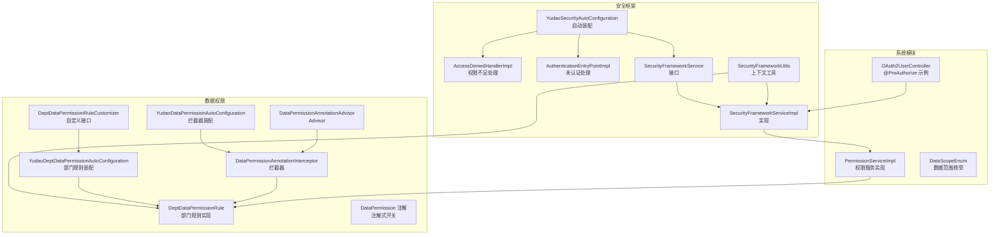
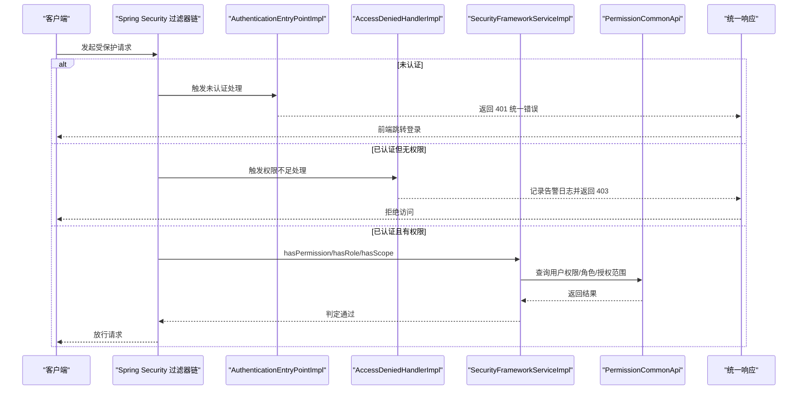
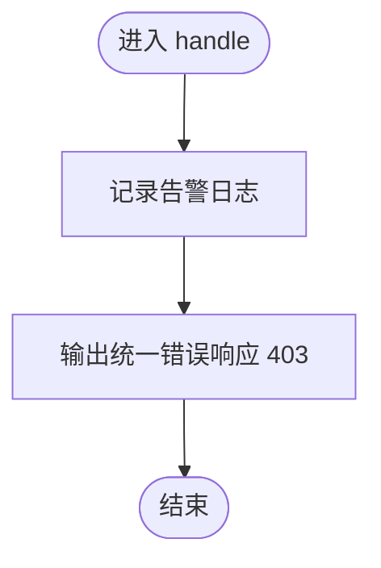
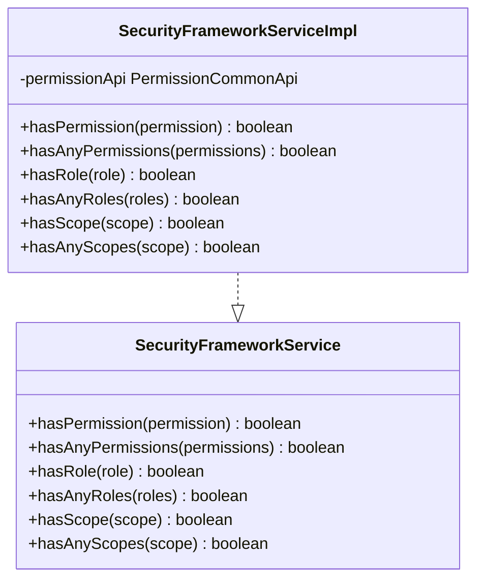
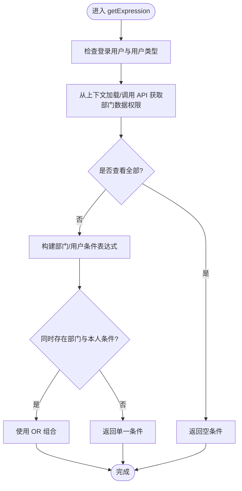
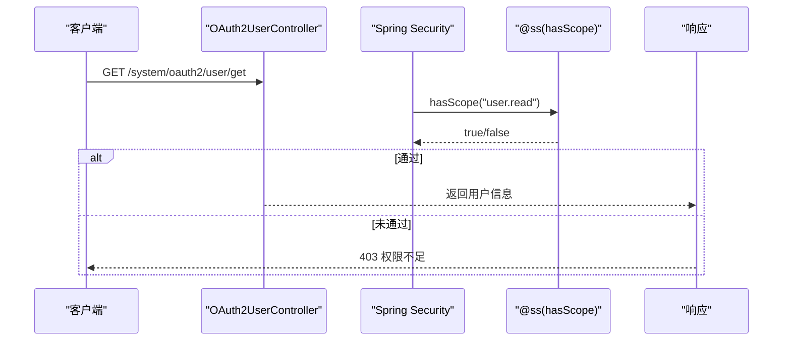
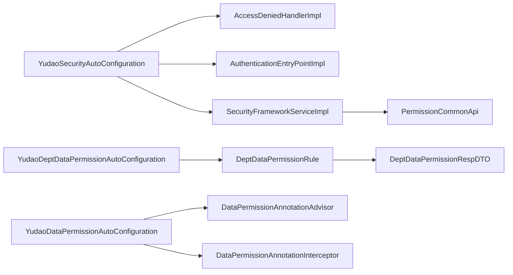

# 权限控制

<cite>
**本文引用的文件**
- [AccessDeniedHandlerImpl.java](file://yudao-framework/yudao-spring-boot-starter-security/src/main/java/cn/iocoder/yudao/framework/security/core/handler/AccessDeniedHandlerImpl.java)
- [AuthenticationEntryPointImpl.java](file://yudao-framework/yudao-spring-boot-starter-security/src/main/java/cn/iocoder/yudao/framework/security/core/handler/AuthenticationEntryPointImpl.java)
- [SecurityFrameworkService.java](file://yudao-framework/yudao-spring-boot-starter-security/src/main/java/cn/iocoder/yudao/framework/security/core/service/SecurityFrameworkService.java)
- [SecurityFrameworkServiceImpl.java](file://yudao-framework/yudao-spring-boot-starter-security/src/main/java/cn/iocoder/yudao/framework/security/core/service/SecurityFrameworkServiceImpl.java)
- [YudaoSecurityAutoConfiguration.java](file://yudao-framework/yudao-spring-boot-starter-security/src/main/java/cn/iocoder/yudao/framework/security/config/YudaoSecurityAutoConfiguration.java)
- [SecurityFrameworkUtils.java](file://yudao-framework/yudao-spring-boot-starter-security/src/main/java/cn/iocoder/yudao/framework/security/core/util/SecurityFrameworkUtils.java)
- [YudaoDeptDataPermissionAutoConfiguration.java](file://yudao-framework/yudao-spring-boot-starter-biz-data-permission/src/main/java/cn/iocoder/yudao/framework/datapermission/config/YudaoDeptDataPermissionAutoConfiguration.java)
- [DeptDataPermissionRule.java](file://yudao-framework/yudao-spring-boot-starter-biz-data-permission/src/main/java/cn/iocoder/yudao/framework/datapermission/core/rule/dept/DeptDataPermissionRule.java)
- [DeptDataPermissionRuleCustomizer.java](file://yudao-framework/yudao-spring-boot-starter-biz-data-permission/src/main/java/cn/iocoder/yudao/framework/datapermission/core/rule/dept/DeptDataPermissionRuleCustomizer.java)
- [DataPermission.java](file://yudao-framework/yudao-spring-boot-starter-biz-data-permission/src/main/java/cn/iocoder/yudao/framework/datapermission/core/annotation/DataPermission.java)
- [DataPermissionAnnotationAdvisor.java](file://yudao-framework/yudao-spring-boot-starter-biz-data-permission/src/main/java/cn/iocoder/yudao/framework/datapermission/core/aop/DataPermissionAnnotationAdvisor.java)
- [DataPermissionAnnotationInterceptor.java](file://yudao-framework/yudao-spring-boot-starter-biz-data-permission/src/main/java/cn/iocoder/yudao/framework/datapermission/core/aop/DataPermissionAnnotationInterceptor.java)
- [YudaoDataPermissionAutoConfiguration.java](file://yudao-framework/yudao-spring-boot-starter-biz-data-permission/src/main/java/cn/iocoder/yudao/framework/datapermission/config/YudaoDataPermissionAutoConfiguration.java)
- [DeptDataPermissionRespDTO.java](file://yudao-framework/yudao-common/src/main/java/cn/iocoder/yudao/framework/common/biz/system/permission/dto/DeptDataPermissionRespDTO.java)
- [DataScopeEnum.java](file://yudao-module-system/src/main/java/cn/iocoder/yudao/module/system/enums/permission/DataScopeEnum.java)
- [OAuth2UserController.java](file://yudao-module-system/src/main/java/cn/iocoder/yudao/module/system/controller/admin/oauth2/OAuth2UserController.java)
- [PermissionServiceImpl.java](file://yudao-module-system/src/main/java/cn/iocoder/yudao/module/system/service/permission/PermissionServiceImpl.java)
- [CacheUtils.java](file://yudao-framework/yudao-common/src/main/java/cn/iocoder/yudao/framework/common/util/cache/CacheUtils.java)
</cite>

## 目录
1. [简介](#简介)
2. [项目结构](#项目结构)
3. [核心组件](#核心组件)
4. [架构总览](#架构总览)
5. [详细组件分析](#详细组件分析)
6. [依赖分析](#依赖分析)
7. [性能考虑](#性能考虑)
8. [故障排查指南](#故障排查指南)
9. [结论](#结论)
10. [附录](#附录)

## 简介
本文件面向 AgenticCPS 系统的权限控制，围绕以下目标展开：
- 深入解析 AccessDeniedHandlerImpl 对权限不足请求的处理机制（异常捕获、错误响应、日志记录）
- 详解 SecurityFrameworkService 的权限服务实现（权限获取、角色验证、资源访问控制）
- 阐述数据权限控制机制（部门数据权限、自定义数据权限规则）
- 介绍权限注解的使用方法（@PreAuthorize、@PostAuthorize 等）及其配置与场景
- 说明权限缓存策略与性能优化方案
- 提供权限配置最佳实践（RBAC 模型设计、权限继承、动态权限更新）
- 给出权限控制流程图与实际应用示例

## 项目结构
权限控制能力由安全框架与数据权限模块共同组成：
- 安全框架层：提供认证入口、权限判定、上下文工具与自动装配
- 数据权限层：提供基于部门的数据权限规则与注解式开关
- 系统模块：提供权限服务、OAuth2 范畴授权、数据范围枚举等

图表来源
- [YudaoSecurityAutoConfiguration.java:53-85](file://yudao-framework/yudao-spring-boot-starter-security/src/main/java/cn/iocoder/yudao/framework/security/config/YudaoSecurityAutoConfiguration.java#L53-L85)
- [SecurityFrameworkServiceImpl.java:19-84](file://yudao-framework/yudao-spring-boot-starter-security/src/main/java/cn/iocoder/yudao/framework/security/core/service/SecurityFrameworkServiceImpl.java#L19-L84)
- [YudaoDeptDataPermissionAutoConfiguration.java:19-34](file://yudao-framework/yudao-spring-boot-starter-biz-data-permission/src/main/java/cn/iocoder/yudao/framework/datapermission/config/YudaoDeptDataPermissionAutoConfiguration.java#L19-L34)
- [DeptDataPermissionRule.java:50-207](file://yudao-framework/yudao-spring-boot-starter-biz-data-permission/src/main/java/cn/iocoder/yudao/framework/datapermission/core/rule/dept/DeptDataPermissionRule.java#L50-L207)
- [DataPermission.java:13-35](file://yudao-framework/yudao-spring-boot-starter-biz-data-permission/src/main/java/cn/iocoder/yudao/framework/datapermission/core/annotation/DataPermission.java#L13-L35)
- [DataPermissionAnnotationAdvisor.java:17-36](file://yudao-framework/yudao-spring-boot-starter-biz-data-permission/src/main/java/cn/iocoder/yudao/framework/datapermission/core/aop/DataPermissionAnnotationAdvisor.java#L17-L36)
- [DataPermissionAnnotationInterceptor.java:21-34](file://yudao-framework/yudao-spring-boot-starter-biz-data-permission/src/main/java/cn/iocoder/yudao/framework/datapermission/core/aop/DataPermissionAnnotationInterceptor.java#L21-L34)
- [YudaoDataPermissionAutoConfiguration.java:31-46](file://yudao-framework/yudao-spring-boot-starter-biz-data-permission/src/main/java/cn/iocoder/yudao/framework/datapermission/config/YudaoDataPermissionAutoConfiguration.java#L31-L46)
- [OAuth2UserController.java:42-59](file://yudao-module-system/src/main/java/cn/iocoder/yudao/module/system/controller/admin/oauth2/OAuth2UserController.java#L42-L59)
- [PermissionServiceImpl.java:46-64](file://yudao-module-system/src/main/java/cn/iocoder/yudao/module/system/service/permission/PermissionServiceImpl.java#L46-L64)

章节来源
- [YudaoSecurityAutoConfiguration.java:53-85](file://yudao-framework/yudao-spring-boot-starter-security/src/main/java/cn/iocoder/yudao/framework/security/config/YudaoSecurityAutoConfiguration.java#L53-L85)
- [YudaoDeptDataPermissionAutoConfiguration.java:19-34](file://yudao-framework/yudao-spring-boot-starter-biz-data-permission/src/main/java/cn/iocoder/yudao/framework/datapermission/config/YudaoDeptDataPermissionAutoConfiguration.java#L19-L34)
- [YudaoDataPermissionAutoConfiguration.java:31-46](file://yudao-framework/yudao-spring-boot-starter-biz-data-permission/src/main/java/cn/iocoder/yudao/framework/datapermission/config/YudaoDataPermissionAutoConfiguration.java#L31-L46)

## 核心组件
- AccessDeniedHandlerImpl：处理已认证但无权限的访问，记录告警日志并返回统一错误响应
- SecurityFrameworkService/Impl：对外暴露 hasPermission/hasRole/hasScope 等判定方法，内部委托权限 API 完成校验
- SecurityFrameworkUtils：提供获取当前用户、Token 解析、跨租户跳过校验等上下文能力
- 数据权限规则：DeptDataPermissionRule 基于部门与用户维度生成 SQL 条件，支持自定义表字段映射
- 注解体系：@DataPermission 控制注解式数据权限开关；@PreAuthorize/@PostAuthorize 用于资源访问与后置校验

章节来源
- [AccessDeniedHandlerImpl.java:29-41](file://yudao-framework/yudao-spring-boot-starter-security/src/main/java/cn/iocoder/yudao/framework/security/core/handler/AccessDeniedHandlerImpl.java#L29-L41)
- [SecurityFrameworkService.java:8-60](file://yudao-framework/yudao-spring-boot-starter-security/src/main/java/cn/iocoder/yudao/framework/security/core/service/SecurityFrameworkService.java#L8-L60)
- [SecurityFrameworkServiceImpl.java:19-84](file://yudao-framework/yudao-spring-boot-starter-security/src/main/java/cn/iocoder/yudao/framework/security/core/service/SecurityFrameworkServiceImpl.java#L19-L84)
- [SecurityFrameworkUtils.java:24-161](file://yudao-framework/yudao-spring-boot-starter-security/src/main/java/cn/iocoder/yudao/framework/security/core/util/SecurityFrameworkUtils.java#L24-L161)
- [DeptDataPermissionRule.java:50-207](file://yudao-framework/yudao-spring-boot-starter-biz-data-permission/src/main/java/cn/iocoder/yudao/framework/datapermission/core/rule/dept/DeptDataPermissionRule.java#L50-L207)
- [DataPermission.java:13-35](file://yudao-framework/yudao-spring-boot-starter-biz-data-permission/src/main/java/cn/iocoder/yudao/framework/datapermission/core/annotation/DataPermission.java#L13-L35)

## 架构总览
权限控制贯穿“认证入口 -> 权限判定 -> 数据权限 -> 统一响应”的链路。

图表来源
- [AuthenticationEntryPointImpl.java:26-35](file://yudao-framework/yudao-spring-boot-starter-security/src/main/java/cn/iocoder/yudao/framework/security/core/handler/AuthenticationEntryPointImpl.java#L26-L35)
- [AccessDeniedHandlerImpl.java:29-41](file://yudao-framework/yudao-spring-boot-starter-security/src/main/java/cn/iocoder/yudao/framework/security/core/handler/AccessDeniedHandlerImpl.java#L29-L41)
- [SecurityFrameworkServiceImpl.java:19-84](file://yudao-framework/yudao-spring-boot-starter-security/src/main/java/cn/iocoder/yudao/framework/security/core/service/SecurityFrameworkServiceImpl.java#L19-L84)

## 详细组件分析

### AccessDeniedHandlerImpl：权限不足处理
- 功能要点
  - 捕获 AccessDeniedException
  - 记录告警日志（含请求 URI 与当前登录用户）
  - 写入 JSON 统一错误响应（403）
- 适用场景
  - 已登录用户访问其权限列表之外的资源
- 关键行为
  - 通过 SecurityFrameworkUtils 获取当前登录用户 ID
  - 使用 ServletUtils 输出 CommonResult.error(FORBIDDEN)

图表来源
- [AccessDeniedHandlerImpl.java:31-41](file://yudao-framework/yudao-spring-boot-starter-security/src/main/java/cn/iocoder/yudao/framework/security/core/handler/AccessDeniedHandlerImpl.java#L31-L41)
- [SecurityFrameworkUtils.java:74-92](file://yudao-framework/yudao-spring-boot-starter-security/src/main/java/cn/iocoder/yudao/framework/security/core/util/SecurityFrameworkUtils.java#L74-L92)

章节来源
- [AccessDeniedHandlerImpl.java:29-41](file://yudao-framework/yudao-spring-boot-starter-security/src/main/java/cn/iocoder/yudao/framework/security/core/handler/AccessDeniedHandlerImpl.java#L29-L41)
- [SecurityFrameworkUtils.java:74-92](file://yudao-framework/yudao-spring-boot-starter-security/src/main/java/cn/iocoder/yudao/framework/security/core/util/SecurityFrameworkUtils.java#L74-L92)

### SecurityFrameworkService 与 SecurityFrameworkServiceImpl：权限服务
- 接口能力
  - hasPermission/hasAnyPermissions：权限校验
  - hasRole/hasAnyRoles：角色校验
  - hasScope/hasAnyScopes：授权范围校验
- 实现逻辑
  - 跨租户访问时可选择跳过校验
  - 通过 SecurityFrameworkUtils 获取当前用户
  - 委托 PermissionCommonApi 完成具体校验
- 性能注意
  - 建议结合缓存与上下文复用减少重复查询

图表来源
- [SecurityFrameworkService.java:8-60](file://yudao-framework/yudao-spring-boot-starter-security/src/main/java/cn/iocoder/yudao/framework/security/core/service/SecurityFrameworkService.java#L8-L60)
- [SecurityFrameworkServiceImpl.java:19-84](file://yudao-framework/yudao-spring-boot-starter-security/src/main/java/cn/iocoder/yudao/framework/security/core/service/SecurityFrameworkServiceImpl.java#L19-L84)

章节来源
- [SecurityFrameworkService.java:8-60](file://yudao-framework/yudao-spring-boot-starter-security/src/main/java/cn/iocoder/yudao/framework/security/core/service/SecurityFrameworkService.java#L8-L60)
- [SecurityFrameworkServiceImpl.java:19-84](file://yudao-framework/yudao-spring-boot-starter-security/src/main/java/cn/iocoder/yudao/framework/security/core/service/SecurityFrameworkServiceImpl.java#L19-L84)

### 数据权限控制：部门规则与自定义
- 规则实现
  - DeptDataPermissionRule：根据用户类型与上下文中的部门数据权限，生成 dept_id 或 user_id 的过滤条件
  - 支持“查看全部”“仅本人”“指定部门集合”等策略
  - 通过 PermissionCommonApi 获取 DeptDataPermissionRespDTO 并缓存到 LoginUser 上下文
- 自定义扩展
  - DeptDataPermissionRuleCustomizer：为不同实体类配置 dept_id/user_id 字段映射
  - YudaoDeptDataPermissionAutoConfiguration：装配规则并应用自定义器
- SQL 生成
  - 通过 MyBatis-Plus 表信息与列表达式拼装 IN/Equals 条件
  - 若条件为空，返回恒假表达式以确保无数据

图表来源
- [DeptDataPermissionRule.java:90-146](file://yudao-framework/yudao-spring-boot-starter-biz-data-permission/src/main/java/cn/iocoder/yudao/framework/datapermission/core/rule/dept/DeptDataPermissionRule.java#L90-L146)
- [DeptDataPermissionRespDTO.java:13-35](file://yudao-framework/yudao-common/src/main/java/cn/iocoder/yudao/framework/common/biz/system/permission/dto/DeptDataPermissionRespDTO.java#L13-L35)

章节来源
- [DeptDataPermissionRule.java:50-207](file://yudao-framework/yudao-spring-boot-starter-biz-data-permission/src/main/java/cn/iocoder/yudao/framework/datapermission/core/rule/dept/DeptDataPermissionRule.java#L50-L207)
- [YudaoDeptDataPermissionAutoConfiguration.java:19-34](file://yudao-framework/yudao-spring-boot-starter-biz-data-permission/src/main/java/cn/iocoder/yudao/framework/datapermission/config/YudaoDeptDataPermissionAutoConfiguration.java#L19-L34)
- [DeptDataPermissionRuleCustomizer.java:8-20](file://yudao-framework/yudao-spring-boot-starter-biz-data-permission/src/main/java/cn/iocoder/yudao/framework/datapermission/core/rule/dept/DeptDataPermissionRuleCustomizer.java#L8-L20)
- [DeptDataPermissionRespDTO.java:13-35](file://yudao-framework/yudao-common/src/main/java/cn/iocoder/yudao/framework/common/biz/system/permission/dto/DeptDataPermissionRespDTO.java#L13-L35)

### 权限注解：@PreAuthorize、@PostAuthorize 与 @DataPermission
- OAuth2UserController 示例
  - 使用 @PreAuthorize("@ss.hasScope('user.read')") 限制资源访问范围
  - 通过 SecurityFrameworkServiceImpl 的 hasScope 判定授权范围
- 数据权限注解
  - @DataPermission：可声明在类或方法上，控制是否启用数据权限以及生效规则集合
  - DataPermissionAnnotationAdvisor/Interceptor：基于注解的 AOP 切面，入栈/出栈注解上下文
  - YudaoDataPermissionAutoConfiguration：注册拦截器并将其置于 MyBatis Plus 插件首位

图表来源
- [OAuth2UserController.java:42-59](file://yudao-module-system/src/main/java/cn/iocoder/yudao/module/system/controller/admin/oauth2/OAuth2UserController.java#L42-L59)
- [SecurityFrameworkServiceImpl.java:64-82](file://yudao-framework/yudao-spring-boot-starter-security/src/main/java/cn/iocoder/yudao/framework/security/core/service/SecurityFrameworkServiceImpl.java#L64-L82)

章节来源
- [OAuth2UserController.java:42-59](file://yudao-module-system/src/main/java/cn/iocoder/yudao/module/system/controller/admin/oauth2/OAuth2UserController.java#L42-L59)
- [DataPermission.java:13-35](file://yudao-framework/yudao-spring-boot-starter-biz-data-permission/src/main/java/cn/iocoder/yudao/framework/datapermission/core/annotation/DataPermission.java#L13-L35)
- [DataPermissionAnnotationAdvisor.java:17-36](file://yudao-framework/yudao-spring-boot-starter-biz-data-permission/src/main/java/cn/iocoder/yudao/framework/datapermission/core/aop/DataPermissionAnnotationAdvisor.java#L17-L36)
- [DataPermissionAnnotationInterceptor.java:21-34](file://yudao-framework/yudao-spring-boot-starter-biz-data-permission/src/main/java/cn/iocoder/yudao/framework/datapermission/core/aop/DataPermissionAnnotationInterceptor.java#L21-L34)
- [YudaoDataPermissionAutoConfiguration.java:31-46](file://yudao-framework/yudao-spring-boot-starter-biz-data-permission/src/main/java/cn/iocoder/yudao/framework/datapermission/config/YudaoDataPermissionAutoConfiguration.java#L31-L46)

### 权限服务实现与数据范围
- PermissionServiceImpl：提供 hasAnyPermissions、hasAnyRoles 等核心方法，并封装数据权限计算
- DataScopeEnum：定义“全部/指定部门/部门及以下/仅本人”等数据范围枚举，配合 DeptDataPermissionRule 使用

章节来源
- [PermissionServiceImpl.java:46-64](file://yudao-module-system/src/main/java/cn/iocoder/yudao/module/system/service/permission/PermissionServiceImpl.java#L46-L64)
- [DataScopeEnum.java:16-40](file://yudao-module-system/src/main/java/cn/iocoder/yudao/module/system/enums/permission/DataScopeEnum.java#L16-L40)

## 依赖分析
- 安全框架装配
  - YudaoSecurityAutoConfiguration 注册 AccessDeniedHandlerImpl、AuthenticationEntryPointImpl、SecurityFrameworkService 实现
- 数据权限装配
  - YudaoDeptDataPermissionAutoConfiguration 装配 DeptDataPermissionRule 并应用自定义器
  - YudaoDataPermissionAutoConfiguration 注册 DataPermission 注解切面与拦截器
- 上下文与工具
  - SecurityFrameworkUtils 提供 Token 解析、用户上下文获取、跨租户跳过校验等

图表来源
- [YudaoSecurityAutoConfiguration.java:53-85](file://yudao-framework/yudao-spring-boot-starter-security/src/main/java/cn/iocoder/yudao/framework/security/config/YudaoSecurityAutoConfiguration.java#L53-L85)
- [YudaoDeptDataPermissionAutoConfiguration.java:19-34](file://yudao-framework/yudao-spring-boot-starter-biz-data-permission/src/main/java/cn/iocoder/yudao/framework/datapermission/config/YudaoDeptDataPermissionAutoConfiguration.java#L19-L34)
- [YudaoDataPermissionAutoConfiguration.java:31-46](file://yudao-framework/yudao-spring-boot-starter-biz-data-permission/src/main/java/cn/iocoder/yudao/framework/datapermission/config/YudaoDataPermissionAutoConfiguration.java#L31-L46)

章节来源
- [YudaoSecurityAutoConfiguration.java:53-85](file://yudao-framework/yudao-spring-boot-starter-security/src/main/java/cn/iocoder/yudao/framework/security/config/YudaoSecurityAutoConfiguration.java#L53-L85)
- [YudaoDeptDataPermissionAutoConfiguration.java:19-34](file://yudao-framework/yudao-spring-boot-starter-biz-data-permission/src/main/java/cn/iocoder/yudao/framework/datapermission/config/YudaoDeptDataPermissionAutoConfiguration.java#L19-L34)
- [YudaoDataPermissionAutoConfiguration.java:31-46](file://yudao-framework/yudao-spring-boot-starter-biz-data-permission/src/main/java/cn/iocoder/yudao/framework/datapermission/config/YudaoDataPermissionAutoConfiguration.java#L31-L46)

## 性能考虑
- 权限判定缓存
  - LoginUser 上下文缓存 DeptDataPermissionRespDTO，避免重复查询
  - SecurityFrameworkServiceImpl 在跨租户场景直接放行，减少无效校验
- 本地缓存工具
  - CacheUtils 提供异步刷新 LoadingCache 构建，适用于“全局/系统”类缓存
- MyBatis Plus 拦截器顺序
  - 数据权限拦截器需置于分页插件之前，确保 SQL 改写在分页前完成

章节来源
- [DeptDataPermissionRule.java:102-114](file://yudao-framework/yudao-spring-boot-starter-biz-data-permission/src/main/java/cn/iocoder/yudao/framework/datapermission/core/rule/dept/DeptDataPermissionRule.java#L102-L114)
- [SecurityFrameworkServiceImpl.java:31-34](file://yudao-framework/yudao-spring-boot-starter-security/src/main/java/cn/iocoder/yudao/framework/security/core/service/SecurityFrameworkServiceImpl.java#L31-L34)
- [CacheUtils.java:15-39](file://yudao-framework/yudao-common/src/main/java/cn/iocoder/yudao/framework/common/util/cache/CacheUtils.java#L15-L39)
- [YudaoDataPermissionAutoConfiguration.java:31-46](file://yudao-framework/yudao-spring-boot-starter-biz-data-permission/src/main/java/cn/iocoder/yudao/framework/datapermission/config/YudaoDataPermissionAutoConfiguration.java#L31-L46)

## 故障排查指南
- 401 未认证
  - 现象：返回 UNAUTHORIZED 统一错误
  - 排查：确认请求头携带 Token，或参数中携带 token；检查 SecurityFrameworkUtils.obtainAuthorization
- 403 权限不足
  - 现象：AccessDeniedHandlerImpl 记录告警日志并返回 FORBIDDEN
  - 排查：确认用户具备所需权限/角色/授权范围；检查 SecurityFrameworkServiceImpl.hasAnyPermissions/hasAnyRoles/hasAnyScopes
- 数据权限无数据
  - 现象：SQL 条件导致返回空
  - 排查：确认 DeptDataPermissionRespDTO 配置（all/self/deptIds）；检查 DeptDataPermissionRule.getExpression 生成的表达式
- 注解未生效
  - 现象：@PreAuthorize/@DataPermission 未触发
  - 排查：确认 AOP 切面已注册；拦截器顺序正确；注解作用范围（类/方法）

章节来源
- [AuthenticationEntryPointImpl.java:26-35](file://yudao-framework/yudao-spring-boot-starter-security/src/main/java/cn/iocoder/yudao/framework/security/core/handler/AuthenticationEntryPointImpl.java#L26-L35)
- [AccessDeniedHandlerImpl.java:29-41](file://yudao-framework/yudao-spring-boot-starter-security/src/main/java/cn/iocoder/yudao/framework/security/core/handler/AccessDeniedHandlerImpl.java#L29-L41)
- [SecurityFrameworkServiceImpl.java:24-82](file://yudao-framework/yudao-spring-boot-starter-security/src/main/java/cn/iocoder/yudao/framework/security/core/service/SecurityFrameworkServiceImpl.java#L24-L82)
- [DeptDataPermissionRule.java:121-146](file://yudao-framework/yudao-spring-boot-starter-biz-data-permission/src/main/java/cn/iocoder/yudao/framework/datapermission/core/rule/dept/DeptDataPermissionRule.java#L121-L146)
- [YudaoDataPermissionAutoConfiguration.java:31-46](file://yudao-framework/yudao-spring-boot-starter-biz-data-permission/src/main/java/cn/iocoder/yudao/framework/datapermission/config/YudaoDataPermissionAutoConfiguration.java#L31-L46)

## 结论
AgenticCPS 的权限控制以安全框架与数据权限模块为核心，结合注解与上下文工具形成完整的“认证—授权—数据权限”闭环。通过跨租户跳过校验、上下文缓存与拦截器顺序优化，系统在保证安全的同时兼顾性能。推荐在生产环境按 RBAC 设计规范完善权限模型，并利用注解与数据权限规则实现细粒度控制。

## 附录

### 权限注解使用清单
- @PreAuthorize：前置资源访问控制，常用于 OAuth2 范畴授权
  - 示例路径：[OAuth2UserController.java:52-59](file://yudao-module-system/src/main/java/cn/iocoder/yudao/module/system/controller/admin/oauth2/OAuth2UserController.java#L52-L59)
- @PostAuthorize：后置访问控制，适合返回值二次校验
  - 使用场景：返回数据需再次校验归属
- @DataPermission：注解式数据权限开关，支持 includeRules/excludeRules
  - 注解定义：[DataPermission.java:13-35](file://yudao-framework/yudao-spring-boot-starter-biz-data-permission/src/main/java/cn/iocoder/yudao/framework/datapermission/core/annotation/DataPermission.java#L13-L35)
  - AOP 切面：[DataPermissionAnnotationAdvisor.java:17-36](file://yudao-framework/yudao-spring-boot-starter-biz-data-permission/src/main/java/cn/iocoder/yudao/framework/datapermission/core/aop/DataPermissionAnnotationAdvisor.java#L17-L36)
  - 拦截器：[DataPermissionAnnotationInterceptor.java:21-34](file://yudao-framework/yudao-spring-boot-starter-biz-data-permission/src/main/java/cn/iocoder/yudao/framework/datapermission/core/aop/DataPermissionAnnotationInterceptor.java#L21-L34)

### 权限配置最佳实践
- RBAC 模型设计
  - 用户-角色-权限：通过 PermissionServiceImpl.hasAnyRoles/hasAnyPermissions 维护
  - OAuth2 授权范围：通过 SecurityFrameworkServiceImpl.hasAnyScopes 管理
- 权限继承
  - 角色继承：在角色关联表中建立层级关系，查询时合并权限集合
- 动态权限更新
  - 登录时拉取最新权限并缓存至 LoginUser；变更后触发失效策略
- 数据权限
  - 使用 DeptDataPermissionRuleCustomizer 为不同实体配置 dept_id/user_id 字段
  - 结合 DataScopeEnum 定义“全部/仅本人/部门及以下”等策略

章节来源
- [PermissionServiceImpl.java:46-64](file://yudao-module-system/src/main/java/cn/iocoder/yudao/module/system/service/permission/PermissionServiceImpl.java#L46-L64)
- [SecurityFrameworkServiceImpl.java:64-82](file://yudao-framework/yudao-spring-boot-starter-security/src/main/java/cn/iocoder/yudao/framework/security/core/service/SecurityFrameworkServiceImpl.java#L64-L82)
- [DataScopeEnum.java:16-40](file://yudao-module-system/src/main/java/cn/iocoder/yudao/module/system/enums/permission/DataScopeEnum.java#L16-L40)
- [DeptDataPermissionRuleCustomizer.java:8-20](file://yudao-framework/yudao-spring-boot-starter-biz-data-permission/src/main/java/cn/iocoder/yudao/framework/datapermission/core/rule/dept/DeptDataPermissionRuleCustomizer.java#L8-L20)