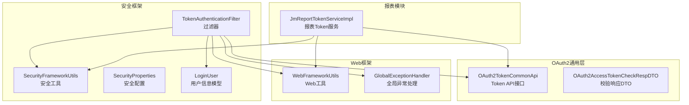
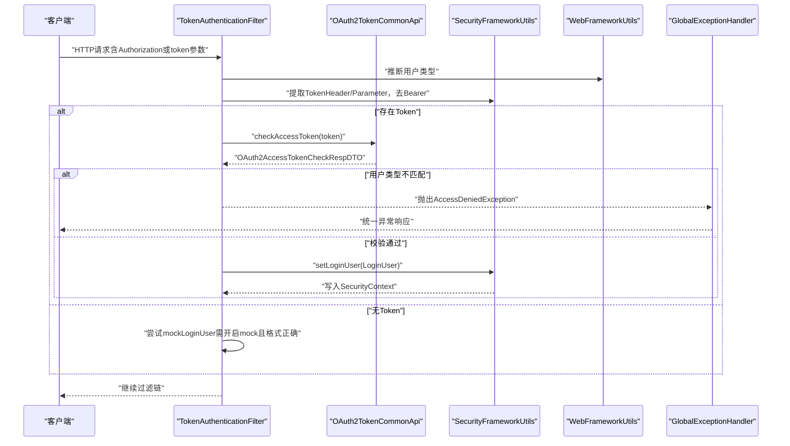
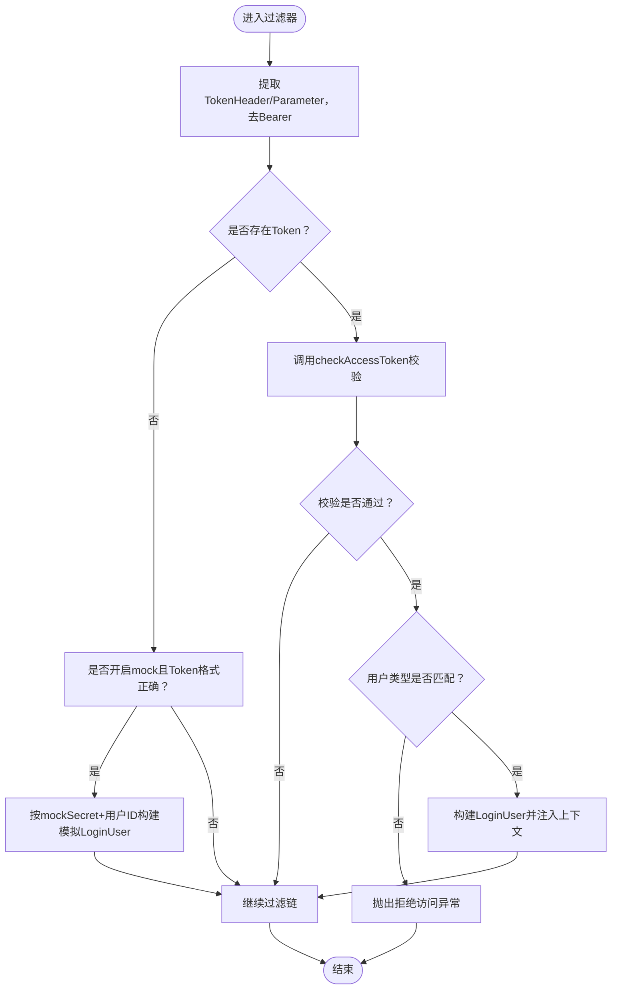
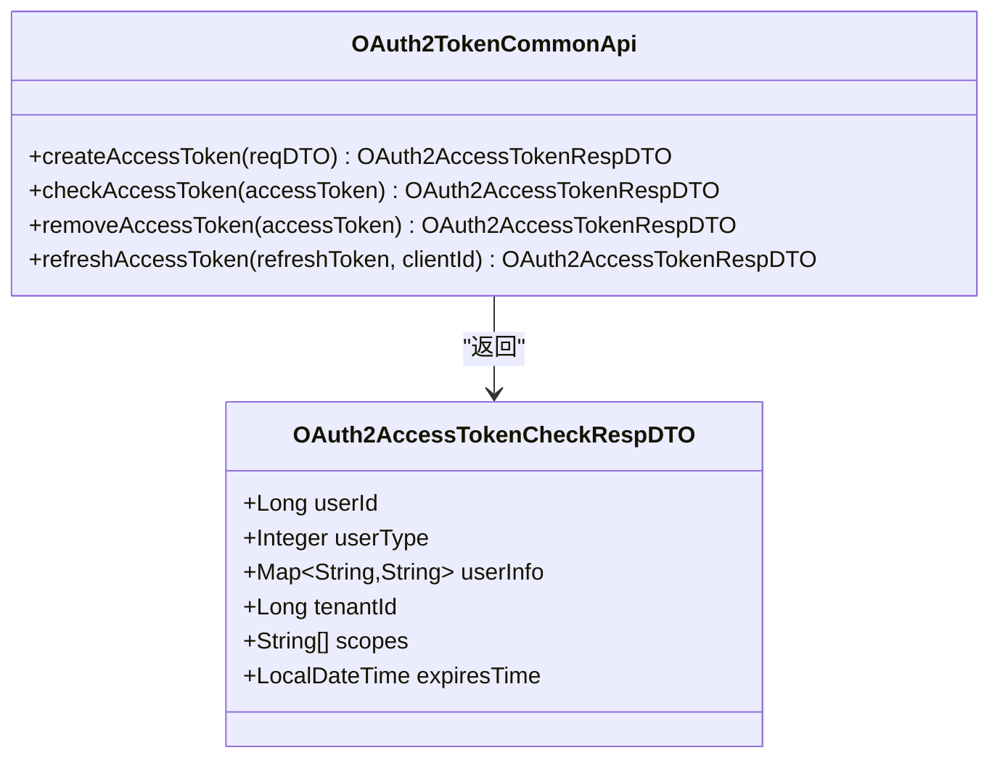
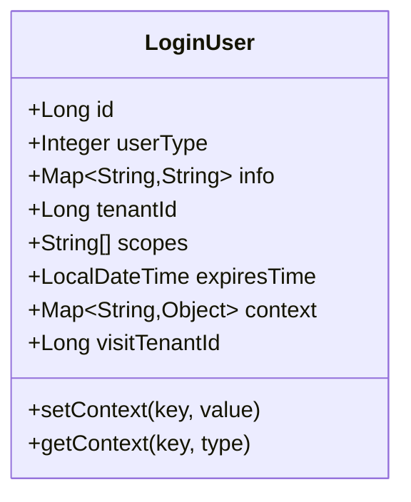
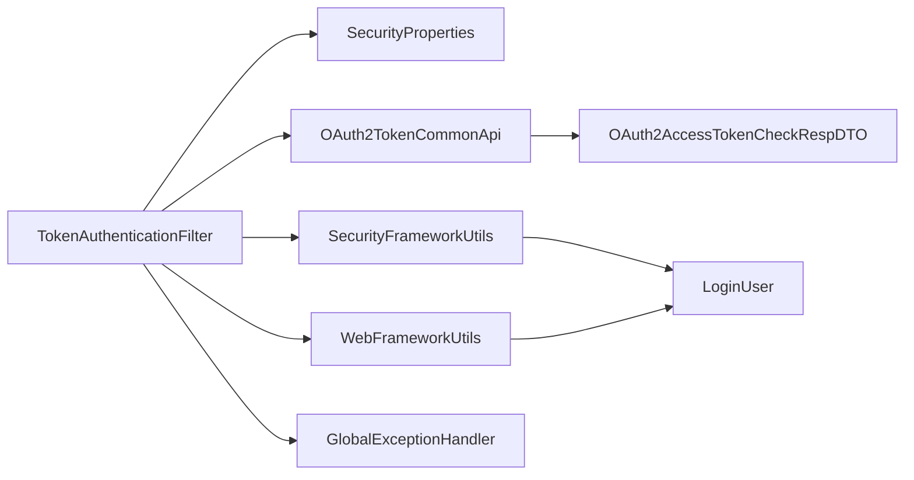

# 认证机制

<cite>
**本文引用的文件**
- [TokenAuthenticationFilter.java](file://yudao-framework/yudao-spring-boot-starter-security/src/main/java/cn/iocoder/yudao/framework/security/core/filter/TokenAuthenticationFilter.java)
- [OAuth2TokenCommonApi.java](file://yudao-framework/yudao-common/src/main/java/cn/iocoder/yudao/framework/common/biz/system/oauth2/OAuth2TokenCommonApi.java)
- [OAuth2AccessTokenCheckRespDTO.java](file://yudao-framework/yudao-common/src/main/java/cn/iocoder/yudao/framework/common/biz/system/oauth2/dto/OAuth2AccessTokenCheckRespDTO.java)
- [LoginUser.java](file://yudao-framework/yudao-spring-boot-starter-security/src/main/java/cn/iocoder/yudao/framework/security/core/LoginUser.java)
- [SecurityProperties.java](file://yudao-framework/yudao-spring-boot-starter-security/src/main/java/cn/iocoder/yudao/framework/security/config/SecurityProperties.java)
- [SecurityFrameworkUtils.java](file://yudao-framework/yudao-spring-boot-starter-security/src/main/java/cn/iocoder/yudao/framework/security/core/util/SecurityFrameworkUtils.java)
- [WebFrameworkUtils.java](file://yudao-framework/yudao-spring-boot-starter-web/src/main/java/cn/iocoder/yudao/framework/web/core/util/WebFrameworkUtils.java)
- [GlobalExceptionHandler.java](file://yudao-framework/yudao-spring-boot-starter-web/src/main/java/cn/iocoder/yudao/framework/web/core/handler/GlobalExceptionHandler.java)
- [JmReportTokenServiceImpl.java](file://yudao-module-report/src/main/java/cn/iocoder/yudao/module/report/framework/jmreport/core/service/JmReportTokenServiceImpl.java)
</cite>

## 目录
1. [简介](#简介)
2. [项目结构](#项目结构)
3. [核心组件](#核心组件)
4. [架构总览](#架构总览)
5. [详细组件分析](#详细组件分析)
6. [依赖分析](#依赖分析)
7. [性能考虑](#性能考虑)
8. [故障排查指南](#故障排查指南)
9. [结论](#结论)
10. [附录](#附录)

## 简介
本文件面向AgenticCPS系统的认证机制，围绕以下目标展开：
- 深入解析TokenAuthenticationFilter的工作原理：Token提取、验证、用户信息构建与上下文注入。
- 详解OAuth2TokenCommonApi的Token校验机制：Token有效性检查、用户类型匹配、租户ID验证等。
- 阐述LoginUser用户信息模型的结构与作用。
- 介绍模拟登录功能的实现原理与安全风险控制。
- 说明认证失败的处理机制与异常策略。
- 提供认证配置的最佳实践：Token存储、过期时间设置、刷新策略等。
- 提供认证流程的时序图与代码示例路径。

## 项目结构
认证相关能力由多个模块协作完成：
- 安全框架层：提供过滤器、工具类与配置项，负责拦截请求、提取与验证Token、构建并注入LoginUser上下文。
- Web框架层：提供全局异常处理、Web工具类（如租户头解析、用户类型推断）。
- OAuth2通用层：定义Token API接口与响应DTO，作为Token校验的抽象契约。
- 报表模块适配：在特定场景（如报表前端直连）复用Token认证逻辑，保持一致性。

**图表来源**
- [TokenAuthenticationFilter.java:1-120](file://yudao-framework/yudao-spring-boot-starter-security/src/main/java/cn/iocoder/yudao/framework/security/core/filter/TokenAuthenticationFilter.java#L1-L120)
- [OAuth2TokenCommonApi.java:1-50](file://yudao-framework/yudao-common/src/main/java/cn/iocoder/yudao/framework/common/biz/system/oauth2/OAuth2TokenCommonApi.java#L1-L50)
- [OAuth2AccessTokenCheckRespDTO.java:1-43](file://yudao-framework/yudao-common/src/main/java/cn/iocoder/yudao/framework/common/biz/system/oauth2/dto/OAuth2AccessTokenCheckRespDTO.java#L1-L43)
- [LoginUser.java:1-76](file://yudao-framework/yudao-spring-boot-starter-security/src/main/java/cn/iocoder/yudao/framework/security/core/LoginUser.java#L1-L76)
- [SecurityProperties.java:1-52](file://yudao-framework/yudao-spring-boot-starter-security/src/main/java/cn/iocoder/yudao/framework/security/config/SecurityProperties.java#L1-L52)
- [SecurityFrameworkUtils.java:1-161](file://yudao-framework/yudao-spring-boot-starter-security/src/main/java/cn/iocoder/yudao/framework/security/core/util/SecurityFrameworkUtils.java#L1-L161)
- [WebFrameworkUtils.java:1-158](file://yudao-framework/yudao-spring-boot-starter-web/src/main/java/cn/iocoder/yudao/framework/web/core/util/WebFrameworkUtils.java#L1-L158)
- [GlobalExceptionHandler.java](file://yudao-framework/yudao-spring-boot-starter-web/src/main/java/cn/iocoder/yudao/framework/web/core/handler/GlobalExceptionHandler.java)
- [JmReportTokenServiceImpl.java:102-127](file://yudao-module-report/src/main/java/cn/iocoder/yudao/module/report/framework/jmreport/core/service/JmReportTokenServiceImpl.java#L102-L127)

**章节来源**
- [TokenAuthenticationFilter.java:1-120](file://yudao-framework/yudao-spring-boot-starter-security/src/main/java/cn/iocoder/yudao/framework/security/core/filter/TokenAuthenticationFilter.java#L1-L120)
- [OAuth2TokenCommonApi.java:1-50](file://yudao-framework/yudao-common/src/main/java/cn/iocoder/yudao/framework/common/biz/system/oauth2/OAuth2TokenCommonApi.java#L1-L50)
- [OAuth2AccessTokenCheckRespDTO.java:1-43](file://yudao-framework/yudao-common/src/main/java/cn/iocoder/yudao/framework/common/biz/system/oauth2/dto/OAuth2AccessTokenCheckRespDTO.java#L1-L43)
- [LoginUser.java:1-76](file://yudao-framework/yudao-spring-boot-starter-security/src/main/java/cn/iocoder/yudao/framework/security/core/LoginUser.java#L1-L76)
- [SecurityProperties.java:1-52](file://yudao-framework/yudao-spring-boot-starter-security/src/main/java/cn/iocoder/yudao/framework/security/config/SecurityProperties.java#L1-L52)
- [SecurityFrameworkUtils.java:1-161](file://yudao-framework/yudao-spring-boot-starter-security/src/main/java/cn/iocoder/yudao/framework/security/core/util/SecurityFrameworkUtils.java#L1-L161)
- [WebFrameworkUtils.java:1-158](file://yudao-framework/yudao-spring-boot-starter-web/src/main/java/cn/iocoder/yudao/framework/web/core/util/WebFrameworkUtils.java#L1-L158)
- [GlobalExceptionHandler.java](file://yudao-framework/yudao-spring-boot-starter-web/src/main/java/cn/iocoder/yudao/framework/web/core/handler/GlobalExceptionHandler.java)
- [JmReportTokenServiceImpl.java:102-127](file://yudao-module-report/src/main/java/cn/iocoder/yudao/module/report/framework/jmreport/core/service/JmReportTokenServiceImpl.java#L102-L127)

## 核心组件
- TokenAuthenticationFilter：请求拦截器，负责从请求中提取Token，调用OAuth2TokenCommonApi进行校验，构建LoginUser并注入Spring Security上下文；支持模拟登录模式。
- OAuth2TokenCommonApi：Token校验的抽象接口，定义创建、校验、移除、刷新访问令牌的方法。
- OAuth2AccessTokenCheckRespDTO：Token校验响应的数据传输对象，包含userId、userType、userInfo、tenantId、scopes、expiresTime等。
- LoginUser：登录用户信息模型，承载用户标识、类型、额外信息、租户、授权范围、过期时间及上下文缓存字段。
- SecurityProperties：安全配置，包括Token请求头、参数名、免登录URL列表、mock开关与密钥等。
- SecurityFrameworkUtils：安全工具类，负责从请求中提取Token、获取/设置当前认证信息、构建Authentication等。
- WebFrameworkUtils：Web工具类，负责从Header解析租户ID、访问租户ID、推断用户类型、设置/获取登录用户信息等。
- GlobalExceptionHandler：全局异常处理器，统一捕获异常并输出标准响应。
- JmReportTokenServiceImpl：报表模块的Token服务实现，复用Token认证逻辑，确保报表前端也能基于Token鉴权。

**章节来源**
- [TokenAuthenticationFilter.java:25-120](file://yudao-framework/yudao-spring-boot-starter-security/src/main/java/cn/iocoder/yudao/framework/security/core/filter/TokenAuthenticationFilter.java#L25-L120)
- [OAuth2TokenCommonApi.java:9-50](file://yudao-framework/yudao-common/src/main/java/cn/iocoder/yudao/framework/common/biz/system/oauth2/OAuth2TokenCommonApi.java#L9-L50)
- [OAuth2AccessTokenCheckRespDTO.java:10-43](file://yudao-framework/yudao-common/src/main/java/cn/iocoder/yudao/framework/common/biz/system/oauth2/dto/OAuth2AccessTokenCheckRespDTO.java#L10-L43)
- [LoginUser.java:13-76](file://yudao-framework/yudao-spring-boot-starter-security/src/main/java/cn/iocoder/yudao/framework/security/core/LoginUser.java#L13-L76)
- [SecurityProperties.java:12-52](file://yudao-framework/yudao-spring-boot-starter-security/src/main/java/cn/iocoder/yudao/framework/security/config/SecurityProperties.java#L12-L52)
- [SecurityFrameworkUtils.java:19-161](file://yudao-framework/yudao-spring-boot-starter-security/src/main/java/cn/iocoder/yudao/framework/security/core/util/SecurityFrameworkUtils.java#L19-L161)
- [WebFrameworkUtils.java:14-158](file://yudao-framework/yudao-spring-boot-starter-web/src/main/java/cn/iocoder/yudao/framework/web/core/util/WebFrameworkUtils.java#L14-L158)
- [GlobalExceptionHandler.java](file://yudao-framework/yudao-spring-boot-starter-web/src/main/java/cn/iocoder/yudao/framework/web/core/handler/GlobalExceptionHandler.java)
- [JmReportTokenServiceImpl.java:102-127](file://yudao-module-report/src/main/java/cn/iocoder/yudao/module/report/framework/jmreport/core/service/JmReportTokenServiceImpl.java#L102-L127)

## 架构总览
认证流程在请求进入业务控制器之前执行，核心步骤如下：
- 提取Token：优先从Header获取，其次从URL参数获取，并去除“Bearer ”前缀。
- 校验Token：调用OAuth2TokenCommonApi.checkAccessToken，得到Token校验响应DTO。
- 用户类型匹配：若请求路径约定的用户类型存在且与Token中的userType不一致，则拒绝访问。
- 构建LoginUser：填充id、userType、userInfo、tenantId、scopes、expiresTime等。
- 注入上下文：将LoginUser封装为Authentication并写入SecurityContext，同时写入Web上下文便于后续日志与权限处理。
- 模拟登录：当Token为空或无效时，若开启mock且Token符合规则，则按mockSecret+用户ID构造模拟用户。
- 异常处理：任何异常交由GlobalExceptionHandler统一处理并返回标准结果。

**图表来源**
- [TokenAuthenticationFilter.java:40-117](file://yudao-framework/yudao-spring-boot-starter-security/src/main/java/cn/iocoder/yudao/framework/security/core/filter/TokenAuthenticationFilter.java#L40-L117)
- [SecurityFrameworkUtils.java:33-133](file://yudao-framework/yudao-spring-boot-starter-security/src/main/java/cn/iocoder/yudao/framework/security/core/util/SecurityFrameworkUtils.java#L33-L133)
- [WebFrameworkUtils.java:101-118](file://yudao-framework/yudao-spring-boot-starter-web/src/main/java/cn/iocoder/yudao/framework/web/core/util/WebFrameworkUtils.java#L101-L118)
- [OAuth2TokenCommonApi.java:24-30](file://yudao-framework/yudao-common/src/main/java/cn/iocoder/yudao/framework/common/biz/system/oauth2/OAuth2TokenCommonApi.java#L24-L30)
- [GlobalExceptionHandler.java](file://yudao-framework/yudao-spring-boot-starter-web/src/main/java/cn/iocoder/yudao/framework/web/core/handler/GlobalExceptionHandler.java)

## 详细组件分析

### TokenAuthenticationFilter工作原理
- Token提取：优先从Header（默认名为Authorization）获取，其次从URL参数（默认名为token）获取；若存在“Bearer ”前缀则去除。
- 用户类型推断：根据请求路径前缀自动推断用户类型（如/admin-api/*对应管理员，/app-api/*对应会员），WebSocket等特殊路径不参与类型校验。
- 校验与构建：调用OAuth2TokenCommonApi.checkAccessToken获取响应DTO，若userType与请求类型不一致则拒绝；成功后构建LoginUser并注入上下文。
- 模拟登录：当未开启mock或Token不符合规则时跳过；开启mock且Token以mockSecret开头时，按“mockSecret+用户ID”解析模拟用户。
- 异常处理：捕获任意异常，交由GlobalExceptionHandler统一转为JSON响应并终止后续过滤链。

**图表来源**
- [TokenAuthenticationFilter.java:40-117](file://yudao-framework/yudao-spring-boot-starter-security/src/main/java/cn/iocoder/yudao/framework/security/core/filter/TokenAuthenticationFilter.java#L40-L117)
- [SecurityFrameworkUtils.java:33-54](file://yudao-framework/yudao-spring-boot-starter-security/src/main/java/cn/iocoder/yudao/framework/security/core/util/SecurityFrameworkUtils.java#L33-L54)
- [WebFrameworkUtils.java:101-118](file://yudao-framework/yudao-spring-boot-starter-web/src/main/java/cn/iocoder/yudao/framework/web/core/util/WebFrameworkUtils.java#L101-L118)

**章节来源**
- [TokenAuthenticationFilter.java:40-117](file://yudao-framework/yudao-spring-boot-starter-security/src/main/java/cn/iocoder/yudao/framework/security/core/filter/TokenAuthenticationFilter.java#L40-L117)
- [SecurityFrameworkUtils.java:33-54](file://yudao-framework/yudao-spring-boot-starter-security/src/main/java/cn/iocoder/yudao/framework/security/core/util/SecurityFrameworkUtils.java#L33-L54)
- [WebFrameworkUtils.java:101-118](file://yudao-framework/yudao-spring-boot-starter-web/src/main/java/cn/iocoder/yudao/framework/web/core/util/WebFrameworkUtils.java#L101-L118)

### OAuth2TokenCommonApi的Token校验机制
- 接口职责：定义创建、校验、移除、刷新访问令牌的标准方法，屏蔽具体实现细节。
- 校验响应DTO：包含userId、userType、userInfo、tenantId、scopes、expiresTime等关键字段，用于构建LoginUser与后续鉴权。
- 错误处理：当Token无效或过期时，OAuth2TokenCommonApi实现应抛出ServiceException，上层捕获后返回null，允许走模拟登录或放行。

**图表来源**
- [OAuth2TokenCommonApi.java:9-50](file://yudao-framework/yudao-common/src/main/java/cn/iocoder/yudao/framework/common/biz/system/oauth2/OAuth2TokenCommonApi.java#L9-L50)
- [OAuth2AccessTokenCheckRespDTO.java:10-43](file://yudao-framework/yudao-common/src/main/java/cn/iocoder/yudao/framework/common/biz/system/oauth2/dto/OAuth2AccessTokenCheckRespDTO.java#L10-L43)

**章节来源**
- [OAuth2TokenCommonApi.java:9-50](file://yudao-framework/yudao-common/src/main/java/cn/iocoder/yudao/framework/common/biz/system/oauth2/OAuth2TokenCommonApi.java#L9-L50)
- [OAuth2AccessTokenCheckRespDTO.java:10-43](file://yudao-framework/yudao-common/src/main/java/cn/iocoder/yudao/framework/common/biz/system/oauth2/dto/OAuth2AccessTokenCheckRespDTO.java#L10-L43)

### LoginUser用户信息模型
- 字段说明：id、userType、info（额外用户信息）、tenantId、scopes、expiresTime；以及上下文缓存context与visitTenantId。
- 用途：作为认证后的用户主体，贯穿权限校验、日志记录、租户隔离等环节；支持在LoginUser维度做临时缓存。
- 扩展性：info中可存放昵称、部门ID等扩展字段，便于在工具类中便捷获取。

**图表来源**
- [LoginUser.java:13-76](file://yudao-framework/yudao-spring-boot-starter-security/src/main/java/cn/iocoder/yudao/framework/security/core/LoginUser.java#L13-L76)

**章节来源**
- [LoginUser.java:13-76](file://yudao-framework/yudao-spring-boot-starter-security/src/main/java/cn/iocoder/yudao/framework/security/core/LoginUser.java#L13-L76)

### 模拟登录功能实现与安全风险控制
- 实现原理：当未开启mock或Token格式不符时，直接跳过；开启mock且Token以mockSecret开头时，按“mockSecret+用户ID”解析模拟用户，租户ID继承自请求头。
- 安全风险控制：
  - 默认关闭mock，避免生产环境误用。
  - mockSecret必须配置且足够复杂，防止被猜测。
  - 仅在开发/测试环境启用，生产务必关闭。
- 使用场景：本地调试、离线报表直连等需要快速模拟用户身份的场景。

**章节来源**
- [TokenAuthenticationFilter.java:95-117](file://yudao-framework/yudao-spring-boot-starter-security/src/main/java/cn/iocoder/yudao/framework/security/core/filter/TokenAuthenticationFilter.java#L95-L117)
- [SecurityProperties.java:30-41](file://yudao-framework/yudao-spring-boot-starter-security/src/main/java/cn/iocoder/yudao/framework/security/config/SecurityProperties.java#L30-L41)

### 认证失败处理与异常策略
- 过滤器内捕获所有异常，交由GlobalExceptionHandler统一处理，输出标准化响应，避免泄露内部异常细节。
- 对于Token无效或过期的情况，OAuth2TokenCommonApi实现抛出ServiceException，上层捕获后返回null，允许走模拟登录或放行。
- 用户类型不匹配时抛出AccessDeniedException，确保越权访问被拒绝。

**章节来源**
- [TokenAuthenticationFilter.java:60-64](file://yudao-framework/yudao-spring-boot-starter-security/src/main/java/cn/iocoder/yudao/framework/security/core/filter/TokenAuthenticationFilter.java#L60-L64)
- [GlobalExceptionHandler.java](file://yudao-framework/yudao-spring-boot-starter-web/src/main/java/cn/iocoder/yudao/framework/web/core/handler/GlobalExceptionHandler.java)

### 报表模块的Token认证复用
- 场景：报表前端直连后端时，同样需要基于Token进行认证。
- 实现：JmReportTokenServiceImpl在忽略租户的前提下调用OAuth2TokenCommonApi.checkAccessToken，构建LoginUser并注入上下文，复用安全框架的认证逻辑。

**章节来源**
- [JmReportTokenServiceImpl.java:102-127](file://yudao-module-report/src/main/java/cn/iocoder/yudao/module/report/framework/jmreport/core/service/JmReportTokenServiceImpl.java#L102-L127)

## 依赖分析
- 组件耦合：
  - TokenAuthenticationFilter依赖SecurityProperties（配置）、OAuth2TokenCommonApi（校验）、SecurityFrameworkUtils（上下文）、WebFrameworkUtils（用户类型推断）、GlobalExceptionHandler（异常）。
  - OAuth2TokenCommonApi与OAuth2AccessTokenCheckRespDTO解耦，便于替换不同Token实现。
  - LoginUser作为横切数据载体，被多处工具类与过滤器使用。
- 外部集成点：
  - WebFrameworkUtils依赖WebProperties推断用户类型（基于URL前缀）。
  - SecurityFrameworkUtils依赖Spring Security的SecurityContextHolder进行上下文操作。

**图表来源**
- [TokenAuthenticationFilter.java:34-38](file://yudao-framework/yudao-spring-boot-starter-security/src/main/java/cn/iocoder/yudao/framework/security/core/filter/TokenAuthenticationFilter.java#L34-L38)
- [OAuth2TokenCommonApi.java:9-50](file://yudao-framework/yudao-common/src/main/java/cn/iocoder/yudao/framework/common/biz/system/oauth2/OAuth2TokenCommonApi.java#L9-L50)
- [OAuth2AccessTokenCheckRespDTO.java:10-43](file://yudao-framework/yudao-common/src/main/java/cn/iocoder/yudao/framework/common/biz/system/oauth2/dto/OAuth2AccessTokenCheckRespDTO.java#L10-L43)
- [LoginUser.java:13-76](file://yudao-framework/yudao-spring-boot-starter-security/src/main/java/cn/iocoder/yudao/framework/security/core/LoginUser.java#L13-L76)
- [SecurityFrameworkUtils.java:19-161](file://yudao-framework/yudao-spring-boot-starter-security/src/main/java/cn/iocoder/yudao/framework/security/core/util/SecurityFrameworkUtils.java#L19-L161)
- [WebFrameworkUtils.java:14-158](file://yudao-framework/yudao-spring-boot-starter-web/src/main/java/cn/iocoder/yudao/framework/web/core/util/WebFrameworkUtils.java#L14-L158)
- [GlobalExceptionHandler.java](file://yudao-framework/yudao-spring-boot-starter-web/src/main/java/cn/iocoder/yudao/framework/web/core/handler/GlobalExceptionHandler.java)

**章节来源**
- [TokenAuthenticationFilter.java:34-38](file://yudao-framework/yudao-spring-boot-starter-security/src/main/java/cn/iocoder/yudao/framework/security/core/filter/TokenAuthenticationFilter.java#L34-L38)
- [OAuth2TokenCommonApi.java:9-50](file://yudao-framework/yudao-common/src/main/java/cn/iocoder/yudao/framework/common/biz/system/oauth2/OAuth2TokenCommonApi.java#L9-L50)
- [OAuth2AccessTokenCheckRespDTO.java:10-43](file://yudao-framework/yudao-common/src/main/java/cn/iocoder/yudao/framework/common/biz/system/oauth2/dto/OAuth2AccessTokenCheckRespDTO.java#L10-L43)
- [LoginUser.java:13-76](file://yudao-framework/yudao-spring-boot-starter-security/src/main/java/cn/iocoder/yudao/framework/security/core/LoginUser.java#L13-L76)
- [SecurityFrameworkUtils.java:19-161](file://yudao-framework/yudao-spring-boot-starter-security/src/main/java/cn/iocoder/yudao/framework/security/core/util/SecurityFrameworkUtils.java#L19-L161)
- [WebFrameworkUtils.java:14-158](file://yudao-framework/yudao-spring-boot-starter-web/src/main/java/cn/iocoder/yudao/framework/web/core/util/WebFrameworkUtils.java#L14-L158)
- [GlobalExceptionHandler.java](file://yudao-framework/yudao-spring-boot-starter-web/src/main/java/cn/iocoder/yudao/framework/web/core/handler/GlobalExceptionHandler.java)

## 性能考虑
- Token提取与校验：提取逻辑简单，校验依赖外部OAuth2服务；建议在网关层或上游缓存热点Token，减少重复校验。
- 模拟登录：仅在开发环境启用，避免生产环境不必要的分支判断。
- 上下文注入：SecurityContext写入与Web上下文设置成本较低，但应避免在高频路径中频繁创建LoginUser对象。
- 异常处理：统一异常处理避免了重复序列化开销，建议保持现有策略。

## 故障排查指南
- 无法获取用户类型：确认请求路径是否命中/admin-api或/app-api前缀，或检查WebFrameworkUtils的用户类型推断逻辑。
- Token无效或过期：检查OAuth2TokenCommonApi实现与外部Token服务状态；查看ServiceException是否被捕获并返回null。
- 用户类型不匹配：核对请求路径与Token中的userType是否一致；WebSocket等特殊路径不参与类型校验。
- 模拟登录不生效：确认SecurityProperties.mockEnable为true且mockSecret配置正确；确保Token格式为“mockSecret+用户ID”。
- 全局异常未生效：检查GlobalExceptionHandler是否注册并覆盖了相应异常类型。

**章节来源**
- [WebFrameworkUtils.java:101-118](file://yudao-framework/yudao-spring-boot-starter-web/src/main/java/cn/iocoder/yudao/framework/web/core/util/WebFrameworkUtils.java#L101-L118)
- [TokenAuthenticationFilter.java:78-83](file://yudao-framework/yudao-spring-boot-starter-security/src/main/java/cn/iocoder/yudao/framework/security/core/filter/TokenAuthenticationFilter.java#L78-L83)
- [SecurityProperties.java:30-41](file://yudao-framework/yudao-spring-boot-starter-security/src/main/java/cn/iocoder/yudao/framework/security/config/SecurityProperties.java#L30-L41)
- [GlobalExceptionHandler.java](file://yudao-framework/yudao-spring-boot-starter-web/src/main/java/cn/iocoder/yudao/framework/web/core/handler/GlobalExceptionHandler.java)

## 结论
AgenticCPS的认证机制以TokenAuthenticationFilter为核心，结合OAuth2TokenCommonApi与LoginUser模型，形成“提取—校验—构建—注入”的闭环。通过SecurityProperties与WebFrameworkUtils提供灵活配置与上下文支持，配合GlobalExceptionHandler实现统一异常处理。模拟登录功能仅限开发环境使用，确保生产安全。整体设计具备良好的扩展性与可维护性。

## 附录
- 配置最佳实践（摘要）：
  - Token请求头与参数：建议使用Authorization与token参数，确保前后端一致。
  - 免登录URL：将公开接口加入permitAllUrls，减少不必要的校验。
  - mock开关与密钥：生产环境必须关闭mock；若开启，mockSecret需复杂且保密。
  - 租户ID：通过Header传递tenant-id与visit-tenant-id，确保跨租户访问可控。
  - Token存储与过期：建议采用Redis等高性能存储，合理设置过期时间与刷新策略。
  - 刷新策略：在OAuth2TokenCommonApi中提供refreshAccessToken接口，结合业务需求实现静默刷新。

**章节来源**
- [SecurityProperties.java:17-45](file://yudao-framework/yudao-spring-boot-starter-security/src/main/java/cn/iocoder/yudao/framework/security/config/SecurityProperties.java#L17-L45)
- [WebFrameworkUtils.java:26-64](file://yudao-framework/yudao-spring-boot-starter-web/src/main/java/cn/iocoder/yudao/framework/web/core/util/WebFrameworkUtils.java#L26-L64)
- [OAuth2TokenCommonApi.java:41-47](file://yudao-framework/yudao-common/src/main/java/cn/iocoder/yudao/framework/common/biz/system/oauth2/OAuth2TokenCommonApi.java#L41-L47)