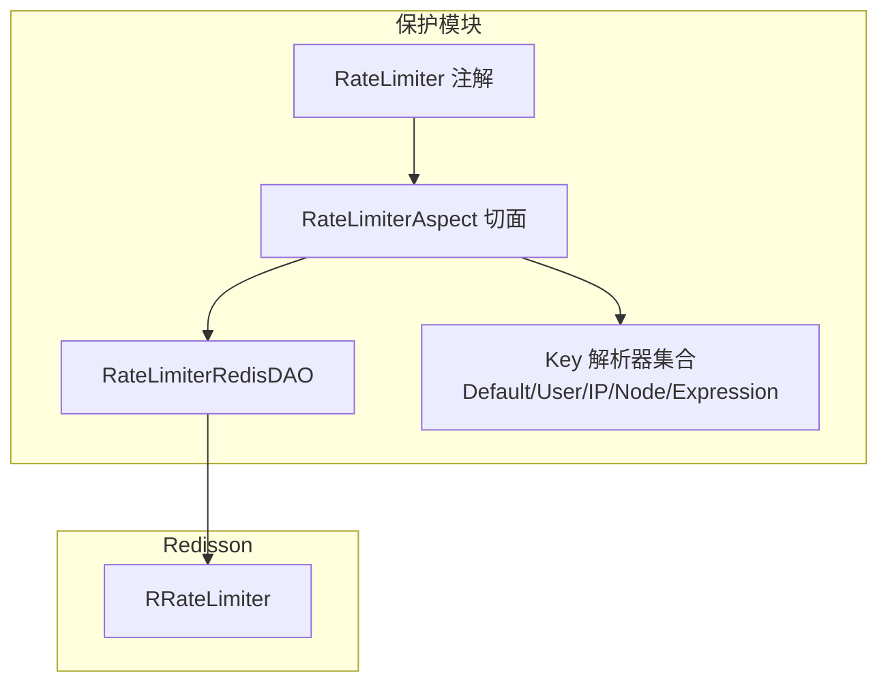
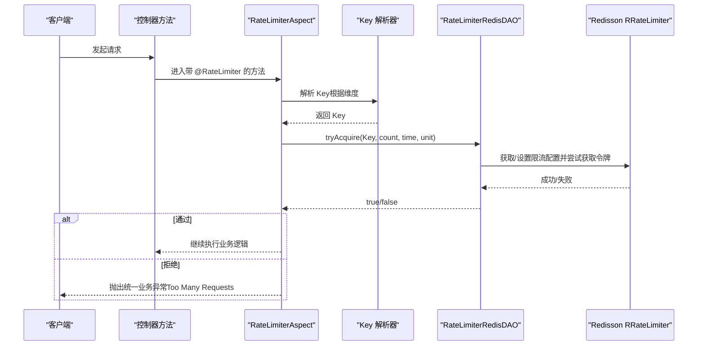
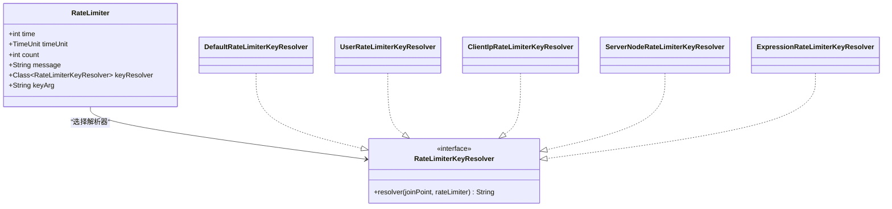
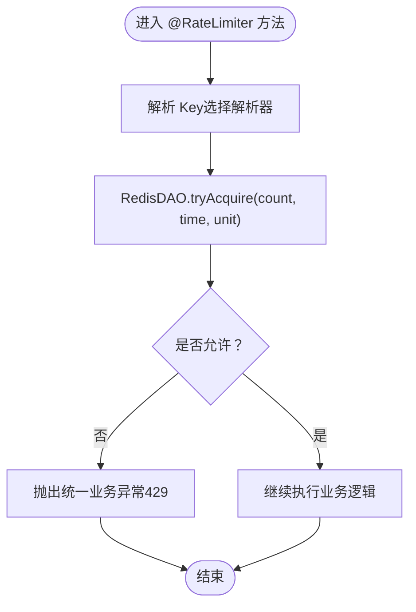
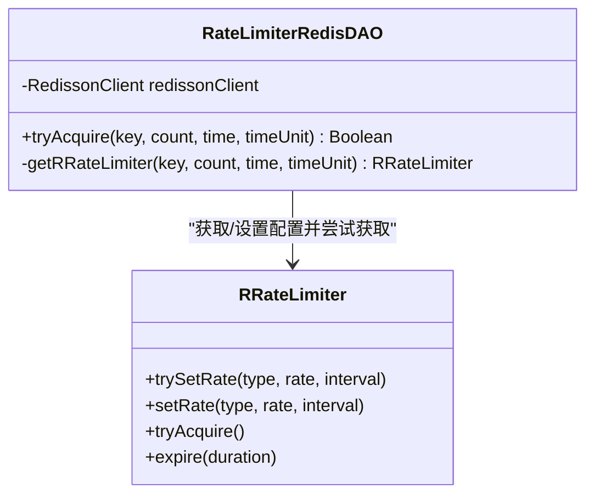
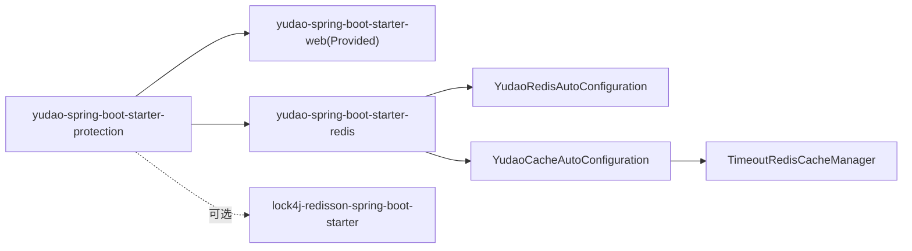

# 请求频率限制

<cite>
**本文引用的文件**   
- [RateLimiter.java](file://yudao-framework/yudao-spring-boot-starter-protection/src/main/java/cn/iocoder/yudao/framework/ratelimiter/core/annotation/RateLimiter.java)
- [RateLimiterAspect.java](file://yudao-framework/yudao-spring-boot-starter-protection/src/main/java/cn/iocoder/yudao/framework/ratelimiter/core/aop/RateLimiterAspect.java)
- [RateLimiterRedisDAO.java](file://yudao-framework/yudao-spring-boot-starter-protection/src/main/java/cn/iocoder/yudao/framework/ratelimiter/core/redis/RateLimiterRedisDAO.java)
- [YudaoRateLimiterConfiguration.java](file://yudao-framework/yudao-spring-boot-starter-protection/src/main/java/cn/iocoder/yudao/framework/ratelimiter/config/YudaoRateLimiterConfiguration.java)
- [RateLimiterKeyResolver.java](file://yudao-framework/yudao-spring-boot-starter-protection/src/main/java/cn/iocoder/yudao/framework/ratelimiter/core/keyresolver/RateLimiterKeyResolver.java)
- [DefaultRateLimiterKeyResolver.java](file://yudao-framework/yudao-spring-boot-starter-protection/src/main/java/cn/iocoder/yudao/framework/ratelimiter/core/keyresolver/impl/DefaultRateLimiterKeyResolver.java)
- [UserRateLimiterKeyResolver.java](file://yudao-framework/yudao-spring-boot-starter-protection/src/main/java/cn/iocoder/yudao/framework/ratelimiter/core/keyresolver/impl/UserRateLimiterKeyResolver.java)
- [ClientIpRateLimiterKeyResolver.java](file://yudao-framework/yudao-spring-boot-starter-protection/src/main/java/cn/iocoder/yudao/framework/ratelimiter/core/keyresolver/impl/ClientIpRateLimiterKeyResolver.java)
- [ServerNodeRateLimiterKeyResolver.java](file://yudao-framework/yudao-spring-boot-starter-protection/src/main/java/cn/iocoder/yudao/framework/ratelimiter/core/keyresolver/impl/ServerNodeRateLimiterKeyResolver.java)
- [ExpressionRateLimiterKeyResolver.java](file://yudao-framework/yudao-spring-boot-starter-protection/src/main/java/cn/iocoder/yudao/framework/ratelimiter/core/keyresolver/impl/ExpressionRateLimiterKeyResolver.java)
- [GlobalErrorCodeConstants.java](file://yudao-framework/yudao-common/src/main/java/cn/iocoder/yudao/framework/common/exception/enums/GlobalErrorCodeConstants.java)
- [YudaoRedisAutoConfiguration.java](file://yudao-framework/yudao-spring-boot-starter-redis/src/main/java/cn/iocoder/yudao/framework/redis/config/YudaoRedisAutoConfiguration.java)
- [YudaoCacheAutoConfiguration.java](file://yudao-framework/yudao-spring-boot-starter-redis/src/main/java/cn/iocoder/yudao/framework/redis/config/YudaoCacheAutoConfiguration.java)
- [TimeoutRedisCacheManager.java](file://yudao-framework/yudao-spring-boot-starter-redis/src/main/java/cn/iocoder/yudao/framework/redis/core/TimeoutRedisCacheManager.java)
- [RedisTestConfiguration.java](file://yudao-framework/yudao-spring-boot-starter-test/src/main/java/cn/iocoder/yudao/framework/test/config/RedisTestConfiguration.java)
- [pom.xml（保护模块）](file://yudao-framework/yudao-spring-boot-starter-protection/pom.xml)
</cite>

## 目录
1. [简介](#简介)
2. [项目结构](#项目结构)
3. [核心组件](#核心组件)
4. [架构总览](#架构总览)
5. [详细组件分析](#详细组件分析)
6. [依赖分析](#依赖分析)
7. [性能考虑](#性能考虑)
8. [故障排查指南](#故障排查指南)
9. [结论](#结论)
10. [附录](#附录)

## 简介
本文件面向 AgenticCPS 系统的请求频率限制（Rate Limiting）机制，围绕限流算法与实现进行系统化说明。当前系统采用基于 Redisson 的 RRateLimiter 实现，本质为令牌桶算法的分布式版本，具备以下特点：
- 基于 Redis 的全局一致性，适合多实例部署下的统一限流
- 支持按时间窗口与速率配置，动态设置与过期管理
- 通过 AOP 在方法级进行拦截，实现零侵入式限流

同时，文档还覆盖限流维度设计（全局、用户、IP、节点、表达式）、配置参数、异常处理与错误码、最佳实践及监控建议。

## 项目结构
限流相关代码集中在 protection 模块中，采用注解 + AOP + Redisson 的分层设计：
- 注解层：定义限流规则与维度
- AOP 层：拦截目标方法，解析 Key，调用限流
- Redis 层：基于 Redisson 的 RRateLimiter 执行限流
- 配置层：装配切面、DAO 与 Key 解析器 Bean

图表来源
- [YudaoRateLimiterConfiguration.java:14-55](file://yudao-framework/yudao-spring-boot-starter-protection/src/main/java/cn/iocoder/yudao/framework/ratelimiter/config/YudaoRateLimiterConfiguration.java#L14-L55)
- [RateLimiter.java:22-62](file://yudao-framework/yudao-spring-boot-starter-protection/src/main/java/cn/iocoder/yudao/framework/ratelimiter/core/annotation/RateLimiter.java#L22-L62)
- [RateLimiterAspect.java:24-59](file://yudao-framework/yudao-spring-boot-starter-protection/src/main/java/cn/iocoder/yudao/framework/ratelimiter/core/aop/RateLimiterAspect.java#L24-L59)
- [RateLimiterRedisDAO.java:15-66](file://yudao-framework/yudao-spring-boot-starter-protection/src/main/java/cn/iocoder/yudao/framework/ratelimiter/core/redis/RateLimiterRedisDAO.java#L15-L66)

章节来源
- [YudaoRateLimiterConfiguration.java:14-55](file://yudao-framework/yudao-spring-boot-starter-protection/src/main/java/cn/iocoder/yudao/framework/ratelimiter/config/YudaoRateLimiterConfiguration.java#L14-L55)
- [RateLimiter.java:22-62](file://yudao-framework/yudao-spring-boot-starter-protection/src/main/java/cn/iocoder/yudao/framework/ratelimiter/core/annotation/RateLimiter.java#L22-L62)

## 核心组件
- 限流注解：定义时间窗口、速率、提示信息、Key 解析器与表达式参数
- AOP 切面：解析 Key、调用 RedisDAO、失败抛出业务异常
- RedisDAO：封装 Redisson RRateLimiter 的 tryAcquire 与配置更新
- Key 解析器：提供全局、用户、IP、节点、表达式等多维粒度的 Key 生成策略
- 配置类：注册切面、DAO 与各类 Key 解析器 Bean

章节来源
- [RateLimiter.java:22-62](file://yudao-framework/yudao-spring-boot-starter-protection/src/main/java/cn/iocoder/yudao/framework/ratelimiter/core/annotation/RateLimiter.java#L22-L62)
- [RateLimiterAspect.java:24-59](file://yudao-framework/yudao-spring-boot-starter-protection/src/main/java/cn/iocoder/yudao/framework/ratelimiter/core/aop/RateLimiterAspect.java#L24-L59)
- [RateLimiterRedisDAO.java:15-66](file://yudao-framework/yudao-spring-boot-starter-protection/src/main/java/cn/iocoder/yudao/framework/ratelimiter/core/redis/RateLimiterRedisDAO.java#L15-L66)
- [YudaoRateLimiterConfiguration.java:14-55](file://yudao-framework/yudao-spring-boot-starter-protection/src/main/java/cn/iocoder/yudao/framework/ratelimiter/config/YudaoRateLimiterConfiguration.java#L14-L55)

## 架构总览
限流流程从方法调用开始，经由 AOP 切面拦截，解析 Key，再通过 RedisDAO 调用 Redisson 的 RRateLimiter 执行限流判断；若超过阈值则抛出统一业务异常。

图表来源
- [RateLimiterAspect.java:40-57](file://yudao-framework/yudao-spring-boot-starter-protection/src/main/java/cn/iocoder/yudao/framework/ratelimiter/core/aop/RateLimiterAspect.java#L40-L57)
- [RateLimiterRedisDAO.java:29-34](file://yudao-framework/yudao-spring-boot-starter-protection/src/main/java/cn/iocoder/yudao/framework/ratelimiter/core/redis/RateLimiterRedisDAO.java#L29-L34)
- [DefaultRateLimiterKeyResolver.java:18-23](file://yudao-framework/yudao-spring-boot-starter-protection/src/main/java/cn/iocoder/yudao/framework/ratelimiter/core/keyresolver/impl/DefaultRateLimiterKeyResolver.java#L18-L23)

## 详细组件分析

### 限流注解与维度
- 时间窗口与速率：通过 time、timeUnit、count 控制每 N 单位时间内最多 Q 次请求
- 提示信息：message 为空时使用统一错误码提示
- Key 解析器：支持默认（方法签名+参数）、用户（含用户标识）、IP（客户端 IP）、节点（主机+进程）、表达式（SPeL 动态计算）

图表来源
- [RateLimiter.java:22-62](file://yudao-framework/yudao-spring-boot-starter-protection/src/main/java/cn/iocoder/yudao/framework/ratelimiter/core/annotation/RateLimiter.java#L22-L62)
- [RateLimiterKeyResolver.java:11-22](file://yudao-framework/yudao-spring-boot-starter-protection/src/main/java/cn/iocoder/yudao/framework/ratelimiter/core/keyresolver/RateLimiterKeyResolver.java#L11-L22)
- [DefaultRateLimiterKeyResolver.java:16-25](file://yudao-framework/yudao-spring-boot-starter-protection/src/main/java/cn/iocoder/yudao/framework/ratelimiter/core/keyresolver/impl/DefaultRateLimiterKeyResolver.java#L16-L25)
- [UserRateLimiterKeyResolver.java:17-28](file://yudao-framework/yudao-spring-boot-starter-protection/src/main/java/cn/iocoder/yudao/framework/ratelimiter/core/keyresolver/impl/UserRateLimiterKeyResolver.java#L17-L28)
- [ClientIpRateLimiterKeyResolver.java:17-27](file://yudao-framework/yudao-spring-boot-starter-protection/src/main/java/cn/iocoder/yudao/framework/ratelimiter/core/keyresolver/impl/ClientIpRateLimiterKeyResolver.java#L17-L27)
- [ServerNodeRateLimiterKeyResolver.java:17-26](file://yudao-framework/yudao-spring-boot-starter-protection/src/main/java/cn/iocoder/yudao/framework/ratelimiter/core/keyresolver/impl/ServerNodeRateLimiterKeyResolver.java#L17-L26)
- [ExpressionRateLimiterKeyResolver.java:22-64](file://yudao-framework/yudao-spring-boot-starter-protection/src/main/java/cn/iocoder/yudao/framework/ratelimiter/core/keyresolver/impl/ExpressionRateLimiterKeyResolver.java#L22-L64)

章节来源
- [RateLimiter.java:22-62](file://yudao-framework/yudao-spring-boot-starter-protection/src/main/java/cn/iocoder/yudao/framework/ratelimiter/core/annotation/RateLimiter.java#L22-L62)
- [DefaultRateLimiterKeyResolver.java:16-25](file://yudao-framework/yudao-spring-boot-starter-protection/src/main/java/cn/iocoder/yudao/framework/ratelimiter/core/keyresolver/impl/DefaultRateLimiterKeyResolver.java#L16-L25)
- [UserRateLimiterKeyResolver.java:17-28](file://yudao-framework/yudao-spring-boot-starter-protection/src/main/java/cn/iocoder/yudao/framework/ratelimiter/core/keyresolver/impl/UserRateLimiterKeyResolver.java#L17-L28)
- [ClientIpRateLimiterKeyResolver.java:17-27](file://yudao-framework/yudao-spring-boot-starter-protection/src/main/java/cn/iocoder/yudao/framework/ratelimiter/core/keyresolver/impl/ClientIpRateLimiterKeyResolver.java#L17-L27)
- [ServerNodeRateLimiterKeyResolver.java:17-26](file://yudao-framework/yudao-spring-boot-starter-protection/src/main/java/cn/iocoder/yudao/framework/ratelimiter/core/keyresolver/impl/ServerNodeRateLimiterKeyResolver.java#L17-L26)
- [ExpressionRateLimiterKeyResolver.java:22-64](file://yudao-framework/yudao-spring-boot-starter-protection/src/main/java/cn/iocoder/yudao/framework/ratelimiter/core/keyresolver/impl/ExpressionRateLimiterKeyResolver.java#L22-L64)

### AOP 切面与异常处理
- 切面在方法执行前解析 Key 并调用 RedisDAO 限流
- 若拒绝，记录日志并抛出统一业务异常（429 Too Many Requests）

图表来源
- [RateLimiterAspect.java:40-57](file://yudao-framework/yudao-spring-boot-starter-protection/src/main/java/cn/iocoder/yudao/framework/ratelimiter/core/aop/RateLimiterAspect.java#L40-L57)

章节来源
- [RateLimiterAspect.java:24-59](file://yudao-framework/yudao-spring-boot-starter-protection/src/main/java/cn/iocoder/yudao/framework/ratelimiter/core/aop/RateLimiterAspect.java#L24-L59)
- [GlobalErrorCodeConstants.java:27](file://yudao-framework/yudao-common/src/main/java/cn/iocoder/yudao/framework/common/exception/enums/GlobalErrorCodeConstants.java#L27)

### RedisDAO 与限流算法
- 使用 Redisson 的 RRateLimiter，本质为令牌桶算法
- 支持 OVERALL 类型的速率配置，按秒换算时间窗口
- 首次使用时设置速率与过期；若配置变更则重新设置并过期

图表来源
- [RateLimiterRedisDAO.java:15-66](file://yudao-framework/yudao-spring-boot-starter-protection/src/main/java/cn/iocoder/yudao/framework/ratelimiter/core/redis/RateLimiterRedisDAO.java#L15-L66)

章节来源
- [RateLimiterRedisDAO.java:15-66](file://yudao-framework/yudao-spring-boot-starter-protection/src/main/java/cn/iocoder/yudao/framework/ratelimiter/core/redis/RateLimiterRedisDAO.java#L15-L66)

### Key 解析器实现要点
- 默认：方法签名 + 参数，MD5 压缩
- 用户：默认 + 登录用户 ID 与用户类型
- IP：默认 + 客户端 IP
- 节点：默认 + 主机地址 + 进程 ID
- 表达式：基于 SPeL，从方法参数名与值构建上下文后求值

章节来源
- [DefaultRateLimiterKeyResolver.java:16-25](file://yudao-framework/yudao-spring-boot-starter-protection/src/main/java/cn/iocoder/yudao/framework/ratelimiter/core/keyresolver/impl/DefaultRateLimiterKeyResolver.java#L16-L25)
- [UserRateLimiterKeyResolver.java:17-28](file://yudao-framework/yudao-spring-boot-starter-protection/src/main/java/cn/iocoder/yudao/framework/ratelimiter/core/keyresolver/impl/UserRateLimiterKeyResolver.java#L17-L28)
- [ClientIpRateLimiterKeyResolver.java:17-27](file://yudao-framework/yudao-spring-boot-starter-protection/src/main/java/cn/iocoder/yudao/framework/ratelimiter/core/keyresolver/impl/ClientIpRateLimiterKeyResolver.java#L17-L27)
- [ServerNodeRateLimiterKeyResolver.java:17-26](file://yudao-framework/yudao-spring-boot-starter-protection/src/main/java/cn/iocoder/yudao/framework/ratelimiter/core/keyresolver/impl/ServerNodeRateLimiterKeyResolver.java#L17-L26)
- [ExpressionRateLimiterKeyResolver.java:22-64](file://yudao-framework/yudao-spring-boot-starter-protection/src/main/java/cn/iocoder/yudao/framework/ratelimiter/core/keyresolver/impl/ExpressionRateLimiterKeyResolver.java#L22-L64)

## 依赖分析
- 保护模块依赖 Web 与 Redis 模块，Redisson 用于限流，Lock4j 为可选
- Redis 配置提供自定义序列化与缓存管理器，支持 TTL 自定义

图表来源
- [pom.xml（保护模块）:18-44](file://yudao-framework/yudao-spring-boot-starter-protection/pom.xml#L18-L44)
- [YudaoRedisAutoConfiguration.java:16-45](file://yudao-framework/yudao-spring-boot-starter-redis/src/main/java/cn/iocoder/yudao/framework/redis/config/YudaoRedisAutoConfiguration.java#L16-L45)
- [YudaoCacheAutoConfiguration.java:29-82](file://yudao-framework/yudao-spring-boot-starter-redis/src/main/java/cn/iocoder/yudao/framework/redis/config/YudaoCacheAutoConfiguration.java#L29-L82)
- [TimeoutRedisCacheManager.java:33-65](file://yudao-framework/yudao-spring-boot-starter-redis/src/main/java/cn/iocoder/yudao/framework/redis/core/TimeoutRedisCacheManager.java#L33-L65)

章节来源
- [pom.xml（保护模块）:18-44](file://yudao-framework/yudao-spring-boot-starter-protection/pom.xml#L18-L44)
- [YudaoRedisAutoConfiguration.java:16-45](file://yudao-framework/yudao-spring-boot-starter-redis/src/main/java/cn/iocoder/yudao/framework/redis/config/YudaoRedisAutoConfiguration.java#L16-L45)
- [YudaoCacheAutoConfiguration.java:29-82](file://yudao-framework/yudao-spring-boot-starter-redis/src/main/java/cn/iocoder/yudao/framework/redis/config/YudaoCacheAutoConfiguration.java#L29-L82)
- [TimeoutRedisCacheManager.java:33-65](file://yudao-framework/yudao-spring-boot-starter-redis/src/main/java/cn/iocoder/yudao/framework/redis/core/TimeoutRedisCacheManager.java#L33-L65)

## 性能考虑
- Redisson RRateLimiter 为原子级操作，单次 tryAcquire 开销低，适合高并发场景
- Key 解析采用 MD5 压缩，避免 Key 过长带来的网络与内存开销
- 配置更新策略：仅当速率或时间窗口变化时重建限流器，减少不必要的重配
- 建议
  - 合理设置 time 与 count，避免过小窗口导致抖动
  - 对热点接口采用更细粒度的 Key（如用户/IP/表达式），降低串扰
  - 结合 Redis 集群与持久化策略，确保限流状态可用性

[本节为通用性能建议，不直接分析具体文件]

## 故障排查指南
- 429 异常定位
  - 触发条件：Redisson 限流拒绝
  - 日志：切面会记录方法签名与参数
  - 错误码：统一使用 429 Too Many Requests
- 常见问题
  - Key 解析器未生效：确认已注入对应解析器 Bean
  - 速率未更新：检查 time/timeUnit/count 是否与已有配置一致
  - 表达式解析失败：核对 keyArg 的 SPeL 表达式与参数名
- 本地测试
  - 可使用内嵌 Redis 进行单元测试验证

章节来源
- [RateLimiterAspect.java:40-57](file://yudao-framework/yudao-spring-boot-starter-protection/src/main/java/cn/iocoder/yudao/framework/ratelimiter/core/aop/RateLimiterAspect.java#L40-L57)
- [GlobalErrorCodeConstants.java:27](file://yudao-framework/yudao-common/src/main/java/cn/iocoder/yudao/framework/common/exception/enums/GlobalErrorCodeConstants.java#L27)
- [RedisTestConfiguration.java:17-35](file://yudao-framework/yudao-spring-boot-starter-test/src/main/java/cn/iocoder/yudao/framework/test/config/RedisTestConfiguration.java#L17-L35)

## 结论
AgenticCPS 的限流方案以 Redisson RRateLimiter 为核心，结合注解与 AOP 实现方法级限流，具备跨实例一致性与较低的实现复杂度。通过多维 Key 解析器满足不同限流场景，配合统一异常与错误码，便于统一治理与监控。建议在生产中结合业务热点与流量特征，合理配置维度与阈值，并配套监控与告警体系。

[本节为总结性内容，不直接分析具体文件]

## 附录

### 限流维度与适用场景
- 全局限流：适用于全局接口保护，避免整体雪崩
- 用户限流：针对登录用户，防止恶意刷单或滥用
- IP 限流：按客户端 IP 限流，适合开放接口
- 节点限流：按服务器节点限流，适合灰度或隔离场景
- 表达式限流：按业务字段动态限流，灵活度最高

章节来源
- [DefaultRateLimiterKeyResolver.java:16-25](file://yudao-framework/yudao-spring-boot-starter-protection/src/main/java/cn/iocoder/yudao/framework/ratelimiter/core/keyresolver/impl/DefaultRateLimiterKeyResolver.java#L16-L25)
- [UserRateLimiterKeyResolver.java:17-28](file://yudao-framework/yudao-spring-boot-starter-protection/src/main/java/cn/iocoder/yudao/framework/ratelimiter/core/keyresolver/impl/UserRateLimiterKeyResolver.java#L17-L28)
- [ClientIpRateLimiterKeyResolver.java:17-27](file://yudao-framework/yudao-spring-boot-starter-protection/src/main/java/cn/iocoder/yudao/framework/ratelimiter/core/keyresolver/impl/ClientIpRateLimiterKeyResolver.java#L17-L27)
- [ServerNodeRateLimiterKeyResolver.java:17-26](file://yudao-framework/yudao-spring-boot-starter-protection/src/main/java/cn/iocoder/yudao/framework/ratelimiter/core/keyresolver/impl/ServerNodeRateLimiterKeyResolver.java#L17-L26)
- [ExpressionRateLimiterKeyResolver.java:22-64](file://yudao-framework/yudao-spring-boot-starter-protection/src/main/java/cn/iocoder/yudao/framework/ratelimiter/core/keyresolver/impl/ExpressionRateLimiterKeyResolver.java#L22-L64)

### 限流配置参数说明
- time：时间窗口长度
- timeUnit：时间窗口单位（默认秒）
- count：时间窗口内的最大请求数
- message：限流提示信息（为空使用统一错误码）
- keyResolver：Key 解析器类型
- keyArg：表达式限流的 SPeL 表达式

章节来源
- [RateLimiter.java:22-62](file://yudao-framework/yudao-spring-boot-starter-protection/src/main/java/cn/iocoder/yudao/framework/ratelimiter/core/annotation/RateLimiter.java#L22-L62)

### Redis 配置与缓存管理
- RedisTemplate 使用 JSON 序列化，提升可读性与兼容性
- 缓存管理器支持自定义 TTL（通过名称后缀），便于精细化过期控制

章节来源
- [YudaoRedisAutoConfiguration.java:22-43](file://yudao-framework/yudao-spring-boot-starter-redis/src/main/java/cn/iocoder/yudao/framework/redis/config/YudaoRedisAutoConfiguration.java#L22-L43)
- [YudaoCacheAutoConfiguration.java:37-80](file://yudao-framework/yudao-spring-boot-starter-redis/src/main/java/cn/iocoder/yudao/framework/redis/config/YudaoCacheAutoConfiguration.java#L37-L80)
- [TimeoutRedisCacheManager.java:33-65](file://yudao-framework/yudao-spring-boot-starter-redis/src/main/java/cn/iocoder/yudao/framework/redis/core/TimeoutRedisCacheManager.java#L33-L65)