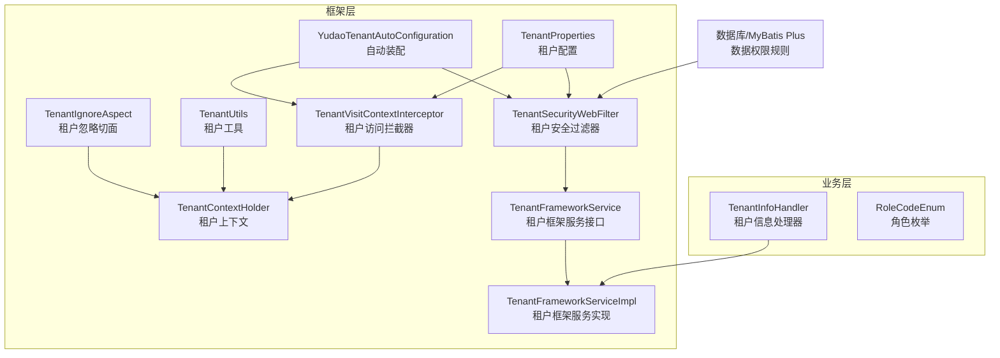
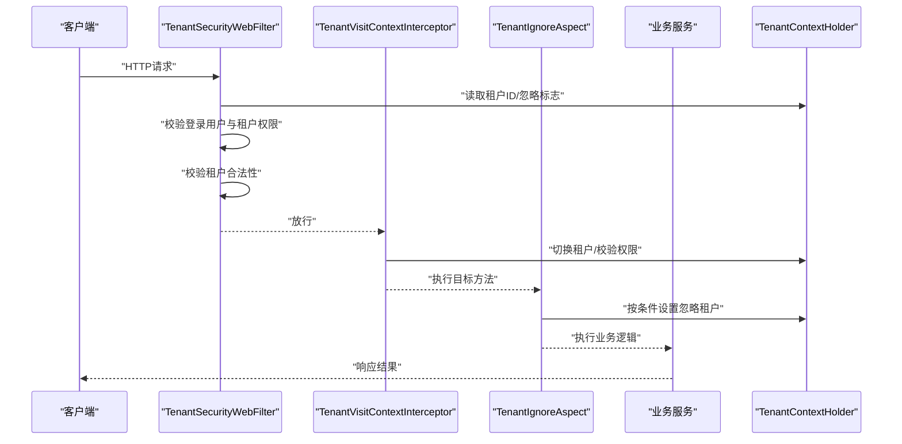
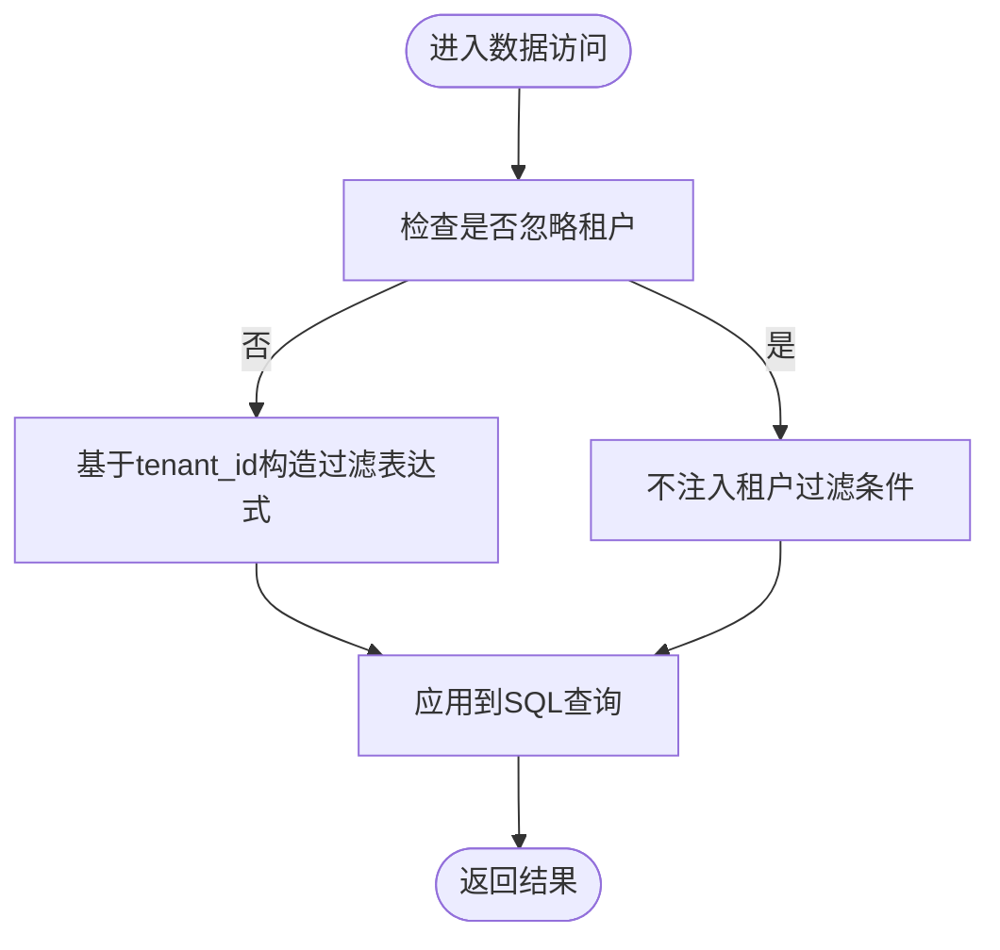
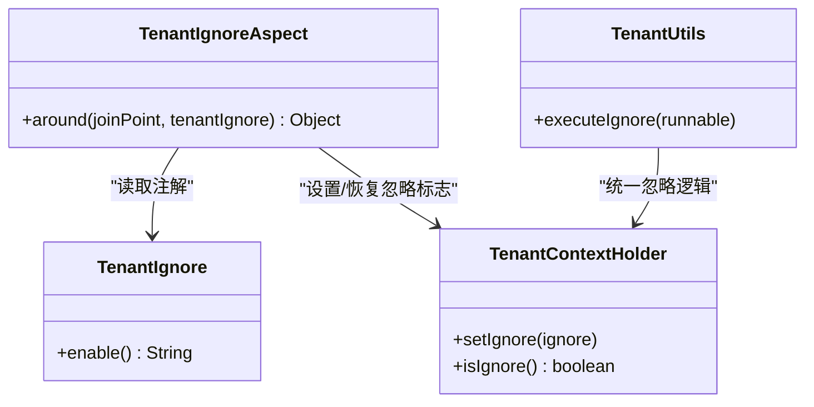
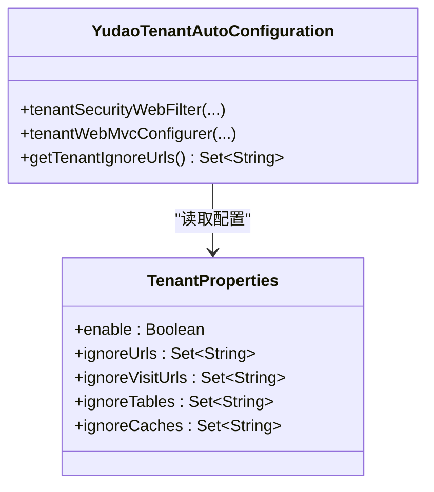
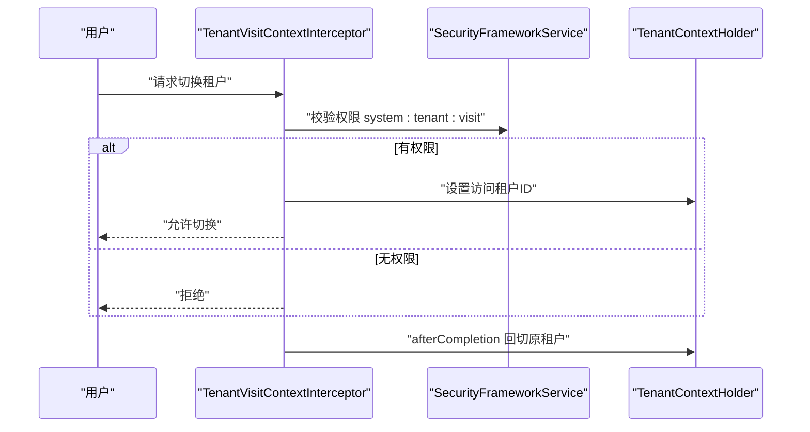
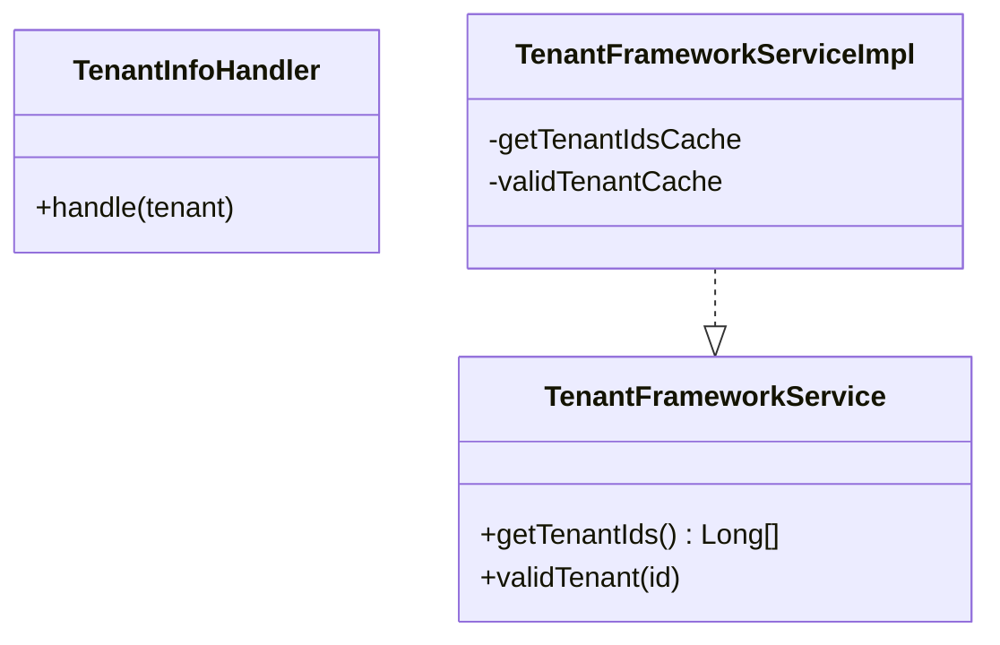
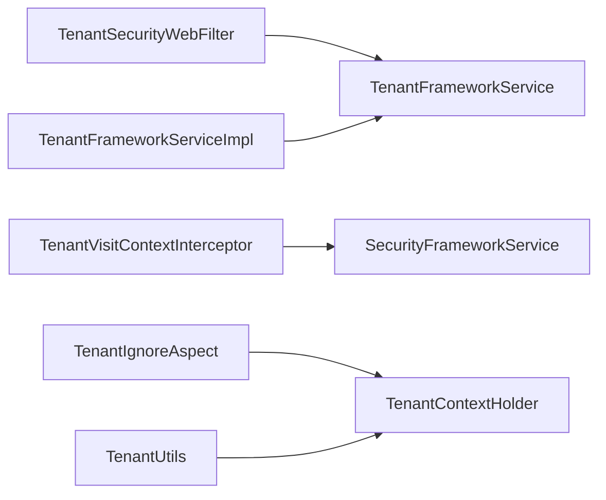

# 多租户安全

<cite>
**本文引用的文件**
- [TenantIgnoreAspect.java](file://yudao-framework/yudao-spring-boot-starter-biz-tenant/src/main/java/cn/iocoder/yudao/framework/tenant/core/aop/TenantIgnoreAspect.java)
- [TenantIgnore.java](file://yudao-framework/yudao-spring-boot-starter-biz-tenant/src/main/java/cn/iocoder/yudao/framework/tenant/core/aop/TenantIgnore.java)
- [TenantContextHolder.java](file://yudao-framework/yudao-spring-boot-starter-biz-tenant/src/main/java/cn/iocoder/yudao/framework/tenant/core/context/TenantContextHolder.java)
- [TenantUtils.java](file://yudao-framework/yudao-spring-boot-starter-biz-tenant/src/main/java/cn/iocoder/yudao/framework/tenant/core/util/TenantUtils.java)
- [TenantSecurityWebFilter.java](file://yudao-framework/yudao-spring-boot-starter-biz-tenant/src/main/java/cn/iocoder/yudao/framework/tenant/core/security/TenantSecurityWebFilter.java)
- [TenantVisitContextInterceptor.java](file://yudao-framework/yudao-spring-boot-starter-biz-tenant/src/main/java/cn/iocoder/yudao/framework/tenant/core/web/TenantVisitContextInterceptor.java)
- [YudaoTenantAutoConfiguration.java](file://yudao-framework/yudao-spring-boot-starter-biz-tenant/src/main/java/cn/iocoder/yudao/framework/tenant/config/YudaoTenantAutoConfiguration.java)
- [TenantProperties.java](file://yudao-framework/yudao-spring-boot-starter-biz-tenant/src/main/java/cn/iocoder/yudao/framework/tenant/config/TenantProperties.java)
- [TenantFrameworkService.java](file://yudao-framework/yudao-spring-boot-starter-biz-tenant/src/main/java/cn/iocoder/yudao/framework/tenant/core/service/TenantFrameworkService.java)
- [TenantFrameworkServiceImpl.java](file://yudao-framework/yudao-spring-boot-starter-biz-tenant/src/main/java/cn/iocoder/yudao/framework/tenant/core/service/TenantFrameworkServiceImpl.java)
- [TenantInfoHandler.java](file://yudao-module-system/src/main/java/cn/iocoder/yudao/module/system/service/tenant/handler/TenantInfoHandler.java)
- [RoleCodeEnum.java](file://yudao-module-system/src/main/java/cn/iocoder/yudao/module/system/enums/permission/RoleCodeEnum.java)
- [DataPermissionRuleHandlerTest.java](file://yudao-framework/yudao-spring-boot-starter-biz-data-permission/src/test/java/cn/iocoder/yudao/framework/datapermission/core/db/DataPermissionRuleHandlerTest.java)
- [ruoyi-vue-pro.sql](file://sql/mysql/ruoyi-vue-pro.sql)
</cite>

## 目录
1. [引言](#引言)
2. [项目结构](#项目结构)
3. [核心组件](#核心组件)
4. [架构总览](#架构总览)
5. [详细组件分析](#详细组件分析)
6. [依赖分析](#依赖分析)
7. [性能考量](#性能考量)
8. [故障排查指南](#故障排查指南)
9. [结论](#结论)
10. [附录](#附录)

## 引言
本文件聚焦AgenticCPS系统在SaaS多租户架构下的安全机制，围绕租户隔离策略、数据安全边界、资源共享控制等核心主题，系统性阐述以下内容：
- 租户数据权限拦截器与数据库层面的租户隔离实现原理
- 租户忽略注解（TenantIgnoreAspect）的作用机制与适用场景
- 租户配置管理（租户信息存储、租户切换、租户状态控制）
- 多租户环境下的权限继承与权限传递机制
- 多租户安全最佳实践（初始化、迁移、删除等）
- 多租户安全审计与监控实施方案

## 项目结构
AgenticCPS采用模块化分层设计，多租户安全能力主要由“框架层”和“业务层”协同实现：
- 框架层（yudao-spring-boot-starter-biz-tenant）：提供租户上下文、拦截器、过滤器、注解切面、配置与服务接口等通用能力
- 业务层（如yudao-module-system）：结合系统模块实现租户信息处理、角色与权限等业务安全

图表来源
- [YudaoTenantAutoConfiguration.java:96-141](file://yudao-framework/yudao-spring-boot-starter-biz-tenant/src/main/java/cn/iocoder/yudao/framework/tenant/config/YudaoTenantAutoConfiguration.java#L96-L141)
- [TenantSecurityWebFilter.java:1-135](file://yudao-framework/yudao-spring-boot-starter-biz-tenant/src/main/java/cn/iocoder/yudao/framework/tenant/core/security/TenantSecurityWebFilter.java#L1-L135)
- [TenantVisitContextInterceptor.java:1-66](file://yudao-framework/yudao-spring-boot-starter-biz-tenant/src/main/java/cn/iocoder/yudao/framework/tenant/core/web/TenantVisitContextInterceptor.java#L1-L66)
- [TenantIgnoreAspect.java:1-42](file://yudao-framework/yudao-spring-boot-starter-biz-tenant/src/main/java/cn/iocoder/yudao/framework/tenant/core/aop/TenantIgnoreAspect.java#L1-L42)
- [TenantContextHolder.java:1-69](file://yudao-framework/yudao-spring-boot-starter-biz-tenant/src/main/java/cn/iocoder/yudao/framework/tenant/core/context/TenantContextHolder.java#L1-L69)
- [TenantUtils.java:1-114](file://yudao-framework/yudao-spring-boot-starter-biz-tenant/src/main/java/cn/iocoder/yudao/framework/tenant/core/util/TenantUtils.java#L1-L114)
- [TenantProperties.java:1-57](file://yudao-framework/yudao-spring-boot-starter-biz-tenant/src/main/java/cn/iocoder/yudao/framework/tenant/config/TenantProperties.java#L1-L57)
- [TenantFrameworkService.java:1-26](file://yudao-framework/yudao-spring-boot-starter-biz-tenant/src/main/java/cn/iocoder/yudao/framework/tenant/core/service/TenantFrameworkService.java#L1-L26)
- [TenantFrameworkServiceImpl.java:1-42](file://yudao-framework/yudao-spring-boot-starter-biz-tenant/src/main/java/cn/iocoder/yudao/framework/tenant/core/service/TenantFrameworkServiceImpl.java#L1-L42)
- [TenantInfoHandler.java:1-21](file://yudao-module-system/src/main/java/cn/iocoder/yudao/module/system/service/tenant/handler/TenantInfoHandler.java#L1-L21)
- [RoleCodeEnum.java:1-32](file://yudao-module-system/src/main/java/cn/iocoder/yudao/module/system/enums/permission/RoleCodeEnum.java#L1-L32)

章节来源
- [YudaoTenantAutoConfiguration.java:96-141](file://yudao-framework/yudao-spring-boot-starter-biz-tenant/src/main/java/cn/iocoder/yudao/framework/tenant/config/YudaoTenantAutoConfiguration.java#L96-L141)
- [TenantProperties.java:1-57](file://yudao-framework/yudao-spring-boot-starter-biz-tenant/src/main/java/cn/iocoder/yudao/framework/tenant/config/TenantProperties.java#L1-L57)

## 核心组件
- 租户上下文与工具
  - TenantContextHolder：线程本地存储租户编号与“忽略租户”标志，支持获取、设置、清空与必需租户ID校验
  - TenantUtils：提供以指定租户执行逻辑、忽略租户执行逻辑、向HTTP头注入租户ID等工具方法
- 租户忽略切面
  - TenantIgnoreAspect：基于TenantIgnore注解实现环绕通知，按Spring EL表达式动态决定是否忽略租户
- 安全过滤器与访问拦截器
  - TenantSecurityWebFilter：统一校验登录用户访问权限、租户合法性、忽略URL策略
  - TenantVisitContextInterceptor：支持用户切换租户并进行权限校验，切换后自动回切
- 自动装配与配置
  - YudaoTenantAutoConfiguration：注册过滤器、拦截器、忽略URL集合构建等
  - TenantProperties：租户开关、忽略URL、忽略跨租户访问URL、忽略表、忽略缓存等配置项
- 框架服务
  - TenantFrameworkService/TenantFrameworkServiceImpl：提供租户ID列表查询与租户合法性校验，含缓存优化

章节来源
- [TenantContextHolder.java:1-69](file://yudao-framework/yudao-spring-boot-starter-biz-tenant/src/main/java/cn/iocoder/yudao/framework/tenant/core/context/TenantContextHolder.java#L1-L69)
- [TenantUtils.java:1-114](file://yudao-framework/yudao-spring-boot-starter-biz-tenant/src/main/java/cn/iocoder/yudao/framework/tenant/core/util/TenantUtils.java#L1-L114)
- [TenantIgnoreAspect.java:1-42](file://yudao-framework/yudao-spring-boot-starter-biz-tenant/src/main/java/cn/iocoder/yudao/framework/tenant/core/aop/TenantIgnoreAspect.java#L1-L42)
- [TenantSecurityWebFilter.java:1-135](file://yudao-framework/yudao-spring-boot-starter-biz-tenant/src/main/java/cn/iocoder/yudao/framework/tenant/core/security/TenantSecurityWebFilter.java#L1-L135)
- [TenantVisitContextInterceptor.java:1-66](file://yudao-framework/yudao-spring-boot-starter-biz-tenant/src/main/java/cn/iocoder/yudao/framework/tenant/core/web/TenantVisitContextInterceptor.java#L1-L66)
- [YudaoTenantAutoConfiguration.java:96-141](file://yudao-framework/yudao-spring-boot-starter-biz-tenant/src/main/java/cn/iocoder/yudao/framework/tenant/config/YudaoTenantAutoConfiguration.java#L96-L141)
- [TenantProperties.java:1-57](file://yudao-framework/yudao-spring-boot-starter-biz-tenant/src/main/java/cn/iocoder/yudao/framework/tenant/config/TenantProperties.java#L1-L57)
- [TenantFrameworkService.java:1-26](file://yudao-framework/yudao-spring-boot-starter-biz-tenant/src/main/java/cn/iocoder/yudao/framework/tenant/core/service/TenantFrameworkService.java#L1-L26)
- [TenantFrameworkServiceImpl.java:1-42](file://yudao-framework/yudao-spring-boot-starter-biz-tenant/src/main/java/cn/iocoder/yudao/framework/tenant/core/service/TenantFrameworkServiceImpl.java#L1-L42)

## 架构总览
多租户安全在请求生命周期中的关键节点如下：
- 请求进入：TenantSecurityWebFilter进行租户合法性与越权校验
- 拦截器阶段：TenantVisitContextInterceptor处理租户切换与权限校验
- 切面阶段：TenantIgnoreAspect在必要时忽略租户限制
- 工具阶段：TenantUtils/TenantContextHolder贯穿执行链路，确保租户上下文一致

图表来源
- [TenantSecurityWebFilter.java:64-111](file://yudao-framework/yudao-spring-boot-starter-biz-tenant/src/main/java/cn/iocoder/yudao/framework/tenant/core/security/TenantSecurityWebFilter.java#L64-L111)
- [TenantVisitContextInterceptor.java:30-54](file://yudao-framework/yudao-spring-boot-starter-biz-tenant/src/main/java/cn/iocoder/yudao/framework/tenant/core/web/TenantVisitContextInterceptor.java#L30-L54)
- [TenantIgnoreAspect.java:24-39](file://yudao-framework/yudao-spring-boot-starter-biz-tenant/src/main/java/cn/iocoder/yudao/framework/tenant/core/aop/TenantIgnoreAspect.java#L24-L39)
- [TenantContextHolder.java:28-61](file://yudao-framework/yudao-spring-boot-starter-biz-tenant/src/main/java/cn/iocoder/yudao/framework/tenant/core/context/TenantContextHolder.java#L28-L61)

## 详细组件分析

### 租户数据权限拦截器与数据库隔离
- 数据库层面的租户隔离通常通过MyBatis Plus的租户插件或自定义拦截器实现。在测试用例中可见针对“tenant_id”列的表达式构造，表明系统在数据层面对租户字段进行统一过滤，从而实现跨表的租户隔离。
- 在多租户环境下，建议：
  - 为所有涉及数据隔离的表增加tenant_id字段
  - 在ORM层统一注入租户过滤条件，避免遗漏
  - 对于特殊场景（如统计、缓存预热），通过TenantIgnore注解或忽略URL策略临时放宽

图表来源
- [DataPermissionRuleHandlerTest.java:50-63](file://yudao-framework/yudao-spring-boot-starter-biz-data-permission/src/test/java/cn/iocoder/yudao/framework/datapermission/core/db/DataPermissionRuleHandlerTest.java#L50-L63)

章节来源
- [DataPermissionRuleHandlerTest.java:50-63](file://yudao-framework/yudao-spring-boot-starter-biz-data-permission/src/test/java/cn/iocoder/yudao/framework/datapermission/core/db/DataPermissionRuleHandlerTest.java#L50-L63)

### 租户忽略注解（TenantIgnoreAspect）机制
- 作用：在特定方法或类上通过TenantIgnore注解声明忽略租户限制；支持Spring EL表达式enable属性按条件启用
- 实现要点：
  - 切面在环绕通知中读取旧的忽略状态，计算enable表达式，满足则设置忽略标志，执行后恢复旧状态
  - 与TenantUtils.executeIgnore保持行为一致性，便于在工具方法中统一处理

图表来源
- [TenantIgnoreAspect.java:24-39](file://yudao-framework/yudao-spring-boot-starter-biz-tenant/src/main/java/cn/iocoder/yudao/framework/tenant/core/aop/TenantIgnoreAspect.java#L24-L39)
- [TenantIgnore.java:25-30](file://yudao-framework/yudao-spring-boot-starter-biz-tenant/src/main/java/cn/iocoder/yudao/framework/tenant/core/aop/TenantIgnore.java#L25-L30)
- [TenantContextHolder.java:50-61](file://yudao-framework/yudao-spring-boot-starter-biz-tenant/src/main/java/cn/iocoder/yudao/framework/tenant/core/context/TenantContextHolder.java#L50-L61)
- [TenantUtils.java:71-99](file://yudao-framework/yudao-spring-boot-starter-biz-tenant/src/main/java/cn/iocoder/yudao/framework/tenant/core/util/TenantUtils.java#L71-L99)

章节来源
- [TenantIgnoreAspect.java:1-42](file://yudao-framework/yudao-spring-boot-starter-biz-tenant/src/main/java/cn/iocoder/yudao/framework/tenant/core/aop/TenantIgnoreAspect.java#L1-L42)
- [TenantIgnore.java:7-32](file://yudao-framework/yudao-spring-boot-starter-biz-tenant/src/main/java/cn/iocoder/yudao/framework/tenant/core/aop/TenantIgnore.java#L7-L32)
- [TenantUtils.java:66-99](file://yudao-framework/yudao-spring-boot-starter-biz-tenant/src/main/java/cn/iocoder/yudao/framework/tenant/core/util/TenantUtils.java#L66-L99)

### 租户配置管理
- 配置项（TenantProperties）
  - enable：租户功能开关
  - ignoreUrls：无需携带租户ID的开放接口集合
  - ignoreVisitUrls：允许跨租户访问的接口集合
  - ignoreTables：无需租户过滤的表集合
  - ignoreCaches：无需租户过滤的缓存集合
- 自动装配（YudaoTenantAutoConfiguration）
  - 注册TenantSecurityWebFilter与TenantVisitContextInterceptor
  - 动态收集标注TenantIgnore的Controller接口URL加入忽略集合
  - 通过WebMvcConfigurer排除忽略URL

图表来源
- [TenantProperties.java:19-57](file://yudao-framework/yudao-spring-boot-starter-biz-tenant/src/main/java/cn/iocoder/yudao/framework/tenant/config/TenantProperties.java#L19-L57)
- [YudaoTenantAutoConfiguration.java:99-141](file://yudao-framework/yudao-spring-boot-starter-biz-tenant/src/main/java/cn/iocoder/yudao/framework/tenant/config/YudaoTenantAutoConfiguration.java#L99-L141)

章节来源
- [TenantProperties.java:1-57](file://yudao-framework/yudao-spring-boot-starter-biz-tenant/src/main/java/cn/iocoder/yudao/framework/tenant/config/TenantProperties.java#L1-L57)
- [YudaoTenantAutoConfiguration.java:96-141](file://yudao-framework/yudao-spring-boot-starter-biz-tenant/src/main/java/cn/iocoder/yudao/framework/tenant/config/YudaoTenantAutoConfiguration.java#L96-L141)

### 权限继承与权限传递
- 角色与权限
  - 超级管理员（super_admin）拥有最高权限
  - 租户管理员（tenant_admin）具备租户维度的管理权限
  - 系统通过权限字符串“system:tenant:visit”控制租户切换能力
- 访问拦截器
  - TenantVisitContextInterceptor在preHandle阶段校验用户是否具备租户切换权限，具备则将访问租户ID写入上下文，afterCompletion阶段回切回原租户

图表来源
- [TenantVisitContextInterceptor.java:30-54](file://yudao-framework/yudao-spring-boot-starter-biz-tenant/src/main/java/cn/iocoder/yudao/framework/tenant/core/web/TenantVisitContextInterceptor.java#L30-L54)
- [RoleCodeEnum.java:14-16](file://yudao-module-system/src/main/java/cn/iocoder/yudao/module/system/enums/permission/RoleCodeEnum.java#L14-L16)

章节来源
- [TenantVisitContextInterceptor.java:23-54](file://yudao-framework/yudao-spring-boot-starter-biz-tenant/src/main/java/cn/iocoder/yudao/framework/tenant/core/web/TenantVisitContextInterceptor.java#L23-L54)
- [RoleCodeEnum.java:14-16](file://yudao-module-system/src/main/java/cn/iocoder/yudao/module/system/enums/permission/RoleCodeEnum.java#L14-L16)

### 租户信息处理与状态控制
- 租户信息处理接口（TenantInfoHandler）
  - 用于在租户生命周期关键节点执行业务逻辑（如配额校验、初始化资源等）
- 框架服务（TenantFrameworkService/TenantFrameworkServiceImpl）
  - 提供租户ID列表与租户合法性校验，内部使用缓存提升性能
- 数据模型
  - 系统租户表包含租户ID、名称、到期时间、套餐ID等字段，支撑租户状态控制

图表来源
- [TenantInfoHandler.java:11-21](file://yudao-module-system/src/main/java/cn/iocoder/yudao/module/system/service/tenant/handler/TenantInfoHandler.java#L11-L21)
- [TenantFrameworkService.java:10-26](file://yudao-framework/yudao-spring-boot-starter-biz-tenant/src/main/java/cn/iocoder/yudao/framework/tenant/core/service/TenantFrameworkService.java#L10-L26)
- [TenantFrameworkServiceImpl.java:19-42](file://yudao-framework/yudao-spring-boot-starter-biz-tenant/src/main/java/cn/iocoder/yudao/framework/tenant/core/service/TenantFrameworkServiceImpl.java#L19-L42)
- [ruoyi-vue-pro.sql:10846-10856](file://sql/mysql/ruoyi-vue-pro.sql#L10846-L10856)

章节来源
- [TenantInfoHandler.java:1-21](file://yudao-module-system/src/main/java/cn/iocoder/yudao/module/system/service/tenant/handler/TenantInfoHandler.java#L1-L21)
- [TenantFrameworkService.java:1-26](file://yudao-framework/yudao-spring-boot-starter-biz-tenant/src/main/java/cn/iocoder/yudao/framework/tenant/core/service/TenantFrameworkService.java#L1-L26)
- [TenantFrameworkServiceImpl.java:1-42](file://yudao-framework/yudao-spring-boot-starter-biz-tenant/src/main/java/cn/iocoder/yudao/framework/tenant/core/service/TenantFrameworkServiceImpl.java#L1-L42)
- [ruoyi-vue-pro.sql:10846-10856](file://sql/mysql/ruoyi-vue-pro.sql#L10846-L10856)

## 依赖分析
- 组件耦合
  - TenantSecurityWebFilter依赖TenantFrameworkService进行租户合法性校验
  - TenantVisitContextInterceptor依赖SecurityFrameworkService进行权限校验
  - TenantIgnoreAspect依赖TenantContextHolder进行上下文状态切换
  - TenantUtils与TenantContextHolder共同提供租户执行上下文封装
- 外部依赖
  - Web过滤器链与拦截器链的顺序由WebFilterOrderEnum等约定保障
  - MyBatis Plus数据权限规则通过测试用例体现对tenant_id列的统一过滤

图表来源
- [TenantSecurityWebFilter.java:69-102](file://yudao-framework/yudao-spring-boot-starter-biz-tenant/src/main/java/cn/iocoder/yudao/framework/tenant/core/security/TenantSecurityWebFilter.java#L69-L102)
- [TenantVisitContextInterceptor.java:39-52](file://yudao-framework/yudao-spring-boot-starter-biz-tenant/src/main/java/cn/iocoder/yudao/framework/tenant/core/web/TenantVisitContextInterceptor.java#L39-L52)
- [TenantIgnoreAspect.java:26-38](file://yudao-framework/yudao-spring-boot-starter-biz-tenant/src/main/java/cn/iocoder/yudao/framework/tenant/core/aop/TenantIgnoreAspect.java#L26-L38)
- [TenantUtils.java:26-64](file://yudao-framework/yudao-spring-boot-starter-biz-tenant/src/main/java/cn/iocoder/yudao/framework/tenant/core/util/TenantUtils.java#L26-L64)
- [TenantFrameworkServiceImpl.java:29-38](file://yudao-framework/yudao-spring-boot-starter-biz-tenant/src/main/java/cn/iocoder/yudao/framework/tenant/core/service/TenantFrameworkServiceImpl.java#L29-L38)

章节来源
- [TenantSecurityWebFilter.java:64-111](file://yudao-framework/yudao-spring-boot-starter-biz-tenant/src/main/java/cn/iocoder/yudao/framework/tenant/core/security/TenantSecurityWebFilter.java#L64-L111)
- [TenantVisitContextInterceptor.java:30-54](file://yudao-framework/yudao-spring-boot-starter-biz-tenant/src/main/java/cn/iocoder/yudao/framework/tenant/core/web/TenantVisitContextInterceptor.java#L30-L54)
- [TenantIgnoreAspect.java:24-39](file://yudao-framework/yudao-spring-boot-starter-biz-tenant/src/main/java/cn/iocoder/yudao/framework/tenant/core/aop/TenantIgnoreAspect.java#L24-L39)
- [TenantUtils.java:26-64](file://yudao-framework/yudao-spring-boot-starter-biz-tenant/src/main/java/cn/iocoder/yudao/framework/tenant/core/util/TenantUtils.java#L26-L64)
- [TenantFrameworkServiceImpl.java:29-38](file://yudao-framework/yudao-spring-boot-starter-biz-tenant/src/main/java/cn/iocoder/yudao/framework/tenant/core/service/TenantFrameworkServiceImpl.java#L29-L38)

## 性能考量
- 缓存优化
  - TenantFrameworkServiceImpl对租户ID列表与租户校验结果进行缓存，降低远程调用与校验成本
- 忽略URL快速匹配
  - TenantSecurityWebFilter对忽略URL采用集合快速匹配与Ant路径匹配相结合的方式，兼顾性能与灵活性
- 线程本地存储
  - TenantContextHolder使用TransmittableThreadLocal，确保多线程与异步场景下的租户上下文一致性

章节来源
- [TenantFrameworkServiceImpl.java:29-38](file://yudao-framework/yudao-spring-boot-starter-biz-tenant/src/main/java/cn/iocoder/yudao/framework/tenant/core/service/TenantFrameworkServiceImpl.java#L29-L38)
- [TenantSecurityWebFilter.java:113-132](file://yudao-framework/yudao-spring-boot-starter-biz-tenant/src/main/java/cn/iocoder/yudao/framework/tenant/core/security/TenantSecurityWebFilter.java#L113-L132)
- [TenantContextHolder.java:16](file://yudao-framework/yudao-spring-boot-starter-biz-tenant/src/main/java/cn/iocoder/yudao/framework/tenant/core/context/TenantContextHolder.java#L16)

## 故障排查指南
- 常见问题
  - 未传递租户ID：安全过滤器会返回错误提示，需确认请求头或参数是否正确携带
  - 越权访问：登录用户与请求租户不一致时会被拒绝，需检查用户绑定的租户与访问目标
  - 忽略租户无效：确认TenantIgnore注解的enable表达式是否满足，以及是否在正确的执行链路生效
- 审计与日志
  - 安全过滤器在越权与缺失租户ID时记录详细日志，便于定位问题
  - 建议在网关或统一入口增加请求追踪，结合租户ID进行聚合分析

章节来源
- [TenantSecurityWebFilter.java:76-102](file://yudao-framework/yudao-spring-boot-starter-biz-tenant/src/main/java/cn/iocoder/yudao/framework/tenant/core/security/TenantSecurityWebFilter.java#L76-L102)
- [TenantIgnoreAspect.java:24-39](file://yudao-framework/yudao-spring-boot-starter-biz-tenant/src/main/java/cn/iocoder/yudao/framework/tenant/core/aop/TenantIgnoreAspect.java#L24-L39)

## 结论
AgenticCPS的多租户安全体系通过“过滤器+拦截器+切面+上下文”的组合拳，实现了从请求入口到业务执行的全链路租户隔离与权限控制。配合灵活的忽略策略、完善的配置管理与缓存优化，既能满足SaaS场景下的强隔离需求，又能在特殊场景下提供必要的灵活性。建议在生产环境中结合审计与监控，持续完善租户生命周期管理与安全策略。

## 附录
- 最佳实践清单
  - 初始化：为所有涉及隔离的表添加tenant_id字段，配置ignoreTables与ignoreCaches
  - 切换：仅授予具备“system:tenant:visit”的用户跨租户访问能力
  - 迁移：在迁移窗口内使用TenantIgnore注解或忽略URL策略，完成后恢复
  - 删除：删除前确保数据归档与依赖清理，避免残留引用导致越权
- 审计与监控
  - 在安全过滤器与访问拦截器中埋点，记录租户ID、用户ID、操作类型、时间戳
  - 对异常访问（越权、缺失租户ID）进行告警与封禁策略联动