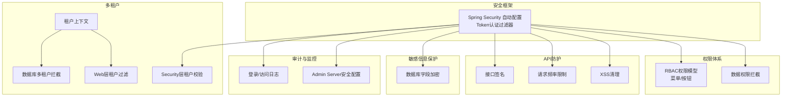
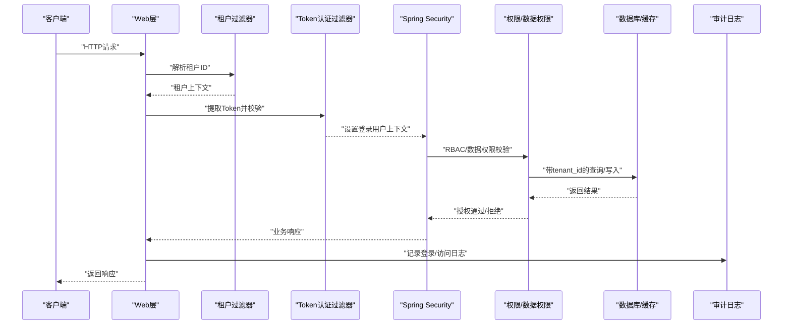
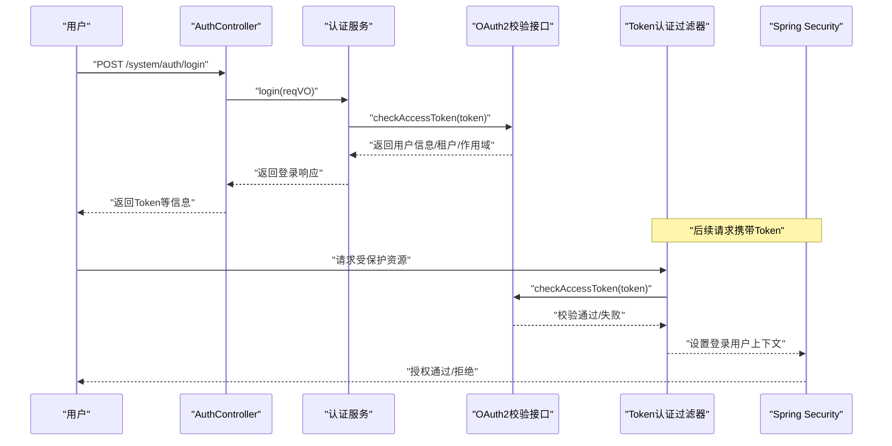
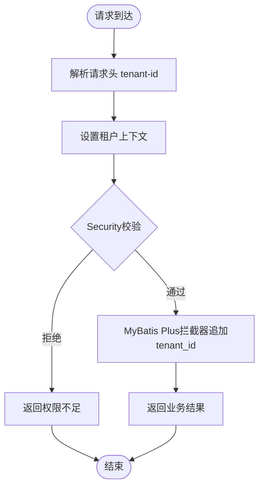
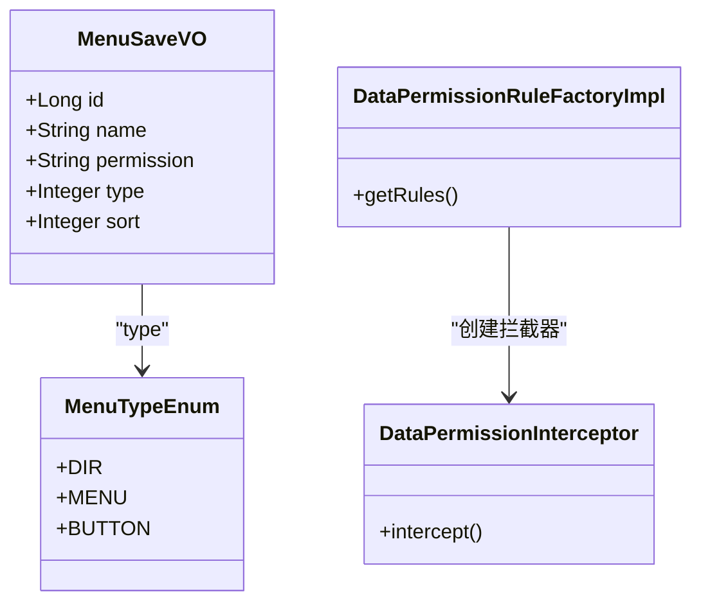
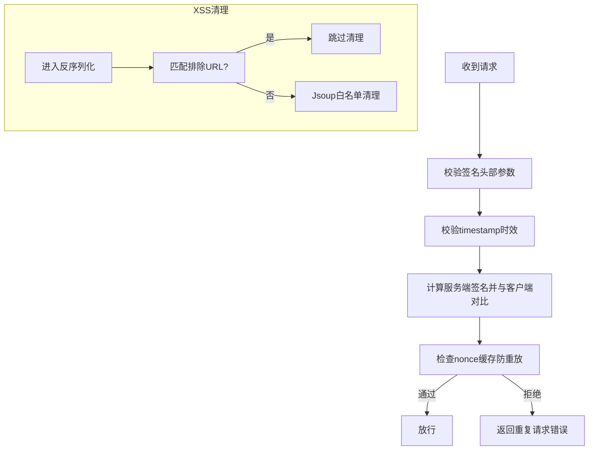
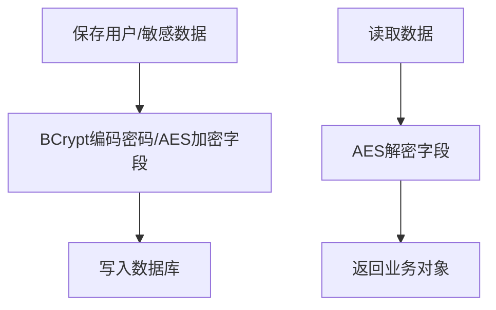
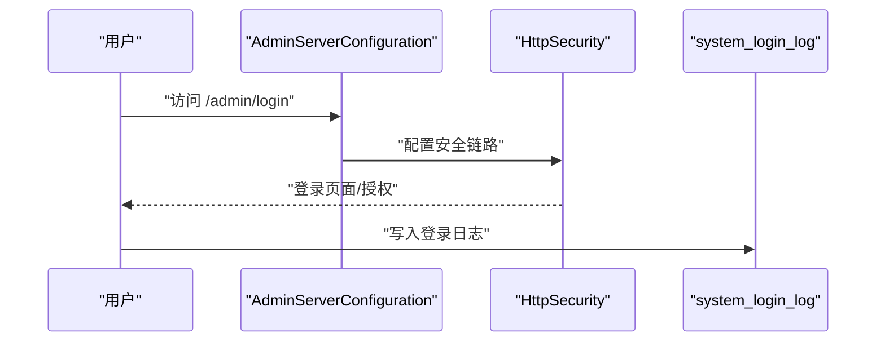
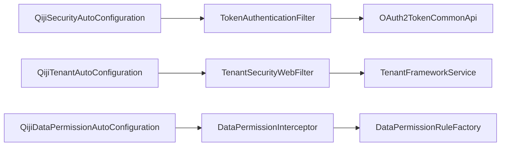

# 安全与权限

<cite>
**本文引用的文件**
- [AuthController.java](file://qiji-module-system/src/main/java/com.qiji.cps/module/system/controller/admin/auth/AuthController.java)
- [QijiSecurityAutoConfiguration.java](file://qiji-framework/qiji-spring-boot-starter-security/src/main/java/com.qiji.cps/framework/security/config/QijiSecurityAutoConfiguration.java)
- [TokenAuthenticationFilter.java](file://qiji-framework/qiji-spring-boot-starter-security/src/main/java/com.qiji.cps/framework/security/core/filter/TokenAuthenticationFilter.java)
- [QijiTenantAutoConfiguration.java](file://qiji-framework/qiji-spring-boot-starter-biz-tenant/src/main/java/com.qiji.cps/framework/tenant/config/QijiTenantAutoConfiguration.java)
- [TenantContextHolder.java](file://qiji-framework/qiji-spring-boot-starter-biz-tenant/src/main/java/com.qiji.cps/framework/tenant/core/context/TenantContextHolder.java)
- [TenantCommonApi.java](file://qiji-framework/qiji-common/src/main/java/com.qiji.cps/framework/common/biz/system/tenant/TenantCommonApi.java)
- [TenantApiImpl.java](file://qiji-module-system/src/main/java/com.qiji.cps/module/system/api/tenant/TenantApiImpl.java)
- [QijiDataPermissionAutoConfiguration.java](file://qiji-framework/qiji-spring-boot-starter-biz-data-permission/src/main/java/com.qiji.cps/framework/datapermission/config/QijiDataPermissionAutoConfiguration.java)
- [ApiSignature.java](file://qiji-framework/qiji-spring-boot-starter-protection/src/main/java/com.qiji.cps/framework/signature/core/annotation/ApiSignature.java)
- [ApiSignatureAspect.java](file://qiji-framework/qiji-spring-boot-starter-protection/src/main/java/com.qiji.cps/framework/signature/core/aop/ApiSignatureAspect.java)
- [QijiRateLimiterConfiguration.java](file://qiji-framework/qiji-spring-boot-starter-protection/src/main/java/com.qiji.cps/framework/ratelimiter/config/QijiRateLimiterConfiguration.java)
- [JsoupXssCleaner.java](file://qiji-framework/qiji-spring-boot-starter-web/src/main/java/com.qiji.cps/framework/xss/core/clean/JsoupXssCleaner.java)
- [XssStringJsonDeserializer.java](file://qiji-framework/qiji-spring-boot-starter-web/src/main/java/com.qiji.cps/framework/xss/core/json/XssStringJsonDeserializer.java)
- [EncryptTypeHandler.java](file://qiji-framework/qiji-spring-boot-starter-mybatis/src/main/java/com.qiji.cps/framework/mybatis/core/type/EncryptTypeHandler.java)
- [AdminServerConfiguration.java](file://qiji-module-infra/src/main/java/com.qiji.cps/module/infra/framework/monitor/config/AdminServerConfiguration.java)
- [ruoyi-vue-pro.sql（SQL Server）](file://sql/sqlserver/ruoyi-vue-pro.sql)
- [SecurityConfiguration.java（AI模块）](file://qiji-module-ai/src/main/java/com.qiji.cps/module/ai/framework/security/config/SecurityConfiguration.java)
</cite>

## 目录
1. [简介](#简介)
2. [项目结构](#项目结构)
3. [核心组件](#核心组件)
4. [架构总览](#架构总览)
5. [详细组件分析](#详细组件分析)
6. [依赖分析](#依赖分析)
7. [性能考虑](#性能考虑)
8. [故障排查指南](#故障排查指南)
9. [结论](#结论)
10. [附录](#附录)

## 简介
本文件面向AgenticCPS系统的安全与权限主题，围绕基于Spring Security的认证授权机制、JWT Token生成与验证、用户登录流程、会话管理、RBAC权限体系（菜单权限、按钮权限、数据权限）、SaaS多租户安全设计（租户隔离、权限继承、资源限制）、密码加密与敏感信息保护、SQL注入与XSS防护、API接口安全（签名验证、请求频率限制、IP白名单）、安全配置最佳实践（安全头、HTTPS、审计）以及安全监控与应急响应展开。内容结合仓库中的实际代码与配置，提供可操作的实现依据与落地建议。

## 项目结构
AgenticCPS的安全与权限能力由多个子模块协同实现：
- 安全框架与自动装配：Spring Security集成、Token认证过滤器、密码编码器、安全上下文策略
- 多租户：租户上下文、Web过滤器、数据库拦截器、Redis缓存隔离、MQ/Job/Async租户传播
- 权限体系：菜单/按钮权限模型、RBAC授权、操作日志
- 数据权限：基于MyBatis Plus的动态数据规则
- API防护：接口签名、速率限制、XSS清理
- 敏感信息保护：数据库字段加密
- 审计与监控：登录/访问日志、Admin Server安全配置

**图表来源**
- [QijiSecurityAutoConfiguration.java:32-92](file://qiji-framework/qiji-spring-boot-starter-security/src/main/java/com.qiji.cps/framework/security/config/QijiSecurityAutoConfiguration.java#L32-L92)
- [TokenAuthenticationFilter.java:31-119](file://qiji-framework/qiji-spring-boot-starter-security/src/main/java/com.qiji.cps/framework/security/core/filter/TokenAuthenticationFilter.java#L31-L119)
- [QijiTenantAutoConfiguration.java:51-198](file://qiji-framework/qiji-spring-boot-starter-biz-tenant/src/main/java/com.qiji.cps/framework/tenant/config/QijiTenantAutoConfiguration.java#L51-L198)
- [TenantContextHolder.java:11-67](file://qiji-framework/qiji-spring-boot-starter-biz-tenant/src/main/java/com.qiji.cps/framework/tenant/core/context/TenantContextHolder.java#L11-L67)
- [QijiDataPermissionAutoConfiguration.java:21-46](file://qiji-framework/qiji-spring-boot-starter-biz-data-permission/src/main/java/com.qiji.cps/framework/datapermission/config/QijiDataPermissionAutoConfiguration.java#L21-L46)
- [ApiSignature.java:18-59](file://qiji-framework/qiji-spring-boot-starter-protection/src/main/java/com.qiji.cps/framework/signature/core/annotation/ApiSignature.java#L18-L59)
- [QijiRateLimiterConfiguration.java:31-53](file://qiji-framework/qiji-spring-boot-starter-protection/src/main/java/com.qiji.cps/framework/ratelimiter/config/QijiRateLimiterConfiguration.java#L31-L53)
- [JsoupXssCleaner.java:10-40](file://qiji-framework/qiji-spring-boot-starter-web/src/main/java/com.qiji.cps/framework/xss/core/clean/JsoupXssCleaner.java#L10-L40)
- [XssStringJsonDeserializer.java:40-82](file://qiji-framework/qiji-spring-boot-starter-web/src/main/java/com.qiji.cps/framework/xss/core/json/XssStringJsonDeserializer.java#L40-L82)
- [EncryptTypeHandler.java:50-75](file://qiji-framework/qiji-spring-boot-starter-mybatis/src/main/java/com.qiji.cps/framework/mybatis/core/type/EncryptTypeHandler.java#L50-L75)
- [AdminServerConfiguration.java:59-80](file://qiji-module-infra/src/main/java/com.qiji.cps/module/infra/framework/monitor/config/AdminServerConfiguration.java#L59-L80)

**章节来源**
- [QijiSecurityAutoConfiguration.java:32-92](file://qiji-framework/qiji-spring-boot-starter-security/src/main/java/com.qiji.cps/framework/security/config/QijiSecurityAutoConfiguration.java#L32-L92)
- [QijiTenantAutoConfiguration.java:51-198](file://qiji-framework/qiji-spring-boot-starter-biz-tenant/src/main/java/com.qiji.cps/framework/tenant/config/QijiTenantAutoConfiguration.java#L51-L198)
- [QijiDataPermissionAutoConfiguration.java:21-46](file://qiji-framework/qiji-spring-boot-starter-biz-data-permission/src/main/java/com.qiji.cps/framework/datapermission/config/QijiDataPermissionAutoConfiguration.java#L21-L46)

## 核心组件
- 认证与授权
  - Spring Security自动配置与密码编码器
  - Token认证过滤器：从请求头/参数提取Token，调用OAuth2校验，构建登录用户上下文
  - 登录/登出/刷新Token接口
- 多租户安全
  - 租户上下文持有与忽略策略
  - Web过滤器与Security过滤器：解析请求头租户ID，校验访问合法性
  - 数据库拦截器：自动注入tenant_id条件
  - Redis/MQ/Job/Async租户隔离与传播
- 权限体系
  - 菜单类型（目录/菜单/按钮），按钮权限标识
  - RBAC：角色-菜单-按钮授权
  - 数据权限：基于规则工厂与拦截器的动态SQL拼接
- API防护
  - 接口签名：参数appId/timestamp/nonce/sign校验，防重放
  - 速率限制：多种Key解析器
  - XSS清理：基于Jsoup白名单
- 敏感信息保护
  - 数据库字段加密：AES加解密TypeHandler
- 审计与监控
  - 登录/访问日志表结构与字段
  - Admin Server独立安全链路

**章节来源**
- [AuthController.java:66-90](file://qiji-module-system/src/main/java/com.qiji.cps/module/system/controller/admin/auth/AuthController.java#L66-L90)
- [TokenAuthenticationFilter.java:40-119](file://qiji-framework/qiji-spring-boot-starter-security/src/main/java/com.qiji.cps/framework/security/core/filter/TokenAuthenticationFilter.java#L40-L119)
- [QijiTenantAutoConfiguration.java:84-124](file://qiji-framework/qiji-spring-boot-starter-biz-tenant/src/main/java/com.qiji.cps/framework/tenant/config/QijiTenantAutoConfiguration.java#L84-L124)
- [TenantContextHolder.java:11-67](file://qiji-framework/qiji-spring-boot-starter-biz-tenant/src/main/java/com.qiji.cps/framework/tenant/core/context/TenantContextHolder.java#L11-L67)
- [QijiDataPermissionAutoConfiguration.java:21-46](file://qiji-framework/qiji-spring-boot-starter-biz-data-permission/src/main/java/com.qiji.cps/framework/datapermission/config/QijiDataPermissionAutoConfiguration.java#L21-L46)
- [ApiSignature.java:18-59](file://qiji-framework/qiji-spring-boot-starter-protection/src/main/java/com.qiji.cps/framework/signature/core/annotation/ApiSignature.java#L18-L59)
- [QijiRateLimiterConfiguration.java:31-53](file://qiji-framework/qiji-spring-boot-starter-protection/src/main/java/com.qiji.cps/framework/ratelimiter/config/QijiRateLimiterConfiguration.java#L31-L53)
- [JsoupXssCleaner.java:10-40](file://qiji-framework/qiji-spring-boot-starter-web/src/main/java/com.qiji.cps/framework/xss/core/clean/JsoupXssCleaner.java#L10-L40)
- [EncryptTypeHandler.java:50-75](file://qiji-framework/qiji-spring-boot-starter-mybatis/src/main/java/com.qiji.cps/framework/mybatis/core/type/EncryptTypeHandler.java#L50-L75)
- [AdminServerConfiguration.java:59-80](file://qiji-module-infra/src/main/java/com.qiji.cps/module/infra/framework/monitor/config/AdminServerConfiguration.java#L59-L80)

## 架构总览
下图展示了AgenticCPS安全与权限的整体架构：请求进入Web层，经由租户过滤器与Token认证过滤器，随后进入权限校验与业务处理，同时贯穿数据权限拦截、API防护与审计记录。

**图表来源**
- [TokenAuthenticationFilter.java:40-119](file://qiji-framework/qiji-spring-boot-starter-security/src/main/java/com.qiji.cps/framework/security/core/filter/TokenAuthenticationFilter.java#L40-L119)
- [QijiTenantAutoConfiguration.java:84-124](file://qiji-framework/qiji-spring-boot-starter-biz-tenant/src/main/java/com.qiji.cps/framework/tenant/config/QijiTenantAutoConfiguration.java#L84-L124)
- [QijiDataPermissionAutoConfiguration.java:29-39](file://qiji-framework/qiji-spring-boot-starter-biz-data-permission/src/main/java/com.qiji.cps/framework/datapermission/config/QijiDataPermissionAutoConfiguration.java#L29-L39)
- [ruoyi-vue-pro.sql（SQL Server）:68-122](file://sql/sqlserver/ruoyi-vue-pro.sql#L68-L122)

## 详细组件分析

### 认证与授权（Spring Security + JWT/OAuth2）
- 自动配置
  - 密码编码器：BCryptPasswordEncoder
  - Token认证过滤器：从请求头或参数提取Token，调用OAuth2校验接口，构建LoginUser并写入Security上下文
  - 安全上下文策略：TransmittableThreadLocal策略，保障多线程/异步/定时任务中的上下文传递
- 登录流程
  - 管理后台登录接口接收用户名/密码，内部委托认证服务完成登录，返回登录响应（含Token等）
  - 登出接口：从请求中提取Token并触发登出逻辑
  - 刷新Token：根据refreshToken生成新的Token
- 授权流程
  - 控制器方法通过Spring Security进行授权，未登录或权限不足将触发统一异常处理

**图表来源**
- [AuthController.java:66-90](file://qiji-module-system/src/main/java/com.qiji.cps/module/system/controller/admin/auth/AuthController.java#L66-L90)
- [TokenAuthenticationFilter.java:40-119](file://qiji-framework/qiji-spring-boot-starter-security/src/main/java/com.qiji.cps/framework/security/core/filter/TokenAuthenticationFilter.java#L40-L119)
- [QijiSecurityAutoConfiguration.java:62-79](file://qiji-framework/qiji-spring-boot-starter-security/src/main/java/com.qiji.cps/framework/security/config/QijiSecurityAutoConfiguration.java#L62-L79)

**章节来源**
- [QijiSecurityAutoConfiguration.java:32-92](file://qiji-framework/qiji-spring-boot-starter-security/src/main/java/com.qiji.cps/framework/security/config/QijiSecurityAutoConfiguration.java#L32-L92)
- [TokenAuthenticationFilter.java:40-119](file://qiji-framework/qiji-spring-boot-starter-security/src/main/java/com.qiji.cps/framework/security/core/filter/TokenAuthenticationFilter.java#L40-L119)
- [AuthController.java:66-90](file://qiji-module-system/src/main/java/com.qiji.cps/module/system/controller/admin/auth/AuthController.java#L66-L90)

### 多租户安全设计
- 租户上下文
  - 通过TransmittableThreadLocal持有当前租户ID与忽略标志，支持Web、Security、Job、MQ、Async等场景
- Web层
  - 租户上下文过滤器：解析请求头tenant-id，设置上下文
  - 租户访问拦截器：可忽略特定URL集合
  - Security层过滤器：对受保护接口进行租户校验，防止越权访问
- 数据层
  - MyBatis Plus租户行级拦截器：自动在SQL中追加tenant_id条件
- 缓存与消息
  - Redis缓存管理器按租户隔离Key
  - MQ初始化器在消息头携带tenant-id并在消费端恢复上下文

**图表来源**
- [QijiTenantAutoConfiguration.java:84-124](file://qiji-framework/qiji-spring-boot-starter-biz-tenant/src/main/java/com.qiji.cps/framework/tenant/config/QijiTenantAutoConfiguration.java#L84-L124)
- [TenantContextHolder.java:11-67](file://qiji-framework/qiji-spring-boot-starter-biz-tenant/src/main/java/com.qiji.cps/framework/tenant/core/context/TenantContextHolder.java#L11-L67)

**章节来源**
- [QijiTenantAutoConfiguration.java:51-198](file://qiji-framework/qiji-spring-boot-starter-biz-tenant/src/main/java/com.qiji.cps/framework/tenant/config/QijiTenantAutoConfiguration.java#L51-L198)
- [TenantContextHolder.java:11-67](file://qiji-framework/qiji-spring-boot-starter-biz-tenant/src/main/java/com.qiji.cps/framework/tenant/core/context/TenantContextHolder.java#L11-L67)
- [TenantCommonApi.java:10-26](file://qiji-framework/qiji-common/src/main/java/com.qiji.cps/framework/common/biz/system/tenant/TenantCommonApi.java#L10-L26)
- [TenantApiImpl.java:15-31](file://qiji-module-system/src/main/java/com.qiji.cps/module/system/api/tenant/TenantApiImpl.java#L15-L31)

### 权限控制（RBAC、菜单/按钮、数据权限）
- 菜单与按钮
  - 菜单类型枚举：目录/菜单/按钮
  - 按钮权限标识：permission字段，用于细粒度授权
- RBAC
  - 角色-菜单-按钮授权，控制器方法通过Spring Security进行授权
- 数据权限
  - 基于规则工厂与拦截器，将用户数据范围动态注入SQL，实现“我的”、“下属”、“全部”等维度

**图表来源**
- [MenuTypeEnum.java:11-25](file://qiji-module-system/src/main/java/com.qiji.cps/module/system/enums/permission/MenuTypeEnum.java#L11-L25)
- [MenuSaveVO.java:10-33](file://qiji-module-system/src/main/java/com.qiji.cps/module/system/controller/admin/permission/vo/menu/MenuSaveVO.java#L10-L33)
- [QijiDataPermissionAutoConfiguration.java:21-46](file://qiji-framework/qiji-spring-boot-starter-biz-data-permission/src/main/java/com.qiji.cps/framework/datapermission/config/QijiDataPermissionAutoConfiguration.java#L21-L46)

**章节来源**
- [MenuTypeEnum.java:11-25](file://qiji-module-system/src/main/java/com.qiji.cps/module/system/enums/permission/MenuTypeEnum.java#L11-L25)
- [MenuSaveVO.java:10-33](file://qiji-module-system/src/main/java/com.qiji.cps/module/system/controller/admin/permission/vo/menu/MenuSaveVO.java#L10-L33)
- [QijiDataPermissionAutoConfiguration.java:21-46](file://qiji-framework/qiji-spring-boot-starter-biz-data-permission/src/main/java/com.qiji.cps/framework/datapermission/config/QijiDataPermissionAutoConfiguration.java#L21-L46)

### API接口安全（签名、频率限制、XSS）
- 接口签名
  - 注解@ApiSignature定义签名字段与有效期
  - AOP切面校验appId/timestamp/nonce/sign，防重放与时间漂移
- 请求频率限制
  - 多种Key解析器：默认/用户/IP/节点/表达式
- XSS防护
  - JSON反序列化阶段对字符串进行XSS清理，支持白名单与排除URL

**图表来源**
- [ApiSignature.java:18-59](file://qiji-framework/qiji-spring-boot-starter-protection/src/main/java/com.qiji.cps/framework/signature/core/annotation/ApiSignature.java#L18-L59)
- [ApiSignatureAspect.java:94-120](file://qiji-framework/qiji-spring-boot-starter-protection/src/main/java/com.qiji.cps/framework/signature/core/aop/ApiSignatureAspect.java#L94-L120)
- [QijiRateLimiterConfiguration.java:31-53](file://qiji-framework/qiji-spring-boot-starter-protection/src/main/java/com.qiji.cps/framework/ratelimiter/config/QijiRateLimiterConfiguration.java#L31-L53)
- [XssStringJsonDeserializer.java:40-82](file://qiji-framework/qiji-spring-boot-starter-web/src/main/java/com.qiji.cps/framework/xss/core/json/XssStringJsonDeserializer.java#L40-L82)
- [JsoupXssCleaner.java:10-40](file://qiji-framework/qiji-spring-boot-starter-web/src/main/java/com.qiji.cps/framework/xss/core/clean/JsoupXssCleaner.java#L10-L40)

**章节来源**
- [ApiSignature.java:18-59](file://qiji-framework/qiji-spring-boot-starter-protection/src/main/java/com.qiji.cps/framework/signature/core/annotation/ApiSignature.java#L18-L59)
- [ApiSignatureAspect.java:63-120](file://qiji-framework/qiji-spring-boot-starter-protection/src/main/java/com.qiji.cps/framework/signature/core/aop/ApiSignatureAspect.java#L63-L120)
- [QijiRateLimiterConfiguration.java:31-53](file://qiji-framework/qiji-spring-boot-starter-protection/src/main/java/com.qiji.cps/framework/ratelimiter/config/QijiRateLimiterConfiguration.java#L31-L53)
- [XssStringJsonDeserializer.java:40-82](file://qiji-framework/qiji-spring-boot-starter-web/src/main/java/com.qiji.cps/framework/xss/core/json/XssStringJsonDeserializer.java#L40-L82)
- [JsoupXssCleaner.java:10-40](file://qiji-framework/qiji-spring-boot-starter-web/src/main/java/com.qiji.cps/framework/xss/core/clean/JsoupXssCleaner.java#L10-L40)

### 敏感信息保护（密码加密、数据库字段加密、SQL注入与XSS）
- 密码加密
  - 使用BCryptPasswordEncoder进行密码编码
- 数据库字段加密
  - AES加解密TypeHandler，对敏感字段进行存储加密
- SQL注入防护
  - MyBatis Plus原生参数绑定与动态SQL拼接，配合数据权限拦截器
- XSS防护
  - JSON反序列化阶段基于Jsoup白名单清理

**图表来源**
- [QijiSecurityAutoConfiguration.java:62-65](file://qiji-framework/qiji-spring-boot-starter-security/src/main/java/com.qiji.cps/framework/security/config/QijiSecurityAutoConfiguration.java#L62-L65)
- [EncryptTypeHandler.java:50-75](file://qiji-framework/qiji-spring-boot-starter-mybatis/src/main/java/com.qiji.cps/framework/mybatis/core/type/EncryptTypeHandler.java#L50-L75)
- [QijiDataPermissionAutoConfiguration.java:29-39](file://qiji-framework/qiji-spring-boot-starter-biz-data-permission/src/main/java/com.qiji.cps/framework/datapermission/config/QijiDataPermissionAutoConfiguration.java#L29-L39)
- [XssStringJsonDeserializer.java:40-82](file://qiji-framework/qiji-spring-boot-starter-web/src/main/java/com.qiji.cps/framework/xss/core/json/XssStringJsonDeserializer.java#L40-L82)

**章节来源**
- [QijiSecurityAutoConfiguration.java:62-65](file://qiji-framework/qiji-spring-boot-starter-security/src/main/java/com.qiji.cps/framework/security/config/QijiSecurityAutoConfiguration.java#L62-L65)
- [EncryptTypeHandler.java:50-75](file://qiji-framework/qiji-spring-boot-starter-mybatis/src/main/java/com.qiji.cps/framework/mybatis/core/type/EncryptTypeHandler.java#L50-L75)
- [QijiDataPermissionAutoConfiguration.java:29-39](file://qiji-framework/qiji-spring-boot-starter-biz-data-permission/src/main/java/com.qiji.cps/framework/datapermission/config/QijiDataPermissionAutoConfiguration.java#L29-L39)
- [XssStringJsonDeserializer.java:40-82](file://qiji-framework/qiji-spring-boot-starter-web/src/main/java/com.qiji.cps/framework/xss/core/json/XssStringJsonDeserializer.java#L40-L82)

### 审计与监控（登录/访问日志、Admin Server安全）
- 登录/访问日志
  - 表结构包含trace_id、user_id、user_type、username、result、user_ip、user_agent、tenant_id等字段
- Admin Server安全
  - 独立的SecurityFilterChain，限定路径匹配，配置登录成功处理器与静态资源放行

**图表来源**
- [AdminServerConfiguration.java:59-80](file://qiji-module-infra/src/main/java/com.qiji.cps/module/infra/framework/monitor/config/AdminServerConfiguration.java#L59-L80)
- [ruoyi-vue-pro.sql（SQL Server）:1528-1567](file://sql/sqlserver/ruoyi-vue-pro.sql#L1528-L1567)

**章节来源**
- [AdminServerConfiguration.java:59-80](file://qiji-module-infra/src/main/java/com.qiji.cps/module/infra/framework/monitor/config/AdminServerConfiguration.java#L59-L80)
- [ruoyi-vue-pro.sql（SQL Server）:68-122](file://sql/sqlserver/ruoyi-vue-pro.sql#L68-L122)

## 依赖分析
- 组件耦合
  - TokenAuthenticationFilter依赖OAuth2TokenCommonApi进行Token校验
  - TenantSecurityWebFilter依赖TenantFrameworkService进行租户校验
  - DataPermissionInterceptor依赖DataPermissionRuleFactory进行规则装配
- 外部依赖
  - Spring Security、MyBatis Plus、Redis、MQ（RabbitMQ/RocketMQ）

**图表来源**
- [TokenAuthenticationFilter.java:34-38](file://qiji-framework/qiji-spring-boot-starter-security/src/main/java/com.qiji.cps/framework/security/core/filter/TokenAuthenticationFilter.java#L34-L38)
- [QijiTenantAutoConfiguration.java:114-124](file://qiji-framework/qiji-spring-boot-starter-biz-tenant/src/main/java/com.qiji.cps/framework/tenant/config/QijiTenantAutoConfiguration.java#L114-L124)
- [QijiDataPermissionAutoConfiguration.java:29-39](file://qiji-framework/qiji-spring-boot-starter-biz-data-permission/src/main/java/com.qiji.cps/framework/datapermission/config/QijiDataPermissionAutoConfiguration.java#L29-L39)
- [QijiSecurityAutoConfiguration.java:70-74](file://qiji-framework/qiji-spring-boot-starter-security/src/main/java/com.qiji.cps/framework/security/config/QijiSecurityAutoConfiguration.java#L70-L74)

**章节来源**
- [TokenAuthenticationFilter.java:34-38](file://qiji-framework/qiji-spring-boot-starter-security/src/main/java/com.qiji.cps/framework/security/core/filter/TokenAuthenticationFilter.java#L34-L38)
- [QijiTenantAutoConfiguration.java:114-124](file://qiji-framework/qiji-spring-boot-starter-biz-tenant/src/main/java/com.qiji.cps/framework/tenant/config/QijiTenantAutoConfiguration.java#L114-L124)
- [QijiDataPermissionAutoConfiguration.java:29-39](file://qiji-framework/qiji-spring-boot-starter-biz-data-permission/src/main/java/com.qiji.cps/framework/datapermission/config/QijiDataPermissionAutoConfiguration.java#L29-L39)
- [QijiSecurityAutoConfiguration.java:70-74](file://qiji-framework/qiji-spring-boot-starter-security/src/main/java/com.qiji.cps/framework/security/config/QijiSecurityAutoConfiguration.java#L70-L74)

## 性能考虑
- Token校验与上下文设置
  - 采用一次性过滤器，避免重复校验
  - 使用BCryptPasswordEncoder进行密码编码，注意成本与性能平衡
- 多租户与数据权限
  - 在MyBatis Plus拦截器中追加tenant_id，避免在业务层重复判断
  - 数据权限规则应尽量简单，避免复杂嵌套导致SQL膨胀
- 缓存与消息
  - Redis按租户Key隔离，减少跨租户数据污染风险
  - MQ消息头携带tenant-id，消费端恢复上下文，避免跨租户误操作
- API防护
  - 签名与nonce缓存需合理设置TTL，避免内存压力
  - XSS清理仅对字符串生效，避免对非字符串字段造成开销

[本节为通用指导，不直接分析具体文件]

## 故障排查指南
- 认证失败
  - 检查Token是否正确传递与格式是否符合预期
  - 查看全局异常处理器返回的错误信息
- 权限不足
  - 确认用户角色与菜单/按钮权限映射是否正确
  - 检查数据权限规则是否覆盖当前业务场景
- 多租户越权
  - 核对租户上下文是否正确设置
  - 检查Security层租户过滤器是否生效
- API签名失败
  - 核对appId、timestamp、nonce、sign参数是否齐全且符合要求
  - 检查nonce缓存是否被提前占用
- XSS清理异常
  - 确认排除URL配置是否正确
  - 检查Jsoup白名单规则是否满足业务需求

**章节来源**
- [TokenAuthenticationFilter.java:40-119](file://qiji-framework/qiji-spring-boot-starter-security/src/main/java/com.qiji.cps/framework/security/core/filter/TokenAuthenticationFilter.java#L40-L119)
- [ApiSignatureAspect.java:94-120](file://qiji-framework/qiji-spring-boot-starter-protection/src/main/java/com.qiji.cps/framework/signature/core/aop/ApiSignatureAspect.java#L94-L120)
- [XssStringJsonDeserializer.java:40-82](file://qiji-framework/qiji-spring-boot-starter-web/src/main/java/com.qiji.cps/framework/xss/core/json/XssStringJsonDeserializer.java#L40-L82)

## 结论
AgenticCPS通过Spring Security与自研安全框架实现了完善的认证授权体系，结合多租户隔离、RBAC权限模型、数据权限拦截、API签名与速率限制、XSS清理与数据库字段加密，构建了从传输、接口、业务到数据的全链路安全防线。配合登录/访问日志与Admin Server独立安全链路，形成可观测、可审计、可追溯的安全运营能力。建议在生产环境严格启用租户隔离、禁用模拟登录、完善签名与限流策略，并持续优化数据权限规则与审计日志。

[本节为总结性内容，不直接分析具体文件]

## 附录
- 安全配置最佳实践
  - 安全头：启用HSTS、CSP、X-Frame-Options、X-Content-Type-Options
  - HTTPS：强制HTTPS，使用强密码套件与证书轮换
  - 审计：开启登录/访问日志，定期归档与告警
  - 最小权限：RBAC最小授权、数据权限最小暴露
  - 定期演练：渗透测试、应急演练、漏洞修复闭环

[本节为通用指导，不直接分析具体文件]