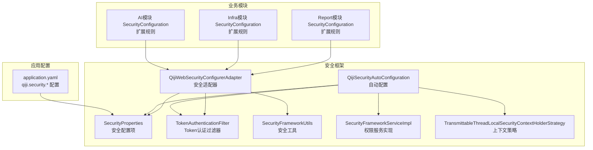
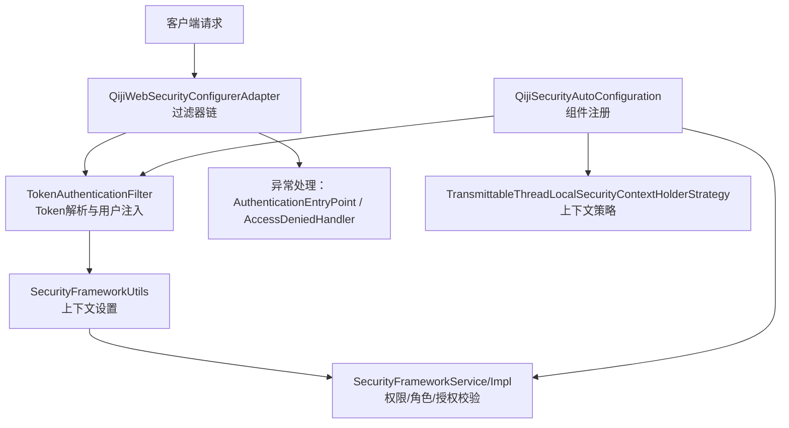
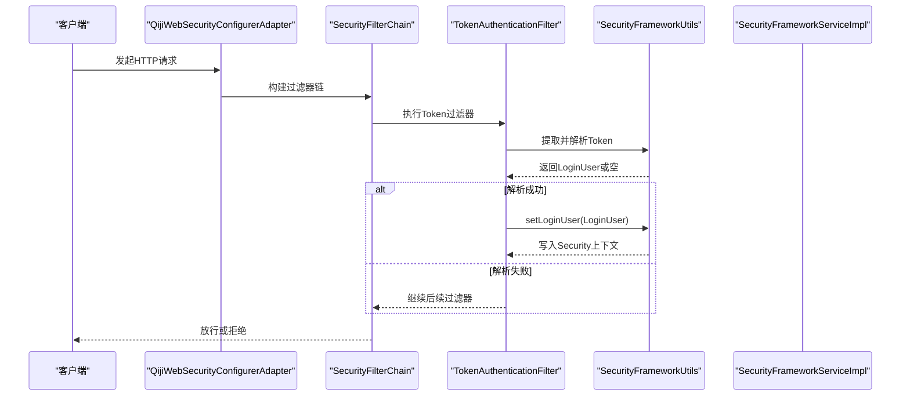
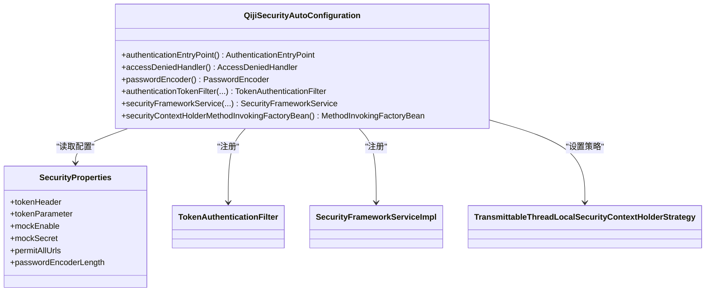
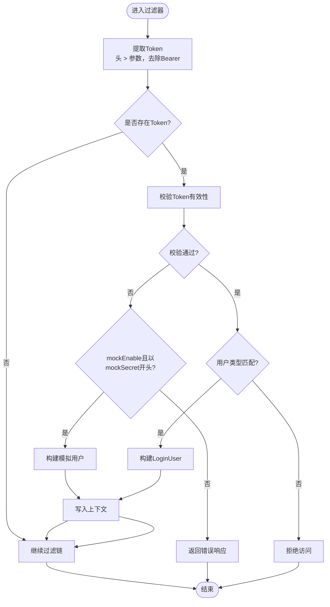
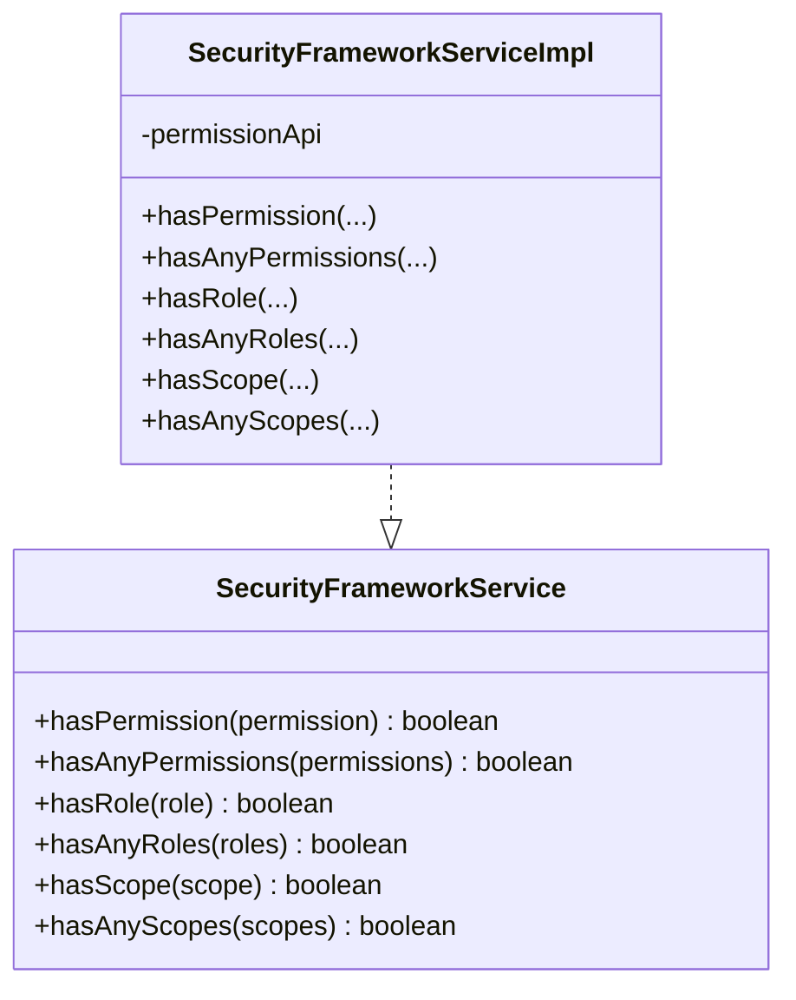
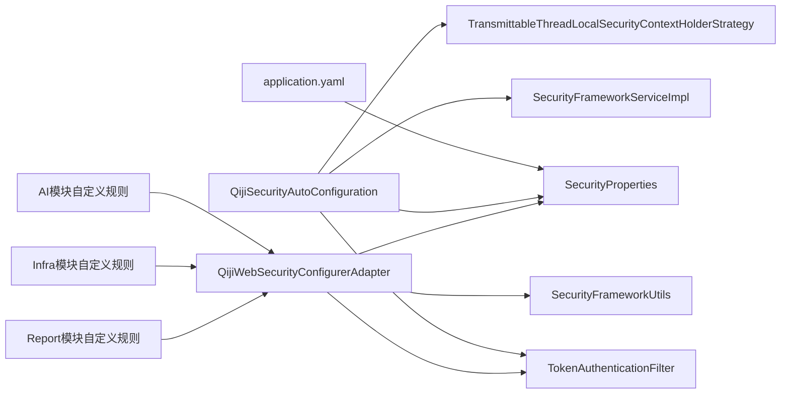

# 安全配置管理

<cite>
**本文引用的文件**
- [SecurityProperties.java](file://qiji-framework/qiji-spring-boot-starter-security/src/main/java/com.qiji.cps/framework/security/config/SecurityProperties.java)
- [QijiSecurityAutoConfiguration.java](file://qiji-framework/qiji-spring-boot-starter-security/src/main/java/com.qiji.cps/framework/security/config/QijiSecurityAutoConfiguration.java)
- [QijiWebSecurityConfigurerAdapter.java](file://qiji-framework/qiji-spring-boot-starter-security/src/main/java/com.qiji.cps/framework/security/config/QijiWebSecurityConfigurerAdapter.java)
- [TokenAuthenticationFilter.java](file://qiji-framework/qiji-spring-boot-starter-security/src/main/java/com.qiji.cps/framework/security/core/filter/TokenAuthenticationFilter.java)
- [SecurityFrameworkUtils.java](file://qiji-framework/qiji-spring-boot-starter-security/src/main/java/com.qiji.cps/framework/security/core/util/SecurityFrameworkUtils.java)
- [SecurityFrameworkService.java](file://qiji-framework/qiji-spring-boot-starter-security/src/main/java/com.qiji.cps/framework/security/core/service/SecurityFrameworkService.java)
- [SecurityFrameworkServiceImpl.java](file://qiji-framework/qiji-spring-boot-starter-security/src/main/java/com.qiji.cps/framework/security/core/service/SecurityFrameworkServiceImpl.java)
- [TransmittableThreadLocalSecurityContextHolderStrategy.java](file://qiji-framework/qiji-spring-boot-starter-security/src/main/java/com.qiji.cps/framework/security/core/context/TransmittableThreadLocalSecurityContextHolderStrategy.java)
- [application.yaml](file://qiji-server/src/main/resources/application.yaml)
- [SecurityConfiguration.java（AI模块）](file://qiji-module-ai/src/main/java/com.qiji.cps/module/ai/framework/security/config/SecurityConfiguration.java)
- [SecurityConfiguration.java（Infra模块）](file://qiji-module-infra/src/main/java/com.qiji.cps/module/infra/framework/security/config/SecurityConfiguration.java)
- [SecurityConfiguration.java（Report模块）](file://qiji-module-report/src/main/java/com.qiji.cps/module/report/framework/security/config/SecurityConfiguration.java)
</cite>

## 目录
1. [简介](#简介)
2. [项目结构](#项目结构)
3. [核心组件](#核心组件)
4. [架构总览](#架构总览)
5. [详细组件分析](#详细组件分析)
6. [依赖分析](#依赖分析)
7. [性能考量](#性能考量)
8. [故障排查指南](#故障排查指南)
9. [结论](#结论)
10. [附录](#附录)

## 简介
本文件面向AgenticCPS系统的安全配置管理，围绕Spring Security在项目中的配置机制展开，重点包括：
- 安全配置适配器QijiWebSecurityConfigurerAdapter的职责与实现
- SecurityProperties配置项的含义与使用方法
- 自动配置QijiSecurityAutoConfiguration的加载顺序与组件注册
- 安全过滤器链的配置、执行顺序、拦截规则与异常处理
- 安全配置的覆盖与扩展（自定义过滤器、自定义认证Provider思路）
- 最佳实践（生产环境加固、配置模板、故障排查）
- 版本兼容性与升级注意事项

## 项目结构
围绕安全配置的核心代码位于qiji-framework/qiji-spring-boot-starter-security模块，同时在各业务模块中通过AuthorizeRequestsCustomizer扩展安全规则。

**图表来源**
- [SecurityProperties.java:12-51](file://qiji-framework/qiji-spring-boot-starter-security/src/main/java/com.qiji.cps/framework/security/config/SecurityProperties.java#L12-L51)
- [QijiSecurityAutoConfiguration.java:32-95](file://qiji-framework/qiji-spring-boot-starter-security/src/main/java/com.qiji.cps/framework/security/config/QijiSecurityAutoConfiguration.java#L32-L95)
- [QijiWebSecurityConfigurerAdapter.java:46-222](file://qiji-framework/qiji-spring-boot-starter-security/src/main/java/com.qiji.cps/framework/security/config/QijiWebSecurityConfigurerAdapter.java#L46-L222)
- [TokenAuthenticationFilter.java:31-120](file://qiji-framework/qiji-spring-boot-starter-security/src/main/java/com.qiji.cps/framework/security/core/filter/TokenAuthenticationFilter.java#L31-L120)
- [SecurityFrameworkUtils.java:24-161](file://qiji-framework/qiji-spring-boot-starter-security/src/main/java/com.qiji.cps/framework/security/core/util/SecurityFrameworkUtils.java#L24-L161)
- [SecurityFrameworkService.java:8-60](file://qiji-framework/qiji-spring-boot-starter-security/src/main/java/com.qiji.cps/framework/security/core/service/SecurityFrameworkService.java#L8-L60)
- [SecurityFrameworkServiceImpl.java:19-85](file://qiji-framework/qiji-spring-boot-starter-security/src/main/java/com.qiji.cps/framework/security/core/service/SecurityFrameworkServiceImpl.java#L19-L85)
- [TransmittableThreadLocalSecurityContextHolderStrategy.java:15-49](file://qiji-framework/qiji-spring-boot-starter-security/src/main/java/com.qiji.cps/framework/security/core/context/TransmittableThreadLocalSecurityContextHolderStrategy.java#L15-L49)
- [SecurityConfiguration.java（AI模块）:17-43](file://qiji-module-ai/src/main/java/com.qiji.cps/module/ai/framework/security/config/SecurityConfiguration.java#L17-L43)
- [SecurityConfiguration.java（Infra模块）:12-39](file://qiji-module-infra/src/main/java/com.qiji.cps/module/infra/framework/security/config/SecurityConfiguration.java#L12-L39)
- [SecurityConfiguration.java（Report模块）:12-32](file://qiji-module-report/src/main/java/com.qiji.cps/module/report/framework/security/config/SecurityConfiguration.java#L12-L32)
- [application.yaml:272-281](file://qiji-server/src/main/resources/application.yaml#L272-L281)

**章节来源**
- [QijiSecurityAutoConfiguration.java:32-95](file://qiji-framework/qiji-spring-boot-starter-security/src/main/java/com.qiji.cps/framework/security/config/QijiSecurityAutoConfiguration.java#L32-L95)
- [QijiWebSecurityConfigurerAdapter.java:46-222](file://qiji-framework/qiji-spring-boot-starter-security/src/main/java/com.qiji.cps/framework/security/config/QijiWebSecurityConfigurerAdapter.java#L46-L222)
- [application.yaml:272-281](file://qiji-server/src/main/resources/application.yaml#L272-L281)

## 核心组件
- SecurityProperties：集中定义安全相关配置项，如Token请求头/参数、免登录URL列表、BCrypt加密复杂度、mock模式等。
- QijiSecurityAutoConfiguration：负责注册认证入口、权限不足处理器、PasswordEncoder、Token过滤器、权限服务以及Security上下文策略。
- QijiWebSecurityConfigurerAdapter：定义安全过滤器链、拦截规则、异常处理、基于注解的免登录URL收集等。
- TokenAuthenticationFilter：从请求中提取并解析Token，构建LoginUser并写入Security上下文，支持mock模式辅助开发。
- SecurityFrameworkUtils：提供从请求中提取Token、设置当前用户、获取用户信息等工具方法。
- SecurityFrameworkService/Impl：封装权限/角色/授权范围校验，结合权限中心API进行远程校验。
- TransmittableThreadLocalSecurityContextHolderStrategy：替换默认上下文策略，支持异步场景下的上下文传递。

**章节来源**
- [SecurityProperties.java:12-51](file://qiji-framework/qiji-spring-boot-starter-security/src/main/java/com.qiji.cps/framework/security/config/SecurityProperties.java#L12-L51)
- [QijiSecurityAutoConfiguration.java:32-95](file://qiji-framework/qiji-spring-boot-starter-security/src/main/java/com.qiji.cps/framework/security/config/QijiSecurityAutoConfiguration.java#L32-L95)
- [QijiWebSecurityConfigurerAdapter.java:46-222](file://qiji-framework/qiji-spring-boot-starter-security/src/main/java/com.qiji.cps/framework/security/config/QijiWebSecurityConfigurerAdapter.java#L46-L222)
- [TokenAuthenticationFilter.java:31-120](file://qiji-framework/qiji-spring-boot-starter-security/src/main/java/com.qiji.cps/framework/security/core/filter/TokenAuthenticationFilter.java#L31-L120)
- [SecurityFrameworkUtils.java:24-161](file://qiji-framework/qiji-spring-boot-starter-security/src/main/java/com.qiji.cps/framework/security/core/util/SecurityFrameworkUtils.java#L24-L161)
- [SecurityFrameworkService.java:8-60](file://qiji-framework/qiji-spring-boot-starter-security/src/main/java/com.qiji.cps/framework/security/core/service/SecurityFrameworkService.java#L8-L60)
- [SecurityFrameworkServiceImpl.java:19-85](file://qiji-framework/qiji-spring-boot-starter-security/src/main/java/com.qiji.cps/framework/security/core/service/SecurityFrameworkServiceImpl.java#L19-L85)
- [TransmittableThreadLocalSecurityContextHolderStrategy.java:15-49](file://qiji-framework/qiji-spring-boot-starter-security/src/main/java/com.qiji.cps/framework/security/core/context/TransmittableThreadLocalSecurityContextHolderStrategy.java#L15-L49)

## 架构总览
整体安全架构由自动配置装配组件、安全适配器定义规则、过滤器链执行、上下文策略与权限服务共同组成。

**图表来源**
- [QijiWebSecurityConfigurerAdapter.java:109-153](file://qiji-framework/qiji-spring-boot-starter-security/src/main/java/com.qiji.cps/framework/security/config/QijiWebSecurityConfigurerAdapter.java#L109-L153)
- [TokenAuthenticationFilter.java:40-69](file://qiji-framework/qiji-spring-boot-starter-security/src/main/java/com.qiji.cps/framework/security/core/filter/TokenAuthenticationFilter.java#L40-L69)
- [SecurityFrameworkUtils.java:122-133](file://qiji-framework/qiji-spring-boot-starter-security/src/main/java/com.qiji.cps/framework/security/core/util/SecurityFrameworkUtils.java#L122-L133)
- [SecurityFrameworkServiceImpl.java:24-82](file://qiji-framework/qiji-spring-boot-starter-security/src/main/java/com.qiji.cps/framework/security/core/service/SecurityFrameworkServiceImpl.java#L24-L82)
- [QijiSecurityAutoConfiguration.java:43-92](file://qiji-framework/qiji-spring-boot-starter-security/src/main/java/com.qiji.cps/framework/security/config/QijiSecurityAutoConfiguration.java#L43-L92)
- [TransmittableThreadLocalSecurityContextHolderStrategy.java:15-49](file://qiji-framework/qiji-spring-boot-starter-security/src/main/java/com.qiji.cps/framework/security/core/context/TransmittableThreadLocalSecurityContextHolderStrategy.java#L15-L49)

## 详细组件分析

### 安全配置适配器：QijiWebSecurityConfigurerAdapter
- 责任边界
  - 定义SecurityFilterChain，禁用CSRF、禁用Session、允许跨域、配置异常处理器
  - 收集@PermitAll注解的URL并加入免登录白名单
  - 合并qiji.security.permit-all-urls配置与自定义AuthorizeRequestsCustomizer
  - 任何未匹配请求均需认证
  - 在UsernamePasswordAuthenticationFilter之前插入TokenAuthenticationFilter
- 关键点
  - 使用@EnableMethodSecurity(securedEnabled = true)启用方法级权限
  - 通过authorizeRequestsCustomizers扩展业务模块的放行规则
  - DispatcherType.ASYNC放行，满足SSE/WebFlux场景

**图表来源**
- [QijiWebSecurityConfigurerAdapter.java:109-153](file://qiji-framework/qiji-spring-boot-starter-security/src/main/java/com.qiji.cps/framework/security/config/QijiWebSecurityConfigurerAdapter.java#L109-L153)
- [TokenAuthenticationFilter.java:40-69](file://qiji-framework/qiji-spring-boot-starter-security/src/main/java/com.qiji.cps/framework/security/core/filter/TokenAuthenticationFilter.java#L40-L69)
- [SecurityFrameworkUtils.java:122-133](file://qiji-framework/qiji-spring-boot-starter-security/src/main/java/com.qiji.cps/framework/security/core/util/SecurityFrameworkUtils.java#L122-L133)

**章节来源**
- [QijiWebSecurityConfigurerAdapter.java:46-222](file://qiji-framework/qiji-spring-boot-starter-security/src/main/java/com.qiji.cps/framework/security/config/QijiWebSecurityConfigurerAdapter.java#L46-L222)

### 自动配置：QijiSecurityAutoConfiguration
- 组件注册
  - AuthenticationEntryPoint与AccessDeniedHandler
  - PasswordEncoder（BCrypt，复杂度来自SecurityProperties）
  - TokenAuthenticationFilter（依赖SecurityProperties、GlobalExceptionHandler、OAuth2TokenCommonApi）
  - SecurityFrameworkService（权限服务实现）
  - SecurityContextHolder策略替换为TransmittableThreadLocal
- 加载顺序
  - @AutoConfigureOrder(-1)确保早于Spring Security默认自动配置，避免基础包扫描问题

**图表来源**
- [QijiSecurityAutoConfiguration.java:32-95](file://qiji-framework/qiji-spring-boot-starter-security/src/main/java/com.qiji.cps/framework/security/config/QijiSecurityAutoConfiguration.java#L32-L95)
- [SecurityProperties.java:12-51](file://qiji-framework/qiji-spring-boot-starter-security/src/main/java/com.qiji.cps/framework/security/config/SecurityProperties.java#L12-L51)
- [TokenAuthenticationFilter.java:31-120](file://qiji-framework/qiji-spring-boot-starter-security/src/main/java/com.qiji.cps/framework/security/core/filter/TokenAuthenticationFilter.java#L31-L120)
- [SecurityFrameworkServiceImpl.java:19-85](file://qiji-framework/qiji-spring-boot-starter-security/src/main/java/com.qiji.cps/framework/security/core/service/SecurityFrameworkServiceImpl.java#L19-L85)
- [TransmittableThreadLocalSecurityContextHolderStrategy.java:15-49](file://qiji-framework/qiji-spring-boot-starter-security/src/main/java/com.qiji.cps/framework/security/core/context/TransmittableThreadLocalSecurityContextHolderStrategy.java#L15-L49)

**章节来源**
- [QijiSecurityAutoConfiguration.java:32-95](file://qiji-framework/qiji-spring-boot-starter-security/src/main/java/com.qiji.cps/framework/security/config/QijiSecurityAutoConfiguration.java#L32-L95)

### Token认证过滤器：TokenAuthenticationFilter
- 功能
  - 从请求头或参数提取Token（优先头，再参数），去除Bearer前缀
  - 调用OAuth2TokenCommonApi校验Token，构建LoginUser并写入上下文
  - 支持mock模式（仅开发环境），通过SecurityProperties.mockSecret前缀识别
  - 异常统一交由GlobalExceptionHandler处理并返回JSON
- 关键点
  - 与SecurityFrameworkUtils配合完成上下文注入
  - 对WebSocket等无userType的路径不强制用户类型校验

**图表来源**
- [TokenAuthenticationFilter.java:40-117](file://qiji-framework/qiji-spring-boot-starter-security/src/main/java/com.qiji.cps/framework/security/core/filter/TokenAuthenticationFilter.java#L40-L117)
- [SecurityFrameworkUtils.java:41-54](file://qiji-framework/qiji-spring-boot-starter-security/src/main/java/com.qiji.cps/framework/security/core/util/SecurityFrameworkUtils.java#L41-L54)

**章节来源**
- [TokenAuthenticationFilter.java:31-120](file://qiji-framework/qiji-spring-boot-starter-security/src/main/java/com.qiji.cps/framework/security/core/filter/TokenAuthenticationFilter.java#L31-L120)
- [SecurityFrameworkUtils.java:24-161](file://qiji-framework/qiji-spring-boot-starter-security/src/main/java/com.qiji.cps/framework/security/core/util/SecurityFrameworkUtils.java#L24-L161)

### 权限服务：SecurityFrameworkService/Impl
- 能力
  - hasPermission/hasAnyPermissions：基于用户ID与权限集合校验
  - hasRole/hasAnyRoles：基于角色集合校验
  - hasScope/hasAnyScopes：基于授权范围集合校验
- 特殊逻辑
  - 跨租户访问时跳过权限校验（避免越权）

**图表来源**
- [SecurityFrameworkService.java:8-60](file://qiji-framework/qiji-spring-boot-starter-security/src/main/java/com.qiji.cps/framework/security/core/service/SecurityFrameworkService.java#L8-L60)
- [SecurityFrameworkServiceImpl.java:19-85](file://qiji-framework/qiji-spring-boot-starter-security/src/main/java/com.qiji.cps/framework/security/core/service/SecurityFrameworkServiceImpl.java#L19-L85)

**章节来源**
- [SecurityFrameworkService.java:8-60](file://qiji-framework/qiji-spring-boot-starter-security/src/main/java/com.qiji.cps/framework/security/core/service/SecurityFrameworkService.java#L8-L60)
- [SecurityFrameworkServiceImpl.java:19-85](file://qiji-framework/qiji-spring-boot-starter-security/src/main/java/com.qiji.cps/framework/security/core/service/SecurityFrameworkServiceImpl.java#L19-L85)

### 安全工具：SecurityFrameworkUtils
- 能力
  - 从请求中提取Token（支持头与参数）
  - 获取当前认证信息、当前用户、用户ID、昵称、部门ID
  - 将LoginUser写入SecurityContext，并同步到Web上下文
  - 跨租户访问时的权限跳过判断

**章节来源**
- [SecurityFrameworkUtils.java:24-161](file://qiji-framework/qiji-spring-boot-starter-security/src/main/java/com.qiji.cps/framework/security/core/util/SecurityFrameworkUtils.java#L24-L161)

### 上下文策略：TransmittableThreadLocalSecurityContextHolderStrategy
- 目标
  - 替换默认SecurityContext持有策略，使用TransmittableThreadLocal避免@Async等异步场景丢失上下文
- 影响
  - 保障跨线程场景下的用户身份与租户信息可用

**章节来源**
- [TransmittableThreadLocalSecurityContextHolderStrategy.java:15-49](file://qiji-framework/qiji-spring-boot-starter-security/src/main/java/com.qiji.cps/framework/security/core/context/TransmittableThreadLocalSecurityContextHolderStrategy.java#L15-L49)

### 配置项详解：SecurityProperties
- tokenHeader：Token请求头名称（默认Authorization）
- tokenParameter：Token请求参数名（默认token，用于WebSocket等无法通过Header传参的场景）
- mockEnable：mock模式开关（默认false，仅开发环境）
- mockSecret：mock模式密钥（默认test，需在启用mock时自定义）
- permitAllUrls：免登录URL列表（支持通配符）
- passwordEncoderLength：BCrypt加密复杂度（越大开销越大）

**章节来源**
- [SecurityProperties.java:12-51](file://qiji-framework/qiji-spring-boot-starter-security/src/main/java/com.qiji.cps/framework/security/config/SecurityProperties.java#L12-L51)
- [application.yaml:272-281](file://qiji-server/src/main/resources/application.yaml#L272-L281)

### 自定义扩展：AuthorizeRequestsCustomizer
- 机制
  - 通过实现AuthorizeRequestsCustomizer并注入容器，即可在QijiWebSecurityConfigurerAdapter中被扫描并应用
- 示例
  - AI模块：放行MCP SSE与Streamable HTTP端点
  - Infra模块：放行Swagger、Actuator、Druid、文件读取等
  - Report模块：放行积木报表与仪表盘相关路径

**章节来源**
- [QijiWebSecurityConfigurerAdapter.java:77-78](file://qiji-framework/qiji-spring-boot-starter-security/src/main/java/com.qiji.cps/framework/security/config/QijiWebSecurityConfigurerAdapter.java#L77-L78)
- [SecurityConfiguration.java（AI模块）:17-43](file://qiji-module-ai/src/main/java/com.qiji.cps/module/ai/framework/security/config/SecurityConfiguration.java#L17-L43)
- [SecurityConfiguration.java（Infra模块）:12-39](file://qiji-module-infra/src/main/java/com.qiji.cps/module/infra/framework/security/config/SecurityConfiguration.java#L12-L39)
- [SecurityConfiguration.java（Report模块）:12-32](file://qiji-module-report/src/main/java/com.qiji.cps/module/report/framework/security/config/SecurityConfiguration.java#L12-L32)

## 依赖分析
- 组件耦合
  - QijiSecurityAutoConfiguration集中注册核心组件，降低适配器与外部依赖的耦合
  - TokenAuthenticationFilter依赖SecurityProperties、GlobalExceptionHandler、OAuth2TokenCommonApi
  - SecurityFrameworkServiceImpl依赖PermissionCommonApi进行权限校验
- 依赖链
  - application.yaml -> SecurityProperties
  - AutoConfiguration -> SecurityProperties/TokenFilter/SecurityService/Strategy
  - WebSecurityConfigurerAdapter -> TokenFilter/SecurityProperties/Utils/Customizers
  - Customizers -> Adapter（扩展规则）

**图表来源**
- [application.yaml:272-281](file://qiji-server/src/main/resources/application.yaml#L272-L281)
- [QijiSecurityAutoConfiguration.java:32-95](file://qiji-framework/qiji-spring-boot-starter-security/src/main/java/com.qiji.cps/framework/security/config/QijiSecurityAutoConfiguration.java#L32-L95)
- [QijiWebSecurityConfigurerAdapter.java:46-222](file://qiji-framework/qiji-spring-boot-starter-security/src/main/java/com.qiji.cps/framework/security/config/QijiWebSecurityConfigurerAdapter.java#L46-L222)
- [TokenAuthenticationFilter.java:31-120](file://qiji-framework/qiji-spring-boot-starter-security/src/main/java/com.qiji.cps/framework/security/core/filter/TokenAuthenticationFilter.java#L31-L120)
- [SecurityFrameworkServiceImpl.java:19-85](file://qiji-framework/qiji-spring-boot-starter-security/src/main/java/com.qiji.cps/framework/security/core/service/SecurityFrameworkServiceImpl.java#L19-L85)
- [TransmittableThreadLocalSecurityContextHolderStrategy.java:15-49](file://qiji-framework/qiji-spring-boot-starter-security/src/main/java/com.qiji.cps/framework/security/core/context/TransmittableThreadLocalSecurityContextHolderStrategy.java#L15-L49)
- [SecurityConfiguration.java（AI模块）:17-43](file://qiji-module-ai/src/main/java/com.qiji.cps/module/ai/framework/security/config/SecurityConfiguration.java#L17-L43)
- [SecurityConfiguration.java（Infra模块）:12-39](file://qiji-module-infra/src/main/java/com.qiji.cps/module/infra/framework/security/config/SecurityConfiguration.java#L12-L39)
- [SecurityConfiguration.java（Report模块）:12-32](file://qiji-module-report/src/main/java/com.qiji.cps/module/report/framework/security/config/SecurityConfiguration.java#L12-L32)

**章节来源**
- [QijiSecurityAutoConfiguration.java:32-95](file://qiji-framework/qiji-spring-boot-starter-security/src/main/java/com.qiji.cps/framework/security/config/QijiSecurityAutoConfiguration.java#L32-L95)
- [QijiWebSecurityConfigurerAdapter.java:46-222](file://qiji-framework/qiji-spring-boot-starter-security/src/main/java/com.qiji.cps/framework/security/config/QijiWebSecurityConfigurerAdapter.java#L46-L222)

## 性能考量
- 密码加密复杂度
  - passwordEncoderLength越大，CPU开销越高，建议在生产环境根据服务器性能合理调整
- Token解析与校验
  - TokenAuthenticationFilter每次请求都会尝试解析与校验，建议优化OAuth2TokenCommonApi的调用链路与缓存
- 过滤器链顺序
  - 将高成本的Token校验放在早期，避免对免登录路径造成不必要的开销
- 异步上下文
  - 使用TransmittableThreadLocal策略避免上下文丢失带来的重复查询或重建

[本节为通用指导，不直接分析具体文件]

## 故障排查指南
- 无法获取用户信息
  - 检查Token是否正确传递（头或参数），确认SecurityProperties.tokenHeader/tokenParameter配置一致
  - 确认TokenAuthenticationFilter是否被正确加入过滤器链
- 权限校验异常
  - 检查SecurityFrameworkServiceImpl的权限/角色/授权范围调用链
  - 确认跨租户访问时的skipPermissionCheck逻辑
- mock模式无效
  - 确认application.yaml中qiji.security.mockEnable=true且mockSecret配置正确
- 自定义放行规则不生效
  - 检查AuthorizeRequestsCustomizer是否被容器发现并注入
  - 确认QijiWebSecurityConfigurerAdapter的自定义规则合并逻辑

**章节来源**
- [TokenAuthenticationFilter.java:40-117](file://qiji-framework/qiji-spring-boot-starter-security/src/main/java/com.qiji.cps/framework/security/core/filter/TokenAuthenticationFilter.java#L40-L117)
- [SecurityFrameworkServiceImpl.java:24-82](file://qiji-framework/qiji-spring-boot-starter-security/src/main/java/com.qiji.cps/framework/security/core/service/SecurityFrameworkServiceImpl.java#L24-L82)
- [QijiWebSecurityConfigurerAdapter.java:143-148](file://qiji-framework/qiji-spring-boot-starter-security/src/main/java/com.qiji.cps/framework/security/config/QijiWebSecurityConfigurerAdapter.java#L143-L148)
- [application.yaml:272-281](file://qiji-server/src/main/resources/application.yaml#L272-L281)

## 结论
AgenticCPS的安全配置以QijiSecurityAutoConfiguration与QijiWebSecurityConfigurerAdapter为核心，通过SecurityProperties集中管理配置，借助TokenAuthenticationFilter与SecurityFrameworkService实现统一的认证与授权。业务模块通过AuthorizeRequestsCustomizer灵活扩展放行规则，配合TransmittableThreadLocal策略保障异步场景下的上下文一致性。生产环境建议严格关闭mock模式、合理设置BCrypt复杂度与放行规则，持续监控权限校验链路与Token解析性能。

[本节为总结性内容，不直接分析具体文件]

## 附录

### 安全配置最佳实践
- 生产环境加固
  - 关闭mock模式（mockEnable=false）
  - 设置强mockSecret（仅在开发环境启用）
  - 合理设置passwordEncoderLength，兼顾安全与性能
  - 严格控制permitAllUrls，仅放行必要接口
- 配置模板
  - application.yaml中建议显式配置qiji.security.*相关项
  - 业务模块通过AuthorizeRequestsCustomizer按需放行
- 故障排查清单
  - Token头/参数是否正确传递
  - OAuth2TokenCommonApi连通性与超时设置
  - 权限中心接口返回与缓存命中率
  - 跨租户访问场景的特殊处理

**章节来源**
- [application.yaml:272-281](file://qiji-server/src/main/resources/application.yaml#L272-L281)
- [SecurityProperties.java:12-51](file://qiji-framework/qiji-spring-boot-starter-security/src/main/java/com.qiji.cps/framework/security/config/SecurityProperties.java#L12-L51)
- [QijiSecurityAutoConfiguration.java:62-65](file://qiji-framework/qiji-spring-boot-starter-security/src/main/java/com.qiji.cps/framework/security/config/QijiSecurityAutoConfiguration.java#L62-L65)

### 版本兼容性与升级注意事项
- Spring Security版本
  - 保持与Spring Boot版本配套，关注@EnableWebSecurity与WebSecurityConfigurerAdapter的废弃风险，优先使用新的配置模型
- 自动配置顺序
  - 保持@AutoConfigureOrder(-1)以确保早于Spring Security默认配置
- 过滤器链变更
  - 新增过滤器需明确插入位置，避免破坏现有认证/授权流程
- 上下文策略
  - 若更换SecurityContext策略，需评估异步场景下的上下文传递

[本节为通用指导，不直接分析具体文件]