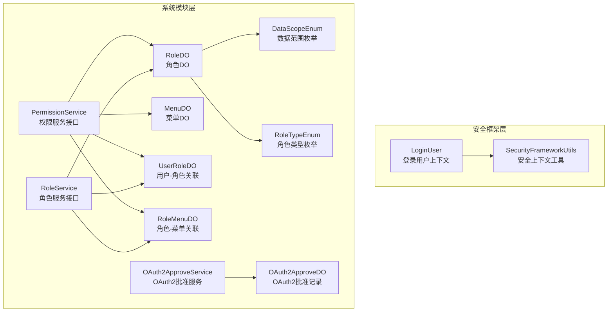
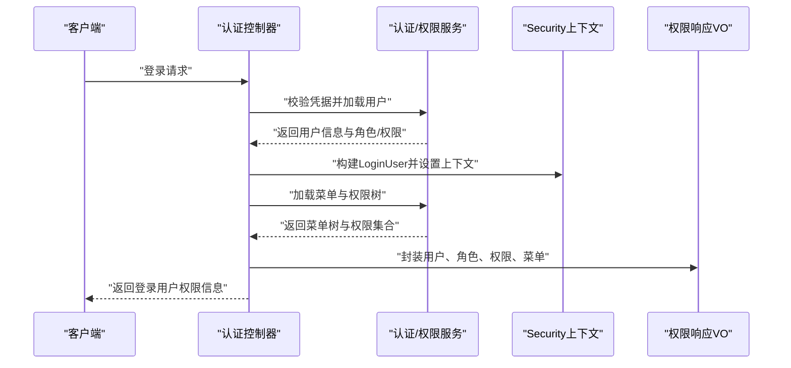
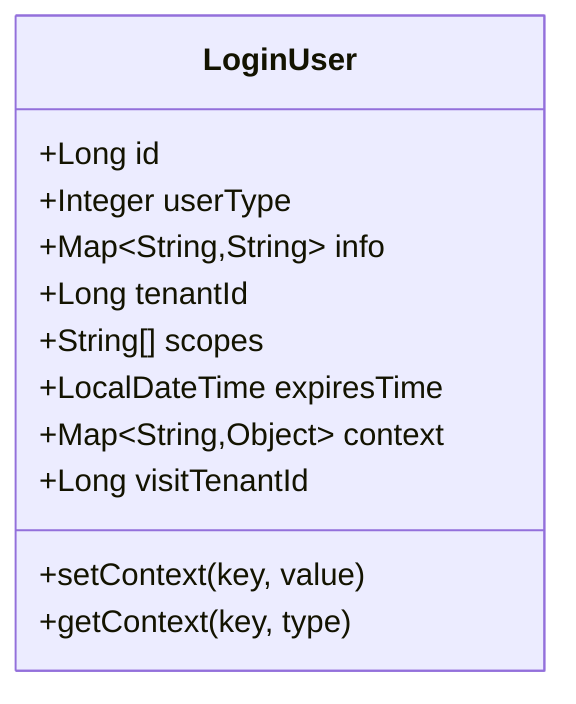
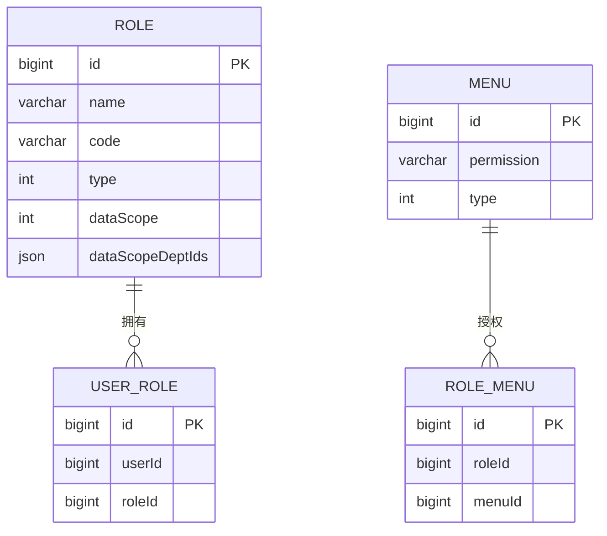
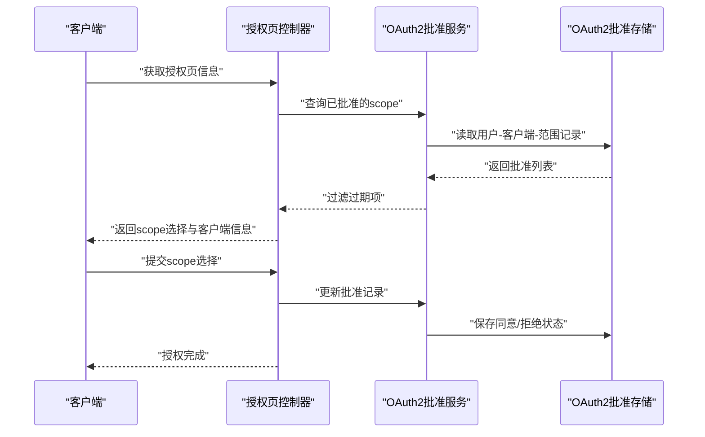
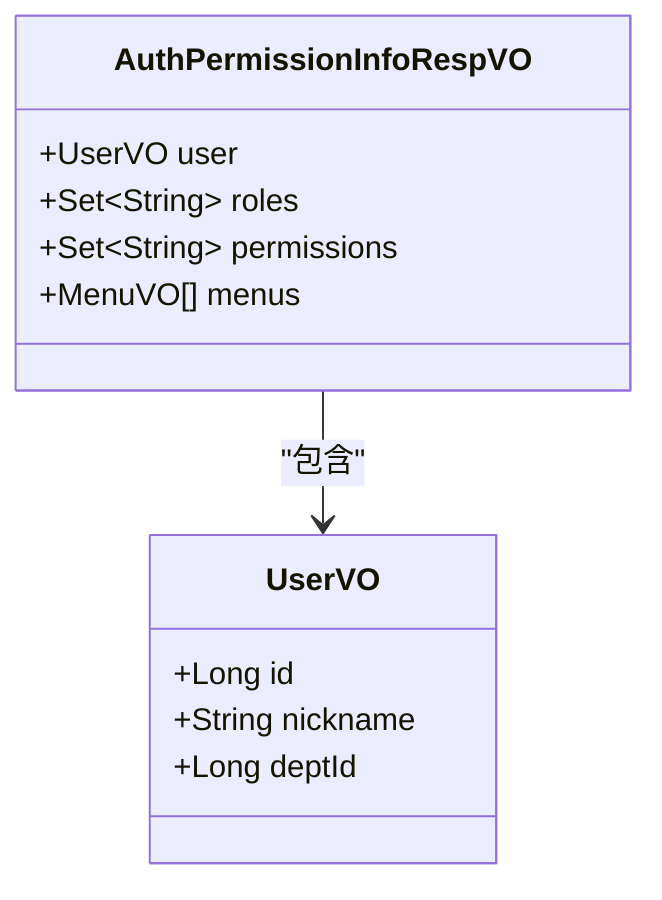
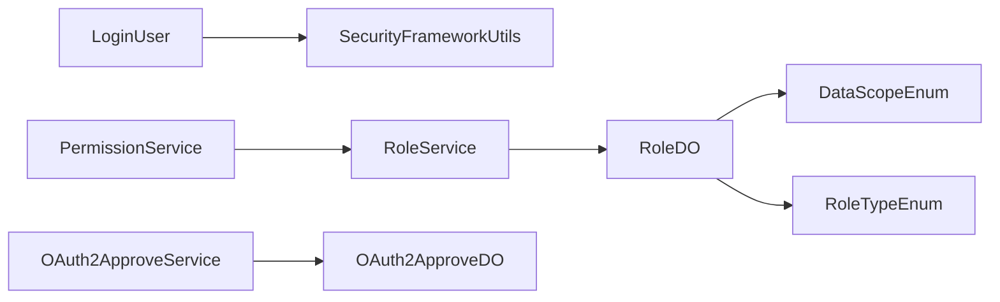
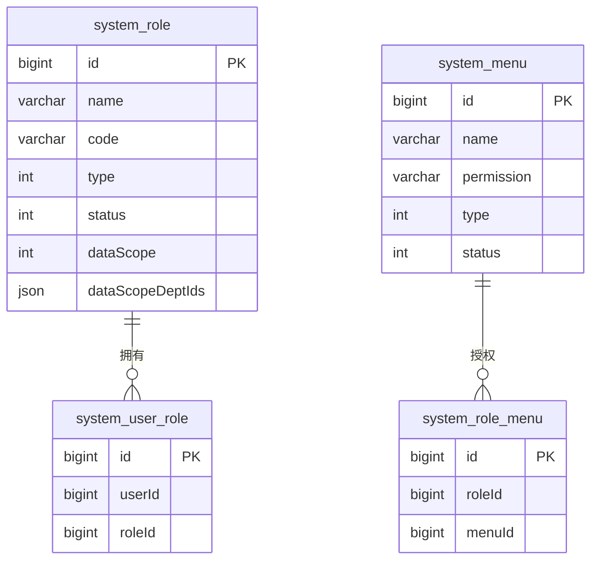

# RBAC模型设计

<cite>
**本文引用的文件**
- [LoginUser.java](file://yudao-framework/yudao-spring-boot-starter-security/src/main/java/cn/iocoder/yudao/framework/security/core/LoginUser.java)
- [SecurityFrameworkUtils.java](file://yudao-framework/yudao-spring-boot-starter-security/src/main/java/cn/iocoder/yudao/framework/security/core/util/SecurityFrameworkUtils.java)
- [PermissionService.java](file://yudao-module-system/src/main/java/cn/iocoder/yudao/module/system/service/permission/PermissionService.java)
- [RoleService.java](file://yudao-module-system/src/main/java/cn/iocoder/yudao/module/system/service/permission/RoleService.java)
- [RoleDO.java](file://yudao-module-system/src/main/java/cn/iocoder/yudao/module/system/dal/dataobject/permission/RoleDO.java)
- [MenuDO.java](file://yudao-module-system/src/main/java/cn/iocoder/yudao/module/system/dal/dataobject/permission/MenuDO.java)
- [UserRoleDO.java](file://yudao-module-system/src/main/java/cn/iocoder/yudao/module/system/dal/dataobject/permission/UserRoleDO.java)
- [RoleMenuDO.java](file://yudao-module-system/src/main/java/cn/iocoder/yudao/module/system/dal/dataobject/permission/RoleMenuDO.java)
- [DataScopeEnum.java](file://yudao-module-system/src/main/java/cn/iocoder/yudao/module/system/enums/permission/DataScopeEnum.java)
- [RoleTypeEnum.java](file://yudao-module-system/src/main/java/cn/iocoder/yudao/module/system/enums/permission/RoleTypeEnum.java)
- [AuthPermissionInfoRespVO.java](file://yudao-module-system/src/main/java/cn/iocoder/yudao/module/system/controller/admin/auth/vo/AuthPermissionInfoRespVO.java)
- [OAuth2ApproveDO.java](file://yudao-module-system/src/main/java/cn/iocoder/yudao/module/system/dal/dataobject/oauth2/OAuth2ApproveDO.java)
- [OAuth2ApproveService.java](file://yudao-module-system/src/main/java/cn/iocoder/yudao/module/system/service/oauth2/OAuth2ApproveService.java)
- [OAuth2OpenAuthorizeInfoRespVO.java](file://yudao-module-system/src/main/java/cn/iocoder/yudao/module/system/controller/admin/oauth2/vo/open/OAuth2OpenAuthorizeInfoRespVO.java)
- [OAuth2OpenControllerTest.java](file://yudao-module-system/src/test/java/cn/iocoder/yudao/module/system/controller/admin/oauth2/OAuth2OpenControllerTest.java)
</cite>

## 目录
1. [简介](#简介)
2. [项目结构](#项目结构)
3. [核心组件](#核心组件)
4. [架构总览](#架构总览)
5. [详细组件分析](#详细组件分析)
6. [依赖分析](#依赖分析)
7. [性能考虑](#性能考虑)
8. [故障排查指南](#故障排查指南)
9. [结论](#结论)
10. [附录](#附录)

## 简介
本文件面向AgenticCPS系统的RBAC（基于角色的访问控制）模型设计，围绕“用户-角色-权限”三元组展开，结合LoginUser用户上下文对象、角色与权限映射、数据范围（Scope）与OAuth2授权范围的应用，给出数据库设计、关键流程与最佳实践。文档同时提供系统架构图、类图与序列图，帮助读者快速理解并落地实现。

## 项目结构
本RBAC能力主要分布在系统模块与安全框架两个层面：
- 安全框架层：提供LoginUser上下文、认证上下文工具、线程本地策略等基础能力
- 系统模块层：提供权限、角色、菜单、用户-角色、角色-菜单等DO与接口，以及OAuth2授权范围相关能力

**图表来源**
- [LoginUser.java:1-76](file://yudao-framework/yudao-spring-boot-starter-security/src/main/java/cn/iocoder/yudao/framework/security/core/LoginUser.java#L1-L76)
- [SecurityFrameworkUtils.java:76-143](file://yudao-framework/yudao-spring-boot-starter-security/src/main/java/cn/iocoder/yudao/framework/security/core/util/SecurityFrameworkUtils.java#L76-L143)
- [PermissionService.java:1-147](file://yudao-module-system/src/main/java/cn/iocoder/yudao/module/system/service/permission/PermissionService.java#L1-L147)
- [RoleService.java:1-132](file://yudao-module-system/src/main/java/cn/iocoder/yudao/module/system/service/permission/RoleService.java#L1-L132)
- [RoleDO.java:1-79](file://yudao-module-system/src/main/java/cn/iocoder/yudao/module/system/dal/dataobject/permission/RoleDO.java#L1-L79)
- [MenuDO.java:1-110](file://yudao-module-system/src/main/java/cn/iocoder/yudao/module/system/dal/dataobject/permission/MenuDO.java#L1-L110)
- [UserRoleDO.java:1-36](file://yudao-module-system/src/main/java/cn/iocoder/yudao/module/system/dal/dataobject/permission/UserRoleDO.java#L1-L36)
- [RoleMenuDO.java:1-36](file://yudao-module-system/src/main/java/cn/iocoder/yudao/module/system/dal/dataobject/permission/RoleMenuDO.java#L1-L36)
- [DataScopeEnum.java:1-41](file://yudao-module-system/src/main/java/cn/iocoder/yudao/module/system/enums/permission/DataScopeEnum.java#L1-L41)
- [RoleTypeEnum.java:1-22](file://yudao-module-system/src/main/java/cn/iocoder/yudao/module/system/enums/permission/RoleTypeEnum.java#L1-L22)
- [OAuth2ApproveDO.java:1-63](file://yudao-module-system/src/main/java/cn/iocoder/yudao/module/system/dal/dataobject/oauth2/OAuth2ApproveDO.java#L1-L63)
- [OAuth2ApproveService.java:1-39](file://yudao-module-system/src/main/java/cn/iocoder/yudao/module/system/service/oauth2/OAuth2ApproveService.java#L1-L39)

**章节来源**
- [LoginUser.java:1-76](file://yudao-framework/yudao-spring-boot-starter-security/src/main/java/cn/iocoder/yudao/framework/security/core/LoginUser.java#L1-L76)
- [PermissionService.java:1-147](file://yudao-module-system/src/main/java/cn/iocoder/yudao/module/system/service/permission/PermissionService.java#L1-L147)
- [RoleService.java:1-132](file://yudao-module-system/src/main/java/cn/iocoder/yudao/module/system/service/permission/RoleService.java#L1-L132)

## 核心组件
- LoginUser：登录用户上下文对象，承载用户标识、用户类型、扩展信息、租户信息、授权范围、过期时间等，贯穿认证与鉴权全流程
- PermissionService：统一的权限服务接口，负责用户-角色、角色-菜单、用户-部门（数据范围）的授权判定与维护
- RoleService：角色管理接口，负责角色的创建、更新、删除、分页、数据范围配置等
- RoleDO/MenuDO/UserRoleDO/RoleMenuDO：RBAC核心数据模型，分别表示角色、菜单、用户-角色关联、角色-菜单关联
- DataScopeEnum/RoleTypeEnum：角色与数据范围的枚举定义
- OAuth2ApproveDO/OAuth2ApproveService：OAuth2授权范围的记录与审批逻辑

**章节来源**
- [LoginUser.java:1-76](file://yudao-framework/yudao-spring-boot-starter-security/src/main/java/cn/iocoder/yudao/framework/security/core/LoginUser.java#L1-L76)
- [PermissionService.java:1-147](file://yudao-module-system/src/main/java/cn/iocoder/yudao/module/system/service/permission/PermissionService.java#L1-L147)
- [RoleService.java:1-132](file://yudao-module-system/src/main/java/cn/iocoder/yudao/module/system/service/permission/RoleService.java#L1-L132)
- [RoleDO.java:1-79](file://yudao-module-system/src/main/java/cn/iocoder/yudao/module/system/dal/dataobject/permission/RoleDO.java#L1-L79)
- [MenuDO.java:1-110](file://yudao-module-system/src/main/java/cn/iocoder/yudao/module/system/dal/dataobject/permission/MenuDO.java#L1-L110)
- [UserRoleDO.java:1-36](file://yudao-module-system/src/main/java/cn/iocoder/yudao/module/system/dal/dataobject/permission/UserRoleDO.java#L1-L36)
- [RoleMenuDO.java:1-36](file://yudao-module-system/src/main/java/cn/iocoder/yudao/module/system/dal/dataobject/permission/RoleMenuDO.java#L1-L36)
- [DataScopeEnum.java:1-41](file://yudao-module-system/src/main/java/cn/iocoder/yudao/module/system/enums/permission/DataScopeEnum.java#L1-L41)
- [RoleTypeEnum.java:1-22](file://yudao-module-system/src/main/java/cn/iocoder/yudao/module/system/enums/permission/RoleTypeEnum.java#L1-L22)
- [OAuth2ApproveDO.java:1-63](file://yudao-module-system/src/main/java/cn/iocoder/yudao/module/system/dal/dataobject/oauth2/OAuth2ApproveDO.java#L1-L63)
- [OAuth2ApproveService.java:1-39](file://yudao-module-system/src/main/java/cn/iocoder/yudao/module/system/service/oauth2/OAuth2ApproveService.java#L1-L39)

## 架构总览
RBAC在AgenticCPS中的运行时架构：
- 登录阶段：认证成功后构建LoginUser并注入Security上下文
- 鉴权阶段：通过PermissionService/RoleService查询用户的角色与权限，结合菜单权限与数据范围进行判定
- OAuth2阶段：记录用户对客户端的授权范围，后续访问时按范围放行或提示

**图表来源**
- [AuthPermissionInfoRespVO.java:1-40](file://yudao-module-system/src/main/java/cn/iocoder/yudao/module/system/controller/admin/auth/vo/AuthPermissionInfoRespVO.java#L1-L40)
- [SecurityFrameworkUtils.java:76-143](file://yudao-framework/yudao-spring-boot-starter-security/src/main/java/cn/iocoder/yudao/framework/security/core/util/SecurityFrameworkUtils.java#L76-L143)
- [PermissionService.java:1-147](file://yudao-module-system/src/main/java/cn/iocoder/yudao/module/system/service/permission/PermissionService.java#L1-L147)

## 详细组件分析

### LoginUser用户上下文对象
- 结构要点
  - 用户标识与类型：id、userType
  - 扩展信息：info（如昵称、部门ID等键值）
  - 租户维度：tenantId、visitTenantId
  - 授权范围：scopes（OAuth2授权范围）
  - 过期时间：expiresTime
  - 上下文缓存：context（非持久化，用于临时缓存）
- 作用
  - 作为认证后的主体，贯穿鉴权、日志、数据权限等环节
  - 通过SecurityFrameworkUtils便捷获取当前用户信息

**图表来源**
- [LoginUser.java:1-76](file://yudao-framework/yudao-spring-boot-starter-security/src/main/java/cn/iocoder/yudao/framework/security/core/LoginUser.java#L1-L76)

**章节来源**
- [LoginUser.java:1-76](file://yudao-framework/yudao-spring-boot-starter-security/src/main/java/cn/iocoder/yudao/framework/security/core/LoginUser.java#L1-L76)
- [SecurityFrameworkUtils.java:76-143](file://yudao-framework/yudao-spring-boot-starter-security/src/main/java/cn/iocoder/yudao/framework/security/core/util/SecurityFrameworkUtils.java#L76-L143)

### 权限与角色映射
- 用户-角色：通过UserRoleDO建立用户与角色的多对多关系
- 角色-菜单：通过RoleMenuDO建立角色与菜单的多对多关系
- 权限来源：MenuDO.permission即为权限标识；PermissionService提供权限判定与维护
- 数据范围：RoleDO.dataScope与dataScopeDeptIds决定角色的数据可见范围，结合DataScopeEnum实现“全部/本部门/本部门及子部门/仅本人”等策略

**图表来源**
- [UserRoleDO.java:1-36](file://yudao-module-system/src/main/java/cn/iocoder/yudao/module/system/dal/dataobject/permission/UserRoleDO.java#L1-L36)
- [RoleMenuDO.java:1-36](file://yudao-module-system/src/main/java/cn/iocoder/yudao/module/system/dal/dataobject/permission/RoleMenuDO.java#L1-L36)
- [RoleDO.java:1-79](file://yudao-module-system/src/main/java/cn/iocoder/yudao/module/system/dal/dataobject/permission/RoleDO.java#L1-L79)
- [MenuDO.java:1-110](file://yudao-module-system/src/main/java/cn/iocoder/yudao/module/system/dal/dataobject/permission/MenuDO.java#L1-L110)

**章节来源**
- [PermissionService.java:1-147](file://yudao-module-system/src/main/java/cn/iocoder/yudao/module/system/service/permission/PermissionService.java#L1-L147)
- [RoleService.java:1-132](file://yudao-module-system/src/main/java/cn/iocoder/yudao/module/system/service/permission/RoleService.java#L1-L132)
- [RoleDO.java:1-79](file://yudao-module-system/src/main/java/cn/iocoder/yudao/module/system/dal/dataobject/permission/RoleDO.java#L1-L79)
- [MenuDO.java:1-110](file://yudao-module-system/src/main/java/cn/iocoder/yudao/module/system/dal/dataobject/permission/MenuDO.java#L1-L110)
- [UserRoleDO.java:1-36](file://yudao-module-system/src/main/java/cn/iocoder/yudao/module/system/dal/dataobject/permission/UserRoleDO.java#L1-L36)
- [RoleMenuDO.java:1-36](file://yudao-module-system/src/main/java/cn/iocoder/yudao/module/system/dal/dataobject/permission/RoleMenuDO.java#L1-L36)
- [DataScopeEnum.java:1-41](file://yudao-module-system/src/main/java/cn/iocoder/yudao/module/system/enums/permission/DataScopeEnum.java#L1-L41)

### OAuth2授权范围与Scope
- Scope概念：OAuth2授权范围用于限制客户端能访问的资源与权限集合
- 记录模型：OAuth2ApproveDO记录用户对特定客户端的scope选择与过期时间
- 服务接口：OAuth2ApproveService提供预授权检查与批准更新
- 前端交互：OAuth2OpenAuthorizeInfoRespVO用于授权页展示scope选择项

**图表来源**
- [OAuth2OpenAuthorizeInfoRespVO.java:1-38](file://yudao-module-system/src/main/java/cn/iocoder/yudao/module/system/controller/admin/oauth2/vo/open/OAuth2OpenAuthorizeInfoRespVO.java#L1-L38)
- [OAuth2ApproveService.java:1-39](file://yudao-module-system/src/main/java/cn/iocoder/yudao/module/system/service/oauth2/OAuth2ApproveService.java#L1-L39)
- [OAuth2ApproveDO.java:1-63](file://yudao-module-system/src/main/java/cn/iocoder/yudao/module/system/dal/dataobject/oauth2/OAuth2ApproveDO.java#L1-L63)
- [OAuth2OpenControllerTest.java:202-227](file://yudao-module-system/src/test/java/cn/iocoder/yudao/module/system/controller/admin/oauth2/OAuth2OpenControllerTest.java#L202-L227)

**章节来源**
- [OAuth2ApproveDO.java:1-63](file://yudao-module-system/src/main/java/cn/iocoder/yudao/module/system/dal/dataobject/oauth2/OAuth2ApproveDO.java#L1-L63)
- [OAuth2ApproveService.java:1-39](file://yudao-module-system/src/main/java/cn/iocoder/yudao/module/system/service/oauth2/OAuth2ApproveService.java#L1-L39)
- [OAuth2OpenAuthorizeInfoRespVO.java:1-38](file://yudao-module-system/src/main/java/cn/iocoder/yudao/module/system/controller/admin/oauth2/vo/open/OAuth2OpenAuthorizeInfoRespVO.java#L1-L38)
- [OAuth2OpenControllerTest.java:202-227](file://yudao-module-system/src/test/java/cn/iocoder/yudao/module/system/controller/admin/oauth2/OAuth2OpenControllerTest.java#L202-L227)

### 登录用户权限信息响应体
- AuthPermissionInfoRespVO封装了用户信息、角色集合、权限集合与菜单树，用于前端渲染与权限控制
- 与LoginUser配合，形成“后端持有上下文、前端呈现UI”的闭环

**图表来源**
- [AuthPermissionInfoRespVO.java:1-40](file://yudao-module-system/src/main/java/cn/iocoder/yudao/module/system/controller/admin/auth/vo/AuthPermissionInfoRespVO.java#L1-L40)

**章节来源**
- [AuthPermissionInfoRespVO.java:1-40](file://yudao-module-system/src/main/java/cn/iocoder/yudao/module/system/controller/admin/auth/vo/AuthPermissionInfoRespVO.java#L1-L40)

## 依赖分析
- LoginUser与SecurityFrameworkUtils：前者为数据载体，后者提供获取当前用户、设置上下文的能力
- PermissionService与RoleService：前者负责权限判定与维护，后者负责角色生命周期与数据范围
- RoleDO与枚举：RoleTypeEnum区分内置/自定义角色；DataScopeEnum定义数据范围策略
- OAuth2ApproveService与OAuth2ApproveDO：前者提供业务逻辑，后者提供持久化结构

**图表来源**
- [LoginUser.java:1-76](file://yudao-framework/yudao-spring-boot-starter-security/src/main/java/cn/iocoder/yudao/framework/security/core/LoginUser.java#L1-L76)
- [SecurityFrameworkUtils.java:76-143](file://yudao-framework/yudao-spring-boot-starter-security/src/main/java/cn/iocoder/yudao/framework/security/core/util/SecurityFrameworkUtils.java#L76-L143)
- [PermissionService.java:1-147](file://yudao-module-system/src/main/java/cn/iocoder/yudao/module/system/service/permission/PermissionService.java#L1-L147)
- [RoleService.java:1-132](file://yudao-module-system/src/main/java/cn/iocoder/yudao/module/system/service/permission/RoleService.java#L1-L132)
- [RoleDO.java:1-79](file://yudao-module-system/src/main/java/cn/iocoder/yudao/module/system/dal/dataobject/permission/RoleDO.java#L1-L79)
- [DataScopeEnum.java:1-41](file://yudao-module-system/src/main/java/cn/iocoder/yudao/module/system/enums/permission/DataScopeEnum.java#L1-L41)
- [RoleTypeEnum.java:1-22](file://yudao-module-system/src/main/java/cn/iocoder/yudao/module/system/enums/permission/RoleTypeEnum.java#L1-L22)
- [OAuth2ApproveService.java:1-39](file://yudao-module-system/src/main/java/cn/iocoder/yudao/module/system/service/oauth2/OAuth2ApproveService.java#L1-L39)
- [OAuth2ApproveDO.java:1-63](file://yudao-module-system/src/main/java/cn/iocoder/yudao/module/system/dal/dataobject/oauth2/OAuth2ApproveDO.java#L1-L63)

**章节来源**
- [RoleTypeEnum.java:1-22](file://yudao-module-system/src/main/java/cn/iocoder/yudao/module/system/enums/permission/RoleTypeEnum.java#L1-L22)
- [DataScopeEnum.java:1-41](file://yudao-module-system/src/main/java/cn/iocoder/yudao/module/system/enums/permission/DataScopeEnum.java#L1-L41)

## 性能考虑
- 缓存利用：PermissionService提供从缓存获取角色-菜单、用户-角色等关系的方法，建议在高频查询场景启用缓存
- 批量操作：RoleService支持批量删除与批量校验，降低多次往返开销
- 数据范围：合理设置角色数据范围，避免全表扫描；必要时结合索引优化
- OAuth2批准：对频繁授权的客户端可采用短期缓存与预授权策略，减少数据库压力

## 故障排查指南
- 无法获取当前用户
  - 检查Security上下文是否正确设置LoginUser
  - 确认SecurityContextHolder策略未被覆盖
- 权限判定异常
  - 核对MenuDO.permission格式与调用方权限参数是否一致
  - 检查用户-角色与角色-菜单的关联是否正确
- 数据范围不生效
  - 确认RoleDO.dataScope与dataScopeDeptIds配置正确
  - 检查数据范围枚举值与业务逻辑匹配
- OAuth2授权失败
  - 检查OAuth2ApproveDO是否过期
  - 确认客户端scope与用户选择一致

**章节来源**
- [SecurityFrameworkUtils.java:76-143](file://yudao-framework/yudao-spring-boot-starter-security/src/main/java/cn/iocoder/yudao/framework/security/core/util/SecurityFrameworkUtils.java#L76-L143)
- [OAuth2ApproveDO.java:1-63](file://yudao-module-system/src/main/java/cn/iocoder/yudao/module/system/dal/dataobject/oauth2/OAuth2ApproveDO.java#L1-L63)
- [OAuth2OpenControllerTest.java:202-227](file://yudao-module-system/src/test/java/cn/iocoder/yudao/module/system/controller/admin/oauth2/OAuth2OpenControllerTest.java#L202-L227)

## 结论
AgenticCPS的RBAC模型以LoginUser为核心上下文，结合PermissionService/RoleService实现用户-角色-权限的灵活映射，并通过数据范围与OAuth2授权范围增强多租户与第三方集成能力。通过合理的数据库设计与缓存策略，可在保障安全性的同时提升系统性能与可维护性。

## 附录

### RBAC数据库设计（ER图）

**图表来源**
- [UserRoleDO.java:1-36](file://yudao-module-system/src/main/java/cn/iocoder/yudao/module/system/dal/dataobject/permission/UserRoleDO.java#L1-L36)
- [RoleMenuDO.java:1-36](file://yudao-module-system/src/main/java/cn/iocoder/yudao/module/system/dal/dataobject/permission/RoleMenuDO.java#L1-L36)
- [RoleDO.java:1-79](file://yudao-module-system/src/main/java/cn/iocoder/yudao/module/system/dal/dataobject/permission/RoleDO.java#L1-L79)
- [MenuDO.java:1-110](file://yudao-module-system/src/main/java/cn/iocoder/yudao/module/system/dal/dataobject/permission/MenuDO.java#L1-L110)

### 角色与权限配置示例（概念性）
- 管理员角色：内置角色，拥有全部数据范围与系统级权限
- 运营人员角色：自定义角色，限定部门数据范围，具备内容管理权限
- 商户角色：自定义角色，限定商户维度数据范围，具备订单与商品查看权限

[本节为概念性说明，无需代码来源]