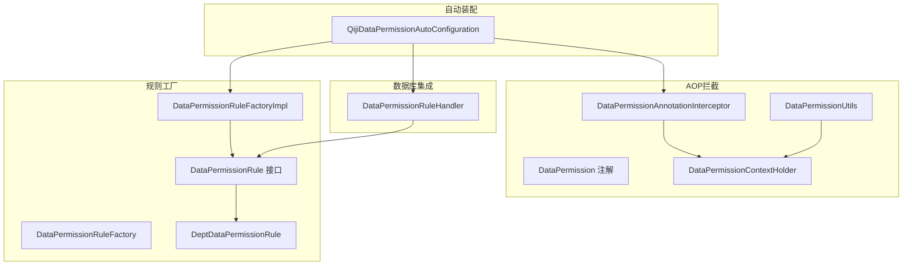
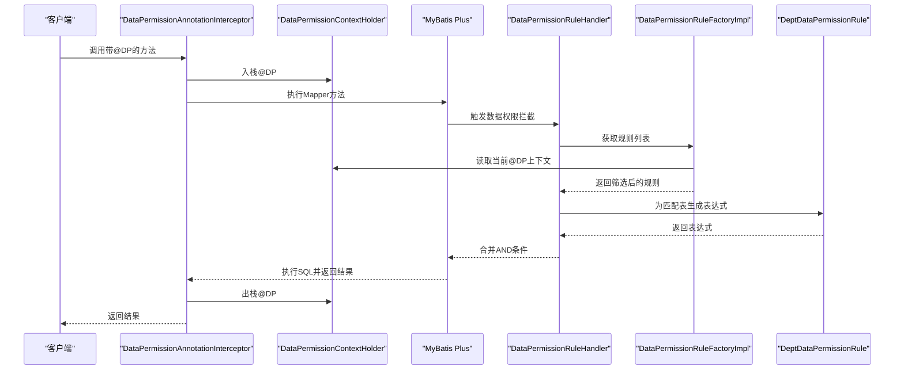
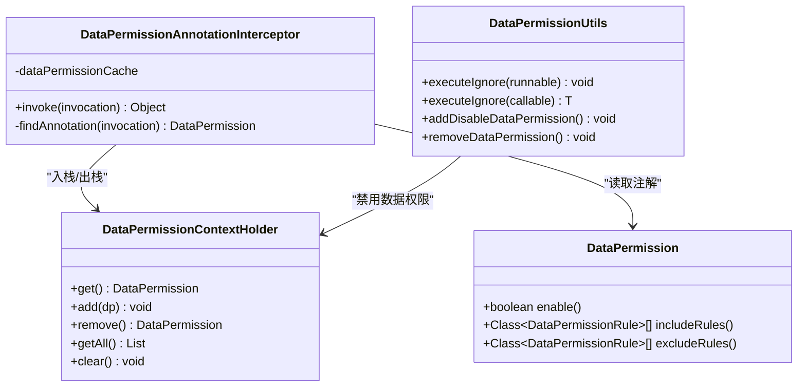
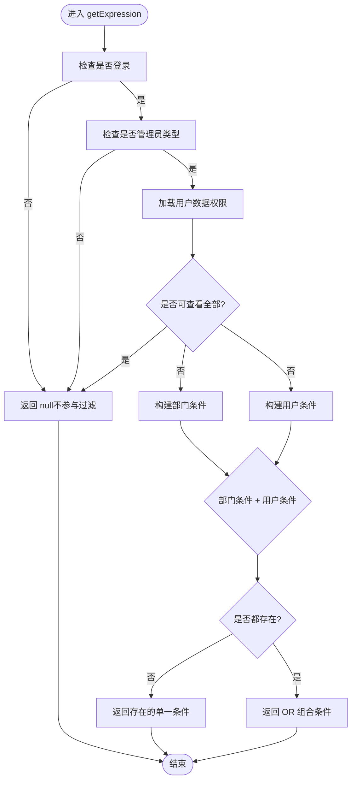
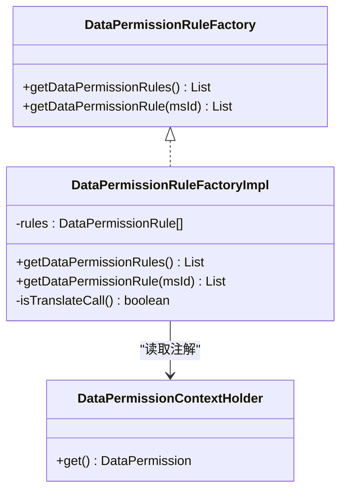
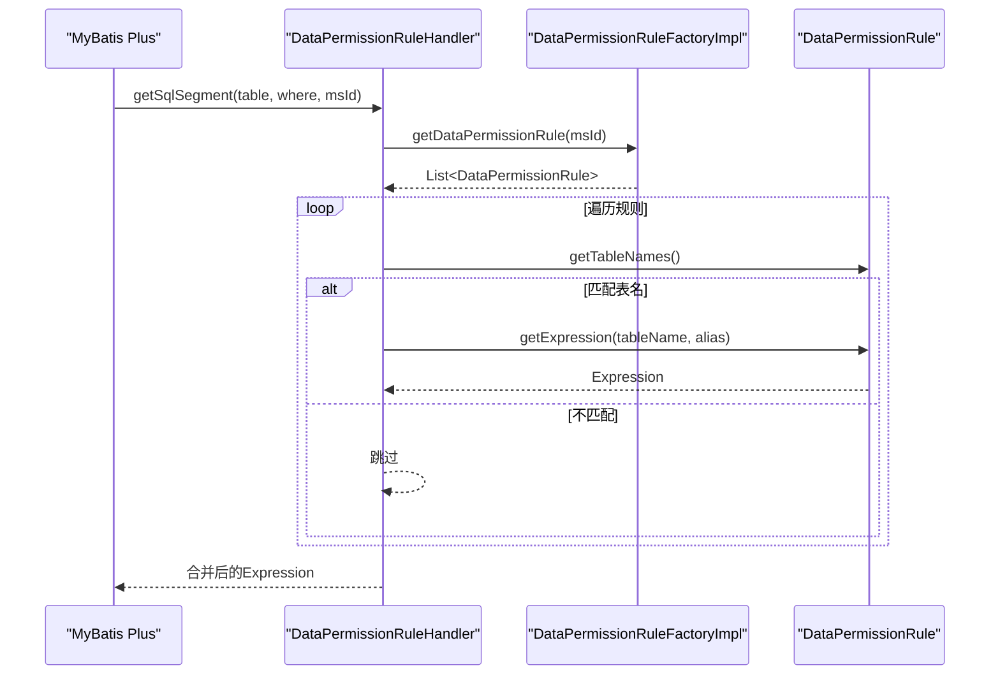
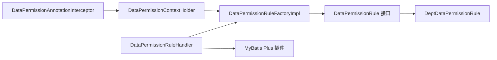

# 数据权限控制

<cite>
**本文引用的文件**
- [DataPermissionAnnotationInterceptor.java](file://qiji-framework/qiji-spring-boot-starter-biz-data-permission/src/main/java/com.qiji.cps/framework/datapermission/core/aop/DataPermissionAnnotationInterceptor.java)
- [DataPermission.java](file://qiji-framework/qiji-spring-boot-starter-biz-data-permission/src/main/java/com.qiji.cps/framework/datapermission/core/annotation/DataPermission.java)
- [DataPermissionRule.java](file://qiji-framework/qiji-spring-boot-starter-biz-data-permission/src/main/java/com.qiji.cps/framework/datapermission/core/rule/DataPermissionRule.java)
- [DeptDataPermissionRule.java](file://qiji-framework/qiji-spring-boot-starter-biz-data-permission/src/main/java/com.qiji.cps/framework/datapermission/core/rule/dept/DeptDataPermissionRule.java)
- [DataPermissionRuleHandler.java](file://qiji-framework/qiji-spring-boot-starter-biz-data-permission/src/main/java/com.qiji.cps/framework/datapermission/core/db/DataPermissionRuleHandler.java)
- [DataPermissionRuleFactory.java](file://qiji-framework/qiji-spring-boot-starter-biz-data-permission/src/main/java/com.qiji.cps/framework/datapermission/core/rule/DataPermissionRuleFactory.java)
- [DataPermissionRuleFactoryImpl.java](file://qiji-framework/qiji-spring-boot-starter-biz-data-permission/src/main/java/com.qiji.cps/framework/datapermission/core/rule/DataPermissionRuleFactoryImpl.java)
- [DataPermissionContextHolder.java](file://qiji-framework/qiji-spring-boot-starter-biz-data-permission/src/main/java/com.qiji.cps/framework/datapermission/core/aop/DataPermissionContextHolder.java)
- [DataPermissionUtils.java](file://qiji-framework/qiji-spring-boot-starter-biz-data-permission/src/main/java/com.qiji.cps/framework/datapermission/core/util/DataPermissionUtils.java)
- [QijiDataPermissionAutoConfiguration.java](file://qiji-framework/qiji-spring-boot-starter-biz-data-permission/src/main/java/com.qiji.cps/framework/datapermission/config/QijiDataPermissionAutoConfiguration.java)
- [org.springframework.boot.autoconfigure.AutoConfiguration.imports](file://qiji-framework/qiji-spring-boot-starter-biz-data-permission/src/main/resources/META-INF/spring/org.springframework.boot.autoconfigure.AutoConfiguration.imports)
</cite>

## 目录
1. [简介](#简介)
2. [项目结构](#项目结构)
3. [核心组件](#核心组件)
4. [架构总览](#架构总览)
5. [详细组件分析](#详细组件分析)
6. [依赖分析](#依赖分析)
7. [性能考虑](#性能考虑)
8. [故障排查指南](#故障排查指南)
9. [结论](#结论)
10. [附录](#附录)

## 简介
本文件面向AgenticCPS系统中的数据权限控制模块，聚焦多租户与部门维度的数据隔离机制，系统性阐述以下内容：
- 多租户与部门维度的数据权限设计与实现
- @DataPermission注解与DataPermissionAnnotationInterceptor拦截器的工作原理
- DataPermissionRule规则体系与部门规则DeptDataPermissionRule的实现细节
- 动态表名与SQL改写（基于MyBatis Plus数据权限插件）
- 数据权限与业务数据的关联关系（用户所属部门、角色权限范围等）
- 实战配置案例：部门经理仅可见本部门数据、销售仅可见本人负责客户数据等

## 项目结构
数据权限控制位于独立的starter模块中，通过Spring Boot自动装配加载，核心文件分布如下：
- 注解与AOP：@DataPermission、DataPermissionAnnotationInterceptor、DataPermissionContextHolder、DataPermissionUtils
- 规则体系：DataPermissionRule接口、DeptDataPermissionRule部门规则、DataPermissionRuleFactory与其实现
- 数据库集成：DataPermissionRuleHandler（基于MyBatis Plus数据权限插件）
- 自动装配：QijiDataPermissionAutoConfiguration

**图表来源**
- [QijiDataPermissionAutoConfiguration.java:21-46](file://qiji-framework/qiji-spring-boot-starter-biz-data-permission/src/main/java/com.qiji.cps/framework/datapermission/config/QijiDataPermissionAutoConfiguration.java#L21-L46)
- [DataPermissionAnnotationInterceptor.java:22-48](file://qiji-framework/qiji-spring-boot-starter-biz-data-permission/src/main/java/com.qiji.cps/framework/datapermission/core/aop/DataPermissionAnnotationInterceptor.java#L22-L48)
- [DataPermissionContextHolder.java:14-52](file://qiji-framework/qiji-spring-boot-starter-biz-data-permission/src/main/java/com.qiji.cps/framework/datapermission/core/aop/DataPermissionContextHolder.java#L14-L52)
- [DataPermissionRuleFactoryImpl.java:21-65](file://qiji-framework/qiji-spring-boot-starter-biz-data-permission/src/main/java/com.qiji.cps/framework/datapermission/core/rule/DataPermissionRuleFactoryImpl.java#L21-L65)
- [DataPermissionRule.java:15-36](file://qiji-framework/qiji-spring-boot-starter-biz-data-permission/src/main/java/com.qiji.cps/framework/datapermission/core/rule/DataPermissionRule.java#L15-L36)
- [DeptDataPermissionRule.java:52-146](file://qiji-framework/qiji-spring-boot-starter-biz-data-permission/src/main/java/com.qiji.cps/framework/datapermission/core/rule/dept/DeptDataPermissionRule.java#L52-L146)
- [DataPermissionRuleHandler.java:26-62](file://qiji-framework/qiji-spring-boot-starter-biz-data-permission/src/main/java/com.qiji.cps/framework/datapermission/core/db/DataPermissionRuleHandler.java#L26-L62)

**章节来源**
- [QijiDataPermissionAutoConfiguration.java:21-46](file://qiji-framework/qiji-spring-boot-starter-biz-data-permission/src/main/java/com.qiji.cps/framework/datapermission/config/QijiDataPermissionAutoConfiguration.java#L21-L46)
- [org.springframework.boot.autoconfigure.AutoConfiguration.imports:1-2](file://qiji-framework/qiji-spring-boot-starter-biz-data-permission/src/main/resources/META-INF/spring/org.springframework.boot.autoconfigure.AutoConfiguration.imports#L1-L2)

## 核心组件
- @DataPermission注解：用于声明在类或方法上，控制数据权限的启用、包含规则与排除规则
- DataPermissionAnnotationInterceptor：基于AOP在方法执行前后入栈/出栈注解，供规则工厂按需筛选规则
- DataPermissionContextHolder：线程安全的注解上下文，支持嵌套调用
- DataPermissionRuleFactory与DataPermissionRuleFactoryImpl：规则容器与筛选逻辑，支持includeRules/excludeRules与禁用场景
- DataPermissionRule接口与DeptDataPermissionRule：规则抽象与部门维度规则实现
- DataPermissionRuleHandler：基于MyBatis Plus数据权限插件的SQL改写入口
- DataPermissionUtils：提供忽略数据权限的便捷执行工具

**章节来源**
- [DataPermission.java:16-35](file://qiji-framework/qiji-spring-boot-starter-biz-data-permission/src/main/java/com.qiji.cps/framework/datapermission/core/annotation/DataPermission.java#L16-L35)
- [DataPermissionAnnotationInterceptor.java:22-72](file://qiji-framework/qiji-spring-boot-starter-biz-data-permission/src/main/java/com.qiji.cps/framework/datapermission/core/aop/DataPermissionAnnotationInterceptor.java#L22-L72)
- [DataPermissionContextHolder.java:14-72](file://qiji-framework/qiji-spring-boot-starter-biz-data-permission/src/main/java/com.qiji.cps/framework/datapermission/core/aop/DataPermissionContextHolder.java#L14-L72)
- [DataPermissionRuleFactory.java:11-28](file://qiji-framework/qiji-spring-boot-starter-biz-data-permission/src/main/java/com.qiji.cps/framework/datapermission/core/rule/DataPermissionRuleFactory.java#L11-L28)
- [DataPermissionRuleFactoryImpl.java:21-84](file://qiji-framework/qiji-spring-boot-starter-biz-data-permission/src/main/java/com.qiji.cps/framework/datapermission/core/rule/DataPermissionRuleFactoryImpl.java#L21-L84)
- [DataPermissionRule.java:15-36](file://qiji-framework/qiji-spring-boot-starter-biz-data-permission/src/main/java/com.qiji.cps/framework/datapermission/core/rule/DataPermissionRule.java#L15-L36)
- [DeptDataPermissionRule.java:52-207](file://qiji-framework/qiji-spring-boot-starter-biz-data-permission/src/main/java/com.qiji.cps/framework/datapermission/core/rule/dept/DeptDataPermissionRule.java#L52-L207)
- [DataPermissionRuleHandler.java:26-64](file://qiji-framework/qiji-spring-boot-starter-biz-data-permission/src/main/java/com.qiji.cps/framework/datapermission/core/db/DataPermissionRuleHandler.java#L26-L64)
- [DataPermissionUtils.java:14-73](file://qiji-framework/qiji-spring-boot-starter-biz-data-permission/src/main/java/com.qiji.cps/framework/datapermission/core/util/DataPermissionUtils.java#L14-L73)

## 架构总览
数据权限控制的整体流程：
- 方法调用进入AOP拦截器，将@DataPermission入栈
- MyBatis Plus执行SQL前触发数据权限插件，由DataPermissionRuleHandler收集规则
- DataPermissionRuleFactoryImpl依据注解与上下文筛选规则
- DeptDataPermissionRule等规则生成表达式并注入WHERE条件
- SQL执行返回受控数据

**图表来源**
- [DataPermissionAnnotationInterceptor.java:32-48](file://qiji-framework/qiji-spring-boot-starter-biz-data-permission/src/main/java/com.qiji.cps/framework/datapermission/core/aop/DataPermissionAnnotationInterceptor.java#L32-L48)
- [DataPermissionContextHolder.java:27-51](file://qiji-framework/qiji-spring-boot-starter-biz-data-permission/src/main/java/com.qiji.cps/framework/datapermission/core/aop/DataPermissionContextHolder.java#L27-L51)
- [DataPermissionRuleHandler.java:30-62](file://qiji-framework/qiji-spring-boot-starter-biz-data-permission/src/main/java/com.qiji.cps/framework/datapermission/core/db/DataPermissionRuleHandler.java#L30-L62)
- [DataPermissionRuleFactoryImpl.java:33-65](file://qiji-framework/qiji-spring-boot-starter-biz-data-permission/src/main/java/com.qiji.cps/framework/datapermission/core/rule/DataPermissionRuleFactoryImpl.java#L33-L65)
- [DeptDataPermissionRule.java:90-146](file://qiji-framework/qiji-spring-boot-starter-biz-data-permission/src/main/java/com.qiji.cps/framework/datapermission/core/rule/dept/DeptDataPermissionRule.java#L90-L146)

## 详细组件分析

### 注解与拦截器：@DataPermission与DataPermissionAnnotationInterceptor
- @DataPermission支持enable、includeRules、excludeRules三个关键属性，用于控制规则生效范围
- DataPermissionAnnotationInterceptor在方法执行前后将注解入栈/出栈，使用缓存避免重复反射查找
- 结合DataPermissionContextHolder实现线程安全的注解栈，支持方法嵌套调用

**图表来源**
- [DataPermission.java:16-35](file://qiji-framework/qiji-spring-boot-starter-biz-data-permission/src/main/java/com.qiji.cps/framework/datapermission/core/annotation/DataPermission.java#L16-L35)
- [DataPermissionAnnotationInterceptor.java:22-72](file://qiji-framework/qiji-spring-boot-starter-biz-data-permission/src/main/java/com.qiji.cps/framework/datapermission/core/aop/DataPermissionAnnotationInterceptor.java#L22-L72)
- [DataPermissionContextHolder.java:14-72](file://qiji-framework/qiji-spring-boot-starter-biz-data-permission/src/main/java/com.qiji.cps/framework/datapermission/core/aop/DataPermissionContextHolder.java#L14-L72)
- [DataPermissionUtils.java:14-73](file://qiji-framework/qiji-spring-boot-starter-biz-data-permission/src/main/java/com.qiji.cps/framework/datapermission/core/util/DataPermissionUtils.java#L14-L73)

**章节来源**
- [DataPermission.java:16-35](file://qiji-framework/qiji-spring-boot-starter-biz-data-permission/src/main/java/com.qiji.cps/framework/datapermission/core/annotation/DataPermission.java#L16-L35)
- [DataPermissionAnnotationInterceptor.java:22-72](file://qiji-framework/qiji-spring-boot-starter-biz-data-permission/src/main/java/com.qiji.cps/framework/datapermission/core/aop/DataPermissionAnnotationInterceptor.java#L22-L72)
- [DataPermissionContextHolder.java:14-72](file://qiji-framework/qiji-spring-boot-starter-biz-data-permission/src/main/java/com.qiji.cps/framework/datapermission/core/aop/DataPermissionContextHolder.java#L14-L72)
- [DataPermissionUtils.java:14-73](file://qiji-framework/qiji-spring-boot-starter-biz-data-permission/src/main/java/com.qiji.cps/framework/datapermission/core/util/DataPermissionUtils.java#L14-L73)

### 规则体系：DataPermissionRule与DeptDataPermissionRule
- DataPermissionRule定义两个核心方法：获取生效表名集合与为表生成WHERE表达式
- DeptDataPermissionRule实现部门维度的数据权限：
  - 通过SecurityFrameworkUtils获取登录用户信息
  - 通过PermissionCommonApi获取用户的数据权限范围（是否可查看全部、可查看的部门集合、是否可看自己）
  - 依据配置的dept_id/user_id字段生成IN/Equals表达式，支持OR组合
  - 提供addDeptColumn/addUserColumn方法以配置不同表的字段映射

**图表来源**
- [DeptDataPermissionRule.java:90-146](file://qiji-framework/qiji-spring-boot-starter-biz-data-permission/src/main/java/com.qiji.cps/framework/datapermission/core/rule/dept/DeptDataPermissionRule.java#L90-L146)

**章节来源**
- [DataPermissionRule.java:15-36](file://qiji-framework/qiji-spring-boot-starter-biz-data-permission/src/main/java/com.qiji.cps/framework/datapermission/core/rule/DataPermissionRule.java#L15-L36)
- [DeptDataPermissionRule.java:52-207](file://qiji-framework/qiji-spring-boot-starter-biz-data-permission/src/main/java/com.qiji.cps/framework/datapermission/core/rule/dept/DeptDataPermissionRule.java#L52-L207)

### 规则工厂与筛选：DataPermissionRuleFactory与DataPermissionRuleFactoryImpl
- DataPermissionRuleFactory提供两类查询：全局规则与按Mapper ID筛选规则
- DataPermissionRuleFactoryImpl依据DataPermission注解上下文进行筛选：
  - enable=false时返回空列表
  - includeRules优先于excludeRules
  - 数据翻译场景自动忽略数据权限（避免影响字典翻译）

**图表来源**
- [DataPermissionRuleFactory.java:11-28](file://qiji-framework/qiji-spring-boot-starter-biz-data-permission/src/main/java/com.qiji.cps/framework/datapermission/core/rule/DataPermissionRuleFactory.java#L11-L28)
- [DataPermissionRuleFactoryImpl.java:21-84](file://qiji-framework/qiji-spring-boot-starter-biz-data-permission/src/main/java/com.qiji.cps/framework/datapermission/core/rule/DataPermissionRuleFactoryImpl.java#L21-L84)
- [DataPermissionContextHolder.java:27-29](file://qiji-framework/qiji-spring-boot-starter-biz-data-permission/src/main/java/com.qiji.cps/framework/datapermission/core/aop/DataPermissionContextHolder.java#L27-L29)

**章节来源**
- [DataPermissionRuleFactory.java:11-28](file://qiji-framework/qiji-spring-boot-starter-biz-data-permission/src/main/java/com.qiji.cps/framework/datapermission/core/rule/DataPermissionRuleFactory.java#L11-L28)
- [DataPermissionRuleFactoryImpl.java:21-84](file://qiji-framework/qiji-spring-boot-starter-biz-data-permission/src/main/java/com.qiji.cps/framework/datapermission/core/rule/DataPermissionRuleFactoryImpl.java#L21-L84)

### 数据库集成：DataPermissionRuleHandler与SQL改写
- 基于MyBatis Plus的DataPermissionInterceptor与MultiDataPermissionHandler
- DataPermissionRuleHandler在SQL执行前根据表名匹配规则，生成表达式并通过AND连接
- 特殊场景：skipPermissionCheck()为true时跳过数据权限（跨租户访问等）

**图表来源**
- [DataPermissionRuleHandler.java:30-62](file://qiji-framework/qiji-spring-boot-starter-biz-data-permission/src/main/java/com.qiji.cps/framework/datapermission/core/db/DataPermissionRuleHandler.java#L30-L62)
- [DataPermissionRuleFactoryImpl.java:33-65](file://qiji-framework/qiji-spring-boot-starter-biz-data-permission/src/main/java/com.qiji.cps/framework/datapermission/core/rule/DataPermissionRuleFactoryImpl.java#L33-L65)

**章节来源**
- [DataPermissionRuleHandler.java:26-64](file://qiji-framework/qiji-spring-boot-starter-biz-data-permission/src/main/java/com.qiji.cps/framework/datapermission/core/db/DataPermissionRuleHandler.java#L26-L64)

### 自动装配与启动
- QijiDataPermissionAutoConfiguration注册规则工厂、数据权限处理器与AOP切面
- 通过spring.factories自动装配，确保在MyBatis Plus拦截器链中优先执行

**章节来源**
- [QijiDataPermissionAutoConfiguration.java:21-46](file://qiji-framework/qiji-spring-boot-starter-biz-data-permission/src/main/java/com.qiji.cps/framework/datapermission/config/QijiDataPermissionAutoConfiguration.java#L21-L46)
- [org.springframework.boot.autoconfigure.AutoConfiguration.imports:1-2](file://qiji-framework/qiji-spring-boot-starter-biz-data-permission/src/main/resources/META-INF/spring/org.springframework.boot.autoconfigure.AutoConfiguration.imports#L1-L2)

## 依赖分析
- 组件内聚与耦合
  - AOP层与规则层通过注解上下文解耦，规则工厂统一管理规则集合
  - 数据库层通过MultiDataPermissionHandler与MyBatis Plus插件解耦
- 外部依赖
  - MyBatis Plus数据权限插件（MultiDataPermissionHandler）
  - Security框架（获取登录用户）
  - JSON/Hutool等工具库（日志与集合操作）

**图表来源**
- [DataPermissionAnnotationInterceptor.java:32-48](file://qiji-framework/qiji-spring-boot-starter-biz-data-permission/src/main/java/com.qiji.cps/framework/datapermission/core/aop/DataPermissionAnnotationInterceptor.java#L32-L48)
- [DataPermissionRuleFactoryImpl.java:33-65](file://qiji-framework/qiji-spring-boot-starter-biz-data-permission/src/main/java/com.qiji.cps/framework/datapermission/core/rule/DataPermissionRuleFactoryImpl.java#L33-L65)
- [DataPermissionRuleHandler.java:30-62](file://qiji-framework/qiji-spring-boot-starter-biz-data-permission/src/main/java/com.qiji.cps/framework/datapermission/core/db/DataPermissionRuleHandler.java#L30-L62)

**章节来源**
- [DataPermissionAnnotationInterceptor.java:22-72](file://qiji-framework/qiji-spring-boot-starter-biz-data-permission/src/main/java/com.qiji.cps/framework/datapermission/core/aop/DataPermissionAnnotationInterceptor.java#L22-L72)
- [DataPermissionRuleFactoryImpl.java:21-84](file://qiji-framework/qiji-spring-boot-starter-biz-data-permission/src/main/java/com.qiji.cps/framework/datapermission/core/rule/DataPermissionRuleFactoryImpl.java#L21-L84)
- [DataPermissionRuleHandler.java:26-64](file://qiji-framework/qiji-spring-boot-starter-biz-data-permission/src/main/java/com.qiji.cps/framework/datapermission/core/db/DataPermissionRuleHandler.java#L26-L64)

## 性能考虑
- 注解缓存：DataPermissionAnnotationInterceptor对方法级注解进行缓存，避免重复反射
- 规则筛选：DataPermissionRuleFactoryImpl按注解上下文快速筛选，减少规则遍历成本
- SQL表达式合并：Handler对多个规则的表达式使用AND连接，保持SQL简洁
- 线程安全：使用TransmittableThreadLocal保障多线程/异步场景下的上下文正确传递

[本节为通用性能建议，不直接分析具体文件]

## 故障排查指南
- 现象：查询无数据或权限异常
  - 检查登录用户类型是否为管理员类型，非管理员类型不会触发数据权限
  - 检查DeptDataPermissionRule是否正确配置dept_id/user_id字段映射
  - 检查PermissionCommonApi返回的数据权限范围是否正确
- 现象：忽略数据权限无效
  - 确认使用DataPermissionUtils.executeIgnore包裹逻辑
  - 检查是否处于数据翻译场景（内部会自动忽略）
- 现象：跨租户访问失败
  - 确认skipPermissionCheck()逻辑是否满足跨租户场景

**章节来源**
- [DeptDataPermissionRule.java:90-146](file://qiji-framework/qiji-spring-boot-starter-biz-data-permission/src/main/java/com.qiji.cps/framework/datapermission/core/rule/dept/DeptDataPermissionRule.java#L90-L146)
- [DataPermissionUtils.java:34-59](file://qiji-framework/qiji-spring-boot-starter-biz-data-permission/src/main/java/com.qiji.cps/framework/datapermission/core/util/DataPermissionUtils.java#L34-L59)
- [DataPermissionRuleHandler.java:30-35](file://qiji-framework/qiji-spring-boot-starter-biz-data-permission/src/main/java/com.qiji.cps/framework/datapermission/core/db/DataPermissionRuleHandler.java#L30-L35)

## 结论
本模块通过“注解+AOP+规则工厂+数据库插件”的分层设计，实现了灵活且高性能的数据权限控制。部门维度规则DeptDataPermissionRule结合用户上下文与表字段映射，能够精准地生成SQL过滤条件。配合自动装配与线程安全上下文，可在复杂业务场景中稳定运行。

[本节为总结性内容，不直接分析具体文件]

## 附录

### 多租户与部门维度的数据隔离机制
- 多租户场景：可通过扩展规则接口实现租户维度的表/字段隔离，核心思路与部门规则一致（基于表名匹配与表达式生成）
- 部门维度：DeptDataPermissionRule通过dept_id与user_id字段组合，支持“仅本部门”“本部门+本人”等策略

[本节为概念性说明，不直接分析具体文件]

### @DataPermission注解使用方式与拦截逻辑
- 声明位置：类或方法级别
- 关键属性：
  - enable：是否启用数据权限
  - includeRules：优先生效的规则集合
  - excludeRules：排除的规则集合
- 拦截逻辑：方法执行前入栈注解，执行后出栈；规则工厂按注解筛选规则

**章节来源**
- [DataPermission.java:16-35](file://qiji-framework/qiji-spring-boot-starter-biz-data-permission/src/main/java/com.qiji.cps/framework/datapermission/core/annotation/DataPermission.java#L16-L35)
- [DataPermissionAnnotationInterceptor.java:32-48](file://qiji-framework/qiji-spring-boot-starter-biz-data-permission/src/main/java/com.qiji.cps/framework/datapermission/core/aop/DataPermissionAnnotationInterceptor.java#L32-L48)
- [DataPermissionContextHolder.java:27-51](file://qiji-framework/qiji-spring-boot-starter-biz-data-permission/src/main/java/com.qiji.cps/framework/datapermission/core/aop/DataPermissionContextHolder.java#L27-L51)

### DataPermissionRule规则设计与实现
- 接口职责：声明生效表名集合与表达式生成
- 自定义规则：实现接口并在规则工厂中注册，即可被自动装配加载
- 部门规则：DeptDataPermissionRule提供字段映射与表达式组合示例

**章节来源**
- [DataPermissionRule.java:15-36](file://qiji-framework/qiji-spring-boot-starter-biz-data-permission/src/main/java/com.qiji.cps/framework/datapermission/core/rule/DataPermissionRule.java#L15-L36)
- [DeptDataPermissionRule.java:52-207](file://qiji-framework/qiji-spring-boot-starter-biz-data-permission/src/main/java/com.qiji.cps/framework/datapermission/core/rule/dept/DeptDataPermissionRule.java#L52-L207)

### 动态表名与SQL改写
- 表名匹配：规则实现返回表名集合，Handler按表名匹配后生成表达式
- SQL改写：Handler将多个规则表达式AND合并，注入到原始SQL的WHERE子句中
- 优先级：includeRules > 规则默认 > excludeRules

**章节来源**
- [DataPermissionRule.java:24-34](file://qiji-framework/qiji-spring-boot-starter-biz-data-permission/src/main/java/com.qiji.cps/framework/datapermission/core/rule/DataPermissionRule.java#L24-L34)
- [DataPermissionRuleHandler.java:44-61](file://qiji-framework/qiji-spring-boot-starter-biz-data-permission/src/main/java/com.qiji.cps/framework/datapermission/core/db/DataPermissionRuleHandler.java#L44-L61)
- [DataPermissionRuleFactoryImpl.java:53-64](file://qiji-framework/qiji-spring-boot-starter-biz-data-permission/src/main/java/com.qiji.cps/framework/datapermission/core/rule/DataPermissionRuleFactoryImpl.java#L53-L64)

### 与业务数据的关联关系
- 登录用户：通过SecurityFrameworkUtils获取用户类型与用户ID
- 数据权限范围：通过PermissionCommonApi获取用户可查看的部门集合与是否允许查看本人
- 字段映射：DeptDataPermissionRule提供addDeptColumn/addUserColumn配置不同表的dept_id/user_id字段

**章节来源**
- [DeptDataPermissionRule.java:90-146](file://qiji-framework/qiji-spring-boot-starter-biz-data-permission/src/main/java/com.qiji.cps/framework/datapermission/core/rule/dept/DeptDataPermissionRule.java#L90-L146)

### 实战配置案例
- 场景一：部门经理仅可见本部门数据
  - 配置：为相关实体表映射dept_id字段
  - 规则：DeptDataPermissionRule返回部门IN条件
- 场景二：销售仅可见自己负责的客户数据
  - 配置：为相关实体表映射user_id字段
  - 规则：DeptDataPermissionRule返回user_id等于当前用户ID
- 场景三：同时支持部门与本人数据
  - 配置：同时映射dept_id与user_id字段
  - 规则：DeptDataPermissionRule返回OR组合条件

**章节来源**
- [DeptDataPermissionRule.java:177-207](file://qiji-framework/qiji-spring-boot-starter-biz-data-permission/src/main/java/com.qiji.cps/framework/datapermission/core/rule/dept/DeptDataPermissionRule.java#L177-L207)