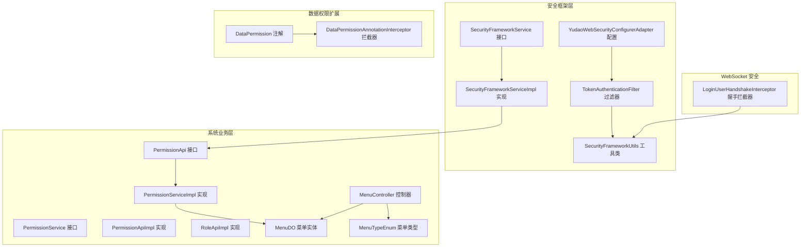
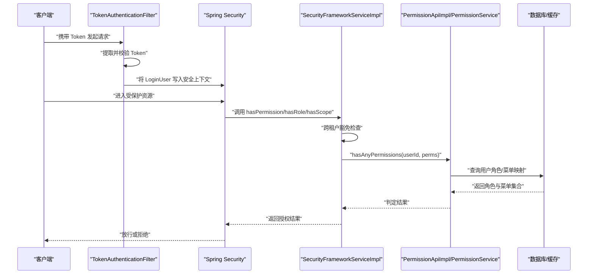
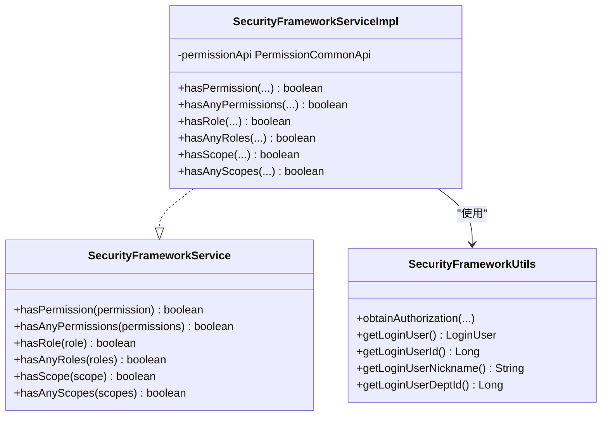
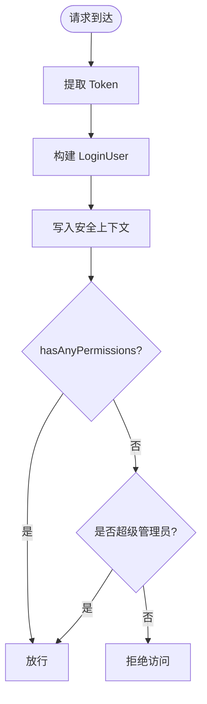
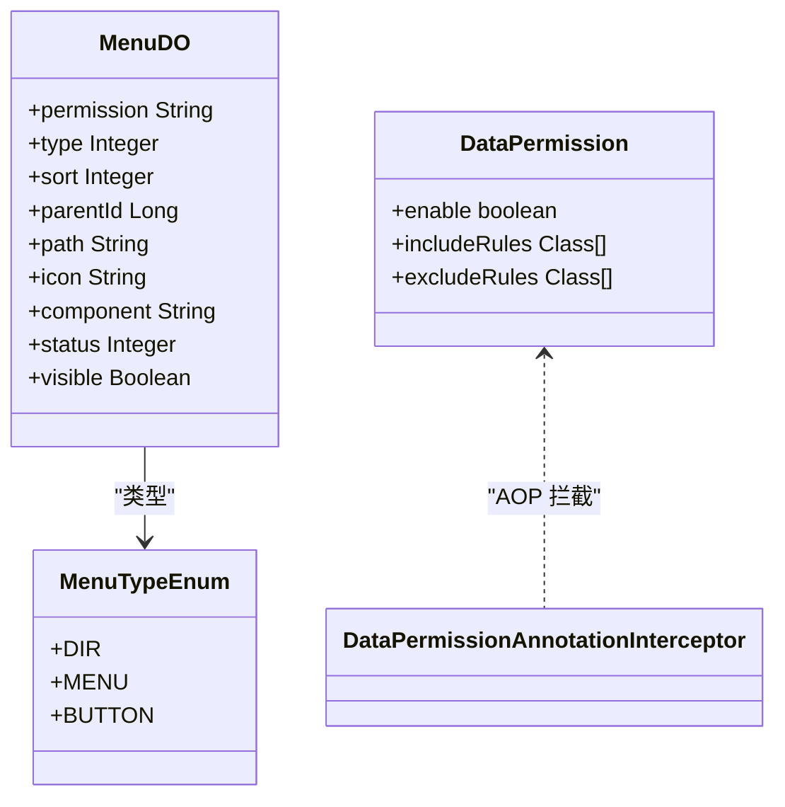
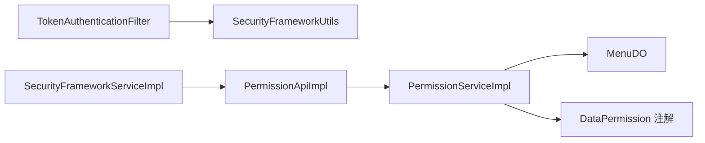

# 权限控制

<cite>
**本文引用的文件**
- [SecurityFrameworkService.java](file://yudao-framework/yudao-spring-boot-starter-security/src/main/java/cn/iocoder/yudao/framework/security/core/service/SecurityFrameworkService.java)
- [SecurityFrameworkServiceImpl.java](file://yudao-framework/yudao-spring-boot-starter-security/src/main/java/cn/iocoder/yudao/framework/security/core/service/SecurityFrameworkServiceImpl.java)
- [SecurityFrameworkUtils.java](file://yudao-framework/yudao-spring-boot-starter-security/src/main/java/cn/iocoder/yudao/framework/security/core/util/SecurityFrameworkUtils.java)
- [TokenAuthenticationFilter.java](file://yudao-framework/yudao-spring-boot-starter-security/src/main/java/cn/iocoder/yudao/framework/security/core/filter/TokenAuthenticationFilter.java)
- [YudaoWebSecurityConfigurerAdapter.java](file://yudao-framework/yudao-spring-boot-starter-security/src/main/java/cn/iocoder/yudao/framework/security/config/YudaoWebSecurityConfigurerAdapter.java)
- [PermissionService.java](file://yudao-module-system/src/main/java/cn/iocoder/yudao/module/system/service/permission/PermissionService.java)
- [PermissionServiceImpl.java](file://yudao-module-system/src/main/java/cn/iocoder/yudao/module/system/service/permission/PermissionServiceImpl.java)
- [PermissionApi.java](file://yudao-module-system/src/main/java/cn/iocoder/yudao/module/system/api/permission/PermissionApi.java)
- [PermissionApiImpl.java](file://yudao-module-system/src/main/java/cn/iocoder/yudao/module/system/api/permission/PermissionApiImpl.java)
- [RoleApiImpl.java](file://yudao-module-system/src/main/java/cn/iocoder/yudao/module/system/api/permission/RoleApiImpl.java)
- [MenuDO.java](file://yudao-module-system/src/main/java/cn/iocoder/yudao/module/system/dal/dataobject/permission/MenuDO.java)
- [MenuTypeEnum.java](file://yudao-module-system/src/main/java/cn/iocoder/yudao/module/system/enums/permission/MenuTypeEnum.java)
- [MenuController.java](file://yudao-module-system/src/main/java/cn/iocoder/yudao/module/system/controller/admin/permission/MenuController.java)
- [MenuSaveVO.java](file://yudao-module-system/src/main/java/cn/iocoder/yudao/module/system/controller/admin/permission/vo/menu/MenuSaveVO.java)
- [MenuRespVO.java](file://yudao-module-system/src/main/java/cn/iocoder/yudao/module/system/controller/admin/permission/vo/menu/MenuRespVO.java)
- [MenuSimpleRespVO.java](file://yudao-module-system/src/main/java/cn/iocoder/yudao/module/system/controller/admin/permission/vo/menu/MenuSimpleRespVO.java)
- [PermissionAssignRoleMenuReqVO.java](file://yudao-module-system/src/main/java/cn/iocoder/yudao/module/system/controller/admin/permission/vo/permission/PermissionAssignRoleMenuReqVO.java)
- [DataPermission.java](file://yudao-framework/yudao-spring-boot-starter-biz-data-permission/src/main/java/cn/iocoder/yudao/framework/datapermission/core/annotation/DataPermission.java)
- [DataPermissionAnnotationInterceptor.java](file://yudao-framework/yudao-spring-boot-starter-biz-data-permission/src/main/java/cn/iocoder/yudao/framework/datapermission/core/aop/DataPermissionAnnotationInterceptor.java)
- [LoginUser.java](file://yudao-framework/yudao-spring-boot-starter-security/src/main/java/cn/iocoder/yudao/framework/security/core/LoginUser.java)
- [LoginUserHandshakeInterceptor.java](file://yudao-framework/yudao-spring-boot-starter-websocket/src/main/java/cn/iocoder/yudao/framework/websocket/core/security/LoginUserHandshakeInterceptor.java)
</cite>

## 目录
1. [简介](#简介)
2. [项目结构](#项目结构)
3. [核心组件](#核心组件)
4. [架构总览](#架构总览)
5. [详细组件分析](#详细组件分析)
6. [依赖分析](#依赖分析)
7. [性能考量](#性能考量)
8. [故障排查指南](#故障排查指南)
9. [结论](#结论)
10. [附录](#附录)

## 简介
本文件面向 AgenticCPS 系统的权限控制，围绕基于角色的访问控制（RBAC）展开，系统性梳理权限框架的核心组件与执行流程，覆盖请求拦截、权限匹配、访问决策、多层级权限（菜单、按钮、数据）的设计与实现，并给出最佳实践与常见问题解决方案。重点包括：
- RBAC 关系模型：用户、角色、权限、资源（菜单/按钮）
- 权限框架核心：SecurityFrameworkService 的服务实现与 SecurityFrameworkUtils 的上下文解析
- 权限验证流程：请求拦截、Token 解析、角色/权限匹配、授权范围校验
- 多层级权限：菜单权限、按钮权限、数据权限的落地方式
- 权限继承与组合规则：角色聚合、超级管理员豁免、数据范围策略
- 应用场景：接口权限、页面权限、数据行权限
- 最佳实践与排障建议

## 项目结构
权限控制相关代码主要分布在以下模块：
- 安全框架层（yudao-spring-boot-starter-security）：提供认证过滤、授权上下文、权限服务接口与实现
- 系统业务层（yudao-module-system）：提供权限服务、菜单/角色/用户/部门等实体与控制器
- 数据权限扩展（yudao-spring-boot-starter-biz-data-permission）：提供数据权限注解与 AOP 拦截
- WebSocket 安全（yudao-spring-boot-starter-websocket）：提供 WebSocket 握手阶段的用户注入

图表来源
- [YudaoWebSecurityConfigurerAdapter.java:110-153](file://yudao-framework/yudao-spring-boot-starter-security/src/main/java/cn/iocoder/yudao/framework/security/config/YudaoWebSecurityConfigurerAdapter.java#L110-L153)
- [TokenAuthenticationFilter.java:40-119](file://yudao-framework/yudao-spring-boot-starter-security/src/main/java/cn/iocoder/yudao/framework/security/core/filter/TokenAuthenticationFilter.java#L40-L119)
- [SecurityFrameworkService.java:8-60](file://yudao-framework/yudao-spring-boot-starter-security/src/main/java/cn/iocoder/yudao/framework/security/core/service/SecurityFrameworkService.java#L8-L60)
- [SecurityFrameworkServiceImpl.java:19-85](file://yudao-framework/yudao-spring-boot-starter-security/src/main/java/cn/iocoder/yudao/framework/security/core/service/SecurityFrameworkServiceImpl.java#L19-L85)
- [PermissionService.java](file://yudao-module-system/src/main/java/cn/iocoder/yudao/module/system/service/permission/PermissionService.java)
- [PermissionServiceImpl.java:44-342](file://yudao-module-system/src/main/java/cn/iocoder/yudao/module/system/service/permission/PermissionServiceImpl.java#L44-L342)
- [PermissionApi.java:13-23](file://yudao-module-system/src/main/java/cn/iocoder/yudao/module/system/api/permission/PermissionApi.java#L13-L23)
- [PermissionApiImpl.java:16-42](file://yudao-module-system/src/main/java/cn/iocoder/yudao/module/system/api/permission/PermissionApiImpl.java#L16-L42)
- [RoleApiImpl.java:14-24](file://yudao-module-system/src/main/java/cn/iocoder/yudao/module/system/api/permission/RoleApiImpl.java#L14-L24)
- [MenuDO.java:44-95](file://yudao-module-system/src/main/java/cn/iocoder/yudao/module/system/dal/dataobject/permission/MenuDO.java#L44-L95)
- [MenuTypeEnum.java:13-25](file://yudao-module-system/src/main/java/cn/iocoder/yudao/module/system/enums/permission/MenuTypeEnum.java#L13-L25)
- [MenuController.java:26-30](file://yudao-module-system/src/main/java/cn/iocoder/yudao/module/system/controller/admin/permission/MenuController.java#L26-L30)
- [DataPermission.java:16-35](file://yudao-framework/yudao-spring-boot-starter-biz-data-permission/src/main/java/cn/iocoder/yudao/framework/datapermission/core/annotation/DataPermission.java#L16-L35)
- [DataPermissionAnnotationInterceptor.java:21-34](file://yudao-framework/yudao-spring-boot-starter-biz-data-permission/src/main/java/cn/iocoder/yudao/framework/datapermission/core/aop/DataPermissionAnnotationInterceptor.java#L21-L34)
- [LoginUserHandshakeInterceptor.java:24-29](file://yudao-framework/yudao-spring-boot-starter-websocket/src/main/java/cn/iocoder/yudao/framework/websocket/core/security/LoginUserHandshakeInterceptor.java#L24-L29)

章节来源
- [YudaoWebSecurityConfigurerAdapter.java:110-153](file://yudao-framework/yudao-spring-boot-starter-security/src/main/java/cn/iocoder/yudao/framework/security/config/YudaoWebSecurityConfigurerAdapter.java#L110-L153)
- [TokenAuthenticationFilter.java:40-119](file://yudao-framework/yudao-spring-boot-starter-security/src/main/java/cn/iocoder/yudao/framework/security/core/filter/TokenAuthenticationFilter.java#L40-L119)
- [SecurityFrameworkService.java:8-60](file://yudao-framework/yudao-spring-boot-starter-security/src/main/java/cn/iocoder/yudao/framework/security/core/service/SecurityFrameworkService.java#L8-L60)
- [SecurityFrameworkServiceImpl.java:19-85](file://yudao-framework/yudao-spring-boot-starter-security/src/main/java/cn/iocoder/yudao/framework/security/core/service/SecurityFrameworkServiceImpl.java#L19-L85)
- [PermissionServiceImpl.java:44-342](file://yudao-module-system/src/main/java/cn/iocoder/yudao/module/system/service/permission/PermissionServiceImpl.java#L44-L342)
- [MenuDO.java:44-95](file://yudao-module-system/src/main/java/cn/iocoder/yudao/module/system/dal/dataobject/permission/MenuDO.java#L44-L95)
- [DataPermission.java:16-35](file://yudao-framework/yudao-spring-boot-starter-biz-data-permission/src/main/java/cn/iocoder/yudao/framework/datapermission/core/annotation/DataPermission.java#L16-L35)
- [LoginUserHandshakeInterceptor.java:24-29](file://yudao-framework/yudao-spring-boot-starter-websocket/src/main/java/cn/iocoder/yudao/framework/websocket/core/security/LoginUserHandshakeInterceptor.java#L24-L29)

## 核心组件
- 权限服务接口与实现
  - SecurityFrameworkService：对外暴露 hasPermission/hasAnyPermissions、hasRole/hasAnyRoles、hasScope/hasAnyScopes 等判定能力
  - SecurityFrameworkServiceImpl：封装跨租户豁免、上下文取用户、委托 PermissionCommonApi 进行实际校验
- 权限服务实现
  - PermissionServiceImpl：负责角色-菜单-用户-部门的权限与数据权限计算，含缓存与事务一致性
  - PermissionApi/PermissionApiImpl：对外暴露用户角色/权限查询、部门数据权限等 API
- 认证与拦截
  - TokenAuthenticationFilter：从请求中提取 Token，构建 LoginUser 并写入安全上下文
  - YudaoWebSecurityConfigurerAdapter：统一配置 URL 放行、认证与授权链路
- 菜单与权限模型
  - MenuDO：菜单/按钮实体，permission 字段承载按钮级权限标识
  - MenuTypeEnum：目录/菜单/按钮类型
  - MenuController：菜单 CRUD 与权限标识维护
- 数据权限
  - DataPermission 注解与 DataPermissionAnnotationInterceptor：在方法执行前后入栈/出栈注解，驱动数据权限规则
- WebSocket 安全
  - LoginUserHandshakeInterceptor：握手阶段将 LoginUser 注入 WebSocketSession

章节来源
- [SecurityFrameworkService.java:8-60](file://yudao-framework/yudao-spring-boot-starter-security/src/main/java/cn/iocoder/yudao/framework/security/core/service/SecurityFrameworkService.java#L8-L60)
- [SecurityFrameworkServiceImpl.java:19-85](file://yudao-framework/yudao-spring-boot-starter-security/src/main/java/cn/iocoder/yudao/framework/security/core/service/SecurityFrameworkServiceImpl.java#L19-L85)
- [PermissionService.java](file://yudao-module-system/src/main/java/cn/iocoder/yudao/module/system/service/permission/PermissionService.java)
- [PermissionServiceImpl.java:44-342](file://yudao-module-system/src/main/java/cn/iocoder/yudao/module/system/service/permission/PermissionServiceImpl.java#L44-L342)
- [PermissionApi.java:13-23](file://yudao-module-system/src/main/java/cn/iocoder/yudao/module/system/api/permission/PermissionApi.java#L13-L23)
- [PermissionApiImpl.java:16-42](file://yudao-module-system/src/main/java/cn/iocoder/yudao/module/system/api/permission/PermissionApiImpl.java#L16-L42)
- [TokenAuthenticationFilter.java:40-119](file://yudao-framework/yudao-spring-boot-starter-security/src/main/java/cn/iocoder/yudao/framework/security/core/filter/TokenAuthenticationFilter.java#L40-L119)
- [YudaoWebSecurityConfigurerAdapter.java:110-153](file://yudao-framework/yudao-spring-boot-starter-security/src/main/java/cn/iocoder/yudao/framework/security/config/YudaoWebSecurityConfigurerAdapter.java#L110-L153)
- [MenuDO.java:44-95](file://yudao-module-system/src/main/java/cn/iocoder/yudao/module/system/dal/dataobject/permission/MenuDO.java#L44-L95)
- [MenuTypeEnum.java:13-25](file://yudao-module-system/src/main/java/cn/iocoder/yudao/module/system/enums/permission/MenuTypeEnum.java#L13-L25)
- [MenuController.java:26-30](file://yudao-module-system/src/main/java/cn/iocoder/yudao/module/system/controller/admin/permission/MenuController.java#L26-L30)
- [DataPermission.java:16-35](file://yudao-framework/yudao-spring-boot-starter-biz-data-permission/src/main/java/cn/iocoder/yudao/framework/datapermission/core/annotation/DataPermission.java#L16-L35)
- [DataPermissionAnnotationInterceptor.java:21-34](file://yudao-framework/yudao-spring-boot-starter-biz-data-permission/src/main/java/cn/iocoder/yudao/framework/datapermission/core/aop/DataPermissionAnnotationInterceptor.java#L21-L34)
- [LoginUserHandshakeInterceptor.java:24-29](file://yudao-framework/yudao-spring-boot-starter-websocket/src/main/java/cn/iocoder/yudao/framework/websocket/core/security/LoginUserHandshakeInterceptor.java#L24-L29)

## 架构总览
整体权限控制采用“请求拦截 + 上下文解析 + 权限判定 + 数据权限”的分层架构。

图表来源
- [TokenAuthenticationFilter.java:40-119](file://yudao-framework/yudao-spring-boot-starter-security/src/main/java/cn/iocoder/yudao/framework/security/core/filter/TokenAuthenticationFilter.java#L40-L119)
- [SecurityFrameworkServiceImpl.java:24-82](file://yudao-framework/yudao-spring-boot-starter-security/src/main/java/cn/iocoder/yudao/framework/security/core/service/SecurityFrameworkServiceImpl.java#L24-L82)
- [PermissionApiImpl.java:16-42](file://yudao-module-system/src/main/java/cn/iocoder/yudao/module/system/api/permission/PermissionApiImpl.java#L16-L42)
- [PermissionServiceImpl.java:62-129](file://yudao-module-system/src/main/java/cn/iocoder/yudao/module/system/service/permission/PermissionServiceImpl.java#L62-L129)

## 详细组件分析

### 权限框架服务与上下文解析
- SecurityFrameworkService：定义权限/角色/授权范围的判定入口
- SecurityFrameworkServiceImpl：统一处理跨租户豁免、从上下文取用户、委托 PermissionCommonApi 执行判定
- SecurityFrameworkUtils：从请求中提取 Token、从安全上下文获取 LoginUser、用户信息与部门信息等

图表来源
- [SecurityFrameworkService.java:8-60](file://yudao-framework/yudao-spring-boot-starter-security/src/main/java/cn/iocoder/yudao/framework/security/core/service/SecurityFrameworkService.java#L8-L60)
- [SecurityFrameworkServiceImpl.java:19-85](file://yudao-framework/yudao-spring-boot-starter-security/src/main/java/cn/iocoder/yudao/framework/security/core/service/SecurityFrameworkServiceImpl.java#L19-L85)
- [SecurityFrameworkUtils.java:41-121](file://yudao-framework/yudao-spring-boot-starter-security/src/main/java/cn/iocoder/yudao/framework/security/core/util/SecurityFrameworkUtils.java#L41-L121)

章节来源
- [SecurityFrameworkService.java:8-60](file://yudao-framework/yudao-spring-boot-starter-security/src/main/java/cn/iocoder/yudao/framework/security/core/service/SecurityFrameworkService.java#L8-L60)
- [SecurityFrameworkServiceImpl.java:19-85](file://yudao-framework/yudao-spring-boot-starter-security/src/main/java/cn/iocoder/yudao/framework/security/core/service/SecurityFrameworkServiceImpl.java#L19-L85)
- [SecurityFrameworkUtils.java:41-121](file://yudao-framework/yudao-spring-boot-starter-security/src/main/java/cn/iocoder/yudao/framework/security/core/util/SecurityFrameworkUtils.java#L41-L121)

### 权限验证执行流程
- 请求拦截：YudaoWebSecurityConfigurerAdapter 将 TokenAuthenticationFilter 加入过滤链
- Token 解析：TokenAuthenticationFilter 从请求头/参数提取 Token，构建 LoginUser 并写入上下文
- 权限判定：SecurityFrameworkServiceImpl 委托 PermissionApiImpl/PermissionService 执行角色/权限/授权范围判定
- 缓存与事务：PermissionServiceImpl 使用 Redis 缓存与事务确保一致性

图表来源
- [YudaoWebSecurityConfigurerAdapter.java:110-153](file://yudao-framework/yudao-spring-boot-starter-security/src/main/java/cn/iocoder/yudao/framework/security/config/YudaoWebSecurityConfigurerAdapter.java#L110-L153)
- [TokenAuthenticationFilter.java:40-119](file://yudao-framework/yudao-spring-boot-starter-security/src/main/java/cn/iocoder/yudao/framework/security/core/filter/TokenAuthenticationFilter.java#L40-L119)
- [SecurityFrameworkServiceImpl.java:24-82](file://yudao-framework/yudao-spring-boot-starter-security/src/main/java/cn/iocoder/yudao/framework/security/core/service/SecurityFrameworkServiceImpl.java#L24-L82)
- [PermissionServiceImpl.java:62-129](file://yudao-module-system/src/main/java/cn/iocoder/yudao/module/system/service/permission/PermissionServiceImpl.java#L62-L129)

章节来源
- [YudaoWebSecurityConfigurerAdapter.java:110-153](file://yudao-framework/yudao-spring-boot-starter-security/src/main/java/cn/iocoder/yudao/framework/security/config/YudaoWebSecurityConfigurerAdapter.java#L110-L153)
- [TokenAuthenticationFilter.java:40-119](file://yudao-framework/yudao-spring-boot-starter-security/src/main/java/cn/iocoder/yudao/framework/security/core/filter/TokenAuthenticationFilter.java#L40-L119)
- [SecurityFrameworkServiceImpl.java:24-82](file://yudao-framework/yudao-spring-boot-starter-security/src/main/java/cn/iocoder/yudao/framework/security/core/service/SecurityFrameworkServiceImpl.java#L24-L82)
- [PermissionServiceImpl.java:62-129](file://yudao-module-system/src/main/java/cn/iocoder/yudao/module/system/service/permission/PermissionServiceImpl.java#L62-L129)

### 多层级权限体系
- 菜单权限：菜单实体包含 permission 字段，配合 @PreAuthorize 注解对 API 进行权限控制
- 按钮权限：按钮类型菜单的 permission 字段作为按钮级权限标识，前端根据该标识控制按钮显隐
- 数据权限：通过 @DataPermission 注解与 DataPermissionAnnotationInterceptor 在方法执行前后入栈/出栈注解，结合数据权限规则生成 SQL 过滤条件

图表来源
- [MenuDO.java:44-95](file://yudao-module-system/src/main/java/cn/iocoder/yudao/module/system/dal/dataobject/permission/MenuDO.java#L44-L95)
- [MenuTypeEnum.java:13-25](file://yudao-module-system/src/main/java/cn/iocoder/yudao/module/system/enums/permission/MenuTypeEnum.java#L13-L25)
- [DataPermission.java:16-35](file://yudao-framework/yudao-spring-boot-starter-biz-data-permission/src/main/java/cn/iocoder/yudao/framework/datapermission/core/annotation/DataPermission.java#L16-L35)
- [DataPermissionAnnotationInterceptor.java:21-34](file://yudao-framework/yudao-spring-boot-starter-biz-data-permission/src/main/java/cn/iocoder/yudao/framework/datapermission/core/aop/DataPermissionAnnotationInterceptor.java#L21-L34)

章节来源
- [MenuDO.java:44-95](file://yudao-module-system/src/main/java/cn/iocoder/yudao/module/system/dal/dataobject/permission/MenuDO.java#L44-L95)
- [MenuTypeEnum.java:13-25](file://yudao-module-system/src/main/java/cn/iocoder/yudao/module/system/enums/permission/MenuTypeEnum.java#L13-L25)
- [DataPermission.java:16-35](file://yudao-framework/yudao-spring-boot-starter-biz-data-permission/src/main/java/cn/iocoder/yudao/framework/datapermission/core/annotation/DataPermission.java#L16-L35)
- [DataPermissionAnnotationInterceptor.java:21-34](file://yudao-framework/yudao-spring-boot-starter-biz-data-permission/src/main/java/cn/iocoder/yudao/framework/datapermission/core/aop/DataPermissionAnnotationInterceptor.java#L21-L34)

### 权限继承与组合规则
- 角色聚合：用户可拥有多个角色，PermissionServiceImpl 通过用户角色集合与菜单-角色映射进行权限判定
- 超级管理员豁免：若用户拥有超级管理员角色，直接放行
- 授权范围：LoginUser 的 scopes 字段用于授权范围校验，SecurityFrameworkServiceImpl.hasAnyScopes 做集合包含判断
- 数据范围策略：PermissionServiceImpl.getDeptDataPermission 根据角色数据范围策略（全部/自定义/仅本人等）计算可见部门集合

章节来源
- [PermissionServiceImpl.java:62-129](file://yudao-module-system/src/main/java/cn/iocoder/yudao/module/system/service/permission/PermissionServiceImpl.java#L62-L129)
- [SecurityFrameworkServiceImpl.java:44-82](file://yudao-framework/yudao-spring-boot-starter-security/src/main/java/cn/iocoder/yudao/framework/security/core/service/SecurityFrameworkServiceImpl.java#L44-L82)
- [LoginUser.java:18-75](file://yudao-framework/yudao-spring-boot-starter-security/src/main/java/cn/iocoder/yudao/framework/security/core/LoginUser.java#L18-L75)

### 权限控制的应用场景
- 接口权限：菜单 permission 与 @PreAuthorize 注解配合，实现 API 级别权限控制
- 页面权限：菜单 type=目录/菜单，前端根据菜单树与按钮 permission 控制页面元素显隐
- 数据行权限：通过 @DataPermission 与数据权限规则，对查询/统计等方法自动注入数据范围过滤

章节来源
- [MenuController.java:26-30](file://yudao-module-system/src/main/java/cn/iocoder/yudao/module/system/controller/admin/permission/MenuController.java#L26-L30)
- [MenuSaveVO.java:12-33](file://yudao-module-system/src/main/java/cn/iocoder/yudao/module/system/controller/admin/permission/vo/menu/MenuSaveVO.java#L12-L33)
- [MenuRespVO.java:11-34](file://yudao-module-system/src/main/java/cn/iocoder/yudao/module/system/controller/admin/permission/vo/menu/MenuRespVO.java#L11-L34)
- [MenuSimpleRespVO.java:7-22](file://yudao-module-system/src/main/java/cn/iocoder/yudao/module/system/controller/admin/permission/vo/menu/MenuSimpleRespVO.java#L7-L22)
- [PermissionAssignRoleMenuReqVO.java:10-21](file://yudao-module-system/src/main/java/cn/iocoder/yudao/module/system/controller/admin/permission/vo/permission/PermissionAssignRoleMenuReqVO.java#L10-L21)
- [DataPermission.java:16-35](file://yudao-framework/yudao-spring-boot-starter-biz-data-permission/src/main/java/cn/iocoder/yudao/framework/datapermission/core/annotation/DataPermission.java#L16-L35)

## 依赖分析
- 组件耦合
  - SecurityFrameworkServiceImpl 依赖 PermissionCommonApi（系统模块提供），形成“框架层-业务层”清晰边界
  - TokenAuthenticationFilter 依赖 SecurityFrameworkUtils 与 OAuth2TokenCommonApi，负责认证与上下文注入
  - PermissionServiceImpl 依赖菜单/角色/用户/部门服务与 Redis 缓存，承担权限与数据权限计算
- 外部集成
  - Spring Security 过滤链与方法级 @PreAuthorize 注解
  - WebSocket 握手阶段 LoginUser 注入

图表来源
- [TokenAuthenticationFilter.java:40-119](file://yudao-framework/yudao-spring-boot-starter-security/src/main/java/cn/iocoder/yudao/framework/security/core/filter/TokenAuthenticationFilter.java#L40-L119)
- [SecurityFrameworkServiceImpl.java:22-42](file://yudao-framework/yudao-spring-boot-starter-security/src/main/java/cn/iocoder/yudao/framework/security/core/service/SecurityFrameworkServiceImpl.java#L22-L42)
- [PermissionApiImpl.java:19-40](file://yudao-module-system/src/main/java/cn/iocoder/yudao/module/system/api/permission/PermissionApiImpl.java#L19-L40)
- [PermissionServiceImpl.java:48-61](file://yudao-module-system/src/main/java/cn/iocoder/yudao/module/system/service/permission/PermissionServiceImpl.java#L48-L61)
- [MenuDO.java:44-95](file://yudao-module-system/src/main/java/cn/iocoder/yudao/module/system/dal/dataobject/permission/MenuDO.java#L44-L95)
- [DataPermission.java:16-35](file://yudao-framework/yudao-spring-boot-starter-biz-data-permission/src/main/java/cn/iocoder/yudao/framework/datapermission/core/annotation/DataPermission.java#L16-L35)

章节来源
- [TokenAuthenticationFilter.java:40-119](file://yudao-framework/yudao-spring-boot-starter-security/src/main/java/cn/iocoder/yudao/framework/security/core/filter/TokenAuthenticationFilter.java#L40-L119)
- [SecurityFrameworkServiceImpl.java:22-42](file://yudao-framework/yudao-spring-boot-starter-security/src/main/java/cn/iocoder/yudao/framework/security/core/service/SecurityFrameworkServiceImpl.java#L22-L42)
- [PermissionApiImpl.java:19-40](file://yudao-module-system/src/main/java/cn/iocoder/yudao/module/system/api/permission/PermissionApiImpl.java#L19-L40)
- [PermissionServiceImpl.java:48-61](file://yudao-module-system/src/main/java/cn/iocoder/yudao/module/system/service/permission/PermissionServiceImpl.java#L48-L61)
- [MenuDO.java:44-95](file://yudao-module-system/src/main/java/cn/iocoder/yudao/module/system/dal/dataobject/permission/MenuDO.java#L44-L95)
- [DataPermission.java:16-35](file://yudao-framework/yudao-spring-boot-starter-biz-data-permission/src/main/java/cn/iocoder/yudao/framework/datapermission/core/annotation/DataPermission.java#L16-L35)

## 性能考量
- 缓存策略：PermissionServiceImpl 对用户角色、菜单-角色映射使用 Redis 缓存，减少频繁查询
- 事务与批量：角色-菜单/用户-角色赋权采用批量插入与事务，降低数据库压力
- 超级管理员快速放行：避免不必要的角色/菜单查询
- 数据权限规则：通过注解与上下文持有器，按需加载规则，避免重复计算

[本节为通用指导，无需列出具体文件来源]

## 故障排查指南
- Token 无效或未携带
  - 现象：SecurityFrameworkUtils 无法从请求中提取有效 Token，SecurityFrameworkServiceImpl 返回未登录
  - 排查：确认请求头/参数名与安全配置一致；检查 Token 是否过期
- 无权限访问
  - 现象：hasAnyPermissions 返回 false 或被拒绝
  - 排查：确认用户角色是否启用；确认菜单 permission 是否正确配置；确认角色-菜单映射是否存在
- 超级管理员仍被拒
  - 现象：用户具备超级管理员角色但被拒绝
  - 排查：确认角色是否启用；确认角色集合是否包含超级管理员
- 数据权限异常
  - 现象：查询结果不符合预期
  - 排查：确认角色数据范围策略；确认 @DataPermission 注解是否生效；确认数据权限规则是否正确
- WebSocket 握手失败
  - 现象：WebSocket 握手阶段 LoginUser 为空
  - 排查：确认握手参数 token 是否正确传递；确认 TokenAuthenticationFilter 是否已将 LoginUser 写入上下文

章节来源
- [SecurityFrameworkUtils.java:41-121](file://yudao-framework/yudao-spring-boot-starter-security/src/main/java/cn/iocoder/yudao/framework/security/core/util/SecurityFrameworkUtils.java#L41-L121)
- [TokenAuthenticationFilter.java:40-119](file://yudao-framework/yudao-spring-boot-starter-security/src/main/java/cn/iocoder/yudao/framework/security/core/filter/TokenAuthenticationFilter.java#L40-L119)
- [SecurityFrameworkServiceImpl.java:24-82](file://yudao-framework/yudao-spring-boot-starter-security/src/main/java/cn/iocoder/yudao/framework/security/core/service/SecurityFrameworkServiceImpl.java#L24-L82)
- [PermissionServiceImpl.java:62-129](file://yudao-module-system/src/main/java/cn/iocoder/yudao/module/system/service/permission/PermissionServiceImpl.java#L62-L129)
- [LoginUserHandshakeInterceptor.java:24-29](file://yudao-framework/yudao-spring-boot-starter-websocket/src/main/java/cn/iocoder/yudao/framework/websocket/core/security/LoginUserHandshakeInterceptor.java#L24-L29)

## 结论
AgenticCPS 的权限控制以 RBAC 为核心，结合 Spring Security 的过滤链与方法级注解，实现了请求级、接口级、页面级与数据级的多层防护。通过 LoginUser 上下文、SecurityFrameworkService 与 PermissionServiceImpl 的协作，系统在保证安全性的同时兼顾了性能与可维护性。数据权限通过注解与 AOP 拦截器实现自动化注入，进一步降低了业务侵入性。

[本节为总结性内容，无需列出具体文件来源]

## 附录
- 最佳实践
  - 菜单 permission 标识应唯一且语义明确，便于前端按钮控制与后端接口鉴权
  - 角色启用状态与数据范围策略应与组织架构保持一致
  - 对热点接口启用缓存，合理设置缓存失效策略
  - 数据权限规则尽量细粒度，避免过度放宽导致越权
- 常见问题
  - 菜单 permission 未配置导致按钮不可见或接口被拒
  - 角色未启用导致权限判定失败
  - 跨租户访问时未正确处理豁免逻辑
  - WebSocket 握手未携带 token 导致 LoginUser 为空

[本节为通用指导，无需列出具体文件来源]