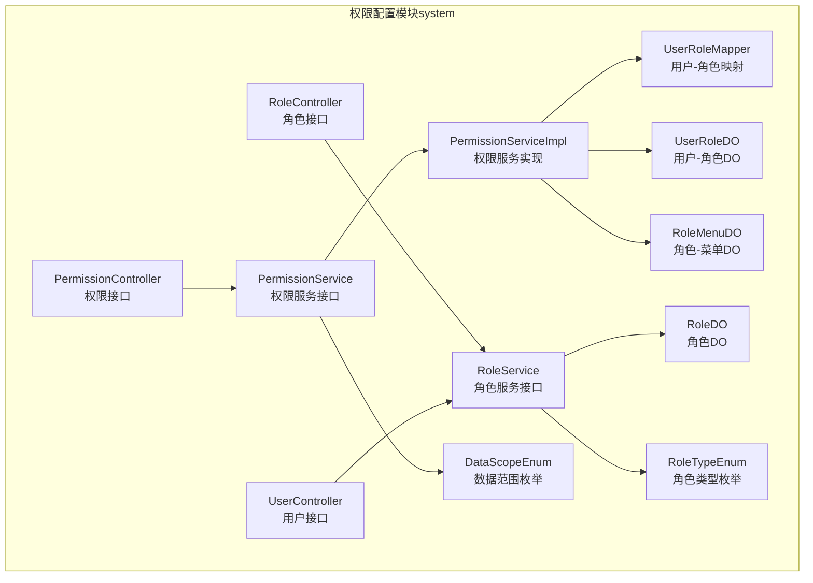
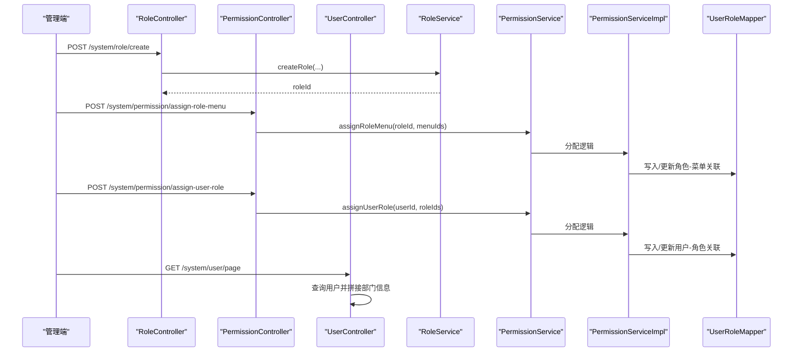
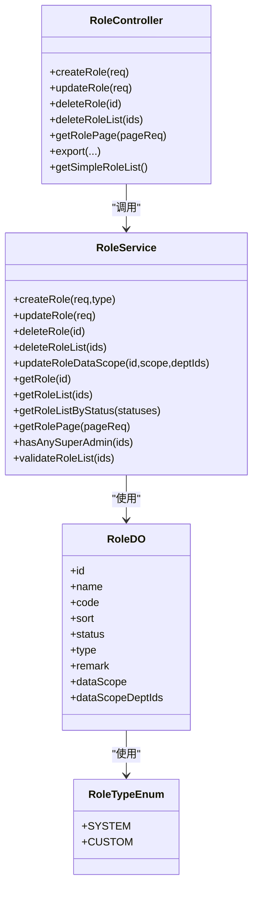
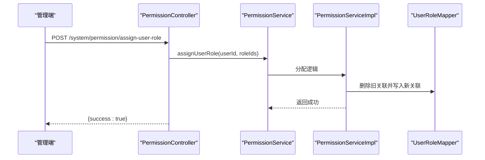
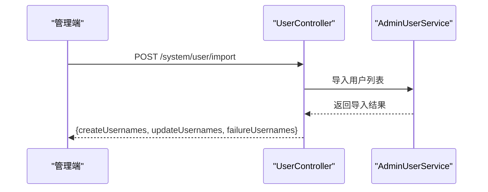
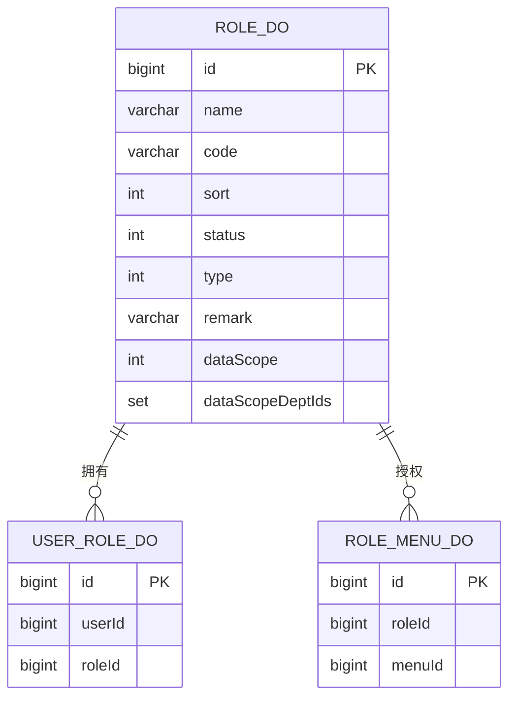
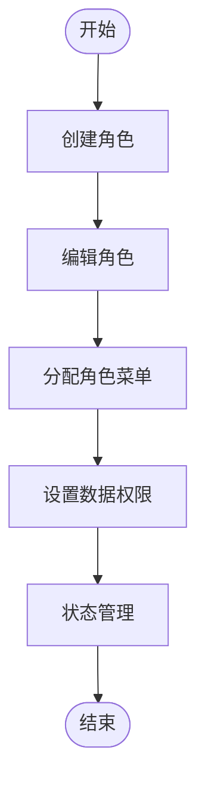
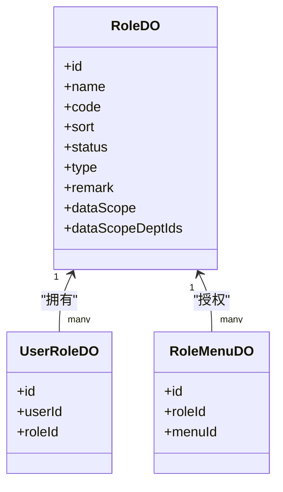
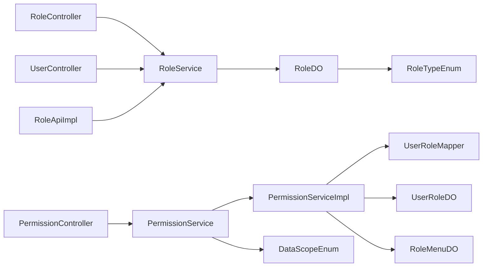

# 权限配置管理

<cite>
**本文引用的文件**
- [RoleController.java](file://yudao-module-system/src/main/java/cn/iocoder/yudao/module/system/controller/admin/permission/RoleController.java)
- [PermissionController.java](file://yudao-module-system/src/main/java/cn/iocoder/yudao/module/system/controller/admin/permission/PermissionController.java)
- [UserController.java](file://yudao-module-system/src/main/java/cn/iocoder/yudao/module/system/controller/admin/user/UserController.java)
- [RoleService.java](file://yudao-module-system/src/main/java/cn/iocoder/yudao/module/system/service/permission/RoleService.java)
- [PermissionService.java](file://yudao-module-system/src/main/java/cn/iocoder/yudao/module/system/service/permission/PermissionService.java)
- [PermissionServiceImpl.java](file://yudao-module-system/src/main/java/cn/iocoder/yudao/module/system/service/permission/PermissionServiceImpl.java)
- [RoleDO.java](file://yudao-module-system/src/main/java/cn/iocoder/yudao/module/system/dal/dataobject/permission/RoleDO.java)
- [UserRoleDO.java](file://yudao-module-system/src/main/java/cn/iocoder/yudao/module/system/dal/dataobject/permission/UserRoleDO.java)
- [RoleMenuDO.java](file://yudao-module-system/src/main/java/cn/iocoder/yudao/module/system/dal/dataobject/permission/RoleMenuDO.java)
- [UserRoleMapper.java](file://yudao-module-system/src/main/java/cn/iocoder/yudao/module/system/dal/mysql/permission/UserRoleMapper.java)
- [RoleApi.java](file://yudao-module-system/src/main/java/cn/iocoder/yudao/module/system/api/permission/RoleApi.java)
- [RoleApiImpl.java](file://yudao-module-system/src/main/java/cn/iocoder/yudao/module/system/api/permission/RoleApiImpl.java)
- [RoleTypeEnum.java](file://yudao-module-system/src/main/java/cn/iocoder/yudao/module/system/enums/permission/RoleTypeEnum.java)
- [DataScopeEnum.java](file://yudao-module-system/src/main/java/cn/iocoder/yudao/module/system/enums/permission/DataScopeEnum.java)
- [PermissionAssignUserRoleReqVO.java](file://yudao-module-system/src/main/java/cn/iocoder/yudao/module/system/controller/admin/permission/vo/permission/PermissionAssignUserRoleReqVO.java)
- [PermissionAssignRoleMenuReqVO.java](file://yudao-module-system/src/main/java/cn/iocoder/yudao/module/system/controller/admin/permission/vo/permission/PermissionAssignRoleMenuReqVO.java)
- [PermissionAssignRoleDataScopeReqVO.java](file://yudao-module-system/src/main/java/cn/iocoder/yudao/module/system/controller/admin/permission/vo/permission/PermissionAssignRoleDataScopeReqVO.java)
- [RoleSaveReqVO.java](file://yudao-module-system/src/main/java/cn/iocoder/yudao/module/system/controller/admin/permission/vo/role/RoleSaveReqVO.java)
- [RolePageReqVO.java](file://yudao-module-system/src/main/java/cn/iocoder/yudao/module/system/controller/admin/permission/vo/role/RolePageReqVO.java)
- [PermissionServiceTest.java](file://yudao-module-system/src/test/java/cn/iocoder/yudao/module/system/service/permission/PermissionServiceTest.java)
</cite>

## 目录
1. [简介](#简介)
2. [项目结构](#项目结构)
3. [核心组件](#核心组件)
4. [架构总览](#架构总览)
5. [详细组件分析](#详细组件分析)
6. [依赖分析](#依赖分析)
7. [性能考虑](#性能考虑)
8. [故障排查指南](#故障排查指南)
9. [结论](#结论)
10. [附录](#附录)

## 简介
本文件面向AgenticCPS系统的权限配置管理，围绕“角色管理、用户管理、权限分配”三大模块，系统性梳理权限配置的管理界面与操作流程，覆盖角色创建/编辑/删除/状态管理、角色权限分配、用户角色绑定、数据权限设置、以及批量操作（复制、导入导出、模板管理）等能力，并给出最佳实践与常见问题解决方案。

## 项目结构
权限配置相关代码主要位于系统模块（system）中，采用“控制器-服务-数据访问层-数据对象”的分层设计，配合枚举与VO对象完成输入输出与业务规则约束。

图示来源
- [RoleController.java:33-112](file://yudao-module-system/src/main/java/cn/iocoder/yudao/module/system/controller/admin/permission/RoleController.java#L33-L112)
- [PermissionController.java:28-83](file://yudao-module-system/src/main/java/cn/iocoder/yudao/module/system/controller/admin/permission/PermissionController.java#L28-L83)
- [UserController.java:38-182](file://yudao-module-system/src/main/java/cn/iocoder/yudao/module/system/controller/admin/user/UserController.java#L38-L182)
- [RoleService.java:18-132](file://yudao-module-system/src/main/java/cn/iocoder/yudao/module/system/service/permission/RoleService.java#L18-L132)
- [PermissionService.java:10-147](file://yudao-module-system/src/main/java/cn/iocoder/yudao/module/system/service/permission/PermissionService.java#L10-L147)
- [PermissionServiceImpl.java:1-23](file://yudao-module-system/src/main/java/cn/iocoder/yudao/module/system/service/permission/PermissionServiceImpl.java#L1-L23)
- [UserRoleMapper.java:12-36](file://yudao-module-system/src/main/java/cn/iocoder/yudao/module/system/dal/mysql/permission/UserRoleMapper.java#L12-L36)
- [RoleDO.java:22-79](file://yudao-module-system/src/main/java/cn/iocoder/yudao/module/system/dal/dataobject/permission/RoleDO.java#L22-L79)
- [UserRoleDO.java:15-35](file://yudao-module-system/src/main/java/cn/iocoder/yudao/module/system/dal/dataobject/permission/UserRoleDO.java#L15-L35)
- [RoleMenuDO.java:15-36](file://yudao-module-system/src/main/java/cn/iocoder/yudao/module/system/dal/dataobject/permission/RoleMenuDO.java#L15-L36)
- [RoleTypeEnum.java:8-22](file://yudao-module-system/src/main/java/cn/iocoder/yudao/module/system/enums/permission/RoleTypeEnum.java#L8-L22)
- [DataScopeEnum.java:18-41](file://yudao-module-system/src/main/java/cn/iocoder/yudao/module/system/enums/permission/DataScopeEnum.java#L18-L41)

章节来源
- [RoleController.java:33-112](file://yudao-module-system/src/main/java/cn/iocoder/yudao/module/system/controller/admin/permission/RoleController.java#L33-L112)
- [PermissionController.java:28-83](file://yudao-module-system/src/main/java/cn/iocoder/yudao/module/system/controller/admin/permission/PermissionController.java#L28-L83)
- [UserController.java:38-182](file://yudao-module-system/src/main/java/cn/iocoder/yudao/module/system/controller/admin/user/UserController.java#L38-L182)

## 核心组件
- 角色管理
  - 控制器：提供角色创建、更新、删除、分页、导出、获取精简列表等接口。
  - 服务接口：定义角色生命周期与查询能力。
- 权限管理
  - 控制器：提供角色菜单授权、角色数据权限授权、用户角色授权、查询用户角色列表等接口。
  - 服务接口与实现：负责权限分配、清理、缓存与数据权限计算。
- 用户管理
  - 控制器：提供用户增删改查、状态变更、密码重置、分页、导出、导入模板、批量导入等接口。
- 数据模型
  - 角色（RoleDO）、用户-角色（UserRoleDO）、角色-菜单（RoleMenuDO）。
- 枚举
  - 角色类型（内置/自定义）、数据范围（全部、指定部门、仅本部门、部门及子级、仅本人）。

章节来源
- [RoleController.java:33-112](file://yudao-module-system/src/main/java/cn/iocoder/yudao/module/system/controller/admin/permission/RoleController.java#L33-L112)
- [PermissionController.java:28-83](file://yudao-module-system/src/main/java/cn/iocoder/yudao/module/system/controller/admin/permission/PermissionController.java#L28-L83)
- [UserController.java:38-182](file://yudao-module-system/src/main/java/cn/iocoder/yudao/module/system/controller/admin/user/UserController.java#L38-L182)
- [RoleService.java:18-132](file://yudao-module-system/src/main/java/cn/iocoder/yudao/module/system/service/permission/RoleService.java#L18-L132)
- [PermissionService.java:10-147](file://yudao-module-system/src/main/java/cn/iocoder/yudao/module/system/service/permission/PermissionService.java#L10-L147)
- [RoleDO.java:22-79](file://yudao-module-system/src/main/java/cn/iocoder/yudao/module/system/dal/dataobject/permission/RoleDO.java#L22-L79)
- [UserRoleDO.java:15-35](file://yudao-module-system/src/main/java/cn/iocoder/yudao/module/system/dal/dataobject/permission/UserRoleDO.java#L15-L35)
- [RoleMenuDO.java:15-36](file://yudao-module-system/src/main/java/cn/iocoder/yudao/module/system/dal/dataobject/permission/RoleMenuDO.java#L15-L36)
- [RoleTypeEnum.java:8-22](file://yudao-module-system/src/main/java/cn/iocoder/yudao/module/system/enums/permission/RoleTypeEnum.java#L8-L22)
- [DataScopeEnum.java:18-41](file://yudao-module-system/src/main/java/cn/iocoder/yudao/module/system/enums/permission/DataScopeEnum.java#L18-L41)

## 架构总览
权限配置遵循“接口-服务-数据访问-持久层”的分层架构，控制器通过权限注解进行资源级鉴权，服务层协调数据对象与枚举，实现角色、菜单、用户、数据权限的统一管理。

图示来源
- [RoleController.java:42-55](file://yudao-module-system/src/main/java/cn/iocoder/yudao/module/system/controller/admin/permission/RoleController.java#L42-L55)
- [PermissionController.java:46-80](file://yudao-module-system/src/main/java/cn/iocoder/yudao/module/system/controller/admin/permission/PermissionController.java#L46-L80)
- [UserController.java:99-113](file://yudao-module-system/src/main/java/cn/iocoder/yudao/module/system/controller/admin/user/UserController.java#L99-L113)
- [PermissionServiceImpl.java:1-23](file://yudao-module-system/src/main/java/cn/iocoder/yudao/module/system/service/permission/PermissionServiceImpl.java#L1-L23)
- [UserRoleMapper.java:12-36](file://yudao-module-system/src/main/java/cn/iocoder/yudao/module/system/dal/mysql/permission/UserRoleMapper.java#L12-L36)

## 详细组件分析

### 角色管理模块
- 功能点
  - 角色创建：接收保存请求体，调用服务创建角色。
  - 角色更新：接收保存请求体，调用服务更新角色。
  - 角色删除：支持单个与批量删除。
  - 角色分页与导出：支持分页查询与Excel导出。
  - 获取精简角色列表：按启用状态返回排序后的角色列表。
- 关键接口
  - POST /system/role/create
  - PUT /system/role/update
  - DELETE /system/role/delete
  - DELETE /system/role/delete-list
  - GET /system/role/page
  - GET /system/role/export-excel
  - GET /system/role/list-all-simple
- 数据模型
  - 角色DO包含名称、编码、排序、状态、类型、备注、数据范围、指定部门集合等字段；类型枚举区分内置与自定义。

图示来源
- [RoleController.java:33-112](file://yudao-module-system/src/main/java/cn/iocoder/yudao/module/system/controller/admin/permission/RoleController.java#L33-L112)
- [RoleService.java:18-132](file://yudao-module-system/src/main/java/cn/iocoder/yudao/module/system/service/permission/RoleService.java#L18-L132)
- [RoleDO.java:22-79](file://yudao-module-system/src/main/java/cn/iocoder/yudao/module/system/dal/dataobject/permission/RoleDO.java#L22-L79)
- [RoleTypeEnum.java:8-22](file://yudao-module-system/src/main/java/cn/iocoder/yudao/module/system/enums/permission/RoleTypeEnum.java#L8-L22)

章节来源
- [RoleController.java:33-112](file://yudao-module-system/src/main/java/cn/iocoder/yudao/module/system/controller/admin/permission/RoleController.java#L33-L112)
- [RoleService.java:18-132](file://yudao-module-system/src/main/java/cn/iocoder/yudao/module/system/service/permission/RoleService.java#L18-L132)
- [RoleDO.java:22-79](file://yudao-module-system/src/main/java/cn/iocoder/yudao/module/system/dal/dataobject/permission/RoleDO.java#L22-L79)
- [RoleTypeEnum.java:8-22](file://yudao-module-system/src/main/java/cn/iocoder/yudao/module/system/enums/permission/RoleTypeEnum.java#L8-L22)

### 权限分配模块
- 功能点
  - 角色菜单授权：根据角色与菜单集合进行授权或重置。
  - 角色数据权限授权：设置数据范围与指定部门集合。
  - 用户角色授权：为用户绑定角色集合。
  - 查询用户角色：获取用户当前角色集合。
- 关键接口
  - GET /system/permission/list-role-menus
  - POST /system/permission/assign-role-menu
  - POST /system/permission/assign-role-data-scope
  - GET /system/permission/list-user-roles
  - POST /system/permission/assign-user-role
- 服务实现要点
  - 在多租户场景下，先过滤掉未开通的菜单再执行授权。
  - 提供角色/菜单删除后的关联清理方法，确保数据一致性。

图示来源
- [PermissionController.java:46-80](file://yudao-module-system/src/main/java/cn/iocoder/yudao/module/system/controller/admin/permission/PermissionController.java#L46-L80)
- [PermissionService.java:86-126](file://yudao-module-system/src/main/java/cn/iocoder/yudao/module/system/service/permission/PermissionService.java#L86-L126)
- [PermissionServiceImpl.java:1-23](file://yudao-module-system/src/main/java/cn/iocoder/yudao/module/system/service/permission/PermissionServiceImpl.java#L1-L23)
- [UserRoleMapper.java:12-36](file://yudao-module-system/src/main/java/cn/iocoder/yudao/module/system/dal/mysql/permission/UserRoleMapper.java#L12-L36)

章节来源
- [PermissionController.java:28-83](file://yudao-module-system/src/main/java/cn/iocoder/yudao/module/system/controller/admin/permission/PermissionController.java#L28-L83)
- [PermissionService.java:10-147](file://yudao-module-system/src/main/java/cn/iocoder/yudao/module/system/service/permission/PermissionService.java#L10-L147)
- [PermissionServiceImpl.java:1-23](file://yudao-module-system/src/main/java/cn/iocoder/yudao/module/system/service/permission/PermissionServiceImpl.java#L1-L23)
- [UserRoleMapper.java:12-36](file://yudao-module-system/src/main/java/cn/iocoder/yudao/module/system/dal/mysql/permission/UserRoleMapper.java#L12-L36)

### 用户管理模块
- 功能点
  - 用户增删改查、状态变更、密码重置、分页、导出、导入模板、批量导入。
- 关键接口
  - POST /system/user/create
  - PUT /system/user/update
  - DELETE /system/user/delete
  - DELETE /system/user/delete-list
  - PUT /system/user/update-password
  - PUT /system/user/update-status
  - GET /system/user/page
  - GET /system/user/export-excel
  - GET /system/user/get-import-template
  - POST /system/user/import

图示来源
- [UserController.java:168-180](file://yudao-module-system/src/main/java/cn/iocoder/yudao/module/system/controller/admin/user/UserController.java#L168-L180)

章节来源
- [UserController.java:38-182](file://yudao-module-system/src/main/java/cn/iocoder/yudao/module/system/controller/admin/user/UserController.java#L38-L182)

### 权限数据模型
- 角色（RoleDO）
  - 字段：id、name、code、sort、status、type、remark、dataScope、dataScopeDeptIds。
  - 类型：内置/自定义。
- 用户-角色（UserRoleDO）
  - 字段：id、userId、roleId。
  - 关系：多对多中间表。
- 角色-菜单（RoleMenuDO）
  - 字段：id、roleId、menuId。
  - 关系：多对多中间表。
- 枚举
  - 角色类型：SYSTEM（内置）、CUSTOM（自定义）。
  - 数据范围：ALL（全部）、DEPT_CUSTOM（指定部门）、DEPT_ONLY（仅本部门）、DEPT_AND_CHILD（部门及子级）、SELF（仅本人）。

图示来源
- [RoleDO.java:22-79](file://yudao-module-system/src/main/java/cn/iocoder/yudao/module/system/dal/dataobject/permission/RoleDO.java#L22-L79)
- [UserRoleDO.java:15-35](file://yudao-module-system/src/main/java/cn/iocoder/yudao/module/system/dal/dataobject/permission/UserRoleDO.java#L15-L35)
- [RoleMenuDO.java:15-36](file://yudao-module-system/src/main/java/cn/iocoder/yudao/module/system/dal/dataobject/permission/RoleMenuDO.java#L15-L36)
- [RoleTypeEnum.java:8-22](file://yudao-module-system/src/main/java/cn/iocoder/yudao/module/system/enums/permission/RoleTypeEnum.java#L8-L22)
- [DataScopeEnum.java:18-41](file://yudao-module-system/src/main/java/cn/iocoder/yudao/module/system/enums/permission/DataScopeEnum.java#L18-L41)

章节来源
- [RoleDO.java:22-79](file://yudao-module-system/src/main/java/cn/iocoder/yudao/module/system/dal/dataobject/permission/RoleDO.java#L22-L79)
- [UserRoleDO.java:15-35](file://yudao-module-system/src/main/java/cn/iocoder/yudao/module/system/dal/dataobject/permission/UserRoleDO.java#L15-L35)
- [RoleMenuDO.java:15-36](file://yudao-module-system/src/main/java/cn/iocoder/yudao/module/system/dal/dataobject/permission/RoleMenuDO.java#L15-L36)
- [RoleTypeEnum.java:8-22](file://yudao-module-system/src/main/java/cn/iocoder/yudao/module/system/enums/permission/RoleTypeEnum.java#L8-L22)
- [DataScopeEnum.java:18-41](file://yudao-module-system/src/main/java/cn/iocoder/yudao/module/system/enums/permission/DataScopeEnum.java#L18-L41)

### 角色配置流程
- 角色创建
  - 输入：角色保存请求体（名称、编码、排序、状态、备注等）。
  - 流程：控制器接收请求 → 服务创建角色 → 返回角色ID。
- 角色信息编辑
  - 输入：角色更新请求体。
  - 流程：控制器接收请求 → 服务更新角色。
- 角色权限分配
  - 输入：角色ID与菜单ID集合。
  - 流程：控制器接收请求 → 多租户过滤 → 服务分配角色菜单。
- 角色状态管理
  - 输入：角色状态（启用/禁用）。
  - 流程：通过角色分页与状态筛选接口进行管理。

图示来源
- [RoleController.java:42-55](file://yudao-module-system/src/main/java/cn/iocoder/yudao/module/system/controller/admin/permission/RoleController.java#L42-L55)
- [PermissionController.java:46-64](file://yudao-module-system/src/main/java/cn/iocoder/yudao/module/system/controller/admin/permission/PermissionController.java#L46-L64)

章节来源
- [RoleController.java:33-112](file://yudao-module-system/src/main/java/cn/iocoder/yudao/module/system/controller/admin/permission/RoleController.java#L33-L112)
- [PermissionController.java:28-83](file://yudao-module-system/src/main/java/cn/iocoder/yudao/module/system/controller/admin/permission/PermissionController.java#L28-L83)

### 用户权限配置机制
- 用户角色绑定
  - 输入：用户ID与角色ID集合。
  - 流程：控制器接收请求 → 服务分配用户角色 → 清理旧关联并写入新关联。
- 临时权限授予
  - 当前代码未直接体现“临时权限”字段或接口，建议通过“角色-菜单”与“数据范围”组合实现临时授权场景。
- 权限继承关系
  - 用户通过角色继承菜单权限；角色可设置数据范围以控制数据可见性。

图示来源
- [PermissionController.java:74-80](file://yudao-module-system/src/main/java/cn/iocoder/yudao/module/system/controller/admin/permission/PermissionController.java#L74-L80)
- [PermissionService.java:86-126](file://yudao-module-system/src/main/java/cn/iocoder/yudao/module/system/service/permission/PermissionService.java#L86-L126)
- [UserRoleMapper.java:12-36](file://yudao-module-system/src/main/java/cn/iocoder/yudao/module/system/dal/mysql/permission/UserRoleMapper.java#L12-L36)

章节来源
- [PermissionController.java:28-83](file://yudao-module-system/src/main/java/cn/iocoder/yudao/module/system/controller/admin/permission/PermissionController.java#L28-L83)
- [PermissionService.java:10-147](file://yudao-module-system/src/main/java/cn/iocoder/yudao/module/system/service/permission/PermissionService.java#L10-L147)
- [UserRoleMapper.java:12-36](file://yudao-module-system/src/main/java/cn/iocoder/yudao/module/system/dal/mysql/permission/UserRoleMapper.java#L12-L36)

### 权限数据模型与关系
- 角色（RoleDO）
  - 字段：id、name、code、sort、status、type、remark、dataScope、dataScopeDeptIds。
  - 关联：与UserRoleDO一对多，与RoleMenuDO一对多。
- 用户-角色（UserRoleDO）
  - 字段：id、userId、roleId。
  - 关联：多对多中间表。
- 角色-菜单（RoleMenuDO）
  - 字段：id、roleId、menuId。
  - 关联：多对多中间表。

图示来源
- [RoleDO.java:22-79](file://yudao-module-system/src/main/java/cn/iocoder/yudao/module/system/dal/dataobject/permission/RoleDO.java#L22-L79)
- [UserRoleDO.java:15-35](file://yudao-module-system/src/main/java/cn/iocoder/yudao/module/system/dal/dataobject/permission/UserRoleDO.java#L15-L35)
- [RoleMenuDO.java:15-36](file://yudao-module-system/src/main/java/cn/iocoder/yudao/module/system/dal/dataobject/permission/RoleMenuDO.java#L15-L36)

章节来源
- [RoleDO.java:22-79](file://yudao-module-system/src/main/java/cn/iocoder/yudao/module/system/dal/dataobject/permission/RoleDO.java#L22-L79)
- [UserRoleDO.java:15-35](file://yudao-module-system/src/main/java/cn/iocoder/yudao/module/system/dal/dataobject/permission/UserRoleDO.java#L15-L35)
- [RoleMenuDO.java:15-36](file://yudao-module-system/src/main/java/cn/iocoder/yudao/module/system/dal/dataobject/permission/RoleMenuDO.java#L15-L36)

### 批量操作功能
- 权限复制
  - 可通过“复制角色菜单授权”实现：先查询目标角色的菜单集合，再调用“赋予角色菜单”接口对其他角色进行授权。
- 权限导入导出
  - 角色：提供导出Excel接口，支持分页导出。
  - 用户：提供导出Excel与导入模板接口，支持批量导入用户。
- 权限模板管理
  - 建议在业务侧维护“角色模板”，通过复制授权的方式批量应用到多个角色。

章节来源
- [RoleController.java:99-109](file://yudao-module-system/src/main/java/cn/iocoder/yudao/module/system/controller/admin/permission/RoleController.java#L99-L109)
- [UserController.java:139-179](file://yudao-module-system/src/main/java/cn/iocoder/yudao/module/system/controller/admin/user/UserController.java#L139-L179)

### 最佳实践指南
- 权限最小化原则
  - 仅授予完成工作所需的最小权限集合；避免授予“全部数据权限”。
- 权限定期审计
  - 定期核对角色菜单授权与用户角色绑定，清理长期未使用的权限。
- 权限变更审批流程
  - 建议对管理员角色与高风险菜单授权引入审批流程，记录变更日志。
- 数据权限策略
  - 合理选择数据范围（如仅本人、仅本部门、部门及子级），避免越权访问。

## 依赖分析
- 控制器依赖服务接口，服务接口依赖数据对象与枚举。
- 权限服务实现依赖用户-角色映射以完成授权与清理。
- 角色API对外暴露角色校验能力，供其他模块复用。

图示来源
- [RoleController.java:33-112](file://yudao-module-system/src/main/java/cn/iocoder/yudao/module/system/controller/admin/permission/RoleController.java#L33-L112)
- [PermissionController.java:28-83](file://yudao-module-system/src/main/java/cn/iocoder/yudao/module/system/controller/admin/permission/PermissionController.java#L28-L83)
- [UserController.java:38-182](file://yudao-module-system/src/main/java/cn/iocoder/yudao/module/system/controller/admin/user/UserController.java#L38-L182)
- [RoleService.java:18-132](file://yudao-module-system/src/main/java/cn/iocoder/yudao/module/system/service/permission/RoleService.java#L18-L132)
- [PermissionService.java:10-147](file://yudao-module-system/src/main/java/cn/iocoder/yudao/module/system/service/permission/PermissionService.java#L10-L147)
- [PermissionServiceImpl.java:1-23](file://yudao-module-system/src/main/java/cn/iocoder/yudao/module/system/service/permission/PermissionServiceImpl.java#L1-L23)
- [UserRoleMapper.java:12-36](file://yudao-module-system/src/main/java/cn/iocoder/yudao/module/system/dal/mysql/permission/UserRoleMapper.java#L12-L36)
- [RoleDO.java:22-79](file://yudao-module-system/src/main/java/cn/iocoder/yudao/module/system/dal/dataobject/permission/RoleDO.java#L22-L79)
- [UserRoleDO.java:15-35](file://yudao-module-system/src/main/java/cn/iocoder/yudao/module/system/dal/dataobject/permission/UserRoleDO.java#L15-L35)
- [RoleMenuDO.java:15-36](file://yudao-module-system/src/main/java/cn/iocoder/yudao/module/system/dal/dataobject/permission/RoleMenuDO.java#L15-L36)
- [RoleTypeEnum.java:8-22](file://yudao-module-system/src/main/java/cn/iocoder/yudao/module/system/enums/permission/RoleTypeEnum.java#L8-L22)
- [DataScopeEnum.java:18-41](file://yudao-module-system/src/main/java/cn/iocoder/yudao/module/system/enums/permission/DataScopeEnum.java#L18-L41)
- [RoleApiImpl.java:14-24](file://yudao-module-system/src/main/java/cn/iocoder/yudao/module/system/api/permission/RoleApiImpl.java#L14-L24)

章节来源
- [RoleApiImpl.java:14-24](file://yudao-module-system/src/main/java/cn/iocoder/yudao/module/system/api/permission/RoleApiImpl.java#L14-L24)

## 性能考虑
- 批量操作
  - 使用分页导出与批量导入减少单次请求压力。
- 缓存与查询
  - 优先使用“从缓存获取用户角色列表”接口，降低数据库压力。
- 多租户过滤
  - 在授权前先过滤未开通菜单，避免无效写入。

## 故障排查指南
- 角色删除后关联清理
  - 若删除角色或菜单后出现脏数据，检查服务实现中的清理方法是否正确执行。
- 授权失败或权限未生效
  - 确认用户角色绑定与角色菜单授权是否正确；检查数据权限范围设置。
- 导入失败
  - 查看导入响应中的失败用户名与原因，逐条修正后再尝试导入。

章节来源
- [PermissionServiceTest.java:142-204](file://yudao-module-system/src/test/java/cn/iocoder/yudao/module/system/service/permission/PermissionServiceTest.java#L142-L204)

## 结论
AgenticCPS权限配置管理以清晰的分层架构与完善的接口设计支撑角色、用户与权限的全生命周期管理。通过角色-菜单与数据范围的组合，可灵活实现最小权限与数据隔离；结合批量导出导入与模板复制，可高效完成大规模权限治理。建议在生产环境中配合审计与审批流程，持续优化权限策略。

## 附录
- 关键接口一览
  - 角色：POST /system/role/create、PUT /system/role/update、DELETE /system/role/delete、GET /system/role/page、GET /system/role/export-excel、GET /system/role/list-all-simple
  - 权限：GET /system/permission/list-role-menus、POST /system/permission/assign-role-menu、POST /system/permission/assign-role-data-scope、GET /system/permission/list-user-roles、POST /system/permission/assign-user-role
  - 用户：POST /system/user/create、PUT /system/user/update、DELETE /system/user/delete、GET /system/user/page、GET /system/user/export-excel、GET /system/user/get-import-template、POST /system/user/import