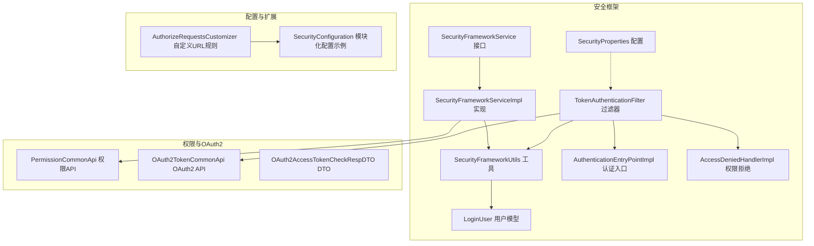
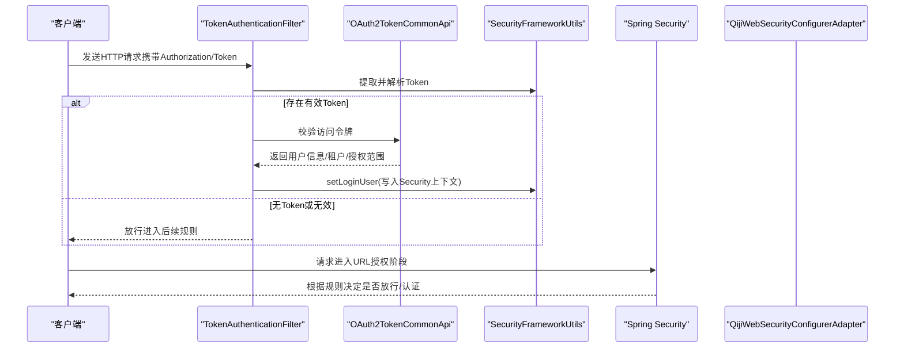
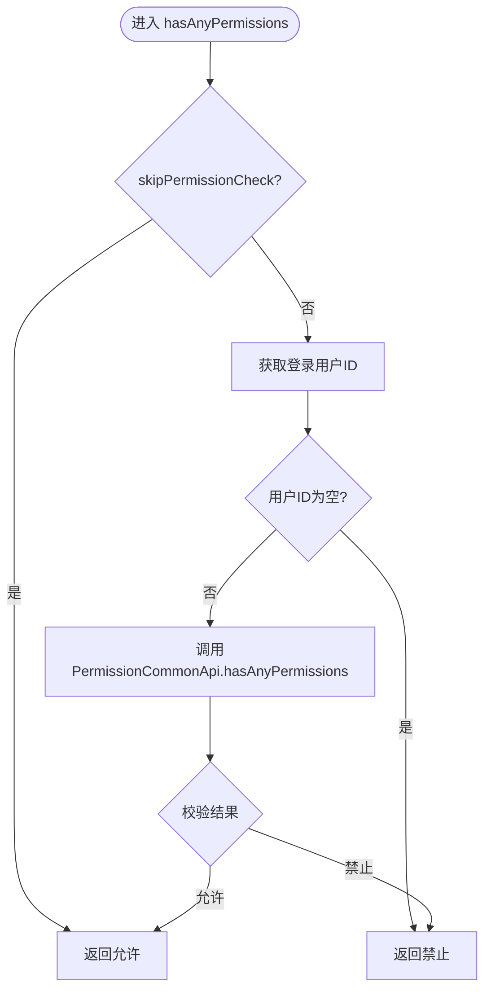
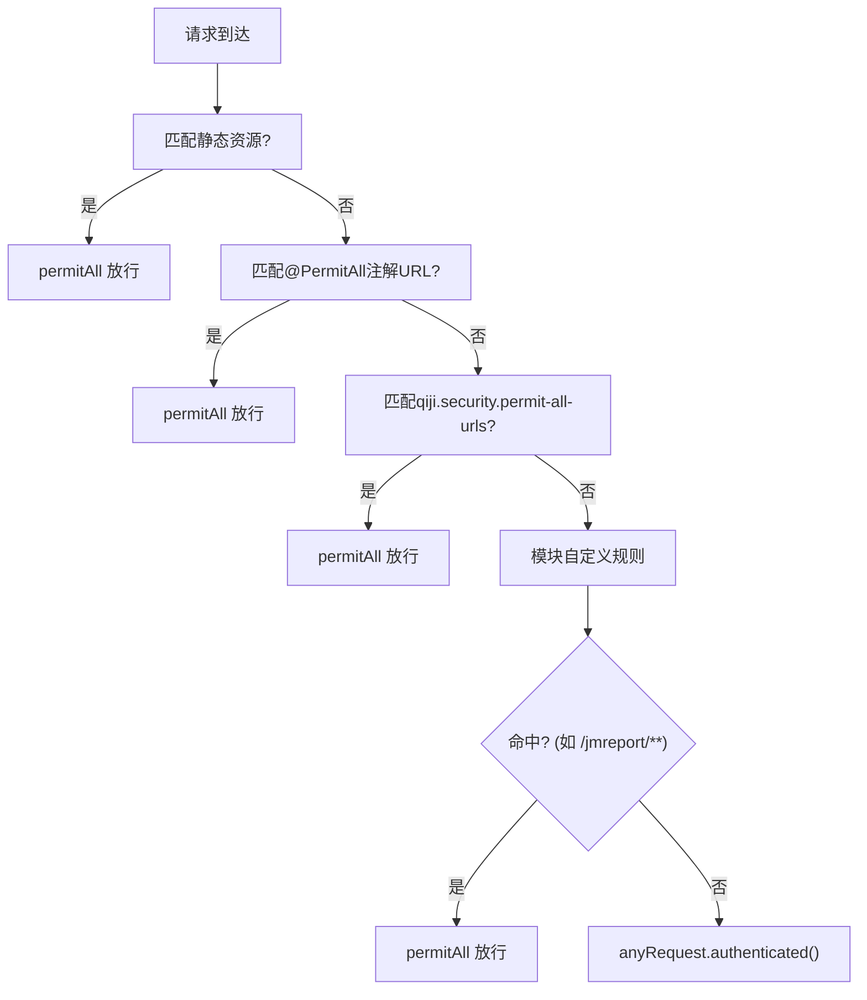
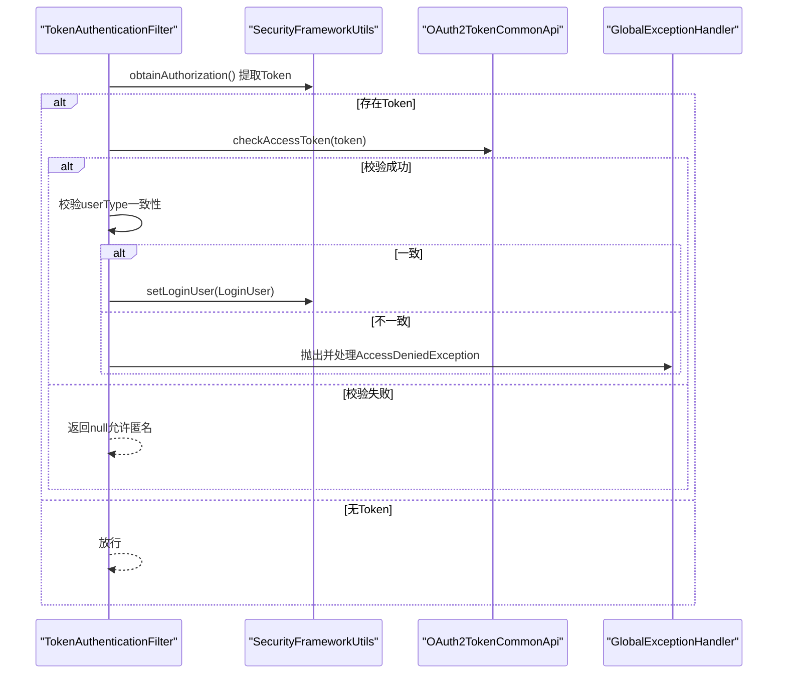
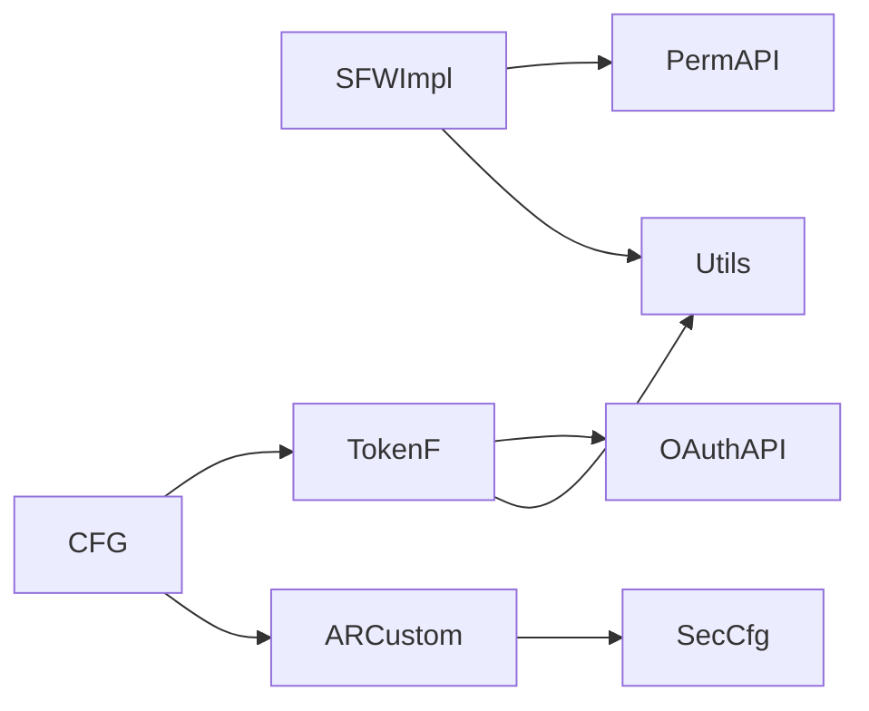

# 权限验证机制

<cite>
**本文引用的文件**   
- [SecurityFrameworkService.java](file://qiji-framework/qiji-spring-boot-starter-security/src/main/java/com.qiji.cps/framework/security/core/service/SecurityFrameworkService.java)
- [SecurityFrameworkServiceImpl.java](file://qiji-framework/qiji-spring-boot-starter-security/src/main/java/com.qiji.cps/framework/security/core/service/SecurityFrameworkServiceImpl.java)
- [AuthorizeRequestsCustomizer.java](file://qiji-framework/qiji-spring-boot-starter-security/src/main/java/com.qiji.cps/framework/security/config/AuthorizeRequestsCustomizer.java)
- [QijiWebSecurityConfigurerAdapter.java](file://qiji-framework/qiji-spring-boot-starter-security/src/main/java/com.qiji.cps/framework/security/config/QijiWebSecurityConfigurerAdapter.java)
- [TokenAuthenticationFilter.java](file://qiji-framework/qiji-spring-boot-starter-security/src/main/java/com.qiji.cps/framework/security/core/filter/TokenAuthenticationFilter.java)
- [SecurityFrameworkUtils.java](file://qiji-framework/qiji-spring-boot-starter-security/src/main/java/com.qiji.cps/framework/security/core/util/SecurityFrameworkUtils.java)
- [LoginUser.java](file://qiji-framework/qiji-spring-boot-starter-security/src/main/java/com.qiji.cps/framework/security/core/LoginUser.java)
- [SecurityProperties.java](file://qiji-framework/qiji-spring-boot-starter-security/src/main/java/com.qiji.cps/framework/security/config/SecurityProperties.java)
- [PermissionCommonApi.java](file://qiji-framework/qiji-common/src/main/java/com.qiji.cps/framework/common/biz/system/permission/PermissionCommonApi.java)
- [OAuth2TokenCommonApi.java](file://qiji-framework/qiji-common/src/main/java/com.qiji.cps/framework/common/biz/system/oauth2/OAuth2TokenCommonApi.java)
- [OAuth2AccessTokenCheckRespDTO.java](file://qiji-framework/qiji-common/src/main/java/com.qiji.cps/framework/common/biz/system/oauth2/dto/OAuth2AccessTokenCheckRespDTO.java)
- [AuthenticationEntryPointImpl.java](file://qiji-framework/qiji-spring-boot-starter-security/src/main/java/com.qiji.cps/framework/security/core/handler/AuthenticationEntryPointImpl.java)
- [AccessDeniedHandlerImpl.java](file://qiji-framework/qiji-spring-boot-starter-security/src/main/java/com.qiji.cps/framework/security/core/handler/AccessDeniedHandlerImpl.java)
- [SecurityConfiguration.java](file://qiji-module-report/src/main/java/com.qiji.cps/module/report/framework/security/config/SecurityConfiguration.java)
</cite>

## 目录
1. [引言](#引言)
2. [项目结构](#项目结构)
3. [核心组件](#核心组件)
4. [架构总览](#架构总览)
5. [详细组件分析](#详细组件分析)
6. [依赖分析](#依赖分析)
7. [性能考量](#性能考量)
8. [故障排查指南](#故障排查指南)
9. [结论](#结论)
10. [附录](#附录)

## 引言
本文件面向AgenticCPS系统的权限验证机制，系统性梳理从请求拦截、身份认证、权限检查到访问决策的完整流程。重点覆盖以下内容：
- SecurityFrameworkServiceImpl中权限验证方法的实现原理，包括hasPermission、hasAnyPermissions、hasRole、hasAnyRoles、hasScope等。
- AuthorizeRequestsCustomizer的URL权限配置机制，包括静态资源放行、接口权限映射、匿名访问配置等。
- AuthenticationAuthenticationFilter（即TokenAuthenticationFilter）的身份认证过滤器实现，包括JWT令牌解析、用户信息加载、认证状态维护等。
- 权限验证的执行顺序和优先级，以及异常处理机制。
- 实际应用场景与配置示例，包括接口权限保护、页面元素权限控制等。

## 项目结构
围绕权限验证的关键模块分布如下：
- 安全框架与配置：SecurityFrameworkService、AuthorizeRequestsCustomizer、QijiWebSecurityConfigurerAdapter、TokenAuthenticationFilter、SecurityFrameworkUtils、LoginUser、SecurityProperties、AuthenticationEntryPointImpl、AccessDeniedHandlerImpl
- 权限与OAuth2能力：PermissionCommonApi、OAuth2TokenCommonApi、OAuth2AccessTokenCheckRespDTO
- 模块化扩展：SecurityConfiguration（示例：Report模块）

图表来源
- [SecurityFrameworkService.java:1-59](file://qiji-framework/qiji-spring-boot-starter-security/src/main/java/com.qiji.cps/framework/security/core/service/SecurityFrameworkService.java#L1-L59)
- [SecurityFrameworkServiceImpl.java:1-84](file://qiji-framework/qiji-spring-boot-starter-security/src/main/java/com.qiji.cps/framework/security/core/service/SecurityFrameworkServiceImpl.java#L1-L84)
- [AuthorizeRequestsCustomizer.java:1-35](file://qiji-framework/qiji-spring-boot-starter-security/src/main/java/com.qiji.cps/framework/security/config/AuthorizeRequestsCustomizer.java#L1-L35)
- [QijiWebSecurityConfigurerAdapter.java:1-222](file://qiji-framework/qiji-spring-boot-starter-security/src/main/java/com.qiji.cps/framework/security/config/QijiWebSecurityConfigurerAdapter.java#L1-L222)
- [TokenAuthenticationFilter.java:1-120](file://qiji-framework/qiji-spring-boot-starter-security/src/main/java/com.qiji.cps/framework/security/core/filter/TokenAuthenticationFilter.java#L1-L120)
- [SecurityFrameworkUtils.java:1-161](file://qiji-framework/qiji-spring-boot-starter-security/src/main/java/com.qiji.cps/framework/security/core/util/SecurityFrameworkUtils.java#L1-L161)
- [LoginUser.java:1-75](file://qiji-framework/qiji-spring-boot-starter-security/src/main/java/com.qiji.cps/framework/security/core/LoginUser.java#L1-L75)
- [SecurityProperties.java:1-52](file://qiji-framework/qiji-spring-boot-starter-security/src/main/java/com.qiji.cps/framework/security/config/SecurityProperties.java#L1-L52)
- [PermissionCommonApi.java:1-38](file://qiji-framework/qiji-common/src/main/java/com.qiji.cps/framework/common/biz/system/permission/PermissionCommonApi.java#L1-L38)
- [OAuth2TokenCommonApi.java:1-49](file://qiji-framework/qiji-common/src/main/java/com.qiji.cps/framework/common/biz/system/oauth2/OAuth2TokenCommonApi.java#L1-L49)
- [OAuth2AccessTokenCheckRespDTO.java:1-43](file://qiji-framework/qiji-common/src/main/java/com.qiji.cps/framework/common/biz/system/oauth2/dto/OAuth2AccessTokenCheckRespDTO.java#L1-L43)
- [AuthenticationEntryPointImpl.java:1-35](file://qiji-framework/qiji-spring-boot-starter-security/src/main/java/com.qiji.cps/framework/security/core/handler/AuthenticationEntryPointImpl.java#L1-L35)
- [AccessDeniedHandlerImpl.java:1-28](file://qiji-framework/qiji-spring-boot-starter-security/src/main/java/com.qiji.cps/framework/security/core/handler/AccessDeniedHandlerImpl.java#L1-L28)
- [SecurityConfiguration.java:1-31](file://qiji-module-report/src/main/java/com.qiji.cps/module/report/framework/security/config/SecurityConfiguration.java#L1-L31)

章节来源
- [QijiWebSecurityConfigurerAdapter.java:110-153](file://qiji-framework/qiji-spring-boot-starter-security/src/main/java/com.qiji.cps/framework/security/config/QijiWebSecurityConfigurerAdapter.java#L110-L153)
- [AuthorizeRequestsCustomizer.java:16-35](file://qiji-framework/qiji-spring-boot-starter-security/src/main/java/com.qiji.cps/framework/security/config/AuthorizeRequestsCustomizer.java#L16-L35)

## 核心组件
- SecurityFrameworkService：定义权限校验接口，包括hasPermission、hasAnyPermissions、hasRole、hasAnyRoles、hasScope、hasAnyScopes。
- SecurityFrameworkServiceImpl：默认实现，封装跨租户跳过校验、基于用户上下文的权限/角色/授权范围判断，并委托PermissionCommonApi完成实际校验。
- TokenAuthenticationFilter：请求拦截器，负责从请求中提取并解析JWT，调用OAuth2TokenCommonApi校验令牌有效性，构建LoginUser并写入Spring Security上下文。
- SecurityFrameworkUtils：安全工具集，提供从请求提取Token、获取当前用户、设置当前用户、跨租户跳过校验等能力。
- AuthorizeRequestsCustomizer：URL权限自定义配置抽象类，支持按模块扩展URL放行或鉴权规则。
- QijiWebSecurityConfigurerAdapter：主配置适配器，串联过滤器链、设置匿名放行规则、兜底认证策略，并注册自定义URL规则。
- LoginUser：登录用户载体，包含用户标识、用户类型、额外信息、租户、授权范围、过期时间等。
- SecurityProperties：安全相关配置项，如Token头名、参数名、mock开关与密钥、免登录URL列表等。
- PermissionCommonApi：权限通用API，提供hasAnyPermissions、hasAnyRoles、部门数据权限查询等。
- OAuth2TokenCommonApi/OAuth2AccessTokenCheckRespDTO：OAuth2令牌校验API与响应DTO，提供用户维度的令牌校验、用户类型匹配、授权范围等。

章节来源
- [SecurityFrameworkService.java:8-59](file://qiji-framework/qiji-spring-boot-starter-security/src/main/java/com.qiji.cps/framework/security/core/service/SecurityFrameworkService.java#L8-L59)
- [SecurityFrameworkServiceImpl.java:20-84](file://qiji-framework/qiji-spring-boot-starter-security/src/main/java/com.qiji.cps/framework/security/core/service/SecurityFrameworkServiceImpl.java#L20-L84)
- [TokenAuthenticationFilter.java:32-120](file://qiji-framework/qiji-spring-boot-starter-security/src/main/java/com.qiji.cps/framework/security/core/filter/TokenAuthenticationFilter.java#L32-L120)
- [SecurityFrameworkUtils.java:24-161](file://qiji-framework/qiji-spring-boot-starter-security/src/main/java/com.qiji.cps/framework/security/core/util/SecurityFrameworkUtils.java#L24-L161)
- [AuthorizeRequestsCustomizer.java:16-35](file://qiji-framework/qiji-spring-boot-starter-security/src/main/java/com.qiji.cps/framework/security/config/AuthorizeRequestsCustomizer.java#L16-L35)
- [QijiWebSecurityConfigurerAdapter.java:46-222](file://qiji-framework/qiji-spring-boot-starter-security/src/main/java/com.qiji.cps/framework/security/config/QijiWebSecurityConfigurerAdapter.java#L46-L222)
- [LoginUser.java:18-75](file://qiji-framework/qiji-spring-boot-starter-security/src/main/java/com.qiji.cps/framework/security/core/LoginUser.java#L18-L75)
- [SecurityProperties.java:12-52](file://qiji-framework/qiji-spring-boot-starter-security/src/main/java/com.qiji.cps/framework/security/config/SecurityProperties.java#L12-L52)
- [PermissionCommonApi.java:10-38](file://qiji-framework/qiji-common/src/main/java/com.qiji.cps/framework/common/biz/system/permission/PermissionCommonApi.java#L10-L38)
- [OAuth2TokenCommonApi.java:14-49](file://qiji-framework/qiji-common/src/main/java/com.qiji.cps/framework/common/biz/system/oauth2/OAuth2TokenCommonApi.java#L14-L49)
- [OAuth2AccessTokenCheckRespDTO.java:15-43](file://qiji-framework/qiji-common/src/main/java/com.qiji.cps/framework/common/biz/system/oauth2/dto/OAuth2AccessTokenCheckRespDTO.java#L15-L43)

## 架构总览
AgenticCPS的权限验证采用“URL放行规则 + 过滤器链 + 方法级权限”的三层防护：
- URL放行规则：静态资源匿名、注解免登、统一免登白名单、模块化自定义规则。
- 过滤器链：TokenAuthenticationFilter在UsernamePasswordAuthenticationFilter之前执行，负责令牌校验与用户上下文注入。
- 方法级权限：基于@EnableMethodSecurity启用securedEnabled，结合SecurityFrameworkService在业务层进行细粒度校验。

图表来源
- [TokenAuthenticationFilter.java:42-93](file://qiji-framework/qiji-spring-boot-starter-security/src/main/java/com.qiji.cps/framework/security/core/filter/TokenAuthenticationFilter.java#L42-L93)
- [SecurityFrameworkUtils.java:41-92](file://qiji-framework/qiji-spring-boot-starter-security/src/main/java/com.qiji.cps/framework/security/core/util/SecurityFrameworkUtils.java#L41-L92)
- [QijiWebSecurityConfigurerAdapter.java:110-153](file://qiji-framework/qiji-spring-boot-starter-security/src/main/java/com.qiji.cps/framework/security/config/QijiWebSecurityConfigurerAdapter.java#L110-L153)

## 详细组件分析

### SecurityFrameworkServiceImpl 权限验证方法实现原理
- hasPermission/hasRole/hasScope：分别委托hasAnyPermissions/hasAnyRoles/hasAnyScopes，保持语义一致。
- hasAnyPermissions：
  - 跨租户场景：若skipPermissionCheck为真则直接放行。
  - 获取当前登录用户ID，若为空则判定无权限。
  - 委托PermissionCommonApi.hasAnyPermissions完成权限集合判断。
- hasAnyRoles：逻辑与权限类似，但针对角色集合。
- hasAnyScopes：同样先跨租户放行，再从SecurityFrameworkUtils获取LoginUser，比较scopes集合。

图表来源
- [SecurityFrameworkServiceImpl.java:24-42](file://qiji-framework/qiji-spring-boot-starter-security/src/main/java/com.qiji.cps/framework/security/core/service/SecurityFrameworkServiceImpl.java#L24-L42)
- [SecurityFrameworkUtils.java:148-158](file://qiji-framework/qiji-spring-boot-starter-security/src/main/java/com.qiji.cps/framework/security/core/util/SecurityFrameworkUtils.java#L148-L158)
- [PermissionCommonApi.java:19-28](file://qiji-framework/qiji-common/src/main/java/com.qiji.cps/framework/common/biz/system/permission/PermissionCommonApi.java#L19-L28)

章节来源
- [SecurityFrameworkServiceImpl.java:20-84](file://qiji-framework/qiji-spring-boot-starter-security/src/main/java/com.qiji.cps/framework/security/core/service/SecurityFrameworkServiceImpl.java#L20-L84)

### AuthorizeRequestsCustomizer 的URL权限配置机制
- 全局共享规则（QijiWebSecurityConfigurerAdapter）：
  - 静态资源匿名放行（GET / *.html/css/js）。
  - 从注解扫描得到的@PermitAll URL列表，按HTTP方法分别放行。
  - 配置项qiji.security.permit-all-urls中的URL统一放行。
  - 未被上述规则覆盖的请求统一要求认证。
- 模块化自定义规则（AuthorizeRequestsCustomizer）：
  - 每个模块可提供自定义的AuthorizeRequestsCustomizer Bean，通过customize(registry)追加规则。
  - 示例：Report模块开放/jmreport/**、/drag/**、/jimubi/**等路径匿名访问。

图表来源
- [QijiWebSecurityConfigurerAdapter.java:128-148](file://qiji-framework/qiji-spring-boot-starter-security/src/main/java/com.qiji.cps/framework/security/config/QijiWebSecurityConfigurerAdapter.java#L128-L148)
- [AuthorizeRequestsCustomizer.java:16-35](file://qiji-framework/qiji-spring-boot-starter-security/src/main/java/com.qiji.cps/framework/security/config/AuthorizeRequestsCustomizer.java#L16-L35)
- [SecurityConfiguration.java:15-31](file://qiji-module-report/src/main/java/com.qiji.cps/module/report/framework/security/config/SecurityConfiguration.java#L15-L31)

章节来源
- [QijiWebSecurityConfigurerAdapter.java:125-149](file://qiji-framework/qiji-spring-boot-starter-security/src/main/java/com.qiji.cps/framework/security/config/QijiWebSecurityConfigurerAdapter.java#L125-L149)
- [AuthorizeRequestsCustomizer.java:16-35](file://qiji-framework/qiji-spring-boot-starter-security/src/main/java/com.qiji.cps/framework/security/config/AuthorizeRequestsCustomizer.java#L16-L35)
- [SecurityConfiguration.java:15-31](file://qiji-module-report/src/main/java/com.qiji.cps/module/report/framework/security/config/SecurityConfiguration.java#L15-L31)

### TokenAuthenticationFilter 的身份认证过滤器实现
- 令牌提取：优先从Header（Authorization）获取，其次从请求参数（token）获取；去除“Bearer ”前缀。
- 令牌校验：调用OAuth2TokenCommonApi.checkAccessToken，成功则构建LoginUser（包含用户ID、用户类型、租户ID、授权范围、过期时间），否则根据异常类型决定是否返回空（允许后续匿名访问）。
- 用户类型匹配：若请求中带有userType，需与令牌中的userType一致，否则抛出权限不足异常。
- 模拟登录：当securityProperties.mockEnable为true且token以mockSecret开头时，构造模拟用户（便于本地调试）。
- 上下文注入：将LoginUser写入Security上下文，并同步到WebFrameworkUtils以便日志等组件使用。
- 异常处理：捕获异常并通过GlobalExceptionHandler统一转为JSON响应，避免异常穿透至Spring Security默认处理。

图表来源
- [TokenAuthenticationFilter.java:42-93](file://qiji-framework/qiji-spring-boot-starter-security/src/main/java/com.qiji.cps/framework/security/core/filter/TokenAuthenticationFilter.java#L42-L93)
- [SecurityFrameworkUtils.java:41-92](file://qiji-framework/qiji-spring-boot-starter-security/src/main/java/com.qiji.cps/framework/security/core/util/SecurityFrameworkUtils.java#L41-L92)
- [OAuth2TokenCommonApi.java:30](file://qiji-framework/qiji-common/src/main/java/com.qiji.cps/framework/common/biz/system/oauth2/OAuth2TokenCommonApi.java#L30)

章节来源
- [TokenAuthenticationFilter.java:32-120](file://qiji-framework/qiji-spring-boot-starter-security/src/main/java/com.qiji.cps/framework/security/core/filter/TokenAuthenticationFilter.java#L32-L120)
- [SecurityFrameworkUtils.java:24-161](file://qiji-framework/qiji-spring-boot-starter-security/src/main/java/com.qiji.cps/framework/security/core/util/SecurityFrameworkUtils.java#L24-L161)
- [OAuth2AccessTokenCheckRespDTO.java:15-43](file://qiji-framework/qiji-common/src/main/java/com.qiji.cps/framework/common/biz/system/oauth2/dto/OAuth2AccessTokenCheckRespDTO.java#L15-L43)

### 执行顺序与优先级
- 过滤器顺序：TokenAuthenticationFilter在UsernamePasswordAuthenticationFilter之前，确保在URL授权判断前完成用户上下文注入。
- URL授权顺序：
  1) 静态资源匿名放行；
  2) 注解@PermitAll的URL匿名放行；
  3) qiji.security.permit-all-urls白名单匿名放行；
  4) 模块化AuthorizeRequestsCustomizer自定义规则；
  5) 未匹配到的请求统一要求认证。
- 跨租户跳过校验：在SecurityFrameworkUtils中，若visitTenantId与tenantId不一致则跳过权限校验，避免跨租户场景下的权限判断失效。

章节来源
- [QijiWebSecurityConfigurerAdapter.java:150-152](file://qiji-framework/qiji-spring-boot-starter-security/src/main/java/com.qiji.cps/framework/security/config/QijiWebSecurityConfigurerAdapter.java#L150-L152)
- [QijiWebSecurityConfigurerAdapter.java:128-148](file://qiji-framework/qiji-spring-boot-starter-security/src/main/java/com.qiji.cps/framework/security/config/QijiWebSecurityConfigurerAdapter.java#L128-L148)
- [SecurityFrameworkUtils.java:148-158](file://qiji-framework/qiji-spring-boot-starter-security/src/main/java/com.qiji.cps/framework/security/core/util/SecurityFrameworkUtils.java#L148-L158)

### 异常处理机制
- 认证异常（未登录）：AuthenticationEntryPointImpl返回统一401错误码，便于前端跳转登录。
- 权限不足（已登录但无权限）：AccessDeniedHandlerImpl返回统一403错误码。
- 过滤器内部异常：TokenAuthenticationFilter捕获异常并通过GlobalExceptionHandler统一输出JSON响应，避免异常透传。

章节来源
- [AuthenticationEntryPointImpl.java:26-35](file://qiji-framework/qiji-spring-boot-starter-security/src/main/java/com.qiji.cps/framework/security/core/handler/AuthenticationEntryPointImpl.java#L26-L35)
- [AccessDeniedHandlerImpl.java:27-28](file://qiji-framework/qiji-spring-boot-starter-security/src/main/java/com.qiji.cps/framework/security/core/handler/AccessDeniedHandlerImpl.java#L27-L28)
- [TokenAuthenticationFilter.java:60-64](file://qiji-framework/qiji-spring-boot-starter-security/src/main/java/com.qiji.cps/framework/security/core/filter/TokenAuthenticationFilter.java#L60-L64)

## 依赖分析
- 组件耦合与职责：
  - SecurityFrameworkServiceImpl依赖PermissionCommonApi进行权限/角色/数据权限判断。
  - TokenAuthenticationFilter依赖OAuth2TokenCommonApi进行令牌校验，并依赖SecurityFrameworkUtils写入上下文。
  - QijiWebSecurityConfigurerAdapter组合过滤器、异常处理器与自定义URL规则。
  - AuthorizeRequestsCustomizer作为SPI由各模块提供，增强URL放行策略。
- 外部依赖与集成点：
  - OAuth2TokenCommonApi对接系统内OAuth2服务，提供令牌校验与用户信息。
  - WebProperties与SecurityProperties提供API前缀与安全配置。
- 循环依赖风险：
  - 通过接口与工具类解耦，未见明显循环依赖迹象。

图表来源
- [SecurityFrameworkServiceImpl.java:22](file://qiji-framework/qiji-spring-boot-starter-security/src/main/java/com.qiji.cps/framework/security/core/service/SecurityFrameworkServiceImpl.java#L22)
- [TokenAuthenticationFilter.java:38](file://qiji-framework/qiji-spring-boot-starter-security/src/main/java/com.qiji.cps/framework/security/core/filter/TokenAuthenticationFilter.java#L38)
- [QijiWebSecurityConfigurerAdapter.java:70](file://qiji-framework/qiji-spring-boot-starter-security/src/main/java/com.qiji.cps/framework/security/config/QijiWebSecurityConfigurerAdapter.java#L70)
- [AuthorizeRequestsCustomizer.java:16](file://qiji-framework/qiji-spring-boot-starter-security/src/main/java/com.qiji.cps/framework/security/config/AuthorizeRequestsCustomizer.java#L16)
- [SecurityConfiguration.java:15](file://qiji-module-report/src/main/java/com.qiji.cps/module/report/framework/security/config/SecurityConfiguration.java#L15)

章节来源
- [QijiWebSecurityConfigurerAdapter.java:46-222](file://qiji-framework/qiji-spring-boot-starter-security/src/main/java/com.qiji.cps/framework/security/config/QijiWebSecurityConfigurerAdapter.java#L46-L222)

## 性能考量
- 令牌校验：OAuth2TokenCommonApi.checkAccessToken为外部调用，建议配合缓存与合理的过期策略降低延迟。
- 过滤器链短路：TokenAuthenticationFilter在无Token时快速放行，减少不必要的校验开销。
- 跨租户跳过校验：在跨租户场景直接跳过权限校验，避免无效计算。
- URL规则匹配：静态资源与白名单规则优先匹配，减少后续复杂规则计算。

## 故障排查指南
- 401未认证：
  - 检查请求是否携带正确的Authorization头或token参数。
  - 确认SecurityProperties.tokenHeader与tokenParameter配置正确。
  - 查看AuthenticationEntryPointImpl是否被触发。
- 403权限不足：
  - 检查LoginUser.userType与请求userType是否一致。
  - 确认OAuth2TokenCommonApi返回的scopes与业务期望一致。
  - 查看AccessDeniedHandlerImpl是否被触发。
- 跨租户权限异常：
  - 检查SecurityFrameworkUtils.skipPermissionCheck逻辑与visitTenantId设置。
- 模块化URL放行无效：
  - 确认AuthorizeRequestsCustomizer Bean已注册且order合理。
  - 检查SecurityConfiguration中自定义规则是否正确匹配路径。

章节来源
- [SecurityProperties.java:20-40](file://qiji-framework/qiji-spring-boot-starter-security/src/main/java/com.qiji.cps/framework/security/config/SecurityProperties.java#L20-L40)
- [AuthenticationEntryPointImpl.java:28-33](file://qiji-framework/qiji-spring-boot-starter-security/src/main/java/com.qiji.cps/framework/security/core/handler/AuthenticationEntryPointImpl.java#L28-L33)
- [AccessDeniedHandlerImpl.java:18-27](file://qiji-framework/qiji-spring-boot-starter-security/src/main/java/com.qiji.cps/framework/security/core/handler/AccessDeniedHandlerImpl.java#L18-L27)
- [SecurityFrameworkUtils.java:148-158](file://qiji-framework/qiji-spring-boot-starter-security/src/main/java/com.qiji.cps/framework/security/core/util/SecurityFrameworkUtils.java#L148-L158)
- [QijiWebSecurityConfigurerAdapter.java:144](file://qiji-framework/qiji-spring-boot-starter-security/src/main/java/com.qiji.cps/framework/security/config/QijiWebSecurityConfigurerAdapter.java#L144)
- [SecurityConfiguration.java:15-31](file://qiji-module-report/src/main/java/com.qiji.cps/module/report/framework/security/config/SecurityConfiguration.java#L15-L31)

## 结论
AgenticCPS的权限验证体系以TokenAuthenticationFilter为核心，结合AuthorizeRequestsCustomizer的模块化URL放行策略与SecurityFrameworkServiceImpl的方法级权限校验，形成“请求拦截—身份认证—URL放行—方法校验—异常处理”的闭环。通过跨租户跳过校验、静态资源匿名放行、注解与配置双通道免登、以及统一的异常处理，既保证了安全性，又提升了开发与运维效率。

## 附录
- 实际应用场景与配置示例（路径参考）：
  - 接口权限保护：在控制器方法上使用@PreAuthorize或在业务层调用SecurityFrameworkService.hasAnyPermissions进行校验。
  - 页面元素权限控制：前端根据用户授权范围（scopes）动态渲染按钮与菜单。
  - 模块化放行：在模块的SecurityConfiguration中新增AuthorizeRequestsCustomizer Bean，例如Report模块对积木报表与仪表盘路径放行。
  - 开发调试：开启mock模式并使用mockSecret前缀的token进行模拟登录。

章节来源
- [SecurityFrameworkService.java:10-58](file://qiji-framework/qiji-spring-boot-starter-security/src/main/java/com.qiji.cps/framework/security/core/service/SecurityFrameworkService.java#L10-L58)
- [SecurityConfiguration.java:15-31](file://qiji-module-report/src/main/java/com.qiji.cps/module/report/framework/security/config/SecurityConfiguration.java#L15-L31)
- [SecurityProperties.java:33-40](file://qiji-framework/qiji-spring-boot-starter-security/src/main/java/com.qiji.cps/framework/security/config/SecurityProperties.java#L33-L40)