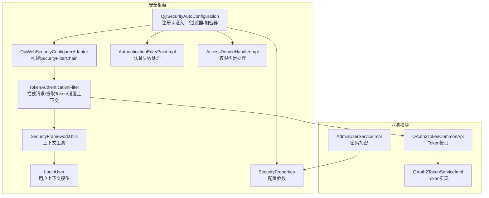
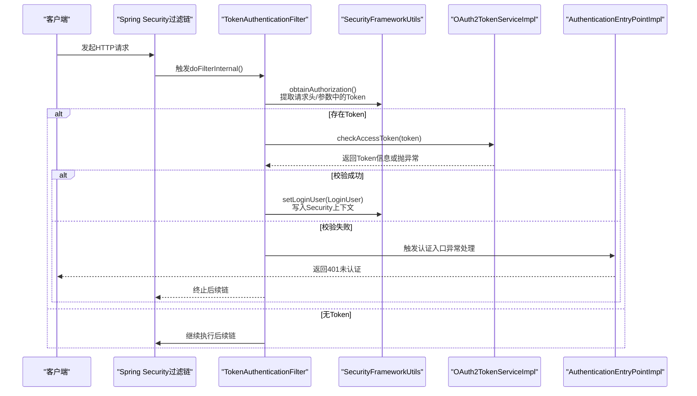
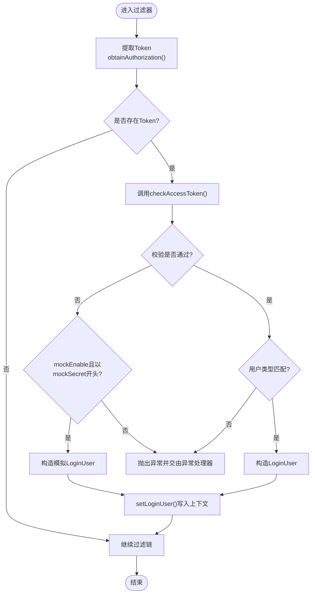
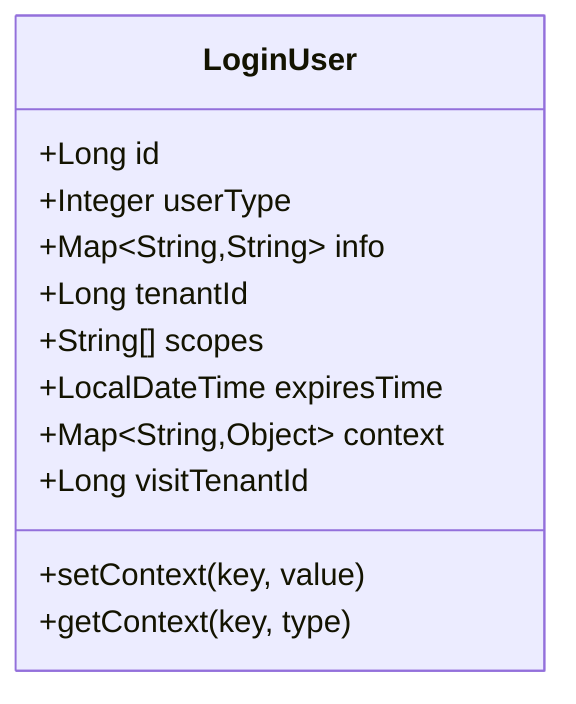
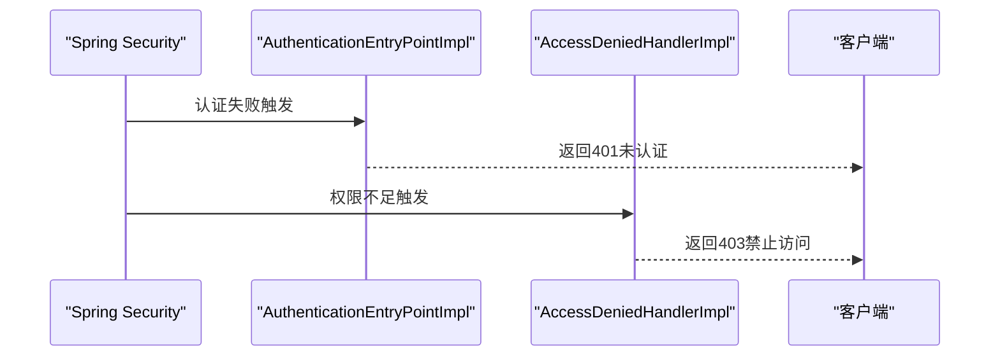
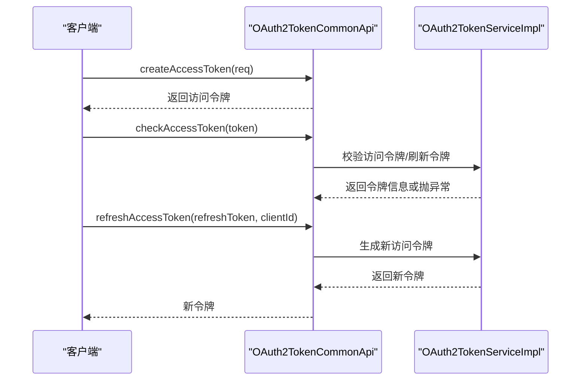
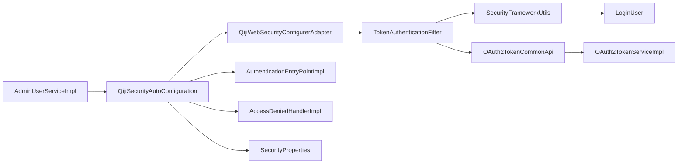

# 认证机制

<cite>
**本文引用的文件**
- [QijiSecurityAutoConfiguration.java](file://qiji-framework/qiji-spring-boot-starter-security/src/main/java/com.qiji.cps/framework/security/config/QijiSecurityAutoConfiguration.java)
- [QijiWebSecurityConfigurerAdapter.java](file://qiji-framework/qiji-spring-boot-starter-security/src/main/java/com.qiji.cps/framework/security/config/QijiWebSecurityConfigurerAdapter.java)
- [TokenAuthenticationFilter.java](file://qiji-framework/qiji-spring-boot-starter-security/src/main/java/com.qiji.cps/framework/security/core/filter/TokenAuthenticationFilter.java)
- [AuthenticationEntryPointImpl.java](file://qiji-framework/qiji-spring-boot-starter-security/src/main/java/com.qiji.cps/framework/security/core/handler/AuthenticationEntryPointImpl.java)
- [AccessDeniedHandlerImpl.java](file://qiji-framework/qiji-spring-boot-starter-security/src/main/java/com.qiji.cps/framework/security/core/handler/AccessDeniedHandlerImpl.java)
- [SecurityFrameworkUtils.java](file://qiji-framework/qiji-spring-boot-starter-security/src/main/java/com.qiji.cps/framework/security/core/util/SecurityFrameworkUtils.java)
- [LoginUser.java](file://qiji-framework/qiji-spring-boot-starter-security/src/main/java/com.qiji.cps/framework/security/core/LoginUser.java)
- [SecurityProperties.java](file://qiji-framework/qiji-spring-boot-starter-security/src/main/java/com.qiji.cps/framework/security/config/SecurityProperties.java)
- [OAuth2TokenCommonApi.java](file://qiji-framework/qiji-common/src/main/java/com.qiji.cps/framework/common/biz/system/oauth2/OAuth2TokenCommonApi.java)
- [OAuth2TokenServiceImpl.java](file://qiji-module-system/src/main/java/com.qiji.cps/module/system/service/oauth2/OAuth2TokenServiceImpl.java)
- [SecurityConfiguration.java](file://qiji-module-infra/src/main/java/com.qiji.cps/module/infra/framework/security/config/SecurityConfiguration.java)
- [AdminUserServiceImpl.java](file://qiji-module-system/src/main/java/com.qiji.cps/module/system/service/user/AdminUserServiceImpl.java)
</cite>

## 目录
1. [简介](#简介)
2. [项目结构](#项目结构)
3. [核心组件](#核心组件)
4. [架构总览](#架构总览)
5. [组件详解](#组件详解)
6. [依赖关系分析](#依赖关系分析)
7. [性能与安全特性](#性能与安全特性)
8. [故障排查指南](#故障排查指南)
9. [结论](#结论)
10. [附录：配置参数与最佳实践](#附录配置参数与最佳实践)

## 简介
本文件面向AgenticCPS系统的认证机制，围绕基于Spring Security的JWT Token认证展开，覆盖以下主题：
- Token的生成、验证与刷新流程
- TokenAuthenticationFilter的拦截与解析逻辑
- 认证失败与权限不足的处理策略
- LoginUser用户上下文的存储、传递与获取
- 密码加密机制（BCryptPasswordEncoder）
- 认证流程示例（登录、Token验证、异常处理）
- 配置参数说明与最佳实践

## 项目结构
认证相关能力由“安全框架”模块提供基础能力，并在各业务模块中按需扩展。关键位置如下：
- 安全自动装配与过滤器注册：QijiSecurityAutoConfiguration、QijiWebSecurityConfigurerAdapter
- Token过滤与上下文设置：TokenAuthenticationFilter、SecurityFrameworkUtils
- 认证入口与权限处理：AuthenticationEntryPointImpl、AccessDeniedHandlerImpl
- 用户上下文模型：LoginUser
- 配置项：SecurityProperties
- OAuth2 Token接口与实现：OAuth2TokenCommonApi、OAuth2TokenServiceImpl
- 密码加密：AdminUserServiceImpl中使用BCryptPasswordEncoder

图表来源
- [QijiSecurityAutoConfiguration.java:32-85](file://qiji-framework/qiji-spring-boot-starter-security/src/main/java/com.qiji.cps/framework/security/config/QijiSecurityAutoConfiguration.java#L32-L85)
- [QijiWebSecurityConfigurerAdapter.java:46-153](file://qiji-framework/qiji-spring-boot-starter-security/src/main/java/com.qiji.cps/framework/security/config/QijiWebSecurityConfigurerAdapter.java#L46-L153)
- [TokenAuthenticationFilter.java:31-120](file://qiji-framework/qiji-spring-boot-starter-security/src/main/java/com.qiji.cps/framework/security/core/filter/TokenAuthenticationFilter.java#L31-L120)
- [SecurityFrameworkUtils.java:24-161](file://qiji-framework/qiji-spring-boot-starter-security/src/main/java/com.qiji.cps/framework/security/core/util/SecurityFrameworkUtils.java#L24-L161)
- [LoginUser.java:18-76](file://qiji-framework/qiji-spring-boot-starter-security/src/main/java/com.qiji.cps/framework/security/core/LoginUser.java#L18-L76)
- [SecurityProperties.java:12-51](file://qiji-framework/qiji-spring-boot-starter-security/src/main/java/com.qiji.cps/framework/security/config/SecurityProperties.java#L12-L51)
- [OAuth2TokenCommonApi.java:14-49](file://qiji-framework/qiji-common/src/main/java/com.qiji.cps/framework/common/biz/system/oauth2/OAuth2TokenCommonApi.java#L14-L49)
- [OAuth2TokenServiceImpl.java:112-136](file://qiji-module-system/src/main/java/com.qiji.cps/module/system/service/oauth2/OAuth2TokenServiceImpl.java#L112-L136)
- [AdminUserServiceImpl.java:538-550](file://qiji-module-system/src/main/java/com.qiji.cps/module/system/service/user/AdminUserServiceImpl.java#L538-L550)

章节来源
- [QijiSecurityAutoConfiguration.java:32-85](file://qiji-framework/qiji-spring-boot-starter-security/src/main/java/com.qiji.cps/framework/security/config/QijiSecurityAutoConfiguration.java#L32-L85)
- [QijiWebSecurityConfigurerAdapter.java:46-153](file://qiji-framework/qiji-spring-boot-starter-security/src/main/java/com.qiji.cps/framework/security/config/QijiWebSecurityConfigurerAdapter.java#L46-L153)

## 核心组件
- 认证入口与异常处理
  - AuthenticationEntryPointImpl：当访问受保护资源但未认证时返回统一错误响应
  - AccessDeniedHandlerImpl：当已认证但权限不足时返回统一错误响应
- Token过滤与上下文
  - TokenAuthenticationFilter：拦截请求，提取并校验Token，构建LoginUser并写入Security上下文
  - SecurityFrameworkUtils：提供Token提取、上下文获取与设置、权限跳过判断等工具
  - LoginUser：承载当前登录用户信息（id、userType、info、tenantId、scopes、expiresTime等）
- 配置与加密
  - SecurityProperties：定义Token请求头、参数、免登录URL、mock开关与密码加密复杂度等
  - BCryptPasswordEncoder：在QijiSecurityAutoConfiguration中注册，用于密码加密
- OAuth2 Token接口与实现
  - OAuth2TokenCommonApi：定义创建、校验、移除、刷新访问令牌的接口
  - OAuth2TokenServiceImpl：实现Token的检查、刷新与持久化

章节来源
- [AuthenticationEntryPointImpl.java:26-35](file://qiji-framework/qiji-spring-boot-starter-security/src/main/java/com.qiji.cps/framework/security/core/handler/AuthenticationEntryPointImpl.java#L26-L35)
- [AccessDeniedHandlerImpl.java:29-41](file://qiji-framework/qiji-spring-boot-starter-security/src/main/java/com.qiji.cps/framework/security/core/handler/AccessDeniedHandlerImpl.java#L29-L41)
- [TokenAuthenticationFilter.java:31-120](file://qiji-framework/qiji-spring-boot-starter-security/src/main/java/com.qiji.cps/framework/security/core/filter/TokenAuthenticationFilter.java#L31-L120)
- [SecurityFrameworkUtils.java:24-161](file://qiji-framework/qiji-spring-boot-starter-security/src/main/java/com.qiji.cps/framework/security/core/util/SecurityFrameworkUtils.java#L24-L161)
- [LoginUser.java:18-76](file://qiji-framework/qiji-spring-boot-starter-security/src/main/java/com.qiji.cps/framework/security/core/LoginUser.java#L18-L76)
- [SecurityProperties.java:12-51](file://qiji-framework/qiji-spring-boot-starter-security/src/main/java/com.qiji.cps/framework/security/config/SecurityProperties.java#L12-L51)
- [OAuth2TokenCommonApi.java:14-49](file://qiji-framework/qiji-common/src/main/java/com.qiji.cps/framework/common/biz/system/oauth2/OAuth2TokenCommonApi.java#L14-L49)
- [OAuth2TokenServiceImpl.java:112-136](file://qiji-module-system/src/main/java/com.qiji.cps/module/system/service/oauth2/OAuth2TokenServiceImpl.java#L112-L136)
- [QijiSecurityAutoConfiguration.java:43-65](file://qiji-framework/qiji-spring-boot-starter-security/src/main/java/com.qiji.cps/framework/security/config/QijiSecurityAutoConfiguration.java#L43-L65)

## 架构总览
AgenticCPS采用“无状态Token + Spring Security过滤器链”的认证架构：
- 请求进入时，QijiWebSecurityConfigurerAdapter构建SecurityFilterChain，禁用CSRF与Session，开启跨域与异常处理
- TokenAuthenticationFilter在用户名密码过滤器之前执行，负责提取Token并校验
- OAuth2TokenServiceImpl根据Token查询访问令牌或从刷新令牌转换，校验有效期
- 成功后，SecurityFrameworkUtils将LoginUser写入Security上下文与请求上下文，供后续业务使用
- 认证失败与权限不足分别由AuthenticationEntryPointImpl与AccessDeniedHandlerImpl统一处理

图表来源
- [QijiWebSecurityConfigurerAdapter.java:110-153](file://qiji-framework/qiji-spring-boot-starter-security/src/main/java/com.qiji.cps/framework/security/config/QijiWebSecurityConfigurerAdapter.java#L110-L153)
- [TokenAuthenticationFilter.java:40-93](file://qiji-framework/qiji-spring-boot-starter-security/src/main/java/com.qiji.cps/framework/security/core/filter/TokenAuthenticationFilter.java#L40-L93)
- [SecurityFrameworkUtils.java:41-133](file://qiji-framework/qiji-spring-boot-starter-security/src/main/java/com.qiji.cps/framework/security/core/util/SecurityFrameworkUtils.java#L41-L133)
- [OAuth2TokenServiceImpl.java:131-136](file://qiji-module-system/src/main/java/com.qiji.cps/module/system/service/oauth2/OAuth2TokenServiceImpl.java#L131-L136)
- [AuthenticationEntryPointImpl.java:28-33](file://qiji-framework/qiji-spring-boot-starter-security/src/main/java/com.qiji.cps/framework/security/core/handler/AuthenticationEntryPointImpl.java#L28-L33)

## 组件详解

### TokenAuthenticationFilter工作原理
- 请求拦截：继承OncePerRequestFilter，确保每请求只执行一次
- Token提取：通过SecurityFrameworkUtils.obtainAuthorization从请求头或参数中提取Token，支持“Bearer ”前缀去除
- 用户身份解析：
  - 调用OAuth2TokenCommonApi.checkAccessToken校验Token
  - 若用户类型不匹配则拒绝访问
  - 构造LoginUser并调用SecurityFrameworkUtils.setLoginUser写入上下文
- 模拟登录：当mockEnable启用且token以mockSecret开头时，构造模拟用户便于开发调试
- 异常处理：捕获异常并通过GlobalExceptionHandler统一转为JSON响应

图表来源
- [TokenAuthenticationFilter.java:40-119](file://qiji-framework/qiji-spring-boot-starter-security/src/main/java/com.qiji.cps/framework/security/core/filter/TokenAuthenticationFilter.java#L40-L119)
- [SecurityFrameworkUtils.java:41-133](file://qiji-framework/qiji-spring-boot-starter-security/src/main/java/com.qiji.cps/framework/security/core/util/SecurityFrameworkUtils.java#L41-L133)

章节来源
- [TokenAuthenticationFilter.java:31-120](file://qiji-framework/qiji-spring-boot-starter-security/src/main/java/com.qiji.cps/framework/security/core/filter/TokenAuthenticationFilter.java#L31-L120)
- [SecurityFrameworkUtils.java:24-161](file://qiji-framework/qiji-spring-boot-starter-security/src/main/java/com.qiji.cps/framework/security/core/util/SecurityFrameworkUtils.java#L24-L161)

### LoginUser用户上下文
- 字段含义：id（用户编号）、userType（用户类型）、info（额外用户信息Map）、tenantId（租户编号）、scopes（授权范围）、expiresTime（过期时间）
- 上下文能力：context（临时缓存）、visitTenantId（访问租户）
- 获取方式：SecurityFrameworkUtils.getLoginUser()/getLoginUserId()/getLoginUserNickname()/getLoginUserDeptId()

图表来源
- [LoginUser.java:18-76](file://qiji-framework/qiji-spring-boot-starter-security/src/main/java/com.qiji.cps/framework/security/core/LoginUser.java#L18-L76)

章节来源
- [LoginUser.java:18-76](file://qiji-framework/qiji-spring-boot-starter-security/src/main/java/com.qiji.cps/framework/security/core/LoginUser.java#L18-L76)
- [SecurityFrameworkUtils.java:74-114](file://qiji-framework/qiji-spring-boot-starter-security/src/main/java/com.qiji.cps/framework/security/core/util/SecurityFrameworkUtils.java#L74-L114)

### 认证失败与权限不足处理
- AuthenticationEntryPointImpl：当访问受保护资源但未认证时，返回统一401错误
- AccessDeniedHandlerImpl：当已认证但权限不足时，返回统一403错误
- 两者均通过ServletUtils.writeJSON输出标准响应体

图表来源
- [AuthenticationEntryPointImpl.java:28-33](file://qiji-framework/qiji-spring-boot-starter-security/src/main/java/com.qiji.cps/framework/security/core/handler/AuthenticationEntryPointImpl.java#L28-L33)
- [AccessDeniedHandlerImpl.java:31-39](file://qiji-framework/qiji-spring-boot-starter-security/src/main/java/com.qiji.cps/framework/security/core/handler/AccessDeniedHandlerImpl.java#L31-L39)

章节来源
- [AuthenticationEntryPointImpl.java:26-35](file://qiji-framework/qiji-spring-boot-starter-security/src/main/java/com.qiji.cps/framework/security/core/handler/AuthenticationEntryPointImpl.java#L26-L35)
- [AccessDeniedHandlerImpl.java:29-41](file://qiji-framework/qiji-spring-boot-starter-security/src/main/java/com.qiji.cps/framework/security/core/handler/AccessDeniedHandlerImpl.java#L29-L41)

### 密码加密机制（BCryptPasswordEncoder）
- 在QijiSecurityAutoConfiguration中注册BCryptPasswordEncoder，并使用SecurityProperties.passwordEncoderLength控制加密复杂度
- AdminUserServiceImpl中使用matches/encode完成密码匹配与加密

章节来源
- [QijiSecurityAutoConfiguration.java:62-65](file://qiji-framework/qiji-spring-boot-starter-security/src/main/java/com.qiji.cps/framework/security/config/QijiSecurityAutoConfiguration.java#L62-L65)
- [AdminUserServiceImpl.java:538-550](file://qiji-module-system/src/main/java/com.qiji.cps/module/system/service/user/AdminUserServiceImpl.java#L538-L550)

### Token生成、验证与刷新
- 生成：OAuth2TokenCommonApi.createAccessToken创建访问令牌
- 验证：OAuth2TokenCommonApi.checkAccessToken校验访问令牌，OAuth2TokenServiceImpl补充对刷新令牌的兼容处理
- 刷新：OAuth2TokenCommonApi.refreshAccessToken通过刷新令牌换取新的访问令牌

图表来源
- [OAuth2TokenCommonApi.java:22-47](file://qiji-framework/qiji-common/src/main/java/com.qiji.cps/framework/common/biz/system/oauth2/OAuth2TokenCommonApi.java#L22-L47)
- [OAuth2TokenServiceImpl.java:112-136](file://qiji-module-system/src/main/java/com.qiji.cps/module/system/service/oauth2/OAuth2TokenServiceImpl.java#L112-L136)

章节来源
- [OAuth2TokenCommonApi.java:14-49](file://qiji-framework/qiji-common/src/main/java/com.qiji.cps/framework/common/biz/system/oauth2/OAuth2TokenCommonApi.java#L14-L49)
- [OAuth2TokenServiceImpl.java:112-136](file://qiji-module-system/src/main/java/com.qiji.cps/module/system/service/oauth2/OAuth2TokenServiceImpl.java#L112-L136)

### 认证流程示例（登录、Token验证、异常处理）
- 登录接口：调用OAuth2TokenCommonApi.createAccessToken获取访问令牌
- Token验证接口：在请求头中携带Authorization: Bearer <token>，由TokenAuthenticationFilter拦截并校验
- 认证异常处理：未登录返回401，权限不足返回403

章节来源
- [OAuth2TokenCommonApi.java:22-30](file://qiji-framework/qiji-common/src/main/java/com.qiji.cps/framework/common/biz/system/oauth2/OAuth2TokenCommonApi.java#L22-L30)
- [TokenAuthenticationFilter.java:40-69](file://qiji-framework/qiji-spring-boot-starter-security/src/main/java/com.qiji.cps/framework/security/core/filter/TokenAuthenticationFilter.java#L40-L69)
- [AuthenticationEntryPointImpl.java:28-33](file://qiji-framework/qiji-spring-boot-starter-security/src/main/java/com.qiji.cps/framework/security/core/handler/AuthenticationEntryPointImpl.java#L28-33)
- [AccessDeniedHandlerImpl.java:31-39](file://qiji-framework/qiji-spring-boot-starter-security/src/main/java/com.qiji.cps/framework/security/core/handler/AccessDeniedHandlerImpl.java#L31-39)

## 依赖关系分析
- 自动装配层：QijiSecurityAutoConfiguration注册AuthenticationEntryPoint、AccessDeniedHandler、PasswordEncoder、TokenAuthenticationFilter与SecurityFrameworkService
- 安全配置层：QijiWebSecurityConfigurerAdapter构建SecurityFilterChain，禁用CSRF与Session，配置免登录URL与异常处理，插入TokenAuthenticationFilter
- 过滤器层：TokenAuthenticationFilter依赖SecurityProperties、GlobalExceptionHandler、OAuth2TokenCommonApi
- 工具层：SecurityFrameworkUtils提供上下文操作与Token提取
- 业务层：OAuth2TokenServiceImpl实现Token检查与刷新；AdminUserServiceImpl使用BCryptPasswordEncoder

图表来源
- [QijiSecurityAutoConfiguration.java:43-79](file://qiji-framework/qiji-spring-boot-starter-security/src/main/java/com.qiji.cps/framework/security/config/QijiSecurityAutoConfiguration.java#L43-79)
- [QijiWebSecurityConfigurerAdapter.java:110-153](file://qiji-framework/qiji-spring-boot-starter-security/src/main/java/com.qiji.cps/framework/security/config/QijiWebSecurityConfigurerAdapter.java#L110-L153)
- [TokenAuthenticationFilter.java:34-38](file://qiji-framework/qiji-spring-boot-starter-security/src/main/java/com.qiji.cps/framework/security/core/filter/TokenAuthenticationFilter.java#L34-L38)
- [SecurityFrameworkUtils.java:122-133](file://qiji-framework/qiji-spring-boot-starter-security/src/main/java/com.qiji.cps/framework/security/core/util/SecurityFrameworkUtils.java#L122-L133)
- [OAuth2TokenCommonApi.java:14-49](file://qiji-framework/qiji-common/src/main/java/com.qiji.cps/framework/common/biz/system/oauth2/OAuth2TokenCommonApi.java#L14-L49)
- [OAuth2TokenServiceImpl.java:112-136](file://qiji-module-system/src/main/java/com.qiji.cps/module/system/service/oauth2/OAuth2TokenServiceImpl.java#L112-L136)
- [AuthenticationEntryPointImpl.java:26-35](file://qiji-framework/qiji-spring-boot-starter-security/src/main/java/com.qiji.cps/framework/security/core/handler/AuthenticationEntryPointImpl.java#L26-L35)
- [AccessDeniedHandlerImpl.java:29-41](file://qiji-framework/qiji-spring-boot-starter-security/src/main/java/com.qiji.cps/framework/security/core/handler/AccessDeniedHandlerImpl.java#L29-L41)
- [SecurityProperties.java:12-51](file://qiji-framework/qiji-spring-boot-starter-security/src/main/java/com.qiji.cps/framework/security/config/SecurityProperties.java#L12-L51)
- [LoginUser.java:18-76](file://qiji-framework/qiji-spring-boot-starter-security/src/main/java/com.qiji.cps/framework/security/core/LoginUser.java#L18-L76)
- [AdminUserServiceImpl.java:538-550](file://qiji-module-system/src/main/java/com.qiji.cps/module/system/service/user/AdminUserServiceImpl.java#L538-L550)

章节来源
- [QijiSecurityAutoConfiguration.java:32-85](file://qiji-framework/qiji-spring-boot-starter-security/src/main/java/com.qiji.cps/framework/security/config/QijiSecurityAutoConfiguration.java#L32-L85)
- [QijiWebSecurityConfigurerAdapter.java:46-153](file://qiji-framework/qiji-spring-boot-starter-security/src/main/java/com.qiji.cps/framework/security/config/QijiWebSecurityConfigurerAdapter.java#L46-L153)

## 性能与安全特性
- 无状态：禁用Session，基于Token实现无状态认证
- 跨域与CORS：开启跨域支持，便于前后端分离部署
- 异常统一：认证失败与权限不足统一返回JSON，便于前端处理
- Token兼容：checkAccessToken同时兼容访问令牌与刷新令牌场景
- 开发友好：mock模式支持模拟登录，便于本地调试

章节来源
- [QijiWebSecurityConfigurerAdapter.java:112-119](file://qiji-framework/qiji-spring-boot-starter-security/src/main/java/com.qiji.cps/framework/security/config/QijiWebSecurityConfigurerAdapter.java#L112-L119)
- [TokenAuthenticationFilter.java:105-117](file://qiji-framework/qiji-spring-boot-starter-security/src/main/java/com.qiji.cps/framework/security/core/filter/TokenAuthenticationFilter.java#L105-L117)
- [OAuth2TokenServiceImpl.java:112-127](file://qiji-module-system/src/main/java/com.qiji.cps/module/system/service/oauth2/OAuth2TokenServiceImpl.java#L112-L127)

## 故障排查指南
- 401未认证
  - 检查请求头Authorization或参数token是否正确传递
  - 确认Token未过期，且用户类型与请求匹配
  - 查看AuthenticationEntryPointImpl的日志输出
- 403禁止访问
  - 检查用户权限与scopes是否满足接口要求
  - 查看AccessDeniedHandlerImpl的日志输出
- Token校验失败
  - 确认OAuth2TokenServiceImpl.checkAccessToken返回正常
  - 若使用刷新令牌，确认刷新令牌有效且未过期
- 密码加密问题
  - 确认BCryptPasswordEncoder复杂度配置合理
  - 使用matches/encode进行密码匹配与加密

章节来源
- [AuthenticationEntryPointImpl.java:28-33](file://qiji-framework/qiji-spring-boot-starter-security/src/main/java/com.qiji.cps/framework/security/core/handler/AuthenticationEntryPointImpl.java#L28-L33)
- [AccessDeniedHandlerImpl.java:31-39](file://qiji-framework/qiji-spring-boot-starter-security/src/main/java/com.qiji.cps/framework/security/core/handler/AccessDeniedHandlerImpl.java#L31-L39)
- [OAuth2TokenServiceImpl.java:131-136](file://qiji-module-system/src/main/java/com.qiji.cps/module/system/service/oauth2/OAuth2TokenServiceImpl.java#L131-L136)
- [AdminUserServiceImpl.java:538-550](file://qiji-module-system/src/main/java/com.qiji.cps/module/system/service/user/AdminUserServiceImpl.java#L538-L550)

## 结论
AgenticCPS的认证机制以Spring Security为基础，结合OAuth2 Token实现无状态认证。通过TokenAuthenticationFilter在过滤器链中拦截与校验Token，配合统一异常处理与LoginUser上下文，形成清晰、可扩展的认证体系。密码加密采用BCryptPasswordEncoder，配置灵活，满足不同性能需求。

## 附录：配置参数与最佳实践
- 配置参数（SecurityProperties）
  - qiji.security.token-header：HTTP请求头中Token的键名，默认“Authorization”
  - qiji.security.token-parameter：HTTP请求参数中Token的键名，默认“token”
  - qiji.security.permit-all-urls：免登录URL列表
  - qiji.security.mock-enable：mock模式开关
  - qiji.security.mock-secret：mock密钥
  - qiji.security.password-encoder-length：BCrypt加密复杂度
- 最佳实践
  - 生产环境务必关闭mock模式
  - 合理设置Token有效期与刷新策略
  - 对敏感接口启用权限校验与数据权限控制
  - 使用统一异常处理，保持前端一致的错误提示

章节来源
- [SecurityProperties.java:12-51](file://qiji-framework/qiji-spring-boot-starter-security/src/main/java/com.qiji.cps/framework/security/config/SecurityProperties.java#L12-L51)
- [QijiSecurityAutoConfiguration.java:62-65](file://qiji-framework/qiji-spring-boot-starter-security/src/main/java/com.qiji.cps/framework/security/config/QijiSecurityAutoConfiguration.java#L62-L65)