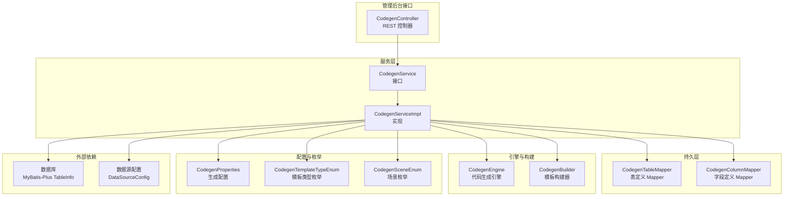
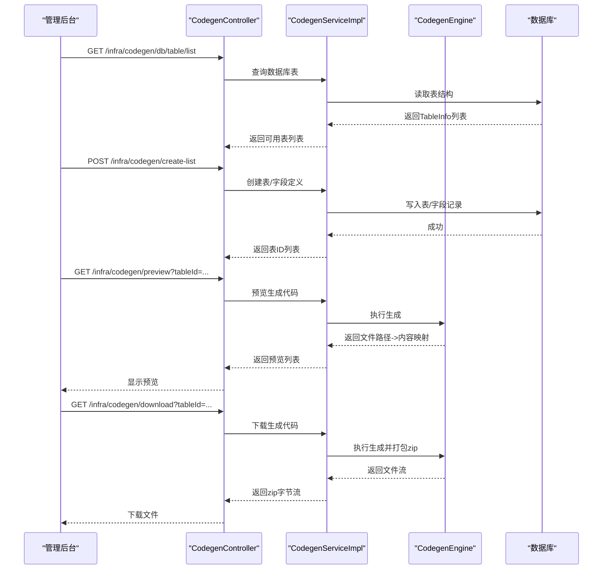
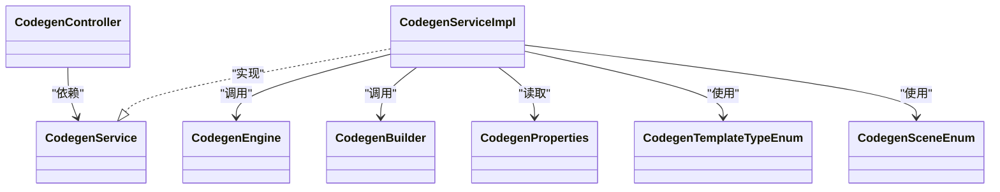

# 代码生成器使用

<cite>
**本文引用的文件**
- [CodegenController.java](file://qiji-module-infra/src/main/java/com.qiji.cps/module/infra/controller/admin/codegen/CodegenController.java)
- [CodegenService.java](file://qiji-module-infra/src/main/java/com.qiji.cps/module/infra/service/codegen/CodegenService.java)
- [CodegenServiceImpl.java](file://qiji-module-infra/src/main/java/com.qiji.cps/module/infra/service/codegen/CodegenServiceImpl.java)
- [CodegenProperties.java](file://qiji-module-infra/src/main/java/com.qiji.cps/module/infra/framework/codegen/config/CodegenProperties.java)
- [application.yaml](file://qiji-server/src/main/resources/application.yaml)
- [CodegenTemplateTypeEnum.java](file://qiji-module-infra/src/main/java/com.qiji.cps/module/infra/enums/codegen/CodegenTemplateTypeEnum.java)
- [CodegenSceneEnum.java](file://qiji-module-infra/src/main/java/com.qiji.cps/module/infra/enums/codegen/CodegenSceneEnum.java)
- [CodegenEngine.java](file://qiji-module-infra/src/main/java/com.qiji.cps/module/infra/service/codegen/inner/CodegenEngine.java)
- [CodegenBuilder.java](file://qiji-module-infra/src/main/java/com.qiji.cps/module/infra/service/codegen/inner/CodegenBuilder.java)
</cite>

## 目录
1. [简介](#简介)
2. [项目结构](#项目结构)
3. [核心组件](#核心组件)
4. [架构总览](#架构总览)
5. [详细组件分析](#详细组件分析)
6. [依赖分析](#依赖分析)
7. [性能考虑](#性能考虑)
8. [故障排查指南](#故障排查指南)
9. [结论](#结论)
10. [附录](#附录)

## 简介
本指南面向AgenticCPS系统中的“代码生成器”，帮助你理解其功能与作用、如何配置与使用、以及生成代码的结构与特性。代码生成器支持基于数据库表结构，自动生成后端Java实体类、Mapper接口、Service实现、Controller控制器，以及前端Vue页面与SQL脚本等代码产物。同时，支持主子表、树形表等复杂模板类型，并提供预览与打包下载能力。

## 项目结构
代码生成器位于基础模块infra中，采用“Controller-Service-DAL-Engine/Builder”的分层设计，配合配置中心与枚举类型完成模板选择与场景切换。

图表来源
- [CodegenController.java:40-161](file://qiji-module-infra/src/main/java/com.qiji.cps/module/infra/controller/admin/codegen/CodegenController.java#L40-L161)
- [CodegenService.java:14-109](file://qiji-module-infra/src/main/java/com.qiji.cps/module/infra/service/codegen/CodegenService.java#L14-L109)
- [CodegenServiceImpl.java:47-311](file://qiji-module-infra/src/main/java/com.qiji.cps/module/infra/service/codegen/CodegenServiceImpl.java#L47-L311)
- [CodegenEngine.java](file://qiji-module-infra/src/main/java/com.qiji.cps/module/infra/service/codegen/inner/CodegenEngine.java)
- [CodegenBuilder.java](file://qiji-module-infra/src/main/java/com.qiji.cps/module/infra/service/codegen/inner/CodegenBuilder.java)
- [CodegenProperties.java:13-59](file://qiji-module-infra/src/main/java/com.qiji.cps/module/infra/framework/codegen/config/CodegenProperties.java#L13-L59)
- [CodegenTemplateTypeEnum.java:9-54](file://qiji-module-infra/src/main/java/com.qiji.cps/module/infra/enums/codegen/CodegenTemplateTypeEnum.java#L9-L54)
- [CodegenSceneEnum.java:8-41](file://qiji-module-infra/src/main/java/com.qiji.cps/module/infra/enums/codegen/CodegenSceneEnum.java#L8-L41)

章节来源
- [CodegenController.java:40-161](file://qiji-module-infra/src/main/java/com.qiji.cps/module/infra/controller/admin/codegen/CodegenController.java#L40-L161)
- [CodegenService.java:14-109](file://qiji-module-infra/src/main/java/com.qiji.cps/module/infra/service/codegen/CodegenService.java#L14-L109)
- [CodegenServiceImpl.java:47-311](file://qiji-module-infra/src/main/java/com.qiji.cps/module/infra/service/codegen/CodegenServiceImpl.java#L47-L311)

## 核心组件
- 控制器层：提供数据库表查询、表与字段定义的增删改查、同步、预览与打包下载等HTTP接口。
- 服务层：负责业务编排，包括表与字段的导入、同步、删除、生成代码等。
- 引擎与构建器：根据模板类型与场景，将表/字段信息渲染为具体代码文件。
- 配置与枚举：定义生成基础包、前端类型、VO类型、是否批量删除、是否生成单元测试等全局配置；模板类型与场景枚举用于控制生成策略。

章节来源
- [CodegenController.java:40-161](file://qiji-module-infra/src/main/java/com.qiji.cps/module/infra/controller/admin/codegen/CodegenController.java#L40-L161)
- [CodegenService.java:14-109](file://qiji-module-infra/src/main/java/com.qiji.cps/module/infra/service/codegen/CodegenService.java#L14-L109)
- [CodegenServiceImpl.java:47-311](file://qiji-module-infra/src/main/java/com.qiji.cps/module/infra/service/codegen/CodegenServiceImpl.java#L47-L311)
- [CodegenProperties.java:13-59](file://qiji-module-infra/src/main/java/com.qiji.cps/module/infra/framework/codegen/config/CodegenProperties.java#L13-L59)
- [CodegenTemplateTypeEnum.java:9-54](file://qiji-module-infra/src/main/java/com.qiji.cps/module/infra/enums/codegen/CodegenTemplateTypeEnum.java#L9-L54)
- [CodegenSceneEnum.java:8-41](file://qiji-module-infra/src/main/java/com.qiji.cps/module/infra/enums/codegen/CodegenSceneEnum.java#L8-L41)

## 架构总览
代码生成器的调用链路如下：

图表来源
- [CodegenController.java:49-158](file://qiji-module-infra/src/main/java/com.qiji.cps/module/infra/controller/admin/codegen/CodegenController.java#L49-L158)
- [CodegenServiceImpl.java:260-298](file://qiji-module-infra/src/main/java/com.qiji.cps/module/infra/service/codegen/CodegenServiceImpl.java#L260-L298)
- [CodegenEngine.java](file://qiji-module-infra/src/main/java/com.qiji.cps/module/infra/service/codegen/inner/CodegenEngine.java)

## 详细组件分析

### 控制器层：CodegenController
- 功能要点
  - 获取数据库表列表（过滤已导入）
  - 获取/分页查询表定义
  - 获取表与字段明细
  - 创建表/字段定义（支持批量）
  - 更新表/字段定义
  - 从数据库同步表/字段定义
  - 删除表/字段定义（单个/批量）
  - 预览生成代码（返回文件路径与内容列表）
  - 下载生成代码（打包为zip）

- 权限注解
  - 使用@PreAuthorize针对不同操作绑定权限，如“infra:codegen:query”、“infra:codegen:create”等。

章节来源
- [CodegenController.java:49-158](file://qiji-module-infra/src/main/java/com.qiji.cps/module/infra/controller/admin/codegen/CodegenController.java#L49-L158)

### 服务层：CodegenService 与 CodegenServiceImpl
- 核心职责
  - 表/字段导入：基于数据库表结构创建代码生成的表定义与字段定义。
  - 同步：仅同步新增字段，保留已有字段定义，支持主子表场景校验。
  - 删除：支持单表与批量删除。
  - 生成：根据模板类型与场景，调用引擎生成代码，返回文件路径到内容的映射。
  - 查询：提供分页、列表、详情等查询能力。

- 事务与校验
  - 导入/更新/同步/删除均使用@Transactional保护。
  - 导入时校验表注释、字段注释、主键缺失时自动补主键。

- 主子表与树表
  - 通过模板类型枚举区分单表、树表、主子表（普通/ERP/内嵌）与子表。
  - 生成主子表时需确保子表关联字段存在。

章节来源
- [CodegenService.java:14-109](file://qiji-module-infra/src/main/java/com.qiji.cps/module/infra/service/codegen/CodegenService.java#L14-L109)
- [CodegenServiceImpl.java:68-311](file://qiji-module-infra/src/main/java/com.qiji.cps/module/infra/service/codegen/CodegenServiceImpl.java#L68-L311)
- [CodegenTemplateTypeEnum.java:9-54](file://qiji-module-infra/src/main/java/com.qiji.cps/module/infra/enums/codegen/CodegenTemplateTypeEnum.java#L9-L54)

### 引擎与构建器：CodegenEngine 与 CodegenBuilder
- CodegenEngine
  - 根据数据库类型（DbType）与模板类型，驱动模板渲染，产出文件路径与内容映射。
- CodegenBuilder
  - 将数据库表/字段信息转换为代码生成所需的对象模型（表定义、字段定义），并填充默认值（如场景、前端类型、作者等）。

章节来源
- [CodegenEngine.java](file://qiji-module-infra/src/main/java/com.qiji.cps/module/infra/service/codegen/inner/CodegenEngine.java)
- [CodegenBuilder.java](file://qiji-module-infra/src/main/java/com.qiji.cps/module/infra/service/codegen/inner/CodegenBuilder.java)

### 配置与枚举
- CodegenProperties
  - 生成基础包、数据库schema集合、前端类型、VO类型、是否批量删除、是否生成单元测试等。
- CodegenTemplateTypeEnum
  - 模板类型：单表、树表、主子表（普通/ERP/内嵌）、子表。
- CodegenSceneEnum
  - 场景：管理后台、APP，影响包名与类前缀等。

章节来源
- [CodegenProperties.java:13-59](file://qiji-module-infra/src/main/java/com.qiji.cps/module/infra/framework/codegen/config/CodegenProperties.java#L13-L59)
- [CodegenTemplateTypeEnum.java:9-54](file://qiji-module-infra/src/main/java/com.qiji.cps/module/infra/enums/codegen/CodegenTemplateTypeEnum.java#L9-L54)
- [CodegenSceneEnum.java:8-41](file://qiji-module-infra/src/main/java/com.qiji.cps/module/infra/enums/codegen/CodegenSceneEnum.java#L8-L41)

## 依赖分析
- 组件耦合
  - 控制器依赖服务接口；服务实现依赖Mapper、引擎、构建器、配置与枚举。
  - 引擎与构建器对外透明，便于扩展新模板。
- 外部依赖
  - 数据库：通过MyBatis-Plus的TableInfo读取表结构。
  - 数据源：通过数据源配置解析数据库类型，用于引擎渲染。

图表来源
- [CodegenController.java:46-47](file://qiji-module-infra/src/main/java/com.qiji.cps/module/infra/controller/admin/codegen/CodegenController.java#L46-L47)
- [CodegenService.java:19-109](file://qiji-module-infra/src/main/java/com.qiji.cps/module/infra/service/codegen/CodegenService.java#L19-L109)
- [CodegenServiceImpl.java:50-66](file://qiji-module-infra/src/main/java/com.qiji.cps/module/infra/service/codegen/CodegenServiceImpl.java#L50-L66)
- [CodegenEngine.java](file://qiji-module-infra/src/main/java/com.qiji.cps/module/infra/service/codegen/inner/CodegenEngine.java)
- [CodegenBuilder.java](file://qiji-module-infra/src/main/java/com.qiji.cps/module/infra/service/codegen/inner/CodegenBuilder.java)
- [CodegenProperties.java:13-59](file://qiji-module-infra/src/main/java/com.qiji.cps/module/infra/framework/codegen/config/CodegenProperties.java#L13-L59)
- [CodegenTemplateTypeEnum.java:9-54](file://qiji-module-infra/src/main/java/com.qiji.cps/module/infra/enums/codegen/CodegenTemplateTypeEnum.java#L9-L54)
- [CodegenSceneEnum.java:8-41](file://qiji-module-infra/src/main/java/com.qiji.cps/module/infra/enums/codegen/CodegenSceneEnum.java#L8-L41)

## 性能考虑
- 批量导入：逐条导入而非一次性批量，避免超大表导入时的内存压力。
- 同步策略：仅同步新增字段，减少重复写入与冲突。
- 生成预览：先生成映射再打包zip，避免多次IO。
- 模板渲染：建议保持模板简洁，避免复杂Velocity表达式导致渲染耗时。

## 故障排查指南
- 生成失败
  - 现象：generationCodes返回空或抛出异常。
  - 排查：确认表定义存在且字段定义非空；检查主子表关联字段是否存在。
  - 参考
    - [CodegenServiceImpl.java:260-298](file://qiji-module-infra/src/main/java/com.qiji.cps/module/infra/service/codegen/CodegenServiceImpl.java#L260-L298)
- 模板错误
  - 现象：预览或下载时报错。
  - 排查：确认模板类型与场景配置正确；检查引擎与构建器是否支持该模板类型。
  - 参考
    - [CodegenTemplateTypeEnum.java:9-54](file://qiji-module-infra/src/main/java/com.qiji.cps/module/infra/enums/codegen/CodegenTemplateTypeEnum.java#L9-L54)
    - [CodegenEngine.java](file://qiji-module-infra/src/main/java/com.qiji.cps/module/infra/service/codegen/inner/CodegenEngine.java)
- 代码冲突
  - 现象：同步时提示无变更或字段顺序不一致。
  - 排查：确认数据库字段注释、主键、可空性、JDBC类型等未发生破坏性变更；必要时先删除再重建。
  - 参考
    - [CodegenServiceImpl.java:169-215](file://qiji-module-infra/src/main/java/com.qiji.cps/module/infra/service/codegen/CodegenServiceImpl.java#L169-L215)

章节来源
- [CodegenServiceImpl.java:169-215](file://qiji-module-infra/src/main/java/com.qiji.cps/module/infra/service/codegen/CodegenServiceImpl.java#L169-L215)
- [CodegenTemplateTypeEnum.java:9-54](file://qiji-module-infra/src/main/java/com.qiji.cps/module/infra/enums/codegen/CodegenTemplateTypeEnum.java#L9-L54)
- [CodegenEngine.java](file://qiji-module-infra/src/main/java/com.qiji.cps/module/infra/service/codegen/inner/CodegenEngine.java)

## 结论
AgenticCPS的代码生成器提供了从数据库表到前后端代码的一体化自动化能力，具备灵活的模板类型与场景配置、完善的导入/同步/删除流程，以及便捷的预览与下载体验。通过合理配置与遵循最佳实践，可显著提升开发效率并降低重复劳动。

## 附录

### 使用步骤（管理后台）
- 步骤1：选择数据源配置
  - 在“数据库表列表”接口中传入数据源配置编号，筛选可用表。
  - 参考
    - [CodegenController.java:49-62](file://qiji-module-infra/src/main/java/com.qiji.cps/module/infra/controller/admin/codegen/CodegenController.java#L49-L62)
- 步骤2：选择数据表并创建
  - 调用“批量创建表/字段定义”接口，传入数据源配置编号与表名列表。
  - 参考
    - [CodegenController.java:92-97](file://qiji-module-infra/src/main/java/com.qiji.cps/module/infra/controller/admin/codegen/CodegenController.java#L92-L97)
- 步骤3：配置生成选项
  - 在表/字段详情中勾选生成选项（如是否批量删除、是否生成单元测试等），并保存。
  - 参考
    - [CodegenController.java:99-105](file://qiji-module-infra/src/main/java/com.qiji.cps/module/infra/controller/admin/codegen/CodegenController.java#L99-L105)
- 步骤4：执行生成
  - 预览：调用“预览生成代码”接口，查看文件路径与内容列表。
  - 下载：调用“下载生成代码”接口，获取zip压缩包。
  - 参考
    - [CodegenController.java:134-158](file://qiji-module-infra/src/main/java/com.qiji.cps/module/infra/controller/admin/codegen/CodegenController.java#L134-L158)

### 生成代码结构与特点
- Entity类
  - 字段映射：基于数据库字段注释与类型，生成对应实体属性与注解。
- Mapper接口
  - CRUD方法：按模板类型生成标准增删改查方法；树表/主子表模板包含层级与关联查询。
- Service实现
  - 业务逻辑：封装分页、导出、批量操作等通用逻辑；主子表场景包含联动处理。
- Controller控制器
  - API接口：提供列表、详情、新增、修改、删除、导出等REST接口；可选批量删除。
- Vue前端页面
  - 页面与表单：根据字段生成列表、查询、新增/编辑弹窗等页面代码。
- SQL脚本
  - 初始化脚本：生成建表、索引、注释等SQL脚本。

章节来源
- [CodegenTemplateTypeEnum.java:9-54](file://qiji-module-infra/src/main/java/com.qiji.cps/module/infra/enums/codegen/CodegenTemplateTypeEnum.java#L9-L54)
- [CodegenSceneEnum.java:8-41](file://qiji-module-infra/src/main/java/com.qiji.cps/module/infra/enums/codegen/CodegenSceneEnum.java#L8-L41)

### 配置方法
- 数据库连接配置
  - 在应用配置中维护数据源信息，代码生成器通过数据源配置解析数据库类型。
  - 参考
    - [application.yaml:303-309](file://qiji-server/src/main/resources/application.yaml#L303-L309)
- 生成模板选择
  - 通过模板类型枚举选择单表、树表、主子表等模板。
  - 参考
    - [CodegenTemplateTypeEnum.java:9-54](file://qiji-module-infra/src/main/java/com.qiji.cps/module/infra/enums/codegen/CodegenTemplateTypeEnum.java#L9-L54)
- 输出路径设置
  - 生成代码以文件路径->内容映射形式返回，下载时统一打包为zip。
  - 参考
    - [CodegenController.java:143-158](file://qiji-module-infra/src/main/java/com.qiji.cps/module/infra/controller/admin/codegen/CodegenController.java#L143-L158)

### 自定义生成模板
- 修改模板
  - 通过扩展引擎与构建器，增加新的模板类型与渲染规则。
  - 参考
    - [CodegenEngine.java](file://qiji-module-infra/src/main/java/com.qiji.cps/module/infra/service/codegen/inner/CodegenEngine.java)
    - [CodegenBuilder.java](file://qiji-module-infra/src/main/java/com.qiji.cps/module/infra/service/codegen/inner/CodegenBuilder.java)
- 添加自定义字段
  - 在表/字段定义中新增字段，同步至数据库后再次生成。
  - 参考
    - [CodegenServiceImpl.java:169-215](file://qiji-module-infra/src/main/java/com.qiji.cps/module/infra/service/codegen/CodegenServiceImpl.java#L169-L215)
- 调整代码格式
  - 通过配置项控制是否生成批量删除接口与单元测试，间接影响生成代码风格。
  - 参考
    - [CodegenProperties.java:46-56](file://qiji-module-infra/src/main/java/com.qiji.cps/module/infra/framework/codegen/config/CodegenProperties.java#L46-L56)