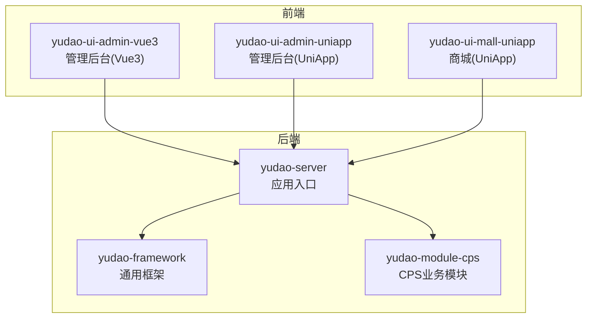
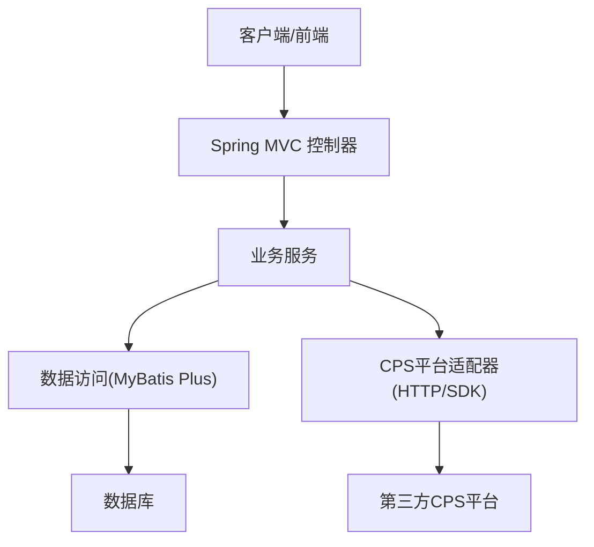
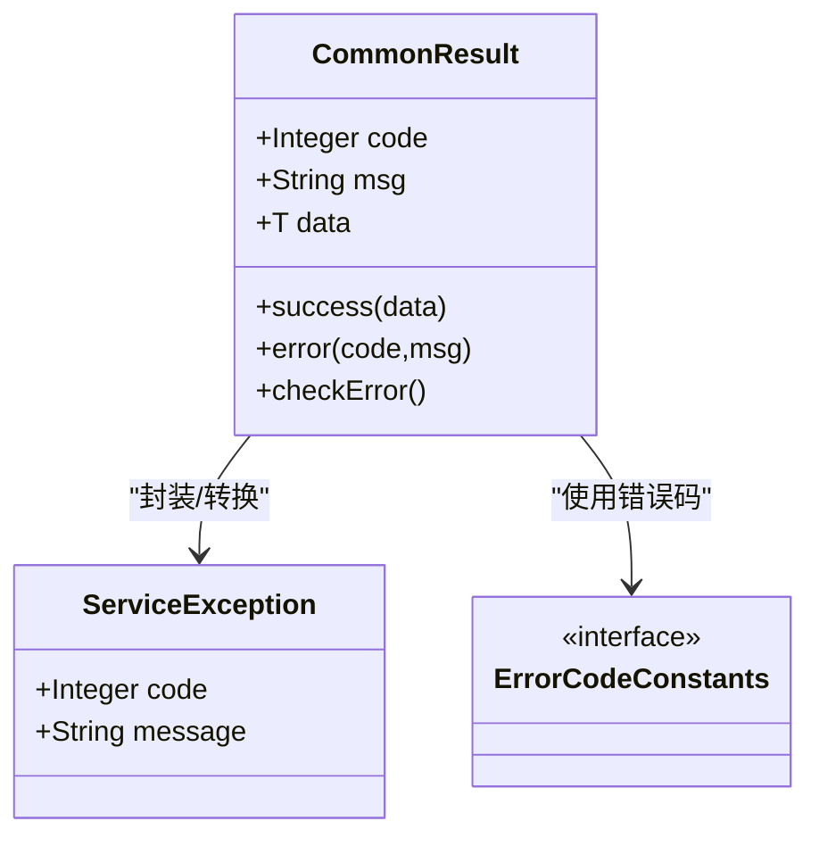
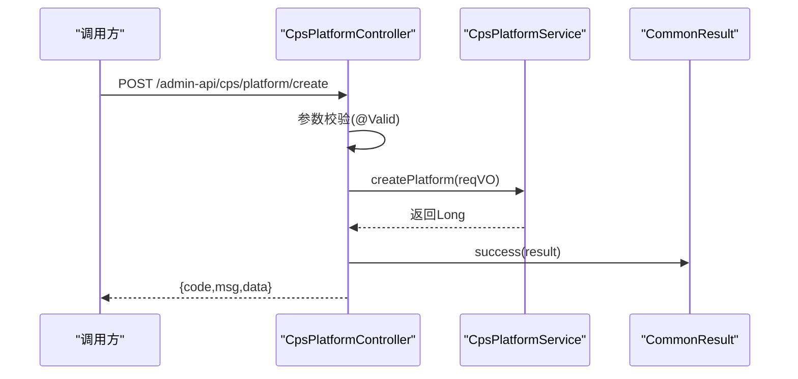
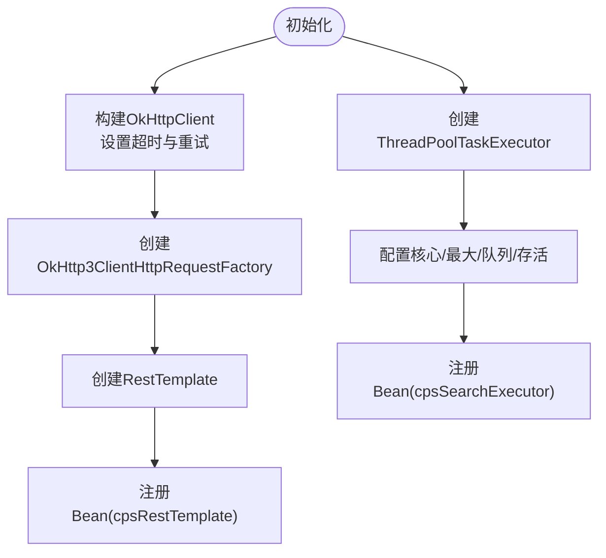
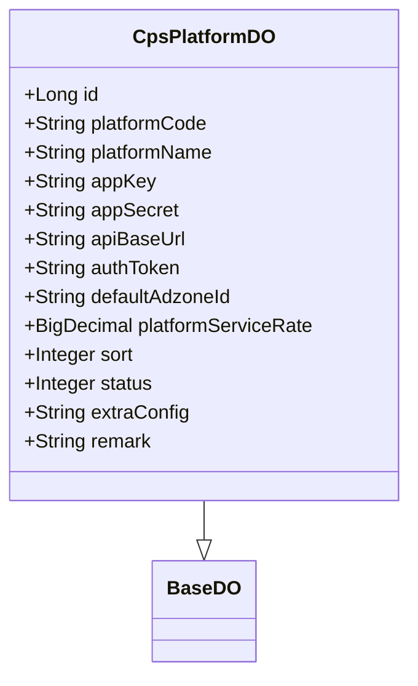
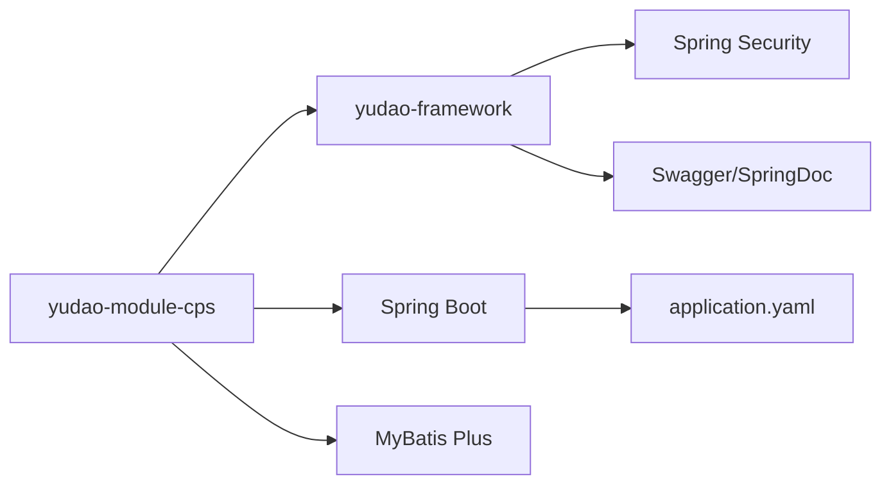

# 代码规范与最佳实践

<cite>
**本文引用的文件**
- [README.md](file://README.md)
- [lombok.config](file://lombok.config)
- [CommonResult.java](file://yudao-framework/yudao-common/src/main/java/cn/iocoder/yudao/framework/common/pojo/CommonResult.java)
- [ServiceException.java](file://yudao-framework/yudao-common/src/main/java/cn/iocoder/yudao/framework/common/exception/ServiceException.java)
- [ErrorCodeConstants.java](file://yudao-module-cps/yudao-module-cps-biz/src/main/java/cn/zhijian/cps/enums/ErrorCodeConstants.java)
- [CpsPlatformController.java](file://yudao-module-cps/yudao-module-cps-biz/src/main/java/cn/zhijian/cps/controller/admin/CpsPlatformController.java)
- [CpsAutoConfiguration.java](file://yudao-module-cps/yudao-module-cps-biz/src/main/java/cn/zhijian/cps/config/CpsAutoConfiguration.java)
- [CpsPlatformDO.java](file://yudao-module-cps/yudao-module-cps-biz/src/main/java/cn/zhijian/cps/dal/dataobject/CpsPlatformDO.java)
- [application.yaml](file://yudao-server/src/main/resources/application.yaml)
</cite>

## 目录
1. [引言](#引言)
2. [项目结构](#项目结构)
3. [核心组件](#核心组件)
4. [架构总览](#架构总览)
5. [详细组件分析](#详细组件分析)
6. [依赖分析](#依赖分析)
7. [性能考虑](#性能考虑)
8. [故障排查指南](#故障排查指南)
9. [结论](#结论)
10. [附录](#附录)

## 引言
本指南面向 AgenticCPS 系统的开发团队，提供统一的 Java 编码规范、Spring Boot 最佳实践、数据库设计规范、前端开发规范、代码审查清单与质量检查标准，并重点说明 Lombok 的使用规范与注意事项。AgenticCPS 基于 ruoyi-vue-pro 框架，采用多模块架构与 Spring Boot 3.x + MyBatis Plus 技术栈，强调一致性、可维护性与可扩展性。

## 项目结构
AgenticCPS 采用多模块分层结构，核心模块包括：
- yudao-framework：通用框架与基础设施（公共返回体、异常体系、starter 等）
- yudao-module-cps：CPS 业务模块（控制器、服务、数据对象、客户端适配器、MCP 接口等）
- yudao-server：服务聚合入口（应用配置、Swagger、安全、多租户等）

**章节来源**
- [README.md: 第363-380行:363-380](file://README.md#L363-L380)

## 核心组件
- 统一返回体与异常体系：通过 CommonResult 与 ServiceException 统一前后端交互与异常处理，确保一致的错误码与提示。
- 错误码常量：ErrorCodeConstants 将业务错误码集中管理，便于维护与国际化。
- 控制器层：CpsPlatformController 展示了基于注解的权限控制、参数校验、Swagger 注解与统一返回体的使用。
- 自动配置：CpsAutoConfiguration 提供 RestTemplate 与线程池等业务专用 Bean，体现“按需装配”的最佳实践。
- 数据对象：CpsPlatformDO 使用 Lombok 注解与 MyBatis Plus 注解，体现简洁与可读性。

**章节来源**
- [CommonResult.java: 第14-122行:14-122](file://yudao-framework/yudao-common/src/main/java/cn/iocoder/yudao/framework/common/pojo/CommonResult.java#L14-L122)
- [ServiceException.java: 第7-61行:7-61](file://yudao-framework/yudao-common/src/main/java/cn/iocoder/yudao/framework/common/exception/ServiceException.java#L7-L61)
- [ErrorCodeConstants.java: 第5-63行:5-63](file://yudao-module-cps/yudao-module-cps-biz/src/main/java/cn/zhijian/cps/enums/ErrorCodeConstants.java#L5-L63)
- [CpsPlatformController.java: 第22-81行:22-81](file://yudao-module-cps/yudao-module-cps-biz/src/main/java/cn/zhijian/cps/controller/admin/CpsPlatformController.java#L22-L81)
- [CpsAutoConfiguration.java: 第14-55行:14-55](file://yudao-module-cps/yudao-module-cps-biz/src/main/java/cn/zhijian/cps/config/CpsAutoConfiguration.java#L14-L55)
- [CpsPlatformDO.java: 第11-82行:11-82](file://yudao-module-cps/yudao-module-cps-biz/src/main/java/cn/zhijian/cps/dal/dataobject/CpsPlatformDO.java#L11-L82)

## 架构总览
AgenticCPS 采用“控制器-服务-数据访问-外部平台适配器”的分层架构，结合统一返回体与异常体系，形成清晰的职责边界与可测试性。

**图表来源**
- [CpsPlatformController.java: 第22-81行:22-81](file://yudao-module-cps/yudao-module-cps-biz/src/main/java/cn/zhijian/cps/controller/admin/CpsPlatformController.java#L22-L81)
- [CpsAutoConfiguration.java: 第24-52行:24-52](file://yudao-module-cps/yudao-module-cps-biz/src/main/java/cn/zhijian/cps/config/CpsAutoConfiguration.java#L24-L52)
- [CpsPlatformDO.java: 第14-21行:14-21](file://yudao-module-cps/yudao-module-cps-biz/src/main/java/cn/zhijian/cps/dal/dataobject/CpsPlatformDO.java#L14-L21)

## 详细组件分析

### 统一返回体与异常体系
- 统一返回体 CommonResult：包含 code、msg、data 三要素，提供 success/error 辅助方法与异常检查能力，避免重复样板代码。
- 异常 ServiceException：承载业务错误码与消息，便于上抛与前端展示。
- 错误码常量 ErrorCodeConstants：按业务域分段管理错误码，便于扩展与维护。

**图表来源**
- [CommonResult.java: 第14-122行:14-122](file://yudao-framework/yudao-common/src/main/java/cn/iocoder/yudao/framework/common/pojo/CommonResult.java#L14-L122)
- [ServiceException.java: 第7-61行:7-61](file://yudao-framework/yudao-common/src/main/java/cn/iocoder/yudao/framework/common/exception/ServiceException.java#L7-L61)
- [ErrorCodeConstants.java: 第5-63行:5-63](file://yudao-module-cps/yudao-module-cps-biz/src/main/java/cn/zhijian/cps/enums/ErrorCodeConstants.java#L5-L63)

**章节来源**
- [CommonResult.java: 第72-122行:72-122](file://yudao-framework/yudao-common/src/main/java/cn/iocoder/yudao/framework/common/pojo/CommonResult.java#L72-L122)
- [ServiceException.java: 第31-61行:31-61](file://yudao-framework/yudao-common/src/main/java/cn/iocoder/yudao/framework/common/exception/ServiceException.java#L31-L61)
- [ErrorCodeConstants.java: 第12-62行:12-62](file://yudao-module-cps/yudao-module-cps-biz/src/main/java/cn/zhijian/cps/enums/ErrorCodeConstants.java#L12-L62)

### 控制器层最佳实践
- 注解驱动：使用 @Tag、@Operation、@PreAuthorize、@Validated 等，明确接口语义与权限控制。
- 统一返回：所有接口返回 CommonResult<T>，保持契约一致。
- 参数校验：结合 Jakarta Bean Validation 注解与 @Valid/@Validated，前置校验。
- 权限控制：基于 Spring Security 的表达式注解进行细粒度权限控制。

**图表来源**
- [CpsPlatformController.java: 第31-36行:31-36](file://yudao-module-cps/yudao-module-cps-biz/src/main/java/cn/zhijian/cps/controller/admin/CpsPlatformController.java#L31-L36)
- [CommonResult.java: 第72-78行:72-78](file://yudao-framework/yudao-common/src/main/java/cn/iocoder/yudao/framework/common/pojo/CommonResult.java#L72-L78)

**章节来源**
- [CpsPlatformController.java: 第22-81行:22-81](file://yudao-module-cps/yudao-module-cps-biz/src/main/java/cn/zhijian/cps/controller/admin/CpsPlatformController.java#L22-L81)

### 自动配置与线程池
- RestTemplate：基于 OkHttp3 的定制化配置，设置连接/读写超时与重试策略，适用于对外平台调用。
- 线程池：为多平台并行搜索提供独立线程池，隔离资源，避免阻塞主线程。

**图表来源**
- [CpsAutoConfiguration.java: 第24-52行:24-52](file://yudao-module-cps/yudao-module-cps-biz/src/main/java/cn/zhijian/cps/config/CpsAutoConfiguration.java#L24-L52)

**章节来源**
- [CpsAutoConfiguration.java: 第24-52行:24-52](file://yudao-module-cps/yudao-module-cps-biz/src/main/java/cn/zhijian/cps/config/CpsAutoConfiguration.java#L24-L52)

### 数据对象与注解使用
- Lombok 注解：@Data、@Builder、@NoArgsConstructor、@AllArgsConstructor 简化 POJO。
- MyBatis Plus 注解：@TableName、@TableId、@KeySequence 映射表结构与主键策略。
- 基类继承：继承 BaseDO 获取通用审计字段，减少重复。

**图表来源**
- [CpsPlatformDO.java: 第14-21行:14-21](file://yudao-module-cps/yudao-module-cps-biz/src/main/java/cn/zhijian/cps/dal/dataobject/CpsPlatformDO.java#L14-L21)

**章节来源**
- [CpsPlatformDO.java: 第14-82行:14-82](file://yudao-module-cps/yudao-module-cps-biz/src/main/java/cn/zhijian/cps/dal/dataobject/CpsPlatformDO.java#L14-L82)

## 依赖分析
- 框架依赖：Spring Boot 3.x、MyBatis Plus、Redis/Redisson、Security、Swagger、Quartz、SkyWalking 等。
- 业务依赖：CPS 模块依赖 yudao-framework 的公共返回体与异常体系，控制器依赖权限注解与 Swagger 注解。
- 配置依赖：application.yaml 提供统一配置入口，涵盖缓存、数据库、消息队列、AI 与多租户等。

**图表来源**
- [README.md: 第381-405行:381-405](file://README.md#L381-L405)
- [application.yaml: 第1-353行:1-353](file://yudao-server/src/main/resources/application.yaml#L1-L353)

**章节来源**
- [README.md: 第381-405行:381-405](file://README.md#L381-L405)
- [application.yaml: 第1-353行:1-353](file://yudao-server/src/main/resources/application.yaml#L1-L353)

## 性能考虑
- 线程池隔离：CPS 搜索使用独立线程池，避免与 Web 请求线程争抢资源。
- 超时与重试：对外 HTTP 调用设置合理超时与重试，降低慢调用影响。
- 缓存策略：Redis 缓存热点数据，缩短链路。
- 逻辑删除：MyBatis Plus 逻辑删除配置，避免全表扫描。
- 分页与排序：统一 PageParam/SortingField，避免 N+1 查询。

[本节为通用指导，无需具体文件引用]

## 故障排查指南
- 统一异常处理：通过 CommonResult.checkError()/getCheckedData() 将错误快速暴露为 ServiceException，便于定位。
- 错误码定位：ErrorCodeConstants 按业务域分段，快速缩小问题范围。
- 日志与监控：结合 SkyWalking、Spring Boot Admin 与 Actuator，定位链路与指标异常。
- 配置核对：核对 application.yaml 中的数据库、缓存、消息队列与 AI 配置项。

**章节来源**
- [CommonResult.java: 第94-122行:94-122](file://yudao-framework/yudao-common/src/main/java/cn/iocoder/yudao/framework/common/pojo/CommonResult.java#L94-L122)
- [ErrorCodeConstants.java: 第12-62行:12-62](file://yudao-module-cps/yudao-module-cps-biz/src/main/java/cn/zhijian/cps/enums/ErrorCodeConstants.java#L12-L62)
- [application.yaml: 第55-353行:55-353](file://yudao-server/src/main/resources/application.yaml#L55-L353)

## 结论
AgenticCPS 在 ruoyi-vue-pro 基础上，建立了统一的返回体与异常体系、清晰的分层架构与自动配置机制。建议在后续开发中持续遵循本文规范，强化 Lombok 使用一致性、完善数据库设计与索引策略、加强代码审查与质量检查，确保系统在高并发与多变业务场景下的稳定性与可维护性。

[本节为总结，无需具体文件引用]

## 附录

### Java 编码规范与命名约定
- 类命名：采用帕斯卡命名法，如 CpsPlatformController、CpsPlatformDO。
- 方法命名：采用驼峰命名法，如 createPlatform、getPlatformPage。
- 变量命名：采用驼峰命名法，如 platformService、pageReqVO。
- 包结构：按模块与层次划分，如 cn.zhijian.cps.controller.admin、cn.zhijian.cps.dal.dataobject。
- 常量命名：全大写下划线分隔，如 GlobalErrorCodeConstants。
- 枚举与接口：枚举使用名词，接口使用能力描述，如 ErrorCodeConstants。

**章节来源**
- [CpsPlatformController.java: 第22-81行:22-81](file://yudao-module-cps/yudao-module-cps-biz/src/main/java/cn/zhijian/cps/controller/admin/CpsPlatformController.java#L22-L81)
- [CpsPlatformDO.java: 第14-82行:14-82](file://yudao-module-cps/yudao-module-cps-biz/src/main/java/cn/zhijian/cps/dal/dataobject/CpsPlatformDO.java#L14-L82)
- [ErrorCodeConstants.java: 第10-63行:10-63](file://yudao-module-cps/yudao-module-cps-biz/src/main/java/cn/zhijian/cps/enums/ErrorCodeConstants.java#L10-L63)

### 代码格式化与注释规范
- 缩进与空行：统一使用 4 空格缩进；方法间保留空行；类与类之间保留空行。
- 注释：类注释说明职责与关键行为；方法注释说明入参与返回；复杂逻辑添加行内注释。
- Swagger 注解：使用 @Tag、@Operation、@Parameter 等标注接口语义与参数含义。

**章节来源**
- [CpsPlatformController.java: 第11-18行:11-18](file://yudao-module-cps/yudao-module-cps-biz/src/main/java/cn/zhijian/cps/controller/admin/CpsPlatformController.java#L11-L18)

### Spring Boot 最佳实践
- 依赖注入：优先使用 @Resource/@Autowired，按类型注入；必要时指定名称。
- 异常处理：统一使用 ServiceException 与 CommonResult，避免裸抛异常。
- 日志记录：使用 SLF4J 记录关键路径与异常堆栈，避免敏感信息泄露。
- 配置管理：将外部化配置集中在 application.yaml，区分 profile。

**章节来源**
- [ServiceException.java: 第31-61行:31-61](file://yudao-framework/yudao-common/src/main/java/cn/iocoder/yudao/framework/common/exception/ServiceException.java#L31-L61)
- [CommonResult.java: 第72-122行:72-122](file://yudao-framework/yudao-common/src/main/java/cn/iocoder/yudao/framework/common/pojo/CommonResult.java#L72-L122)
- [application.yaml: 第1-353行:1-353](file://yudao-server/src/main/resources/application.yaml#L1-L353)

### 数据库设计规范
- 表命名：使用下划线分隔的复数形式，如 yudao_cps_platform。
- 字段命名：使用下划线分隔的驼峰语义，如 platform_code、default_adzone_id。
- 索引设计：对高频查询字段建立索引；复合索引遵循最左前缀原则。
- 约束定义：主键、唯一键、非空、外键与检查约束明确；逻辑删除使用状态字段或逻辑删除配置。

**章节来源**
- [CpsPlatformDO.java: 第14-82行:14-82](file://yudao-module-cps/yudao-module-cps-biz/src/main/java/cn/zhijian/cps/dal/dataobject/CpsPlatformDO.java#L14-L82)
- [application.yaml: 第66-89行:66-89](file://yudao-server/src/main/resources/application.yaml#L66-L89)

### 前端开发规范（Vue 组件）
- 组件命名：采用帕斯卡命名法，如 PlatformManagement.vue。
- 样式组织：按页面/功能域拆分样式文件，使用 BEM 或类似约定。
- API 调用：统一通过封装的 API 模块调用后端接口，集中处理错误与加载状态。

[本节为通用指导，无需具体文件引用]

### 代码审查清单与质量检查标准
- 命名一致性：类、方法、变量、包是否符合约定。
- 复杂度控制：单方法行数与圈复杂度不超过阈值。
- 重复代码：是否存在可抽取的公共逻辑。
- 安全性：敏感信息脱敏、参数校验、权限控制、防注入。
- 可测试性：是否具备单元测试覆盖关键路径。

[本节为通用指导，无需具体文件引用]

### Lombok 使用规范与注意事项
- 常用注解：@Data（getter/setter/toString）、@Builder（建造者）、@NoArgsConstructor/@AllArgsConstructor（构造函数）、@EqualsAndHashCode（equals/hashCode）。
- 注意事项：避免在不可变对象上滥用 @Data；谨慎使用 @Builder 的链式赋值导致的可变性；确保 equals/hashCode 覆盖字段包含业务关键字段且调用父类 super。

**章节来源**
- [lombok.config: 第1-5行:1-5](file://lombok.config#L1-L5)
- [CpsPlatformDO.java: 第16-21行:16-21](file://yudao-module-cps/yudao-module-cps-biz/src/main/java/cn/zhijian/cps/dal/dataobject/CpsPlatformDO.java#L16-L21)